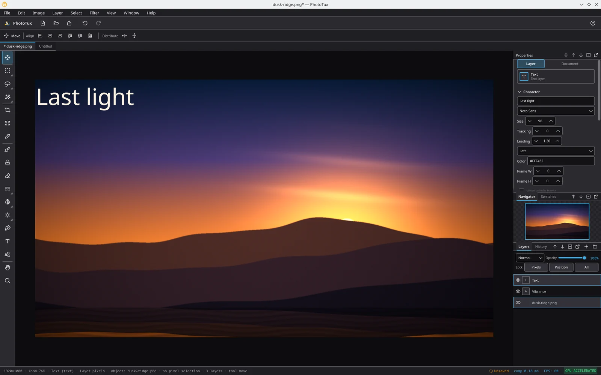

<div align="center">


# PhotoTux

**A GPU-accelerated image editor built for Linux and Wayland.**

Rust and Qt 6 QML. Zero-copy `wgpu`/Vulkan canvas. A dense, Photoshop-shaped
workspace drawn in the idiom of KDE Plasma 6.

[Website](https://phototux.xyz) · [Documentation](https://docs.phototux.xyz) · [Changelog](CHANGELOG.md) · [Contributing](CONTRIBUTING.md)

[](LICENSE)
[](rust-toolchain.toml)
[](https://www.qt.io/)
[](#requirements)

</div>

---

> **Status: early, and honest about it.** PhotoTux is at version 0.1.0 and has
> never been tagged as a release. The editor opens, paints, composites, saves
> and reopens documents, and it is used daily by its author — but it has not
> been through a public beta, the `.ptx` format still moves between versions,
> and there are corners that have only ever been driven by one pair of hands.
> Keep backups of anything you care about.

## Why another editor

Linux has capable image editors. What it does not have much of is an editor
that treats **frame time as a feature**. PhotoTux composites entirely on the
GPU and never moves pixel buffers across the Rust↔Qt boundary during
interaction — the canvas texture is written by `wgpu` and presented by Qt's
Vulkan RHI on the same device, so a 4K document with a stack of layers scrolls
at the refresh rate of the monitor rather than the speed of a memcpy.

The second half is the shell. Panels, tools and menus sit where Adobe
Photoshop puts them, so muscle memory carries over, and every pixel of chrome
is drawn from a single token file that follows KDE Plasma 6's spacing, shapes
and focus treatment. Photoshop decides *where*; Plasma decides *how it looks*.

## Features

**Canvas and compositing**
- Zero-copy GPU compositing on `wgpu`/Vulkan — no CPU pixel upload in the
  steady-state view path
- 28 blend modes, grouped the way the Photoshop menu groups them, including
  the non-separable Hue / Saturation / Color / Luminosity set
- Zoom ladder that passes through 100% exactly, pointer-anchored wheel zoom,
  fit-on-screen, Navigator panel

**Layers**
- Raster, group, text, shape, fill, adjustment and smart-object layers
- Per-layer opacity, blend mode, clipping, locks and Blend If ranges
- Layer masks with mask ⇄ selection round-trips
- Duplicate, Merge Down, Merge Visible, Flatten Image, Group / Ungroup, Align
  and Distribute
- Eight layer styles: Drop Shadow, Inner Shadow, Outer Glow, Inner Glow,
  Stroke, Color Overlay, Gradient Overlay, Bevel

**Non-destructive editing**
- Smart objects — a transform re-applies to the pristine source instead of
  accumulating on the pixels
- Adjustment layers: Brightness/Contrast, Levels, Hue/Saturation, Invert,
  Threshold, Posterize, Exposure, Vibrance, Black & White, White Balance
- A filter plan per layer with 13 effects: Gaussian Blur, Box Blur, Motion
  Blur, Zoom Blur, Sharpen, Unsharp Mask, High Pass, Clarity, Denoise,
  Emboss, Add Noise, Offset, Invert
- A filter gallery that previews without touching the document until you
  commit

**Tools**
- Move, Rectangular and Elliptical Marquee, Lasso, Polygonal Lasso, Magic
  Wand, Color Range, Crop, Free Transform, Eyedropper
- Brush, Clone Stamp, Eraser, Gradient, Paint Bucket
- Blur, Sharpen, Smudge, Dodge, Burn, Sponge
- Pen / Path Edit, Text, Shape, Hand, Zoom

**Selections**
- Rectangular, elliptical, freehand, polygonal, by colour
- Add / subtract / intersect combination, Select All, Deselect, Inverse
- Modify ▸ Expand, Contract, Feather, Border and Smooth, each asking for its
  radius rather than guessing

**Files**
- `.ptx` — the native layered document, a chunked container with per-layer
  rasters, masks and smart-object sources
- Layered PSD import and export, with a compatibility report naming anything
  the subset could not carry
- PNG, JPEG, WebP, TIFF, BMP and GIF import and export
- ICC profile embedding, assignment, conversion and soft-proofing
- Crash recovery for documents open when a session ends badly

**Workspace**
- Dockable panels: Layers, Properties, History, Navigator, Adjustments,
  Channels, Paths, Brushes, Swatches, Info
- Workspace presets, a command palette, and rebindable shortcuts with
  conflict detection
- Document tabs

Every command in the editor also exists as an entry in the command palette
(`Ctrl+Shift+P`) and as a rebindable action.

## Screenshots

<div align="center">



</div>

More, with context, in the [user guide](https://docs.phototux.xyz/guides/tour/).

## Requirements

| | |
|---|---|
| **OS** | Linux. Wayland is the target session; X11 works but is not what the frame budgets are measured against. |
| **GPU** | A working Vulkan driver. Mesa (`radv`, `anv`, `nvk`), AMDVLK or the proprietary NVIDIA driver all qualify. |
| **Qt** | 6.10 or newer, with `qtdeclarative` and `qtsvg`. |
| **Rust** | 1.87 or newer, edition 2024, if you are building from source. |

PhotoTux is a **desktop GUI application**. There is no CLI or TUI product, and
Windows and macOS are out of scope for v1.

## Build from source

There are no distribution packages yet — building from source is the way in.

```bash
git clone https://github.com/PerkyZZ999/Phototux.git
cd Phototux
export PATH=/usr/lib/qt6/bin:$PATH
export QMAKE=/usr/lib/qt6/bin/qmake
cargo run --release -p phototux
```

The `PATH` and `QMAKE` exports matter on any distribution that ships Qt 5's
`qmake` first — the build links against whichever Qt `qmake` reports, and Qt 5
is not it. Arch Linux dependencies:

```bash
sudo pacman -S --needed rust qt6-base qt6-declarative qt6-svg vulkan-icd-loader cmake
```

First launch opens **New Document** with 720p / 1080p / 2K / 4K presets.
Full instructions, including other distributions and troubleshooting, are in
the [installation guide](https://docs.phototux.xyz/guides/installation/).

## Documentation

| Audience | Where |
|---|---|
| **Users** — guides, tools, shortcuts, troubleshooting | [docs.phototux.xyz](https://docs.phototux.xyz) |
| **Contributors** — architecture, subsystem contracts, decisions | [`internal_docs/`](internal_docs/README.md) |
| **Contributors** — workflow, quality gate, crate map | [32 — Developer Guide](internal_docs/32-Developer-Guide.md) |
| **Contributors** — why things are the way they are | [Decision Register](internal_docs/Appendix/Decision-Register.md) |
| **Agents** — coding constitution | [AGENTS.md](AGENTS.md) |

The Engineering Handbook in [`internal_docs/`](internal_docs/README.md) is the
authoritative description of the system. The public documentation site is
generated from a separate source tree in [`web/docs/`](web/docs/) and is
written for people using the editor rather than building it.

## Contributing

Bug reports, patches and QML polish are all welcome. Start with
[CONTRIBUTING.md](CONTRIBUTING.md) — it covers the workspace layout, the
quality gate (`rust-tc quick` before a push, `rust-tc doctor` before anything
substantial), and the conventions the codebase holds to.

Security issues go to [SECURITY.md](SECURITY.md) rather than the public
tracker. Everyone taking part is expected to follow the
[Code of Conduct](CODE_OF_CONDUCT.md).

## Licence

PhotoTux is free software, licensed under the
**[GNU General Public License v3.0 or later](LICENSE)**.

Icons are [Phosphor Icons](https://phosphoricons.com/), MIT licensed.

## Authors

- **Charles W. (PerkyZZ999)** — author and maintainer
- **Claude/Cursor** — AI pair programming
