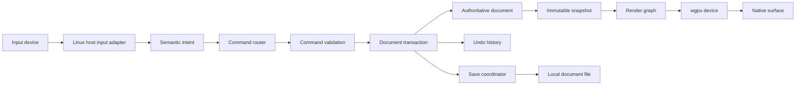
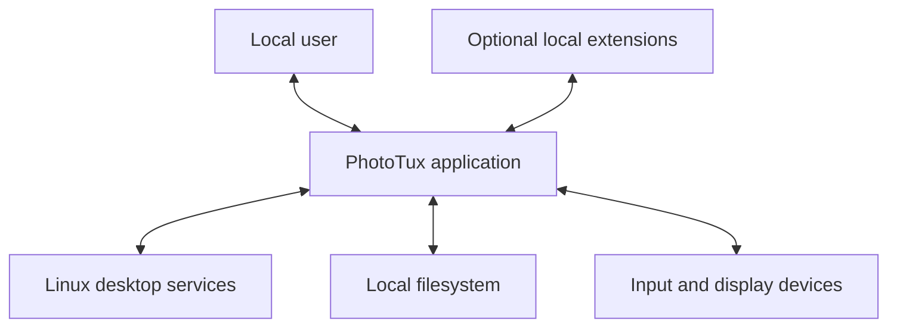
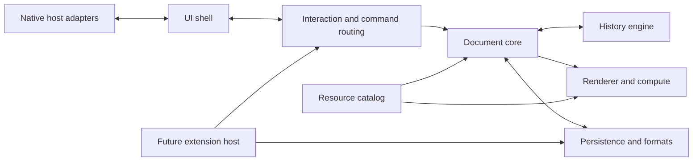
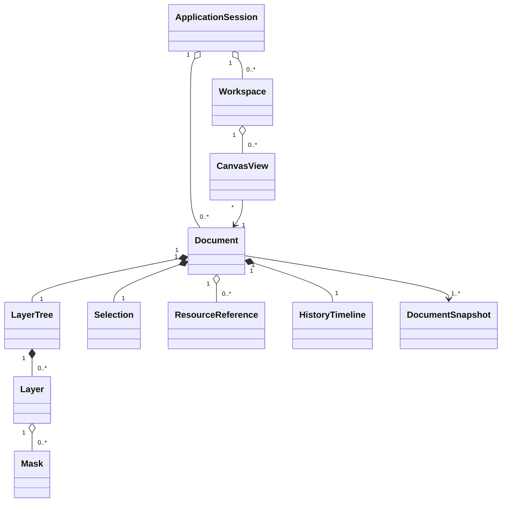
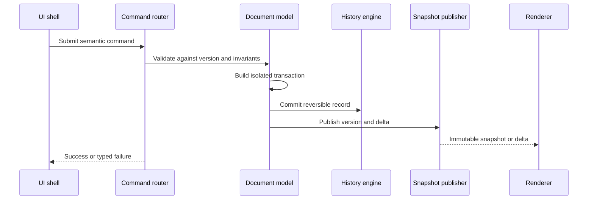
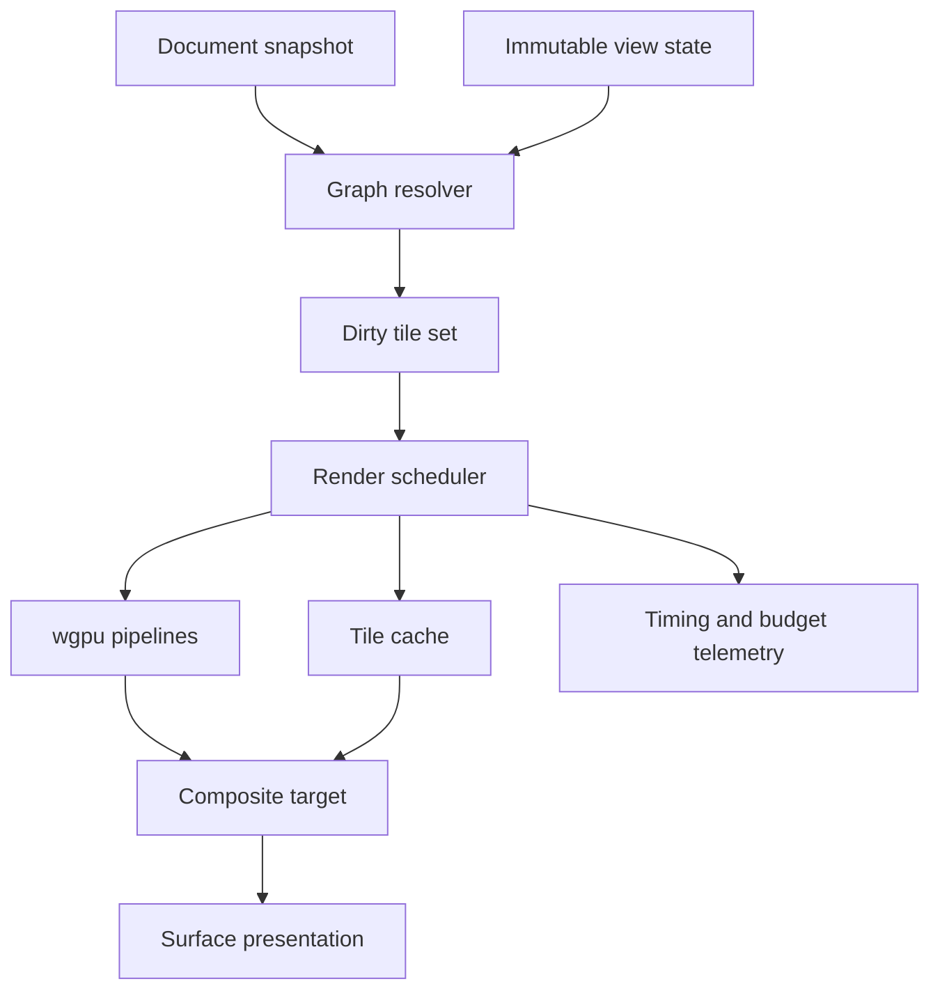
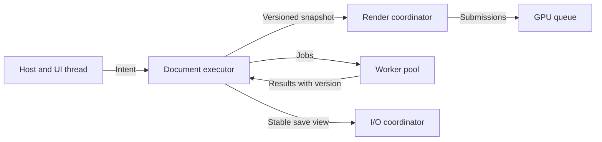
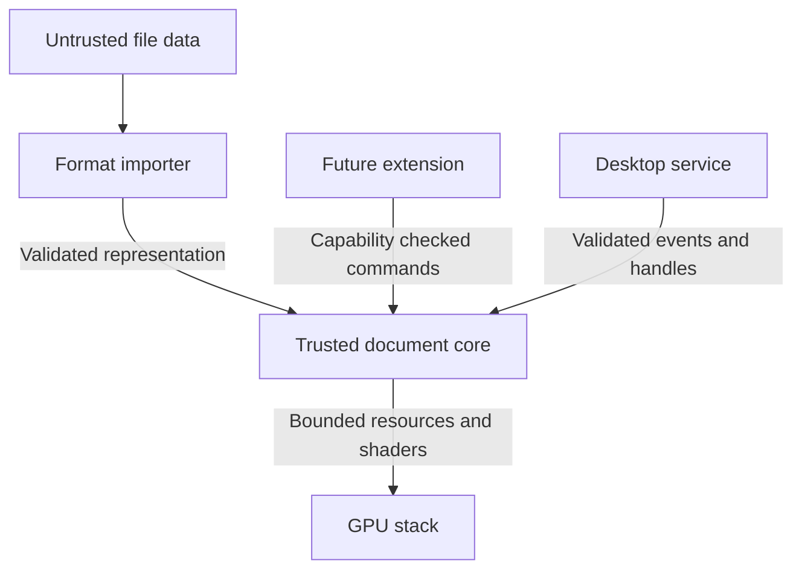
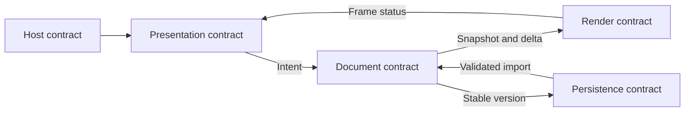

# 00 — Introduction and System Charter

## Overview

PhotoTux is a Linux-native professional raster editor for photographers, illustrators, texture artists, prepress operators, and technical imaging specialists. It offers a familiar document, canvas, layer, mask, selection, tool, and panel model without copying proprietary branding or vendor-specific workflows. The product is local-first: documents, preferences, color resources, brushes, scripts, and extensions remain under user control. Cloud services, user accounts, telemetry-dependent features, AI or generative tools, and proprietary service integrations are outside the product boundary.

This charter establishes system intent, vocabulary, ownership boundaries, architectural constraints, provisional quality targets, and the reading order for the engineering handbook. Normative words such as **MUST**, **SHOULD**, and **MAY** have the meanings defined in [Requirement Keywords](Appendix/Requirement-Keywords.md).

PhotoTux is not “an image editor written around a widget toolkit.” It is a document engine, command system, GPU renderer, and native desktop host composed through explicit interfaces. The cross-platform core owns portable editing semantics. Linux host adapters own native integration. User-interface technology, async runtime, extension packaging, and binary plugin ABI remain open decisions until measured prototypes establish constraints.

## Product Responsibilities

PhotoTux MUST:

- edit raster documents non-destructively where the document model permits;
- support precise destructive operations through explicit, undoable transactions;
- preserve document integrity across cancellation, failed commands, device loss, and process interruption;
- make color, alpha, transforms, masks, selections, and layer compositing semantics explicit;
- remain responsive while rendering, importing, exporting, filtering, and indexing resources;
- expose familiar concepts without requiring knowledge of another product’s terminology;
- integrate with Linux conventions for files, windows, input, accessibility, color management, and desktop portals;
- keep core editing behavior testable without a graphical desktop;
- permit future host platforms without reducing Linux-native quality to a lowest common denominator.

PhotoTux SHOULD:

- keep edits reversible until users explicitly flatten, rasterize, overwrite, or discard;
- provide deterministic command replay where floating-point and device constraints permit;
- degrade intentionally when GPU features, memory, or optional integrations are unavailable;
- expose progress and cancellation for operations perceptible to users;
- separate saved document state from workspace state and process-local caches.

PhotoTux MAY:

- offer multiple workspace arrangements;
- support sandboxed extensions or automation after capability and compatibility policies are defined;
- use CPU implementations for correctness fallback, import/export, or algorithms unsuitable for GPU execution;
- provide platform hosts beyond Linux while retaining one portable semantic core.

## Product Boundaries

### Included

The product boundary includes document creation and persistence, raster layer editing, masks, selections, transforms, brushes, compositing, color conversion, filters, metadata policy, import/export, workspace management, keyboard and pointing-device input, accessibility semantics, crash recovery, resource management, and extension seams.

### Excluded

The following are deliberately excluded:

- cloud document storage, synchronization, collaboration, or remote rendering;
- product accounts, identity providers, subscriptions, or entitlement services;
- AI-assisted selection, generated pixels, generative fill, prompt interfaces, model downloads, or inference runtimes;
- proprietary file-service integrations and workflows named after another vendor;
- bundled asset marketplaces or remote content catalogs;
- network requirements for normal editing;
- premature promises of source or binary plugin compatibility;
- commitment to a UI toolkit, application runtime, or stable plugin ABI before validation.

Importing documented third-party file formats is not a proprietary workflow. Such support MUST be isolated behind format adapters, tested against independent fixtures, and described in format-neutral terms.

## System Principles

1. **Document owns truth.** Persistent editable state belongs to the document model. Views, panels, render caches, and GPU resources are projections.
2. **Commands are mutation spine.** Every user-visible mutation enters through a command. Commands validate preconditions, declare affected regions or objects, and produce an undoable transaction or a typed failure.
3. **History stores transactions.** Undo and redo operate on committed transactions, not UI events and not arbitrary snapshots of the entire process.
4. **Rendering reads immutable state.** Render workers consume versioned snapshots and bounded deltas. They MUST NOT mutate the authoritative document.
5. **GPU first, not GPU only.** wgpu is the primary rendering and compute abstraction. Correctness, recoverability, and device compatibility outrank theoretical throughput.
6. **Concurrency is explicit.** Thread affinity, ownership, cancellation, backpressure, and snapshot lifetime are API concerns.
7. **Native at edges.** Linux host adapters provide desktop integration without leaking host APIs into portable editing semantics.
8. **Local capability, least authority.** File and extension operations receive only required resources and capabilities.
9. **Measure before freezing.** Toolkit, runtime, plugin ABI, tile size, and scheduling policy remain provisional until representative workloads are profiled.
10. **Errors remain actionable.** Failures identify affected operation, preserved state, recovery path, and diagnostic context.

## Personas and Core Workflows

### Production Artist

Works with many layers, masks, adjustment operations, large brushes, and reference windows. Requires low-latency input, predictable compositing, non-destructive iteration, and stable workspace restoration. Typical flow:

1. open or create document;
2. establish color profile and canvas;
3. organize layers and groups;
4. paint, select, transform, mask, and adjust;
5. compare views at multiple zoom levels;
6. save editable source;
7. export delivery variants.

### Photographer and Imaging Specialist

Handles high-bit-depth source images, color-managed previews, masks, local corrections, metadata, and precise exports. Requires correct profile handling, histogram semantics, deterministic filters, and clear destructive boundaries.

### Technical Artist

Builds texture sets, channel-packed images, sprites, or UI assets. Requires exact dimensions, repeatable commands, batchable exports, alpha inspection, snapping, and file-system interoperability.

### Extension Engineer

Adds formats, commands, filters, tools, or panels through future extension surfaces. Requires versioned contracts, capability boundaries, deterministic test harnesses, and no dependence on private UI internals.

### Core Engineer

Optimizes document storage, scheduler behavior, renderer pipelines, and command semantics. Requires headless fixtures, traceable transactions, bounded memory, reproducible failures, and stable subsystem interfaces.

## Representative End-to-End Workflow



Pointer movement can update transient tool previews without committing document state. The final gesture produces a semantic command. The command router validates document version, target availability, permissions, and resource limits. A successful transaction atomically updates document state and history. Render invalidation derives from transaction effects, not from widget repaint requests.

## Quality Attributes and Provisional Targets

Targets are hypotheses for representative 2026 desktop hardware and MUST be revised from measurement. Benchmark fixtures, hardware tiers, image sizes, and confidence intervals MUST accompany claims.

### Responsiveness

- Input-to-preview latency SHOULD remain below 16 ms at the 95th percentile for brush strokes on a 4096 × 4096, 8-bit RGBA document with a representative brush and visible layer stack.
- Input handling MUST avoid blocking on file I/O, shader compilation, full-document locks, or extension execution.
- Menu and panel actions SHOULD acknowledge within 100 ms; operations exceeding 250 ms SHOULD expose progress or a stable busy state.
- Cancellation SHOULD be observed within 100 ms for cooperative CPU tasks and within one bounded GPU submission unit for GPU work.

### Rendering

- Interactive viewport presentation SHOULD sustain 60 frames per second on the reference hardware tier when only view transforms and cached compositing are required.
- Dirty-region updates SHOULD avoid reprocessing unaffected tiles.
- Device loss MUST preserve authoritative document state and MUST permit renderer reconstruction or an explicit controlled shutdown.
- Render output MUST define color space, alpha convention, precision, edge sampling, and blend semantics.

### Scale and Memory

- Foundation design MUST support documents larger than available GPU memory.
- A 16k × 16k, 16-bit RGBA document with 50 mixed layers MUST remain openable under a configurable memory budget through tiling, eviction, and lazy materialization.
- Cache owners MUST publish byte accounting. Eviction MUST NOT discard authoritative unsaved state.
- History retention SHOULD be budget-based with visible policy, not an unbounded list.

### Reliability

- A committed transaction MUST leave document invariants valid or roll back fully.
- Saving MUST use staged writes and atomic replacement where the filesystem supports it.
- Recovery metadata SHOULD bound potential lost work to 60 seconds during active editing under default policy.
- Importers MUST treat input as untrusted and MUST enforce depth, dimensions, allocation, and decompression limits.

### Portability and Maintainability

- Core document and command tests MUST run headlessly.
- Host-specific modules MUST NOT be dependencies of core model crates.
- Public internal interfaces SHOULD use explicit data contracts rather than toolkit object references.
- Architectural decisions with high reversal cost MUST be captured before implementation lock-in.

### Accessibility

- All actionable UI concepts MUST expose role, name, state, availability, and action semantics.
- Keyboard access MUST cover every operation available through primary menus, excluding inherently continuous pointer gestures where an equivalent parameterized command exists.
- Focus indication MUST remain visible at 200% scale and high-contrast settings.

## Context View



No network actor is required. Desktop services include file dialogs or portals, clipboard, drag and drop, color-management discovery, accessibility bus, notifications, recent files, power/session events, and window management. Every integration is optional at runtime and MUST fail without corrupting documents.

## Container View



Container arrows indicate authority or data exchange, not crate dependencies. Detailed dependency direction MUST keep policy inward and platform mechanisms outward.

## Internal Hierarchy and Subsystem Map

```text
PhotoTux Process
├── Host Layer
│   ├── Window/surface adapter
│   ├── Input and shortcut adapter
│   ├── Dialog/portal adapter
│   ├── Clipboard and drag/drop adapter
│   └── Accessibility and desktop lifecycle adapter
├── Presentation Layer
│   ├── Application shell
│   ├── Workspace and panel composition
│   ├── Canvas views
│   └── Semantic action presentation
├── Interaction Layer
│   ├── Intent normalization
│   ├── Tool state machines
│   ├── Command routing
│   └── Validation and feedback
├── Domain Layer
│   ├── Document model
│   ├── Object identity and graph
│   ├── Selection and mask semantics
│   ├── Transaction/history engine
│   └── Snapshot and delta publication
├── Compute Layer
│   ├── Render graph
│   ├── Tile/cache manager
│   ├── GPU pipelines
│   └── CPU fallback kernels
└── Services Layer
    ├── Persistence and recovery
    ├── Import/export codecs
    ├── Color/resource management
    ├── Diagnostics
    └── Future extension isolation
```

The UI shell presents actions but does not define their semantics. Tool state machines may hold ephemeral gesture data, yet committed pixels, paths, selections, masks, and transforms reside in the document. The renderer may retain derived caches keyed by document version, object identity, tile coordinate, and render parameters.

## Document and Object Relationships



Views do not own documents. Closing a view need not close its document when another view, save operation, or recovery operation retains it. Object identifiers MUST remain stable across ordinary edits and MUST NOT be reused within a document lifetime.

## Command and Transaction Architecture

A command is a validated request to change domain state. It carries semantic parameters, target object identifiers, expected document version or conflict policy, provenance, and cancellation context. Commands SHOULD be serializable for diagnostics and repeatability, but serialization MUST exclude secrets and uncontrolled binary payloads.

A transaction is the atomic result of executing one command or a defined command group. It contains:

- before/after semantic deltas or reversible operations;
- affected object and spatial regions;
- resource changes;
- history label and merge policy;
- renderer invalidation hints;
- persistence dirtiness;
- diagnostic correlation identifier.



Failed validation produces no transaction. Mid-execution failure MUST either abandon isolated changes or apply a tested rollback path. UI components MUST NOT construct history entries directly.

## Rendering Architecture

Rendering consumes an immutable logical snapshot plus view parameters. It resolves the layer graph, color transforms, masks, effects, and tile dependencies into scheduled work. wgpu provides portable GPU abstraction and shader execution. The architecture MUST assume:

- multiple adapters and feature tiers;
- device loss and surface reconfiguration;
- limited GPU memory;
- asynchronous map and submission behavior;
- pipeline compilation cost;
- platform-dependent presentation;
- precision differences requiring bounded tolerances.



Telemetry here means local diagnostics, not remote collection. Diagnostic export MUST be explicit and user initiated.

## Data and Control Flows

### Interactive Edit

1. Native input adapter timestamps and normalizes input.
2. Interaction layer resolves focused view, active tool, modifiers, and capture.
3. Tool state machine updates transient preview state.
4. Gesture completion submits one command or a bounded stream of mergeable commands.
5. Document worker validates and commits transaction.
6. Snapshot publisher emits new version and dirty regions.
7. Renderer schedules high-priority visible work and lower-priority offscreen work.
8. UI receives semantic completion and updates enabled states.

### Open

1. Host adapter grants a file handle or path.
2. Sniffer identifies format under bounded reads.
3. Decoder runs with allocation and recursion limits.
4. Imported representation is validated into a document transaction.
5. Document becomes visible only after minimum coherent state exists.
6. Additional thumbnails, profiles, and tiles MAY load incrementally.

### Save

1. Save coordinator captures a stable document version.
2. Encoder writes to a sibling temporary file or host-provided replace stream.
3. Data and required metadata are flushed.
4. Atomic replace occurs where supported.
5. Document dirty state clears only if saved version still equals current version.
6. A newer edit remains dirty without invalidating the completed save.

### Undo and Redo

History selects the prior or next transaction, checks required resources, applies inverse or forward operations atomically, publishes a new document version, and invalidates derived render state. Undo is itself state evolution; versions MUST remain monotonic.

## Threading and Ownership

Thread names describe roles, not a final runtime:

- **Host/UI thread:** native event loop, window operations, accessibility bridge, lightweight presentation state.
- **Document executor:** serializes authoritative mutations per document or through an equivalent conflict-safe model.
- **Render coordinator:** receives immutable snapshots, prioritizes views, constructs GPU submissions.
- **Worker pool:** CPU filters, decoding, encoding, compression, thumbnails, and indexing.
- **I/O coordinator:** staged persistence and recovery scheduling.
- **Extension executors:** future isolated workers with explicit budgets and cancellation.



Rules:

- UI thread MUST NOT wait synchronously for GPU completion or unbounded document work.
- Worker results MUST carry source version and applicability conditions.
- Stale results MUST be discarded or rebased by explicit policy.
- Document locks MUST NOT be held across external code, filesystem I/O, shader compilation, or UI callbacks.
- Cancellation MUST be cooperative and idempotent.
- Channels and queues MUST be bounded or have a documented shedding policy.
- GPU resource lifetime MUST be decoupled from document object lifetime.

## Trust Boundaries



Raster files can contain hostile dimensions, malformed compression streams, recursive metadata, invalid profiles, and payloads designed for parser bugs. Extensions are untrusted unless shipped as part of the same release and reviewed under core policy. GPU drivers and desktop services are privileged external dependencies and can fail or return inconsistent capabilities.

Security requirements:

- parsers MUST use checked arithmetic and allocation budgets;
- paths MUST NOT be reconstructed from untrusted metadata;
- save/export MUST not follow surprising symlink or replacement behavior without host policy;
- extensions MUST receive capabilities, not ambient filesystem authority;
- diagnostics MUST redact paths and document metadata unless explicitly included;
- shader inputs and dimensions MUST be validated before dispatch;
- clipboard and drag payloads MUST use the same validation as opened files.

## Failure Philosophy

The document is more valuable than the current operation. Fail closed around mutation, but preserve inspectability and recovery.

Failures are classified:

- **User-correctable:** invalid parameters, read-only target, insufficient export options. Keep state unchanged and explain remedy.
- **Resource pressure:** memory, disk, descriptor, or GPU limits. Cancel lowest-priority derived work, preserve document truth, and offer reduced operation.
- **External failure:** filesystem disconnect, portal denial, codec failure, device loss. Isolate adapter, preserve document, and permit retry.
- **Invariant failure:** impossible graph, transaction mismatch, corrupted history. Stop affected mutations, snapshot diagnostics, preserve recovery data, and avoid speculative repair.
- **Process-fatal:** allocator or runtime condition prevents safe continuation. Attempt bounded recovery write only if doing so cannot worsen state.

Error messages SHOULD answer: what failed, what remains safe, whether retry is safe, what data may be affected, and where local diagnostics can be found.

## Linux Host Integration

Linux-native means respecting desktop contracts, not binding the domain model to one toolkit. Host adapters SHOULD cover:

- Wayland-compatible surfaces and input;
- desktop portal file selection where required;
- native file-manager reveal/open behavior;
- clipboard and drag-and-drop MIME negotiation;
- font and color-profile discovery;
- accessibility bridge;
- session shutdown and inhibit semantics during critical writes;
- high-DPI and fractional scaling;
- tablet pressure, tilt, eraser, and device identity;
- theme and reduced-motion signals.

The adapter boundary MUST permit direct desktop APIs where portals are insufficient and policy allows. Toolkit-specific objects MUST terminate at the host or presentation boundary.

## Design Rationale and Alternatives
### GPU-first versus CPU-first

GPU-first supports large compositing graphs, responsive transforms, and reusable compute kernels. Costs include device variance, shader complexity, asynchronous debugging, and memory duplication. CPU fallback remains essential for reference tests and unsupported paths, but a CPU-first architecture would make later GPU scheduling and immutable resource ownership invasive.

### Commands versus mutable view-model binding

Direct bindings are initially simple but blur validation, history, automation, and concurrency. Commands create ceremony but provide one mutation path, deterministic tests, permission checks, and extension mediation.

### Transactions versus whole-document snapshots

Whole snapshots simplify undo but scale poorly for large raster data and obscure resource retention. Transaction records allow tile-level sharing and selective invalidation. Periodic checkpoints MAY accelerate history traversal and recovery.

### Cross-platform core versus cross-platform application shell

A portable shell can reduce initial work but often compromises native input, accessibility, and desktop behavior. PhotoTux standardizes semantic core contracts and lets hosts adapt presentation. This preserves platform quality without forking editing behavior.

### Stable plugin ABI now versus deferred extension contract

An early ABI freezes object layout, threading assumptions, allocator behavior, and failure semantics before they are understood. Foundation work defines extension seams and command capabilities only. Stable out-of-process protocols, WebAssembly components, source-level Rust APIs, or a narrow C ABI remain alternatives for later evaluation.

## Best Practices

- Model operations in domain language: “set layer opacity,” not “slider changed.”
- Keep object IDs stable and versions monotonic.
- Use immutable or copy-on-write structures where they clarify snapshot publication.
- Separate semantic deltas from render invalidation hints.
- Test transaction rollback under injected allocation, codec, and device failures.
- Benchmark full workflows, not isolated kernels only.
- Keep GPU cache keys complete; missing color or transform inputs cause silent corruption.
- Make expensive implicit conversions visible in diagnostics.
- Treat cancellation as ordinary control flow.
- Prefer bounded queues and memory budgets over global emergency cleanup.
- Keep saved-document schema independent from in-memory Rust layout.
- Record rationale before accepting high-cost coupling.

## Future Extensibility

Foundation seams anticipate:

- additional layer and effect node kinds;
- new document encodings and interchange formats;
- command-line or batch hosts;
- multiple synchronized views of one document;
- pressure-aware brush engines;
- nondestructive procedural operations that are deterministic and local;
- sandboxed format and filter extensions;
- alternate GPU backends exposed through wgpu;
- remote-control accessibility interfaces without cloud services;
- other desktop hosts around the same core.

Extensibility does not imply public stability. Each seam MUST acquire compatibility, security, lifecycle, cancellation, and resource policies before third-party commitment.

## Foundation Invariants

The following invariants constrain every downstream design. A subsystem proposal that violates one requires an explicit architecture decision and charter revision.

### State Invariants

- Exactly one authoritative document state exists for each document version.
- A document object ID identifies at most one object during the document lifetime.
- Committed document versions increase monotonically, including undo and redo.
- Failed commands do not publish a new authoritative version.
- Derived state can be discarded and rebuilt without losing user edits.
- A renderer snapshot describes one coherent document version, even if some resources materialize lazily.
- Saved-version identity and current-version identity are tracked separately.
- Workspace and view changes do not alter document modified state unless they change an explicitly persisted document property.

### Transaction Invariants

- A mutating command produces zero or one committed transaction.
- Transaction commit and history registration are observed atomically by document readers.
- Every history entry identifies command meaning, affected object IDs, and reversible representation.
- Transaction merge changes history presentation, not semantic ordering.
- Cancellation before commit leaves no partial authoritative mutation.
- Cancellation after commit is represented by a later command, usually undo; it does not erase an observed commit.
- External callbacks and extension code never execute while authoritative document locks are held.

### Rendering Invariants

- Rendering never writes authoritative document state.
- Render caches include all semantic inputs needed to avoid cross-version or cross-profile reuse.
- Missing cache entries affect latency, not correctness.
- GPU device or surface loss does not invalidate document state.
- Presentation may display an older complete version while a newer version renders; it MUST NOT combine incompatible partial versions without an explicit progressive-render contract.
- Reference output defines tolerances before device-specific optimization is accepted.

### Persistence Invariants

- A destination file is not considered successfully saved until required bytes and metadata have completed the selected durability protocol.
- Saving version N does not clear modifications if version N+1 is current.
- Recovery data is never presented as a substitute for a user-confirmed save.
- Format conversion cannot silently discard unsupported editable structure.
- Untrusted dimensions, offsets, counts, and compressed sizes undergo checked validation before allocation or indexing.

## Subsystem Contracts

Foundation interfaces are conceptual and MAY map to multiple Rust crates. Dependency direction matters more than packaging.

### Host Contract

Host adapters provide normalized input, native surface lifecycle, local file capabilities, clipboard/drag payloads, accessibility bridging, desktop signals, and user-visible dialogs. They return typed capability and failure information. They do not interpret document commands.

### Presentation Contract

Presentation consumes semantic state and action descriptions. It emits intents with stable target identifiers and parameters. It owns ephemeral control state, focus, layout, and animation. It does not bypass command validation.

### Document Contract

The document core accepts commands, validates invariants, commits transactions, exposes immutable versions, and reports precise effects. It does not depend on native windows, GPU surfaces, menus, or filesystem path dialogs.

### Render Contract

The renderer receives a document snapshot, view state, dirty information, priority, and cancellation context. It produces presentation frames, intermediate diagnostics, or typed failures. It cannot assume that source tiles, GPU devices, or target surfaces remain resident indefinitely.

### Persistence Contract

Persistence receives stable document views and explicit file capabilities. It reports the exact encoded version, conversion losses, durability stage, and destination outcome. Import returns a validated intermediate representation rather than mutating a visible document incrementally without transaction boundaries.



## Operational Observability

PhotoTux needs local observability to diagnose latency, device variance, malformed files, and transaction failures without network telemetry.

Diagnostics SHOULD include:

- command correlation ID, type, timing, outcome, and affected counts;
- document version transitions without document content;
- queue depth, cancellation, and stale-result counts;
- CPU/GPU memory budgets, cache hit rates, and eviction;
- render pass and tile timings;
- shader/pipeline compilation events;
- save stage, encoded version, byte counts, and durability result;
- importer limits reached and sanitized format context;
- device capability tier and device-loss reason;
- extension identity, capability use, time, and resource budget.

Diagnostics MUST be bounded, local, redacted by default, and safe when disabled. Paths, layer names, metadata, clipboard content, pixel data, and document thumbnails are private. An explicit diagnostic export MAY include selected sensitive material only after presenting scope to the user.

Trace points MUST not become correctness dependencies. Timing instrumentation SHOULD use monotonic clocks. Correlation IDs SHOULD connect a gesture to action, command, transaction, render invalidation, and presented frame without making those layers share mutable objects.

## Configuration and Compatibility Philosophy

Configuration has four domains:

1. **Document properties:** travel with editable content and affect interpretation or output.
2. **Workspace state:** local arrangement and presentation.
3. **Application preferences:** user-level defaults and behavior.
4. **Operational policy:** budgets, diagnostics, extension permissions, and host capabilities.

Each setting MUST declare domain, default, persistence location, migration behavior, and whether it affects deterministic output. Unknown settings SHOULD survive round trips where safe. Invalid or obsolete settings MUST fall back predictably and produce a local diagnostic.

Compatibility is layered:

- document compatibility protects user data;
- command compatibility protects automation and history where promised;
- extension compatibility protects declared contribution contracts;
- workspace compatibility protects convenience and may degrade more freely;
- diagnostic compatibility is best-effort unless consumed by release tooling.

No in-memory Rust layout is a persistence or ABI promise. Serialized schemas require versioning, validation, limits, and migration tests. Stable IDs and semantic enums SHOULD be used where compatibility matters; exhaustive assumptions across extension boundaries SHOULD be avoided.

## Review Gates

Before foundation direction becomes implementation baseline, evidence MUST cover:

- a headless command/transaction prototype with undo and snapshot publication;
- a wgpu prototype rendering tiled content larger than a selected GPU budget;
- measured brush or continuous-edit latency with bounded command merging;
- save-from-snapshot while newer edits continue;
- injected GPU device loss with document preservation;
- malformed import corpus with allocation limits and fuzzing hooks;
- Linux input/surface prototype demonstrating tablet and fractional-scale constraints;
- accessibility prototype demonstrating semantic layer tree and action registry;
- at least one extension-boundary spike comparing process isolation alternatives without freezing ABI.

Prototype code MAY be disposable. Findings, workload definitions, rejected assumptions, and resulting decisions are durable documentation.

## Decision Status

### Accepted Direction

- Rust for core implementation.
- wgpu for primary GPU abstraction.
- GPU-first rendering and compute.
- Multi-threaded architecture with explicit ownership.
- Cross-platform semantic core.
- Linux-native host adapters.
- Commands as mutation spine.
- Document model as authoritative state owner.
- History as undoable transactions.
- Immutable snapshots and deltas as renderer input.
- Local-first product with no cloud, accounts, or AI/generative functionality.

### Provisional

- Tile dimensions and storage layout.
- Per-document executor model.
- Snapshot representation and delta granularity.
- Shader language and pipeline packaging details within wgpu constraints.
- Cache budgets and hardware tiers.
- Recovery interval and history compaction.
- Extension isolation technology.

### Deferred

- UI toolkit.
- async runtime.
- stable plugin ABI.
- scripting language.
- final native document format.
- release packaging matrix beyond Linux foundation.

## Roadmap

1. **Foundation:** charter, information architecture, normative vocabulary, glossary, and cross-reference map.
2. **Domain specification:** document model, layers, selections, commands, transactions, history, persistence.
3. **Rendering specification:** snapshots, render graph, tiles, color, GPU resources, scheduling, device recovery.
4. **Interaction specification:** tools, input, canvas navigation, action model, accessibility.
5. **Host specification:** Linux integration, lifecycle, files, clipboard, tablets, surfaces.
6. **Extension specification:** capability model, process boundary, versioning, diagnostics.
7. **Validation spikes:** representative large document, brush latency, device loss, staged save, parser hardening.
8. **Decision lock:** select toolkit/runtime only from measured evidence; establish implementation checklists.

## Handbook Navigation

Start with [01 — Information Architecture](01-Information-Architecture.md) for user mental model and action placement. Then use the [Cross-Reference Index](Appendix/Cross-Reference-Index.md) to locate planned domain, rendering, persistence, Linux integration, accessibility, security, testing, and extension specifications. Terms are normalized in the [Glossary](Appendix/Glossary.md). Normative language is defined in [Requirement Keywords](Appendix/Requirement-Keywords.md).

The numbered series is intended to be read in layers:

- 00–01: product and interaction foundation;
- 02–09: application, document, and command domain;
- 10–17: rendering, color, resources, and compute;
- 18–23: interaction, tools, workspace, and accessibility;
- 24–28: persistence, formats, host integration, and extensions;
- 29–32: reliability, security, performance, testing, and delivery.

Later documents are planned until present in the repository. The index names them without broken links.

## Glossary Seed

- **Command:** semantic request to inspect or mutate application/domain state.
- **Transaction:** atomic, validated, undoable state change resulting from a command.
- **Document:** authoritative editable object graph and associated raster resources.
- **Snapshot:** immutable versioned view consumed by readers such as rendering and save.
- **Delta:** bounded description of changes between versions.
- **Canvas view:** viewport onto a document; owns navigation state, not document content.
- **Host adapter:** platform integration implementing a portable core contract.
- **Tool:** interaction state machine translating gestures into previews and commands.
- **Dirty region:** object or spatial scope requiring recomputation.
- **Capability:** explicit authority granted to an extension or adapter.

Canonical definitions live in the [Glossary](Appendix/Glossary.md).

## Acceptance Criteria

Foundation architecture is acceptable when:

- every persistent mutation can be traced through a command and committed transaction;
- renderer APIs can be described without writable document references;
- a headless test can create, edit, undo, redo, snapshot, save, and reopen a document;
- UI thread has no required unbounded waits;
- large-document design does not require all pixels to reside in GPU memory;
- GPU device loss leaves authoritative document state intact;
- import and extension boundaries validate untrusted data and resource use;
- Linux host behavior can evolve without importing toolkit types into domain crates;
- document save distinguishes saved version from current version under concurrent edits;
- accessibility semantics are carried by action and object models, not inferred from pixels;
- quality targets have repeatable fixtures and local measurement;
- deferred decisions remain genuinely replaceable behind named interfaces;
- no feature requires cloud access, product account, AI model, proprietary service, or vendor-specific workflow.

## Cross References

- [01 — Information Architecture](01-Information-Architecture.md)
- [Glossary](Appendix/Glossary.md)
- [Requirement Keywords](Appendix/Requirement-Keywords.md)
- [Cross-Reference Index](Appendix/Cross-Reference-Index.md)
- Planned: 04 — Document Model
- Planned: 06 — Commands and Transactions
- Planned: 07 — History and Undo
- Planned: 10 — Rendering Architecture
- Planned: 24 — Persistence and Recovery
- Planned: 26 — Linux Host Integration
- Planned: 28 — Extension Architecture
- Planned: 29 — Reliability and Failure Handling
- Planned: 30 — Security and Trust Boundaries
- Planned: 31 — Performance and Concurrency
- Planned: 32 — Verification and Delivery
