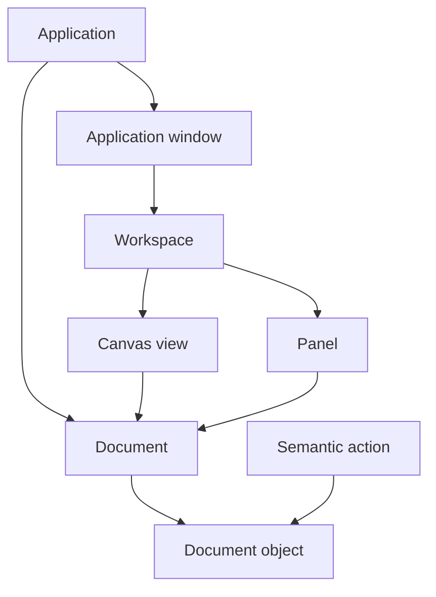
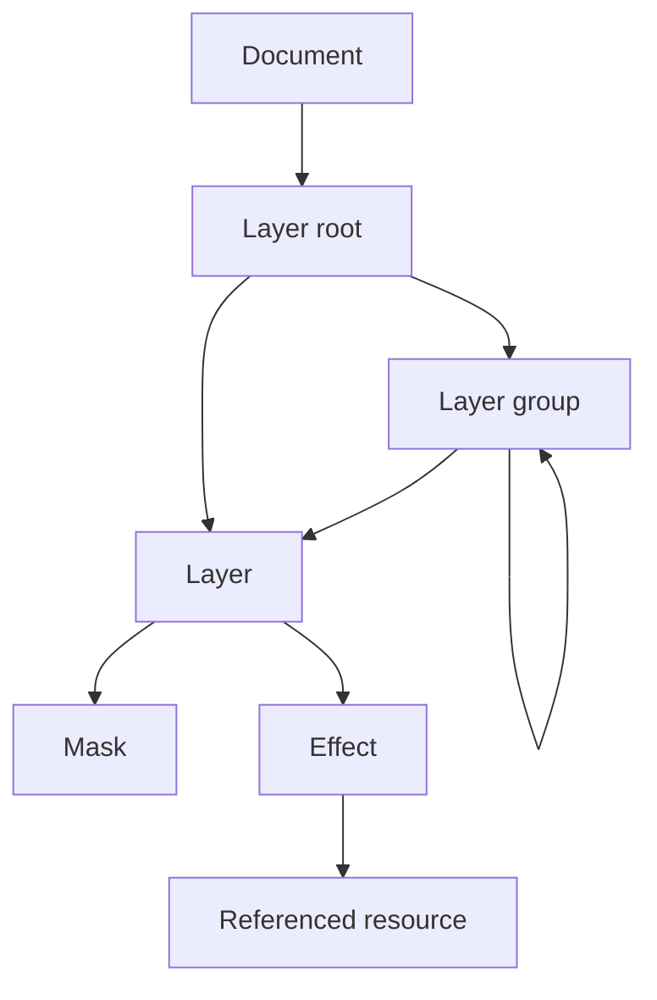
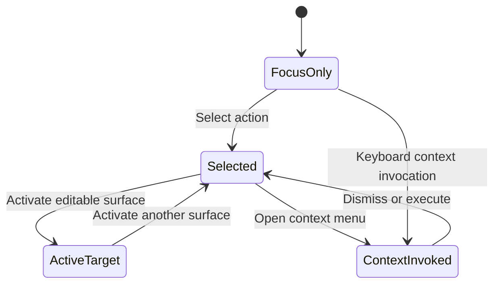
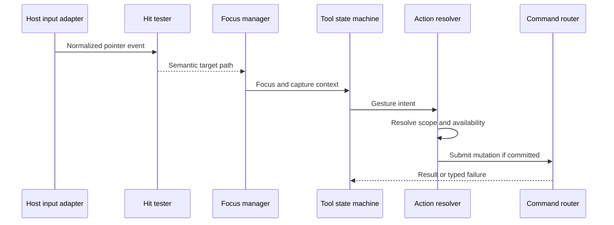
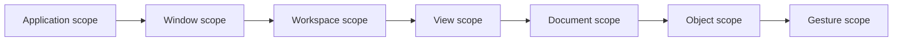
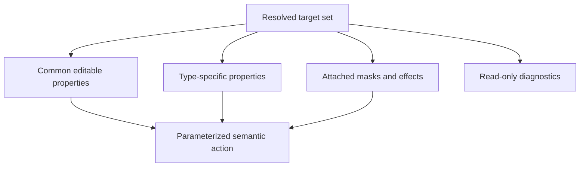
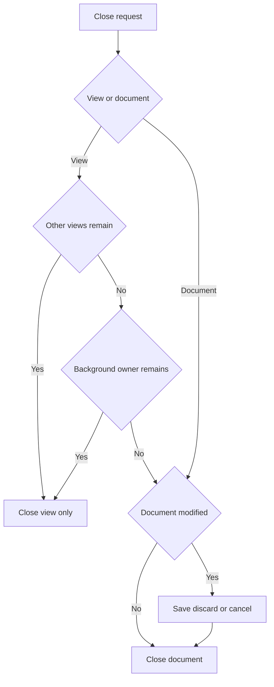
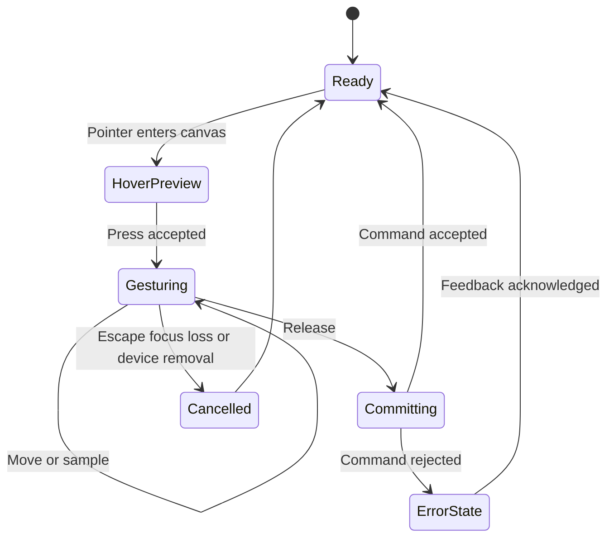
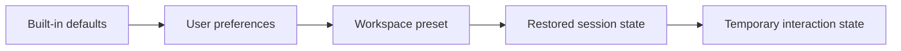
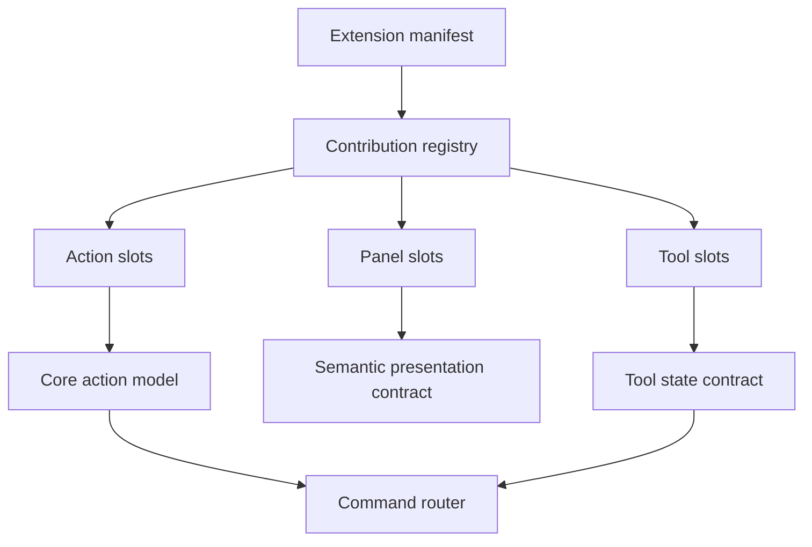

# 01 — Information Architecture

## Overview

PhotoTux information architecture translates a complex raster-editing system into a stable user mental model. Experienced raster-editor users should recognize documents, canvases, layers, masks, selections, tools, properties, history, resources, and export without relying on another vendor’s labels or menu geography. Engineers should be able to map every visible concept to an owner, semantic action, accessibility representation, persistence policy, and extension boundary.

This specification governs application hierarchy, workspace organization, navigation, action placement, universal pointer grammar, selection/focus/context distinctions, context-menu completeness, progressive disclosure, naming, discoverability, information scent, accessibility semantics, and extensibility. It deliberately does not select a UI toolkit or prescribe pixel styling. Normative keywords follow [Requirement Keywords](Appendix/Requirement-Keywords.md).

The central rule is:

> Users manipulate document objects through semantic actions presented in context. Views reveal state; they do not become state owners.

## Responsibilities

The information architecture MUST:

- expose one coherent hierarchy from application to workspace, document, view, object, property, and operation;
- make active document, focused view, selected objects, active tool, and contextual target independently observable;
- place actions according to scope and frequency, not implementation ownership;
- preserve equivalent semantic actions across menu, shortcut, toolbar, panel, command search, and context menu;
- keep destructive, irreversible, expensive, or scope-broad operations explicit;
- provide predictable click, drag, double-click, and secondary-click behavior;
- support keyboard, pointer, pen, touchpad, and accessibility technology without creating separate products;
- let extensions add concepts only through declared slots and semantic contracts;
- remain usable with panels hidden, reordered, resized, or moved;
- distinguish document content from workspace state and application preferences.

It SHOULD:

- minimize modal interaction;
- preserve spatial context during property editing;
- show likely next actions near their objects;
- expose advanced control through progressive disclosure rather than parallel basic/advanced modes;
- keep action names stable even when presentation differs by context;
- permit experienced users to work without forcing novice tutorials into the primary surface.

It MAY:

- offer workspace presets;
- allow customizable shortcuts, tool groups, panel layouts, and command favorites;
- adapt low-frequency actions to narrower windows while preserving command search and menu access.

## User Mental Model

Users should understand PhotoTux as five nested ideas:

1. **Application:** manages windows, documents, preferences, resources, and application-wide actions.
2. **Workspace:** arranges views and panels for a task. It is presentation state, not document content.
3. **Document:** owns editable pixels, object graph, color metadata, selection channels, and history.
4. **Canvas view:** shows one document through zoom, pan, rotation, proofing, overlays, and display options.
5. **Object and operation:** layers, masks, selections, guides, and resources are targets; tools and commands act on them.



The visible tree is not an ownership tree. A document can appear in multiple canvas views. A panel can follow the active document or be pinned to one. A window can contain one or more workspaces depending on host capabilities. Closing a view removes a projection; closing a document invokes document lifecycle policy.

## Application Hierarchy

### Application Session

The application session owns process-lifetime coordination:

- open document registry;
- window and workspace registry;
- global resource catalogs;
- preferences;
- recent local items;
- recovery discovery;
- command registry;
- extension registry;
- host integration status.

Session state MUST NOT silently become document state. Changing workspace layout MUST NOT dirty a document. Changing a document’s embedded color profile MUST.

### Window

A window is a native top-level host surface. It presents application menus or equivalent action access, workspace chrome, document views, and panels. Window close requests MUST resolve unsaved documents across all views and windows without assuming one document per window.

### Workspace

A workspace is an arrangement of canvas regions, panels, tool presentation, status information, and navigation affordances. Workspaces SHOULD be serializable independently from documents. A workspace preset stores layout and visibility, not current document selections or private file paths unless explicitly documented.

### Document

A document is the unit of editable persistence and history. Document identity MUST remain stable while open. Display name may derive from file name, imported source, untitled sequence, or user-assigned title; identity MUST NOT depend on display name.

### Canvas View

A canvas view owns:

- zoom and pan;
- view rotation and mirroring;
- display proofing mode;
- overlay visibility;
- pixel-grid and guide presentation;
- viewport size and device scale;
- temporary navigation state.

It does not own layers, selection content, masks, or history. Two views of one document MAY show different zoom, channels, overlays, or proofing while sharing mutations.

### Panels

Panels expose object structure, properties, resources, navigation, history, and diagnostics. Panels MUST declare whether they follow:

- application scope;
- active document;
- focused canvas view;
- selected object set;
- pinned object or document.

Ambiguous following behavior causes cross-document edits and is forbidden.

## Internal Hierarchy

```text
Application
├── Global actions
│   ├── New/Open/Preferences
│   ├── Resource management
│   └── Window/workspace management
├── Window
│   ├── Primary action access
│   ├── Workspace
│   │   ├── Tool presentation
│   │   ├── Canvas region
│   │   │   ├── Document tab/list item
│   │   │   ├── Canvas view
│   │   │   └── View overlays
│   │   ├── Object panels
│   │   │   ├── Layers
│   │   │   ├── Masks/channels
│   │   │   └── Properties
│   │   ├── Resource panels
│   │   │   ├── Brushes
│   │   │   ├── Gradients/patterns
│   │   │   └── Presets
│   │   └── Temporal panels
│   │       ├── History
│   │       ├── Progress/tasks
│   │       └── Diagnostics
│   └── Status region
└── Document registry
    └── Document
        ├── Object graph
        ├── Selection state
        ├── History
        └── Save/recovery state
```

Primary hierarchy MUST remain intelligible when every optional panel is hidden. Menu/action search, canvas, document identity, active tool, and critical status cannot depend on a particular panel.

## Spatial Layout Model

Exact placement is toolkit- and form-factor-dependent, but the default desktop workspace SHOULD preserve this spatial grammar:

```text
┌─────────────────────────────────────────────────────────────────────┐
│ Application actions │ Document identity │ View controls │ Status   │
├──────────┬──────────────────────────────────────────┬───────────────┤
│ Tools    │ Canvas region                            │ Object stack  │
│          │ ┌──────────────────────────────────────┐ │ Layers        │
│          │ │                                      │ │ Masks         │
│          │ │              Document                │ ├───────────────┤
│          │ │              viewport                │ │ Properties    │
│          │ │                                      │ │ Contextual    │
│          │ └──────────────────────────────────────┘ │ controls      │
├──────────┴──────────────────────────────────────────┴───────────────┤
│ Tool hints │ Coordinates/sample │ Progress │ Color/profile status │
└─────────────────────────────────────────────────────────────────────┘
```

This establishes information scent:

- left or compact edge: what action/tool will be used;
- center: where document content is manipulated;
- object stack: what content is targeted and how it is ordered;
- properties: how selected context is parameterized;
- top: application/document/view scope transitions;
- bottom/status: transient feedback, measurements, progress, and warnings.

Alternative layouts MAY move regions. Labels, roles, action IDs, and following behavior MUST remain stable.

## Object Navigation Hierarchy

Object navigation follows containment and effect order:



The layer panel MUST expose parent/child relation, compositing order, visibility, lock state, active edit target, and relevant mask/effect attachment. Indentation alone is insufficient; accessibility level, expanded state, and position MUST also be available.

Navigation operations:

- Up/Down: move focus among visible siblings or rows.
- Left: collapse expanded node; otherwise move to parent.
- Right: expand collapsed node; otherwise move to first child.
- Home/End: first/last visible item.
- Type-ahead: locate by visible name.
- Range extension: expand object selection from anchor.
- Toggle selection: add/remove focused item without losing prior selection.
- Activate: make focused object the primary edit target when valid.

Focus movement MUST NOT implicitly reorder, delete, toggle visibility, or alter pixels.

## Selection, Focus, Context, and Active Target

These states are related but not interchangeable.

### Selection

Selection identifies one or more objects or a pixel/shape region to which commands may apply. Object selection belongs to interaction state associated with the document and view policy; pixel selection is document content when it affects editing and persistence.

### Focus

Focus identifies the control or view receiving keyboard input. Exactly one focus locus exists per active window. Focus may sit on a layer row that is not selected when keyboard navigation uses a roving focus model.

### Context Target

Context target is the object under a secondary click or invocation point. Opening a context menu MUST NOT necessarily replace the current selection. Policy:

- if context target is inside current selection, actions apply to current selection;
- if context target is outside current selection, non-destructive inspection MAY preserve selection, but mutating context actions MUST clearly identify whether they target clicked object or require selection replacement;
- the default desktop policy SHOULD temporarily context-target the clicked object and preserve prior selection until an action requiring target resolution is chosen;
- keyboard context-menu invocation targets focused item.

### Active Edit Target

The active target is where continuous tools write: layer pixels, mask, channel, path, or other editable surface. It MUST be visibly distinguishable from merely selected rows. Selecting a layer with a mask MUST NOT make it ambiguous whether painting affects layer pixels or mask.



## Universal Interaction Grammar

Universal grammar defines defaults. Specialized controls MAY refine behavior only when consistent with semantics, discoverable, and keyboard-accessible.

### Primary Click

Primary click means select, place insertion/cursor, activate a simple control, or establish the target for a subsequent gesture.

- Clicking an unselected object selects it and makes it primary.
- Clicking inside a current multi-selection preserves the set unless the control’s standard selection model requires collapse on release.
- Clicking empty canvas MAY clear object selection only when active tool semantics define that behavior; it MUST NOT silently clear pixel selection.
- Clicking a button invokes one action on release while pointer remains eligible.
- Clicking a disclosure control changes expansion only, not object selection, unless the entire row is the documented target.

### Drag

Drag means direct manipulation with preview:

- threshold MUST prevent small pointer jitter from becoming a drag;
- source, proposed target, operation, and validity MUST remain visible;
- model mutation SHOULD commit once on drop or gesture completion;
- cancel MUST restore pre-gesture state;
- auto-scroll MUST be bounded and proportional near edges;
- dropping on collapsed containers SHOULD reveal target intent without surprise expansion;
- cross-document drag MUST declare copy/move semantics and color/resource conversions.

Brush and continuous tools may emit mergeable command segments for latency and memory control. The history result SHOULD appear as one meaningful gesture.

### Double-Click

Double-click invokes the object’s primary inspect-or-edit action, never a destructive action. Examples:

- layer name: begin rename;
- document item: focus existing view or open view;
- resource: choose or inspect resource;
- numeric field: MAY select value, following host convention;
- canvas: tool-specific only if documented and non-destructive.

Double-click MUST NOT be the sole way to reach an action.

### Secondary Click

Secondary click opens a context menu at the invocation point. It MUST avoid performing a mutation before the user chooses an item. Pen barrel buttons and keyboard context invocation map to the same semantic request.

### Modifiers

Modifiers refine selection, constrain geometry, temporarily switch navigation, or alter copy/move policy. Meanings MUST be consistent across tools. A modifier legend SHOULD appear in tool hints during gestures. Modifier-only features MUST have discoverable non-chord alternatives for accessibility where practical.

### Press, Hold, and Repeat

Press-and-hold MAY reveal grouped tools or temporary alternate behavior but MUST NOT be the sole discovery path. Repeating actions, such as nudging, MUST use bounded transaction merging and stop on focus loss.

## Gesture Resolution Workflow



Hit testing returns semantic target paths, not widget pointers, so action resolution can be tested independent of toolkit. Pointer capture MUST have a cancellation route for focus loss, device removal, window closure, or tool switch.

## Action Model

Every action MUST have:

- stable action identifier;
- concise user-facing name;
- optional description;
- scope;
- target resolver;
- parameter schema;
- availability predicate and disabled reason;
- mutation classification;
- undoability classification;
- default presentation locations;
- optional shortcut;
- accessibility label and state;
- command mapping or view-only handler.

### Action Scopes



Narrower scope wins only when action identity specifies contextual resolution. For example, “Zoom In” is view-scoped; “Duplicate Layer” is object/document-scoped; “Preferences” is application-scoped.

### Action Placement

Placement follows this matrix:

- **Primary application menu:** complete, stable taxonomy; all non-gesture operations.
- **Toolbar/tool shelf:** frequent mode or operation selection.
- **Properties panel:** parameter editing for current selection or active tool.
- **Context menu:** relevant actions for invoked object, complete enough for local work.
- **Canvas overlay:** transient direct manipulation and high-context controls.
- **Command search:** all named actions with scope, shortcut, and availability.
- **Shortcut:** frequent actions with low ambiguity and safe invocation.
- **Status region:** feedback and navigation, not hidden mutation controls.

One semantic action may have many presentations. Implementations MUST NOT duplicate business logic per presentation.

## Menu Architecture

Top-level menu categories SHOULD use stable, vendor-neutral domains:

- File: document lifecycle, import, save, export, print if supported.
- Edit: undo/redo, clipboard, command repetition, preferences where host convention permits.
- Select: pixel and object selection operations.
- View: zoom, pan, rotation, overlays, proofing, view creation.
- Image: document-wide canvas, dimensions, mode, profile, and global operations.
- Layer: layer creation, structure, masks, transforms, and compositing.
- Filters: applicable processing operations grouped by semantic family.
- Tools: tool selection and tool-specific commands.
- Window: windows, workspaces, panels, and document-view navigation.
- Help: handbook, shortcut reference, diagnostics, and about information.

Menu taxonomy MUST not mirror crate structure. Actions unavailable in current scope SHOULD remain visible but disabled when their location teaches capability; disabled reason MUST be available. Actions irrelevant to the product configuration MAY be omitted.

## Context Menu Completeness

Context menus are accelerators, not mystery menus. For each context object, menu design MUST cover these groups when applicable:

1. primary action;
2. create/insert;
3. select and navigate;
4. edit properties or rename;
5. duplicate/copy/paste;
6. structure and ordering;
7. enable/disable, show/hide, lock/unlock;
8. convert/rasterize/flatten with consequences;
9. delete/remove;
10. inspect/reveal diagnostics.

```text
Layer context menu
├── Edit layer properties
├── Rename
├── Duplicate
├── Copy / Paste
├── Create
│   ├── Layer above
│   ├── Group from selection
│   └── Mask
├── Arrange
│   ├── Raise / Lower
│   ├── Move to top / bottom
│   └── Move into group
├── Visibility and locking
├── Convert
│   ├── Rasterize effect result
│   └── Merge/flatten choices
└── Delete
```

Completeness does not mean showing every command. Context menus SHOULD prioritize locally meaningful operations and use submenus only for coherent families. Destructive actions MUST be separated spatially and named precisely. “Remove Mask” and “Apply Mask then Remove” are distinct actions.

Automated tests MUST compare context action sets against object capability declarations to catch missing primary, rename, duplicate, and delete paths.

## Progressive Disclosure

PhotoTux targets experienced users but still needs manageable density. Progressive disclosure has four layers:

1. **Immediate:** current tool, canvas, target, essential parameters, undo, save state.
2. **Nearby:** panel properties, contextual actions, common modifiers, object operations.
3. **On demand:** advanced parameter groups, channel controls, blend details, metadata.
4. **Specialized:** diagnostics, performance budgets, format internals, extension permissions.

Rules:

- disclosure MUST preserve values when collapsed;
- hidden invalid values MUST surface at the collapsed group;
- “Advanced” SHOULD name a coherent concept instead of becoming a dumping ground;
- defaults MUST be safe and visible enough to explain output;
- expert shortcuts MUST not remove menu/action-search discovery;
- modal dialogs SHOULD be reserved for bounded tasks requiring validation before commit;
- live preview SHOULD be cancelable and based on isolated command state.

### Disclosure Group Registry

Collapsible inspector sections are named descriptors, not ad-hoc widgets. Each group declares a stable `id`, a concept `title`, its disclosure `level`, and `open_by_default`. Level 1 content is never collapsible and therefore never registers a group.

The registry order below is also the **layout order**. The Properties panel **MUST** present groups in registration order, and a conformance test **MUST** compare the presented order against the registry rather than relying on review, since the layout is declarative and carries no runtime handle to assert against.

| Group id | Level | Open by default | Collapsed summary |
| --- | --- | --- | --- |
| `inspector.selection` | 2 — nearby | yes | combine mode |
| `inspector.brush` | 2 — nearby | yes | brush size |
| `inspector.fill` | 2 — nearby | yes | fill colour |
| `inspector.text` | 2 — nearby | yes | font family |
| `inspector.path` | 2 — nearby | yes | anchor count and closure |
| `inspector.transform` | 2 — nearby | yes | pending crop extent or rotation |
| `inspector.adjustment` | 2 — nearby | yes | primary parameters |
| `inspector.effects` | 3 — on demand | no | effect count |
| `inspector.color` | 3 — on demand | no | soft-proof profile |
| `inspector.diagnostics` | 4 — specialized | no | composite GPU time |

Groups at level 3 and above **MUST** default to collapsed; levels 1–2 carry the parameters an active tool or layer kind needs to be usable without further interaction.

Every registered group **MUST** declare a collapsed summary. A summary names the parameter a user is most likely to check before deciding to expand, so a collapsed group still carries information scent ([28 — UX Guidelines](28-UX-Guidelines.md#disclosure-group-header)).

### Where a Parameter Lives

Level 1 and level 2 are different surfaces, not different amounts of the same surface. A parameter reached *during* a gesture — brush size mid-stroke, selection combine mode before a drag, the commit control for an uncommitted crop — belongs on the tool options bar, always visible and never collapsible. Everything else belongs in the inspector's disclosure groups.

The options bar **MUST NOT** become a second inspector. Its test is whether reaching the parameter interrupts the gesture that needs it; a parameter set once per session does not qualify however useful it is.

Overlap between the two surfaces is permitted where a parameter genuinely qualifies for both, provided both edit through the same host operations so neither can drift ([06 — Toolbar System](06-Toolbar-System.md)).

Options-bar content is chosen by **presence**, not disclosure: an absent control means the parameter does not apply to the active tool. Nothing on this bar collapses, so an empty region is a statement about the tool, not about the user's last click.

A control whose absence would strand the user **MUST NOT** live in an overflow region. Commit and cancel for an uncommitted operation are the clear case: they stay outside any scrolling area, because a narrow window scrolling them out of reach leaves the document in a state the user cannot resolve from the surface that created it.

### Inspector Badge Rules

Header badges are **derived from host state, never from the group's widgets**. The rules are a pure function of an inspector state snapshot, so a badge is computed identically whether or not the body exists, and each rule is testable without a running shell.

Shipped rules:

| Group | Condition | Severity |
| --- | --- | --- |
| `inspector.adjustment` | a stored parameter lies outside the range the editor can represent | warning |
| `inspector.selection` | an active selection's outline shares no pixel with the canvas | warning |
| `inspector.text` | the active text layer's font family is absent from the discovered families | warning |
| `inspector.diagnostics` | the graphics device is lost | error |

A rule **MUST NOT** assert a condition it cannot establish. Font family absence, in particular, is only decidable once font discovery has run; before that the rule stays silent rather than reporting a family as missing on the strength of the fallback list.

**Editor ranges are a registered contract.** The bounds each adjustment parameter can be edited within are declared once and read by both the parameter controls and the out-of-range rule, so the two cannot disagree about what is showable. Editor ranges are narrower than the engine's accepted ranges: a document may legally carry a value this editor cannot reach, and that case **MUST** raise a badge rather than silently pinning the control and misreporting the value. Driving a control to either extreme **MUST NOT** raise a badge, including after the engine re-clamps coupled parameters.

**Presence and disclosure are independent axes.** Presence answers "does this group apply to the current tool, layer kind, and selection?" Disclosure answers "how much of an applicable group is shown?" A group hidden because the eraser is active is not a collapsed group, and re-selecting the brush **MUST NOT** be treated as the user expanding anything. Implementations **MUST NOT** collapse a group as a substitute for hiding an inapplicable one, and **MUST NOT** build a group's body while the group is absent.

Expansion state is **presentation state**: it persists per user alongside workspace state and **MUST NOT** enter the document, document history, or the saved file. Overrides persist sparsely — a group the user has never toggled continues to follow its descriptor default, so changing a default reaches existing users. Safe start clears all overrides.

## Properties and Inspector Architecture

Properties are organized by target, not by implementation module:



Multi-selection inspectors MUST distinguish:

- same value across targets;
- mixed values;
- unavailable property on some targets;
- partially applicable operation.

Editing a mixed value applies the new explicit value to applicable targets. Partial application MUST be disclosed before commit or returned as a structured result. Property fields MUST define units, range, precision, clamping, and commit policy.

## Naming and Discoverability

Names are domain contracts. They MUST:

- use object first where ambiguity exists: “Layer Opacity,” “Canvas Rotation”;
- use verbs for actions and nouns for objects or modes;
- describe result, not implementation: “Merge Visible Layers,” not “Run Composite Pass”;
- distinguish document-wide “Image” from viewport “View”;
- distinguish “Save” editable document from “Export” delivery representation;
- distinguish “Close View” from “Close Document”;
- distinguish “Clear Selection” from “Delete Selected Pixels”;
- avoid proprietary feature names and metaphors;
- remain stable across presentations.

Command search SHOULD index synonyms, descriptions, menu path, object type, and current shortcut. Synonyms MAY include generic industry terms but displayed canonical name remains vendor-neutral.

### Information Scent

Every discoverable object should advertise:

- what it is;
- current state;
- whether it is editable;
- primary action;
- where additional actions live;
- why an expected action is unavailable.

Icons alone are insufficient for uncommon or destructive actions. Tooltips MUST not be the sole label for accessibility. Status text SHOULD describe consequence during drag: “Move 3 layers into Group A,” not “Drop allowed.”

## Document and View Navigation

Document navigation MUST expose:

- all open documents;
- which documents are modified;
- which have active saves/exports;
- which document each view shows;
- current active document and focused view;
- views belonging to the same document.

Closing follows this decision flow:



“Discard” is destructive and MUST identify document and unsaved scope. Multiple-document shutdown SHOULD present a consolidated resolution surface rather than serial prompts.

## Tool Information Architecture

A tool is a modeful interpreter of input, not the command itself. Each tool declares:

- canonical name and stable identifier;
- target requirements;
- active edit-surface compatibility;
- cursor/feedback semantics;
- parameter groups;
- modifier behavior;
- gesture states and cancellation;
- command output;
- accessibility alternative where feasible.

Tool groups MAY reduce shelf size, but the current tool MUST remain visible. Hidden tools MUST be reachable through action search and keyboard navigation. Last-used tool within a group MAY persist as workspace preference.



Switching tools during a gesture MUST cancel or explicitly commit according to tool policy; silent partial commits are forbidden.

## Accessibility Semantics

Accessibility is encoded at semantic model boundaries. Each presented object/action MUST expose:

- role;
- accessible name;
- optional description;
- state: selected, focused, expanded, checked, pressed, busy, invalid, unavailable;
- position and hierarchy where relevant;
- value, range, units, and text representation;
- supported actions;
- relationships: controls, controlled-by, labelled-by, described-by;
- live updates with appropriate priority.

Canvas content is visually dense and cannot be represented as a flat image only. PhotoTux SHOULD expose a navigable document object summary, active layer/mask, selection bounds, cursor coordinates, sampled color, and tool state. Pixel-level exploration MAY use a specialized inspector.

Keyboard requirements:

- logical tab order follows major regions;
- panels use internal arrow navigation rather than thousands of tab stops;
- shortcuts remain disabled while text entry owns conflicting keys;
- Escape unwinds one interaction layer at a time: menu, popover, gesture, temporary mode;
- focus returns to invoking control after modal or popover closure;
- focus MUST not disappear when selected objects are deleted; it moves predictably.

Announcements:

- completed undoable actions SHOULD use polite status;
- destructive confirmation and failed save MUST use assertive status;
- continuous brush movement MUST NOT flood accessibility events;
- progress announcements SHOULD be rate-limited and include operation identity.

## Workspace State and Persistence

Workspace persistence may include:

- panel positions, visibility, sizes, and pinning;
- tool shelf grouping;
- recent tool parameters where safe;
- shortcut customizations;
- view arrangement;
- non-sensitive display options.

It MUST NOT be embedded into the editable document by default. Workspace restoration MUST tolerate missing displays, changed scale, absent extensions, renamed resources, and narrower windows. Offscreen floating panels MUST be recovered into visible bounds.

State precedence:



Higher layers override lower ones only for declared fields. Reset actions SHOULD exist per panel, workspace, shortcut set, and full preferences.

## Extension Points

Future extensions MAY contribute:

- semantic actions;
- import/export handlers;
- filters or effect nodes;
- tools;
- resource types;
- panels or inspector sections;
- command-search metadata.

They MUST NOT:

- mutate document objects outside commands;
- insert arbitrary top-level menu categories without policy;
- intercept unrelated input globally;
- hide core security or save-state indicators;
- assume toolkit widget access;
- block UI thread;
- create inaccessible controls without semantic metadata.



Contribution ordering MUST be deterministic. Missing or disabled extensions MUST leave recoverable document placeholders where their data cannot be interpreted, never silent deletion.

## Concurrency Implications

UI surfaces observe asynchronous state:

- action availability may change between display and invocation;
- selected objects may be deleted by another view or completed command;
- save may complete for an older document version;
- render preview may lag authoritative state;
- property computation may arrive after target changes.

Therefore:

- actions MUST revalidate at command execution;
- UI projections MUST carry document and object versions;
- stale asynchronous results MUST be discarded;
- disabled states are hints, not security or invariant enforcement;
- selection references MUST use stable IDs, not array indices;
- busy states MUST be scoped to affected object/operation;
- progress cancellation MUST address an operation ID;
- visual optimism MUST reconcile with typed command outcome.

## Failure and Security Implications

Information architecture can prevent destructive mistakes:

- Save, Save As, Save a Copy, and Export MUST have distinct consequences.
- Closing a view MUST not imply discarding a document.
- Applying a mask and deleting a mask MUST be separate.
- Flattening MUST disclose lost editability.
- Color-profile assignment and pixel conversion MUST be separate.
- Context menus MUST resolve target scope before mutation.
- Clipboard paste MUST indicate when content becomes embedded or linked.
- Extension actions MUST identify extension provenance where trust matters.

On failure, UI MUST retain operation context and offer safe next steps. A failed export does not dirty the document unless export settings are document state. A failed rename must preserve old name and focus. A rejected drop must return objects to original structure.

Sensitive paths, metadata, and clipboard content MUST not appear in command search history, diagnostics previews, or accessibility announcements without purpose.

## Workflows

### Create and Save New Document

1. User invokes New from File menu, shortcut, or command search.
2. Parameter surface groups canvas geometry, pixel representation, color, and initial background.
3. Validation runs without creating partial documents.
4. Create command registers one untitled document and initial view.
5. Document identity and modified state are visible.
6. Save resolves local destination through host adapter.
7. Staged write completes; visible state changes to saved only for matching version.

### Select and Edit Layer Mask

1. User navigates layer tree.
2. Layer row exposes attached mask as distinct target.
3. Click selects layer object; activating mask surface changes active edit target.
4. Canvas overlay and status identify mask editing.
5. Brush gesture previews and commits to mask command.
6. History labels operation by mask and tool.
7. Undo restores mask transaction without changing view navigation.

### Reorder Multiple Layers

1. User selects a contiguous or discontiguous set.
2. Drag starts after threshold.
3. Insertion indicator distinguishes before, after, and into group.
4. Status names count, operation, and target.
5. Invalid cyclic or locked target is visibly rejected.
6. Drop submits one reorder command with stable IDs.
7. Selection and focus follow moved objects.

### Export Delivery Copy

1. Export action opens format-neutral destination/options flow.
2. Selected format contribution declares supported dimensions, color, alpha, and metadata.
3. Unsupported document features produce explicit conversion summary.
4. Export runs from stable snapshot without blocking edits.
5. Progress identifies destination and supports cancellation.
6. Completion offers reveal/open actions; document saved state is unchanged.

## Design Rationale and Alternatives
### Stable semantic actions versus widget callbacks

Widget callbacks are easy initially but fragment shortcuts, menus, accessibility, history, and extension access. Stable actions centralize scope and availability while allowing native presentation.

### Persistent panels versus task dialogs

Panels preserve canvas context and support iterative adjustment. Dialogs provide bounded validation but interrupt comparison. Use panels for ongoing object/tool state; use dialogs for document creation, export contracts, and destructive transformations requiring explicit commit.

### One active target versus implicit last-used surface

Implicit targets reduce clicks but cause catastrophic painting into masks or channels. Explicit active surface, clearly indicated in layer tree and status, costs attention but protects intent.

### Context click selects versus preserves selection

Always selecting destroys multi-selection context. Never selecting makes single-object commands ambiguous. Temporary context targeting with explicit resolution preserves both; command tests must enforce it.

### Adaptive UI versus stable geography

Aggressive adaptive rearrangement damages muscle memory and documentation. Responsive presentation MAY collapse regions, but action IDs, menu taxonomy, keyboard access, and conceptual zones remain stable.

## Anti-Patterns

- Treating active document, focused view, and selected object as one global variable.
- Making layer thumbnail click and row click indistinguishable when thumbnail selects edit surface.
- Hidden context-menu-only commands.
- Icons without names for uncommon actions.
- Menus generated from crate/module hierarchy.
- Reusing “Open,” “Apply,” or “Convert” without naming target/result.
- Modal dialogs for every property edit.
- Global busy overlay for document-local work.
- Disabling actions without exposing reason.
- Mutating model during hover or before drag threshold.
- Double-click destructive operations.
- Changing selection on secondary-button press before context resolution.
- Persisting workspace layout inside image document.
- Using row indices as selection identity.
- Treating canvas as inaccessible bitmap.
- Letting extensions inject arbitrary widgets or intercept all input.
- Collapsing assignment and conversion into one color-profile action.
- Presenting export as save.
- Silently flattening unsupported features.
- Hiding save/device-loss/recovery status in transient toast only.

## Best Practices

- Test action semantics headlessly using target fixtures.
- Generate menu, shortcut, context, and command-search presentations from one registry.
- Keep canonical names short; put nuance in descriptions and consequences.
- Preserve focus and selection across model updates by stable ID.
- Include target name and scope in destructive confirmations.
- Make preview state visually and semantically distinct from committed state.
- Use one undo label per meaningful gesture.
- Restore invoking focus after temporary surfaces.
- Keep critical state visible without hover.
- Support reduced motion and high contrast at semantic component level.
- Validate every action again in domain layer.
- Record local interaction traces with redaction for reproducible failures.

## Future Extensibility

Information architecture can extend to:

- multiple simultaneous views and comparison modes;
- detachable or multi-window workspaces;
- specialized channel, animation, or asset panels if product scope expands;
- headless/batch command presentation;
- local scripting through same action registry;
- sandboxed extension panels rendered from semantic component contracts;
- alternate input devices and configurable gesture maps;
- accessibility-oriented structured canvas exploration;
- task-focused workspace presets.

New concepts MUST identify their position in application hierarchy, owner, persistence domain, action scope, accessibility semantics, and failure behavior before adoption.

## Acceptance Tests

### Hierarchy

- Opening two views of one document shows independent zoom and shared edits.
- Closing one view does not prompt to discard while another view remains.
- Workspace rearrangement does not mark document modified.
- Active document and focused view remain distinguishable across windows.

### Actions

- Every non-gesture mutation has a stable action identifier and command mapping.
- Primary menu or command search reaches every named action.
- Toolbar, menu, shortcut, and context presentations produce equivalent semantic commands.
- Action invocation after target deletion fails safely through revalidation.
- Disabled action exposes a reason.

### Selection, Focus, and Context

- Keyboard focus can move without changing object selection.
- Secondary click inside multi-selection preserves multi-object operation scope.
- Secondary click outside selection does not mutate selection before action choice.
- Layer and attached mask show distinct active edit-target states.
- Deleting focused item moves focus predictably.

### Pointer Grammar

- Jitter below drag threshold produces click, not reorder.
- Escape during drag restores original structure.
- Double-click actions are non-destructive and available elsewhere.
- Focus loss or device removal cancels active gesture safely.
- Pen secondary action invokes same semantic context menu as mouse.

### Context Menus

- Layer, mask, resource, document, and canvas contexts include primary and lifecycle actions when applicable.
- Destructive actions name exact consequence.
- Context actions match object capability declarations.
- Keyboard invocation targets focused object.

### Progressive Disclosure

- Collapsing advanced groups preserves values.
- Validation errors inside collapsed groups are visible at group level.
- Default workspace supports open, edit, undo, save, and export without revealing advanced diagnostics.
- Command search discovers hidden panel and tool actions.

### Accessibility

- All interactive elements expose role, name, state, and action.
- Layer tree announces hierarchy, expanded state, selection, and active edit target.
- Keyboard can reach every named action.
- Continuous painting does not flood announcements.
- Save failure and destructive confirmation are announced with appropriate urgency.
- Focus remains visible and valid after dialogs, popovers, deletion, and workspace restoration.

### Concurrency and Failure

- Stale property result cannot overwrite newer target.
- Export from snapshot can finish while later edits remain dirty.
- Failed reorder leaves tree unchanged.
- Device-loss indication does not block save or document inspection.
- Missing extension preserves unknown document content and reports unavailable editor.

## Cross References

- [00 — Introduction and System Charter](00-Introduction.md)
- [Glossary](Appendix/Glossary.md)
- [Requirement Keywords](Appendix/Requirement-Keywords.md)
- [Cross-Reference Index](Appendix/Cross-Reference-Index.md)
- Planned: 02 — Application Lifecycle
- Planned: 03 — Workspace and Window Model
- Planned: 04 — Document Model
- Planned: 06 — Commands and Transactions
- Planned: 08 — Action Registry
- Planned: 18 — Input and Gesture Model
- Planned: 19 — Tool Framework
- Planned: 20 — Canvas and Navigation
- Planned: 21 — Layer and Object Panels
- Planned: 22 — Accessibility
- Planned: 23 — Workspace Persistence
- Planned: 28 — Extension Architecture
