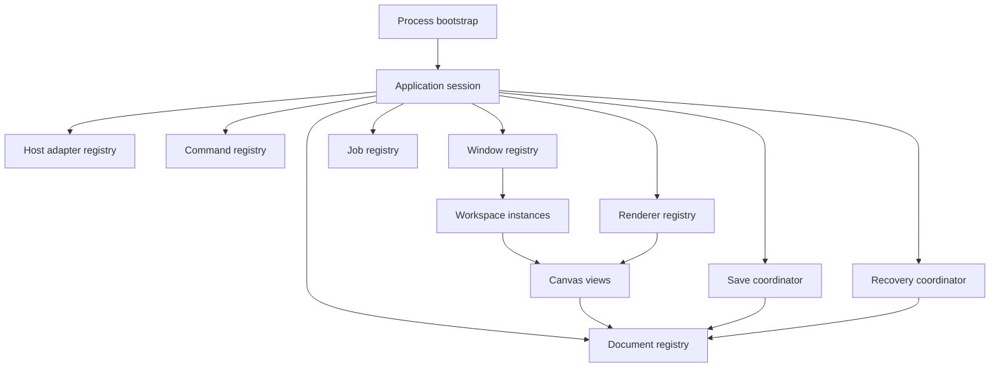
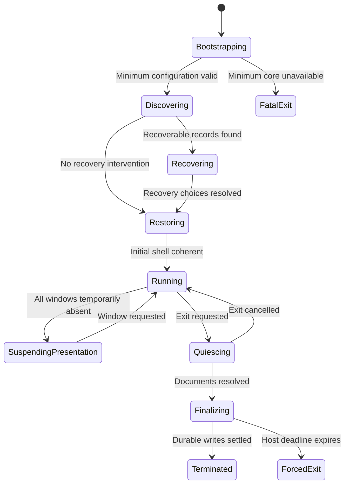
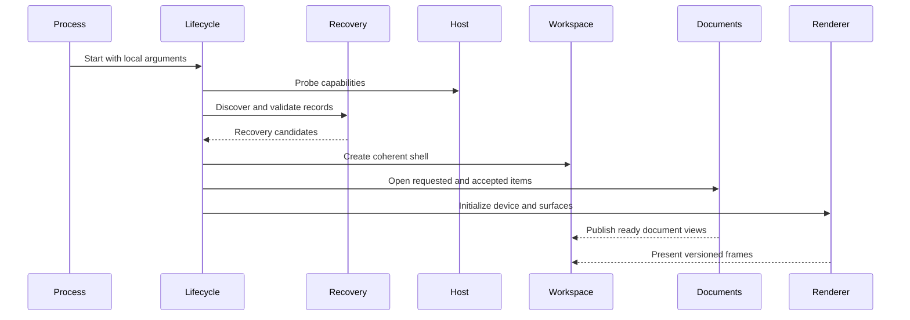
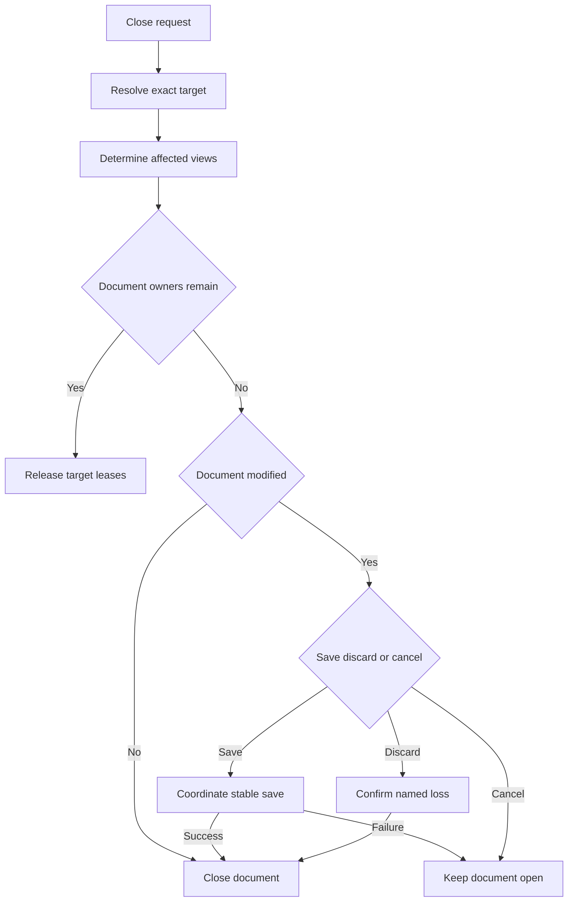
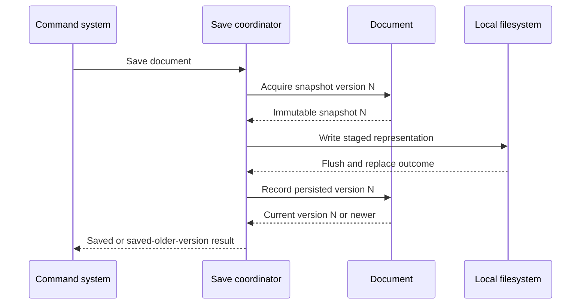
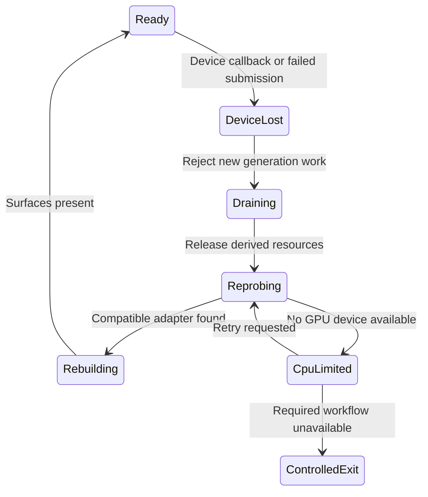
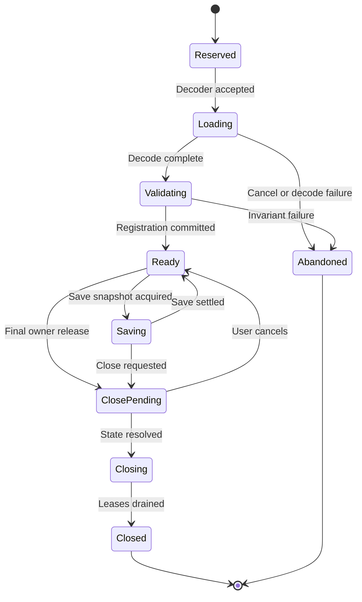
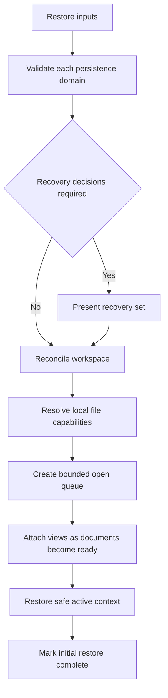
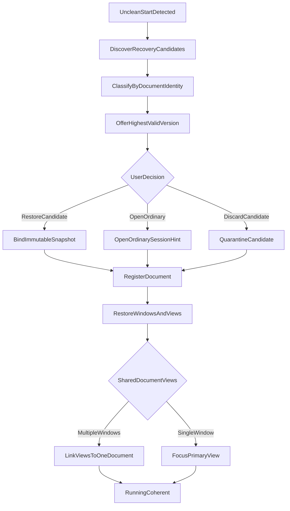
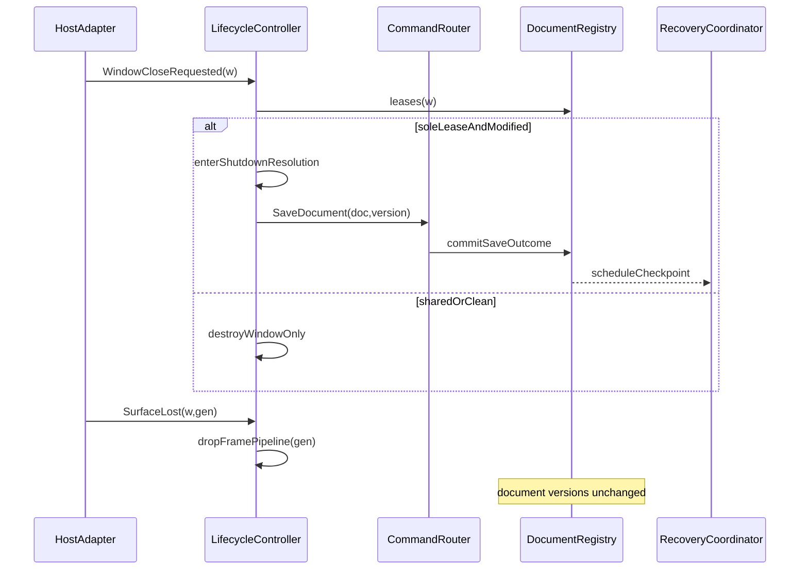

# 02 — Application Lifecycle

## Overview

Application lifecycle coordinates process, application session, native windows, workspaces, documents, saves, recovery, rendering devices, and shutdown without confusing their ownership. PhotoTux is local-first; startup and normal editing require no network, account, remote authority, or proprietary service. Rust is the core language, wgpu the GPU abstraction, and **Qt 6 QML + qtbridge** the shipping Linux desktop presentation ([DR-023](Appendix/Decision-Register.md#dr-023--tech-stack-frozen-to-shipping-codebase)). Lifecycle contracts remain toolkit-typed only at the host adapter boundary. v1 sessions are **single-document** ([DR-024](Appendix/Decision-Register.md#dr-024--single-document-session-v1)); multi-document language in this spec is target architecture. Plugin ABI remains deferred ([DR-009](Appendix/Decision-Register.md)).

The lifecycle controller is an orchestrator, not an owner of document pixels. It orders initialization and teardown, retains registries, delegates mutations through the [command system](08-Command-System.md), and maintains enough durable session information to recover presentation after interruption. Normative terms follow [Requirement Keywords](Appendix/Requirement-Keywords.md).

## Responsibilities

The lifecycle subsystem **MUST**:

- establish one application session per process;
- initialize only the minimum services required before presenting a usable window;
- discover recovery records before silently reopening ordinary session documents;
- keep process, session, window, workspace, view, document, renderer, save, and job lifetimes distinct;
- preserve authoritative document state across window closure and GPU device loss;
- coordinate concurrent saves against stable document versions;
- resolve every modified document before intentional process exit;
- write session and recovery state through versioned, bounded, staged persistence;
- tolerate denied desktop services, missing files, changed displays, unavailable extensions, and renderer failure;
- expose lifecycle state, blocking operation, safe remainder, and available remedy;
- avoid blocking the host event thread on decoding, encoding, GPU completion, or extension execution.

It **SHOULD** present a usable shell while optional catalogs and thumbnails continue loading, consolidate multi-document shutdown decisions, and restore spatial context without restoring hazardous transient gestures. It **MAY** start without any window when invoked for a future headless operation, provided no UI-only service becomes a core dependency.

## Architecture



Registries store stable IDs and lifecycle handles rather than toolkit objects. Host-specific window and surface values terminate at adapters. Document registry entries outlive views when retained by another view, a save snapshot, recovery write, import finalization, or explicit background owner.

### Internal hierarchy

```text
PhotoTux process
├── Bootstrap context
│   ├── executable/build identity
│   ├── local configuration roots
│   └── crash-loop and safe-start indicators
├── Application session
│   ├── host capabilities
│   ├── command/action/tool registries
│   ├── resource catalogs
│   ├── document registry
│   ├── window/workspace registry
│   ├── operation and cancellation registry
│   ├── save/recovery coordinators
│   └── renderer/device registry
├── Window
│   └── Workspace
│       ├── canvas views
│       └── panel and presentation state
└── Durable local state
    ├── preferences
    ├── session manifest
    ├── workspace records
    └── recovery records
```

## Lifecycle State Model



States are monotonic except cancellation from `Quiescing` and reactivation from `SuspendingPresentation`. `Running` permits document-local sub-states such as loading, ready, saving, closing, recovery-only, and failed-to-open. A failed document operation **MUST NOT** force session failure unless continuing would violate process-wide invariants.

## Core Data Contracts

```rust
struct ApplicationSession {
    id: SessionId,
    phase: SessionPhase,
    capabilities: HostCapabilities,
    documents: Registry<DocumentId, DocumentLease>,
    windows: Registry<WindowId, WindowLease>,
    operations: Registry<OperationId, OperationRecord>,
    renderer_generation: RendererGeneration,
    shutdown: Option<ShutdownPlan>,
}

struct DocumentLease {
    document_id: DocumentId,
    owners: Set<RetentionReason>,
    current_version: DocumentVersion,
    persisted_version: Option<DocumentVersion>,
    recovery_version: Option<DocumentVersion>,
    phase: DocumentPhase,
}

enum RetentionReason {
    CanvasView(ViewId),
    SaveSnapshot(OperationId),
    RecoveryWrite(OperationId),
    ImportFinalization(OperationId),
    ExplicitBackgroundTask(OperationId),
}

struct SessionManifest {
    schema_version: SchemaVersion,
    clean_exit: bool,
    windows: List<WindowRestoreRecord>,
    document_hints: List<DocumentRestoreHint>,
    active_context: Option<ActiveContextHint>,
}
```

`DocumentRestoreHint` contains a local capability reference or privacy-preserving locator policy, never authoritative pixels. Recovery records identify source document, base persisted identity when known, captured document version, checksum, creation time, and compatibility version. In-memory Rust layout **MUST NOT** define serialized layout.

## Startup Workflow

Startup is staged so optional failure cannot prevent basic recovery and file access.

1. Bootstrap validates configuration roots, build compatibility, locale-independent schema readers, logging bounds, and single-process policy if one is later selected.
2. Safe-start detection checks repeated abnormal termination. It **MAY** suppress third-party extensions and custom workspace state, but **MUST NOT** suppress recovery discovery.
3. Host adapters report capabilities for windows, files, accessibility, display topology, power/session events, and GPU surfaces.
4. Core registries load built-in commands, tools, panel descriptors, and codecs. Invalid optional contributions are quarantined with diagnostics.
5. Recovery coordinator scans bounded local records, validates headers and checksums, and groups candidates by document identity.
6. UI presents recovery choices before overwriting or deleting candidate records.
7. Initial window and [workspace](03-Workspace-System.md) are created from defaults, preset, and compatible session state.
8. Requested files and accepted recovery candidates open asynchronously.
9. Renderer initialization occurs per capability policy. A renderer delay **SHOULD** leave file management and recovery decisions available.
10. Session manifest marks the session active only after its initial staged write succeeds.



Opening a document has phases `Requested`, `Sniffing`, `Decoding`, `Validating`, `Registering`, and `Ready`. Imported state remains isolated until validation succeeds. Cancellation before registration removes provisional data. Failure after registration transitions the entry to an inspectable failure state or closes it through normal policy.

## Window, Workspace, and Document Lifetime

A close request targets exactly one kind:

- **Close view:** removes one projection. Document remains if another retention reason exists.
- **Close workspace:** resolves contained views but does not automatically close shared documents.
- **Close window:** closes its workspaces and surfaces, then evaluates documents whose final view disappeared.
- **Close document:** resolves all its views and active operations across windows.
- **Quit application:** creates one session-wide shutdown plan.



The active document derives from focused work context, not registry order. Destroying a native surface invalidates presentation resources, not the workspace model or document. If a host requires the process to exit when no windows remain, lifecycle **MUST** first resolve documents and recovery obligations.

## Save Coordination

Save captures an immutable snapshot of version N and writes it independently of edits producing N+1. Only successful durable completion for the document’s editable destination can advance `persisted_version` to N. Modified state clears only when `current_version == persisted_version`.

Concurrent save requests to the same destination **MUST** serialize destination replacement. The coordinator **SHOULD** coalesce identical requests for the same version and options. Save As establishes editable identity only after successful replacement; Save a Copy and Export never alter it. Cancellation before replace deletes or quarantines temporary output. Cancellation after atomic replacement reports success because durability already occurred.



## Recovery

Recovery is supplemental persistence, never a user-confirmed save. Recovery scheduling **SHOULD** bound expected active-edit loss to the charter target while respecting disk and CPU budgets. Records **MUST** be generated from coherent snapshots or replayable committed transactions. Uncommitted previews and gestures **MUST NOT** enter recovery.

At discovery, records are classified as compatible, migratable, incomplete, corrupt, superseded, or orphaned. Compatible candidates may open as recovered untitled documents until the user explicitly saves. Original files **MUST NOT** be overwritten during recovery without normal Save/Save As confirmation. Dismissing a candidate **SHOULD** move it to a bounded quarantine before eventual deletion, permitting correction of accidental dismissal.

Recovery cleanup occurs only after one of these facts is durable: matching or newer version saved; user explicitly discarded candidate; retention policy expired a superseded record; or validated migration replaced it. Cleanup failures are non-fatal and locally diagnosed.

## GPU Device and Surface Loss

GPU state is derived. Device loss increments renderer generation, cancels or invalidates submissions, drops generation-bound resources, and reconstructs adapters, devices, pipelines, caches, and surfaces. Documents, history, selections, tools, saves, and recovery remain valid.



Device-loss status **MUST** remain visible beyond a transient notification. Saving and document inspection **SHOULD** remain available. Repeated loss **SHOULD** stop automatic retry and offer reduced presentation, diagnostics, or controlled exit. Device recovery details are refined by `12-GPU-Device-and-Resource-Management.md`.

## Shutdown Workflow

Quit creates an immutable shutdown scope listing windows, documents, modified versions, active writes, exports, imports, and extension jobs. New ordinary mutations are rejected once finalization begins; during user choice, the session remains fully cancelable.

1. Freeze target set and prevent accidental window destruction.
2. Cancel previews and drags without committing.
3. Display consolidated modified-document resolution.
4. Start selected saves with per-document outcomes.
5. Keep failed or cancelled documents unresolved.
6. After all documents resolve, cancel nonessential jobs and await bounded critical writes.
7. Persist workspace and session state as separate schemas.
8. Mark clean exit durably.
9. Release surfaces, renderer resources, host adapters, and process services in dependency order.

Host logout or power deadlines may shorten finalization. PhotoTux **MAY** request a bounded host inhibit while user-visible critical writes run. It **MUST NOT** claim a save succeeded merely because shutdown is imminent. If safe completion is impossible, it **SHOULD** preserve newest coherent recovery records and report unresolved documents.

## Concurrency, Ownership, and Invariants

- The UI thread owns native event affinity but not authoritative documents.
- Each document has one conflict-safe mutation authority.
- Registries use stable IDs and explicit leases; reference count alone is not semantic ownership.
- Lifecycle callbacks **MUST** be idempotent because host events may duplicate or reorder.
- No document lock may span filesystem I/O, GPU waits, extension calls, or user prompts.
- Operation queues are bounded and expose cancellation.
- Closing an object revokes new work, then drains or cancels existing leases.
- A window may disappear without destroying its workspace record.
- A device generation may disappear without changing document version.
- Failed startup stages leave no session record claiming clean operation.
- A clean-exit marker is written last; startup treats missing final marker as unclean.

## Failure Handling

Failures use typed categories: configuration, capability, input, resource pressure, permission, compatibility, invariant, and external service. Every report identifies operation, scope, preserved state, retry safety, and local diagnostic correlation ID.

Configuration corruption falls back field-by-field where safe; the original is quarantined. Missing documents remain visible as unresolved restore entries and are never silently replaced by same-named files. Disk-full during save preserves destination when staged replacement is used. Recovery corruption opens no authoritative document until validation succeeds. Invariant failure freezes affected document mutation, attempts a bounded recovery snapshot from last coherent version, and keeps unrelated documents operational when isolation allows.

## Persistence and Versioning

Lifecycle persistence has separate schemas for application preferences, workspace state, session hints, and recovery. Each record includes schema version, writer build compatibility, checksum where corruption matters, and bounded collection sizes. Unknown fields **SHOULD** survive round trips where representation permits. Migrations are pure, testable transformations and retain originals until replacement validates.

Session state contains no document pixels and **SHOULD** minimize absolute paths. Recovery may contain sensitive document data and therefore inherits local file permissions, explicit retention, and diagnostics redaction. No record depends on network reachability.

## Design Rationale and Tradeoffs

**Incremental startup versus global readiness.** Incremental startup improves recovery latency and isolates optional failure; it requires explicit service readiness and placeholder states. Global readiness is simpler but lets resource scans or GPU compilation block urgent recovery.

**Leases versus view ownership.** View ownership is intuitive but fails for multi-view documents and background saves. Semantic leases make closure precise at modest bookkeeping cost.

**Consolidated shutdown versus serial prompts.** Consolidation exposes full risk and supports batch choice. Serial prompts are simpler but encourage accidental partial shutdown and prompt fatigue.

**Recovery snapshots versus raw event logs.** Snapshots simplify validation; transaction tails reduce write volume. A checkpoint plus bounded committed transaction tail **MAY** combine both, but raw UI events are never sufficient.

## Best Practices

- Test lifecycle as a deterministic state machine with injected host events.
- Use monotonic clocks for deadlines and wall time only for user-facing timestamps.
- Make cleanup idempotent and safe after partial initialization.
- Keep recovery discovery independent of renderer initialization.
- Label every async result with session, document, operation, and source version.
- Exercise shutdown during save, import, device loss, extension failure, and display removal.
- Keep exit diagnostics bounded and flush only data already safe to serialize.

## Future Extensibility

The model permits additional local windows, headless batch hosts, alternate platform adapters, isolated extension processes, richer recovery compaction, and CPU-limited viewing. Any future daemon or single-instance broker **MUST** preserve explicit document authority, local capability boundaries, and independent shutdown semantics. This document does not authorize cloud synchronization, accounts, remote rendering, AI inference, or proprietary service lifecycle.

## Lifecycle Service Interfaces

The lifecycle controller depends on narrow interfaces. Implementations may use traits, actors, message channels, or function tables, but behavior and ownership remain equivalent.

```rust
interface LifecycleHost {
    probe_capabilities() -> HostCapabilities;
    create_window(request: WindowCreateRequest) -> Result<HostWindowHandle, HostError>;
    destroy_window(handle: HostWindowHandle) -> Result<Void, HostError>;
    current_displays() -> DisplayTopology;
    request_shutdown_inhibit(reason: Text, deadline: Instant) -> Result<InhibitLease, HostError>;
    subscribe_lifecycle_events(sink: LifecycleEventSink) -> Subscription;
}

interface DocumentRegistry {
    reserve(identity_hint: Optional<DocumentIdentityHint>) -> Result<DocumentReservation, RegistryError>;
    register(reservation: DocumentReservation, document: ValidatedDocument) -> DocumentLease;
    acquire(id: DocumentId, reason: RetentionReason) -> Result<DocumentLease, RegistryError>;
    begin_close(id: DocumentId, expected_generation: Generation) -> Result<CloseGuard, RegistryError>;
    enumerate_close_state() -> List<DocumentCloseState>;
}

interface SaveCoordinator {
    request(request: SaveRequest) -> Result<OperationId, SaveRequestError>;
    status(operation: OperationId) -> Optional<SaveStatus>;
    cancel(operation: OperationId) -> CancellationOutcome;
    subscribe(sink: SaveEventSink) -> Subscription;
}

interface RecoveryCoordinator {
    discover(policy: RecoveryDiscoveryPolicy) -> RecoveryDiscoveryResult;
    schedule(document: DocumentId, version: DocumentVersion, urgency: RecoveryUrgency);
    retain(record: RecoveryRecordId, reason: RecoveryRetentionReason);
    discard(record: RecoveryRecordId, confirmation: RecoveryDiscardConfirmation) -> Result<Void, RecoveryError>;
}
```

Host handles remain opaque and thread-affine. Core registry and save interfaces never expose native path-dialog objects, toolkit windows, or wgpu devices. File access enters through explicit local file capabilities. Event sinks receive values with session generation and sequence number so duplicate, stale, and out-of-order host callbacks can be rejected deterministically.

### Lifecycle event contract

```rust
enum LifecycleEvent {
    OpenRequested { requests: List<OpenRequest>, source: OpenSource },
    ReopenRequested,
    WindowCloseRequested { window: WindowId },
    SessionEndRequested { deadline: Optional<Instant>, reason: SessionEndReason },
    DisplayTopologyChanged { topology: DisplayTopology, generation: Generation },
    HostSuspending { deadline: Optional<Instant> },
    HostResumed,
    MemoryPressure { level: PressureLevel },
    SurfaceLost { window: WindowId, surface_generation: Generation },
    DeviceLost { renderer_generation: RendererGeneration, reason: DeviceLossReason },
}
```

`OpenRequested` may arrive before initial restoration completes. Requests are queued in bounded order and deduplicated only when they refer to the same granted file identity and open policy. Reopen creates or focuses a window but never guesses that a modified background document should close. Session-end requests can be cancelled only when host policy allows; UI accurately distinguishes “Cancel shutdown,” “Delay while saving,” and “Cannot delay.”

## Document Sub-Lifecycle



`ClosePending` rejects new ordinary view creation only after user confirms closure intent; otherwise a new view request can cancel pending close. Existing save jobs may retain snapshot leases, but their completion cannot resurrect a closed document registry entry. If a save establishes identity after the final view closes but before document closure commits, close resolution uses the save result. If closure commits first, later save completion is reported against its captured destination without registering a new document.

An import opening multiple documents reserves all required registry slots before exposing any. Unless the format contract explicitly permits independent partial import, failure of one member abandons the set. Duplicate opens resolve file identity separately from display path; symbolic links, bind mounts, renamed files, and portal handles can refer to one underlying file. The duplicate policy offers focus existing view, create another view, or intentionally open independent copy where safe.

## Restore Coordination

Restore is a reconciliation process, not replay of host widgets. Inputs include built-in defaults, preferences, workspace records, session hints, recovery candidates, current host capabilities, current displays, available contributions, and command-line open requests.



Restore ordering follows these rules:

- recovery records are discovered before matching ordinary document hints;
- window geometry is adapted before native window creation;
- workspaces may appear before documents, using explicit loading tabs;
- document hints do not bypass file capability policy;
- missing files remain unresolved entries until dismissed or relocated;
- one failed document does not cancel independent documents;
- active focus restores only after its target exists and is eligible;
- transient menus, popovers, drags, text composition, gestures, and confirmations are never restored;
- renderer-dependent overlays remain disabled until current renderer generation is ready.

Restore has a bounded parallelism policy. Opening every prior document simultaneously can exhaust memory and descriptors. The coordinator prioritizes visible active view, visible inactive views, then background hints. It may defer background opens until user selects them. Progress reports count requested, loading, ready, unresolved, failed, and cancelled items without implying that session restore is a document save.

## Shutdown Resolution Details

```rust
struct ShutdownPlan {
    id: ShutdownPlanId,
    created_at_session_revision: SessionRevision,
    reason: ShutdownReason,
    deadline: Optional<Instant>,
    documents: OrderedMap<DocumentId, DocumentShutdownDecision>,
    jobs: OrderedMap<OperationId, JobShutdownPolicy>,
    workspace_revision: WorkspaceRevision,
    phase: ShutdownPhase,
}

enum DocumentShutdownDecision {
    Unresolved { modified_version: DocumentVersion },
    Save { destination: EditableDestinationPolicy },
    Discard { confirmed_version: DocumentVersion },
    KeepOpen,
    Resolved,
}
```

The confirmed discard version matters: if a new edit occurs after confirmation while shutdown is still cancelable, that document returns to unresolved. A save decision captures destination policy but not an outdated snapshot; coordinator acquires a snapshot when save starts and checks for later edits before closure. “Save all” does not overwrite documents lacking valid editable destinations; those require destination resolution.

Shutdown job policy distinguishes:

- **critical durability:** active staged save or recovery replacement; bounded drain is preferred;
- **user-requested delivery:** export or print; ask whether to cancel when time allows;
- **reconstructible background:** thumbnail, indexing, cache fill; cancel immediately;
- **extension work:** cancel, then terminate at isolation deadline;
- **renderer work:** stop submissions and release after presentation closes.

If one save fails, successful saves remain successful, failed documents remain open, and shutdown returns to resolution. Retrying a failed save creates a new operation ID and preserves prior failure diagnostics. Forced host termination cannot guarantee final UI; lifecycle writes recovery only from already coherent snapshots and never enters unbounded emergency serialization.

## Error and Edge-Case Matrix

Startup edges:

- **Preferences unreadable:** load defaults, quarantine original, continue recovery discovery.
- **Session manifest truncated:** treat exit as unclean, validate recovery independently, restore default workspace.
- **No writable state directory:** continue editing when possible, display persistent recovery/session limitation, never claim crash recovery.
- **Extension registry failure:** safe-start core contributions, preserve disabled contribution records.
- **GPU initialization failure:** start shell in renderer-unavailable state and permit save/recovery/file operations.
- **Initial window creation failure:** retain session long enough to report through host-supported channel or exit with typed diagnostic.

Document edges:

- **File disappears during decode:** abort provisional document; existing registered documents remain.
- **File changes externally during open:** decoder uses one capability snapshot or rejects incoherent read.
- **Same file requested twice:** apply duplicate-open policy using stable file identity where available.
- **Import cancellation after expensive decode:** release provisional allocations and publish no document.
- **Last view closes during save:** save lease retains snapshot; document close policy remains explicit.
- **Document executor unhealthy:** reject mutations, preserve inspection/recovery access where safe.

Shutdown edges:

- **User edits while shutdown prompt open:** update affected version and invalidate old discard confirmation.
- **Destination becomes read-only:** save fails with preserved document and alternative destination action.
- **Disk fills after staged write starts:** retain original destination and clean or quarantine temporary file.
- **Host deadline shortens:** reprioritize critical durability, report operations that cannot finish.
- **Window destroyed externally:** recreate resolution surface if host allows; do not interpret destruction as discard.
- **Process receives repeated quit requests:** merge into existing plan, tighten deadline only from authoritative host event.

Device edges:

- **Surface loss only:** recreate that surface without global device rebuild.
- **Device loss during preview:** cancel generation-bound preview; document transaction status remains independent.
- **Device loss during GPU-prepared command:** reject or recompute prepared result according to command applicability.
- **Repeated recovery loop:** stop automatic attempts after bounded threshold and enter explicit reduced mode.
- **Adapter capability regression:** rebuild renderer at lower feature tier and invalidate incompatible caches.

## Accessibility Through Lifecycle

Initial window focus lands on recovery decision when unresolved recovery exists; otherwise it lands on restored active view or primary New/Open surface. Loading tabs expose busy state, document label, cancellation when supported, and progress phase. A failed open is announced assertively once, retains keyboard-reachable details, and does not steal focus from another active document.

Shutdown resolution is one structured collection, not a cascade of dialogs. Each document exposes name, modified state, proposed action, save progress, failure reason, and destination requirement. Keyboard users can apply an action to selected documents and review exceptions. Screen-reader announcements are rate-limited by operation and phase. Imminent host deadlines use assertive announcements without repeating on every timer update.

Device-loss presentation exposes renderer unavailable, reconstruction phase, whether editing commands are restricted, and whether save remains available. It cannot be a visual-only canvas overlay. Safe-start and recovery modes use explicit headings and descriptions; color does not encode trust or recoverability alone.

## Platform Adapter Boundaries

Linux host integration supplies normalized lifecycle signals, native windows/surfaces, local file capabilities, display topology, accessibility bridge, and optional session inhibition. It does not decide whether documents are dirty, whether close is safe, which recovery candidate wins, or whether a save clears modified state.

The core **MUST NOT** assume:

- a window close request implies process exit;
- the compositor provides stable monitor ordinals;
- a native surface survives suspend/resume;
- file paths are always available from portals;
- logout can always be delayed;
- all device-loss reasons are distinguishable;
- host events arrive exactly once or on one worker;
- one process is required per application session.

Adapter conformance tests feed synthetic duplicate, reordered, and missing events. A fake host can create/destroy windows, alter displays, deny files, shorten deadlines, and lose surfaces deterministically without a graphical desktop.

## Observability and Testability Hooks

Lifecycle tracing emits phase transition, source/target state, session revision, involved stable IDs, operation correlation, elapsed time, and typed outcome. It excludes document content, private names, and full paths by default. Counters include recovery candidates by classification, restore queue depth, open latency phases, lease counts by reason, save outcomes, close cancellations, device-loss attempts, and forced-exit unresolved count.

Test seams include:

- injected monotonic clock and deterministic deadline scheduler;
- in-memory staged-write filesystem with failure points;
- fake host adapter and display topology;
- fake renderer generations and device-loss injection;
- deterministic document executor and snapshot source;
- recovery store with corrupt/truncated/versioned fixtures;
- operation barrier before each lifecycle transition;
- leak assertion for leases, subscriptions, windows, snapshots, and temporary files.

### Deterministic acceptance scenarios

**Concurrent edit and save:** open version 10, start save, commit edit to 11, complete save of 10, assert persisted version 10 and modified state true; save 11 and assert clean.

**Recovery precedence:** provide unclean manifest, ordinary hint at saved version 20, valid recovery version 24, and corrupt version 25; assert candidate 24 is offered, corrupt record quarantined, ordinary hint not silently opened over it.

**Close shared document:** create two windows with one view each, close first window, assert document and second view survive without save prompt; close second view, assert modified resolution appears.

**Device-loss isolation:** commit a document edit, inject device loss during frame submission, assert version/history unchanged, save succeeds, stale generation callback ignored, and rebuilt frame uses coherent latest snapshot.

**Deadline shutdown:** create modified documents A and B, successful save A, failing save B, shorten host deadline, assert A closes, B recovery is scheduled from coherent version, no false save success is recorded, and unresolved count appears in diagnostics.

**Duplicate callbacks:** deliver surface-lost and window-destroyed events twice in reverse order; assert one cleanup, no negative lease count, and no document closure.

## Neighboring Subsystem Interactions

Lifecycle coordinates peer subsystems without absorbing their authority. The [command system](08-Command-System.md) remains the sole mutation path for documents; lifecycle may submit save, close, recover, and renderer-rebuild commands, but never mutates pixels, layer graphs, or history directly. The [workspace system](03-Workspace-System.md) owns topology and presentation; lifecycle owns window binding creation, display-capability refresh, and whether a workspace may persist during quiesce. The [docking](04-Docking-System.md) and [panel](05-Panel-System.md) systems cancel in-flight presentation transactions when lifecycle publishes `Quiescing` or `RendererUnavailable`; they do not invent document discard. The [toolbar](06-Toolbar-System.md) and [shortcut](09-Shortcut-System.md) systems receive enablement projections driven by lifecycle mode: safe-start disables extension tools; device-loss disables GPU-dependent gestures while leaving save and file commands reachable. Context menus compose against the same action registry and must refuse destructive document actions when the owning document executor is unhealthy.

Cross-window shared documents create asymmetric close semantics. Closing a window asks the workspace whether any remaining view holds the document. If another window retains a view, lifecycle releases only that window’s surface, workspace, and leases. If the closing window held the last view and the document is modified, lifecycle inserts a save-resolution step before document unregister. Save coordination always pins an immutable snapshot version; a concurrent edit through the command system advances document version without invalidating an in-flight save of the older snapshot. Recovery records are scheduled from command post-commit hooks and from unclean-exit discovery, never from speculative UI “dirty” flags alone.

Renderer loss and document truth remain orthogonal. A destroyed wgpu device invalidates generation-tagged surfaces and caches. Document history, saved-version markers, and recovery candidates continue under document authority. Lifecycle may reject GPU-prepared command results that reference a dead generation while still accepting CPU-authoritative commits. Neighboring input systems cancel pointer capture and temporary tool stacks when surfaces disappear so no gesture can commit against a destroyed presentation path.

## Session Schema Versioning and Migration

Session, preferences, and recovery envelopes carry independent schema versions. Readers accept a declared compatibility window: same major line with additive optional fields; explicit adapters for known prior majors; quarantine for unrecognized majors that cannot be safely reduced. Migration runs before ordinary restore can open documents. Adapters rewrite only presentation and session bookkeeping: window placement hints, workspace IDs, open-document references, recovery candidate classification, and safe-start flags. Adapters never rewrite document content, history stacks, or command payloads into executable form.

Field evolution rules are strict. Renaming a semantic meaning requires a new field ID or schema version; display labels are never migration keys. Unknown bounded extension fields are preserved through a typed opaque bag when the bag size and nesting limits hold; oversized unknown data is truncated with a diagnostic and never causes total session loss. Absolute pixel geometries migrate using stored scale when present; otherwise they normalize into the primary logical work area. Monitor ordinals are never treated as durable identities; migration prefers stable display hints, then geometry overlap, then primary fallback.

Recovery records migrate separately from session manifests. A valid recovery candidate at a higher document version than the ordinary session hint always wins discovery order after migration. Corrupt recovery blobs quarantine without deleting sibling candidates. When migration partially succeeds—workspace topology repaired, one document reference irretrievable—lifecycle presents a coherent shell with unresolved tabs only where policy allows actionable recovery. Writing back a migrated session uses staged replace so a crash mid-write cannot leave a half-migrated authoritative file. Readers that encounter a newer-than-supported user record load known fields, preserve unknown compatible bags, and refuse overwrite until an explicit successful save under the current writer version.

## Security and Trust Boundaries

Lifecycle trust assumptions are local-process and local-filesystem. No network endpoint, account token, or remote license gate may block startup, save, or recovery. Extension contributions load under a capability registry with explicit enablement; failed or untrusted contribution registration yields safe-start core-only mode rather than ambient authority. Extension code cannot register lifecycle hooks that suppress recovery discovery, force discard of modified documents, or clear dirty state without a successful save of the claimed version.

File capabilities obtained from the host adapter are capability tokens, not ambient path strings. Lifecycle retains tokens for reopen and save destinations according to host policy and never reconstructs broader filesystem access from a display name. Recovery and session paths live under application state roots with restrictive permissions where the host provides them. Diagnostics redaction strips full paths, private document titles when policy requires, and any clipboard or password-adjacent payloads. Crash markers and safe-start indicators are integrity-checked for truncation and unexpected growth; an attacker-controlled oversized marker cannot exhaust memory during bootstrap.

Shutdown trust requires explicit user or host-authoritative intent. A synthetic window-destroy event from a compromised helper cannot be interpreted as document discard. Host logout deadlines may force best-effort durability, but lifecycle still records unresolved documents rather than claiming successful save. Multi-document resolution surfaces must not auto-apply “discard all” from an extension-provided default. Headless or automation entry points that skip UI still obey the same save and recovery contracts when they claim durable exit.

## Extended Host Adapter Contract

The host adapter exposes a narrow lifecycle surface. Required signals include process start context, quit request with optional deadline, window close request distinct from process quit, display topology generation, theme and reduced-motion signals, file open/save capability acquisition, and accessibility focus bridge readiness. Optional signals include session inhibition, portal-mediated file persistence, and compositor surface-loss reasons. Every signal carries a monotonic host generation and may be delivered more than once; core idempotence is mandatory.

Contract outputs from core to host are requests, not assumptions of success: create window, destroy window, set title, request attention, inhibit end-session, release inhibit, show modal resolution surface, and post diagnostic to host log. Host denial is a typed capability miss. Core chooses conforming fallbacks: continue without inhibition, use in-process resolution UI, or exit with structured diagnostics when no window can be created. The adapter must not call document executors, rewrite history, or mark saves complete.

Conformance battery for adapters:

- duplicate quit and close events coalesce into one plan;
- reordered surface-lost and window-destroyed events produce single cleanup;
- denied file capability leaves document modified and offers alternate destination;
- shortened deadline reprioritizes durability without inventing save success;
- missing accessibility bridge still leaves keyboard-operable resolution controls through host fallback text entry if that is the only channel;
- synthetic clock control proves recovery discovery ordering independent of wall time.

## Additional Lifecycle Edge Catalog

Bootstrap edges beyond the primary matrix:

- **Executable identity mismatch with state root:** refuse silent migration across incompatible product channels; offer quarantine import of recoverable documents only.
- **Preferences and session disagree on schema major:** migrate each envelope independently; do not pick the newer file as universal authority.
- **Safe-start latch stuck from prior crash loop:** present explicit exit from safe-start after successful clean session, never auto-clear on first paint alone.
- **Resource catalog checksum failure:** continue with empty optional catalogs; do not block document open.
- **Two recovery stores found (legacy path and current path):** merge by document identity and version, quarantine duplicates, never open both as separate documents for one file identity.

Runtime edges:

- **Import finalizer holds last lease during quit:** shutdown waits on that operation class or cancels per declared cancellation policy before exit.
- **Autosave and user save overlap:** one save lane per document; later request waits or replaces staged output only under explicit supersession rules tied to versions.
- **Window open denied mid-restore:** keep document registered, retry window creation once per host generation, expose unresolved presentation without dropping recovery.
- **Clipboard owner query hangs:** bound wait, continue lifecycle; clipboard is never a shutdown dependency.
- **Theme change storms:** coalesce to latest generation; do not rebuild workspaces.

Durability edges:

- **Recovery write succeeds, session manifest fails:** next start still discovers recovery; ordinary session may be incomplete without hiding recovery.
- **Fsync unavailable on filesystem:** staged replace still swaps durable bytes best-effort and records reduced durability warning.
- **Clock step across DST or suspend:** monotonic deadlines govern shutdown; wall clock used only for display timestamps.
- **Document path is a directory symlink farm:** identity uses host file identity when available; path string alone never proves sameness.

## Lifecycle Observability Contract

Lifecycle spans form a single correlation tree per operation: `lifecycle.bootstrap`, `lifecycle.recover.discover`, `lifecycle.document.open`, `lifecycle.save`, `lifecycle.window.close`, `lifecycle.shutdown.resolve`, `lifecycle.renderer.rebuild`. Child spans carry stable IDs for session, window, workspace, view, document, save lease, and renderer generation. Outcomes are enumerated: `ok`, `cancelled`, `rejected`, `degraded`, `forced_exit_unresolved`. Degraded paths always include the subsystem that lost fidelity (GPU, persistence, extension, display).

Counters and gauges required for release readiness:

- recovery candidates offered vs accepted vs quarantined;
- open latency split by decode, register, first frame;
- save success/fail by failure class (space, permission, encode, cancelled);
- device-loss recoveries and reduced-mode entries;
- duplicate host callback suppressions;
- lease high-water marks by reason;
- shutdown unresolved document count;
- migration adapter invocations by schema pair.

Log redaction policy defaults to stable IDs and enums. Full paths appear only at explicit diagnostic verbosity. Document pixel statistics, layer names, and free-text recovery notes are omitted unless a local debug flag is set for a single session. Tests assert that failure injection still emits terminal spans and that no span remains open after process-level teardown simulation.

## Multi-Window Recovery Workflow



This workflow keeps document registration ahead of multi-window view binding. Views never own distinct document copies. If restore UI fails for one window after document register, the document remains available for a subsequent window create; lifecycle does not roll back a successfully restored durable document because a surface create failed.

## Extended Deterministic Acceptance Scenarios

**Safe-start with partial catalogs:** corrupt brush catalog and valid session; assert shell reaches Running, tool fallback active, documents reopen, and no network call is attempted.

**Autosave supersession:** document versions 3 then 4 during overlapping autosave; assert persisted bytes match one complete snapshot version and modified flag reflects whether HEAD exceeds persisted version.

**Shared-document quit:** two windows, one modified shared document; quit; assert one resolution row, not two independent discard prompts; cancel returns both windows.

**Migration then recovery:** old session schema points to version 10, recovery holds version 14; after migration assert offer prefers 14 and session write uses current schema only after accept/decline completes.

**Inhibition denial:** host denies end-session inhibit during multi-document save; assert saves still attempt, unresolved documents reported, and no success claimed for failed destinations.

**Renderer reduced mode with save:** enter reduced mode after repeated device loss; assert paint tools disabled by projection, Save remains enabled, and successful save clears modified only for the saved version.

## Extended Edge-Case Matrix

Lifecycle edges that must remain deterministic when process, window, document, save, and renderer clocks diverge:

- Startup with corrupt preferences and valid recovery: prefer recovery discovery; load preferences only after recovery classification completes; never let preference defaults erase recovery candidates.
- Startup with valid preferences and truncated session manifest: present empty shell with recoverable tab hints; do not invent document content from paths alone.
- Two windows share document D; window A closes while save of version N runs; window B remains: lease count drops by one; save completion still clears modified only if head is still N.
- Quit begins while import finalization holds a provisional document: import either commits before quit resolution includes it or cancels with typed abort; orphan provisional files are deleted or quarantined.
- Host delivers logout deadline during shutdown save of document A and open of document B: open is cancelled or deferred; save continues until deadline policy forces staged recovery write.
- Device loss arrives during shutdown resolution UI: UI remains keyboard operable in reduced renderer mode; document versions and save outcomes remain authoritative.
- Crash-loop indicator present with clean recovery store: enter safe-start shell; skip auto-restore of last session topology; retain recovery discovery.
- Headless invoke with GUI host unavailable: session starts without windows; mutating commands that require a view target fail with typed precondition, never fabricate a hidden window.
- Session write succeeds then process dies before ack: next startup treats session as valid; recovery still wins when newer.
- Recovery write succeeds then process dies before rename: quarantine partial stage; do not treat incomplete stage as authoritative recovery.
- Display removed while restore placement pending: revalidate placement against new display generation; never persist pixel coordinates from removed display.
- Extension catalog timeout at startup: shell reaches Running; extension panels remain unavailable tombstones; core commands remain enabled.
- Duplicate process bootstrap on same config root: second process either attaches to advisory lock failure path or opens read-only diagnostics; it must not overwrite live session staging.
- Save destination renamed by user mid-flight: save fails with path identity error; previous destination remains valid; document stays modified.
- Clipboard ownership held at quit: release or transfer according to host capability; document close is not blocked solely by clipboard lease.
- Accessibility bridge fails after Running: editing continues; announce degraded assistive projection once; do not force quit.
- Theme/scale flood during startup restore: coalesce to latest generation before committing workspace geometry.
- Background job registry nonempty at ForcedExit: cancel cooperative jobs; unbounded jobs are abandoned with diagnostic; documents already saved are not reopened for job cleanup.

## Host Adapter Lifecycle Contract

The host adapter exposes a narrow, versioned surface. Core lifecycle never calls toolkit widgets, portal APIs, or compositor protocols directly.

Required adapter methods:

- `poll_events(budget) -> [NormalizedHostEvent]` — ordered, deduplicable events with host sequence numbers.
- `create_window(spec) -> Result<HostWindowId, HostError>` — logical size, title, parent hint; no document binding.
- `destroy_window(id)` — idempotent; may race with host-destroyed signal.
- `request_surface(window) -> Result<SurfaceLease, HostError>` — generation-tagged surface handle.
- `query_displays() -> DisplayTopology` — stable hints, work areas, scale, primary flag.
- `file_capability(op) -> Capability` — open/save/export permission and path or portal token.
- `inhibit_session(reason) -> Option<InhibitToken>` — best-effort; absence is not fatal.
- `announce_a11y(event)` — rate-limited assertive/polite messages.
- `now_mono() -> Instant` — test-injectable monotonic clock.

Adapter invariants:

- Events may duplicate; core dedupes by `(kind, target, host_seq)` within a bounded window.
- Surface loss does not imply window destruction.
- Window destruction does not imply process exit.
- Denied inhibit must not flip document dirty flags.
- Adapter memory owned by host; core retains only IDs and generations.
- No adapter callback may mutate document registries; callbacks enqueue lifecycle intents.

Conformance suite feeds reorder, duplicate, and gap sequences for close, surface-lost, display-changed, and deadline events. A fake adapter without graphics must drive the same state machine as a real Linux host.



## Versioning and Migration Notes

Lifecycle persists three versioned artifacts: preferences (`prefs.vN`), session manifest (`session.vN`), and recovery envelope (`recovery.vN`). Each carries `schema_version`, `writer_build`, `session_id`, and `monotonic_write_seq`.

Migration rules:

- Reader supports N and N-1 fully; N-2 may load with field drops logged.
- Unknown fields in newer writes are preserved in an opaque bag when size-bounded; bags never execute.
- Session topology references panel/toolbar IDs by stable string; missing IDs become tombstones, not deletions of sibling regions.
- Recovery envelopes migrate independently of session; a newer recovery always outranks an older session for the same document identity.
- Build downgrade after writing N+1: reader loads compatible subset, refuses to overwrite source until explicit user save under current schema.
- Path fields store capability tokens or local paths; migration never rewrites tokens into guessed absolute paths.
- Crash-loop and safe-start flags are process-local and not migrated across machines.
- Clock skew between files uses write_seq and content hashes, not wall-clock trust.

Compatibility tests ship fixtures for truncated CBOR/JSON, cyclic window graphs, duplicate document IDs, and future opaque bags. Migration must be pure with respect to document bytes: it may move presentation, never invent pixels.

## Extended Observability Hooks

Beyond phase traces, lifecycle emits structured signals consumed by local diagnostics only:

- `lifecycle.phase_transition{from,to,reason,session_rev}`
- `lifecycle.lease_delta{doc,reason,delta,total}`
- `lifecycle.save_outcome{doc,version,result,bytes,duration_ms}`
- `lifecycle.recovery_class{doc,class,score}`
- `lifecycle.device_loss{generation,attempt,mode}`
- `lifecycle.shutdown_unresolved{count}`
- `lifecycle.host_event_dup{kind,count}`
- `lifecycle.session_write{seq,bytes,stage}`

Correlation IDs join lifecycle operations to command invocations and save transactions without embedding document content. Redaction policy strips home directories, portal tokens, and layer names from default logs. Test builds may enable path fingerprints (hash only).

Watchdogs:

- open stuck beyond budget → cancel with typed timeout, keep shell;
- recovery scan beyond file count/byte budget → partial scan report;
- device recovery loop counter → reduced mode;
- shutdown past host deadline → ForcedExit metrics with unresolved set.

## Security and Trust Notes

Lifecycle is a trust boundary for local authority, not a network client.

- No startup path requires accounts, licenses online, or remote configuration.
- Extension code runs only after session reaches a state where capability tokens are issued; startup must not execute extension entry points before core registries exist.
- Recovery and session files are user-local; integrity is checksum + atomic replace, not remote attestation.
- Hostile or corrupt session data can at worst degrade presentation; it must not escalate to arbitrary command execution.
- File capabilities from the host are ambient for the chosen path only; lifecycle must not broaden them to sibling paths.
- Diagnostic export is opt-in and excludes document pixels unless the user explicitly includes a chosen document.
- Multi-process advisory locking prevents two writers from clobbering session staging; readers may open diagnostics.
- Clipboard and drag payloads crossing process boundaries are treated as untrusted input at import command validation, not at window map time.

## Deterministic Acceptance Scenarios

**Scenario L1 — Recovery beats session:** plant recovery for doc A at version 12 and session pointing to path of A as clean; crash; restart; assert recovery UX before ordinary reopen; accepting recovery yields version 12 content; declining leaves A closed and session tombstone cleared only after explicit ack.

**Scenario L2 — Shared lease close:** open A in windows W1 and W2; edit to version 5; close W1; assert A remains open in W2, modified; save from W2 clears modified at 5; close W2; process may exit without shutdown resolution.

**Scenario L3 — Save races edit:** begin save at version 7; commit edit to version 8; save completes for 7; assert modified remains true; indicator references unsaved delta after 7.

**Scenario L4 — Disk-full atomicity:** fill volume; save; assert destination prior bytes unchanged, temp stage cleaned or quarantined, error typed as storage, document unmodified flag unchanged.

**Scenario L5 — Deadline with mixed outcomes:** modified A and B; A saves; B fails; host deadline fires; assert A closed clean, B has recovery schedule, diagnostics list B, no success toast for B.

**Scenario L6 — Device loss isolation:** edit; inject device loss; assert history length and version stable; rebuild renderer; next frame uses snapshot at current version; stale generation callbacks ignored.

**Scenario L7 — Duplicate host close:** deliver two WindowCloseRequested and one WindowDestroyed for same id; assert single teardown, lease math non-negative, no double shutdown UI.

**Scenario L8 — Safe-start:** set crash-loop; restart; assert no auto session geometry; New/Open reachable; recovery still discoverable if present.

## Additional Neighboring Subsystem Interactions

- **Workspace:** lifecycle creates/destroys workspace instances per window; workspace never owns document truth. Session restore asks workspace to apply topology only after documents are opened or unresolved tabs created.
- **Docking / Panels / Toolbars:** presentation restore is nested under workspace apply; failures quarantine presentation without closing documents.
- **Commands:** all document mutations and saves enter through command router; lifecycle issues intents, does not bypass validation or history.
- **Shortcuts:** global quit/new/open shortcuts remain enabled in Running; during ShutdownResolving, only resolution actions and cancel-quit remain.
- **GPU/renderer:** device registry is lifecycle-owned; renderers hold view leases, not documents. Device loss never rolls back committed versions.
- **Persistence/recovery:** recovery coordinator is nested; lifecycle orders discovery before restore. Save coordinator publishes outcomes lifecycle uses for dirty clearing.
- **Host/Linux integration:** sole source of windows, surfaces, displays, file capabilities, and deadlines; never authoritative for dirty or recovery ranking.
- **Extensions:** catalogs may delay; lifecycle must reach coherent shell without them. Extension unload cannot strand document leases.

Invariant across neighbors: commands mutate, document owns truth, history records transactions, snapshots stay immutable. Lifecycle only orders and observes.

## Acceptance Criteria


- Cold startup reaches a coherent shell when optional resource catalogs fail.
- Unclean exit discovers valid recovery before ordinary restore can overwrite it.
- Two views retain one document after either view closes.
- Save of version N completes while N+1 remains correctly modified.
- Disk-full save leaves previous destination valid.
- Quit cancellation returns to `Running` with windows and documents intact.
- Multi-document quit shows all modified documents and preserves failed saves.
- Native surface destruction does not destroy document state.
- Injected wgpu device loss reconstructs derived resources or enters explicit reduced mode.
- Repeated device loss never corrupts history or saved-version tracking.
- Session migration tolerates missing panels, files, extensions, and displays.
- Every lifecycle callback is safe under duplicate delivery.
- No normal lifecycle operation requires network access, account state, or remote service.

## Cross References

- [00 — Introduction and System Charter](00-Introduction.md)
- [01 — Information Architecture](01-Information-Architecture.md)
- [03 — Workspace System](03-Workspace-System.md)
- [08 — Command System](08-Command-System.md)
- [09 — Shortcut System](09-Shortcut-System.md)
- [Glossary](Appendix/Glossary.md)
- [Requirement Keywords](Appendix/Requirement-Keywords.md)
- [Cross-Reference Index](Appendix/Cross-Reference-Index.md)
- Downstream: `12-GPU-Device-and-Resource-Management.md`
- Downstream: `23-Workspace-Persistence.md`
- Downstream: `24-Persistence-and-Recovery.md`
- Downstream: `26-Linux-Host-Integration.md`
- Downstream: `27-Platform-Core-and-Host-Contracts.md`
- Downstream: `29-Reliability-and-Failure-Handling.md`
- Downstream: `31-Performance-and-Concurrency.md`
