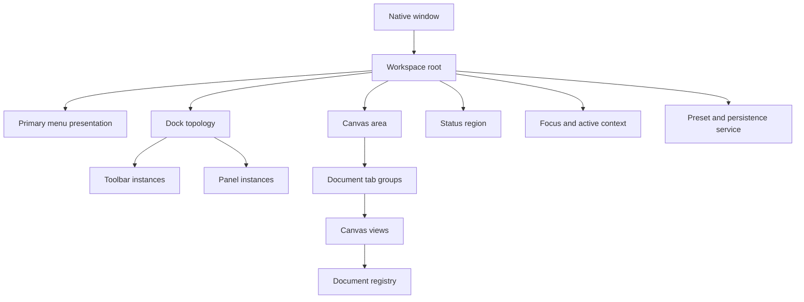
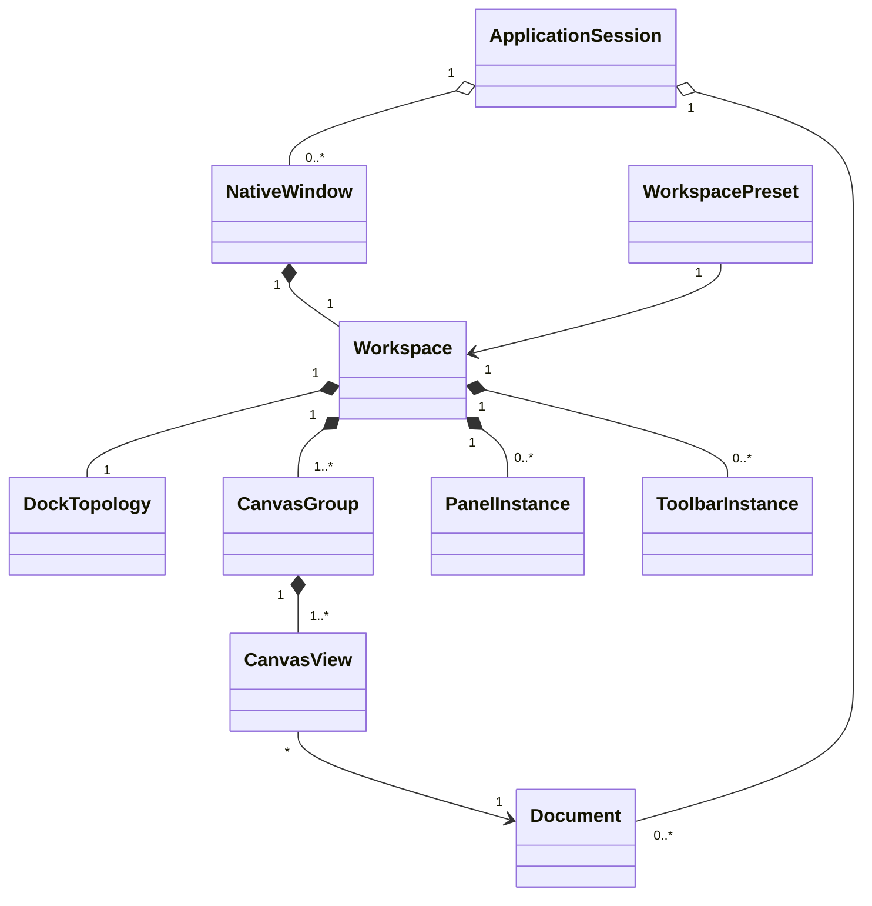
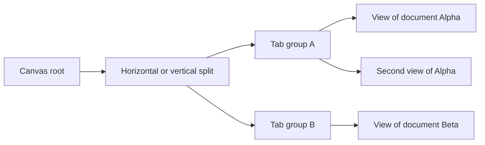
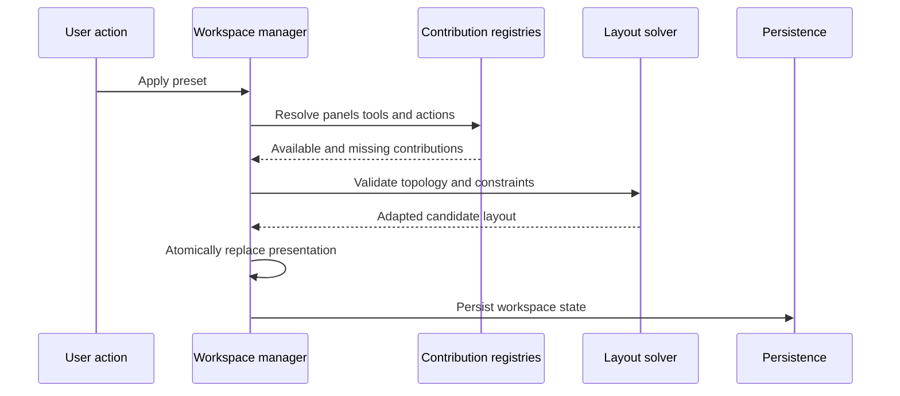
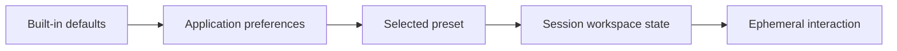
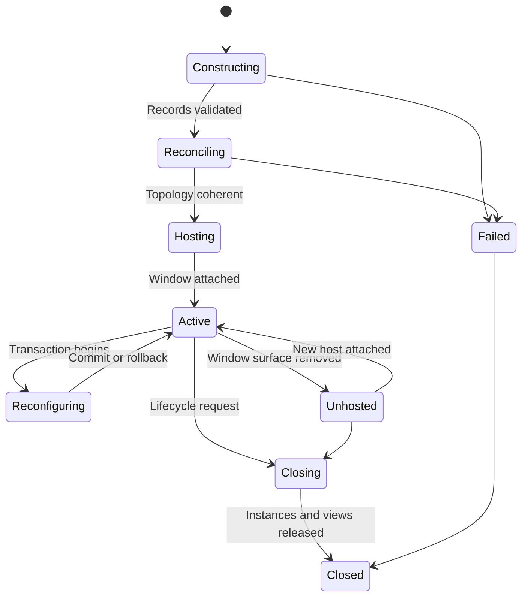
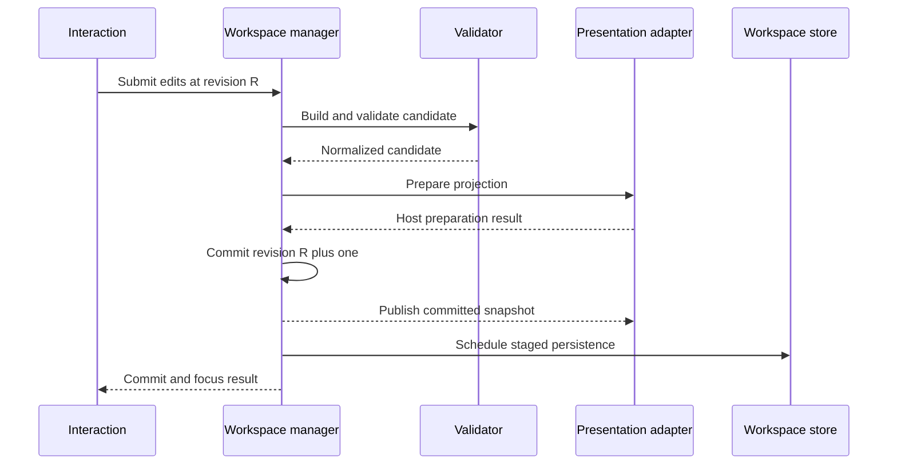
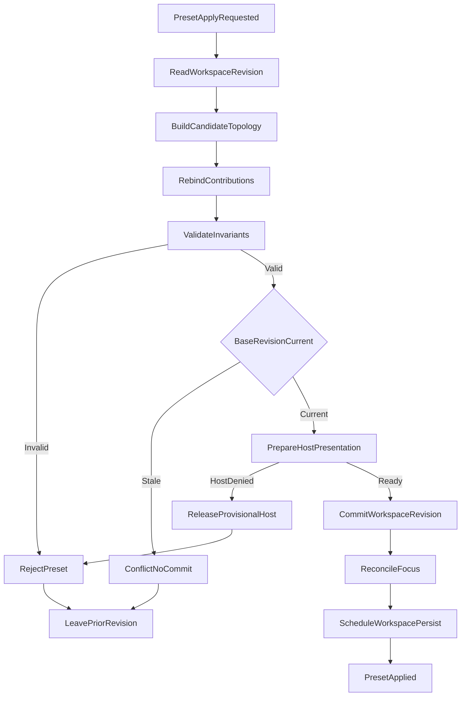
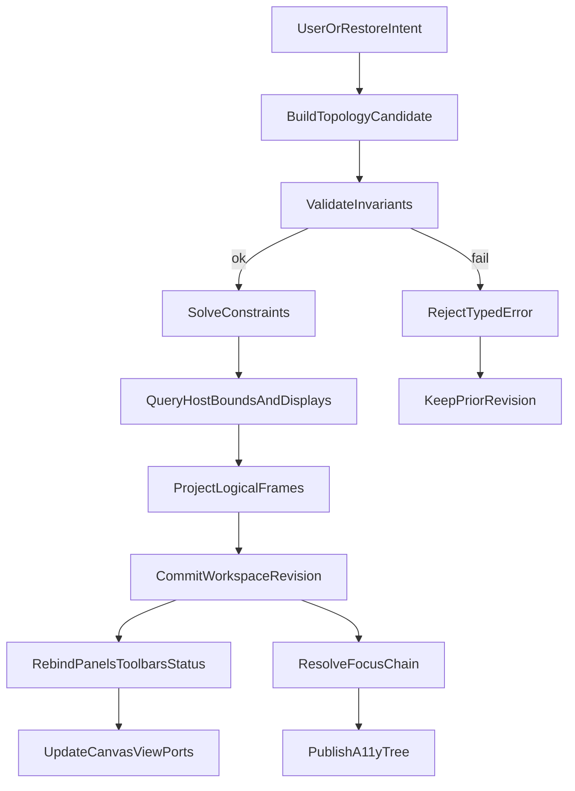
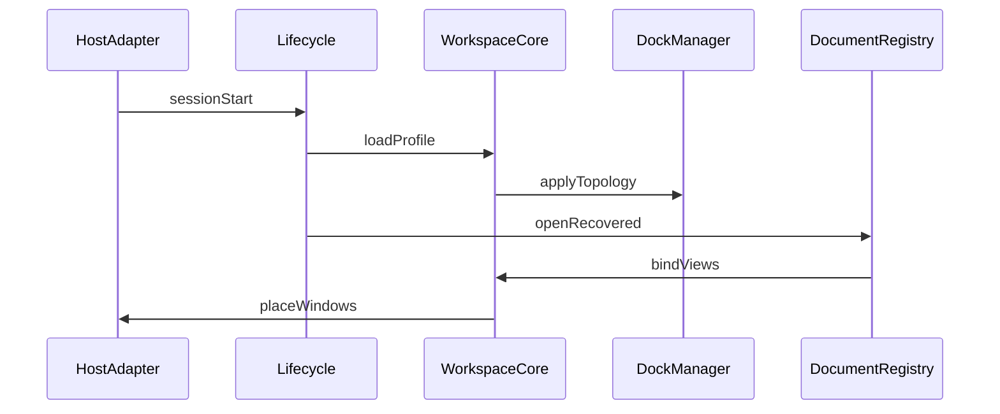

# 03 — Workspace System

## Overview

A workspace is a local presentation arrangement for documents, canvas views, tools, panels, and status. It is neither a document nor a native window, though a window normally presents one workspace root. Workspace state can be discarded or reconstructed without losing editable content. This specification defines default geography, multi-view relationships, presets, serialization, restoration, responsive adaptation, and ownership boundaries. Dock topology, panel instances, tool presentation, and shortcut bindings are delegated to [04 — Docking System](04-Docking-System.md), [05 — Panel System](05-Panel-System.md), [06 — Toolbar System](06-Toolbar-System.md), and [09 — Shortcut System](09-Shortcut-System.md).

PhotoTux remains toolkit-neutral. Layout contracts use semantic regions and stable IDs rather than widget trees. Normal operation is local-first and excludes accounts, cloud synchronization, remote workspaces, AI features, and vendor-specific modes.

## Responsibilities

The workspace subsystem **MUST**:

- compose complete menu access, toolbar/tool access, document tabs, canvas regions, panels, and status presentation;
- distinguish workspace, window, canvas-view, and document state;
- support multiple views of one document and documents visible in multiple windows;
- restore layout safely under changed displays, scaling, available size, and contribution sets;
- serialize versioned semantic topology without toolkit object data;
- preserve focus, active document, active view, and panel context as distinct states;
- keep named actions reachable when any optional region is hidden;
- never mark a document modified for workspace-only changes;
- ensure every visible view references a registered document and every panel declares context policy.

It **SHOULD** provide built-in task presets, user presets, reset at multiple scopes, deterministic placement, stable spatial grammar, and a compact adaptation for narrow windows. It **MAY** support multiple canvas splits and detachable workspace windows, subject to host validation.

## Default Workspace

```text
┌──────────────────────────────────────────────────────────────────────┐
│ Menu: File Edit Select View Image Layer Filters Tools Window Help   │
├──────────┬───────────────────────────────────────────────────────────┤
│ Toolbar  │ Tool options: active tool, target, parameters, presets   │
├──────────┼───────────────────────────────────────┬───────────────────┤
│ Tools    │ Document tabs                         │ Layers / Objects  │
│          ├───────────────────────────────────────┤                   │
│ groups   │                                       ├───────────────────┤
│          │             Canvas view               │ Properties        │
│          │                                       ├───────────────────┤
│          │                                       │ History / Tasks   │
├──────────┴───────────────────────────────────────┴───────────────────┤
│ Tool hint │ Cursor/sample │ Zoom/rotation │ Progress │ Color/status │
└──────────────────────────────────────────────────────────────────────┘
```

The default **SHOULD** expose:

- stable primary menu or host-equivalent complete action taxonomy;
- compact operation toolbar for new, open, save, undo, redo, and view controls;
- tool shelf with grouped tools and explicit active tool;
- options bar bound to active tool and active edit target;
- document tab strip identifying modified, saving, recovery, and shared-view state;
- one primary canvas area;
- right-side object stack and contextual properties;
- history/tasks region;
- bottom status region with tool hints, coordinates, zoom, progress, color/profile, renderer state, and warnings.

Placement is a default, not a semantic requirement. Labels, action IDs, scope, focus order, and accessibility relations remain stable when moved.

## Architecture



### Internal hierarchy

```text
Workspace
├── identity and schema version
├── root regions
│   ├── menu presentation
│   ├── dock topology
│   ├── canvas topology
│   └── status presentation
├── presentation instances
│   ├── panel instances
│   ├── toolbar instances
│   └── document tab groups
├── context state
│   ├── focused locus
│   ├── active canvas view
│   ├── active document
│   └── active tool
├── responsive constraints
└── persistence metadata
```

The workspace owns layout and presentation instances. The application session owns documents and global registries. Canvas views own navigation and display state. The native window owns host surface lifetime. A workspace record may survive loss of its window surface and be rehosted.

## Object Relationships



```rust
struct WorkspaceState {
    schema_version: SchemaVersion,
    workspace_id: WorkspaceId,
    preset_origin: Option<PresetId>,
    dock_root: DockNode,
    canvas_root: CanvasNode,
    panels: Map<PanelInstanceId, PanelPlacement>,
    toolbars: Map<ToolbarInstanceId, ToolbarPlacement>,
    status_items: List<StatusItemId>,
    active_view_hint: Option<ViewRestoreKey>,
    focus_hint: Option<SemanticFocusPath>,
    adaptation: AdaptationPolicy,
}
```

Document IDs and file capabilities are session references, not embedded document data. Session restore may add view hints separately. Reusable presets **MUST NOT** contain private file paths, selected document objects, pixel selections, recovery payloads, active gestures, or operation IDs.

## Canvas and Tab Topology

The canvas root is a tree of tab groups and split nodes. Each leaf contains one or more canvas views; one leaf and one view may be active per window. Splits **MUST** have bounded ratios and minimum dimensions. Closing a tab closes a view, not necessarily its document. Moving a tab changes presentation only.



Tabs show display name, modified state, save/export activity, recovery identity, and close-view action. Same-document views **SHOULD** expose a shared-document indicator. Tab ordering is workspace state. Document ordering in the application registry has no visual meaning.

View creation workflow:

1. Resolve source document and desired group.
2. Create a view with independent navigation defaults.
3. Register the view before exposing the tab.
4. Bind renderer surface and semantic accessibility representation.
5. Make active only after minimum coherent presentation exists.
6. On failure, release the view without changing document lifetime.

## Workspace Presets

A preset is a named reusable projection of workspace fields. Built-in presets are immutable definitions; user presets are versioned local records. Suggested built-ins include General Editing, Painting, Photography, and Precision Layout, provided each uses only implemented capabilities and vendor-neutral names.

Preset application is a layout transaction:



Applying a preset **MUST** preserve open documents and views unless the user explicitly chooses a preset field that changes canvas grouping. Active gestures are cancelled first. Missing optional contributions become explicit placeholders or are omitted according to descriptor policy; their saved state remains available for later restoration. Failure before commit leaves current workspace unchanged.

Preset precedence is:



Each field declares whether later layers replace, merge, append, or ignore it. Blind recursive object merge is forbidden because it creates invalid topology.

## Docking, Panels, Toolbars, and Status

Docking owns physical topology and drag transactions. Panel system owns descriptors, instance state, context binding, and focus. Toolbar system owns tool/action group presentation and activation. Workspace coordinates them through IDs and constraints, never direct child mutation.

Status items are read-mostly semantic projections. Core items for modified state, active edit target, save/recovery failure, device loss, and progress **MUST NOT** be hidden by an extension. Low-priority items **MAY** collapse into a keyboard-accessible overflow on narrow widths.

Menus remain generated from the action registry. Workspace customization can choose presentation and ordering inside declared slots but **MUST NOT** remove primary-menu or command-search reachability for named operations.

## Focus and Active Context

Exactly one focus locus exists per active window. Workspace tracks a semantic path such as `panel:layers/row:object-id` or `canvas:view-id`; toolkit focus handles are adapter-local.

Focus changes derive active context:

1. focused control identifies owning panel or canvas view;
2. focused view determines active document;
3. selected objects and active edit target remain document/view interaction state;
4. panel pinning can override follow context without changing active document;
5. command invocation captures a context snapshot and revalidates execution.

Workspace switches and layout replacement **MUST** restore focus to the semantically equivalent element, nearest surviving ancestor, active canvas, or primary menu in that order. Focus **MUST NOT** disappear into a destroyed panel.

## Responsive Adaptation and Display Changes

Layout solver input includes available logical size, scale, minimum/ideal constraints, display work areas, input modality, and host chrome. Adaptation priority:

1. preserve active canvas minimum;
2. preserve complete action access;
3. preserve active tool and critical status;
4. collapse inactive panel stacks;
5. move low-priority controls into overflow;
6. temporarily hide optional panels while retaining topology intent.

Floating windows or panels outside all current work areas are clamped into the primary visible work area. Scale changes use logical dimensions and re-resolve device pixels. Display removal **MUST NOT** delete persisted placements; it records an adapted runtime placement and can restore the original when topology returns.

## Serialization and Migration

Workspace schemas serialize stable semantic enums, IDs, dimensions in logical units, split ratios, descriptor IDs, instance IDs, collapsed/pinned state, toolbar groups, and bounded component state. They **MUST NOT** serialize raw widget trees, pointers, monitor ordinal as identity, GPU resources, callbacks, or Rust memory layouts.

```rust
enum DockNode {
    Split { axis: Axis, ratio: Ratio, first: NodeId, second: NodeId },
    Stack { tabs: List<PanelInstanceId>, active: Option<PanelInstanceId> },
    CanvasAnchor { canvas_root: CanvasNodeId },
}

struct DisplayAnchor {
    stable_hint: Option<DisplayStableHint>,
    normalized_rect: RectRatio,
    logical_rect: LogicalRect,
}
```

Readers validate depth, node count, cycles, duplicate instance placement, ratios, dimensions, and descriptor availability before constructing UI. Migration operates on data, emits diagnostics, and preserves the prior file until replacement validates. Unknown extension state is opaque, size-bounded, and round-tripped only when safe.

Workspace writes use debounce plus staged replacement. Critical transitions such as preset save may request immediate write. A crash between mutations can lose recent convenience state but never document edits. `23-Workspace-Persistence.md` refines storage and privacy.

## State and Invariants

- Every live workspace has exactly one canvas root.
- Every live canvas view references one registered document.
- A view appears in exactly one canvas group.
- A panel or toolbar instance has exactly one placement state: docked, floating, auto-hidden, or unplaced.
- Split topology is acyclic and all ratios are bounded.
- Active view belongs to the workspace; active document equals that view’s document unless no view is active.
- Workspace mutation never changes document version.
- Layout preview never becomes persisted state before transaction commit.
- Preset application either commits a valid complete workspace or leaves prior state.
- Missing contributions never cause unrelated nodes to disappear.
- Critical status and complete semantic action access remain reachable.

## Failure Handling

Invalid topology falls back to the nearest valid subtree; if no safe subtree exists, built-in default loads while the source is quarantined. Missing panels receive placeholders only when preserving position aids recovery. Unsatisfiable minimum sizes trigger deterministic collapse, not negative geometry. Failed floating-window creation keeps content docked. A panel crash or extension timeout removes that instance from active presentation but preserves bounded state and document truth.

User-visible failure names affected preset or workspace, preserved documents/views, adaptation performed, and reset options. Reset scopes are component, region, workspace, user preset, and all workspace state. Reset **MUST NOT** delete documents, recovery data, application resources, or shortcut customizations unless explicitly included.

## Concurrency and Ownership

Workspace mutation runs on host/UI affinity or an equivalent serialized presentation executor. Expensive validation and migration may run off-thread over immutable records, but commit occurs on presentation authority. Async panel results carry panel instance, context generation, document version, and cancellation token. Stale results are discarded.

Document closure, contribution removal, display changes, and renderer loss can race with layout changes. Operations resolve stable IDs at commit. Drag transactions hold no document locks. Persistence snapshots workspace state without freezing user interaction and writes only the captured revision.

## Design Rationale and Alternatives

**Workspace separate from window.** One-to-one coupling is easy but prevents surface recreation, detachable workspaces, and host-independent tests. Separate semantic workspace and native host preserve portability.

**Topology tree versus absolute rectangles.** Trees encode adjacency and resizing robustly. Absolute rectangles are retained only for floating placement and display anchoring.

**Presets as partial overlays versus full snapshots.** Partial presets preserve documents and user state but need merge rules. Full snapshots are predictable but contain accidental session details. PhotoTux uses declared-field overlays.

**Stable default geography versus aggressive adaptation.** Stable zones protect muscle memory. Adaptation remains constraint-driven and reversible rather than frequency-driven rearrangement.

## Best Practices

- Test topology properties with generated trees and invalid records.
- Use logical units and stable display hints.
- Keep panel/tool descriptor state versioned independently.
- Render a layout preview before committing destructive rearrangement.
- Preserve semantic focus paths across reconstruction.
- Offer reset close to failing scope.
- Keep canvas usable with every optional panel hidden.
- Record local redacted diagnostics for migration and adaptation decisions.

## Future Extensibility

The model supports additional windows, synchronized comparison views, saved local task presets, semantic extension panels, alternative host shells, and accessibility-focused workspace variants. New region kinds **MUST** declare ownership, constraints, focus behavior, persistence schema, missing-contribution behavior, and action accessibility. No extension may create remote workspace dependency or bypass command semantics.

## Workspace Service Contracts

```rust
interface WorkspaceManager {
    create(request: WorkspaceCreateRequest) -> Result<WorkspaceHandle, WorkspaceError>;
    snapshot(id: WorkspaceId) -> Result<WorkspaceSnapshot, WorkspaceError>;
    apply(transaction: WorkspaceTransaction) -> Result<WorkspaceCommit, WorkspaceError>;
    attach_window(workspace: WorkspaceId, host: HostWindowHandle) -> Result<Void, WorkspaceError>;
    detach_window(workspace: WorkspaceId, generation: Generation) -> Result<Void, WorkspaceError>;
    subscribe(id: WorkspaceId, sink: WorkspaceEventSink) -> Subscription;
}

interface WorkspaceContributionRegistry {
    resolve_panel(id: PanelTypeId) -> ContributionResolution<PanelDescriptor>;
    resolve_toolbar(id: ToolbarTypeId) -> ContributionResolution<ToolbarDescriptor>;
    resolve_status_item(id: StatusItemId) -> ContributionResolution<StatusDescriptor>;
    generation() -> RegistryGeneration;
}

interface WorkspaceStore {
    read(key: WorkspaceStorageKey) -> Result<SerializedWorkspace, StoreError>;
    stage_write(key: WorkspaceStorageKey, revision: WorkspaceRevision, data: Bytes) -> Result<StagedWrite, StoreError>;
    commit(staged: StagedWrite) -> Result<Void, StoreError>;
    quarantine(key: WorkspaceStorageKey, reason: QuarantineReason) -> Result<Void, StoreError>;
}
```

`WorkspaceTransaction` contains base revision, ordered semantic edits, focus restoration policy, and reason. Edits include create/destroy view, move view, split/merge canvas group, replace dock topology, set region visibility, apply preset overlay, and update status ordering. Transactions cannot contain document commands. Commit returns new revision, normalized topology, adaptation actions, and restored focus path.

```rust
struct WorkspaceSnapshot {
    workspace_id: WorkspaceId,
    revision: WorkspaceRevision,
    registry_generation: RegistryGeneration,
    window_binding: Optional<WindowBinding>,
    canvas: CanvasTopology,
    dock: DockTopology,
    presentations: PresentationInstances,
    context: WorkspaceContext,
    adaptation: RuntimeAdaptation,
}
```

Snapshots are immutable and bounded. Consumers never retain writable `WorkspaceState`. Presentation adapters render snapshots and send semantic intents back to manager.

## Workspace Lifecycle Model



An unhosted workspace retains semantic layout for bounded session restoration but has no focus. Async presentation work is suspended. Closing releases view leases according to application lifecycle and closes panel/toolbar instances after capturing permissible state. Rehosting increments window-binding generation; callbacks from prior native window are stale.

Workspace transaction state is separate:



Native preparation may create a floating host window or surface. It cannot publish candidate topology before semantic commit. If native preparation succeeds but commit conflicts, adapter destroys provisional resources. If commit succeeds and later persistence fails, in-memory workspace remains authoritative for session and reports durability risk.

## Canvas View Contracts

```rust
interface CanvasViewRegistry {
    create(document: DocumentId, initial: ViewInitialization) -> Result<ViewId, ViewError>;
    clone_view(source: ViewId, policy: ViewClonePolicy) -> Result<ViewId, ViewError>;
    move_to_group(view: ViewId, group: CanvasGroupId, index: UInt) -> Result<Void, ViewError>;
    close(view: ViewId, expected_generation: Generation) -> Result<ViewCloseResult, ViewError>;
    snapshot(view: ViewId) -> Result<CanvasViewSnapshot, ViewError>;
}

struct CanvasViewSnapshot {
    id: ViewId,
    generation: Generation,
    document: DocumentId,
    navigation: ViewNavigationState,
    display: ViewDisplayState,
    active_edit_target: Optional<TargetRef>,
    renderer_generation: RendererGeneration,
}
```

Cloning a view copies navigation/display state only under declared policy. It does not copy document selection into a new document, duplicate history, or create another document identity. A synchronized comparison group may link selected navigation fields, but each view remains independently identifiable and unlinking preserves current values.

Canvas-group rules:

- one tab is selected per nonempty group;
- selected tab determines visible view for that group;
- one visible view is active for command scope per active window;
- inactive visible views in split groups remain renderable but do not implicitly become command targets;
- empty groups normalize away unless retained as an explicit drop target during a transaction;
- closing the selected view picks next tab, previous tab, adjacent group, or no active view deterministically;
- tab preview and reordering never alter document state.

## Status Region Contract

Status data is published as semantic items:

```rust
struct StatusItemDescriptor {
    id: StatusItemId,
    scope: StatusScope,
    priority: StatusPriority,
    criticality: StatusCriticality,
    presentation: StatusPresentationPolicy,
    accessibility: AccessibilityMetadata,
}

struct StatusValue {
    descriptor: StatusItemId,
    context_generation: UInt64,
    state: StatusState,
    primary_text: Text,
    value: Optional<SemanticValue>,
    actions: List<ActionId>,
}
```

Critical states include failed save, unresolved recovery, renderer/device loss, document read-only state, and destructive-operation consequence. Critical items persist until resolved or explicitly dismissed under policy. Coordinates, sampled color, tool hints, and progress are contextual and rate-limited. Overflow maintains criticality and source order; it never hides all evidence that an operation is active or failed.

## Preset Overlay Semantics

Preset records declare field masks. Applying one does not recursively merge arbitrary data.

```rust
struct WorkspacePreset {
    id: PresetId,
    schema_version: SchemaVersion,
    name: Text,
    fields: PresetFieldMask,
    dock_template: Optional<DockTemplate>,
    toolbar_template: Optional<ToolbarTemplate>,
    panel_template: Optional<PanelTemplate>,
    canvas_policy: Optional<CanvasPresetPolicy>,
    status_template: Optional<StatusTemplate>,
}
```

Merge semantics:

- dock template replaces topology structure but reuses matching live instances by stable ID;
- panel template creates missing permitted instances and relocates existing matches;
- toolbar template replaces only declared groups/order fields;
- canvas policy preserves views by default and may only regroup them with explicit user confirmation;
- status template cannot remove mandatory critical items;
- unknown fields remain in serialized preset but do not affect active layout;
- instance-local state survives relocation unless preset explicitly resets that component class.

Saving a preset strips session-only values through a whitelist serializer. Preview shows regions that move, appear, disappear, or adapt. Applying a preset while a property draft or gesture is active first requests cancellation/commit according to component policy; failure to reach quiescence aborts application.

## Workspace Error and Edge Cases

Construction:

- **No panel descriptors available:** build canvas, menu/action access, tool fallback, and status; report missing optional regions.
- **Canvas root invalid:** replace canvas topology with one empty tab group while preserving recoverable view hints.
- **Duplicate instance IDs:** retain first deterministic valid occurrence, tombstone others, and diagnose corruption.
- **Unknown region kind:** preserve bounded serialized representation and load nearest valid ancestor.

Runtime:

- **Active document closes from another window:** close or retarget its views according to lifecycle result; panels rebind independently.
- **Renderer generation changes:** retain canvas/navigation topology, mark views awaiting renderer, reject stale frame callbacks.
- **Focused panel unloads:** focus nearest surviving semantic ancestor, then active canvas, then menu.
- **Workspace mutation races display removal:** validate candidate against newest display generation or reject and retry from user intent.
- **Panel minimums exceed window:** collapse optional panels by stable priority; never compress canvas below hard minimum.
- **Window becomes zero-sized/minimized:** suspend expensive layout/rendering without persisting zero geometry.
- **Scale changes mid-drag:** cancel or recompute candidate from logical coordinates and announce changed target.
- **Persistence write fails repeatedly:** coalesce retries with backoff, keep one newest snapshot, expose local durability failure.

Restore:

- **Missing document file:** retain unresolved tab only when session policy makes it actionable; reusable presets never include it.
- **Missing extension panel:** retain placement tombstone, not executable state.
- **Monitor identity changed:** match stable hints, geometry overlap, then primary work area in that order.
- **Old schema has absolute pixels:** migrate using stored scale when valid; otherwise normalize to visible logical work area.
- **User record newer than reader:** load known compatible fields, preserve unknown bounded fields, and avoid overwriting source until explicit successful save.

## Accessibility Model

Workspace exposes major regions in logical reading order independent of physical side: primary action access, tool presentation, canvas tabs/views, panels, and status. Users can move focus among regions with a named command and inspect current region. Dock rearrangement does not silently rewrite reading order; semantic order follows committed topology and descriptor policy.

Each tab exposes document/view distinction, selected state, modified state, busy state, shared-document relation, group position, and actions for activate/close/move. Split canvas views have accessible names including document and view identity. Active view is announced only when changed by explicit navigation, not every pointer crossing.

Responsive collapse keeps an accessible representative control for hidden regions. Auto-hidden content is represented as a button with expanded state and controlled-panel relation. A status overflow reports hidden item count and raises critical items to top. Workspace reset dialogs describe exact scope and return focus to surviving region.

At 200% scale, solver may collapse more content but must preserve logical keyboard access. High-contrast mode does not rely on subtle panel borders to communicate region. Reduced motion eliminates animated reflow; focus destination remains immediate and deterministic.

## Platform Adapter Boundary

The workspace host adapter supplies:

- logical window content bounds and scale;
- display work areas and stable hints where available;
- native window/surface creation for floating roots;
- focus request/result and native accessibility bridge;
- theme, contrast, reduced-motion, and input-modality signals;
- menu integration capability;
- native drag/capture capability without defining dock semantics.

It does not own workspace topology, preset merge, active document, view identity, panel context, or modified state. Toolkit widgets are projections tied to `WindowBinding` generation. The adapter reports inability to create floating windows, global menu placement, or accessibility relationships as typed capabilities so workspace chooses a conforming fallback.

## Observability and Testability

Diagnostics record workspace/revision, transaction reason, changed semantic IDs, solver adaptation, focus before/after, registry/display generations, migration steps, persistence result, and elapsed phases. Private document labels and paths are omitted. Metrics include transaction conflict count, restoration fallbacks, offscreen recoveries, hidden-critical prevention, stale callback count, and time to coherent initial workspace.

Test hooks:

- pure topology validator and normalizer;
- fake display topology with scale/work-area changes;
- fake contribution registry with removal and version migration;
- semantic focus oracle;
- in-memory workspace store with truncation and staged-write failures;
- deterministic presentation adapter that can reject native preparation;
- invariant assertion after every transaction;
- serialized fixture corpus across schema versions.

### Deterministic acceptance scenarios

**Preset with missing contribution:** create documents and two views, apply preset referencing absent panel, assert views survive, placeholder/tombstone policy applies, topology valid, and no document version changes.

**Display removal:** float panel on secondary display, remove display, assert runtime geometry visible on primary, original anchor retained, focus preserved, and persisted user intent not destructively replaced.

**Narrow adaptation:** shrink window below combined preferred widths, assert inactive panels collapse in declared order, active canvas remains above minimum, active tool and critical save failure remain accessible.

**Focus deletion:** focus a row in a panel, unload panel contribution, assert focus moves to active canvas or nearest region exactly once and stale native focus callback is ignored.

**Concurrent transaction:** start preset preview at revision 8, commit tab move to revision 9, attempt preset commit, assert conflict leaves revision 9 unchanged and provisional host resources are released.

**Migration failure:** provide cyclic old topology plus valid panel states, assert default topology loads, compatible panel states are restored where safe, source quarantined, and documents/recovery untouched.

## Neighboring Subsystem Interactions

Workspace is the presentation authority for one window binding. It does not own document pixels, history, or command execution. Mutations that rearrange docks, tabs, toolbars, or status regions commit as workspace transactions with their own revision counter. Document edits always enter through the [command system](08-Command-System.md). Closing a tab may request document close from [application lifecycle](02-Application-Lifecycle.md); the workspace only removes the view after lifecycle returns a close result. Shared documents across windows mean two workspace instances may reference one document ID; each workspace retains independent zoom, scroll, selection presentation caches, and local focus, while both observe the same document version stream.

[Docking](04-Docking-System.md) proposes topology edits; workspace validates, normalizes, and commits them against the current workspace revision. [Panels](05-Panel-System.md) bind to workspace-provided context: active document, active view, and selection projection handles. Panel hide/show changes placement, not document state. [Toolbars](06-Toolbar-System.md) consume the active tool and action-state projection scoped to the focused view; workspace focus changes retarget those projections without rewriting tool preferences globally unless the preference scope is application-wide. [Shortcuts](09-Shortcut-System.md) resolve against workspace focus scope; a focused panel can shadow canvas bindings without changing the binding profile. [Context menus](07-Context-Menus.md) capture workspace and view identity at invocation so a later focus move cannot retarget an open menu’s work context.

Renderer generation changes flow from lifecycle into workspace views as “awaiting renderer” markers. Workspace keeps tab topology intact, rejects stale frame callbacks, and never interprets missing frames as document corruption. Persistence interacts with lifecycle staged writes: workspace may schedule a debounced snapshot, but lifecycle owns process quit flush ordering. Preset application is a workspace transaction that may unload panel contributions; command history remains untouched even when the visible UI radically changes.

## Workspace Record Versioning and Migration

Workspace records version independently from session manifests and document files. The envelope includes schema version, workspace stable ID, window binding hint, topology tree, panel instance states, toolbar customization references, status configuration, and a bounded unknown-field bag. Readers support a compatibility window with explicit adapters for prior majors. Additive optional fields default safely. Semantic renames require new field IDs.

Migration order is deterministic: parse envelope, validate size/depth quotas, run schema adapter, normalize topology, rebind contributions against current registry generation, migrate panel states per descriptor schema, then publish a candidate workspace revision. Failure at topology validation loads a default topology while still attempting panel-state restore for instances that can attach to the default. Failure at panel-state migration resets only the offending instance. Cyclic graphs, duplicate content IDs, NaN split ratios, and negative sizes are rejected before any host widget is built.

Preset files and user workspace files share topology vocabulary but differ in allowed references. Presets must not embed absolute document paths, recovery identities, or window-system surface handles. User session restores may include unresolved document tabs under lifecycle policy. Migrating a preset never writes into the user session file; applying a preset clones normalized topology into the live workspace transaction. When a user record is newer than the running reader, known fields load read-only for presentation repair and the source is not overwritten until the user explicitly saves under the current writer.

Display-anchored floating geometry migrates using stable display hints. If hints disappear, runtime clamps to the primary work area while retaining the intended anchor in the record so a later matching display can restore placement preference without treating the clamp as a new user intent commit.

## Security and Trust Boundaries

Workspace trust is presentation-local. Extension-contributed panels and toolbar items enter only through the contribution registry with stable IDs and schema versions. A contribution cannot place itself into a hidden always-on-top layer that intercepts all input, cannot declare itself unsuspendable to block quit, and cannot require network fetch during workspace construction. Missing contributions become tombstones; they do not execute.

Serialized workspace files are untrusted input. Parsers enforce byte, depth, and count limits before allocation proportional to claimed size. Entity expansion style attacks do not apply to the binary/structured format, but deeply nested splits and enormous tab lists are rejected. Workspace files must not embed executable scripts, command blobs, or raw GPU shader text. Customization records reference action IDs; unknown actions remain unresolved rather than mapping by localized label.

Focus and accessibility bridges can request focus but cannot escalate to document mutation. A hostile accessibility client that synthesizes activation still goes through action and command validation. Floating windows created for dock tear-off are still bound to the same application session; they are not a separate trust domain with broader file access. Diagnostics omit private document titles when redaction policy demands, and never log full filesystem paths from unresolved tabs by default.

## Extended Host Adapter Contract for Workspace

The workspace host adapter supplies logical content bounds, scale factor, work areas, capability flags for floating top-levels, global menu attachment, native drag capture, focus request/result, and accessibility tree attachment points. Each geometry sample is tagged with window and display generations. Core workspace never assumes global screen coordinates, persistent monitor ordinals, or the ability to place a floating window at an exact pixel.

Required adapter operations:

- create and destroy presentation roots for the main window and optional floating roots;
- apply layout constraints expressed as logical rectangles and split ratios;
- report actual realized geometry when the compositor adjusts placement;
- forward scale, theme, contrast, and reduced-motion changes with generations;
- provide hit-testing coordinates in logical space for dock drag;
- expose whether native global menu is available so workspace can keep an in-window menu region.

Denied floating roots force docked fallbacks without losing panel instance state. Denied global menu keeps the in-window primary action region. Denied accessibility relationships still require keyboard-operable controls inside the toolkit projection. Adapter conformance tests inject fractional scales, zero-sized minimize cycles, rapid work-area changes, and stale focus callbacks; workspace must remain invariant-valid and must not persist zero geometry.

## Additional Workspace Edge Catalog

Construction and restore:

- **Toolbar customization references missing actions:** keep layout slots as unresolved items; do not drop entire toolbar.
- **Status region references unknown critical keys:** show generic critical placeholder until registry provides the key.
- **Preset overlay references deleted split ratios only:** recompute equal ratios among surviving children.
- **Two workspaces restore with identical stable IDs:** disambiguate by window binding generation; never merge documents.
- **Canvas tab count exceeds quota:** truncate with diagnostic, keep active tab if still present, otherwise first valid tab.

Runtime:

- **Active view’s document executor unhealthy:** keep tab, mark view inspection-only, panels rebind read-only.
- **Dock transaction open during preset apply:** reject preset with conflict; dock continues or cancels under its rules.
- **User resets workspace while panel draft dirty:** draft discard policy from panel system runs before topology replace.
- **Fullscreen host mode:** retain logical topology; do not rewrite persisted ratios from transient fullscreen sizes.
- **Primary action region hidden by user:** commands remain reachable via search/menu; workspace must not create a dead-end.

Persistence:

- **Debounced write pending across crash:** recovery relies on last staged file; partial temp deleted or quarantined.
- **Disk full on workspace save:** keep memory revision, warn, retry with backoff, never claim durable success.
- **External rewrite of workspace file while running:** ignore until reload command; live revision remains authority.

## Workspace Observability Contract

Workspace traces emit `workspace.transaction`, `workspace.restore`, `workspace.preset`, `workspace.focus`, `workspace.adapt`, and `workspace.persist` spans. Attributes include workspace ID, revision before/after, transaction reason, changed semantic node IDs, display generation, contribution registry generation, solver adaptation class, and focus path before/after. Document content and pointer coordinates are excluded by default.

Metrics:

- transaction commit/conflict/cancel counts;
- restore fallback class histogram;
- offscreen recovery count;
- narrow-layout collapse events by region priority;
- stale frame callback rejections;
- persistence success/fail;
- time from window map to coherent first workspace;
- focus fallback frequency after contribution unload.

Invariant assertions after every transaction check: at least one canvas path, unique content instance IDs, acyclic topology, finite ratios, onscreen floating runtime geometry or explicit recovery marker, and focus path pointing at a living node. Property tests generate random valid operations and assert canonical serialization stability for identical semantic trees.

## Preset Apply and Conflict Workflow



Preset preview, when offered, uses provisional host resources that must release on conflict or cancel. Preview never writes the user workspace file. Document versions are not read or written during the commit path except to retain open view-to-document links.

## Extended Deterministic Acceptance Scenarios

**Shared document two windows:** open document in A and B, paint in A, assert B view updates version projection, each zoom independent, closing A leaves B and document alive.

**Preset during dock drag:** start dock transaction, apply preset, assert conflict, dock source restored or still in transaction per docking rules, documents unchanged.

**Fullscreen round-trip:** enter host fullscreen, exit, assert persisted split ratios match pre-fullscreen logical ratios, not transient pixel sizes.

**Unresolved contribution tombstone:** restore layout with missing extension panel, assert tombstone placement, core panels live, later installing matching ID rehydrates without topology rewrite.

**Critical status under overflow:** force narrow status, inject save failure critical, assert critical remains reachable and announced.

**Focus across preset:** focus a layers row, apply preset that moves Layers, assert focus lands on same semantic panel instance or documented fallback once.

## Extended Edge-Case Matrix

Workspace edges spanning topology, presets, focus, displays, and persistence:

- Preset preview open while user splits canvas: preview candidate is invalidated; live topology remains at prior revision; user is told preview expired.
- Apply preset that hides the focused panel: focus moves by documented chain (surviving ancestor → active canvas → primary action region) exactly once.
- Two windows, one document, contradictory zoom in session file: each view restores its own camera; document pixels identical.
- Narrow width forces tool shelf collapse during drag of panel edge: drag cancels with restore; collapse applies on next committed layout pass.
- Floating panel on removed display while preset commits: float reprojects to primary work area after preset, not before, if preset references that instance.
- Session contains unknown region kind from future build: preserve opaque bag under ancestor; do not drop sibling known regions.
- Tab close command races preset commit: one wins by workspace revision; loser returns conflict; document close still goes through lifecycle/commands.
- Status region overflow with critical save failure: critical item remains visible; overflow count includes noncritical only.
- Workspace reset to factory while customization draft open: draft discarded; factory topology commits; documents untouched.
- Cyclic split ratios after manual file edit: validation fails; default topology loads; panel state restored only when instance IDs match.
- Zero-size window restore: clamp to minimum logical size before solve; never persist zero.
- Fractional scale change mid-preset animation: reduced motion or immediate commit path uses final logical geometry only.
- Extension panel descriptor arrives after tombstone restore: instance upgrades in place if ID matches; no duplicate node.
- Focused canvas view destroyed by tab close: next tab in group activates; if group empty, neighboring group policy applies; never focus a hidden auto-hide panel implicitly.
- Concurrent workspace transactions from keyboard shortcut and pointer dock: second rejected with stale revision; first commits atomically.
- Workspace file larger than byte budget: reject load; keep previous in-memory topology if Running; on startup use defaults.
- Pin state for missing document path: retain unresolved tab if policy allows; reusable preset export strips it.
- Menu bar host integration unavailable: in-window menu region remains; topology still valid.

## Host Adapter Workspace Contract

Workspace depends on host for geometry and projection, never for document or command semantics.

Adapter must provide:

- content bounds in logical pixels and scale factor per window;
- display topology with stable IDs/hints when the compositor offers them;
- ability flags: floating windows, global menu, server-side decorations, accessibility relations;
- focus request API returning accepted/rejected/deferred;
- theme, contrast, reduced-motion, and pointer/keyboard modality signals;
- optional native drag capture for docking preview lines without interpreting drop meaning.

Contract rules:

- All geometry exchanged with core is logical; adapter converts to physical pixels.
- Focus rejection leaves core focus model unchanged and surfaces a reason for UI.
- Missing floating capability forces in-window fallback stacks; operations remain available.
- Display removal events carry a generation; workspace ignores stale generations.
- Adapter must not reorder semantic regions; reading order is core-owned.
- Screenshot or thumbnail helpers are optional and never required for layout correctness.



## Versioning and Migration Notes

Workspace records use `workspace_schema_version`, `topology_hash`, and per-instance `state_version`. Presets are separate documents with `preset_schema_version` and capability tags (default, user, extension).

Migration obligations:

- Split ratios migrate as floats in `[ε, 1-ε]`; NaN/Inf become equal splits.
- Absolute pixel frames from legacy schemas convert via stored scale or visible work area normalization.
- Removed panel kinds map to tombstones with placement retained for one major schema line.
- Preset overlays that reference unknown actions drop those overlays only; base topology still applies.
- View camera state migrates independently of document version; invalid camera resets to fit.
- Serialization order of sibling tabs is canonical by stable tab ID sort when order flags missing.
- Forward-compatible opaque nodes round-trip until explicitly stripped by user reset.
- Exporting a shareable preset strips absolute paths, recovery IDs, and window display affinities.

Downgrade: older reader loads known subset, keeps unknown bags, and refuses to write over a newer file without backup rename. Migration never opens document files; it only adjusts presentation references.

## Extended Observability Hooks

Workspace metrics and traces:

- `workspace.revision_commit{window,rev,op,duration_ms}`
- `workspace.solve_failure{code,region}`
- `workspace.preset_preview{id,result}`
- `workspace.focus_move{from,to,reason}`
- `workspace.display_reproject{removed,floated}`
- `workspace.tombstone{panel_id,reason}`
- `workspace.persist_stage{bytes,seq,result}`
- `workspace.conflict{expected_rev,actual_rev}`

Traces include topology op name, affected node IDs, and host display generation. They exclude document names by default (hash allowed). Layout solver iterations and prune counts help diagnose pathological nesting without logging full trees in production.

Test hooks: freeze revision, inject display topology, force solve failure at named stage, assert no document version change across N workspace ops, leak-check native frame bindings per generation.

## Security and Trust Notes

- Workspace files are local configuration; treat as untrusted structure. Validation bounds depth, node count, string lengths, and blob sizes before allocation.
- Preset import from outside the config root is explicit user action; imported presets cannot register commands or elevate extension permissions.
- Extension-contributed regions execute only through panel/toolbar descriptors already capability-scoped; workspace placement cannot grant new command IDs.
- Topology manipulation is not a document edit and must not appear in document history, preventing disguised audit gaps.
- Accessibility trees expose labels from descriptors, not from raw file strings that fail validation.
- Path-like strings in unresolved tabs are displayed after sanitization; opening still goes through file capability commands.
- A maliciously deep nested split must fail validation before native widget creation.

## Deterministic Acceptance Scenarios

**Scenario W1 — Atomic preset:** open docs A/B; rearrange; apply preset P; crash injection before commit; assert prior revision remains; after successful commit, docs A/B still open with same versions.

**Scenario W2 — Dual view independence:** two views of A; zoom and pan differently; edit layer; assert both show edit; cameras remain independent; close one view; document stays.

**Scenario W3 — Tombstone upgrade:** session has missing extension panel; start; core usable; load extension; assert single instance appears at tombstone placement; no duplicate ID.

**Scenario W4 — Focus after unload:** focus Layers row; unload Layers contribution; assert focus on canvas once; late a11y focus callback ignored.

**Scenario W5 — Conflicted transactions:** preview preset at rev 8; commit split at 9; commit preset; assert conflict; rev stays 9; provisional host floats from preview released.

**Scenario W6 — Display loss:** float Histogram on display 2; remove display 2; assert Histogram onscreen on remaining display; session write stores logical onscreen frame.

**Scenario W7 — Narrow preservation:** shrink below tool shelf threshold; assert active tool visible or equivalently reachable; command search still lists all actions; canvas above minimum.

**Scenario W8 — Corrupt load:** cyclic graph fixture; assert defaults; documents not opened from preset; quarantine source; diagnostics cite cycle.

## Additional Neighboring Subsystem Interactions

- **Lifecycle:** owns window/session; workspace applies presentation inside windows. Shutdown does not need workspace commit if only documents matter; however session write should include latest committed workspace revision.
- **Docking:** docking primitives mutate workspace topology candidates; docking never writes document history. Workspace validation is final authority on canvas minimums.
- **Panels:** panel instances bind to workspace nodes; panel context follows active view/document rules. Hiding a panel is workspace state, not panel document mutation.
- **Toolbars:** toolbar visibility and compaction are workspace/responsive concerns; tool identity remains toolbar/command owned.
- **Commands / shortcuts:** named workspace operations (reset layout, focus region, next tab) are commands; they must be reachable when chrome is hidden.
- **Canvas/navigation:** viewports are workspace children; cameras are view-local; document truth stays in document.
- **Accessibility:** workspace defines region order; docking/panel adapters publish nodes under that order.
- **Persistence:** workspace persistence is separate from document save; failure of one does not mark the other dirty.

Invariant: rearranging chrome never mutates document pixels; only commands do.

## Extended Workspace Contracts and Neighbor Interactions

Workspace presentation state remains strictly non-authoritative for document content. This section deepens adapter contracts, restoration races, multi-monitor edge cases, and deterministic acceptance coverage that implementers need when wiring the workspace system to docking, panels, lifecycle, and commands.

### Host Adapter Contract

The Linux host adapter **MUST** expose the following semantic operations without leaking toolkit types into the portable workspace core:

1. create, focus, move, resize, maximize, and close top-level windows;
2. query monitor geometry, scale factor, color-management association when available, and safe work area excluding system panels;
3. map native drag/drop of local files into document-open intents, never into silent workspace mutation;
4. report presentation capability changes such as scale, refresh rate, and monitor connect/disconnect with generation IDs;
5. persist opaque window-placement hints separately from workspace layout schemas so host quirks do not corrupt layout JSON.

The portable core **MUST** treat host geometry as advisory. If a restored window rectangle falls outside every connected monitor, the workspace system **MUST** clamp to the nearest monitor work area and emit a recoverable diagnostic. Document dirty state **MUST NOT** change because of clamp correction.

### Restoration Race Matrix

- Cold start with valid workspace profile and valid recovery documents: restore workspace chrome first, then reopen documents according to lifecycle policy, then rebind views.
- Cold start with valid workspace profile and missing document paths: keep layout, show placeholders or recent-local prompts, and never invent empty dirty documents.
- Cold start with corrupt workspace profile: fall back to default layout, quarantine the bad profile with a generation stamp, and leave documents unopened until the user chooses recovery or browse.
- Monitor count lower than saved layout: collapse floating roots onto available monitors, preserve dock topology, and keep panel instance identities stable.
- Workspace switch while a modal dialog is open: reject or queue the switch until the dialog closes; never orphan modal ownership across layouts.
- Workspace switch during an in-flight brush stroke or transform gesture: finish or cancel the gesture through the tool/command path before applying layout replacement.



### Neighbor Subsystem Interactions

- **Docking:** Workspace owns which dock roots exist; docking owns topology inside those roots. Workspace serialization embeds dock documents by reference/version, not by copying panel pixel state.
- **Panels:** Workspace decides which panel descriptors are instantiated; panels decide content binding and follow/pin policy.
- **Commands:** Layout changes are presentation commands when undoable at the workspace layer; they never enter document history.
- **Preferences:** Default workspace and last-used workspace are preference keys; document-local UI chrome is not.
- **Accessibility:** Workspace switches announce the new layout name and focused view; focus restoration prefers the previously focused canvas when still present.
- **Themes:** Token changes re-skin workspace chrome without rewriting layout topology.

### Observability Hooks

Emit local structured events for profile load, profile fallback, layout apply begin/end, clamp corrections, and focus restoration. Events **MUST** include workspace ID, profile schema version, generation, monitor count, and outcome. Events **MUST NOT** include document pixel samples or absolute private path strings by default; relative or hashed path tokens are preferred for diagnostics.

### Migration Notes

Workspace schema bumps **MUST** provide pure functions from version N to N+1. Unknown panel IDs are retained as inert placeholders so uninstalling an extension does not destroy user layout. Reinstalling a compatible descriptor rehydrates the placeholder. Irreversible drops of unknown fields require an explicit migration flag and user-visible note in diagnostics.

### Deterministic Acceptance Scenarios

1. Save a custom three-monitor layout, disconnect two monitors, relaunch: all essential panels remain reachable; no document is marked dirty by layout clamp.
2. Switch from Painting to Retouch preset during an open modal: switch is deferred; after modal close, switch applies once.
3. Corrupt the workspace profile byte at a checksum field: default layout loads; quarantined profile remains on disk; next valid save writes a new generation.
4. Pin Layers to document A, follow Histogram to active document, switch active document to B: Layers stays on A, Histogram rebinds to B, canvas tabs update without topology rebuild.
5. Keyboard-only user opens command search, invokes "Reset Workspace", confirms: focus lands on canvas; AT tree exposes workspace name and primary landmarks.

### Security and Trust

Workspace files are local configuration, not executable content. Parsers **MUST** bound nesting depth, string lengths, and floating geometry magnitudes. Workspace profiles **MUST NOT** embed extension script bodies, shell commands, or remote URLs. References to extensions are capability IDs only; resolution happens through the plugin registry under least authority.

### Implementation Guidance

Keep workspace mutations serial on the presentation executor. Validate profiles on a worker if large, then swap immutable snapshots onto the presentation side. Avoid bidirectional sync loops between dock widgets and workspace models by making workspace apply a one-way transaction with acknowledgements. Measure restore cost separately from document open cost so performance budgets remain attributable.

## Acceptance Criteria


- Default layout exposes menu, operation toolbar, tools, options, tabs, canvas, panels, and status.
- Two views of one document retain independent zoom and shared edits.
- Rearranging, splitting, pinning, or hiding regions never modifies document state.
- Every named operation remains reachable with panels and toolbars hidden.
- Preset application preserves open documents and commits atomically.
- Workspace file round-trips stable IDs and logical geometry.
- Corrupt, cyclic, oversized, or deeply nested records fail safely.
- Missing extension panels preserve unrelated topology.
- Removed display restores floating content to visible bounds.
- Narrow windows preserve canvas, active tool, critical status, and complete action access.
- Focus returns predictably after panel destruction or preset switch.
- Workspace persistence requires no account, cloud, or network service.

## Cross References

- [00 — Introduction](00-Introduction.md)
- [01 — Information Architecture](01-Information-Architecture.md)
- [02 — Application Lifecycle](02-Application-Lifecycle.md)
- [04 — Docking System](04-Docking-System.md)
- [05 — Panel System](05-Panel-System.md)
- [06 — Toolbar System](06-Toolbar-System.md)
- [08 — Command System](08-Command-System.md)
- [09 — Shortcut System](09-Shortcut-System.md)
- [Glossary](Appendix/Glossary.md)
- [Requirement Keywords](Appendix/Requirement-Keywords.md)
- [Cross-Reference Index](Appendix/Cross-Reference-Index.md)
- Downstream: `18-Input-and-Gesture-Model.md`
- Downstream: `20-Canvas-and-Navigation.md`
- Downstream: `22-Accessibility.md`
- Downstream: `23-Workspace-Persistence.md`
- Downstream: `26-Linux-Host-Integration.md`
