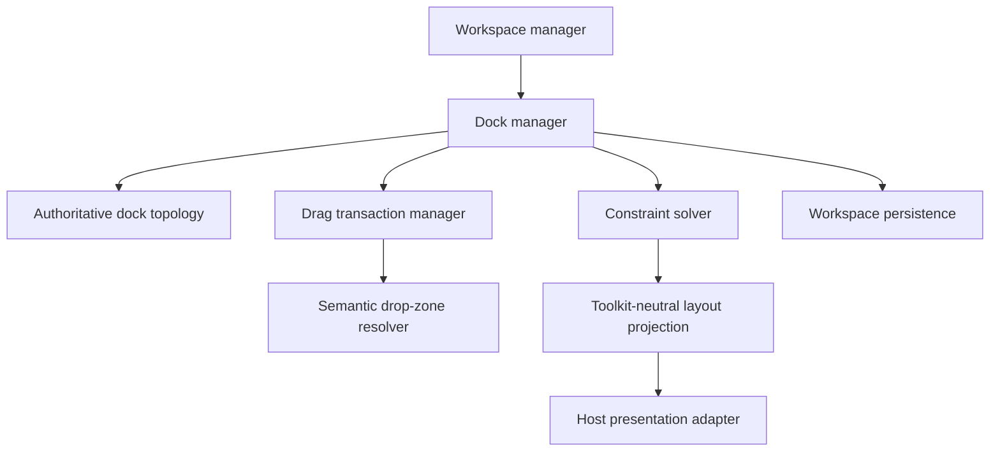
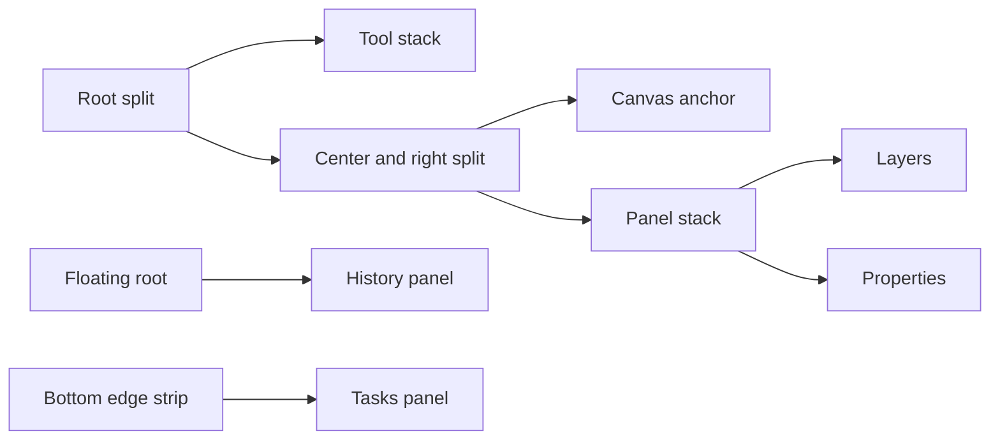
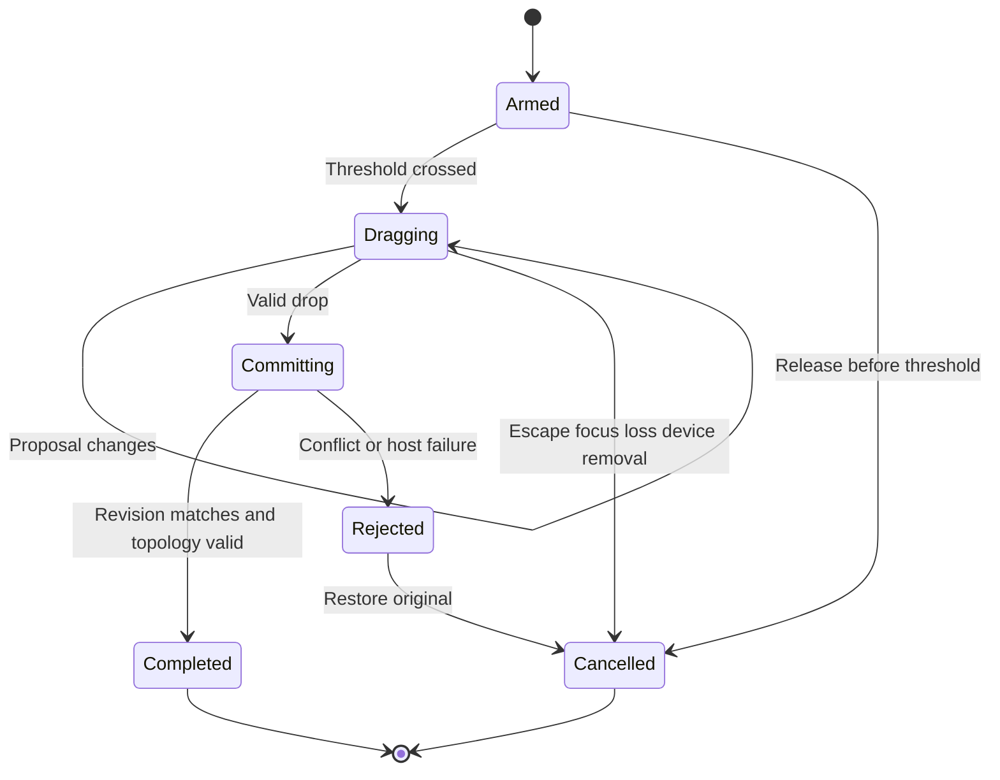
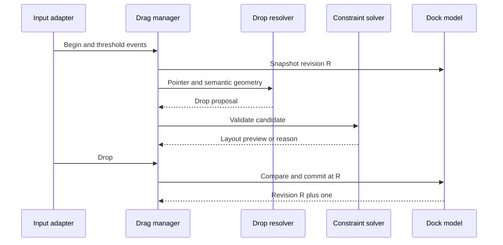
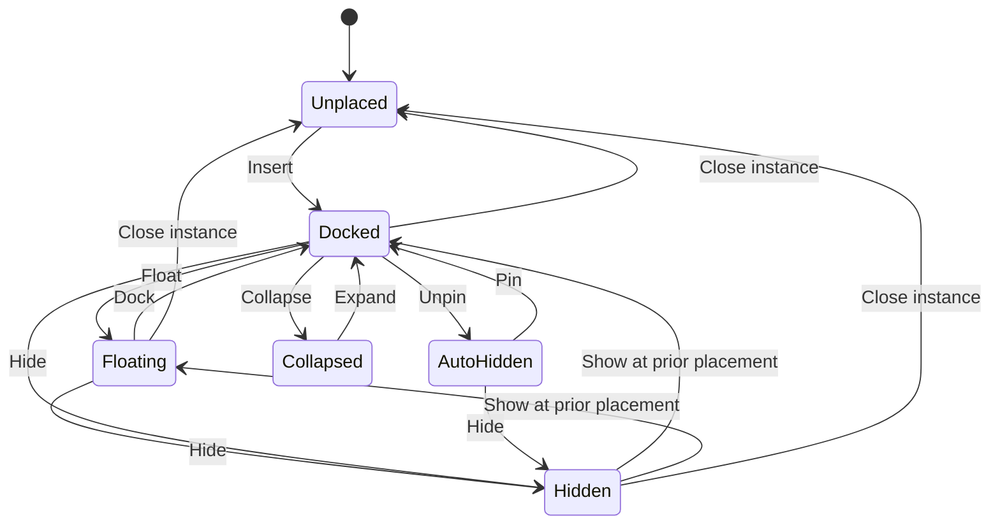
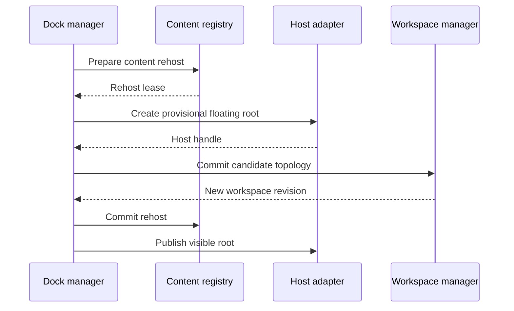
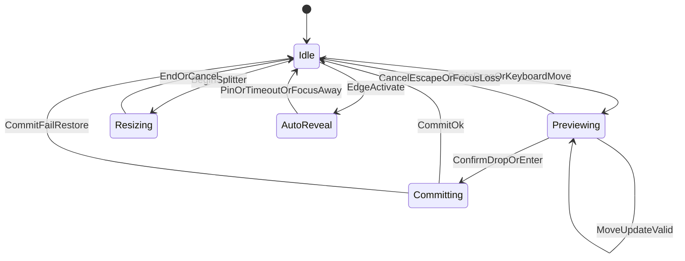
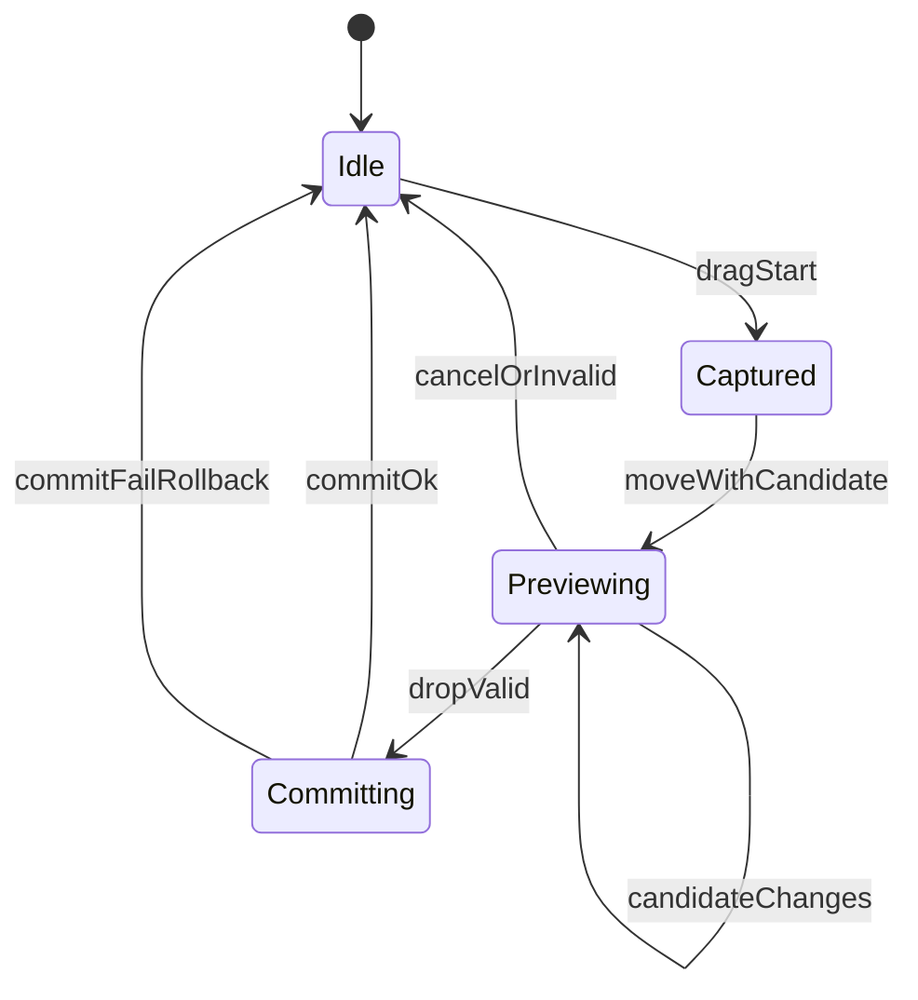

# 04 — Docking System

## Overview

Docking arranges workspace content through dock, float, pin, auto-hide, collapse, tab, split, and resize operations. It owns layout topology and direct-manipulation transactions, not panel meaning, document state, or native toolkit widgets. Every rearrangement is previewed against an immutable starting topology and commits atomically. Cancel or failure restores exact pre-drag arrangement.

## Responsibilities

Docking **MUST** provide deterministic topology, stable node and instance identity, constrained resizing, visible drop intent, keyboard alternatives, accessibility semantics, offscreen recovery, and versioned serialization. It **MUST NOT** mutate documents, infer panel context, persist pointer coordinates as topology, or let extensions edit layout trees directly. It **SHOULD** support dock, float, pin, collapse, resize, tab reorder, stack merge, split creation, and bounded auto-hide. It **MAY** support detachable groups when host capabilities permit.

## Architecture and Internal Hierarchy



```text
Dock system
├── topology model
│   ├── split nodes
│   ├── stack nodes
│   ├── edge strips
│   ├── floating roots
│   └── canvas anchor
├── constraint solver
├── drag transaction
├── resize transaction
├── focus transfer
├── accessibility projection
└── serializer/validator
```

```rust
enum DockNode {
    Split { id: NodeId, axis: Axis, ratio: Ratio, first: NodeId, second: NodeId },
    Stack { id: NodeId, items: List<ContentId>, active: ContentId },
    EdgeStrip { id: NodeId, edge: Edge, items: List<ContentId> },
    CanvasAnchor { id: NodeId },
}

enum Placement {
    Docked { stack: NodeId, index: UInt },
    Floating { root: FloatingRootId, rect: LogicalRect, display: DisplayHint },
    AutoHidden { edge: Edge, index: UInt },
    Collapsed { prior: Box<Placement> },
    Unplaced,
}

struct DockTransaction {
    id: TransactionId,
    base_revision: LayoutRevision,
    source: List<ContentId>,
    original: TopologySnapshot,
    proposal: Option<DropProposal>,
    phase: DragPhase,
}
```

Node IDs and content IDs are stable. Child array positions are never identity. Floating roots are workspace-owned semantic windows whose native surfaces may be recreated.

## Topology

The main root is an acyclic tree containing one canvas anchor. Stack leaves hold panel or toolbar content. Split nodes divide logical space. Edge strips represent pinned auto-hidden content. Floating roots contain independent valid subtrees and cannot contain the main canvas anchor.



Invariants:

- exactly one canvas anchor exists in main topology;
- every placed content instance occurs exactly once;
- every referenced node exists and has one parent except roots;
- split ratios are finite and bounded;
- stack active item belongs to that stack;
- empty stacks and redundant one-child splits are normalized away;
- floating rectangles have positive logical dimensions;
- topology depth and item counts obey configured limits;
- content constraints cannot force canvas below its minimum.

Normalization is deterministic. It runs on candidate topology before commit and never changes semantic ordering unnecessarily.

## Operations

### Dock and tab

Docking into a stack inserts content at explicit index. Docking onto an edge creates or reuses a split according to proposal. Tabbing combines compatible content into one stack. Compatibility comes from content descriptors: allowed regions, minimum size, singleton policy, floatability, and grouping class.

### Float

Floating removes content from main topology and creates a floating root with logical geometry anchored to a display hint. Failure to create a host window leaves content at its original placement. Closing a floating host surface follows descriptor policy: redock, hide, or close instance. It never destroys document content.

### Pin and auto-hide

Pinning moves content between a dock stack and edge strip while retaining `prior_docked_placement`. Auto-hidden content opens as a temporary overlay, receives focus, and closes on explicit dismiss or focus transition according to accessibility-safe timing. Hover **MUST NOT** be the only opening mechanism. Keyboard activation and persistent pin action are required.

### Collapse

Collapse removes content’s occupied extent but retains placement and state. It differs from close, which may destroy an instance, and hide, which removes presentation while retaining an instance. Labels and commands **MUST** distinguish these outcomes.

### Resize

Resize starts from a topology revision and adjusts one split ratio or floating rectangle. Solver clamps against minimum/maximum constraints and available logical size. Preview is presentation-only; release commits one workspace transaction. Escape restores original ratio. Double-click **MAY** reset to descriptor-preferred sizes but cannot be the sole reset path.

**Shipped rule — the seam's ceiling comes from the dock, not from a constant.**
`PanelResizeGrip` clamped at a constant 2000, mirroring
`DockTopology::MAX_PANEL_HEIGHT`, and neither side subtracted what the panels
below the seam needed: the "available logical size" half of the sentence above
was simply missing. One drag to the bottom of the screen made the panel above
fill the dock and every group under it vanish — not collapsed to a header, not
reachable by scrolling — while the Window menu still listed them as visible.

`Main.qml`'s `panelMaxHeight` supplies the ceiling now, reserving the panel's
own header plus a header *and* a minimum body for every group below it.
Reserving only the headers is not enough: the dock is a `GridLayout`, which
lays its rows out at the heights they ask for and lets the overflow fall off
the bottom, so a body below that still wants its minimum takes its header with
it.

The budget is computed in QML because the dock's height is a QML fact. The
engine keeps its own absolute bounds; clamping only there would let the drag
run past the limit and snap back on release, which is what the grip was written
to avoid. `every_dock_seam_is_clamped_against_the_dock` pins both halves — the
helper and the binding at every seam — because a missing binding is silent:
`maximumHeight` is an `int`, so an undefined value reads as 0 and the grip
falls back to the absolute bound.

**Shipped rule — a tear-off and a dock is a round trip.** `redock` used to
append, so a panel torn from the middle of the stack came back at the bottom in
a group of its own: the workspace after was not the workspace before.
`FloatingPanelPlacement` records the panel's `dock_index` and whether it was
`tabbed` with the panel above it, and a redock with no explicit drop position
restores both. An explicit position still wins — dragging a floating panel onto
the stack is the user saying where it belongs now, and joining it to whatever
happens to sit above that point would be a group they did not ask for.

## Drag Transaction Workflow



1. Press identifies semantic content and records base revision.
2. Movement below host-appropriate threshold remains a click.
3. Threshold crossing captures input and snapshots source topology, focus, and placement.
4. Hit resolver computes zones from semantic layout geometry: before, after, into stack, split left/right/top/bottom, edge pin, or float.
5. Solver builds candidate topology without mutating live topology.
6. Preview shows exact affected rectangle, target stack, operation, validity, and invalid reason.
7. Drop rechecks source existence, descriptor constraints, base revision, and host capability.
8. Valid candidate atomically replaces topology and transfers focus.
9. Invalid, cancelled, stale, or failed proposal restores original topology and focus.



Cross-window drag uses the same transaction if both workspaces share a coordinator. Otherwise it is a remove-and-insert protocol with a reservation: destination validates first, source releases second, destination commits last; any failure restores source. Document locks are never held.

## Keyboard and Accessibility

Every pointer rearrangement **MUST** have named actions: Move Panel, Dock Left/Right/Top/Bottom, Add to Tab Group, Float, Pin, Unpin, Collapse, Expand, Move to Next Group, and Reset Size. Move mode exposes valid destinations as a navigable list. The accessibility tree reports content name, placement state, tab position, expanded/collapsed state, and available docking actions.

Drop previews produce rate-limited status such as “Dock Properties after Layers” or “Cannot place: minimum canvas width.” Focus remains on moved content after commit. Auto-hide overlays trap neither keyboard nor assistive navigation; Escape closes overlay and returns focus to invoker.

## Tab Groups

A dock region presents panels as **tab groups**: a contiguous run of the region's ordered stack shown in one place, with one member visible at a time. Stacking every panel gives the lower ones no usable height at ordinary window sizes, and grouping is what users of comparable editors expect.

Grouping **MUST** be derived from the region's existing ordered sequence rather than stored as nested lists, so ordering, move, tear-off and auto-hide keep operating on one flat structure and cannot disagree with the grouping.

Every operation that changes the sequence **MUST** restore the grouping invariants: a group **MUST NOT** reference a panel that has left the region, and the first panel of a region **MUST NOT** be marked as joining a group above it. Normalizing at each mutation is required rather than validating after the fact, because the invalid states are reachable through ordinary use — tearing off the first tab of a group, or reordering a grouped panel to the head.

A group's selection is presentation state. It **MUST** be scoped to its own group: raising a tab **MUST NOT** change which tab any other group is showing.

A group of one **MUST** present exactly as an ungrouped panel did. Grouping is a layout decision, and a lone panel wearing tab chrome asks the user to interpret a distinction that carries no information.

Tab selection **MUST NOT** be indicated by colour alone, and the selected tab's state **MUST** reach assistive technology. The header controls shown alongside the tabs belong to the **visible** panel, not to the group.

## Persistence and Versioning

Serialization stores semantic topology, logical sizes, normalized display anchors, content IDs, and placement history. Runtime geometry, animations, host handles, and hit zones are excluded. Validator checks cycles, duplicates, missing roots, oversized collections, invalid ratios, unknown enums, and incompatible placements.

Schema migration preserves unknown bounded extension placement records when possible. Missing content is removed from active topology while a tombstone retains its last placement. Reinstall can restore it only after descriptor validation. Writes use [workspace persistence](03-Workspace-System.md) revision snapshots and staged replacement.

## Concurrency and Ownership

Dock topology has one presentation-authority writer. Readers receive immutable revisioned projections. Descriptor removal, display changes, workspace reset, and drag completion can race; commit uses compare-and-swap semantics on layout revision or an equivalent serialized queue. A stale drag never replays against changed topology automatically because target meaning may have changed.

Host callbacks can arrive after semantic floating root closure. Generation IDs reject stale geometry and focus events. Constraint solving may run off-thread over snapshots, but final validation and native operations occur on correct affinity.

## Failure Handling

- Host window creation failure restores docked placement.
- Display removal adapts floating roots into visible work areas and records original anchor.
- Corrupt topology loads valid independent roots where safe, otherwise default workspace.
- Unsatisfiable constraints collapse lowest-priority optional regions deterministically.
- Content crash closes only affected presentation and leaves a recoverable tombstone.
- Stale drop reports layout changed and restores source.
- Input capture loss cancels transaction.
- Persistence failure keeps in-memory layout and reports workspace-state risk; documents remain unaffected.

## Design Rationale and Alternatives

**Immutable candidate transactions** cost allocation but make cancel, conflict, fault injection, and accessibility preview reliable. Incremental live mutation creates difficult rollback and visible topology corruption.

**Tree topology** models adjacency and proportional resize better than absolute rectangles. General graphs permit richer arrangements but complicate constraints and serialization without clear benefit.

**Semantic floating roots** decouple workspace intent from host surfaces. Treating native windows as authoritative loses content on compositor or display events.

**Explicit auto-hide** costs screen interaction but remains accessible. Hover-only reveal is rejected because it fails keyboard, touch, and motor accessibility.

## Best Practices

- Property-test topology normalization and serialization round trips.
- Fuzz malformed trees and extreme dimensions.
- Keep hit testing pure and deterministic.
- Separate drag threshold, proposal, preview, and commit.
- Name operations by outcome, not pointer direction alone.
- Never persist adapted emergency geometry over original intent without policy.
- Preserve focus and tab order by stable content ID.

## Future Extensibility

Future hosts may add detachable tab groups, multi-monitor workspace roots, touch rearrangement, or extension-contributed content constraints. Contributions **MUST** use declarative descriptors, bounded state, and core transactions. Custom arbitrary layout engines or toolkit widget injection are not extension contracts.

## Implementation Reference

### Constraint solving

Each content descriptor publishes minimum, preferred, and optional maximum size in logical units. Split solving proceeds from root available rectangle toward leaves, while minimum-size aggregation proceeds from leaves toward root. For a split on axis A:

```rust
struct AxisConstraint {
    minimum: LogicalLength,
    preferred: LogicalLength,
    maximum: Option<LogicalLength>,
    compression_priority: UInt,
}

struct SolvedSplit {
    first_extent: LogicalLength,
    divider_extent: LogicalLength,
    second_extent: LogicalLength,
    effective_ratio: Ratio,
    constrained: bool,
}
```

The solver first reserves divider extent, then satisfies both minima. Remaining extent follows requested ratio, clamped by maxima. If minima exceed available size, adaptation policy collapses optional content in ascending retention priority and solves again. It never emits negative, non-finite, or overlapping rectangles. Pixel rounding happens only in host projection; accumulated rounding remainder is assigned deterministically so adjacent edges coincide.

Nested resize handles affect one split unless a modifier explicitly requests ancestor resizing. A resized ratio is calculated from logical pointer position and base rectangle, not incremental event deltas, avoiding drift. **The frame that position is measured in has to be one the resize does not move.** `PanelResizeGrip` rides on the header of the panel *below* the seam, so growing the panel above moves the grip down by exactly what the drag just added; measuring the pointer in the grip's own coordinates therefore subtracted the resize from itself. The first motion event landed the right height and every one after it pulled back towards the start, so the seam crawled at a fraction of the pointer — a 120-pixel drag moved it 60. It maps the pointer to scene coordinates now, which do not move, and the same 120-pixel drag moves it 118. Keyboard resizing uses semantic increments and announces resulting percentage or size. Minimum increments scale with accessibility preference and do not depend on frame rate.

### Drop zones

Drop zones are derived from target semantic rectangles and descriptor compatibility:

```rust
struct DropZone {
    id: DropZoneId,
    target_node: NodeId,
    kind: DropKind,
    hit_rect: LogicalRect,
    preview_rect: LogicalRect,
    priority: UInt,
    validity: DropValidity,
}

enum DropKind {
    TabBefore(ContentId),
    TabAfter(ContentId),
    IntoStack(NodeId),
    SplitBefore { axis: Axis },
    SplitAfter { axis: Axis },
    PinToEdge(Edge),
    FloatAt(LogicalPoint),
}
```

Overlapping zones resolve by semantic specificity, then smallest area, then deterministic ID order. Visual proximity alone cannot override incompatibility. A stack tab zone outranks its surrounding split zone when pointer is inside the tab strip. Edge pin zones activate only within bounded workspace-edge regions, not near every panel edge. Float proposal appears only after pointer leaves valid workspace regions or an explicit Float action is chosen.

Auto-scroll during tab or stack drag is velocity-bounded, pauses when pointer stops near an edge, and never changes target identity without updating preview and announcement. Collapsed targets can accept a drop only when descriptor policy defines resulting expansion. Hover expansion uses a delay and collapses again on cancellation if it was transaction-created.

### Topology edit primitives

All user operations compile to a small set of pure edits:

- detach content from current placement;
- insert content into stack at index;
- create split around target node;
- create or destroy floating root;
- move content to edge strip;
- replace node in parent;
- normalize empty/redundant nodes;
- update split ratio or floating geometry.

Each primitive validates local preconditions and returns a new topology plus inverse metadata. Public operations compose primitives against a candidate, then run global validation once. Internal inverses aid diagnostics and tests but cancellation restores the full original snapshot, avoiding dependence on partially executed inverse sequences.

### Drag conflict examples

If a panel closes during its drag, content identity no longer resolves and transaction cancels. If an unrelated stack changes, strict base-revision comparison rejects commit; future optimization **MAY** permit subtree revision comparison only after proving proposal target and source ancestry unchanged. If display topology changes while floating, candidate is re-solved against new visible work areas before user can drop. If workspace shutdown begins, all drag and resize transactions cancel before persistence snapshot.

### Interaction feedback

Feedback has four coordinated channels:

- geometric highlight for proposed occupied area;
- insertion marker for tab/ordered placement;
- cursor or pointer affordance expressing operation;
- semantic status naming content, destination, and validity.

Color alone cannot distinguish valid from invalid. Invalid proposals retain visible source and provide a concise reason. Preview animation honors reduced-motion preference and cannot delay commit. During keyboard move mode, destinations are ordered spatially within region, then by topology order, and the current destination is announced.

### Diagnostics and verification evidence

Local diagnostics record transaction ID, base/final revision, source content IDs, proposal kind, validation outcome, adaptation reason, host-window outcome, and duration. They exclude panel contents and document metadata. A reproducible topology fixture can be exported only by explicit user action and should replace private labels with descriptor IDs.

Verification suites **SHOULD** include:

- generated valid topology round trips;
- arbitrary malformed topology under depth and count limits;
- every operation followed by invariant validation;
- cancellation after every transaction phase;
- randomized resize sequences proving no overlap or negative extent;
- display add/remove and fractional-scale changes;
- keyboard-only move and resize;
- assistive-technology announcements;
- descriptor removal during drag;
- native floating-window failure before and after creation.

## Docking Service Interfaces

```rust
interface DockManager {
    snapshot(workspace: WorkspaceId) -> Result<DockSnapshot, DockError>;
    begin_drag(request: DragBeginRequest) -> Result<DockTransactionId, DockError>;
    update_drag(id: DockTransactionId, input: DragInput) -> Result<DropPreview, DockError>;
    commit_drag(id: DockTransactionId, release: DragRelease) -> Result<DockCommit, DockError>;
    cancel_drag(id: DockTransactionId, reason: CancelReason) -> Result<Void, DockError>;
    begin_resize(request: ResizeBeginRequest) -> Result<ResizeTransactionId, DockError>;
    apply_action(action: DockActionRequest) -> Result<DockCommit, DockError>;
}

interface DockContentRegistry {
    descriptor(content: ContentId) -> Result<DockContentDescriptor, ContentError>;
    lifecycle(content: ContentId) -> ContentLifecycle;
    prepare_rehost(content: ContentId, target: HostTarget) -> Result<RehostLease, ContentError>;
    commit_rehost(lease: RehostLease) -> Result<Void, ContentError>;
    abort_rehost(lease: RehostLease);
}

interface DockHostAdapter {
    create_floating_root(request: FloatingRootRequest) -> Result<HostFloatingHandle, HostError>;
    destroy_floating_root(handle: HostFloatingHandle) -> Result<Void, HostError>;
    visible_work_areas() -> DisplayTopology;
    request_pointer_capture(window: WindowId, device: DeviceId) -> Result<CaptureLease, HostError>;
    release_pointer_capture(lease: CaptureLease);
}
```

`DockContentDescriptor` declares content kind, multiplicity, allowed placement classes, compatible stack classes, minimum/preferred/maximum dimensions, float and auto-hide support, close/hide semantics, compression priority, and accessibility metadata. These constraints are immutable for one descriptor generation. A dynamic content need is expressed as a new generation and reconciliation, not mutation during solving.

`DockSnapshot` contains topology revision, descriptor generation, display generation, focus path, solved logical rectangles, and placement map. Solved rectangles are derived and excluded from durable topology. Transaction requests identify expected generations; host adapter handles remain opaque.

## Placement State Models

Content lifecycle and placement state are related but distinct:



`Hidden` retains a live panel instance without a visible placement. `Collapsed` retains its dock location and header representation. `AutoHidden` retains an edge-strip control and opens temporary overlay. `Unplaced` means no topology ownership; the underlying instance may be closed or awaiting initial placement. Serialization records enough prior placement for Show/Expand but bounds nested history to one canonical fallback chain.

Floating-root lifecycle:



If host creation fails, rehost lease aborts. If workspace commit conflicts, provisional host root is destroyed. If content commit fails after topology commit, manager performs a compensating workspace transaction to restore original placement; it does not leave an empty floating window. This narrow compensation is tested with fault injection.

## Keyboard Move and Resize Modes

Keyboard Move starts from focused content and creates the same immutable transaction as pointer drag. Destination enumeration contains semantic choices, not screen coordinates:

```rust
struct DockDestination {
    id: DockDestinationId,
    operation: DropKind,
    target: NodeId,
    label: Text,
    relation: DestinationRelation,
    validity: DropValidity,
    spatial_order: UInt,
}
```

User navigates destinations, hears operation/target/validity, previews candidate, and commits with Activate. Escape restores source. Tab may cycle destination regions only when it does not leave move mode ambiguously. A direct action such as “Dock Right” resolves nearest compatible workspace edge and still validates minimum canvas.

Keyboard Resize selects an adjacent split handle or floating edge, then applies logical increments. Fine/coarse adjustment is a host-normalized modifier policy. Current width/height or percentage is exposed as semantic value. Limits produce one bounded announcement, not repeated errors while key repeats. Reset Size is a named action.

Auto-hide overlay interaction:

- edge-strip item is a persistent focusable control;
- Activate opens overlay and transfers focus to panel’s last valid path;
- Escape closes and returns focus to strip item;
- pin action converts overlay into docked stack atomically;
- pointer departure alone does not close while keyboard focus remains inside;
- focus transition to unrelated region closes after host-appropriate bounded delay;
- screen reader exploration does not trigger hover dismissal;
- overlay geometry never covers the only route to close/pin actions.

## Topology Migration Rules

Schema versions are migrated through explicit adjacent transforms. Each transform validates input and output. Typical migrations:

- absolute pixel split sizes become bounded logical ratios using recorded scale and root extent;
- old hidden booleans become explicit `Hidden { prior }` placement;
- monitor ordinals become display hints plus normalized work-area rectangles;
- panel type IDs become instance IDs through deterministic allocation;
- unknown stack kinds become standard stacks if child compatibility is provable;
- removed node kinds preserve bounded opaque source and replace active location with nearest valid subtree.

Migration **MUST NOT** infer a content instance from a translated label. Stable descriptor IDs are required. If an old record duplicates one singleton panel, migration retains deterministic highest-priority placement and records discarded duplicate. If a ratio is NaN, infinite, or outside range, preferred constraints produce replacement; invalid numeric values never reach solver.

Writer compatibility rules:

- reader accepts current version and declared older versions;
- newer record loads known independently valid envelope fields only when forward-compatible marker permits;
- application does not overwrite a newer source with downgraded representation automatically;
- tombstone expiry is policy/versioned and never removes currently unavailable document-relevant state;
- migration diagnostics identify transform IDs, not private panel content.

## Error and Lifecycle Matrix

Drag begin:

- source missing: reject without capture;
- source already in another transaction: reject or focus existing transaction;
- descriptor disallows movement: expose disabled reason;
- pointer capture denied: remain click behavior and offer keyboard Move;
- workspace closing: reject as lifecycle unavailable.

Drag update:

- target removed: proposal invalidates and source stays visible;
- display changes: recompute zones against current logical topology;
- descriptor generation changes: cancel unless compatibility can be proven;
- pointer leaves all displays: clamp diagnostic coordinates and retain last invalid float proposal;
- solver exceeds budget: retain last valid preview, mark updating, cancel if no bounded completion.

Commit:

- base revision stale: reject and restore;
- content singleton conflict: reject with existing-instance target;
- native floating root denied: restore and offer dock alternatives;
- persistence fails after commit: keep in-memory topology and show durability warning;
- accessibility bridge fails: operation may commit only if keyboard focus remains recoverable through host fallback.

Resize:

- neighboring content closes: cancel transaction;
- minimum changes mid-resize: resolve against latest descriptor generation or reject;
- window minimizes: cancel preview and preserve committed ratio;
- repeat key release is lost: host focus/device-loss cancellation ends mode;
- floating geometry becomes offscreen: clamp runtime rect and retain intended anchor.

## Platform Adapter Boundary

The dock host adapter owns pointer capture mechanics, native floating surfaces, coordinate conversion, work-area discovery, drag cursor display, and focus requests. Core docking owns threshold policy input, target semantics, candidate topology, validity, operation names, and commit.

Adapter inputs/outputs use logical coordinates tagged with window and display generation. Core does not assume global coordinates are stable under Wayland, that applications can position every top-level window precisely, or that compositor returns persistent monitor IDs. When explicit positioning is unavailable, normalized anchor is a preference and host-selected actual geometry becomes runtime observation.

Toolkit drag-and-drop APIs may transport a process-local opaque transaction token, but cannot be topology authority. Cross-process dock payloads are unsupported. Native tab bars may present controls, but tab order and active content remain core semantic state.

## Observability and Testability

Additional trace events include source placement, candidate edit primitives, normalization steps, solver constraint violations, destination resolution tie-break, host preparation, focus transfer, and persistence scheduling. Histograms include preview solve latency, drag cancellation reasons, offscreen recovery count, transaction conflict rate, and minimum-constraint adaptation.

Pure test modules:

- topology parser/serializer with canonical ordering;
- graph invariant checker;
- constraint aggregation and solver;
- drop-zone generator and overlap resolver;
- edit primitive composer and normalizer;
- display-anchor adaptation;
- destination enumeration;
- focus restoration policy.

Host integration tests use a fake adapter that denies capture, denies floating windows, returns compositor-selected geometry, removes displays, and reports stale focus callbacks. Property tests generate content descriptors and valid trees, then apply random operations while asserting uniqueness, acyclicity, canvas presence, bounds, and deterministic serialization.

### Deterministic acceptance scenarios

**Cancelled cross-stack drag:** drag two panel tabs into another stack, preview reorder, press Escape, assert byte-equivalent canonical topology, source focus, and no persistence revision.

**Concurrent close:** begin dragging Properties, close its instance through another action, release pointer, assert transaction rejected, no empty nodes, capture released once, and unrelated stacks unchanged.

**Floating denial:** request Float through keyboard action while host denies window creation, assert original dock placement and focus survive with disabled reason available.

**Scale transition:** resize split at scale 1.0, switch window to fractional scale during preview, assert logical ratio remains finite, pixel edges meet after reprojection, and no persisted pixel geometry appears.

**Auto-hide accessibility:** unpin Layers, activate edge item by keyboard, navigate tree with assistive technology, pin panel, assert focus remains on same semantic row and placement changes once.

**Malformed restore:** load cyclic root, duplicate content, NaN ratio, and offscreen floating rect; assert bounded validation, default safe topology, visible recovered content where unambiguous, and no document effects.

### Topology identity across normalization

Normalization preserves IDs for nodes whose semantic role and child set survive. When removing an empty stack or redundant split, the surviving child retains its ID; parent references are rewritten in one candidate. When two stacks merge, destination stack retains ID and source becomes a retired ID recorded for one revision so focus and diagnostics can map callbacks. Retired IDs never become valid new nodes. This policy prevents native callbacks, accessibility paths, and persisted focus from attaching to unrelated content after structural simplification. Tests assert deterministic retired-ID maps for every primitive composition and ensure maps expire only after all prior-generation callbacks are rejectable.

## Extended Edge-Case Matrix

Docking edges for drag, keyboard, float, pin, and restore:

- Drop on invalid gap after preview showed valid: commit rejects; topology unchanged; pointer capture released.
- Drag begins on tab header, pointer leaves window, host denies capture: cancel transaction; source highlight clears.
- Split resize with sibling collapsed: expanding sibling first respects collapsed min; cannot steal canvas below hard minimum.
- Float request while inhibit of new windows active: operation disabled with reason; docked placement kept.
- Unpin during auto-hide reveal animation (reduced motion off): commit pin in one revision; animation generation cancelled.
- Reorder tabs with duplicate content ID injected: validation fails; no partial reorder.
- Keyboard move mode open when display topology changes: mode cancels; user re-enters against new geometry.
- Drop creating 3-way split exceeding depth budget: reject; suggest stack alternative in diagnostics.
- Collapse last non-canvas panel in a strip: strip may remove; canvas expands; empty stack nodes normalize away with retired IDs.
- Host fractional scale changes during live resize preview: preview recomputes from logical ratio; no pixel persistence.
- Restore floating rect fully outside all displays: clamp center to primary work area; keep size within min/max.
- Two rapid dock commits from repeat key: second sees new revision or coalesces; never duplicates content.
- Missing contribution during dock of tombstone: move tombstone placement; do not materialize executable panel.
- Escape during keyboard resize: restore pre-mode ratios exactly, including nested ancestors.
- Drag over canvas center vs edge threshold flapping: hysteresis prevents commit oscillation; preview name stable for dwell time.
- Auto-hide edge conflict with OS hot edge: adapter reports reserved edge; docking shifts reveal hit region inward.
- Stack merge after both sides hold focus history: destination keeps ID; focus maps via retired-ID table for one revision.
- Persist while drag transaction open: persistence writes last committed revision only; in-flight candidate excluded.

## Host Adapter Docking Contract

Docking core computes candidates; host draws chrome and hit targets.

Required capabilities:

- hit-test regions for tabs, splitters, title bars, and edge reveal buttons in logical coordinates;
- optional rubber-band/preview overlay API with operation name and validity;
- pointer capture/release with failure codes;
- floating window create/move/resize with denial;
- cursor shape hints for resize/move without forcing OS cursor themes;
- accessibility actions mirroring Dock/Float/Pin/Collapse/Resize/Reorder.

Rules:

- Preview overlays are ephemeral and must not create topology nodes.
- Physical pixel snapping occurs only in adapter projection after core logical commit.
- Denied float returns typed error; core does not fake an offscreen dock as success.
- Adapter reports compositor edge reservations; core shrinks interactive reveal zones.
- All docking commands remain available via keyboard even when pointer preview unavailable.
- Host must not invent drop targets; targets come from core hit map for current revision.



## Versioning and Migration Notes

Docking topology schema versions nest under workspace schema. Node records include `node_id`, `kind`, `children`, `ratio`, `stack_order`, `pin_state`, `float_frame_logical`, and optional `tombstone_ref`.

Migration:

- Legacy pixel float frames → logical via scale; invalid → centered default size.
- Deprecated `side_panel` enums map to stack+placement hints.
- Ratios outside bounds normalize with sibling redistribution; log once per node.
- Retired ID maps are not persisted across sessions; only in-memory for callback safety.
- Depth and fanout limits apply at read time; excess nodes collapse to safe default subtree replacing the offending branch only when isolation is clear; else full default.
- Pin state for unknown content becomes unpinned tombstone.
- Auto-hide edge preference migrates; if edge reserved by host, nearest free edge chosen.

Writers always emit canonical normalized topology (no empty stacks, no 1-child splits) so diffs stay stable. Readers accept non-normalized input and normalize before commit.

## Extended Observability Hooks

- `dock.tx_begin{kind,rev}`
- `dock.preview{op,valid,target}`
- `dock.commit{op,rev_before,rev_after,ms}`
- `dock.cancel{reason}`
- `dock.normalize{retired_ids,removed_nodes}`
- `dock.float_denied{code}`
- `dock.autohide{reveal,pin}`
- `dock.validate_fail{code,node}`

Traces attach workspace revision and window ID. Preview spam is sampled. Tests assert that document version counters remain constant across a scripted docking marathon and that retired-ID maps expire only after generation barriers.

## Security and Trust Notes

- Topology from disk is untrusted graph data: bound nodes, depth, string sizes, and float finiteness before building native widgets.
- Docking cannot grant extension panels new capabilities; it only places existing contribution IDs.
- Floating windows inherit the same process trust; they are not a sandbox boundary.
- Hit-testing must not execute extension code; providers are queried only for already-registered descriptors.
- Persistence must not write pointer path history that could include content titles beyond stable IDs without redaction policy.
- Malformed cyclic graphs are rejected without recursive native construction.

## Deterministic Acceptance Scenarios

**Scenario D1 — Cancel restores:** begin drag of Layers to canvas edge; Escape; assert identical topology hash and focus target.

**Scenario D2 — Atomic commit:** dock Histogram beside Layers; kill after candidate build before commit; assert prior topology; after successful commit, one Histogram instance only.

**Scenario D3 — Float denied:** keyboard Float while adapter denies windows; assert placement unchanged; disabled reason queryable; focus unchanged.

**Scenario D4 — Canvas minimum:** aggressively enlarge side stack; assert canvas width/height ≥ hard minimum; operation may collapse optional panels by priority.

**Scenario D5 — Unique content:** attempt drop that would duplicate Layers ID; assert reject; source unchanged.

**Scenario D6 — Scale mid-resize:** resize split; change scale; assert finite ratio; pixel edges abut after project; session has logical ratio only.

**Scenario D7 — Malformed restore:** cyclic+NaN+duplicate fixture; assert safe default; onscreen content where unambiguous; document versions untouched.

**Scenario D8 — Auto-hide a11y:** unpin; reveal by keyboard; navigate tree; pin; assert same semantic row focus; one placement commit.

## Neighboring Subsystem Interactions

- **Workspace:** docking commits are workspace topology transactions. Workspace solver enforces global mins and responsive collapse after docking primitives apply.
- **Panels:** content IDs refer to panel instances; docking moves placement, not panel drafts. Destroying a node unmounts panel UI without document commands.
- **Toolbars:** toolbars may live in dockable regions; tool activation still routes to command/tool framework, not docking.
- **Lifecycle:** window/display events enter lifecycle then workspace/docking; device loss does not abort committed dock state.
- **Commands/shortcuts:** Dock/Float/Pin/etc. are invokable actions; they must not be document-scoped transactions.
- **Accessibility/input:** keyboard move/resize modes are docking-owned; gesture model supplies pointer intents only.
- **Persistence:** docking state serializes inside workspace records; corrupt docking cannot mark documents dirty.

Invariant: every docking commit is atomic presentation mutation; document truth and history remain untouched.

## Extended Docking Topology Contracts

Docking is a pure presentation topology manager. It places panel hosts, splitters, tabs, and floating roots. It never owns document pixels, command authority, or history. This section expands drop validation, persistence, adversarial input, and neighbor contracts.

### Drop Transaction Model

A dock drag is a transactional presentation edit:

1. **Capture** — record source leaf identity, press point, and pointer capture generation.
2. **Preview** — compute candidate targets (center tab, edge split, floating tear, reattach) without mutating committed topology.
3. **Validate** — reject drops that would orphan the last canvas host, exceed max split depth, or place a singleton-required panel into an illegal container.
4. **Commit** — apply a topology patch with a new generation ID and emit layout-changed.
5. **Abort** — on escape, capture loss, or invalid target, discard preview and restore visuals.

Partial commits are forbidden. If host window creation for a floating root fails after semantic tear-off, the docking core **MUST** roll back to the pre-drag topology and surface a typed presentation error.



### Geometry and Hit-Testing Rules

- Splitter sizes persist as ratios plus minimum pixel clamps, not absolute-only coordinates, so scale changes remain stable.
- Hit targets enlarge under accessibility large-pointer modes without changing committed ratios until the user releases.
- Tab reorder within a leaf is a topology patch distinct from cross-leaf moves.
- Collapsed leaves retain identity and cached size ratios for expand.
- Pinned floating windows store monitor-relative anchors; on monitor removal they reattach or clamp according to workspace policy.

### Neighbor Interactions

- **Workspace:** owns roots and serialization envelope; docking owns interior graph.
- **Panels:** provide min sizes, dockability flags, and singleton constraints; docking enforces them.
- **Toolbar:** may dock as a constrained leaf type; tool options bar has a reserved host region that docking **MUST NOT** steal for arbitrary panels unless the workspace preset explicitly allows it.
- **Lifecycle:** shutdown serializes committed topology only; in-drag preview state is discarded.
- **Commands:** "Reset docking", "Float panel", and "Dock panel" are presentation commands routed through action IDs, not document commands.

### Failure and Edge Catalog

- Nested splits beyond configured depth: reject with reason `max_split_depth`.
- Drop onto a leaf that forbids the panel family: reject with reason `incompatible_host`.
- Floating root closed by the host while a drag references it: invalidate drag generation.
- Dual pointer/pen sources attempting concurrent dock drags: serialize; second drag ignored or rejected.
- Layout file with cycles or duplicated leaf IDs: reject whole topology, fallback to default docking for that window.

### Observability

Record drag start/end, commit/rollback, fallback loads, and clamp events with topology generation and leaf IDs. Avoid logging panel document contents. Provide a debug overlay in developer builds that visualizes leaf IDs and ratios without shipping it enabled by default.

### Migration

Topology schema migrations **MUST** preserve leaf IDs when possible. Deprecated container kinds map to nearest supported kind. Unknown leaf types become placeholders with preserved size so future versions or reinstalled extensions can reclaim them.

### Deterministic Acceptance Scenarios

1. Tear Layers to floating, move across monitors, reattach as right split: IDs preserved; follow/pin state unchanged.
2. Collapse a tab stack, restart app: collapsed state restored; expanding reveals same tab order.
3. Attempt to dock a singleton panel where another instance exists: operation rejected; existing instance focused instead if policy says so.
4. Kill the process mid-drag: next launch restores last committed topology, not preview.
5. Screen reader user moves focus to splitter and adjusts with keys: ratios update, announcement reports orientation and approximate percentage.

### Security

Topology documents are data. Parsers bound node counts and string sizes. No embedded scripts. Extension-provided dock targets are capability-gated descriptors, not free-form host code paths.

## Acceptance Criteria

- Dock, float, pin, unpin, collapse, expand, resize, reorder, and tab operations commit atomically.
- Escape, focus loss, device removal, invalid target, host failure, and stale revision restore source exactly.
- Pointer preview names operation and validity.
- Keyboard can perform every docking operation.
- One content instance cannot appear twice.
- Canvas minimum survives unsatisfiable layouts.
- Floating content returns onscreen after display removal.
- Corrupt/cyclic topology cannot exhaust resources or affect documents.
- Missing contribution retains recoverable placement tombstone.
- Workspace mutation never enters document history.

## Cross References

- [01 — Information Architecture](01-Information-Architecture.md)
- [02 — Application Lifecycle](02-Application-Lifecycle.md)
- [03 — Workspace System](03-Workspace-System.md)
- [05 — Panel System](05-Panel-System.md)
- [06 — Toolbar System](06-Toolbar-System.md)
- [08 — Command System](08-Command-System.md)
- [09 — Shortcut System](09-Shortcut-System.md)
- [Glossary](Appendix/Glossary.md)
- [Requirement Keywords](Appendix/Requirement-Keywords.md)
- Downstream: `18-Input-and-Gesture-Model.md`
- Downstream: `22-Accessibility.md`
- Downstream: `23-Workspace-Persistence.md`
- Downstream: `26-Linux-Host-Integration.md`
