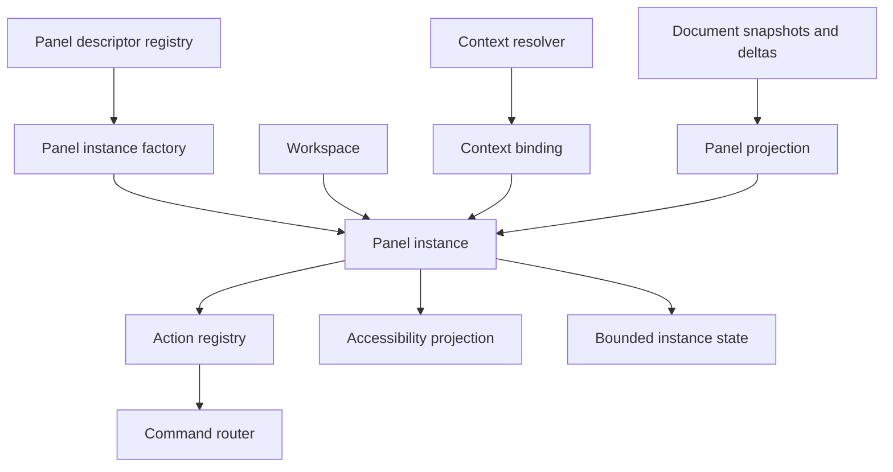
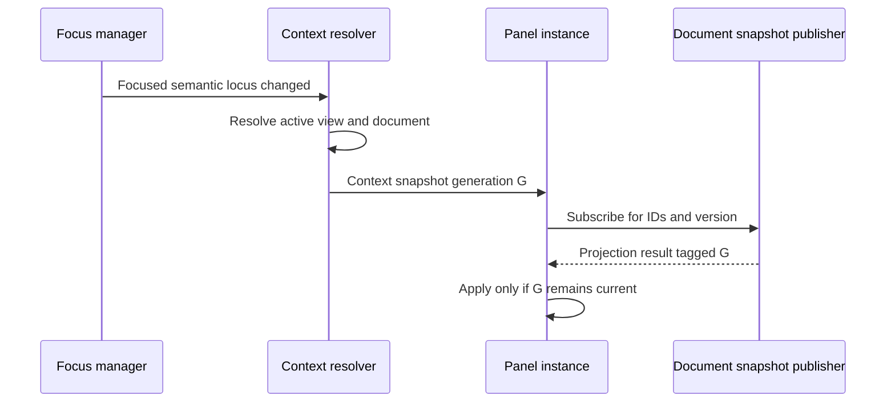
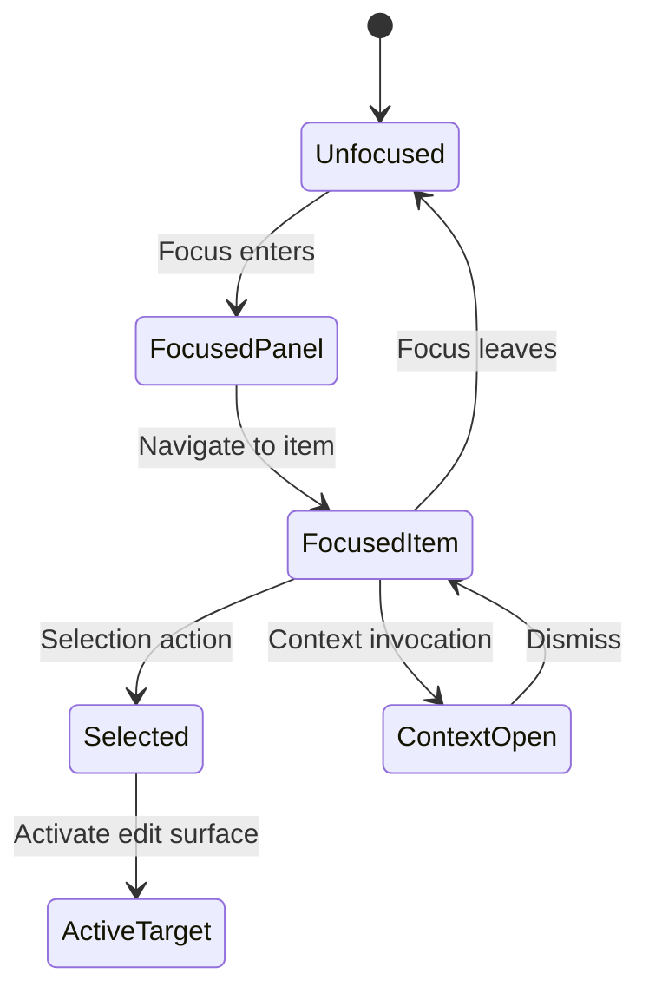
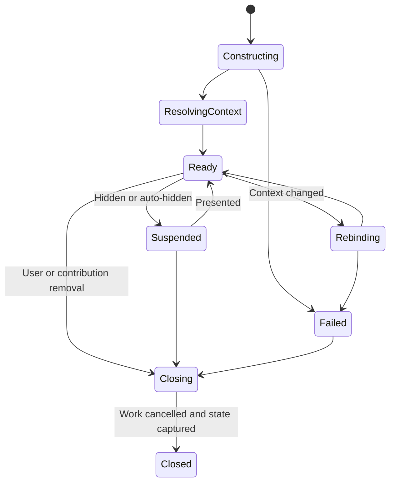
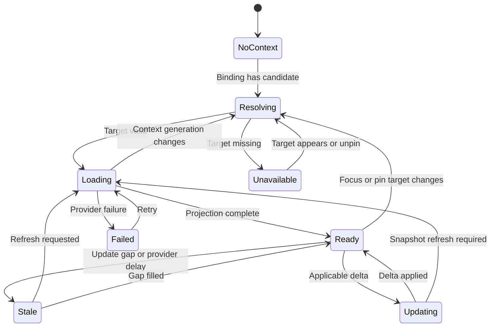
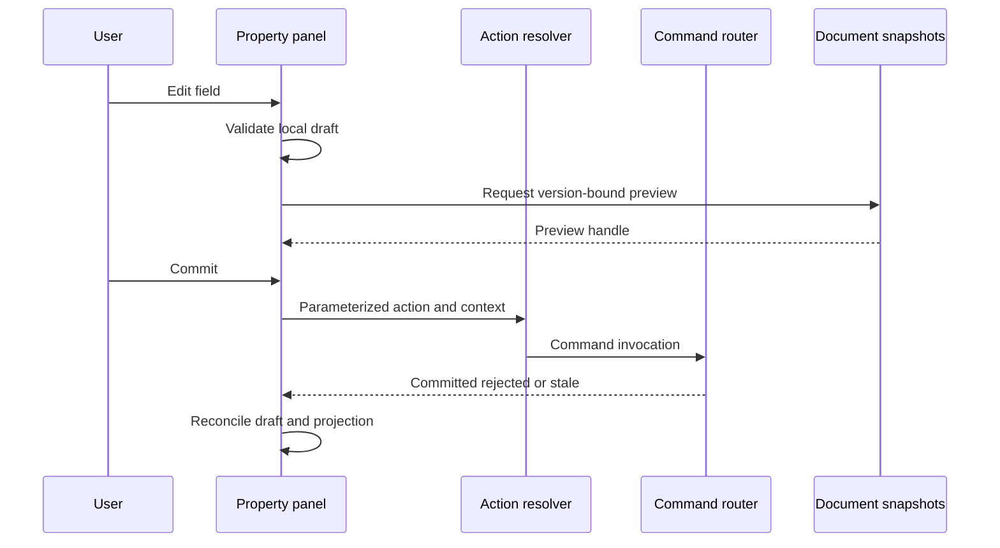
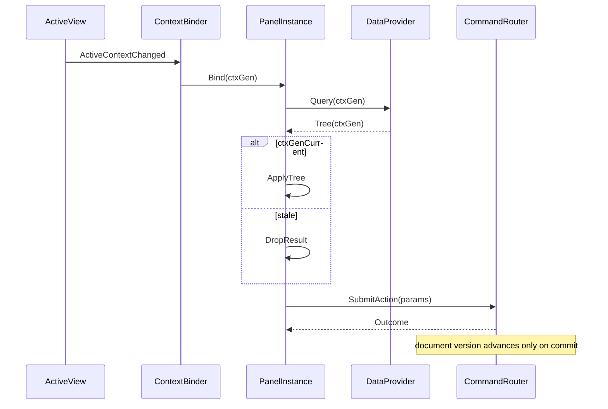
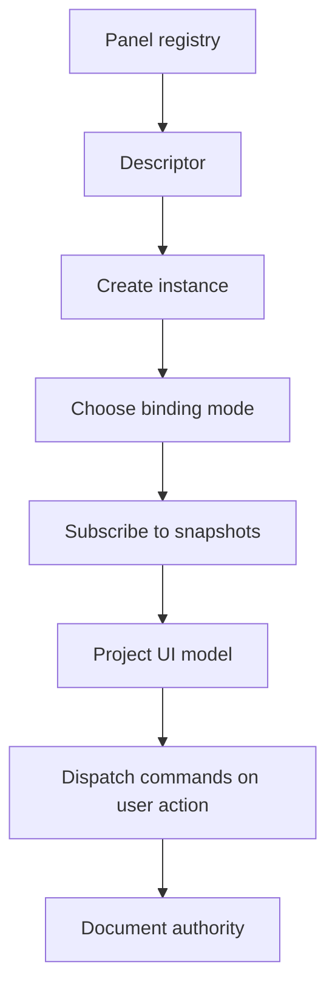

# 05 — Panel System

## Overview

Panels present document structure, properties, resources, history, tasks, navigation, and diagnostics. A panel is a semantic presentation instance created from a registered descriptor. It observes context and emits actions; it never owns authoritative document state or bypasses [08 — Command System](08-Command-System.md). This specification defines descriptors, instances, context binding, focus, async projections, persistence, and contribution boundaries.

## Responsibilities

The panel system **MUST**:

- register stable panel descriptors independently from instances;
- declare singleton/multi-instance policy, allowed placements, context binding, accessibility, persistence, and resource limits;
- distinguish application, active-document, focused-view, selected-object, active-edit-target, and pinned context;
- preserve focus and selection through asynchronous updates using stable IDs;
- route all mutations through semantic actions and commands;
- expose loading, empty, unavailable, stale, error, and partial states;
- cancel work when an instance or context generation expires;
- prevent panel-local state from becoming document truth.

It **SHOULD** support multiple instances where useful, pinning, virtualization, progressive disclosure, and headless projection tests. It **MAY** permit future sandboxed semantic panel contributions; arbitrary toolkit widget access is not a contract.

The Properties panel organizes its body as registered disclosure groups rather than a flat stack of conditionally visible sections. Group ids, levels, defaults, and the presence-versus-disclosure distinction are specified in [01 — Information Architecture](01-Information-Architecture.md#disclosure-group-registry); header requirements are in [28 — UX Guidelines](28-UX-Guidelines.md). A panel **MUST NOT** store expansion state as document state, and **MUST NOT** rely on a group's widget lifetime to hold a value that belongs to host state.

## Architecture



### Internal hierarchy

```text
Panel subsystem
├── descriptor registry
│   ├── core descriptors
│   └── optional contribution descriptors
├── instance registry
├── context resolver
├── projection adapters
├── focus/navigation models
├── semantic control schema
├── state serializer
└── diagnostics/resource budget
```

## Descriptor and Instance Contracts

```rust
struct PanelDescriptor {
    id: PanelTypeId,
    schema_version: SchemaVersion,
    name: LocalizedTextKey,
    description: LocalizedTextKey,
    category: PanelCategory,
    multiplicity: Multiplicity,
    default_binding: ContextBindingPolicy,
    supported_bindings: Set<ContextBindingKind>,
    placement: PlacementConstraints,
    min_size: LogicalSize,
    ideal_size: LogicalSize,
    actions: List<ActionId>,
    accessibility_role: SemanticRole,
    state_schema: ComponentSchema,
    resource_budget: ResourceBudget,
    provenance: ContributionProvenance,
}

struct PanelInstance {
    id: PanelInstanceId,
    descriptor_id: PanelTypeId,
    lifecycle: PanelPhase,
    binding: ContextBinding,
    context_generation: UInt64,
    focus_path: Option<SemanticFocusPath>,
    local_state: BoundedValue,
    subscriptions: Set<SubscriptionId>,
}
```

Descriptors are immutable after registration for a session. Updates create a new registry generation and migrate instances. A singleton descriptor permits at most one live instance per declared scope. Instance IDs remain stable across docking and ordinary workspace restore.

Descriptors declare behavior, not implementation classes. Presentation adapters may map the same semantic component tree to different native toolkits.

## Context Binding

```rust
enum ContextBinding {
    Application,
    FollowActiveDocument { window: WindowId },
    FollowFocusedView { window: WindowId },
    FollowSelection { view: ViewId },
    FollowActiveEditTarget { view: ViewId },
    PinnedDocument { document: DocumentId },
    PinnedView { view: ViewId },
    PinnedObjects { document: DocumentId, objects: List<ObjectId> },
}
```

Binding resolution produces an immutable `ContextSnapshot` containing session/window/workspace/view/document IDs, document version, selected object IDs, active edit target, active tool, capabilities, and generation. It contains no writable document references.



Pinning freezes the target identity, not the target state. A pinned document panel follows new versions of that document. A pinned object panel reports deleted or unavailable objects rather than silently following selection. Unpinning returns to descriptor default unless the user chooses another supported policy.

Context transition phases are `Resolving`, `Loading`, `Ready`, `Empty`, `Unavailable`, and `Failed`. Panels **MUST** distinguish “no selection” from “selection unsupported,” “document closed,” and “data still loading.”

## Standard Panel Families

- **Object structure:** layers, masks, channels, effects; follows active document or pinned document.
- **Properties:** common and type-specific editable properties; follows selection or active edit target.
- **Resources:** brushes, gradients, patterns, palettes; usually application scope with active-tool filtering.
- **Navigation:** overview, zoom, view list; follows focused view.
- **History:** committed transaction timeline; follows document.
- **Tasks:** import, save, export, filter, renderer recovery; application or workspace scope.
- **Diagnostics:** local bounded operational information; explicit application/document scope.

Every family declares primary action, empty state, keyboard model, context menu capability groups, and failure behavior. A panel cannot make an operation exclusive to its UI; menu or command search remains available.

## Focus, Selection, and Active Target

Panel keyboard focus is not document object selection. Tree and list panels use roving focus: one internal focus item, arrow navigation among items, and explicit selection actions. Focused rows are retained by stable object ID across reorder, virtualization, and delta updates.

Object panels represent at least:

- focused row;
- selected object set;
- primary selected object;
- active edit target;
- context target;
- drag source and proposal.

These states **MUST** have distinguishable semantic and visual representation. Deleting a focused item moves focus to next surviving sibling, prior sibling, parent, panel root, then active canvas. Panel closure returns focus to invoking control or active canvas.



## Property Editing

Property panels consume schemas defining value type, units, range, precision, mixed-state behavior, validation, preview, commit policy, and action ID. Local text entry remains ephemeral until commit policy fires. Live preview is version-bound and cancelable. Commit invokes a parameterized action; command validation remains authoritative.

For multiple targets, projections distinguish common value, mixed value, unavailable on some targets, and partially applicable action. Setting a mixed value applies explicit value to applicable targets only under declared partial policy. Failure reports per-target outcome only when command semantics permit partial transactions; default is atomic all-or-nothing.

## Virtualization and Async Data

Large layer trees and resource catalogs require virtualization without breaking accessibility or stable focus. The model owns logical order and hierarchy; viewport realization is derived. Accessibility exposes logical counts, levels, expanded states, and navigation actions even when rows are not visually instantiated.

Async requests include:

```rust
struct PanelQuery {
    panel_instance: PanelInstanceId,
    context_generation: UInt64,
    source_version: Option<DocumentVersion>,
    query_kind: QueryKind,
    range: Option<LogicalRange>,
    cancellation: CancellationId,
}
```

Results apply only when instance, context generation, source applicability, and requested range remain valid. Queues are bounded. Rapid context changes coalesce pending queries. Expensive previews and thumbnails are lower priority than input and document mutation.

## Panel Lifecycle



Hidden and collapsed panels **SHOULD** release presentation-heavy caches while retaining bounded local state. Suspension stops polling and lowers subscription priority. Close cancels queries, releases subscriptions, serializes allowed state, transfers focus, then unregisters instance. Late callbacks are rejected by instance generation.

## Context Menus and Actions

Panels request context menus from [07 — Context Menus](07-Context-Menus.md) using a captured context snapshot. They do not hardcode mutation handlers. Capability declarations cover primary, create, select/navigation, rename/properties, duplicate/clipboard, structure/order, visibility/lock, conversion, delete, and inspect groups.

Panel-local view actions such as Expand All may execute in workspace scope. Mutating actions such as Delete Layer map to command descriptors. Action enablement is advisory and always revalidated.

## Persistence and Versioning

Persistable panel state may include instance ID, descriptor ID/version, context policy, pin target hint, expansion IDs, sorting/filtering, selected inspector section, and bounded UI preferences. It excludes document content, uncommitted field edits, raw snapshots, operation handles, focus object when privacy policy forbids it, and unrestricted extension blobs.

Pin references to unavailable documents become unresolved hints, not implicit file opens. Object pins are session conveniences and **SHOULD NOT** enter reusable presets. Descriptor migration receives old bounded state and returns validated new state or defaults. Failed migration preserves opaque source for diagnostics but does not instantiate unsafe data.

## State and Invariants

- Every instance references one registered descriptor generation.
- Every instance has one explicit context binding.
- Panel projections are read-only views of coherent source versions.
- Mutations leave panels only as semantic actions.
- Stale query results never overwrite newer context.
- Focus paths use stable IDs, not row indexes.
- One singleton scope cannot contain duplicate live instances.
- Panel state cannot clear or redefine document modified state.
- Panel disappearance never closes a document.
- Extension panel failure cannot block core panel updates.

## Failure Handling

Missing descriptor creates a bounded unavailable placeholder when required for layout recovery. Invalid state resets only the affected instance. Query failure retains last coherent projection when safe, marks it stale, and offers retry. Document closure changes pinned panels to unavailable and follow panels to newly resolved context. Resource pressure discards thumbnails and caches before semantic projection.

An extension panel exceeding time or memory budget is suspended or terminated at its isolation boundary. Its actions become unavailable with provenance and reason. Core commands and documents remain usable.

## Concurrency and Ownership

Panel instances and focus are presentation-authority objects. Document data arrives as immutable snapshots/deltas. Subscription callbacks enqueue bounded updates and never mutate UI from arbitrary workers. Local input state remains on presentation affinity. No panel callback runs while document locks are held; no panel may synchronously wait for GPU, codec, or extension completion.

## Design Rationale and Alternatives

**Descriptors plus instances** support multiple views, restoration, and contributions. Global singleton widgets entangle host and context.

**Explicit binding** adds UI state but prevents cross-document edits caused by ambiguous “current object” globals.

**Semantic component contracts** constrain exotic extension UI, but preserve accessibility, toolkit neutrality, isolation, and testability.

**Immutable projections** can lag by one version, but avoid writable model binding and cross-thread races. Commands reconcile visible optimism with authoritative results.

## Best Practices

- Test descriptors and projections headlessly.
- Keep empty and failure states actionable.
- Preserve focus by stable semantic path.
- Bound extension state and query ranges.
- Coalesce high-frequency deltas.
- Expose disabled reasons and target scope.
- Avoid modal dialogs for iterative property edits.
- Test pinning across document close, restore, and version changes.

## Future Extensibility

The architecture permits specialized deterministic local-content panels, accessibility-oriented inspectors, extension inspector sections, and alternative host presentations. New panels **MUST** declare context, actions, persistence, limits, accessibility, cancellation, and missing-contribution behavior before registration.

## Implementation Reference

### Semantic presentation schema

Panels expose a bounded semantic tree. Core node kinds include heading, group, toolbar, action, disclosure, list, tree, row, property field, value indicator, image preview, progress, status, and error. Each node carries stable local key, role, label, state, relationships, actions, and optional layout hints. The schema describes semantics, not pixel style or toolkit class.

```rust
struct SemanticNode {
    key: ComponentKey,
    role: SemanticRole,
    label: Text,
    description: Option<Text>,
    state: SemanticState,
    relationships: List<SemanticRelationship>,
    actions: List<ActionPresentation>,
    children: BoundedList<SemanticNode>,
}
```

Panel implementations **MUST NOT** use semantic-tree regeneration to smuggle document-sized payloads into the UI. Image previews use bounded resource handles and generation tags. Long collections use range providers. Text length, child count, depth, update rate, and retained generations are budgeted.

### Delta handling

Panel projections subscribe by semantic dependencies rather than every document change. A layer panel depends on layer-tree structure, relevant row properties, selection, and active target. A histogram may depend on document snapshot, view proofing, and selected region. Subscriptions declare whether a delta can be applied incrementally or requires snapshot refresh.

```rust
enum ProjectionUpdate {
    ApplyDelta { from: DocumentVersion, to: DocumentVersion, delta: PanelDelta },
    Replace { version: DocumentVersion, projection: PanelProjection },
    MarkStale { latest_known: DocumentVersion, reason: StaleReason },
}
```

Incremental update is accepted only when `from` equals displayed version and context generation matches. A gap requests replacement. Panels may show an older coherent projection marked busy; they cannot combine rows from incompatible versions. Selection and focus reconciliation runs after model update and before accessibility events, preventing announcements about vanished transient rows.

### Layer-tree navigation reference

Tree rows expose object ID, parent ID, level, sibling position/count, expanded state, selected state, active-edit-target state, visibility, lock state, and child capability. Navigation behavior:

- Up/Down moves logical focus among visible rows.
- Left collapses an expanded row, otherwise focuses parent.
- Right expands a collapsed row, otherwise focuses first child.
- Home/End reaches first/last visible row.
- Page movement uses viewport size but lands on semantic rows.
- Type-ahead searches visible canonical names under locale-aware matching.
- Selection extension uses stable anchor object ID.
- Activation changes active edit target only through explicit action.

Filtering **MUST** indicate hidden selected or active targets. A filtered tree cannot silently move active edit target. Reorder gestures defer to docking-like immutable proposals at the document-object level, then submit one command with stable IDs.

### Inspector commit semantics

Property editors retain `original_value`, `draft_value`, `source_version`, validation state, and commit generation. Escape restores draft to original without command. Enter or focus transition commits according to field policy. If authoritative value changes while draft is dirty, the editor reports conflict and requires keep draft, accept latest, or command-defined merge; it never overwrites silently.

Continuous sliders may produce transient previews and one final command. If responsiveness requires segmented commits, descriptor declares merge key and history policy. Numeric inputs preserve typed precision and unit conversion intent until validation. Clamping is explicit in result; silent clipping is prohibited where it changes professional output.

### Standard instance defaults

The default workspace **SHOULD** instantiate:

- one Layers/Object Structure panel following active document;
- one Properties panel following selection/active edit target;
- one History panel following active document;
- one Tasks panel at application or workspace scope;
- optional resource panels grouped in a stack;
- optional Navigator panel following focused view.

Singleton rules are descriptor-scoped, not hardcoded by panel name. A second Properties panel may be valid when pinned to another document. Layers may allow multiple pinned instances for comparison. Tasks remains application singleton if all operations are globally represented.

### Resource pressure policy

Panel memory tiers are semantic state, visible realization, thumbnails/previews, and speculative caches. Pressure discards in reverse order. Semantic state needed for focus, accessibility, and current values remains until instance suspension/closure. A panel exceeding its budget receives a typed pressure notification and can reduce range or preview resolution. It cannot request eviction of authoritative document data.

### Panel verification matrix

Conformance evidence covers descriptor validation, each context-binding transition, focus after every model deletion shape, mixed property values, stale deltas, range virtualization, 200% scaling, high contrast, reduced motion, panel hide/show/suspend, workspace restore, missing contribution, extension termination, and bounded memory under rapid document switching.

Tests use semantic nodes and action IDs, not screenshot coordinates alone. Host-specific tests add native focus, accessibility bridge, keyboard traversal, and docking integration.

## Panel Service Interfaces

```rust
interface PanelRegistry {
    register(descriptor: PanelDescriptor, factory: PanelFactoryRef) -> Result<RegistrationLease, PanelRegistryError>;
    resolve(id: PanelTypeId, generation: RegistryGeneration) -> Result<PanelDescriptor, PanelRegistryError>;
    snapshot() -> PanelRegistrySnapshot;
}

interface PanelManager {
    create(request: PanelCreateRequest) -> Result<PanelInstanceId, PanelError>;
    rebind(instance: PanelInstanceId, binding: ContextBinding) -> Result<ContextGeneration, PanelError>;
    suspend(instance: PanelInstanceId, reason: SuspensionReason) -> Result<Void, PanelError>;
    resume(instance: PanelInstanceId) -> Result<Void, PanelError>;
    close(instance: PanelInstanceId, reason: CloseReason) -> Result<Void, PanelError>;
    snapshot(instance: PanelInstanceId) -> Result<PanelSnapshot, PanelError>;
}

interface PanelProjectionProvider {
    dependencies(context: ContextSnapshot) -> ProjectionDependencies;
    build(request: ProjectionRequest) -> AsyncResult<PanelProjection, ProjectionError>;
    update(current: PanelProjection, delta: VersionedDelta) -> ProjectionUpdateDecision;
}
```

Factories receive descriptor, instance ID, bounded restored state, and service capabilities. They do not receive global mutable registries or document model references. Core panel factories may run in process; future extension factories may run through an isolation proxy. The interface semantics remain asynchronous and cancellation-aware.

```rust
struct PanelSnapshot {
    instance: PanelInstanceId,
    instance_generation: Generation,
    descriptor: PanelTypeId,
    descriptor_generation: RegistryGeneration,
    phase: PanelPhase,
    binding: ContextBinding,
    context: Optional<ContextSnapshot>,
    projection: Optional<PanelProjection>,
    projection_freshness: ProjectionFreshness,
    focus: Optional<SemanticFocusPath>,
}
```

## Detailed Context State Machine



Every transition increments or validates a generation. `Stale` may retain last coherent values for inspection but disables mutations whose preconditions cannot be resolved. `Unavailable` contains target identity and remedy, not fabricated empty content. `Failed` includes provider identity, retry safety, and preserved state.

Context resolver precedence for follow-selection panels:

1. bound view still exists and belongs to expected workspace;
2. focused view for window is resolved;
3. active document derives from resolved view;
4. object selection IDs are validated against document snapshot;
5. active edit target is resolved independently;
6. panel receives one coherent context generation.

Rapid focus changes do not publish every intermediate context if no projection became visible. Coalescing keeps latest generation and cancellation propagates to older queries. Accessibility receives a single bounded “Properties now follows Document B” announcement when user-caused focus change materially changes target.

## Panel Actions and Draft Ownership

Panels have three state classes:

- **projection state:** reconstructible from registries, documents, views, or operations;
- **local presentation state:** expansion, sorting, filtering, selected section, scroll anchor;
- **draft state:** uncommitted text/numeric/property edits and preview handles.

Drafts are never silently serialized into workspace state. On context change, descriptor chooses:

- commit after validation;
- cancel and restore original;
- prompt when loss would be material;
- retain per-target draft temporarily under bounded explicit policy.

Default property behavior cancels invalid drafts and commits valid focus-out drafts only when host interaction makes focus-out intentional. Window closure and application shutdown expose unresolved material drafts alongside document close when losing them would surprise the user. Draft commit remains a command and can fail independently.



If command rejects because target version changed, draft remains visible with conflict state unless retaining it would be unsafe. If commit succeeds but projection update is delayed, field shows committed-pending-refresh rather than reverting to old value.

## Accessibility Behavior by Panel Family

Object structure panels expose tree semantics, hierarchy level, sibling position, selected set, expanded state, visibility, lock, active edit surface, and attached-object relations. Thumbnail and name subtargets have distinct accessible actions only when their semantics differ. Drag reorder has Move actions and destination list.

Properties panels group fields under target-specific headings. Mixed values are announced as “mixed,” not empty. Units and ranges are in value text. Validation error relates to field and collapsed ancestor. Live preview does not announce every numeric tick; commit, cancel, and failure are announced.

Resource panels expose catalog/list/grid semantics independent of visual thumbnails. Each resource has name, type, availability, selected/current-tool state, and actions. Missing preview image does not make resource unnamed. Search result count and filtering are announced at bounded intervals.

History panels expose ordered transaction entries, current history position, checkpoint relation, undo/redo availability, and operation labels. Selecting a history entry for inspection does not execute undo. Any jump command names affected range and follows command validation.

Task panels expose operation, phase, progress, cancellation availability, destination summary where safe, and failure. Progress announcements are rate-limited by operation and meaningful threshold. Completed tasks do not steal focus.

Diagnostics panels redact private values by default and provide copy/export only through explicit actions describing included scope.

## Extension and Platform Boundaries

The panel host adapter maps semantic nodes to native controls, focus, input, accessibility, and theme. It receives no authority to interpret document commands. Core panel manager owns instance/context generation and projection acceptance. Toolkit virtualization cannot change logical item count or identity.

Future extension panel boundary accepts:

- validated descriptor and semantic schema version;
- bounded context capability containing only declared IDs/fields;
- snapshot/query handles with explicit ranges;
- action invocation endpoint limited by capabilities;
- local state storage quota;
- cancellation and lifecycle events.

It never receives toolkit widget parent, raw accessibility bus, mutable document object, arbitrary filesystem access, global clipboard, or unrestricted event stream. Unsupported semantic component kinds reject registration or render an explicit unavailable component; they do not permit arbitrary embedded UI.

Linux adapter differences such as native tree roles, focus events, scale, theme, and assistive bridge are normalized. Core tests must not depend on a particular toolkit’s row realization, selection callback order, or focus object lifetime.

## Error and Edge Cases

Descriptor/instance:

- duplicate descriptor ID: reject later registration and retain existing generation;
- singleton already open: focus/reveal existing instance instead of creating duplicate;
- restored state exceeds quota: reject state, create default instance, quarantine source;
- descriptor disappears during create: cancel factory and leave no instance;
- semantic schema unsupported: show unavailable contribution with provenance.

Context:

- followed document closes: follow panel resolves new active context; pinned panel becomes unavailable;
- pinned view closes while document survives: panel remains unavailable until unpinned, unless descriptor explicitly permits document fallback;
- selected object deleted: remove from resolved selection; never retarget same positional index;
- context changes during query: cancel old query and reject late result;
- active edit target differs from selected layer: show both explicitly and route writes to active target only.

Projection:

- delta gap: mark stale and request replacement;
- provider timeout: retain coherent projection read-only, expose retry, lower provider health;
- malformed extension tree: reject whole generation or bounded invalid subtree according to schema atomicity;
- memory pressure: drop previews before semantic rows;
- range request returns wrong IDs/order: reject result and record provider invariant failure.

Interaction:

- focused row filtered out: focus filter summary or nearest visible ancestor and indicate hidden selection;
- command fails after optimistic visual state: revert optimism from authoritative projection and retain error context;
- panel closes with invalid draft: request explicit discard/cancel according to descriptor;
- context menu opens then target changes: [context-menu](07-Context-Menus.md) revalidation governs;
- drag source deleted: cancel reorder and restore focus by stable surviving relation.

## Observability and Testability

Trace fields include panel/descriptor/instance generation, binding type, context generation, source document version, query kind/range, projection freshness, focus reconciliation reason, action ID, cancellation, and provider outcome. Content names, property values, thumbnails, and paths are excluded by default.

Metrics include context-to-ready latency, stale duration, cancelled query count, discarded stale result count, realized/logical row counts, semantic tree size, provider budget violations, focus fallback frequency, and action rejection rate.

Test seams:

- fake context resolver with controlled generations;
- fake snapshot/delta publisher with gaps and reorder;
- semantic tree validator;
- deterministic range virtualization;
- focus oracle over logical hierarchy;
- extension provider sandbox simulator;
- draft/preview command harness;
- state migration fixture runner;
- accessibility event recorder with rate assertions.

### Deterministic acceptance scenarios

**Rapid context switch:** request Properties for documents A, B, then C; complete queries B, A, C; assert only C becomes visible and A/B results release resources.

**Virtualized deletion:** focus object 500 in a 10,000-row tree, delete it and siblings outside realized viewport, assert deterministic parent/neighbor focus and correct accessibility position.

**Pinned target closure:** pin History to document A, close A while B active, assert panel says A unavailable and never follows B until unpinned.

**Draft conflict:** edit opacity draft at version 7, external command changes opacity at version 8, commit draft, assert conflict policy is shown and no silent overwrite occurs.

**Extension budget breach:** provider returns oversized semantic tree, assert rejection/suspension, core panels continue, and workspace topology retains bounded unavailable instance.

**Suspend/resume:** hide resource panel during thumbnail query, assert cancellation/cache release; show it, assert fresh context resolution and focus restoration without stale thumbnail application.

## Extended Edge-Case Matrix

Panel edges for context, drafts, virtualization, pin, and extensions:

- Context follows view A; user focuses view B mid-query: generation bumps; A results discarded; B applied once.
- Draft opacity open; undo in document reverts different property: draft remains but validates against new version; commit may conflict.
- Pin to object deleted by command: panel shows unavailable; does not retarget selection implicitly.
- Virtualized tree jump scroll during deletion of focused ID: focus policy picks parent/neighbor by stable order before paint.
- Extension panel exceeds node budget: suspend instance; topology keeps bounded unavailable placeholder; core panels continue.
- Hide panel during thumbnail decode: cancel work; cache entries tied to generation dropped; show later starts fresh.
- Two windows pin different documents to Properties clones: each instance respects its pin; follow mode never cross-wires them.
- Schema migration resets one instance state: sibling instances with newer compatible state untouched.
- Panel action invoked while descriptor unloaded: stale rejection; no command submit.
- Mixed selection property edit: draft encodes mixed; commit expands to per-target command parameters with single transaction.
- Rapid open/close of same panel: mount generation monotonic; late async cannot populate disposed mount.
- Accessibility focus on unrealized row: realize window around logical index; announce position in set.
- Provider returns duplicate child IDs in tree: reject payload; previous good tree retained if generation matches.
- Context document closes: follow mode rebinds or empties per policy; pin mode stays on closed identity as unavailable.
- Panel contributes context menu while menu open: menu snapshot frozen; live enablement updates only within snapshot rules.
- Resource panel filter text persists; catalog identity changes: filter reapplies; selection cleared if IDs vanish.
- History panel while scrubbing undo: display follows document version stream; cannot mutate except through commands.
- Drag reorder in Layers panel cancelled: document unchanged; provisional UI indices discarded.

## Host and Extension Panel Contracts

Core panel host service:

- `mount(instance, surface) -> MountGeneration`
- `unmount(instance, generation)` idempotent
- `publish_tree(instance, gen, tree)` size-bounded
- `publish_props(instance, gen, schema_values)`
- `request_focus(instance, logical_path)`
- `set_busy(instance, phase)`

Extension provider contract:

- descriptors register stable IDs, schemas, capabilities, and memory budgets;
- `bind_context(ctx_gen, doc_view_ids)` starts work;
- `cancel(ctx_gen)` cooperative;
- results tagged with `ctx_gen` and byte/node counts;
- providers never receive ambient write handles; mutations return action/command IDs for router submission;
- providers must not assume UI thread; marshaling is host-owned.

Host adapter supplies native scrollers, text fields, and a11y bridges as projections. It cannot decide follow/pin policy or invent document selection.



## Versioning and Migration Notes

Panel descriptor version and instance state version are distinct. Descriptors migrate through registry adapters; instance state migrates per panel kind.

Rules:

- Unknown property keys in persisted drafts are dropped; never applied as commands.
- Column widths, expanded IDs, and filter strings migrate with caps on count/length.
- Pin targets store document ID + object ID + kind; missing objects become unavailable, not deleted records.
- Virtualization caches are never persisted.
- Extension state blobs are opaque, size-capped, and wiped if provider version is incompatible.
- Follow/pin enum renames use explicit adapters; labels never drive migration.
- When schema removes a field, persisted values vanish without writing defaults into the document.

Cross-version tests: open state from N-1, edit draft, commit command, ensure document history label stable and panel state writable as N.

## Extended Observability Hooks

- `panel.mount{id,gen}`
- `panel.context_bind{id,ctx_gen,doc,view}`
- `panel.stale_drop{id,ctx_gen}`
- `panel.draft_conflict{id,prop,doc_ver}`
- `panel.virtualize{id,realized,logical_focus}`
- `panel.provider_budget{id,code}`
- `panel.pin_unavailable{id,target}`
- `panel.action_submit{id,action}`

Metrics track async discard rate, provider latency, and suspension counts. Traces correlate `ctx_gen`, command operation ID, and document version. Thumbnails and pixel buffers are never logged; hashes optional in tests.

## Security and Trust Notes

- Panel providers are untrusted with respect to memory size and tree shape; enforce budgets before mount.
- Panels cannot obtain document write access except by submitting commands with user-visible actions.
- Extension panels do not inherit pin authority to other documents’ objects beyond declared capabilities.
- Persisted expansion IDs are data, not code; they never map to function pointers.
- Context snapshots for menus freeze target identity so panels cannot bait-and-switch destructive actions after open.
- Sanitized labels only in a11y publication; raw provider strings validated for control characters and length.
- A suspended hostile provider must not block core panel message processing.

## Deterministic Acceptance Scenarios

**Scenario P1 — Stale async:** request context A then B; complete A then B; assert only B visible; A resources freed.

**Scenario P2 — Draft conflict:** draft at ver 7; external command → 8; commit draft; assert conflict UI; no silent overwrite; document at 8 until resolved.

**Scenario P3 — Pin closed doc:** pin History to A; close A; active B; assert History unavailable for A; does not show B history until unpin/follow.

**Scenario P4 — Virtual delete:** focus object 500/10000; delete; assert deterministic neighbor focus and a11y index.

**Scenario P5 — Budget breach:** oversized tree; assert suspension; Layers/Properties still work; placeholder remains in topology.

**Scenario P6 — Hide cancels:** hide during thumbnail; assert cancel; show; new ctx_gen; no stale image.

**Scenario P7 — Equivalent actions:** toggle visibility from panel and menu; assert one command ID and one history entry policy (merge rules notwithstanding).

**Scenario P8 — Descriptor dup:** register duplicate stable ID; assert rejection; original descriptor remains.

## Neighboring Subsystem Interactions

- **Workspace/docking:** own instance placement and visibility; panels own content binding and drafts. Unmount on hide may be lazy but generation rules still apply.
- **Context menus:** panels supply target snapshots; menu invocation must not alter selection unless action does via command.
- **Toolbars:** option edits and panel property edits converge on same commands when semantics match.
- **Commands:** sole mutation path; panel drafts are non-authoritative until commit.
- **Shortcuts:** panel-scoped shortcuts active only when panel focus scope matches; never bypass enablement.
- **Lifecycle:** document close notifies context binder; panels do not keep documents alive except via explicit lifecycle leases (normally none).
- **Accessibility:** panel trees nest under workspace regions; virtualization must expose full logical set size.
- **Extensions:** providers sandboxed by budgets and command gating; unload leaves tombstones, not crashes.

Invariant: panel UI is a projection; immutable snapshots feed reads; commands commit new document versions.

## Extended Panel Binding and Instance Contracts

Panels are modular views over immutable document snapshots, resources, or application state. They do not mutate authoritative documents except by dispatching commands. This section expands instance lifecycle, binding modes, performance isolation, and acceptance depth.

### Descriptor versus Instance

- **Descriptor:** stable ID, title, icon token, capability flags, default size, singleton policy, contextual applicability, accessibility role hints.
- **Instance:** runtime object with binding mode (`follow_active`, `pinned_document`, `application`), focus node, scroll/ui ephemeral state, and subscription handles.
- Descriptors are registry data. Instances are presentation objects. Serialization stores descriptor IDs plus instance binding and ephemeral UI state, never GPU textures.

### Binding Mode Semantics

1. **follow_active** — rebinds when the active document changes; shows empty state when none.
2. **pinned_document** — remains bound to a document ID until unpinned or document closes; on close, transitions to empty or follows policy.
3. **application** — bound to session resources (brush presets, logs, extensions), independent of documents.

Illegal transitions **MUST** fail closed. A panel that requires a document **MUST NOT** fabricate a temporary document to keep itself busy.



### Performance Isolation

Panels **SHOULD** derive cheap projections on the presentation side and request expensive aggregates through cancellable workers keyed by document version. Stale worker results **MUST** be discarded via generation checks. Panels **MUST NOT** block the UI thread on histogram, search index, or full-layer tree materialization for large documents.

### Neighbor Contracts

- **Docking:** hosts instances; cannot interpret panel contents.
- **Selection/Layers/History panels:** read snapshots; write only through commands.
- **Context menus:** panels contribute object-local actions through the action registry for the current contextual target.
- **Shortcuts:** panel-scoped shortcuts active only when panel focus subtree is active, unless declared global.
- **Plugins:** may register descriptors with declared capabilities; host may unload instances when capabilities are revoked.

### Edge Cases

- Rapid document switching: in-flight projections cancel; UI shows last valid projection or loading affordance without flicker loops.
- Document rename: instance titles update from snapshot metadata, not from dock tab caches alone.
- Extension uninstall while instance visible: replace with inert placeholder explaining missing provider; topology remains.
- Multiple windows: follow_active is window-local unless explicitly session-global for application panels.
- Empty document set: application panels remain usable; document panels show empty states with actionable next steps.

### Observability and Test Hooks

Expose counters for rebinds, cancelled jobs, command dispatches, and projection times. Headless tests instantiate panels with fake snapshot brokers and assert command IDs emitted for UI gestures.

### Deterministic Acceptance Scenarios

1. Pin Channels to Doc A, activate Doc B, edit B: Channels still shows A; Histogram following active shows B.
2. Close pinned document: pinned panel enters defined empty state; no crash; dock leaf remains.
3. Trigger a panel action that is disabled by locks: command rejected with reason; panel state unchanged.
4. Stress switch documents every 50 ms for 10 s: no backlog growth beyond configured bound; final projection matches final document version.
5. AT user navigates panel tabs by keyboard: roles/names correct; escape returns focus to canvas when policy dictates.

### Trust Boundary

Panel UI code from extensions is untrusted relative to the core. Prefer out-of-process or tightly sandboxed panel providers when execution is involved. Data-only custom panels still receive immutable snapshots and capability-limited command dispatch APIs only.

## Acceptance Criteria

- Descriptor registration rejects duplicate stable IDs and invalid schemas.
- Follow and pin policies resolve correctly across windows and documents.
- Context generation prevents stale async overwrite.
- Tree virtualization preserves logical focus and accessibility hierarchy.
- Panel controls invoke equivalent commands to menu and shortcut presentations.
- Closing/hiding/docking panels never changes document state.
- Pinned deleted objects report unavailable rather than retargeting.
- Missing or failed extension panel leaves core workspace usable.
- Focus moves predictably after deletion, rebinding, and closure.
- Persisted panel state migrates or resets within affected instance only.

## Cross References

- [01 — Information Architecture](01-Information-Architecture.md)
- [03 — Workspace System](03-Workspace-System.md)
- [04 — Docking System](04-Docking-System.md)
- [06 — Toolbar System](06-Toolbar-System.md)
- [07 — Context Menus](07-Context-Menus.md)
- [08 — Command System](08-Command-System.md)
- [09 — Shortcut System](09-Shortcut-System.md)
- [Glossary](Appendix/Glossary.md)
- [Requirement Keywords](Appendix/Requirement-Keywords.md)
- Downstream: `21-Layer-and-Object-Panels.md`
- Downstream: `22-Accessibility.md`
- Downstream: `23-Workspace-Persistence.md`
- Downstream: `28-Extension-Architecture.md`
