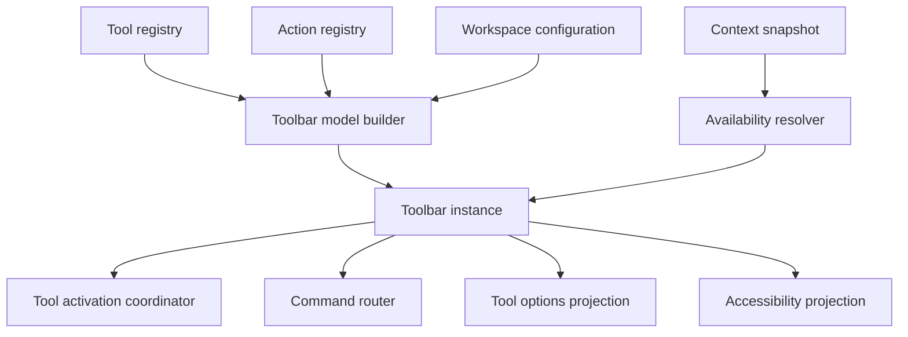
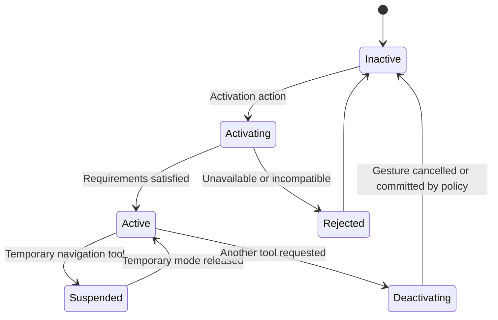
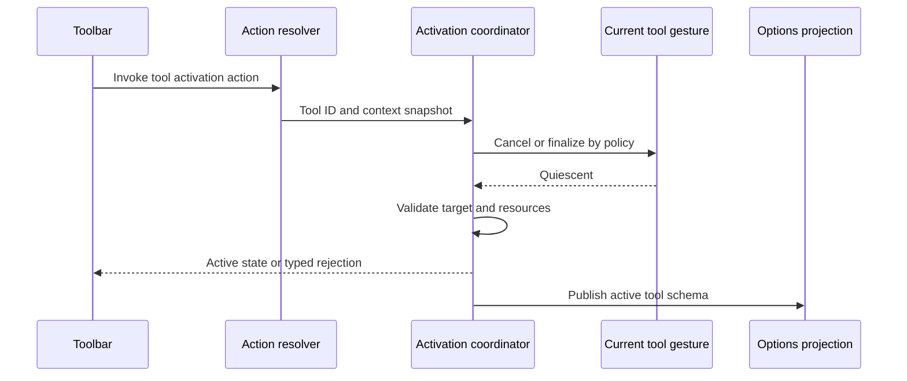
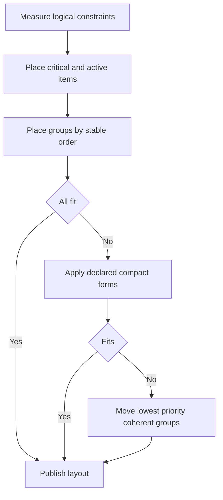
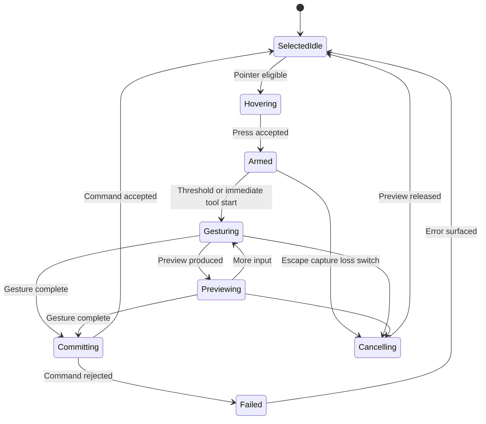
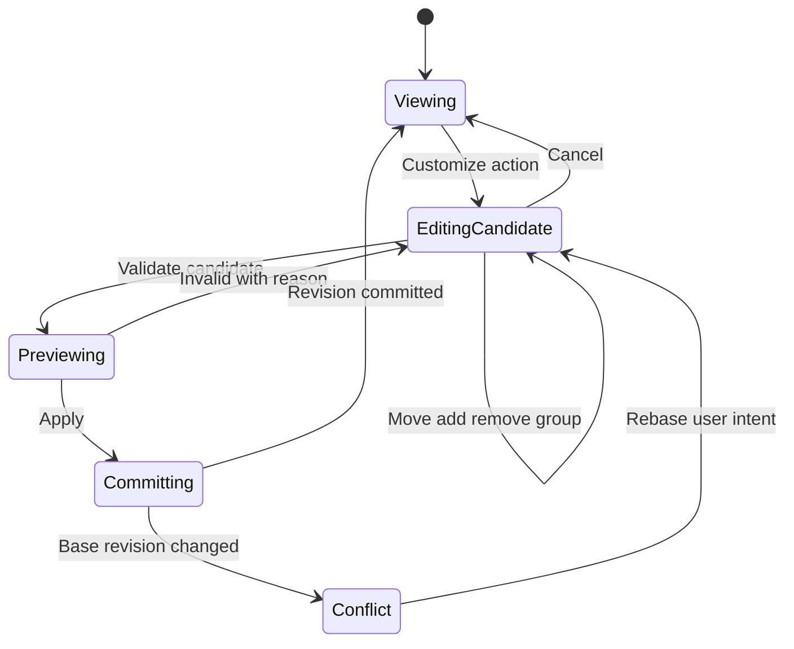
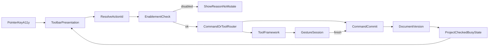
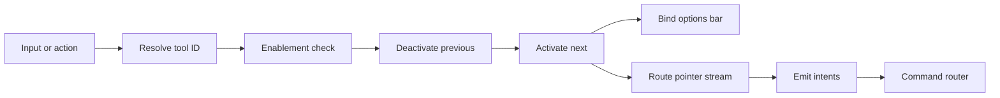

# 06 — Toolbar System

## Overview

Toolbars present frequent semantic actions, tools, groups, options, presets, and current activation state. They are workspace projections generated from registries; they do not define command behavior or own document state. “Tool” means an input state machine. “Action” means a named semantic operation. “Toolbar” means a configurable presentation of either.

## Responsibilities

The toolbar system **MUST** maintain stable tool/action IDs, explicit group ordering, active-tool visibility, complete keyboard and accessibility semantics, deterministic overflow, context-bound options, and equivalence with menu/search/shortcut invocation. It **MUST NOT** hide the sole route to a named action, mutate documents directly, or confuse active tool with active edit target. It **SHOULD** provide a tool shelf, operation toolbar, tool-options bar, group customization, reset, and compact layouts. It **MAY** remember last-used tool in a group as workspace state.

## Architecture

### Internal hierarchy

```text
Toolbar system
├── tool registry
├── tool groups and visibility policy
├── active tool state
├── tool options bar binding
├── input routing to active tool
└── preset and customization surfaces
```




```text
Toolbar subsystem
├── tool descriptors
├── toolbar descriptors
├── group and slot registry
├── instance/customization model
├── active-tool coordinator
├── options schema renderer
├── overflow solver
├── focus/navigation model
└── persistence adapter
```

## Data Contracts

```rust
struct ToolDescriptor {
    id: ToolId,
    name: TextKey,
    description: TextKey,
    group_hint: ToolGroupId,
    target_requirements: TargetPredicate,
    gesture_contract: GestureContractId,
    option_schema: OptionSchema,
    cursor_semantics: CursorDescriptor,
    activation_action: ActionId,
    accessibility: AccessibilityMetadata,
    provenance: ContributionProvenance,
}

struct ToolbarDescriptor {
    id: ToolbarTypeId,
    name: TextKey,
    slots: List<ToolbarSlot>,
    allowed_content: Set<ContentKind>,
    orientation: OrientationPolicy,
    overflow: OverflowPolicy,
    customization: CustomizationPolicy,
}

enum ToolbarSlot {
    Action(ActionId),
    Tool(ToolId),
    Group(GroupId),
    Separator(SeparatorId),
    FlexibleSpace,
    Contextual(ContextualSlotId),
}
```

Separators are meaningful only between nonempty groups and disappear during normalization when adjacent or terminal. Extension contributions target declared slots and carry deterministic ordering keys. Registry order is never hash-map iteration order.

## Default Presentations

```text
Operation toolbar
├── File: New Open Save
├── History: Undo Redo
├── Clipboard: Cut Copy Paste
├── View: Fit Actual Pixels Zoom
└── Search: Command Search

Tool shelf
├── Move and inspect
├── Selection
├── Crop and transform
├── Paint and erase
├── Fill and gradient
├── Retouch
├── Text and paths
└── Navigation and sampling

Tool options bar
├── Active tool identity
├── Active edit target
├── Preset/resource selector
├── Essential parameters
├── Advanced groups
└── Reset and help
```

Groups reduce density but **MUST** expose all members through keyboard navigation, press-and-hold or disclosure, command search, and customization. The current tool remains visible even if it is not the group’s default member.

## Tool Activation

Tool activation is a workspace/view semantic transition, not a document mutation. The coordinator validates descriptor availability, current gesture policy, target compatibility, and required resources.



Switching while a gesture is active invokes the tool’s explicit cancellation/commit policy. Default is cancellation. Silent partial commit is forbidden. Temporary tools activated by hold modifiers restore the previous tool on release, focus loss, or device removal. A tool may remain selected while unavailable for the current target, but UI **MUST** explain and block gesture start.



## Tool Activation Reach

Every tool on the shelf **MUST** be reachable by pointer, by keyboard, and from action search. Registering tools as actions is what makes the three equivalent; a tool that exists only as a shelf entry has no key, cannot be searched, and cannot be rebound.

Tool keys **SHOULD** follow the letter assignments the wider raster-editing world already uses, because that is the single largest source of transferable muscle memory. Alternates within one family **SHOULD** share a letter under a modifier rather than consuming a second one.

Tools **MUST NOT** occupy a menu-bar entry. They belong on the shelf and in action search; editors of this kind present no tool menu, and adding one is a visible deviation for no gain.

A host that validates tool ids against a list **MUST** keep that list complete, and a conformance test **MUST** compare it against the registered shelf. Rejecting an unknown id by falling back to a default tool is silent: the shelf highlights the tool the user clicked while a different one is active, which reads as the click having been missed.

## Tool Options

Options are generated from a semantic schema with type, unit, bounds, precision, default, grouping, validation, applicability, and persistence domain. Tool defaults usually belong to application preferences or local tool presets; gesture-specific preview values are ephemeral; any option that changes document content does so only through a command.

Options can have `OnChangePreview`, `OnCommit`, or `ImmediateViewState` policy. Live previews are cancelable and version-bound. Reset supports field, group, tool, and all tools. Hidden invalid values surface at their collapsed group.

```rust
struct ToolOptionField {
    id: OptionId,
    value_type: ValueType,
    unit: Option<Unit>,
    bounds: Option<Bounds>,
    default: Value,
    commit: CommitPolicy,
    persistence: OptionPersistence,
    availability: Predicate,
}
```

## Grouping, Customization, and Overflow

Customization is a workspace transaction over stable IDs. Users may reorder allowed items, show/hide optional slots, regroup tools, and reset. Core save/recovery/device-loss indicators are not toolbar customization targets. Removing an item from a toolbar never removes action availability elsewhere.

Overflow is based on priority and available logical size:

1. preserve active tool and active group;
2. preserve critical operation state;
3. collapse labels where icon semantics remain unambiguous;
4. move low-priority groups into accessible overflow;
5. switch orientation/layout if descriptor permits.

Uncommon and destructive controls retain text in overflow. Icons are never the only accessible name. Overflow order matches source order and remains keyboard navigable.

## Context, Enablement, and Focus

Toolbar instances receive immutable context snapshots. Action enablement includes boolean state, disabled reason, checked/pressed state, and optional dynamic label. Invocation captures a fresh target snapshot and command execution revalidates.

Toolbars use one tab stop per toolbar and arrow-key navigation internally. Home/End move first/last, arrow direction follows orientation, and group disclosure returns focus to invoking item. Disabled items may remain focusable when needed to expose reason, according to host accessibility behavior. Focus loss does not change active tool.

## Persistence and Versioning

Persisted state includes toolbar descriptor/version, ordered stable IDs, group membership, visibility, orientation preference, last-used group member, and bounded tool defaults. It excludes gesture state, current pointer capture, document snapshot, operation handles, and host widgets.

Missing contributions remain as bounded tombstones when retaining customization intent. Invalid or duplicate IDs are normalized. Schema migration is deterministic and component-scoped. Workspace presets may include group/layout configuration but not sensitive recent resources unless explicitly declared safe.

## Concurrency and Ownership

Registry and context projections are immutable generations. Toolbar instances are presentation-authority objects. Activation serializes per focused view. Tool-resource loading may be asynchronous; completion carries tool ID, activation generation, view ID, and cancellation. Stale loads cannot reactivate a replaced tool.

Toolbar rendering never waits for document execution or GPU work. Availability changes are coalesced. Registry removal first disables contributions, cancels activation/jobs, then reconstructs instances.

## State and Invariants

- One primary tool is active per focused tool context.
- Active tool ID always resolves to a registered, built-in fallback, or explicit unavailable placeholder.
- Active tool and active edit target are independent and visible.
- Tool activation never changes document version.
- Toolbar action and alternate presentation invoke same action ID and parameter schema.
- Every visible option belongs to current tool schema and context generation.
- A customization contains each singleton item at most once.
- Overflow never changes semantic order or availability.

## Failure Handling

Missing active tool falls back to a safe navigation/inspection tool and reports provenance. Failed resource load leaves tool inactive or limited; it never reuses stale resource silently. Invalid option state resets affected field and preserves source for diagnostics. Customization corruption resets toolbar only. Registry contribution failure removes its slots without collapsing unrelated groups.

## Design Rationale and Alternatives

Registry-generated toolbars prevent duplicate business logic and support accessibility. Hand-built callbacks are simpler but drift from menus and shortcuts. One active tool per context preserves predictable gestures; simultaneous primary tools would make input arbitration opaque. Semantic option schemas constrain bespoke UI but enable toolkit neutrality, persistence, validation, and extension isolation.

## Best Practices

- Keep group count and labels stable.
- Show active tool and target without hover.
- Test every toolbar action against registry identity.
- Test narrow-width overflow and 200% scale.
- Cancel activation loads on context switch.
- Keep destructive commands out of accidental adjacency.
- Preserve menu/search reachability after customization.

## Future Extensibility

Future local extensions may contribute tools, option fields, groups, and declared toolbar slots after capability and compatibility policy exists. Contributions **MUST** supply accessibility, cancellation, deterministic ordering, resource limits, and command mappings. No contribution receives global input interception or writable document access.

## Implementation Reference

### Registry construction

Registry construction has validation and publication phases. Validation checks namespace ownership, duplicate IDs, action/tool existence, group cycles, option-schema bounds, icon/resource references, ordering keys, accessibility labels, and contribution capability. Publication creates one immutable generation. Existing toolbar instances reconcile by stable IDs; they do not retain pointers into a previous generation.

```rust
struct ToolRegistryGeneration {
    generation: RegistryGeneration,
    tools: OrderedMap<ToolId, ToolDescriptor>,
    groups: OrderedMap<ToolGroupId, ToolGroupDescriptor>,
    fallback_tool: ToolId,
}

struct ToolGroupDescriptor {
    id: ToolGroupId,
    name: TextKey,
    members: NonEmptyList<ToolId>,
    default_member: ToolId,
    ordering: OrderingKey,
}
```

Groups cannot recursively contain themselves. A tool may appear in multiple discoverability groups only when one canonical activation identity remains and customization clearly represents aliases. By default each tool belongs to one shelf group.

### Availability dependencies

Descriptors declare enablement dependencies to avoid recomputing every control after every delta:

- application lifecycle and host capability;
- active workspace/view/document;
- active edit-target kind and lock state;
- selection kinds/count;
- tool/resource availability;
- operation busy state;
- extension capability and health.

The resolver receives dependency change keys and updates affected controls in a bounded batch. A toolbar may display an older enablement for one presentation frame, but invocation always resolves current action availability. Busy indicators are operation-scoped; unrelated controls remain usable.

### Option schema reference

Supported option kinds include boolean, bounded integer/real, enum, unit value, color, resource reference, action, disclosure group, and read-only status. Every editable field declares:

- canonical option ID and label;
- value type and serialization;
- minimum, maximum, step, and precision where numeric;
- unit family and conversion;
- default and reset source;
- validation and cross-field constraints;
- preview and commit boundary;
- persistence domain;
- accessibility value text;
- context applicability.

Cross-field validation returns errors attached to all responsible fields and enclosing group. An option hidden by applicability cannot remain an unexplained cause of invalid commit. Resource selectors show missing/unavailable resources without silently substituting one that changes output.

### Activation edge cases

If active target becomes incompatible during an idle tool, tool stays selected but enters blocked state with reason. If incompatibility appears during a gesture because another view commits a change, tool gesture uses command conflict policy: cancel, revalidate, or finish against original target only when safe. It cannot retarget automatically.

If the active tool contribution unloads, activation coordinator cancels gesture, releases capture, selects built-in fallback, retains bounded unavailable tool identity for workspace migration, and announces change. If fallback itself cannot activate due to renderer loss, a non-mutating inspection/navigation mode remains.

Temporary tool stack is bounded:

```rust
struct TemporaryToolFrame {
    tool: ToolId,
    trigger: TemporaryTrigger,
    prior_tool: ToolId,
    activation_generation: UInt64,
}
```

Nested temporary modes resolve last-in-first-out. Duplicate key release, focus loss, and device removal are idempotent. Workspace/tool switch clears frames before activating explicit selection.

### Toolbar layout algorithm

Each item declares minimum representation, preferred representation, collapse alternatives, priority, and group cohesion. Solver first measures critical fixed items and active tool, then preferred groups, then optional items. A group moves wholly into overflow unless descriptor permits split representation. Flexible spaces absorb remaining size after controls.



Orientation change recomputes arrow navigation and accessibility position. It never changes action IDs, group order, or active selection. Toolbar drag handles and docking controls are separate semantic targets from tool/action controls.

### Customization transaction

Customization UI works on a candidate model. Available items list names, descriptions, group, provenance, current placement, and conflicts. Drop validates descriptor policy and singleton rules. Apply normalizes separators/groups and commits one workspace revision. Cancel restores prior model. Reset may target item, toolbar, all toolbars, or selected preset.

Extension removal retains tombstones only for explicit user placements. Default-contributed items can return through descriptor defaults without tombstones. A tombstone includes ID, last group/index, descriptor provenance, and schema version, never executable or visual payload.

### Performance and diagnostics

Toolbar state updates should remain proportional to changed dependencies, not total document size. Icon rasterization, resource previews, and option thumbnails are cached as derived presentation resources with scale/theme in cache key. Their failure falls back to accessible text or generic semantic icon.

Diagnostics include registry generation, activation transitions, rejected target requirement, option validation, overflow decisions, stale resource completion, and customization migration. They exclude document names and option values that may contain private metadata unless explicit diagnostic export includes them.

### Verification

Tests cover every descriptor and action mapping, activation while idle/gesturing, temporary stack, target incompatibility, extension unload, option unit/range/cross-field validation, overflow at representative widths and scales, keyboard navigation in both orientations, screen-reader states, customization round trips, and alternate presentation equivalence.

## Toolbar Service Interfaces

```rust
interface ToolbarRegistry {
    register_toolbar(descriptor: ToolbarDescriptor) -> Result<RegistrationLease, RegistryError>;
    register_tool(descriptor: ToolDescriptor, factory: ToolFactoryRef) -> Result<RegistrationLease, RegistryError>;
    snapshot() -> ToolbarRegistrySnapshot;
}

interface ToolbarManager {
    create(request: ToolbarCreateRequest) -> Result<ToolbarInstanceId, ToolbarError>;
    snapshot(id: ToolbarInstanceId) -> Result<ToolbarSnapshot, ToolbarError>;
    customize(transaction: ToolbarCustomization) -> Result<ToolbarCommit, ToolbarError>;
    close(id: ToolbarInstanceId) -> Result<Void, ToolbarError>;
}

interface ToolActivationCoordinator {
    request(request: ToolActivationRequest) -> AsyncResult<ToolActivationResult, ToolError>;
    active(context: ToolContextId) -> ActiveToolSnapshot;
    push_temporary(request: TemporaryToolRequest) -> Result<TemporaryToolLease, ToolError>;
    pop_temporary(lease: TemporaryToolLease, reason: TemporaryReleaseReason) -> Result<Void, ToolError>;
    cancel_gesture(context: ToolContextId, reason: CancelReason) -> AsyncResult<Void, ToolError>;
}
```

`ToolFactoryRef` creates interaction state, not toolbar UI. The toolbar obtains semantic options from descriptor and activation state from coordinator. Tool implementations receive normalized gesture events, immutable context, preview services, command endpoint, and bounded resource capabilities. They cannot inspect toolbar widgets or mutate toolbar selection.

```rust
struct ToolbarSnapshot {
    instance: ToolbarInstanceId,
    revision: ToolbarRevision,
    descriptor_generation: RegistryGeneration,
    orientation: Orientation,
    items: List<ToolbarItemPresentation>,
    overflow: List<ToolbarItemPresentation>,
    focused_item: Optional<ToolbarItemId>,
    active_tool: Optional<ToolId>,
    context_generation: UInt64,
}
```

## Tool and Gesture Lifecycle

Toolbar activation ends when the tool is selected; actual gestures have their own lifecycle:



Toolbar controls reflect this state without owning it. During gesture, active-tool button remains pressed; options that cannot change safely become disabled with reason. Tool switching requests gesture cancellation and waits only through asynchronous coordinator, never synchronously on UI thread. A tool may declare immediate start for painting, while transform handles may require movement threshold.

Tool activation request contract:

```rust
struct ToolActivationRequest {
    tool: ToolId,
    context: ToolContextSnapshot,
    source: ActivationSource,
    expected_registry: RegistryGeneration,
    expected_active_generation: UInt64,
    switch_policy: GestureSwitchPolicy,
}

enum ToolActivationResult {
    Activated { active_generation: UInt64, options: OptionSnapshot },
    AlreadyActive { active_generation: UInt64 },
    Rejected { reason: ToolUnavailableReason },
    Cancelled { reason: CancelReason },
}
```

Activation is idempotent for same tool/context/generation. Re-selecting active tool may invoke a descriptor-declared reset/secondary action only through a separate discoverable action; it cannot have hidden behavior.

## Option State and Presets

```rust
struct ToolOptionState {
    tool: ToolId,
    schema_version: SchemaVersion,
    values: OrderedMap<OptionId, OptionValue>,
    source: OrderedMap<OptionId, OptionValueSource>,
    validation: OptionValidationState,
    generation: UInt64,
}

enum OptionValueSource {
    BuiltInDefault,
    ApplicationPreference,
    ToolPreset(PresetId),
    WorkspaceOverride,
    GestureTemporary,
}
```

Precedence is field-declared. A selected preset supplies only fields it owns; unrelated values remain from lower layers. Editing a preset-owned value creates a modified-preset state rather than silently rewriting the stored preset. Saving or replacing a preset is an explicit resource action. Missing preset resources leave values visible as unresolved and block only operations that require them.

Option changes fall into categories:

- presentation-only option changes toolbar state immediately;
- view-state option invokes a workspace/view command;
- tool-default option updates preference through command and affects future gestures;
- gesture-preview option updates isolated preview generation;
- document-semantic option invokes document command and may enter history.

One field cannot ambiguously span categories. Cross-field validator operates on one coherent option generation. Async validation, such as resource compatibility, returns tool/option/context generations and cannot clear newer errors.

## Group and Overflow Edge Behavior

Group disclosure state is ephemeral unless descriptor marks remembered last member. Opening a group does not activate its default. Pointer press-and-hold, disclosure button, keyboard Activate, and command search all resolve same member IDs.

If active tool moves to overflow because width changes, toolbar **MUST** keep an active-tool representative in primary area or make overflow control expose active tool name/state. It cannot leave only a generic chevron. If two instances present same action, checked/pressed and availability state remain synchronized through action registry.

Overflow solver edge cases:

- a group larger than available width moves as one group or uses descriptor compact grid;
- one critical item wider than window uses accessible clipped/ellipsized label plus full name, never disappears;
- localization expansion triggers re-solve without semantic reorder;
- 200% scale uses logical constraints and may choose text overflow earlier;
- vertical orientation maps Up/Down navigation and retains canonical group order;
- right-to-left presentation may mirror visual order only under host localization policy while semantic ordering and IDs remain deterministic;
- hidden custom item remains discoverable in customization and command search.

## Customization State Model



Rebase is limited to nonconflicting semantic edits. If user moved an item that an extension removed, customization reports unavailable item and lets user discard its tombstone. It never maps by label to a different action. Reset loads descriptor defaults for selected scope and preserves other toolbar instances.

Customization accessibility includes source and destination lists, current position, group, visibility, and keyboard Move Up/Down/Into/Out actions. Drag is optional. Preview announces changed count and invalid reason. Commit restores focus to moved item or nearest surviving item.

## Platform Adapter Boundary

The toolbar adapter maps semantic controls to native buttons, toggles, menus, ranges, fields, groups, focus, accessibility, theme, and scale. It reports available logical size and native control capabilities. It does not decide action availability, active tool, group composition, overflow priority, option persistence, or gesture policy.

Host conventions may place primary menu outside window or use native toolbar chrome. The semantic toolbar remains independently testable. If host cannot represent a compound option control accessibly, adapter uses standard labeled controls or delegates to a panel; it does not expose an inaccessible custom drawing.

Icon adapter receives semantic icon key, scale, theme/contrast, and state. Missing icon falls back to text. Extension-provided icon data is validated and resource-bounded. Cursor/icon failure never changes tool semantics.

## Error and Lifecycle Cases

Registry:

- duplicate tool/action/group ID rejects later contribution;
- group references missing member: omit invalid group contribution, retain valid tools discoverable elsewhere;
- fallback tool missing: registry publication fails and previous generation remains;
- extension unload during activation: cancel and choose core fallback.

Activation:

- target closes before activation completes: reject stale context;
- current gesture refuses unsafe commit: cancel switch and retain current tool with reason;
- required resource missing: select blocked tool only if descriptor permits, otherwise reject;
- device loss: cancel generation-bound previews and keep tool selected in unavailable state;
- focus moves to another view: per-view activation policy restores that view’s active tool.

Options:

- restored value outside new bounds: migrate with explicit clamp diagnostic or default according to field policy;
- unit definition changes: migrate through canonical semantic value, never reinterpret raw display number;
- hidden option invalid: surface error on group and block commit;
- async validator times out: keep prior valid generation and report unavailable validation;
- preset removed: retain resolved values only if semantics permit and mark source missing.

Layout/customization:

- no room for active tool and overflow: active tool gets primary representative; low-priority items remain in overflow;
- focused item moves to overflow: focus moves to corresponding overflow entry when open or overflow control otherwise;
- customization persistence fails: committed session state remains, warning identifies non-durable configuration;
- missing extension returns: tombstoned position restores only if no singleton/conflict violation.

## Observability and Testability

Trace events include registry publication, toolbar solve, item migration between primary/overflow, activation request/result, temporary stack push/pop, gesture switch, option source/validation transition, customization transaction, and adapter fallback. Values that may reveal document/resource data are omitted.

Metrics include activation latency, cancellation cause, stale load rejection, overflow frequency, option validation duration, gesture switch failures, toolbar reconstruction count, and extension descriptor rejection.

Test hooks:

- pure descriptor and option-schema validator;
- immutable registry generation builder;
- fake activation coordinator and gesture barrier;
- fake action availability source;
- deterministic layout measurer;
- semantic focus navigator;
- customization transaction/property tests;
- fake host adapter for scale/theme/contrast/orientation;
- accessibility event recorder.

### Deterministic acceptance scenarios

**Switch during stroke:** activate Paint, begin stroke preview, request Move tool, assert stroke cancellation releases preview before Move activates and no partial transaction exists.

**Temporary nesting:** hold navigation tool, then sampling tool, release in reverse and duplicate order, assert last-in-first-out restoration and idempotent releases.

**Narrow localization:** provide expanded labels and 200% scale, assert active tool visible, coherent groups overflow, order stable, and every item keyboard-reachable.

**Stale resource load:** activate tool A requiring resource, switch to B, complete A load, assert A does not reactivate and resource lease releases.

**Option migration:** restore old unit/range values, migrate schema, assert canonical value, explicit clamp/default policy, accessible value text, and no document command.

**Extension removal:** focus contributed tool and unload extension, assert gesture cancelled, fallback active, focus valid, tombstone retained, and core toolbar usable.

## Action-State Projection

Toolbar controls subscribe to action-state keys rather than command outcomes directly. One action-state projection can feed menu, toolbar, context menu, shortcut hint, and command search:

```rust
struct ActionStateProjection {
    action: ActionId,
    context_generation: UInt64,
    enabled: bool,
    disabled_reason: Optional<DisabledReason>,
    checked: Optional<bool>,
    pressed: Optional<bool>,
    busy: Optional<OperationId>,
    dynamic_label: Optional<Text>,
}
```

`checked` describes persistent semantic state such as overlay visibility. `pressed` describes mode/tool activation. `busy` describes an operation started by action. These are not interchangeable. A Save button can be busy while document remains modified by newer edits. A tool can be pressed while blocked for current target. Adapter renders each state distinctly and accessibility exposes standard state plus explanation.

Projection dependencies are declared by action registry. Toolbar manager coalesces updates by action/context generation and preserves latest. It never derives enabled state from icon appearance, panel visibility, or whether a callback exists.

## Tool Parameter Workflow Examples

**Brush size entry:** user focuses size field, types a unit-valid value, local validator checks range, commit updates tool preference through command, active stroke remains unaffected unless tool contract permits live preview. Invalid text remains draft with error; focus does not silently clamp.

**Transform mode change:** changing transform reference point during an isolated preview updates preview generation. Apply submits one document command containing final parameters and original target IDs. Cancel releases preview and restores option projection from tool defaults.

**Resource choice:** choosing a brush resource resolves stable resource ID and compatibility. Missing resource yields blocked tool state. A similarly named resource is never substituted. Selection updates tool preference, while actual painting still commits through stroke commands.

**View navigation control:** zoom selector invokes view-scoped command. It does not enter document history or mark document modified. Toolbar shows effective zoom from focused view and switches context when another view gains focus.

## Additional Rationale

**Dedicated options bar versus properties panel only.** Options bar keeps high-frequency tool parameters near active-tool identity and supports muscle memory. Properties panel better handles selected-object detail. Sharing semantic field schemas prevents divergent validation while allowing both placements.

**Remembering last group member versus fixed default.** Remembering reduces repeated selection for expert workflows but can hide which tool will activate. PhotoTux persists last member only as workspace preference and always shows active member on group representative.

**Compact icons versus labels.** Icons save space for familiar tools but cannot carry uncommon semantics alone. Descriptor supplies text regardless of chosen representation; overflow and accessibility always retain it.

## Additional Acceptance Scenarios

**Busy save with newer edit:** start Save from operation toolbar, edit document, complete old save, assert button busy clears but modified indicator remains because versions differ.

**Context switch:** show brush options in view A, focus text-editing view B, assert options projection changes generation, incompatible fields disappear, and late A validator result is discarded.

**Action synchronization:** toggle grid from toolbar, then from menu; assert both presentations reflect one checked action state and no duplicate business logic.

**Customization cancellation:** move three items and alter group in candidate, cancel, assert canonical serialized toolbar and semantic focus are unchanged.

## Extended Edge-Case Matrix

Toolbar edges for tools, options, overflow, customization, and sync:

- Activate tool B while gesture for tool A active: cancel gesture by policy; tool B becomes active in one revision; no document commit from cancel alone.
- Options schema for brush shown; switch to text tool: generation increments; incompatible fields removed before any validator returns; late brush validator dropped.
- Overflow menu open when width expands enough to reveal items: overflow closes or rebuilds; item IDs stable; focus returns to invoking control or item.
- Customization draft with three moves; workspace preset applies: customization draft discarded or conflicted per scope rules; document untouched.
- Extension tool missing after session restore: placeholder disabled with reason; neighboring tools keep order; no document mutation.
- Toggle grid from toolbar and shortcut simultaneously: one command wins; both presentations reflect single checked state after publish.
- Options numeric field commit with unit change mid-edit: validate against final unit; reject partial parse without applying.
- Compact mode icons only: accessible name still from descriptor text; tooltip/overflow show text.
- Tool grouping collapses active tool into submenu: active tool remains visible as representative or pinned slot per policy.
- Save busy on operation toolbar; newer edit occurs: busy clears on save completion; modified indicator remains if versions differ.
- Narrow window hides operation toolbar: actions remain in menu/search; status may show active tool name.
- Recorder focus in options text field: tool-letter shortcuts suppressed by text scope; Esc cancels field per widget policy without changing tool.
- Provider options preset applies incompatible values: validate all; apply none on failure; show typed errors per field.
- Rapid tool wheel / key repeat: coalesced activation; intermediate tools may skip if policy allows coalesce; final tool deterministic.
- Detach options bar to float denied: remain docked; reason available; tool still usable.
- Customization reset scope window vs global: only targeted scopes revert; other windows keep overrides when scoped.
- Checked action state from document (e.g., snap): toolbar projection updates on document version publish without local toggles.
- Drag-reorder customization to illegal group: reject drop; candidate unchanged.

## Host Adapter Toolbar Contract

Adapter responsibilities:

- render tool buttons, separators, overflow chevrons, and options editors from core descriptors;
- report width budget and scale for compaction decisions;
- expose a11y roles: toolbar, button, toggle button, radio (tool exclusivity), menu for overflow;
- forward activate/press/release without interpreting tool engines;
- provide text field IME boundaries so shortcut system can suppress tools;
- optional native customization drag visuals; core owns candidate model.

Core owns:

- which tool is active, option schema values (projection), enablement, overflow membership, customization candidates, and command mapping.

Denied floating options strip must not disable option editing; in-place or dialog fallback required.



## Versioning and Migration Notes

Toolbar layout records store `toolbar_id`, `schema_version`, ordered item refs, group membership, and overflow preferences. Option presets store schema versioned values keyed by tool ID.

Migration:

- Unknown item refs become unresolved placeholders, not deletions of known neighbors when order can be preserved.
- Renamed tool IDs use registry alias tables; labels never alias.
- Option keys removed in schema N drop silently from presets; added keys take defaults on next activation.
- Customization scopes migrate window-local vs global flags; invalid scopes reset that scope only.
- Compact/icon mode preference migrates; if icons missing, force text mode.
- Extension item refs unload to unresolved; reappear if ID returns without reshuffling core items.

Writers canonicalize order by stable item ID within groups after user order for diff stability when regenerating defaults. User order always wins for customized scopes.

## Extended Observability Hooks

- `toolbar.activate_tool{id,prev,rev}`
- `toolbar.overflow_rebuild{count,width}`
- `toolbar.option_commit{tool,keys,result}`
- `toolbar.option_stale{tool,gen}`
- `toolbar.customization{op,scope,result}`
- `toolbar.action_proj{action,checked,busy,enabled}`
- `toolbar.missing_item{id}`
- `toolbar.gesture_cancel{tool,reason}`

Correlate with command operation IDs and tool gesture IDs. Avoid logging option values that may contain path-like strings without redaction. Tests assert presentation equivalence across toolbar/menu/shortcut for a fixed action set.

## Security and Trust Notes

- Customization files are untrusted layouts; bound item counts and reject unknown executable payloads (none should exist—only IDs).
- Toolbar cannot embed scripts; item activation only resolves registered actions/tools.
- Extension tools require capability tokens already granted at registration; placement in toolbar grants no extra authority.
- Options validators run in core; extension validators are sandboxed and timed; timeout disables field apply.
- Busy/checked projections are not trust signals for document integrity; only command outcomes are.
- Overflow menus freeze enablement snapshots similarly to context menus when open, preventing mid-open baiting of destructive actions.

## Deterministic Acceptance Scenarios

**Scenario T1 — Gesture cancel on tool switch:** start stroke tool A; switch to B; assert gesture cancelled, no partial stroke commit, B active.

**Scenario T2 — Stale options:** brush options validating; switch to eraser; late brush result arrives; assert discarded; eraser schema shown.

**Scenario T3 — Busy vs modified:** Save busy; edit → ver+1; save of old ver completes; busy clear; modified true.

**Scenario T4 — Sync presentations:** toggle grid toolbar then menu; one checked state everywhere; one logical toggle outcome.

**Scenario T5 — Customization cancel:** move items; cancel; serialized toolbar and focus unchanged.

**Scenario T6 — Missing extension tool:** restore session; placeholder disabled; core tools activate; document version static during restore.

**Scenario T7 — Overflow a11y:** keyboard to overflow; activate action; assert same command as primary slot would.

**Scenario T8 — Narrow access:** collapse shelf; assert active tool still visible or named in status; all actions via search.

## Neighboring Subsystem Interactions

- **Tools/gestures:** toolbar activation selects tool; gestures produce commands on finish; toolbar does not write pixels.
- **Commands:** operation buttons submit commands; enablement mirrors action model.
- **Shortcuts:** tool keys and button presses share action IDs; text scope suppresses letters.
- **Panels:** properties vs options bar may edit same parameters; both commit via commands with identical schemas when overlapping.
- **Workspace/docking:** placement/compaction only; cannot change active tool implicitly except documented responsive policies that preserve active tool visibility.
- **Context menus:** may include tool actions; equivalence tests bind all three surfaces.
- **Lifecycle:** session restores toolbar customization after registries load; missing extensions unresolved.
- **Accessibility:** toolbar order follows descriptor order, not visual overflow quirks.

Invariant: presentations project state; commands mutate documents; snapshots feed options display.

## Extended Toolbar and Tool Options Contracts

The toolbar system manages tool identity, grouping, activation, and the tool options bar. Tools produce intents that become commands; they are not free writers of document state. This section covers activation races, options persistence, customization safety, and neighbor interactions.

### Activation Pipeline

1. Resolve tool ID from click, shortcut, stylus barrel button, or command search.
2. Validate enablement against document presence, selection requirements, and locks.
3. Deactivate previous tool with deterministic teardown (clear transient overlays, cancel preview jobs).
4. Activate new tool, load options snapshot, publish context for options bar and status bar.
5. Route subsequent pointer/pen events to the active tool until deactivated.

If activation fails after deactivation begins, the system **MUST** enter a safe fallback tool (typically a navigation or selection tool) rather than leaving a null active tool.



### Options State Layers

Tool options exist in layers with clear precedence:

- factory defaults;
- user tool presets;
- document-sticky options when explicitly declared (rare);
- session overrides;
- transient gesture modifiers (shift constrain, alt clone source, etc.).

Transient modifiers **MUST NOT** be written into presets unless the user saves a preset. Options that affect destructive pixel scope **MUST** be mirrored in command payloads for history fidelity.

### Customization Safety

Users may regroup tools, hide rarely used tools, and reshape the toolbar. Customization **MUST** keep essential tools reachable via command search and shortcuts even if hidden visually. Profiles bound nesting and icon counts. Invalid customized IDs are dropped with diagnostics, not fatal errors.

### Neighbor Interactions

- **Commands:** every tool commit path ends in commands; previews use ephemeral overlays or preview buffers outside history until commit.
- **Brush engine:** brush tool options map to brush runtime parameters; stroke end commits a transaction.
- **Shortcuts:** tool switching and options nudges share conflict resolution with the shortcut system.
- **Context menus:** canvas context menus include tool-specific actions from the active tool's contribution set.
- **Accessibility:** options bar controls expose names, values, and increments; tool changes announce tool name.

### Edge Cases

- Activate eraser while no raster target editable: reject or auto-target per policy with explicit user feedback.
- Switch tools mid-stroke: either finish stroke commit/cancel according to tool policy before switch, never bifurcate one stroke across tools.
- Tablet button mapped to temporary tool: on release, restore previous tool and options unless sticky mode enabled.
- Options bar overflow on narrow windows: progressive collapse with searchable overflow, not silent loss of parameters.

### Deterministic Acceptance Scenarios

1. Assign shortcut to Clone tool, press it with locked target layer: activation fails gracefully; current tool remains; reason announced.
2. Start brush stroke, press tool shortcut mid-stroke with cancel-on-switch policy: stroke cancelled, no partial history entry, new tool active.
3. Save preset, tweak options, reset tool: factory or preset restoration matches schema; document not dirtied by options-only reset.
4. Hide Move tool in customization, use command search "Move": tool activates; visible toolbar may show temporary overflow indicator.
5. Keyboard-only adjustment of brush size in options bar: value changes, preview updates, committing stroke records size in command payload.

### Observability

Trace tool activation failures, stroke commit latencies, and options schema migrations. Keep gesture coordinate streams out of default logs.

## Acceptance Criteria

- Default operation toolbar, tool shelf, and options bar expose required content.
- Every tool is discoverable outside grouped pointer interaction.
- Active tool remains visible through grouping and overflow.
- Tool switch cancels active gesture by explicit policy.
- Toolbar/menu/shortcut/search invocation resolves identical action semantics.
- Option schemas validate units, bounds, mixed applicability, and persistence.
- Keyboard and accessibility APIs expose all items and states.
- Missing extension tool falls back without document mutation.
- Customization round-trips and resets by scope.
- Narrow layouts preserve active tool and complete action access.

## Cross References

- [01 — Information Architecture](01-Information-Architecture.md)
- [03 — Workspace System](03-Workspace-System.md)
- [04 — Docking System](04-Docking-System.md)
- [05 — Panel System](05-Panel-System.md)
- [07 — Context Menus](07-Context-Menus.md)
- [08 — Command System](08-Command-System.md)
- [09 — Shortcut System](09-Shortcut-System.md)
- [Glossary](Appendix/Glossary.md)
- [Requirement Keywords](Appendix/Requirement-Keywords.md)
- Downstream: `18-Input-and-Gesture-Model.md`
- Downstream: `19-Tool-Framework.md`
- Downstream: `22-Accessibility.md`
- Downstream: `28-Extension-Architecture.md`
