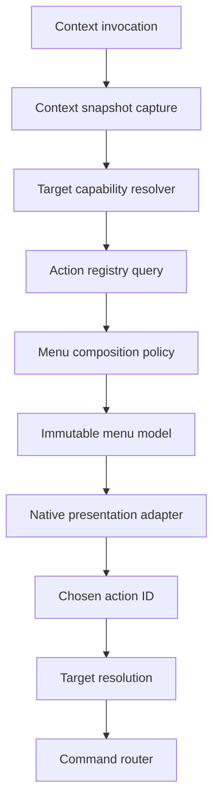
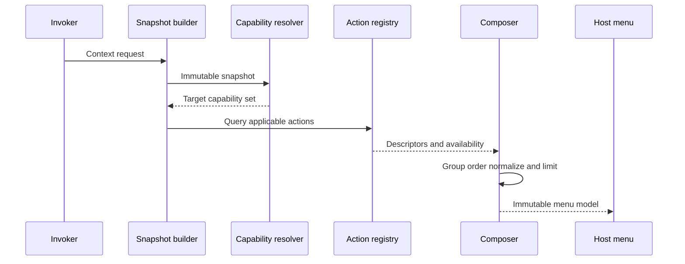
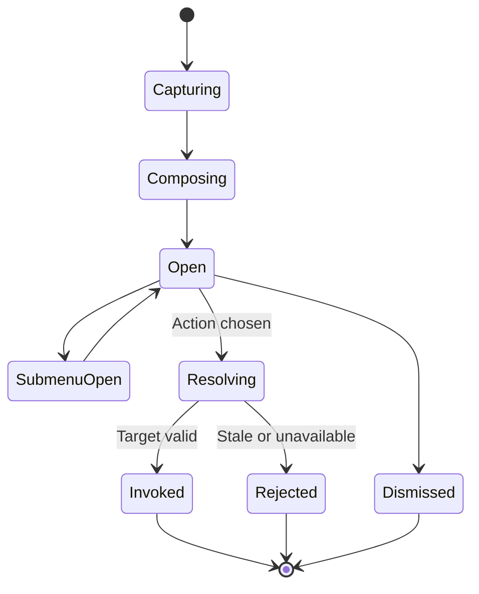
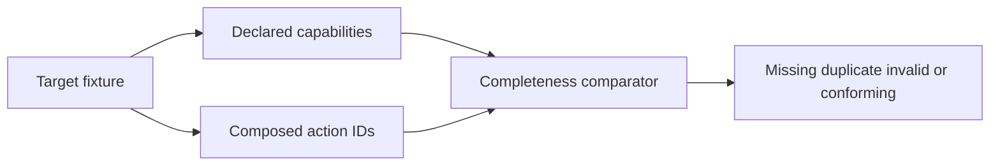
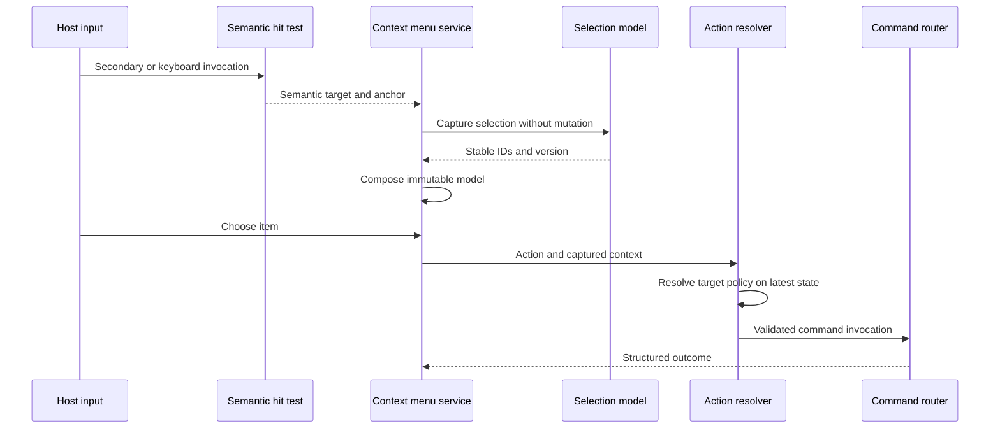
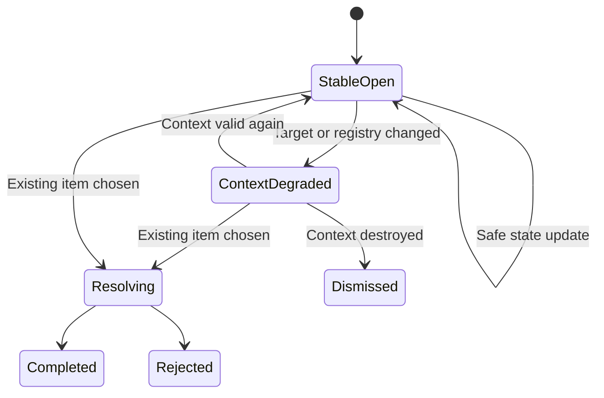
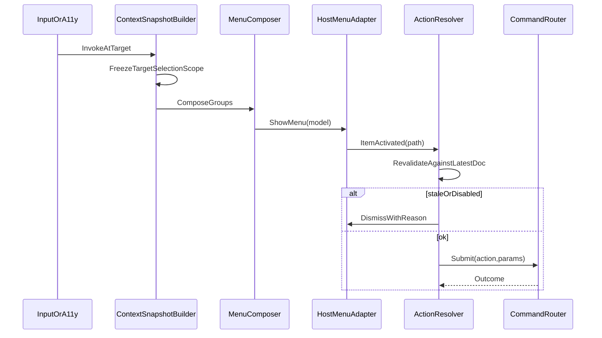
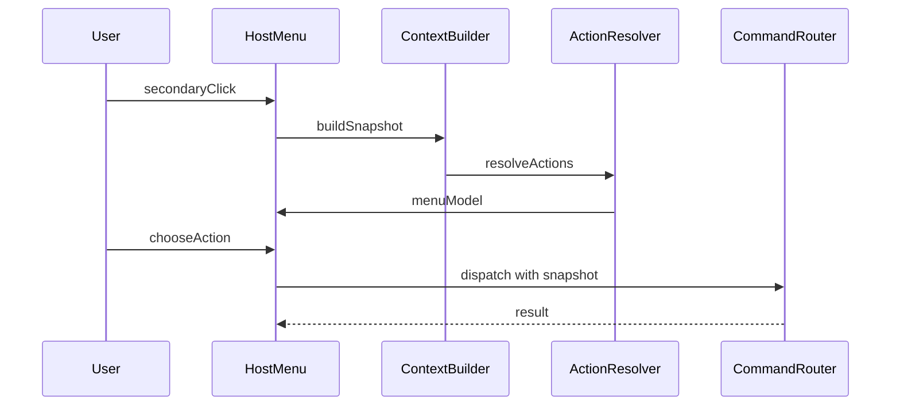

# 07 — Context Menus

## Overview

Context menus present the full set of locally applicable action families for a captured semantic context. They are accelerators, never the sole discovery path and never a separate mutation implementation. Opening a menu captures a context snapshot; choosing an item resolves the intended target and invokes the same action and [command](08-Command-System.md) used by menus, toolbars, shortcuts, panels, and command search.

“Full available actions” means every action declared applicable by the target capability model is represented directly or in a coherent submenu, subject only to explicit product configuration, security policy, and size/complexity rules. It does not mean every global command appears everywhere.

## Responsibilities

Context-menu architecture **MUST**:

- capture invocation source, point, focused object, context target, selection, active edit target, document/view versions, and capabilities;
- preserve selection until an invoked action’s target-resolution policy commits;
- cover all applicable capability groups;
- use stable action IDs and current registry metadata;
- show unavailable educational actions with disabled reasons where policy requires;
- revalidate action scope, target existence, authority, and invariants at invocation;
- provide keyboard, pen, pointer, and accessibility-equivalent invocation;
- separate destructive actions and name exact consequence;
- prevent menu construction or extension providers from blocking the UI thread.

It **SHOULD** keep primary action first, group ordering stable, labels concise, and submenus semantically coherent. It **MAY** support a searchable overflow for very large extension-safe sets, provided full keyboard access remains.

## Architecture

### Internal hierarchy

```text
Context menu system
├── context snapshot builder
├── action resolver
├── menu model assembler
├── host presentation adapter
└── invocation telemetry hooks (local)
```




```text
Context menu subsystem
├── invocation normalizer
├── semantic hit target
├── context snapshot builder
├── capability/action query
├── composition and ordering policy
├── immutable menu model
├── host presenter
├── target resolver
└── diagnostics/conformance tests
```

## Context Snapshot

```rust
struct ContextSnapshot {
    id: ContextSnapshotId,
    created_at: MonotonicTime,
    invocation: InvocationKind,
    window: WindowId,
    workspace: WorkspaceId,
    view: Option<ViewId>,
    document: Option<DocumentId>,
    document_version: Option<DocumentVersion>,
    focused_semantic_path: SemanticFocusPath,
    context_target: Option<TargetRef>,
    selected_targets: List<TargetRef>,
    active_edit_target: Option<TargetRef>,
    canvas_point: Option<DocumentPoint>,
    screen_anchor: LogicalPoint,
    capabilities: CapabilitySet,
    registry_generation: RegistryGeneration,
}
```

Snapshots contain IDs and immutable values, never writable references or toolkit objects. `canvas_point` is included only when invocation has meaningful document coordinates. Keyboard invocation anchors to focused element. Accessibility invocation uses same semantic focused target. Pen barrel and secondary pointer button normalize to `SecondaryPointer`.

## Target Resolution

Opening a menu does not mutate selection. Action descriptors declare one of:

```rust
enum ContextTargetPolicy {
    CurrentSelectionWhenTargetIncluded,
    ContextTargetOnly,
    ReplaceSelectionOnInvoke,
    ActiveEditTarget,
    FocusedView,
    ApplicationScope,
    CustomDeclaredResolver(ResolverId),
}
```

Default object policy:

- context target inside selected set: selection-scoped actions use full selection;
- target outside selection: inspection can target clicked object without selection change;
- target outside selection: mutation uses target-only or explicit selection replacement as declared;
- keyboard invocation: focused object is context target;
- blank canvas: target is view/canvas context, not guessed nearest object;
- attached mask thumbnail and layer body are distinct targets.

Target resolution occurs twice: once to compose and once immediately before execution. If state changed, invocation either resolves safely under descriptor conflict policy or fails with “target changed” while preserving current state.

## Complete Capability Groups

Every target type declares applicable groups:

1. **Primary:** open, activate, edit, inspect, or focus.
2. **Create/insert:** new peer, child, attachment, mask, effect, group.
3. **Select/navigate:** select related, reveal, focus, expand/collapse.
4. **Properties/rename:** inspect properties, rename, metadata where applicable.
5. **Duplicate/clipboard:** duplicate, cut, copy, paste, paste special.
6. **Structure/order:** move, group, ungroup, raise/lower, attach/detach.
7. **State:** enable/disable, show/hide, lock/unlock, pin/unpin.
8. **Convert:** rasterize, apply, merge, flatten, convert representation.
9. **Delete/remove:** exact target and attachment semantics.
10. **Inspect/diagnostics:** reveal resource, operation details, local diagnostics.

```text
Layer context menu
├── Edit Layer Properties
├── Rename Layer
├── Select Related
├── Create
│   ├── New Layer Above
│   ├── New Group from Selection
│   └── Add Mask
├── Clipboard
│   ├── Cut
│   ├── Copy
│   └── Paste Above
├── Duplicate
├── Arrange
│   ├── Raise / Lower
│   ├── Move to Top / Bottom
│   └── Move into Group
├── Visibility and Locking
├── Convert
│   ├── Rasterize Result
│   ├── Merge Selected Layers
│   └── Flatten Document
├── Delete Layer
└── Inspect
```

“Remove Mask,” “Apply Mask then Remove,” and “Disable Mask” are separate. “Assign Color Profile” and “Convert Pixel Values” are separate. “Close View” and “Close Document” are separate. Conversion actions describe lost editability before invocation or confirmation.

## Composition

Composition is registry-driven:



Ordering is primary, create, edit, clipboard, structure, state, convert, delete, inspect, with separators between nonempty groups. Target-specific specifications may refine ordering. Extension actions enter declared slots and show provenance when trust matters. Duplicate action IDs collapse to one item.

Providers may compute lightweight availability synchronously from snapshots. Expensive provider discovery runs before invocation through cached registry contributions. Opening a menu **MUST NOT** call arbitrary extension code, decode resources, wait for GPU work, or acquire document mutation locks.

## Menu Data Model

```rust
enum MenuNode {
    Action {
        action_id: ActionId,
        label: Text,
        description: Option<Text>,
        state: ActionPresentationState,
        shortcut_hint: Option<ShortcutDisplay>,
        target_summary: TargetSummary,
    },
    Submenu { id: MenuGroupId, label: Text, children: List<MenuNode> },
    Separator,
}

struct ActionPresentationState {
    enabled: bool,
    disabled_reason: Option<Text>,
    checked: Option<bool>,
    destructive: DestructiveClass,
    busy: Option<OperationId>,
}
```

Dynamic labels may include bounded target counts, such as “Delete 3 Layers,” but never sensitive names in accessibility announcements unless needed. Shortcut hints come from current effective bindings, not descriptor defaults.

## Lifecycle and State



Only one context-menu stack is active per window. Escape closes one submenu layer, then root, and restores invoking focus. Focus loss behavior follows host convention but cannot invoke an item. Menu dismissal discards snapshot. Menu state is never persisted.

## Accessibility and Input

All items expose menu role, name, checked state, availability, shortcut, submenu relation, destructive description, and disabled reason. Keyboard opens the menu for focused semantic object. Arrow keys navigate, Enter/Space invokes according to host convention, Escape unwinds, and type-ahead locates labels.

Menus **MUST** remain operable at 200% scale and with reduced motion/high contrast. Pointer hover is not required for submenu access. Very long menus use coherent submenus or scroll with visible keyboard focus; they never clip unreachable actions.

## Concurrency and Ownership

The menu model is immutable after presentation. Registry, document, selection, and focus may change while open; invocation revalidates. A command started from a menu owns its own operation and cancellation lifecycle after menu closes. Snapshot lifetime is bounded to menu lifetime and does not retain entire document snapshots.

If registry generation changes, existing menu can remain visible as historical presentation, but selection resolves action against current registry. Removed action fails safely. Availability shown is advisory, never authorization.

## Failure Handling

- Missing target yields a typed stale-context rejection.
- Failed composition falls back to minimal primary/inspect actions only when completeness can be proven for that target; otherwise it reports unavailable context menu and preserves state.
- Provider failure quarantines only its contribution and records provenance.
- Oversized contribution is truncated at provider boundary with explicit “contribution unavailable,” never silent omission of core actions.
- Host presentation failure leaves keyboard/menu-search alternatives available.
- Command rejection retains actionable reason and does not mutate selection speculatively.

## Conformance Testing

Automated tests compare each target capability declaration against composed menu action families. Fixtures cover layer, group, mask, selection, resource, document tab, canvas, panel, toolbar, task, and empty-space contexts. Tests verify no context-only mutation, stable ordering, exact destructive labels, target policies, keyboard invocation, disabled reasons, and extension isolation.



## Design Rationale and Alternatives

Registry composition prevents menu drift but requires disciplined action metadata. Hand-authored menus offer local control but routinely omit rename, duplicate, delete, keyboard, or extension actions.

Snapshot context avoids target changes caused by hover or focus movement. Live mutable context makes menu labels and execution disagree. Revalidation still handles genuine concurrent change.

Showing unavailable educational actions improves discoverability but can create clutter. Policy keeps stable core actions visible when absence teaches a requirement; irrelevant product capabilities are omitted.

## Best Practices

- Keep labels outcome-oriented and target-specific.
- Preserve selection on menu open.
- Put destructive actions last and separated.
- Avoid deep submenus; use at most coherent semantic families.
- Display current effective shortcut.
- Keep provider work bounded and precomputed.
- Test menu action IDs rather than rendered text only.
- Redact paths and metadata in diagnostics.

## Future Extensibility

Future local extensions may contribute actions to declared target capability slots. They **MUST** provide stable IDs, target schema, availability, provenance, accessibility metadata, cancellation, and command mapping. They cannot reorder core destructive boundaries, inspect arbitrary context, or receive ambient document authority.

## Implementation Reference

### Capability declarations

Target capability descriptors are composable but finite:

```rust
struct ContextCapabilityDescriptor {
    target_kind: TargetKind,
    groups: OrderedMap<CapabilityGroup, List<ActionSlot>>,
    primary_action: Option<ActionId>,
    selection_policy: SelectionContextPolicy,
    dynamic_provider: Option<BoundedProviderId>,
    schema_version: SchemaVersion,
}

struct ActionSlot {
    action_id: ActionId,
    target_policy: ContextTargetPolicy,
    ordering: OrderingKey,
    visibility: VisibilityPolicy,
    presentation_override: Option<ContextPresentationMetadata>,
}
```

Capabilities inherit only through explicit target-kind relations. A layer-mask target can reuse generic object rename/inspect capability but must override removal/conversion actions. Implicit inheritance from implementation class is forbidden because it can expose semantically invalid commands.

`VisibilityPolicy` is one of `ShowWhenApplicable`, `ShowDisabledWhenUnavailable`, or `OmitWhenIrrelevant`. Core lifecycle and educational actions generally use disabled visibility. Product-absent capabilities and extension actions whose contribution is disabled are omitted or represented by one provenance-specific unavailable group, according to policy.

### Context-specific references

**Document tab:** activate view, create another view, reveal all views, save, save as, export, close view, close document, move view to group/window, inspect file/recovery state. Save and export remain distinct.

**Canvas:** tool primary action if non-destructive, paste, select, transform selection, view controls, guides/grid, proofing/overlays, create view, document properties, inspect sampled position. Blank-canvas invocation does not fabricate an object target.

**Layer/group:** edit properties, rename, select related, create, duplicate, clipboard, reorder/group, visibility/lock, mask/effect attachment, conversion, exact deletion, inspect. Multi-selection actions show applicability and count.

**Mask:** activate edit surface, enable/disable, invert, properties, duplicate, apply-and-remove, remove-without-apply, reveal owner, inspect. Mask removal terms never collapse.

**Resource:** choose for active tool, inspect/edit metadata, duplicate, tag/organize, reveal local source when authority allows, embed/reference commands where meaningful, remove from catalog. Removing catalog entry is distinct from deleting source file.

**Task/progress:** show details, pause if supported, cancel if supported, retry safe failure, reveal output, dismiss completed record, copy sanitized diagnostics.

**Panel/tab/toolbar chrome:** focus, pin, unpin, float, dock, collapse, hide, close instance, reset placement, inspect contribution. These are workspace actions, not document commands.

### Dynamic labels and confirmations

Dynamic labels derive from the captured target summary and bounded current action metadata. They cannot require document traversal while opening. Target counts are capped for display, while full target set remains in invocation. Labels use exact nouns and verbs: “Delete 3 Layers,” “Close View,” “Apply Mask then Remove.”

The context menu itself does not own confirmation logic. Action/command descriptors declare confirmation class, consequences, and affected scope. Confirmation resolves latest targets and displays any change since menu capture. A stale destructive action never proceeds using only old label.

### Extension contribution limits

Extension menu metadata is validated at registration, not menu opening. Limits cover actions per target kind, nesting depth, label length, ordering slots, dynamic state dependencies, and provider execution. Extensions cannot:

- create arbitrary root groups;
- insert between a destructive separator and core destructive action;
- override core labels or shortcuts;
- hide or replace core actions;
- receive full selection data when target capability grant is narrower;
- execute code during accessibility traversal;
- claim built-in provenance.

If many extensions contribute to one slot, composer groups by semantic category before provenance. An “Extensions” submenu **MAY** be used for low-frequency extension-only operations, but primary extension capability can appear in normal semantic group when policy approves it.

### Snapshot privacy and lifetime

Context snapshots are process-local, short-lived, and non-serializable. They retain target IDs and summaries only. Pixel values, layer content, paths, metadata strings, and clipboard payloads are included only when required by a declared action and are normally resolved after invocation under capability checks.

Diagnostic records store target kind/count, action IDs, registry generation, stale reason, provider identity, and timing. They omit user object names and coordinates unless user explicitly exports detailed diagnostics.

### Performance budgets

Menu composition should be bounded by number of applicable registered actions, not document size. Capability lookup uses target kind and precomputed registry indices. Enablement queries read lightweight immutable projections. If a disabled reason depends on expensive analysis, action remains visible with “Requires evaluation” and invocation starts bounded validation; the menu never blocks awaiting analysis.

Native presenter receives a complete immutable model in one operation where host permits. Lazy submenus may delay formatting, not semantic discovery: their action set is determined at root composition. This prevents an extension or disappearing target from changing submenu completeness after the user starts navigation.

### Verification fixtures

For each target fixture, conformance data declares expected required, optional, forbidden, and destructive action IDs. Tests run single target, selected target, target-inside-selection, target-outside-selection, deleted-after-open, locked/read-only, missing capability, extension enabled/disabled, and keyboard invocation. Accessibility tests compare visible and semantic menu trees and verify disabled reasons and shortcut displays.

## Context Menu Service Interfaces

```rust
interface ContextMenuService {
    request(request: ContextMenuRequest) -> AsyncResult<ContextMenuSessionId, ContextMenuError>;
    choose(session: ContextMenuSessionId, item: MenuItemId) -> AsyncResult<ActionOutcome, ContextMenuError>;
    dismiss(session: ContextMenuSessionId, reason: DismissReason) -> Result<Void, ContextMenuError>;
    snapshot(session: ContextMenuSessionId) -> Result<ContextMenuSessionSnapshot, ContextMenuError>;
}

interface ContextTargetResolver {
    capture(request: TargetCaptureRequest) -> Result<ContextSnapshot, TargetError>;
    resolve_for_action(snapshot: ContextSnapshotId, action: ActionId) -> Result<ResolvedActionTarget, TargetError>;
}

interface ContextCapabilityRegistry {
    capabilities(target: TargetKind, generation: RegistryGeneration) -> Result<ContextCapabilityDescriptor, CapabilityError>;
    actions(capabilities: CapabilitySet) -> OrderedList<ActionSlot>;
}

interface ContextMenuHostAdapter {
    present(model: MenuModel, anchor: MenuAnchor) -> Result<HostMenuHandle, HostMenuError>;
    update_state(handle: HostMenuHandle, updates: List<MenuStateUpdate>) -> Result<Void, HostMenuError>;
    close(handle: HostMenuHandle) -> Result<Void, HostMenuError>;
}
```

The host adapter reports chosen item IDs and dismissal reason. It never receives command handlers, mutable target references, or authority to reinterpret IDs. If native menus cannot display disabled reasons directly, adapter exposes them through accessible description, status help, or an inspectable alternate menu presentation.

```rust
struct ContextMenuSessionSnapshot {
    id: ContextMenuSessionId,
    phase: MenuPhase,
    context: ContextSnapshot,
    model: MenuModel,
    focused_item: Optional<MenuItemId>,
    host_generation: Generation,
    created_registry_generation: RegistryGeneration,
}
```

## Invocation and Selection State Model



Selection replacement, when required, belongs to action resolution/command grouping. For an action declaring `ReplaceSelectionOnInvoke`, resolver builds an explicit selection command followed by target command under declared atomic/history policy. If second command cannot validate, default is no selection replacement. Context menu service itself never changes selection merely to make target convenient.

Snapshot target cases:

- selected object and context target match: selection-scoped action receives current captured set, then validates surviving members;
- context target outside selection: target-only action leaves selection unchanged;
- outside target with replacement policy: explicit replacement occurs at command boundary;
- target disappears while menu open: action rejects stale target; positional successor is not substituted;
- selection changes while menu open: descriptor conflict policy chooses captured set, latest set, or rejection; default mutation uses captured identities with current existence validation;
- active edit target changes: only actions declaring active-target policy follow latest active target.

## Menu Model Validation

Before presentation, validator enforces:

- unique menu item IDs and stable action IDs;
- maximum depth, total nodes, label length, and provider contribution count;
- no empty submenus or adjacent/terminal separators after normalization;
- one primary action at most;
- destructive group placement after ordinary conversion/state groups;
- no action in a target-forbidden capability group;
- every actionable node has accessible name and current enablement;
- current effective shortcut display does not alter binding behavior;
- submenu cycles are impossible;
- extension provenance and declared ordering slot are valid.

Completeness validator compares declared capability/action set to normalized model. It permits omission only when visibility policy evaluates irrelevant under captured context. “Unavailable” and “irrelevant” are distinct. An action omitted because provider failed is a conformance error unless explicit unavailable contribution node communicates the failure.

## Live State While Open

Menu structure is immutable, but a narrow set of presentation state may update: enabled, checked, busy, label count, and shortcut hint. Updates carry menu session, action ID, context generation, and registry generation. They cannot insert/remove/reorder nodes after opening because that destabilizes keyboard and assistive navigation.

When target mutation changes checked state, service may update it if target identity remains same. When target becomes invalid, item disables with “Target no longer exists.” If entire context disappears, menu may close and return focus. Registry generation change disables removed actions; newly added actions appear next invocation.



## Detailed Input and Accessibility Behavior

Pointer:

- menu opens at release or host-conventional trigger without prior mutation;
- invocation anchor is clamped to visible work area by host;
- pointer movement highlights but does not focus underlying canvas/panel;
- submenu opening delay is bounded and disabled for keyboard direct navigation;
- accidental drag after secondary press does not execute item.

Keyboard:

- Context Menu key or equivalent invokes focused semantic object;
- Shift-modified host convention may be supported through normalized action;
- Up/Down traverse actionable and optionally disabled educational items according to host convention;
- Left closes submenu, Right opens, Home/End move bounds, type-ahead cycles matches;
- Escape closes one level then root and restores exact invoking semantic path;
- shortcut keystrokes are not generally active inside menu unless native convention permits an unambiguous mnemonic.

Assistive technology:

- root announces target summary and item count;
- item exposes role, name, state, shortcut, submenu, destructive description, and provider when relevant;
- disabled reason is available without invocation;
- separator is structural, not focus target;
- dynamic state changes are announced only when focused or critical;
- closing restores focus, even when invoking row is virtualized, through semantic focus resolver;
- menu at 200% scale remains reachable without horizontal clipping.

Touch or pen may use long-press/barrel input only as alternate invocation. Long-press cannot be sole route. Reduced motion removes submenu animation; high contrast uses semantic selection and separators beyond color.

## Platform Adapter Boundary

Core receives normalized invocation kind, semantic target path, local logical anchor, window generation, and focus context. Host owns native menu surface, input grab, placement constraints, animation, and platform navigation conventions. Core owns model content, order, action identity, target policy, disabled reason, accessibility semantics, and command mapping.

The architecture does not assume toolkit native menus can render every semantic node. Adapter may use a custom accessible popover when native menus cannot provide required descriptions, large dynamic content, or extension provenance. Choice must preserve keyboard, focus, scaling, and host integration. Toolkit menu callbacks carry only session/item IDs.

Under Wayland, global pointer coordinates and arbitrary placement may be unavailable. Anchor is window-local logical point or semantic element rectangle. Host chooses final visible location and reports no semantic change. Core does not persist menu position.

## Error and Edge-Case Matrix

Capture:

- hit test returns decorative child: climb semantic path to nearest context-capable ancestor;
- no focused object on keyboard invocation: use focused view/workspace context, not pointer location;
- window generation stale: reject request;
- selection exceeds snapshot limit: store stable bounded selection handle with count and version, not truncate semantic target silently.

Composition:

- action registry unavailable: report menu unavailable and preserve alternate primary menu/search routes;
- capability descriptor malformed: reject target contribution and use validated parent capability only if inheritance permits;
- extension exceeds item quota: show one disabled contribution-error node;
- duplicate action from core and extension: core identity wins; extension cannot shadow;
- localization creates duplicate labels: IDs remain distinct and descriptions clarify; no semantic deduplication by text.

Open state:

- target closes: disable target actions or close menu;
- focus changes because native menu takes focus: does not change captured work context;
- host menu loses grab: dismiss without action;
- display/scale changes: host repositions or closes; model remains safe;
- operation completes and changes checked state: update only stable item state.

Invocation:

- action removed: reject with contribution unavailable;
- command becomes disabled: return current reason, no mutation;
- destructive target count changes: confirmation shows latest exact scope or rejects;
- action begins async job: close menu and transfer progress to task/status system;
- command commits but menu-close callback fails: command success stands; stale host session is invalidated.

## Observability and Testability

Trace records invocation kind, target kind, selection count, context/registry generation, composition duration, item/group counts, completeness result, host presentation outcome, chosen action ID, target revalidation, and command outcome. Private names, coordinates, paths, and clipboard values are excluded.

Test seams:

- semantic hit-test fixtures;
- immutable action/capability registries;
- pure composer/normalizer/completeness validator;
- fake host presenter with focus/grab failure;
- mutable target registry for stale-context tests;
- accessibility tree recorder;
- extension quota and failure simulator;
- action-equivalence harness comparing all presentations.

### Deterministic acceptance scenarios

**Outside selection:** select layers A/B, invoke on C, choose Inspect and assert selection A/B; reopen and choose Delete C target-only, assert C deleted and A/B remain selected.

**Replacement atomicity:** invoke action requiring selection replacement on C, make command invalid before choose, assert neither selection nor document changes.

**Menu staleness:** open mask menu, delete mask elsewhere, choose Apply Mask then Remove, assert stale rejection and no layer mutation.

**Provider overload:** extension contributes excessive nested actions, assert bounded disabled contribution node, all core groups complete, and open latency bounded.

**Keyboard restoration:** invoke on virtualized layer row, navigate submenu, dismiss, assert focus returns to same object ID or deterministic surviving neighbor.

**Presentation equivalence:** invoke Duplicate Layer from context menu and primary menu with same target snapshot, assert same action ID, command schema, transaction meaning, and history label.

### Deterministic menu identity

Menu item IDs derive from session-local menu ID plus stable action ID and occurrence path. They do not derive from localized label or memory address. Normalization produces canonical group/path ordering, allowing tests to compare models across runs and host adapters. Dynamic label changes retain item ID. Submenu reconstruction by a native adapter preserves semantic path and focused item where possible. If an action legitimately appears in two coherent submenus, occurrence path distinguishes presentations while both map to one action identity. Duplicate occurrence inside one capability slot remains a validation error.

## Extended Edge-Case Matrix

Context menu edges for invocation, staleness, providers, and equivalence:

- Open menu on layer; delete layer via other window; invoke item: stale rejection; no mutation; menu closes with reason.
- Multi-selection of five layers; secondary-click on one member: scope remains five; labels reflect plural consequences.
- Secondary-click outside selection on background: target policy chooses canvas/background group; selection unchanged until action says otherwise.
- Provider exceeds nesting/depth budget: provider group disabled as single node; core groups complete under latency budget.
- Keyboard invoke from virtualized row unrealized: realize + snapshot same object ID as pointer path would.
- Submenu open; focus moves to other app; return: menu dismisses; no action; focus restores to invoker.
- Action enabled at open later disabled by document version publish: live policy either updates disabled state or freezes per snapshot rules; either way, invoke revalidates before command submit.
- Duplicate occurrence of same action in one slot: composition validation fails in tests; runtime drops extras deterministically by path order.
- Destructive apply/convert actions: label includes exact target type/count; confirmation policy from action descriptor, not menu.
- Pen barrel button invoke equals mouse secondary: same context snapshot fields except device class diagnostic.
- Menu open during IME composition on rename field: invocation deferred or blocked; composition not stolen.
- Extension unload while submenu focused: unload removes extension items; if focused item gone, focus nearest surviving core item or dismiss.
- Canvas empty document: empty-state capability group still lists import/new layer style actions that apply.
- Mask target with incompatible mode: incompatible actions disabled with reasons naming the mode conflict.
- Rapid open/close/open: menu IDs monotonic; no cross-talk of item paths.
- Accessibility invoke via menu key: identical snapshot builder entry point as pointer.
- History-affecting action from menu vs shortcut: same command schema and history label template.
- Context-only actions missing from primary menu: conformance inventory flags them; still allowed if explicitly marked context-only.

## Host Adapter Context-Menu Contract

Adapter API:

- `show_menu(model, anchor) -> MenuSessionId`
- `update_menu(session, patch)` for live enablement within policy
- `dismiss_menu(session, reason)`
- events: `ItemActivated(path)`, `SubmenuOpened(path)`, `Dismissed(reason)`, `FocusLeft`

Rules:

- Model is complete and ordered before show; adapter does not fetch providers.
- Activation returns path only; core maps to action ID and revalidates.
- Adapter may native-draw accelerators from binding display strings supplied by core; it does not resolve shortcuts.
- Failure to show falls back to in-window menu projection; actions remain reachable.
- Host dismissal (Alt-Tab, Escape maps) reports reason; core runs restore focus.
- No adapter path submits commands.



## Versioning and Migration Notes

Menu composition itself is not persisted. Persisted pieces are action registries, user-hidden actions (if any), and conformance inventories.

Migration:

- Action ID renames via alias tables; menus recompose automatically.
- Removed actions disappear; user keybindings to them become unresolved elsewhere, not here.
- Capability group ordering is versioned; unknown future groups append in stable ID order.
- Context-only markers migrate with actions; cannot be inferred from localization strings.
- Provider contribution schemas version independently; incompatible providers yield disabled contribution node.

Diagnostics snapshots for bug reports may serialize the frozen menu model without document pixels, using object IDs and types only.

## Extended Observability Hooks

- `ctxmenu.open{source,target_kind,item_count}`
- `ctxmenu.activate{action,path,result}`
- `ctxmenu.stale{action,reason}`
- `ctxmenu.provider_fail{id,code}`
- `ctxmenu.dismiss{reason}`
- `ctxmenu.equivalence_miss{action}` for tests
- `ctxmenu.budget{provider,nodes}`
- `ctxmenu.focus_restore{ok}`

Open latency histograms split core vs provider time. Production sampling redacts object names. Conformance bot fails builds when core capability groups miss required actions for a fixture matrix.

## Security and Trust Notes

- Snapshot freeze prevents TOCTOU on destructive targets: revalidation at activate is mandatory.
- Providers cannot inject arbitrary command IDs; only pre-registered actions.
- Menu models are data; adapter must not interpret markup as code.
- Extension labels sanitized for a11y and display length.
- Context menus never run with elevated file capabilities beyond what the eventual command requests.
- Disabled reasons must not leak secrets (full paths, tokens); use document-relative names.
- Inventory of context-only actions is reviewed so dangerous ops are not hidden from primary discoverability without descriptor intent.

## Deterministic Acceptance Scenarios

**Scenario C1 — Stale target:** open on mask; delete mask; Activate Apply; assert rejection; layers unchanged.

**Scenario C2 — Multi-scope:** select three layers; invoke on member; Duplicate; assert three duplicates in one transaction policy.

**Scenario C3 — Outside selection:** click empty canvas with selection present; Crop-like action follows outside policy; selection unchanged until command.

**Scenario C4 — Provider overload:** huge nested contribution; assert core complete; provider bounded disabled; open under latency budget.

**Scenario C5 — Equivalence:** Duplicate from context and primary with same snapshot; equal action/command/history meaning.

**Scenario C6 — Keyboard restore:** invoke on virtualized row; submenu; dismiss; focus same object ID or survivor.

**Scenario C7 — Live disable:** open; external command disables action; activate; revalidation prevents mutate.

**Scenario C8 — Pen parity:** barrel invoke vs mouse secondary; identical target identity and scope.

## Neighboring Subsystem Interactions

- **Panels:** provide hit targets and selection; menu open does not change panel drafts.
- **Toolbars/menus:** shared action IDs; context menus add target-aware parameters.
- **Commands:** activation submits commands after revalidation; no direct executor calls.
- **Shortcuts:** accelerator display is informational; invoking shortcut while menu open dismisses menu first per input policy.
- **Workspace:** coordinates may convert to targets; workspace chrome has its own chrome menus distinct from document context.
- **Input/gestures:** secondary button / pen / menu key funnel to one builder.
- **Accessibility:** menu tree and focus restore are first-class; not pointer-only.
- **Extensions:** providers additive and budgeted; unload safe mid-session.

Invariant: opening a menu never mutates document truth; only confirmed actions through commands do.


## Interaction Timing and Revalidation Window

Between menu open and item activation, document versions may advance from other windows, background finalize steps, or the user’s own prior commands that publish after composition. The frozen snapshot answers “what was intended,” while revalidation answers “is it still legal.” Revalidation checks target identity existence, selection subset consistency when multi-scope was frozen, action enablement predicates, parameter applicability, and danger confirmations required by the descriptor. If any check fails, the outcome is a typed stale or disabled rejection with no partial mutation. The menu session dismisses unless the failure is a soft disable that the live-update policy already reflected and the user activates a still-valid sibling item.

Timing budgets: composition and show must complete under a fixed latency class for core groups even when providers are slow; provider work is gated and cannot extend the core deadline. Activation revalidation is synchronous on the command-submission path and must not wait on extension providers. If a provider promised dynamic parameters and is unavailable at activation, the action fails closed.

Focus restoration after dismiss uses the invoker token captured at open: panel logical path, canvas hit ID, or chrome control ID. If that token is gone, the documented survivor chain applies once. Duplicate dismiss events are ignored after the first restore.


## Extended Context Menu Completeness Contracts

Context menus are a completeness surface: every meaningful object exposes its available actions under a secondary click or keyboard equivalent. Menus present actions; they do not bypass the command system. This section hardens snapshot timing, action filtering, and accessibility.

### Context Snapshot

On invocation, build an immutable context snapshot containing:

- invocation source (canvas, panel, tab, ruler, etc.);
- hit target object IDs and types;
- selection set summary;
- active tool ID;
- focus chain;
- document version;
- modifier state;
- timestamp and generation.

Action enablement is evaluated against this snapshot. If the document version advances before commit, the menu **MUST** either close or revalidate before dispatch; stale destructive actions **MUST NOT** run.



### Completeness Policy

For each object family (layer, channel, mask, guide, swatch, history entry, document tab, panel chrome, tool preset, path, text object, shape), the registry declares required action groups: create-adjacent, edit, transform, clipboard, delete/remove, properties, and discovery links. Missing required groups in debug builds fail tests. In release builds, missing groups log diagnostics and show a reduced menu rather than crashing.

### Ordering and Progressive Disclosure

Menus **SHOULD** order by frequency and danger: primary edit actions first, destructive near the end with separators, developer diagnostics hidden unless enabled. Overflow of advanced actions uses submenu disclosure rather than omitting them. Plugins may append declared groups but cannot reorder core safety-critical items ahead of confirmation policies.

### Neighbor Interactions

- **Commands:** menu items are action IDs; dispatch uses the same path as shortcuts.
- **Shortcuts:** menu displays current shortcut chords; conflicts show the winning binding.
- **Panels/Canvas:** hit-testing provides targets; menus never invent targets not under the pointer/focus equivalent.
- **Clipboard:** paste family actions appear only when payload compatibility checks pass or can explain unavailability.
- **Accessibility:** keyboard menu button and Shift+F10 equivalents produce the same model as pointer secondary click for the focused object.

### Edge Cases

- Secondary click on empty canvas vs. object edge vs. overlapping handles: hit priority documented and tested.
- Multi-selection mixed types: show intersection of valid actions plus explicit "mixed" disabled states with reasons.
- Menu open over a live filter preview: actions target committed document objects, not preview buffers.
- Rapid double secondary click: second invocation replaces or ignores based on generation; no double modal stacks.

### Deterministic Acceptance Scenarios

1. Right-click layer mask thumbnail: menu includes enable/disable, density/invert where applicable, delete, properties; choosing invert dispatches command and records history.
2. Keyboard Shift+F10 on selected guide: menu matches pointer menu actions for that guide.
3. Open menu, another collaborator-less local change advances version via another window: choosing delete revalidates; if invalid, action rejected with explanation.
4. Extension contributes an export action without capability: item absent, not broken.
5. Screen reader explores menu: names, shortcuts, disabled reasons exposed.

### Trust

Menu models are data. Extension contributions are manifest-declared action IDs with captions/icons. No HTML/script injection into menu hosts. Captions are plain text or tokenized icon references.

## Acceptance Criteria

- Secondary pointer, pen, keyboard, and accessibility invocation produce equivalent context snapshots.
- Opening menu never changes selection or document state.
- Every applicable capability group appears with all available core actions.
- Context target inside selection preserves multi-selection scope.
- Outside-selection mutation follows explicit target policy.
- Invocation after target deletion fails without side effects.
- Context and primary presentations invoke identical action/command IDs.
- Destructive and conversion actions name exact consequences.
- Disabled actions expose reasons.
- Provider failure cannot block core menu or UI thread.
- Completeness tests detect missing, duplicate, and context-only actions.

## Cross References

- [01 — Information Architecture](01-Information-Architecture.md)
- [03 — Workspace System](03-Workspace-System.md)
- [05 — Panel System](05-Panel-System.md)
- [06 — Toolbar System](06-Toolbar-System.md)
- [08 — Command System](08-Command-System.md)
- [09 — Shortcut System](09-Shortcut-System.md)
- [Glossary](Appendix/Glossary.md)
- [Requirement Keywords](Appendix/Requirement-Keywords.md)
- Downstream: `18-Input-and-Gesture-Model.md`
- Downstream: `21-Layer-and-Object-Panels.md`
- Downstream: `22-Accessibility.md`
- Downstream: `28-Extension-Architecture.md`
