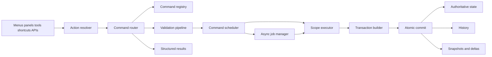
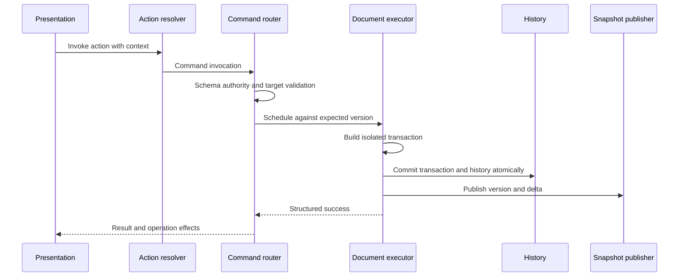
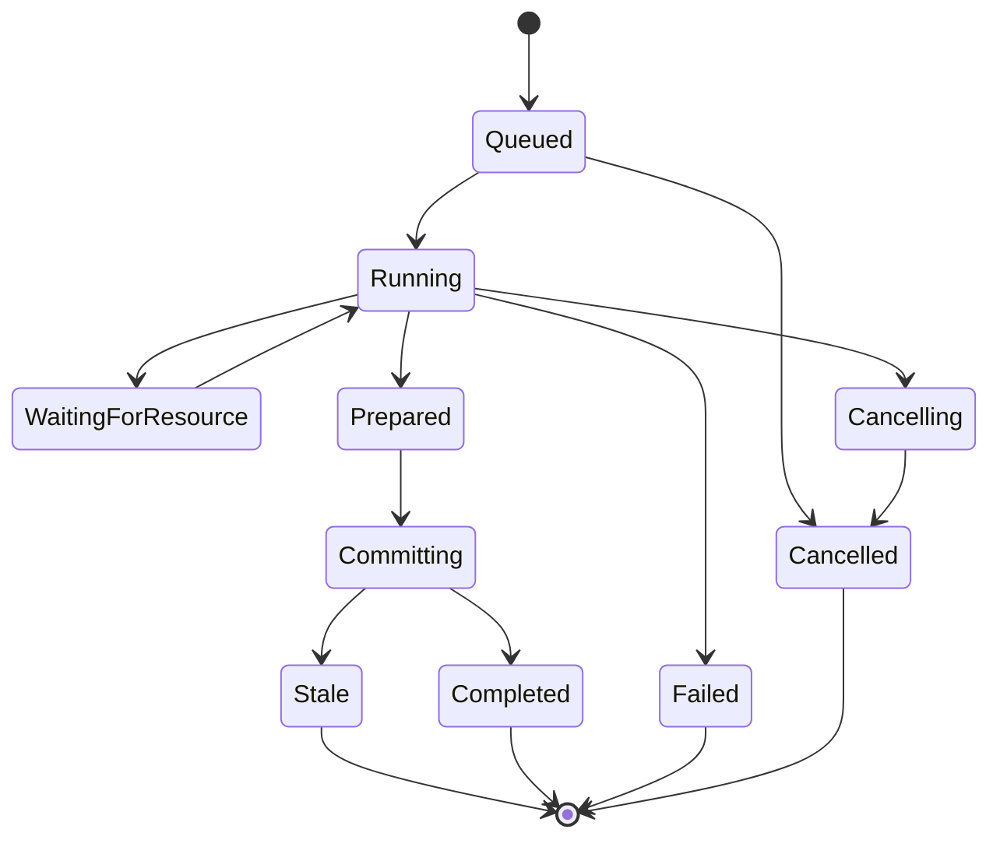
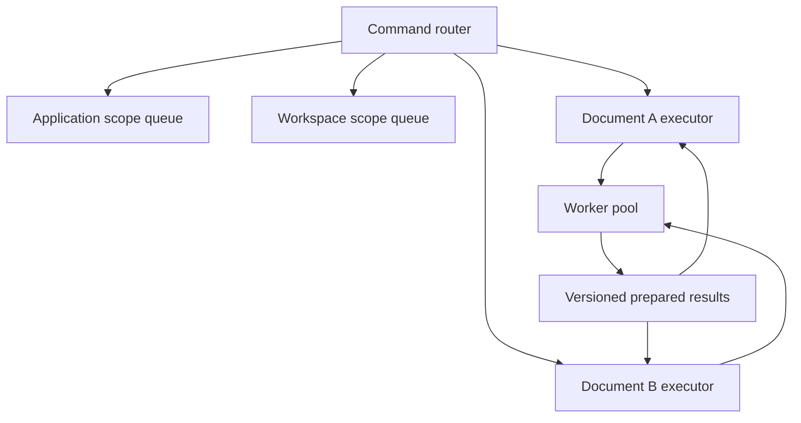
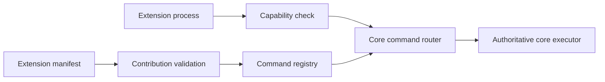
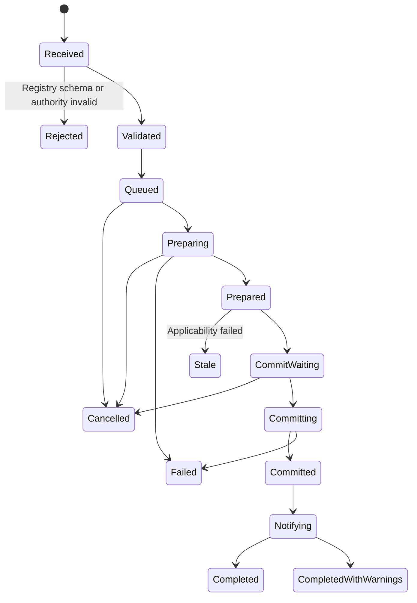
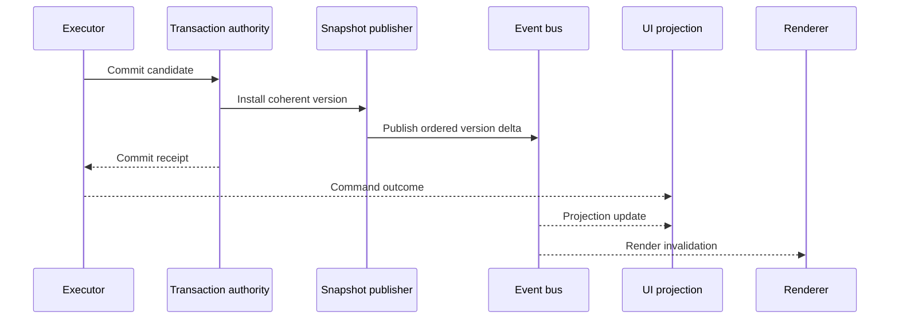
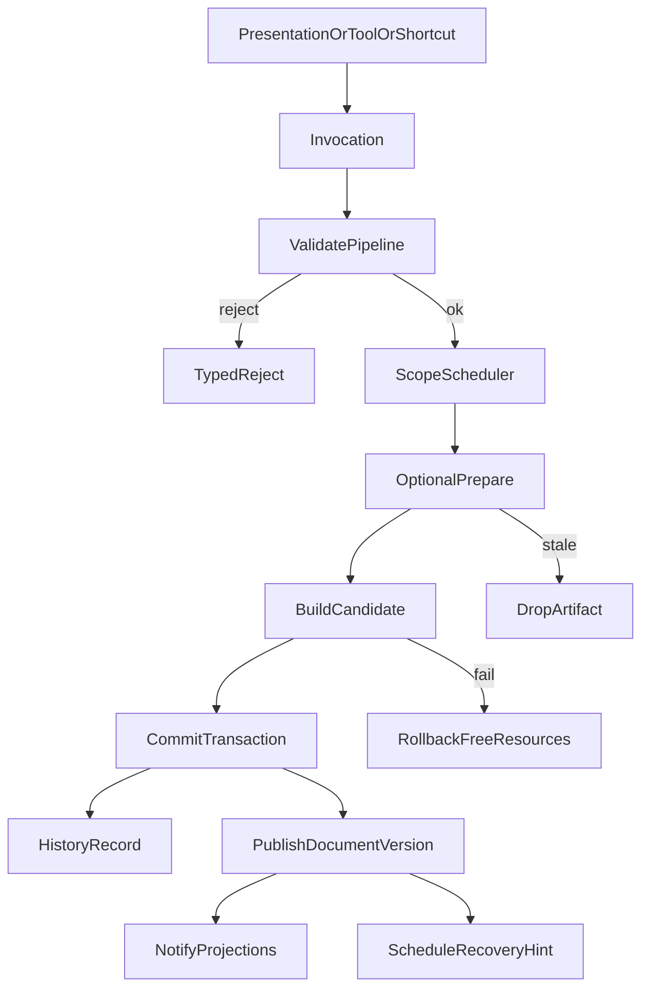
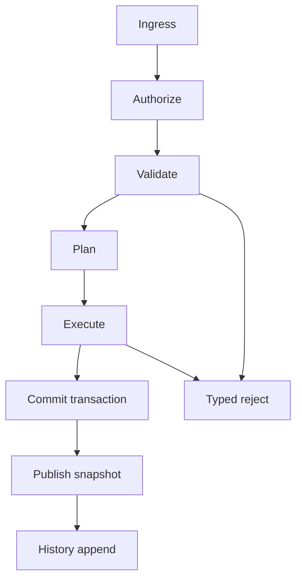

# 08 — Command System

## Overview

The command system is PhotoTux’s sole semantic mutation spine for **document-authoritative** commits. Named commands enter through `SessionState::invoke` (host adapter: `AppSession` → command IDs). Presentations emit actions or QML slots; routing performs validation, commit, history registration, and effect publication.

**Accepted v1 scope:** every document-authoritative mutation (graph, selection, masks, filters/styles that persist, raster commits, view camera that is session-shared, history undo/redo) **MUST** enter a named command. Target architecture still aims at workspace/preference/extension commands; those are not v1 blockers when they have an explicit host owner (see host-only classes below).

Direct mutation of the authoritative document graph from widgets, panels, tools, context menus, shortcuts, jobs, importers, or extensions is forbidden. Read-only queries and ephemeral presentation updates need not be commands, but any state with semantic persistence, undo, cross-view visibility, or operational consequence **MUST** have an explicit owner and command path (or a documented host-only exemption below).

### Host-only classes (not document commands)

| Class | Examples | Owner |
| --- | --- | --- |
| **Ephemeral preview** | Selection/crop/transform drafts, hover overlays | Host / tool; commit path uses a command |
| **Paint stream** | `stroke_begin` / point / end until stroke commit | Engine worker; stroke-end registers history via command or equivalent commit |
| **Tool chrome** | Brush size, FG/BG colors, mask-edit target, selection combine mode | Session UI / resource state |
| **Preferences / workspace chrome** | Panel toggles, Reset Essentials, guides visibility prefs | Prefs service ([DR-015](Appendix/Decision-Register.md#dr-015--workspace-state-separate-from-documents) v1) |
| **Host I/O adapters** | File dialogs, open/save/export workers, GPU document open sync | Lifecycle / async-job; taxonomy may name them later without forcing a full persistence bus today |
| **Telemetry / shell** | Viewport size, FPS, status text | Non-authoritative |

An ephemeral draft is still edited state and gets the same input discipline as a command's arguments, because it reaches the renderer before any command sees it. The worked example is `LayerTransform::with_usable_scale`, which every free-transform draft passes through:

- **Clamp a scale by magnitude, never by value.** `scale.max(MIN)` silently rectifies a negative to a positive — a mirrored layer unmirroring on the first drag. `scale.abs().max(MIN).copysign(scale)` keeps the direction. Under aspect constraint, both axes take the shared magnitude and keep their own signs.
- **Reject non-finite explicitly.** `f32::max` happens to swallow NaN but passes infinity straight through, and an infinite scale reaches `forward_affine` as a singular matrix that `inverse_affine` replaces with the identity — a transform that looks discarded rather than rejected.

Neither case is producible by the shipped gizmo. Both are representable in a `.ptx` layer transform, which is the reason they are handled at all.

## Failure Presentation

`CommandError` has two halves and they belong on different paths. `Rejected`
and `InvalidArgument` are the command declining and saying why — something the
person at the keyboard can act on. An `Unknown` command id, or a document
invariant that did not hold, is a wiring fault with nothing useful to tell a
user. `CommandError::is_user_correctable` makes that split, and it is a
**variant** test: the host used to recover the classification by searching the
rendered `Display` text for the word "rejected", having just called
`to_string()` on the value that already knew the answer. That also mis-routed
anything else whose message happened to contain the word, and driver messages
do use it.

`CommandError::user_message` renders the sentence a person reads. There is no
table mapping internal reasons to friendly ones — a second table is a second
vocabulary and it would drift. The reason string *is* the message, written for
the reader; what `user_message` adds is presentation: an initial capital, a
full stop, and none of the `command rejected:` scaffolding, which stays on
`Display` where logs and `Debug` output want it.

Reasons are written as advice wherever the user can actually reach them —
"select a layer first", "this layer's position is locked — unlock it to move
it". Many rejections are guards the enablement layer already prevents, and
those stay terse. A sweep over the shipped command registry asserts every
reason survives presentation, so one added later gets the same treatment
without anyone remembering.

## Responsibilities

The command system **MUST**:

- register stable, vendor-neutral command IDs and versioned parameter/result schemas;
- resolve exact scope, targets, provenance, authority, expected versions, and conflict policy;
- validate both before scheduling and at execution;
- serialize conflicting authoritative mutations;
- produce zero or one committed transaction for each mutating command;
- atomically register history and publish authoritative version changes;
- expose enablement without treating it as enforcement;
- support bounded asynchronous jobs, progress, cooperative cancellation, and stale-result rejection;
- isolate extension commands behind capabilities and budgets;
- return typed outcomes identifying preserved state and retry policy;
- record bounded local diagnostics without document content by default.

It **SHOULD** support deterministic replay for suitable commands, transaction grouping and merge policy, idempotency keys for externally retried requests, and headless execution. It **MAY** support local scripting or batch hosts later through the same contracts.

## Architecture



### Internal hierarchy

```text
Command subsystem
├── descriptor registry
├── invocation builder
├── target and authority resolver
├── enablement evaluator
├── validation pipeline
├── per-scope scheduler
├── synchronous executors
├── asynchronous job manager
├── transaction builders
├── atomic commit coordinator
├── history/snapshot publication bridge
├── cancellation registry
├── extension mediation
└── local diagnostics
```

## Command Descriptor and Invocation

```rust
struct CommandDescriptor {
    id: CommandId,
    schema_version: SchemaVersion,
    name: TextKey,
    description: TextKey,
    scope: CommandScope,
    mutation: MutationClass,
    undo: UndoPolicy,
    execution: ExecutionClass,
    parameters: ValueSchema,
    result: ValueSchema,
    target: TargetSchema,
    required_capabilities: Set<CapabilityId>,
    conflict: ConflictPolicy,
    cancellation: CancellationPolicy,
    history: HistoryPolicy,
    diagnostics: DiagnosticPolicy,
    provenance: ContributionProvenance,
}

struct CommandInvocation {
    invocation_id: InvocationId,
    command_id: CommandId,
    descriptor_generation: RegistryGeneration,
    parameters: BoundedValue,
    target: TargetSnapshot,
    expected_versions: VersionVector,
    provenance: InvocationProvenance,
    authority: CapabilityGrant,
    cancellation: CancellationId,
    correlation: CorrelationId,
}
```

Command IDs use stable namespaced semantics such as `document.save`, `layer.set-opacity`, `workspace.apply-preset`, and `view.zoom-in`. IDs do not encode menu location, toolkit, implementation crate, shortcut, or vendor terminology. Schemas define limits before allocation. Dynamic unbounded maps and opaque executable callbacks are forbidden at trust boundaries.

Provenance identifies user presentation, tool gesture, history operation, recovery, built-in service, extension, or future local automation. Provenance affects diagnostics and authority, never semantic correctness.

## Actions, Commands, and Transactions

- **Action:** discoverable named operation with presentation, scope resolution, enablement, and optional shortcut.
- **Command:** validated semantic request with parameters and targets.
- **Transaction:** atomic state transition produced by a mutating command.
- **Job:** bounded asynchronous work that may prepare a later commit.

One action normally maps to one command. A view-only action may use a workspace command or explicit non-mutating handler when no persisted/shared state changes. One command may be invoked from many actions only when parameterization or presentation differs without changing semantics.

**The action-to-command wiring lives in the engine.** A descriptor carries a command id and an optional string — `"h"`, `"drop-shadow"`, `"sRGB"` — while the router destructures a specific `CommandArgs` variant; `SessionState::args_for_action` turns one into the other, beside the `invoke` that consumes what it builds. It sat in the host until it could not be tested there, and it reads only session state the engine already owns (the foreground colour for a fill layer, the active layer's locks for a lock toggle), so nothing was gained by the distance.

It ends in a catch-all that answers `CommandArgs::None`, which is the right default for the twenty-odd commands that take no arguments and a silent failure for any other: the command refuses with `InvalidArgument`, and from the shell that is a menu entry that does nothing. `every_action_builds_arguments_its_command_accepts` walks the shipped registry through both halves on an empty session and on one with a document. It rejects `InvalidArgument` only — a command refusing because there is no document or no active layer is answering correctly, and enablement tags are what keep that off the screen.

**Descriptor lookup is a hot path and must be constant-cost.** Presentations resolve enablement per action, and every bound action re-resolves together whenever a shared enablement input changes — the surface is the whole menu tree, not one item. A lookup that constructs the descriptor table therefore multiplies one state change by the table size and by the number of bindings. Descriptors are immutable for the process lifetime, so the table **MUST** be built once and looked up by index; helpers that walk it **SHOULD** borrow rather than clone.



## Validation Pipeline

Validation is layered and side-effect-free until execution preparation explicitly acquires bounded resources.

1. **Registry validation:** command exists, descriptor generation is acceptable, contribution enabled.
2. **Schema validation:** parameters and targets satisfy types, ranges, units, counts, depth, and enum compatibility.
3. **Authority validation:** caller capability covers command, target, files, resources, and extension scope.
4. **Lifecycle validation:** session/document/workspace accepts new work and is not finalizing or closed.
5. **Target validation:** stable IDs resolve to correct object kinds and ownership.
6. **Version validation:** expected versions meet conflict policy.
7. **Semantic validation:** locks, editability, selection, color/format, graph invariants, and operation-specific preconditions.
8. **Resource validation:** provisional memory, disk, GPU, and job budgets are available or degradable.
9. **Commit validation:** assumptions are checked again immediately before transaction commit.

```rust
enum ConflictPolicy {
    RequireExactVersion,
    RevalidateOnLatest,
    RebaseDeclaredFields,
    RejectIfTargetsChanged,
    ViewStateLastWriterWins,
}
```

`LastWriterWins` is limited to non-document presentation preferences. Pixel, graph, selection, and destructive document mutations never silently use it. Enablement uses a cheap subset of validation and returns:

```rust
struct Enablement {
    state: EnabledState,
    reason: Option<DisabledReason>,
    target_summary: TargetSummary,
    evaluated_versions: VersionVector,
}
```

Enablement **MUST NOT** be cached beyond declared dependencies. An enabled control can still fail after concurrent change; a disabled reason must remain actionable.

## Transaction Construction and Commit

Transaction building occurs against an isolated mutable builder, persistent data structure branch, copy-on-write tile set, or equivalent rollback-safe representation. Authoritative readers cannot observe partial changes.

```rust
struct TransactionRecord {
    transaction_id: TransactionId,
    command_id: CommandId,
    source_versions: VersionVector,
    committed_versions: VersionVector,
    forward: ReversibleDelta,
    inverse: ReversibleDelta,
    affected_objects: Set<ObjectId>,
    affected_regions: List<DirtyRegion>,
    resource_effects: ResourceEffects,
    history_label: Text,
    merge_key: Option<MergeKey>,
    persistence_effect: PersistenceEffect,
    correlation: CorrelationId,
}
```

Commit sequence:

1. lock or enter scope mutation authority;
2. revalidate assumptions and cancellation boundary;
3. finalize bounded reversible representation;
4. apply authoritative state replacement;
5. register history record;
6. increment monotonic versions;
7. publish coherent snapshot/delta;
8. release authority;
9. notify presentation, save/recovery, renderer, and diagnostics asynchronously.

Steps 4–7 are one observable atomic boundary. If implementation cannot atomically update internal structures, readers **MUST** still see either old complete state or new complete state. Failure before boundary commits nothing. Failure after boundary reports committed success with secondary notification failure; it never claims rollback when commit was observed.

## Command Grouping and Merge

A command group is an explicit atomic or history-presentational composition. Atomic groups validate all child commands and produce one transaction or none. History groups may contain multiple committed transactions but expose one undo label only if failure/cancellation semantics remain clear.

Continuous gestures may submit mergeable segments for latency. Merge requires same command family, document, target set, merge key, compatible parameters, uninterrupted causal sequence, and configured time/size bounds. Merge changes history representation, not committed version ordering. Each segment remains a monotonic version.

Undo and redo are commands that apply inverse/forward transaction semantics under current invariants. They produce new versions. They do not decrement version counters or bypass validation.

## Asynchronous Jobs

Commands exceeding interactive budget create a job or return an operation handle. Typical jobs include import, export, save, large filters, indexing, thumbnails, and device reconstruction. A job may read immutable snapshots and prepare data off-thread, but any authoritative mutation returns through a commit command.



```rust
struct JobRecord {
    operation_id: OperationId,
    command: CommandInvocation,
    source_snapshot: Option<SnapshotLease>,
    priority: JobPriority,
    phase: JobPhase,
    progress: ProgressModel,
    cancellation: CancellationId,
    budget: ResourceBudget,
    applicability: ApplicabilityPredicate,
}
```

Queues are bounded. Priority order protects input, document commit, visible rendering, save/recovery, and user-requested foreground jobs before speculative thumbnails. Progress is monotonic within phases, rate-limited, and identifies operation. Unknown total work uses indeterminate progress with concrete phase.

Prepared results carry source version and applicability predicate. If stale, policy discards, revalidates/rebases only declared semantics, or asks user; it never blindly applies. Job completion callbacks do not hold document locks.

## Cancellation

Cancellation is cooperative, idempotent, and phase-aware:

- before scheduling: no work starts;
- during preparation: workers stop at bounded checkpoints and release provisional resources;
- before commit boundary: no authoritative mutation;
- after commit boundary: operation reports committed; reversal requires a new command, usually undo;
- during staged save after replace: save reports success because destination changed durably;
- non-cancellable critical section: UI reports “finishing” and bounds duration.

Cancellation tokens form a hierarchy: session → document/workspace → invocation → subjobs. Parent cancellation propagates; child failure does not automatically cancel siblings unless group policy says so. Extensions cannot suppress host cancellation.

## Scope Scheduling and Ownership



Thread roles are contracts, not runtime commitments. A document executor may be a dedicated task, serialized mailbox, or lock-safe scheduler. What matters:

- conflicting mutations serialize;
- independent documents can progress concurrently;
- read-only snapshot consumers do not block mutation;
- UI thread does not perform unbounded work;
- filesystem/GPU/extension calls occur outside authoritative locks;
- all channels are bounded or have explicit coalescing/shedding;
- cross-document atomic mutation is unsupported unless a future transaction coordinator defines failure and recovery.

Workspace and preference commands use their own authority and generally are not document history. Commands affecting both workspace and document **SHOULD** split into explicit operations unless atomic user meaning requires a defined coordinator.

## Save, Export, and Import Commands

`document.save` requests the lifecycle save coordinator using a stable snapshot. Save completion updates persisted-version metadata through a command/internal authoritative transition and clears modified state only if versions match. `document.save-copy` and `document.export` never clear modified state. Import decodes untrusted data into a validated intermediate form and registers a document only at a coherent commit boundary.

Filesystem capabilities are invocation parameters granted by the host, not arbitrary paths inferred from documents or extensions. Codecs run under limits and never mutate visible documents incrementally without transaction boundaries.

## Plugin and Extension Commands

Future extensions register descriptors through a contribution manifest. Registration validates namespace ownership, schema limits, action mapping, required capabilities, deterministic behavior claims, cancellation, resource budget, and compatibility version. Registration does not grant execution authority.



Extensions **MUST NOT** receive mutable document references, hold core locks, forge built-in provenance, register unbounded schemas, intercept unrelated commands, or execute on the UI thread. Extension-provided computation returns bounded declarative results that core validates. Stable binary ABI remains deferred.

## Result and Failure Model

```rust
enum CommandOutcome {
    Committed { transaction: Option<TransactionId>, versions: VersionVector, effects: EffectSummary },
    Accepted { operation_id: OperationId },
    NoChange { reason: NoChangeReason },
    Rejected { error: CommandError },
    Cancelled { phase: CancellationPhase },
}

struct CommandError {
    category: ErrorCategory,
    code: StableErrorCode,
    message: Text,
    preserved_state: PreservedStateSummary,
    retry: RetryPolicy,
    field_errors: List<FieldError>,
    correlation: CorrelationId,
}
```

Categories include malformed input, unavailable target, version conflict, permission/capability, lifecycle, resource pressure, unsupported capability, external failure, extension failure, and invariant failure. Errors are data, not string matching. Invariant failure freezes affected mutation authority, captures bounded diagnostics, preserves recovery, and avoids speculative repair.

Partial success is forbidden unless descriptor explicitly models independent targets and result schema reports each outcome. Destructive multi-target operations default atomic.

## Persistence, Compatibility, and Replay

Command schemas are semantic and versioned independently from Rust types. Diagnostic/replay serialization excludes file capabilities, secrets, pixel payloads, private names, and uncontrolled metadata. A command is replayable only if descriptor declares deterministic inputs, resource identities, version assumptions, and compatibility policy.

History stores transaction meaning and reversible data, not necessarily original invocation serialization. Plugin command removal cannot make core history corrupt; extension-owned reversible records require durable opaque handling or checkpoints before third-party commitment.

## State and Invariants

- Every semantic mutation has exactly one command origin.
- A mutating invocation commits zero or one transaction.
- Failed validation publishes no authoritative version.
- Commit and history registration are observed atomically.
- Document versions increase on every commit, including undo/redo.
- Enablement never substitutes for execution validation.
- Cancellation before commit leaves no authoritative partial state.
- Cancellation after commit does not erase observed history.
- Worker results apply only under explicit applicability.
- Derived render/GPU state is never transaction authority.
- Extensions execute with explicit capabilities and bounded resources.
- Command locks never span external callbacks or I/O.

## Failure Handling

Allocation or resource failure during building abandons isolated changes. History registration failure before commit aborts. Snapshot publication delivery failure after commit triggers resynchronization from authoritative latest snapshot. Queue saturation rejects or coalesces according to command class; it never silently drops user mutations. Executor panic or isolation failure marks scope unhealthy, stops new mutations, and preserves last coherent version/recovery.

## Design Rationale and Alternatives

**Single mutation spine versus direct model binding.** Commands add descriptors and schemas, but unify validation, undo, automation, concurrency, accessibility, extensions, and diagnostics. Direct bindings fragment invariants.

**Per-document serialization versus global lock.** Per-document authority enables concurrency and fault isolation. A global lock simplifies ordering but lets imports or filters stall all documents.

**Transactions versus whole-document snapshots.** Transactions scale and permit precise invalidation. Checkpoints may complement them for recovery and history traversal.

**Prepared async results plus commit versus long-held mutation lock.** Preparation allows responsive editing; it requires applicability checks. Long locks simplify stale handling but violate latency and deadlock boundaries.

## Best Practices

- Name commands by domain outcome.
- Keep schemas explicit, bounded, and fuzzable.
- Make validation pure where possible.
- Inject failure before every commit stage.
- Test cancellation at every phase boundary.
- Correlate action, command, job, transaction, render, and save locally.
- Prefer immutable snapshots and copy-on-write builders.
- Keep error codes stable and messages actionable.
- Benchmark complete command workflows, not handlers alone.

## Future Extensibility

The command spine can support local scripting, batch execution, sandboxed extensions, macro recording for replayable commands, and alternate desktop hosts. Each requires explicit capability, schema compatibility, cancellation, privacy, and determinism contracts. Nothing here authorizes remote execution, cloud collaboration, accounts, AI-generated mutations, or proprietary workflows.

## Execution Interfaces

```rust
interface CommandRegistry {
    register(descriptor: CommandDescriptor, executor: CommandExecutorRef) -> Result<RegistrationLease, RegistryError>;
    resolve(id: CommandId, generation: RegistryGeneration) -> Result<ResolvedCommand, RegistryError>;
    snapshot() -> CommandRegistrySnapshot;
}

interface CommandRouter {
    enablement(query: EnablementQuery) -> Enablement;
    submit(invocation: CommandInvocation) -> AsyncResult<CommandOutcome, CommandError>;
    cancel(id: CancellationId, reason: CancelReason) -> CancellationOutcome;
    status(operation: OperationId) -> Optional<OperationStatus>;
}

interface CommandExecutor {
    validate(context: ValidationContext, parameters: BoundedValue) -> ValidationResult;
    prepare(context: PreparationContext, parameters: BoundedValue) -> AsyncResult<PreparedCommand, CommandError>;
    build(context: CommitContext, prepared: PreparedCommand) -> Result<TransactionCandidate, CommandError>;
}

interface TransactionAuthority {
    snapshot(scope: MutationScope) -> Result<AuthoritativeSnapshot, AuthorityError>;
    commit(candidate: TransactionCandidate, expected: VersionVector) -> Result<CommitReceipt, AuthorityError>;
}
```

Executors do not publish snapshots, append history, or increment versions directly. They return candidates to authority. `PreparedCommand` is immutable, bounded, version-tagged, and owns provisional resources through explicit leases. Dropping/cancelling it releases resources without authoritative effects.

```rust
struct TransactionCandidate {
    command: CommandId,
    scope: MutationScope,
    expected: VersionVector,
    preconditions: List<CommitPrecondition>,
    forward: ReversibleDelta,
    inverse: ReversibleDelta,
    effects: EffectSummary,
    history: HistoryMetadata,
    resources: ProvisionalResourceSet,
}
```

Authority validates candidate internal consistency: inverse covers forward semantic effects, affected IDs belong to scope, dirty regions are bounded, resource leases are valid, history metadata is legal, and no external callback is embedded.

## Invocation Lifecycle



`Committing` is a bounded non-interruptible phase once authoritative replacement begins. A cancellation arriving there is recorded and returned as “commit already in progress” or committed outcome. `Notifying` failure cannot undo commit; consumers resynchronize.

Invocation identity is unique. Optional idempotency key maps retries only when descriptor defines key scope, retention, and result replay safety. UI double activation normally receives distinct invocations and is controlled by action busy policy, not hidden global deduplication.

## Validation Contracts in Detail

Schema validators are total over bounded input and return all field errors up to a configured cap. They never panic on unknown enum, non-finite numeric value, excessive nesting, invalid text encoding, duplicate key, or integer overflow.

Authority validation checks:

- provenance identity and capability signature/lease;
- capability has not expired or been revoked;
- target document/workspace belongs to session;
- file capability grants exact requested operation;
- extension namespace matches descriptor;
- command does not exceed caller-specific resource budget.

Semantic validation classifies preconditions:

- **stable:** object kind/ownership expected not to change during preparation;
- **recheck:** target existence, lock, selection, current version;
- **resource:** memory/disk/GPU budget and local capability;
- **user decision:** conversion loss or destructive confirmation already captured under exact scope;
- **environment:** codec/renderer/host feature availability.

Prepared commands carry recheck set. User confirmation is invalidated when exact destructive scope or consequences change. It is not a broad permission to execute against a newer unrelated target set.

## Scheduling and Fairness

Scheduler assigns class:

- immediate read-only query;
- short scope mutation;
- interactive mergeable mutation;
- foreground preparation plus commit;
- durability operation;
- background reconstructible operation;
- extension operation.

Per-document mutation order follows accepted invocation sequence unless explicit gesture merge/coalescing policy applies. Long preparation does not hold queue head: it snapshots version, prepares outside authority, then re-enters commit queue. Short newer command may commit first, causing prepared result to revalidate/stale.

Backpressure behavior:

- user mutations are rejected visibly rather than silently dropped;
- repeated view-state commands may coalesce to latest;
- gesture samples may coalesce under tool contract while preserving geometry;
- speculative/background jobs are cancelled first;
- progress updates coalesce by operation;
- extension submissions have independent quotas;
- durability jobs receive reserved capacity.

Priority aging prevents a valid lower-priority foreground job from starving. Aging never raises speculative work above interactive mutations or critical save/recovery.

## Notification and Projection Consistency

Commit receipt contains new version, transaction ID, delta, snapshot publication token, and effects. Publication order is deterministic:

1. transaction/history authority becomes readable;
2. latest document snapshot resolves new version;
3. version/delta event enters ordered document stream;
4. command outcome completes;
5. derived consumers schedule work.

Consumers may observe command outcome before rendering catches up, but can query snapshot at committed version. Delta stream gaps trigger full snapshot resynchronization. A UI cannot treat repaint completion as command success.



## Error and Edge-Case Matrix

Registration:

- duplicate built-in command ID: fail registry generation publication;
- extension namespace collision: reject extension contribution;
- unsupported schema version: leave command unavailable with provenance;
- descriptor claims undoable but executor lacks inverse contract: reject registration;
- invalid cancellation policy for destructive async command: reject registration.

Submission:

- action uses stale registry generation: resolve compatible same ID/schema or reject;
- target ID exists in wrong document: reject authority/target mismatch;
- malformed parameters: field errors, no queue insertion;
- lifecycle quiescing: reject ordinary mutation, permit explicit shutdown/save classes;
- queue full: reject/coalesce by declared class, never silent loss.

Preparation:

- source snapshot evicted: reacquire exact version if retained or fail stale;
- worker panic: isolate job, release leases, mark executor health;
- device loss: discard GPU-specific prepared resources; CPU/retry policy explicit;
- extension timeout: cancel/terminate contribution, retain core scope;
- cancellation race: one terminal preparation outcome selected atomically.

Commit:

- expected version changed: apply conflict policy, never implicit last-writer for document content;
- target deleted: stale rejection;
- inverse allocation fails: abort before authoritative replacement;
- history budget cannot retain inverse: command may checkpoint/compact under policy or reject;
- publication channel full: commit succeeds, subscriber is marked for snapshot resync;
- invariant checker fails: reject candidate and freeze offending executor/contribution.

Post-commit:

- UI recipient gone: outcome retained only per bounded operation policy;
- renderer rejects delta: renderer requests snapshot; document commit stands;
- recovery scheduling fails: expose durability warning without rolling back edit;
- diagnostics sink fails: command correctness unaffected;
- undo later lacks extension: use durable reversible representation/checkpoint or report history boundary explicitly.

## Accessibility and User Feedback

Actions expose name, scope, target summary, availability, disabled reason, parameter semantics, destructive class, undoability, and progress behavior before command submission. Command errors return focus target hints: invalid field, missing object, task entry, or original invoking control.

Long commands announce accepted operation and meaningful phase changes. Progress announcements are rate-limited. Cancellation action remains keyboard reachable. Completion of ordinary undoable edits uses polite status; failed save, destructive rejection, or invariant failure uses assertive status. Batch results summarize successes/failures and provide structured detail without reading every item automatically.

Undo labels use user domain language and exact target count where useful. Extension provenance is announced when command crosses a trust boundary. Error messages never rely only on numeric code; code remains available for diagnostics.

## Platform and Extension Adapter Boundaries

Host adapters can supply file capabilities, clipboard payload capabilities, native dialog results, and lifecycle context. They cannot call executors directly; they submit commands through router. Host errors map to typed external errors while preserving original diagnostic category privately.

wgpu/renderer adapters may prepare compute results but return immutable generation-tagged artifacts. They cannot commit document pixels outside transaction authority. Device resources are provisional until commit references CPU-authoritative or recoverable representation.

Extension transport is serialization boundary. Requests/results have schema/version, byte/depth/count limits, operation/cancellation IDs, and capability tokens. Transport disconnect cancels preparation; it cannot leave held document locks. No Rust trait object or memory layout is ABI commitment across that boundary.

## Migration and Compatibility Rules

Command descriptor versions evolve through explicit adapters. Compatible additions use optional fields with defaults. Renaming/removing parameter meaning requires new command schema version or command ID when semantic outcome changes. Migration never maps unknown action/command by display label.

Recorded invocations have compatibility classes:

- diagnostic-only: best-effort readable, never replayed;
- replayable within release line: explicit adapter and deterministic resources;
- durable history: transaction reversible representation remains valid independent of executor;
- local automation contract: only after separately promised version policy.

Registry keeps adapters only for declared supported versions. Unsupported replay reports exact command/version and preserved document state. User documents do not embed arbitrary executable command payloads.

## Observability and Testability

Trace spans cover action resolution, router validation stages, queue wait, preparation, commit wait, commit, publication, notification, cancellation, and cleanup. IDs connect invocation, operation, transaction, document version, render invalidation, and save/recovery scheduling. Parameters are redacted by schema policy.

Metrics include rejection by stage/code, queue depth/wait, preparation/commit latency, stale prepared results, rollback/candidate rejection, cancellation observation, publication resync, extension budget use, and command merge ratio.

Test hooks:

- deterministic registry and schema fuzz harness;
- fake authority with version barriers;
- transaction candidate invariant checker;
- injected allocator/resource failures;
- controlled worker scheduler;
- cancellation barrier at every phase;
- bounded event bus with forced overflow;
- fake extension transport disconnect;
- replay compatibility fixture runner.

### Deterministic acceptance scenarios

**Stale preparation:** start filter at version 4, commit paint to 5, finish filter; assert declared policy rejects/rebases explicitly and never overwrites paint.

**Atomic failure:** inject failure after forward delta built but before inverse finalized; assert version/history/snapshot unchanged and provisional resources released.

**Post-commit notification loss:** commit opacity change, drop event delivery, assert outcome committed, latest snapshot version readable, subscriber resyncs, undo works.

**Cancellation boundary:** cancel once in preparation and once during commit; first yields no transaction, second yields committed outcome plus cancellation timing.

**Queue pressure:** saturate extension/background queues, submit user save and layer rename, assert reserved capacity, no silent mutation loss, and bounded extension rejection.

**Presentation equivalence:** submit same action from toolbar, context menu, shortcut, and command search; assert command ID/schema/target meaning equal, provenance differs only diagnostically.

## Extended Edge-Case Matrix

Command edges across validation, commit, async, queues, and extensions:

- Validate fails on unit mismatch: no locks held past return; no history; no renderer invalidation.
- Mid-build inverse allocation fails: candidate discarded; document version unchanged; resources freed.
- Commit succeeds; UI subscriber gone: outcome retained per policy; no retry mutate.
- Async prepare completes after newer edit: stale prepared artifact dropped; no overwrite.
- Cancel during prepare: no transaction; cancel during commit-after-publish: undo path or explicit compensating policy, never silent half-state.
- Two commands on doc A serialize; doc B command proceeds concurrently on independent executor.
- Queue saturated with extension work: user save/rename reserved capacity; extension gets typed rejection.
- Save version N while head N+1: save stores N; modified remains for N+1.
- Mergeable stroke commits: merge per descriptor rules; history label coalesces; never merge across non-mergeable barriers.
- Extension command without capability token: hard reject; no ambient authority from UI thread presence.
- Invariant checker fails post-candidate: reject; optionally freeze contribution; document prior version stands.
- Publication channel full: commit stands; subscriber marked resync; snapshot fetch follows.
- Import finalize races quit: lifecycle coordination; command either finishes or aborts cleanly with temp cleanup.
- Parameter coercion from legacy replay: only through version adapter; never by display name.
- Clipboard paste as untrusted: validation pipeline includes size/type checks before pixel integration.
- Device loss during GPU prepare: prepare fails typed; document unchanged; retry after rebuild may occur only on new invocation.
- Nested command attempt from executor: forbidden; returns reentrancy error.
- History compact during long command: compact waits or command sees stable epoch per scheduling rules.

## Host and Executor Adapter Contracts

Router contracts:

- `submit(invocation) -> OperationId`
- `cancel(operation)`
- `status(operation) -> Status`
- executors implement `validate`, `build`, `commit` with transactional guarantees;
- preparers return immutable artifacts tagged `(doc_id, base_version, prep_gen)`.

Host may supply file/dialog/clipboard capabilities as inputs to invocation construction. Host must not call `commit`. wgpu adapters return prepared buffers only; CPU-authoritative document state remains in document store.

Extension transport:

- schema version, limits, cancellation, capability tokens;
- disconnect ⇒ cancel prepare; no held document locks;
- results deserialized into owned core types before validation.



## Versioning and Migration Notes

Command descriptors carry `command_id`, `schema_version`, parameter schema, merge class, undo class, and danger class. Recorded invocations for diagnostics/replay carry compatibility class.

Rules:

- Additive optional params get defaults; semantic meaning change ⇒ new schema version or new command ID.
- Alias map for renamed IDs; localization independent.
- Durable history stores reversible representations, not executable plugin code.
- Replay within release line requires adapters and deterministic resource hooks; otherwise diagnostic-only.
- Unsupported version: report command/version; document preserved; no best-effort guess.
- Save/export format versions are independent of command schema versions but share correlation IDs in logs.

Migration tests include golden invocation fixtures per supported version and fuzz of unknown fields.

## Extended Observability Hooks

- `cmd.submit{action,command,scope}`
- `cmd.reject{stage,code}`
- `cmd.queue_wait{ms,scope}`
- `cmd.prepare{ms,result}`
- `cmd.commit{doc,ver,ms}`
- `cmd.rollback{reason}`
- `cmd.stale_prep{count}`
- `cmd.cancel{phase}`
- `cmd.merge{ratio}`
- `cmd.ext_budget{code}`

Spans nest validation→queue→prepare→commit→publish. Parameters redacted by schema flags. Metrics drive fairness tuning without exposing user content. Failure dumps include correlation IDs, versions, and stage—not pixel buffers.

## Security and Trust Notes

- Commands are the sole mutation authority; UI cannot poke document memory.
- Extension commands require explicit capability tokens; no ambient desktop authority.
- Validation must treat all external bytes (files, clipboard, extension params) as untrusted.
- History reversible blobs must not embed executable code.
- Error messages avoid leaking absolute paths/tokens; diagnostics channel may keep private codes.
- Reentrancy and nested submits from executors are hard errors to prevent privilege confusion.
- Queue reservation prevents untrusted extension floods from starving saves.
- Headless tests prove core commands need no UI toolkit objects, shrinking attack surface for automation.

## Deterministic Acceptance Scenarios

**Scenario Q1 — Validate reject:** invalid resize units; assert no version change, no history, no renderer invalidate.

**Scenario Q2 — Mid-build fail:** inject inverse alloc fail; assert full rollback; resources zeroed.

**Scenario Q3 — Stale async:** prepare on ver 4; edit to 5; prepare returns; assert drop; ver 5 stands.

**Scenario Q4 — Cancel phases:** cancel in prepare → no tx; cancel after publish → documented compensating/undo path only.

**Scenario Q5 — Queue pressure:** saturate extensions; user save proceeds; extension typed reject.

**Scenario Q6 — Presentation equivalence:** same action from toolbar, context, shortcut, search; equal command ID/schema/target meaning.

**Scenario Q7 — Save vs edit:** save N concurrent with edit N+1; modified remains after save N.

**Scenario Q8 — Extension authority:** call without token; reject; document unchanged.

## Neighboring Subsystem Interactions

- **Lifecycle:** issues save/open/close intents as commands; coordinates quit with in-flight ops.
- **Panels/toolbars/menus/shortcuts:** all construct invocations; none commit.
- **Tools/gestures:** finish paths submit commands; provisional previews are non-authoritative.
- **Renderer:** consumes published versions/snapshots; cannot author document pixels.
- **Persistence/recovery:** save commands produce durable versions; recovery reads snapshots, not command streams.
- **Extensions:** sandboxed preparers/executors behind tokens and budgets.
- **History:** one coherent record per successful commit; merge rules explicit.
- **Concurrency:** per-document serialization; cross-document parallel.

Invariant: commands mutate; document owns truth; history transactions; immutable snapshots for readers.


## Deterministic Scheduling Fairness Notes

Per-document serial queues preserve causal order for edits, saves, and history. Cross-document work proceeds in parallel up to a host-configured executor width. Fairness rules reserve slices for interactive user commands over bulk extension jobs: when the extension queue depth exceeds a threshold, new extension submits receive `BusyRejected` while user-scoped commands continue. Starvation watchdogs log if a document queue head remains unstarted beyond a budget due to lock misuse; executors must not hold document locks during long prepare.

Priority classes are explicit in the invocation: `Interactive`, `UserBackground`, `Extension`, and `Maintenance`. Maintenance never outranks Interactive on the same document. Cancellation tokens propagate at prepare boundaries; commit is the irrevocable publish edge. Tests inject preparers that sleep and assert reserved capacity for Save and Undo-class commands under load.


## Extended Command Authority and Execution Contracts

The command system is the sole semantic mutation spine. UI, tools, shortcuts, menus, and plugins converge here. This section expands applicability, job lifecycles, coalescing boundaries, and auditability.

### Command Descriptor Fields

A command descriptor **MUST** define:

- stable ID and human label;
- scope (application, workspace, document, selection-target);
- parameter schema;
- enablement query;
- idempotence/coalescing class;
- undo policy (undoable, non-undoable, session-only);
- progress/cancellation class;
- danger class;
- required capabilities for extensions;
- telemetry privacy class for local diagnostics.

Descriptors are registry data. Executors are code. Persisted histories store command IDs and parameters, not function pointers.

### Execution Pipeline Deep Dive

1. **Ingress** — normalize invocation source and correlation ID.
2. **Authorize** — check capabilities and document locks.
3. **Validate** — schema + semantic preconditions against current version.
4. **Plan** — estimate cost, declare read snapshot needs, declare write set.
5. **Execute** — produce transaction patch or reject.
6. **Commit** — atomic apply, history append if undoable, version bump, publish snapshot/delta.
7. **Follow-up** — schedule render invalidate, autosave hints, UI refresh signals.

Failure before commit leaves authoritative state unchanged. Failure after partial resource allocation **MUST** roll back allocations before returning.



### Async Jobs and Cancellation

Long commands create jobs with explicit cancellation tokens. UI may dispose; jobs continue only if safe and still relevant. On cancel, executors leave a clean prior version or a defined checkpoint, never a half-applied graph. Progress reporters throttle updates and never stream pixel buffers into logs.

### Coalescing Rules

Coalesce only within declared classes (slider nudges, brush dabs inside a stroke policy, nudge transforms). Coalescing **MUST NOT** cross document versions produced by unrelated commands. Undo of a coalesced group restores the pre-group state in one step unless the user preference splits strokes/gestures.

### Neighbor Interactions

- **History:** receives committed transactions only.
- **Document:** applies patches; does not accept raw UI callbacks.
- **Rendering:** listens to versions; may start speculative work but discards stale versions.
- **Plugins:** may propose commands through capability-checked APIs; host validates again.
- **Import/Export:** use command wrappers for user-visible import-as-layer style edits; pure export may be non-undoable session jobs.

### Deterministic Acceptance Scenarios

1. Dispatch identical no-op parameter change: validate rejects as no-op or commits empty-free policy; history does not grow spuriously.
2. Cancel a long filter before commit: document version unchanged; GPU temporaries released; UI returns to prior snapshot.
3. Extension attempts restricted command without capability: authorize fails; no partial side effects.
4. Coalesced opacity slider drag then undo: single undo restores pre-drag opacity.
5. Two windows issue conflicting renames: versions serialize; second validate runs on new version; both outcomes typed and user-visible.

### Observability

Every reject carries machine reason codes. Local traces include durations per pipeline stage. Privacy class prevents parameter dumping for clipboard contents or file bytes by default.

## Acceptance Criteria

- Headless tests invoke every core mutating command without UI objects.
- Menu, panel, toolbar, context menu, shortcut, and tool paths converge on same command.
- Validation failure commits no state or history.
- Injected mid-build failure rolls back fully.
- Commit publishes one coherent version and matching history record.
- Concurrent commands on one document serialize; independent documents progress.
- Async stale results never overwrite newer edits.
- Cancellation before/after commit follows documented boundary.
- Save version N does not clear modified state at N+1.
- Queue saturation and resource pressure return typed outcomes.
- Extension command lacks ambient authority and cannot block UI thread.
- Error results identify operation, preserved state, retry policy, and correlation.

## Cross References

- [00 — Introduction](00-Introduction.md)
- [01 — Information Architecture](01-Information-Architecture.md)
- [02 — Application Lifecycle](02-Application-Lifecycle.md)
- [05 — Panel System](05-Panel-System.md)
- [06 — Toolbar System](06-Toolbar-System.md)
- [07 — Context Menus](07-Context-Menus.md)
- [09 — Shortcut System](09-Shortcut-System.md)
- [Glossary](Appendix/Glossary.md)
- [Requirement Keywords](Appendix/Requirement-Keywords.md)
- Downstream: `10-Rendering-Architecture.md`
- Downstream: `15-Filters-and-Compute-Operations.md`
- Downstream: `16-Brush-and-Stroke-Engine.md`
- Downstream: `18-Input-and-Gesture-Model.md`
- Downstream: `19-Tool-Framework.md`
- Downstream: `24-Persistence-and-Recovery.md`
- Downstream: `28-Extension-Architecture.md`
- Downstream: `29-Reliability-and-Failure-Handling.md`
- Downstream: `31-Performance-and-Concurrency.md`

## Enablement is a promise, not a hint

An action's enablement tag says when the entry is live. Six of them claimed
only `has_document` while the command behind them refused anything narrower,
so the menu offered Ungroup with no group selected, Bake Text on a raster
layer, Apply Mask on a layer with no mask, and answered each click with a
sentence telling the user what they had just been allowed to ask for. Merge
Group already had this right with `group_selected`; the rest now match:
`group_selected` for Ungroup, `has_mask` for Apply Mask, Mask to Selection and
Copy Layer Mask, and new `text_layer` / `shape_layer` tags for Bake Text and
Rasterize Shape.

A refusal is worth keeping only when it *teaches* — Merge Down's refusal names
Merge Group, which is somewhere to go. "This is not a text layer" is not.

The kind-gated tags compare `active_layer_kind` against a literal, and that
literal comes from `LayerKind::as_str` in a crate the shell does not consult.
Renaming a kind, or writing `smart object` for `smart-object`, leaves the
comparison silently false and the entry greyed out forever — which looks
exactly like an entry that is correctly disabled.
`every_kind_an_enablement_names_is_a_kind_a_layer_reports` fails the build on
that.
