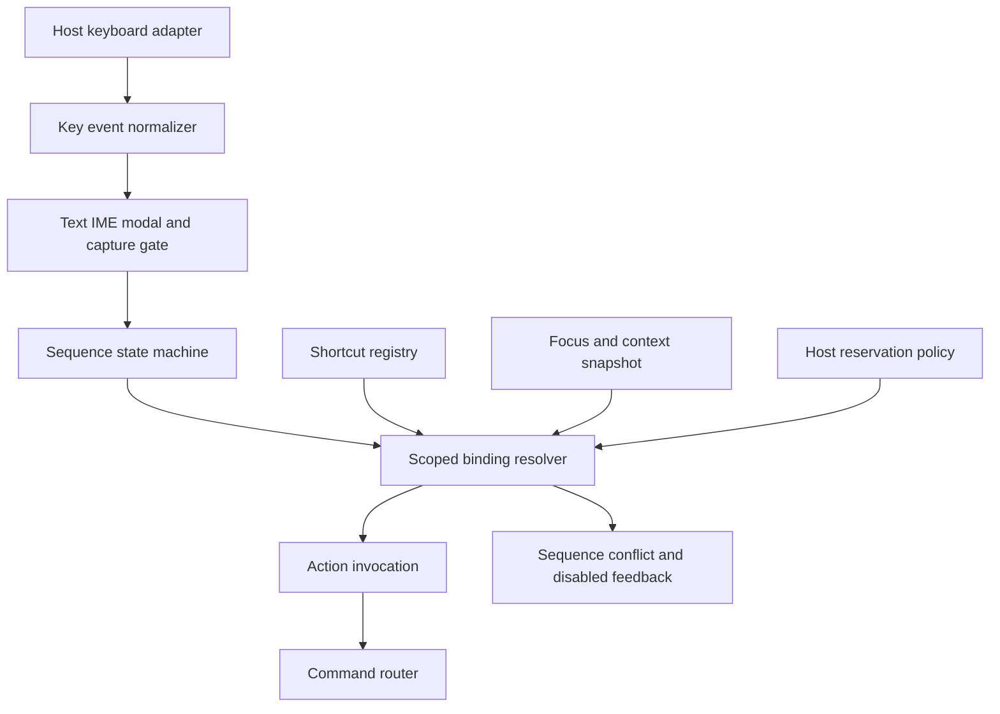
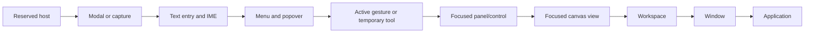
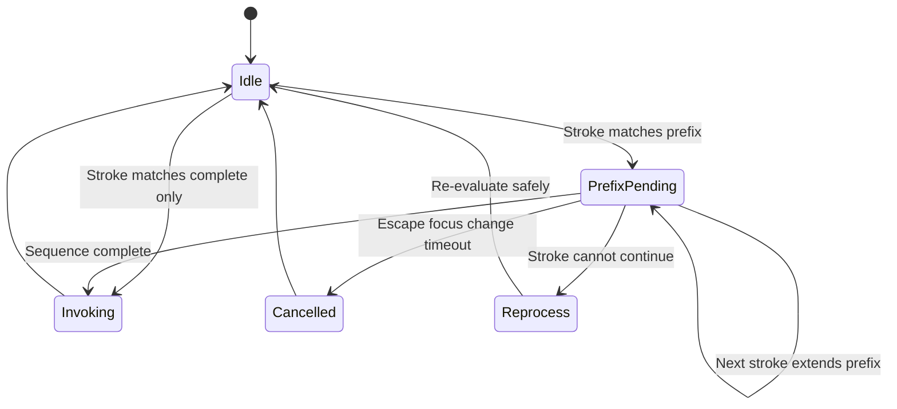
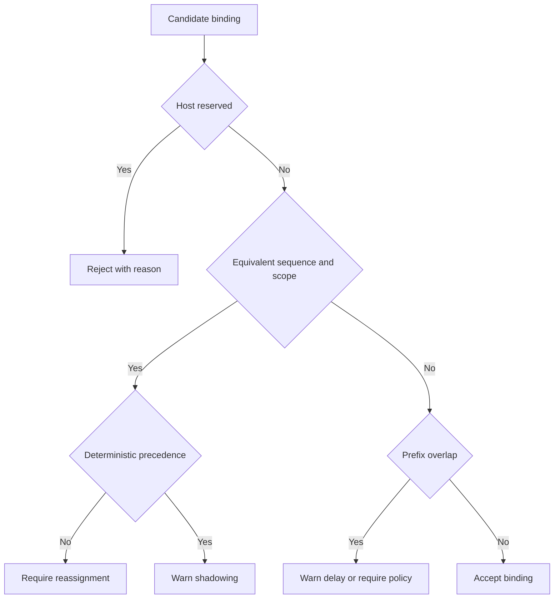
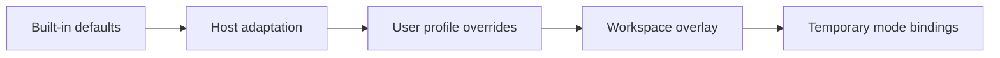
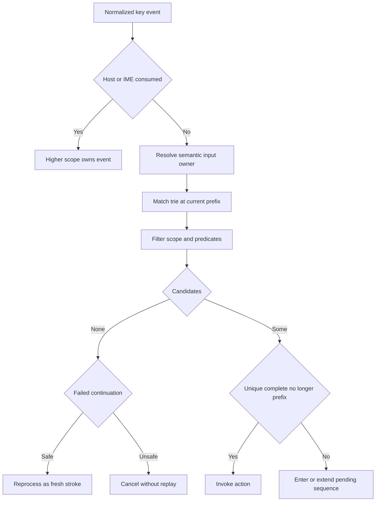
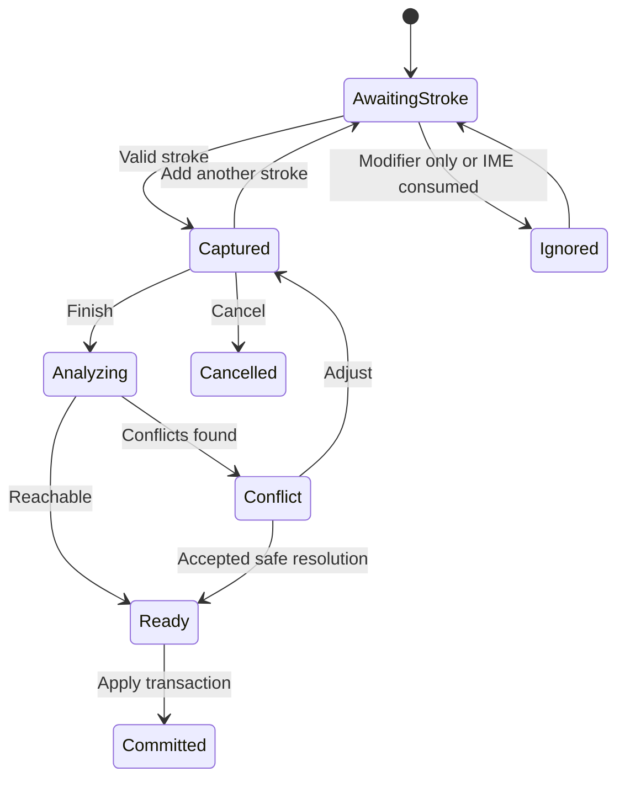
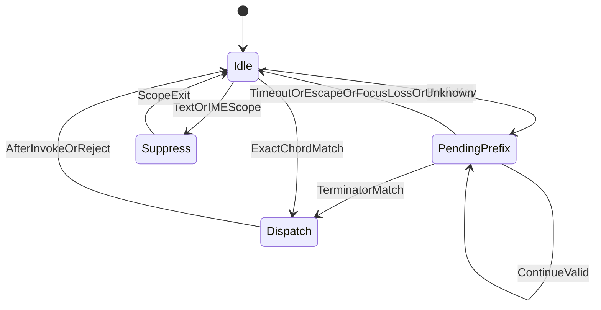
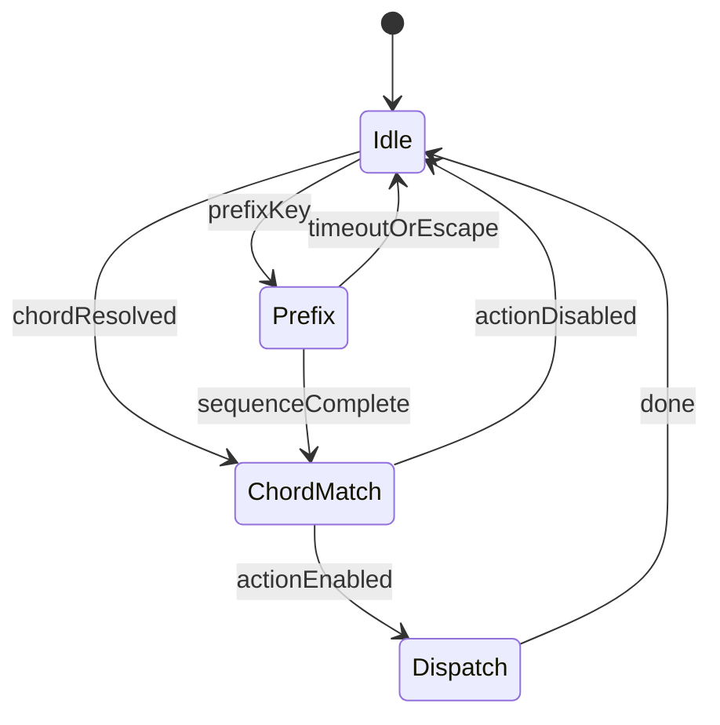

# 09 — Shortcut System

## Overview

The shortcut system maps normalized keyboard input to semantic actions under explicit scope, focus, mode, sequence, accessibility, and host-reservation rules. A shortcut never calls mutation logic directly; it invokes an action, which resolves a command or view-only behavior. Bindings are local preferences and workspace overlays, not document content.

PhotoTux supports single strokes, simultaneous chords, and ordered multi-stroke sequences. Here, **stroke** means one primary key plus concurrently held modifiers; **chord** is a stroke requiring modifiers or multiple simultaneous non-modifier inputs when the host can represent them reliably; **sequence** is two or more strokes entered in order within a timeout. Toolkit key types and raw scan codes do not cross the host adapter boundary.

## Responsibilities

The shortcut system **MUST**:

- normalize host events into physical/logical key identity, modifiers, repeat, composition, focus, and device context;
- resolve bindings by explicit scopes and deterministic precedence;
- suspend conflicting shortcuts during text entry, input-method composition, menus, and modal capture;
- support customizable strokes, chords, and sequences with conflict diagnostics;
- protect reserved host, compositor, accessibility, input-method, and security keys;
- invoke stable action IDs and revalidate action availability;
- expose current effective shortcuts in menus, command search, tooltips, and accessibility metadata;
- provide non-shortcut routes to every named action;
- serialize versioned bindings independent of keyboard toolkit and Rust memory layout.

It **SHOULD** preserve familiar generic editing conventions when they do not conflict with host standards, provide import/export of local binding sets after validation, and offer shortcut discovery and recording UI. It **MAY** support multiple named local profiles.

## Architecture



### Internal hierarchy

```text
Shortcut subsystem
├── normalized key vocabulary
├── default binding registry
├── user/workspace overlays
├── host reservation registry
├── focus and scope resolver
├── sequence state machine
├── conflict analyzer
├── recorder/editor
├── display formatter
├── accessibility integration
└── persistence/migration
```

## Normalized Input

```rust
struct KeyStroke {
    key: KeyIdentity,
    modifiers: ModifierSet,
    location: KeyLocation,
    trigger: TriggerEdge,
}

enum KeyIdentity {
    Logical(CharacterOrNamedKey),
    Physical(PhysicalKeyCode),
}

struct ShortcutSequence {
    strokes: NonEmptyList<KeyStroke>,
    timeout: Duration,
}

struct NormalizedKeyEvent {
    logical: Option<CharacterOrNamedKey>,
    physical: Option<PhysicalKeyCode>,
    modifiers: ModifierSet,
    location: KeyLocation,
    repeat: bool,
    composing: bool,
    consumed_by_ime: bool,
    timestamp: MonotonicTime,
}
```

Bindings declare logical or physical identity. Logical bindings follow keyboard layout and are preferred for named commands and text-adjacent conventions. Physical bindings preserve location and may suit tool grids or accessibility devices, but display must show current meaning. A binding cannot silently switch identity model.

Modifier normalization distinguishes primary platform command modifier, Control, Alt, Shift, Super/Meta, AltGraph, and lock states where relevant. The Linux host maps these without pretending one toolkit’s modifier flags are portable.

### Chord spelling (shipped)

`actions::normalize_shortcut` is the one spelling every chord is stored and
looked up under — `ctrl + shift + z` and `Ctrl+Shift+Z` are the same binding,
and the map is keyed by the normalized form on both sides so a default and a
user override cannot disagree about capitalisation.

`+` is a key as well as the separator. `Ctrl++` splits into `Ctrl`, `` and ``,
and dropping the empty pieces used to drop the key with them and leave a bare
`Ctrl` — a chord Qt cannot activate, produced silently, from the binding
Photoshop prints next to Zoom In. Two empty tails now mean "the key is `+`";
one trailing empty piece is still a dangling separator and is discarded.
`a_chord_can_end_on_the_plus_key` covers both.

## Scope Model



Higher items have first refusal, but reservation does not imply action execution. Resolver evaluates:

1. host reports event already consumed or reserved;
2. active modal/menu/capture handles its local navigation;
3. text editor or IME owns character input and editing keys;
4. active gesture handles cancel/commit/modifier semantics;
5. focused control/panel scope;
6. focused canvas/tool scope;
7. workspace, window, then application scope.

Bindings declare allowed scopes and focus exclusions:

```rust
struct ShortcutBinding {
    id: BindingId,
    action_id: ActionId,
    sequence: ShortcutSequence,
    scope: ScopeSelector,
    when: ContextPredicate,
    repeat: RepeatPolicy,
    source: BindingSource,
    priority: BindingPriority,
}
```

Context predicates use declared semantic fields, never executable scripts. Examples include `focus.is_canvas`, `tool.active == paint`, `panel.kind == layers`, and `text_input == false`. Predicates are bounded and inspectable for conflict analysis.

## Sequence State Machine



When one binding is both complete and prefix of another, policy must be explicit:

- default: wait for timeout, then invoke shorter binding;
- preferred: reject ambiguous customization unless user accepts delayed invocation;
- immediate shorter invocation is allowed only when no longer sequence remains in resolved scope.

Pending sequence feedback shows accepted prefix and possible completions without covering critical canvas content. Timeout **SHOULD** be configurable within accessible bounds. Escape cancels pending sequence and performs no bound action. Focus/window/context changes cancel unless binding explicitly declares context-independent continuation.

Unknown continuation is not swallowed blindly. If safe and not consumed by prefix policy, it is reprocessed as a fresh stroke. Text characters are never replayed into a text field after focus changed because that risks unintended input.

## Repeat, Press, and Release

Bindings declare `NoRepeat`, `HostRepeat`, `RateLimited`, or `ContinuousWhileHeld`. Destructive, dialog-opening, save, close, and mode-toggle actions default to `NoRepeat`. Nudge and zoom may repeat with transaction merge and bounded rate. Temporary tools may activate on press and restore on release; focus loss/device removal synthesizes cancellation, not an action.

Shortcut handling **MUST** avoid auto-repeat floods. Repeated actions remain individually validated or use a bounded mergeable command stream. Release-only commands are prohibited unless press state was captured by the same binding generation.

## Conflict Detection

Conflicts are analyzed over sequence, effective scope intersection, predicate overlap, precedence, and host reservation.

```rust
enum ConflictKind {
    ExactUnresolvable,
    Shadowed,
    PrefixAmbiguity,
    HostReserved,
    TextEntryCollision,
    AccessibilityReserved,
    LayoutUnrepresentable,
    MissingAction,
}
```



An exact conflict can be valid when scopes are provably disjoint, such as canvas-only and text-editor-only. Unknown predicate overlap is treated as conflict, not assumed disjoint. User resolution choices are replace existing, remove candidate, narrow scope, choose another sequence, or accept deterministic shadowing when safe. Core safety actions such as Escape unwinding cannot be removed without an accessible equivalent and explicit advanced policy.

## Reserved Host Keys

Reservation information comes from host adapter, compositor conventions, input-method configuration, accessibility services, and toolkit event consumption. Examples include system switching, compositor commands, secure attention, screenshots, input-source switching, and assistive-technology controls. Exact combinations vary and cannot be hardcoded as universally portable.

PhotoTux **MUST**:

- never intercept keys the host marks consumed;
- reject customization known to be unreachable;
- warn when reservation is environment-dependent;
- refresh diagnostics when keyboard layout or host mapping changes;
- avoid Super/Meta global grabs by default;
- avoid requiring global shortcuts for normal editing;
- preserve standard text navigation and composition in editable controls.

The host may lack an API to enumerate all compositor bindings. Such uncertainty is reported as “may be reserved,” tested through the recorder, and never represented as guaranteed.

## Text Entry and Input Methods

While editable text owns focus:

- printable logical keys go to text input;
- IME-composing events never enter shortcut sequences;
- common text editing, selection, clipboard, and navigation remain with control unless action explicitly participates through native semantics;
- Escape first resolves composition/popover/editor policy;
- application shortcuts using non-character modifier combinations may run only if host/control did not consume them;
- single unmodified letter tool shortcuts are suppressed.

Rename fields, numeric editors, search, command search, metadata, and text-on-canvas editors all declare text-input scope. Tool shortcuts cannot terminate composition or insert hidden actions.

## Action Invocation and Enablement

Resolver outputs one `ActionInvocation` containing binding ID, action ID, context snapshot, trigger, and provenance. Action registry resolves target and enablement, then [command system](08-Command-System.md) revalidates. Shortcut resolver does not cache document authority.

If action is unavailable, system **SHOULD** provide unobtrusive reason when invocation was deliberate. Repeated unavailable keys must not flood announcements. If action disappeared because an extension unloaded, binding remains an unresolved customization record and is not rebound to another action.

## Accessibility

Every shortcut is optional acceleration. All named actions remain available through menu or command search and expose current bindings. Recorder supports keyboard-only operation, clear/remove actions, sequence timeout adjustment, and conflict explanation without relying on color.

Accessibility requirements:

- sticky-key and slow-key behavior from host is respected;
- modifier-only interactions have non-hold alternatives where practical;
- simultaneous multi-nonmodifier chords are never required for core workflows;
- sequences allow configurable timeout or no-timeout confirmation mode;
- single-key shortcuts can be disabled globally for motor/cognitive safety;
- repeat rates are bounded;
- pending sequence and conflict feedback is announced politely;
- destructive actions are not assigned easy accidental unmodified keys by default;
- focus and shortcut scope are inspectable.

## Default Binding Policy

Defaults prioritize broad Linux desktop conventions, discoverability, low collision, and one-handed tool access where appropriate. Exact defaults belong in `Appendix/Shortcut-Registry.md`, not this architecture. Policy:

- document lifecycle and clipboard use conventional modified shortcuts when host permits;
- tools may use unmodified logical letters only in canvas scope;
- view navigation may use temporary hold modifiers with toggle alternatives;
- destructive actions require modified strokes or explicit focused scope;
- sequences group low-frequency commands without exhausting global combinations;
- extension defaults are unbound unless assigned to a declared conflict-safe slot or approved profile.

Default changes are compatibility events. Migration **SHOULD** preserve user customizations and only update untouched defaults.

## Persistence and Versioning

```rust
struct ShortcutProfile {
    schema_version: SchemaVersion,
    profile_id: ShortcutProfileId,
    base_defaults_version: DefaultsVersion,
    overrides: List<BindingOverride>,
    accessibility: ShortcutAccessibilityPrefs,
}

enum BindingOverride {
    Add(ShortcutBinding),
    RemoveDefault(BindingId),
    Replace { binding: BindingId, sequence: ShortcutSequence },
    DisableAction(ActionId),
}
```

Store overrides rather than a copied full default map so new actions can receive defaults and migrations can distinguish user intent. Records use stable action/binding IDs, semantic keys, bounded sequence lengths, bounded predicate complexity, and validated timeouts. Unknown actions survive as unresolved records. Import treats files as untrusted, validates size/depth/IDs, previews changes/conflicts, and commits atomically.

Precedence:



Temporary bindings are not persisted. Workspace overlays **SHOULD** be limited to specialized local task presets and cannot override reserved keys.

## Concurrency and Ownership

Input normalization and sequence state run on host event affinity. Registry/profile changes publish immutable generations. A pending sequence retains the generation it began with; profile or focus change cancels it. Action invocation is asynchronous and does not hold input locks.

Keyboard layout, input device, extension registry, action enablement, and focus can change concurrently. Resolver uses one captured context per stroke and validates generation before completion. Slow conflict analysis may run off-thread over immutable binding sets; profile commit occurs on preference authority.

## State and Invariants

- One normalized event is consumed by at most one shortcut resolution path.
- Host/IME-consumed events never invoke PhotoTux actions.
- One completed sequence resolves to at most one effective binding.
- Every effective binding references one action ID or explicit unresolved state.
- Exact overlapping conflicts require deterministic documented precedence or rejection.
- Shortcut invocation never mutates state outside action/command path.
- Focus change cancels scope-sensitive pending sequences.
- Binding customization never modifies documents.
- Every named action has a non-shortcut presentation.

## Failure Handling

Malformed profiles load valid independent overrides only when atomic interpretation remains clear; otherwise the profile is quarantined and defaults load. Unknown key identities remain unresolved, not remapped. Host reservation changes disable affected bindings with visible reason. Input grab or focus uncertainty causes no action. Sequence timeout failure cancels safely.

If an action invocation fails, error uses action/command result; shortcut layer does not retry mutations automatically. Persistence failure retains in-memory profile and reports that customization may not survive restart. Core editing remains functional through defaults and menus.

## Design Rationale and Alternatives

**Semantic actions versus direct handlers.** Action IDs keep shortcuts equivalent to all other presentations and centralize validation.

**Logical plus physical identities.** Logical keys fit language/layout conventions; physical keys preserve spatial tool maps. Supporting both explicitly avoids silent layout bugs.

**Scoped resolver versus one global map.** Scope permits efficient tool/panel bindings without stealing text input. It increases conflict analysis complexity, addressed through declarative predicates.

**Sequences versus unlimited modifier chords.** Sequences expand capacity and accessibility but introduce timeout and prefix ambiguity. Core frequent actions remain single-stroke.

**Override deltas versus full copied maps.** Deltas preserve user intent across default updates. They require stable binding IDs and migration logic.

## Best Practices

- Keep default frequent actions single-stroke.
- Avoid unmodified destructive bindings.
- Test multiple keyboard layouts and IMEs.
- Show effective scope and shadowing in editor.
- Use current effective binding in UI hints.
- Cancel pending sequences on every context boundary.
- Property-test conflict symmetry and resolver determinism.
- Record redacted event identities only in explicit local diagnostics.

## Future Extensibility

The resolver can support alternate keyboards, programmable local input devices, accessibility switch controls, and sandboxed extension actions. Device-specific mappings require explicit adapters and cannot bypass scope or commands. Global desktop shortcuts, remote control, and extension-wide key interception are outside this contract unless a future host/security specification defines capabilities and user consent.

## Shortcut Service Interfaces

```rust
interface ShortcutRegistry {
    register_defaults(contribution: ShortcutContribution) -> Result<RegistrationLease, RegistryError>;
    effective_snapshot(context: ShortcutContext) -> EffectiveShortcutMap;
    analyze(candidate: ShortcutBinding, context: AnalysisContext) -> ConflictReport;
}

interface ShortcutResolver {
    process(event: NormalizedKeyEvent, context: ShortcutContextSnapshot) -> ShortcutResolution;
    cancel_pending(reason: SequenceCancelReason);
    pending() -> Optional<PendingSequenceSnapshot>;
}

interface ShortcutProfileManager {
    snapshot(profile: ShortcutProfileId) -> Result<ShortcutProfileSnapshot, ProfileError>;
    apply(transaction: ShortcutProfileTransaction) -> Result<ProfileCommit, ProfileError>;
    import(source: LocalReadCapability) -> Result<ProfileImportPreview, ProfileError>;
    export(profile: ShortcutProfileId, destination: LocalWriteCapability) -> AsyncResult<Void, ProfileError>;
}

interface KeyboardHostAdapter {
    normalize(event: HostKeyEvent) -> NormalizedKeyEvent;
    reservation_status(stroke: KeyStroke) -> ReservationStatus;
    keyboard_layout() -> KeyboardLayoutSnapshot;
    accessibility_key_state() -> AccessibilityKeyState;
}
```

Host adapter does not resolve action scope. Resolver does not consume raw native event handles. Profile manager does not install global compositor grabs. Action invocation occurs only when resolver returns one effective action and host event has not been consumed.

```rust
enum ShortcutResolution {
    NotHandled,
    ConsumedByHigherScope { owner: InputOwner },
    PrefixAccepted { pending: PendingSequenceSnapshot },
    Action { binding: BindingId, action: ActionId, provenance: ShortcutProvenance },
    Rejected { reason: ShortcutRejection },
    Cancelled { reason: SequenceCancelReason },
}
```

## Resolver Algorithm

Resolution operates over immutable trie/index for one registry/profile generation.

1. Reject host/IME-consumed event.
2. Build normalized stroke according to candidate identity models.
3. Determine input owner from modal, menu, text, gesture, focused control, canvas, workspace, window, and application scopes.
4. Enumerate effective bindings whose first/next stroke matches.
5. Filter by scope selector and declarative predicate.
6. Rank by scope specificity, explicit source priority, sequence length state, then stable binding ID.
7. If no candidate, return `NotHandled` or safely reprocess failed continuation.
8. If unique complete candidate with no prefix ambiguity, return action.
9. If prefixes remain, enter pending state and publish completions.
10. If unresolved tie remains, reject and emit conflict diagnostic; never pick hash/order accident.



Stable precedence:

- reserved/system ownership always wins;
- modal/menu/text/gesture local ownership precedes registered shortcuts;
- more specific semantic scope precedes broader scope;
- explicit user override precedes untouched default only within compatible scope;
- workspace overlay precedes profile when permitted;
- temporary tool binding precedes workspace while its lease is valid;
- equal precedence and overlapping predicate is conflict, not arbitrary winner.

## Pending Sequence Contract

```rust
struct PendingSequenceSnapshot {
    generation: UInt64,
    registry_generation: RegistryGeneration,
    profile_revision: ProfileRevision,
    focus_generation: UInt64,
    strokes: NonEmptyList<KeyStroke>,
    started_at: MonotonicTime,
    deadline: Optional<MonotonicTime>,
    completions: List<SequenceCompletion>,
    delayed_complete: Optional<BindingId>,
}
```

No-timeout accessibility mode sets `deadline` absent and requires explicit completion/cancel choice when shorter binding is also complete. A standalone complete prefix cannot remain pending forever without visible feedback. Pending UI exposes typed strokes, remaining choices, current scope, and Cancel. It cannot capture keys needed for host emergency or accessibility control.

Cancellation triggers:

- Escape;
- focus generation change;
- active window change;
- modal/menu/text composition begins;
- profile/registry revision changes;
- device removed or host capture uncertainty;
- timeout;
- explicit user cancel;
- application lifecycle leaves running input state.

Cancellation is idempotent and emits no action. Timeout may invoke delayed shorter binding only if focus/context/profile generations still match and action remains resolvable. Otherwise it cancels.

## Conflict Analysis Contracts

```rust
struct ConflictReport {
    candidate: BindingId,
    conflicts: List<ShortcutConflict>,
    reachability: BindingReachability,
    proposed_resolutions: List<ConflictResolution>,
}

struct ShortcutConflict {
    kind: ConflictKind,
    existing: Optional<BindingId>,
    scope_intersection: ScopeIntersection,
    predicate_overlap: PredicateOverlap,
    sequence_relation: SequenceRelation,
    reservation: Optional<ReservationStatus>,
    severity: ConflictSeverity,
}
```

Predicate overlap analyzer is conservative. It can prove disjoint equality/enumeration constraints, boolean opposites, and incompatible scope kinds. Unknown overlap yields possible conflict. It never executes extension code. Profile editor explains whether binding is unreachable, delayed, shadowed only in one panel/tool, or reserved only under current host.

Resolution actions:

- replace existing binding in exact overlapping scope;
- remove candidate;
- choose recorder again;
- narrow candidate scope/predicate;
- remove longer/shorter prefix relation;
- accept delayed shorter binding;
- accept intentional shadowing when broader binding remains reachable elsewhere;
- preserve unresolved binding disabled for future host/layout.

Reserved and security keys cannot be accepted through warning override when host marks them consumed. Environment-uncertain reservations may be saved disabled or with warning, but defaults do not use them.

## Shortcut Recorder

Recorder is an input mode with explicit start/stop and cannot invoke captured actions. It displays physical identity, logical identity, modifiers, location, trigger, host reservation, and composition status. User chooses logical or physical interpretation before commit.



Recorder reserves Escape for cancel and provides alternate on-screen Cancel for users who need Escape in a binding. Recording Escape requires an explicit capture-next control and still cannot remove global unwind behavior without approved alternative. Modifier-only sequences are unsupported for core commands; temporary modifier behaviors belong input/tool model.

## Keyboard Layout and Identity Migration

`KeyboardLayoutSnapshot` identifies host layout generation and printable mapping for physical keys without assuming locale name is stable. Logical binding display changes with layout. Physical binding keeps location but shows resulting current symbol and physical marker.

Layout change behavior:

- pending sequence cancels;
- effective map rebuilds;
- logical conflicts are reanalyzed under new layout;
- physical bindings remain same codes but display updates;
- now-unrepresentable logical character becomes unresolved, not remapped;
- AltGraph-produced characters remain text input and are not interpreted as Control+Alt shortcut unless host explicitly reports that semantic combination;
- dead keys and compose prefixes stay with input method.

Imported profile may reference physical codes unknown to current device. They remain unresolved records with original canonical code. Migration never guesses by label or approximate location.

## Accessibility and Alternative Input Depth

Sticky keys may deliver modifiers as latched/locked state rather than simultaneous press. Normalizer uses host semantic modifier set, so bindings remain equivalent. Slow keys delay host acceptance; resolver starts sequence timeout from accepted normalized event, not raw press. Bounce keys may suppress duplicates before resolver.

Single-key disable policy can:

- disable all unmodified printable shortcuts;
- permit only navigation keys;
- permit explicit allowlist;
- require hold confirmation for selected commands.

Core workflows remain reachable via menus and command search. Tool selection can expose a palette that does not require memorized letters. Sequences support completion list and adjustable timeout. Repeat actions expose non-repeat controls. Temporary hold tools have toggle alternatives.

Switch-control or alternate-device adapters may produce semantic action invocation or normalized virtual key events. If they produce actions, they still pass action/command validation. Device adapter cannot register global interception or forge trusted provenance.

## Platform Adapter and Security Boundary

Linux adapter handles compositor/toolkit event routing, keyboard layout, IME consumption, key repeat, accessibility key state, and reservation hints. Core cannot assume availability of global key-state polling under Wayland. It relies on events delivered to focused PhotoTux surface and explicit cancellation on focus loss.

No normal shortcut requires system-global registration. If future optional global commands are proposed, they require separate host/security design covering consent, compositor portal/API, conflicts, revocation, visibility, and no document mutation without focused context.

Extensions may propose default bindings only through manifest. Defaults are unbound unless policy slot approves. Extension sees action invocation for its own action, not raw unrelated keystrokes. Shortcut diagnostics redact typed text and do not log printable events during text input.

## Error and Edge Cases

Input:

- duplicate press event: repeat policy decides; never creates extra sequence stroke accidentally;
- release without captured press: ignore;
- focus loss between press/release temporary tool: synthesize cancellation/restoration;
- layout changes mid-sequence: cancel;
- IME starts after prefix: cancel and yield future events to IME;
- timestamp moves backward: use monotonic ordering guard and cancel uncertain sequence.

Resolution:

- action unloads while pending: cancel or mark completion unavailable;
- action disabled at completion: invoke resolver for current reason, no command;
- equal candidates remain: conflict rejection;
- broader binding shadowed only in focused panel: panel binding wins and editor reports scope;
- failed continuation is printable in text context: do not replay if prefix had consumed it under changed focus.

Profile:

- imported duplicate override IDs: reject transaction;
- newer schema unknown: preview known envelope only, never overwrite source;
- persistence fails: keep in-memory revision and warn;
- default binding removed upstream: preserve user override as unresolved;
- host reservation appears later: disable effective binding with reason, retain profile intent.

## Observability and Testability

Trace records non-sensitive named keys/modifiers only outside text input, identity model, scope resolution, binding ID, sequence phase, conflict category, reservation status, action outcome, and generations. Printable text and composition data are never logged by default.

Metrics include resolution latency, pending completion/cancel/timeout, conflict classes, unreachable binding count, reservation changes, stale-generation cancellation, repeat suppression, and profile migration outcomes.

Test hooks:

- synthetic normalized event stream and monotonic clock;
- immutable binding trie inspection;
- declarative predicate overlap solver tests;
- fake host reservation/layout/IME adapter;
- focus/scope generation harness;
- action registry unload and enablement simulator;
- profile migration/import corpus;
- accessibility announcement recorder.

### Deterministic acceptance scenarios

**IME protection:** focus rename field, begin compose/dead-key sequence matching tool shortcut, assert no PhotoTux action and composed text remains host-owned.

**Prefix ambiguity:** bind `Ctrl+K` and `Ctrl+K, Ctrl+C`; assert pending feedback, longer completion works, timeout invokes shorter only with unchanged context, focus change cancels.

**Scope conflict:** bind same key to canvas tool and layer-panel navigation; assert focused panel/canvas selects correct action and conflict analyzer proves disjoint scope.

**Layout change:** create logical and physical bindings on one layout, switch layout, assert logical meaning follows mapping, physical location remains, displays update, pending sequence cancels.

**Extension unload:** start sequence for extension action, unload extension, complete sequence, assert no action, unresolved profile record retained, and core bindings unaffected.

**Accessibility mode:** enable no-timeout and disable unmodified printable shortcuts; assert sequence waits for explicit completion/cancel and all tool actions remain menu/search reachable.

## Extended Edge-Case Matrix

Shortcut edges for layouts, sequences, text, conflicts, and profiles:

- Logical binding Ctrl+Z on layout A; switch layout B where Z key moves: logical meaning follows mapped keysym; physical binding stays on keycode location.
- Prefix sequence started; focus moves to text field: sequence cancels; no action; no inserted character from cancelled prefix keys if already consumed—policy documents consumption.
- IME composition active: unmodified letter tools do not fire; composition end does not replay buffered tool keys.
- Shadow conflict exact vs prefix: diagnostics list both; resolve prefers exact on terminator; configurable.
- Reserved host key capture attempt: rejected; reason cites host reservation; profile stores unresolved override attempt optionally.
- Extension action bound; extension unloaded mid-sequence: completion yields no action; unresolved binding retained; core bindings intact.
- Sticky keys enable: modifier latch semantics follow host; resolver sees normalized modifiers; no double-apply.
- Slow keys: press below threshold ignored; no partial sequence advance.
- Accessibility no-timeout mode: prefix waits for explicit Enter/cancel; focus change still cancels.
- Disable unmodified printable: tool letters off; chords and sequences with modifiers remain; menu/search still reach tools.
- Repeat key while action busy: policy ignore or queue single; never submits unbounded flood.
- Profile from newer schema: load known fields; preserve unknown bounded; do not clobber until save.
- Two windows different scopes: canvas-scoped binding inactive while menu scope focused.
- Recorder captures conflicting chord: preview conflict before commit; user confirms replace or abort.
- Layout identity migration after OS remap: stable layout ID changes; physical bindings warn; logical retained.
- Chord with released modifier mid-way: cancel or complete per press/release rules; deterministic table.
- Command search open: shortcut routing defers to search field text entry.
- Simultaneous mouse chord consumption: if pointer gesture consumes key, shortcut resolver observes consumed flag and skips.

## Host Adapter Shortcut Contract

Adapter provides:

- key events with keycode, keysym/logical, modifiers, repeat flag, timestamp, device ID;
- layout identity and change events;
- IME composition start/update/end;
- consumed/reserved key notifications from host;
- optional grab for recorder overlay;
- accessibility sticky/slow/bounce key state signals when available.

Core provides:

- normalized event model, scope stack, sequence state machine, conflict analysis, profile IO, action invocation.

Adapter must not fire actions. It must not translate keysyms using locale strings. Physical vs logical distinction is preserved in the event struct. When host cannot expose keycodes, physical bindings disable with reason and logical-only mode remains.



## Versioning and Migration Notes

Profiles store `profile_schema_version`, layout ID hints, bindings `{action_id, trigger, mode:logical|physical, scope}`, and user overrides vs defaults layers.

Migration:

- Default binding changes across app versions apply only where user has not overridden; overrides survive by action ID.
- Removed actions leave unresolved bindings with trigger preserved for reassignment.
- Trigger encoding migrates through explicit parsers; unknown tokens fail that binding only.
- Physical bindings include layout fingerprint; mismatch surfaces warning, does not silently remap.
- Accessibility flags migrate; unknown flags preserved in bag.
- Importing profiles strips executable content—bindings are data only.

Export for sharing may omit machine-specific layout fingerprints or mark them advisory. Downgrade writes compatible subset with backup.

## Extended Observability Hooks

- `shortcut.match{action,mode,scope}`
- `shortcut.reject{reason}`
- `shortcut.sequence{event,state}`
- `shortcut.conflict{type,actions}`
- `shortcut.layout_change{id}`
- `shortcut.ime_suppress{count}`
- `shortcut.unresolved{action}`
- `shortcut.profile_load{result}`
- `shortcut.reserved_block{key}`

Traces avoid logging character content from text fields; key names are enum tokens. Tests inject layouts, IME, and reserved sets. Metrics on cancel reasons help tune prefix timeout defaults.

## Security and Trust Notes

- Profiles are untrusted data: bound binding counts, string sizes, and reject embedded scripts (none valid).
- Shortcuts cannot grant capabilities; they only invoke registered actions subject to enablement.
- Reserved host keys remain uncaptureable to preserve session safety (e.g., system exit chords where host defines them).
- Recorder must not capture passwords from foreign apps; recording only when PhotoTux scopes focused.
- Extension bindings vanish to unresolved on unload rather than being rebound to core actions automatically (hijack prevention).
- Diagnostics export of profiles redacts user-specific paths; triggers are OK.
- Unmodified printable disable reduces accidental mutation from casual typing in non-text scopes when user opts in.

## Deterministic Acceptance Scenarios

**Scenario S1 — Layout shift:** bind logical undo and physical tool key; switch layout; assert logical follows meaning; physical stays location; pending sequence cancelled.

**Scenario S2 — IME safety:** start composition; press tool letter; assert no tool switch; after composition, no replay.

**Scenario S3 — Prefix cancel:** start sequence; focus text; assert cancel; no action; text scope active.

**Scenario S4 — Extension unload:** sequence for ext action; unload; complete; no action; unresolved kept; core OK.

**Scenario S5 — Reserved block:** attempt bind host-reserved; reject; reason available.

**Scenario S6 — Accessibility mode:** no-timeout + disable printables; sequence waits; tools via menu/search; Escape cancels.

**Scenario S7 — Equivalence:** shortcut and toolbar invoke same action/command IDs for fixture set.

**Scenario S8 — Profile migrate:** load N-1 with unknown action; assert preserved unresolved; defaults for other actions apply where not overridden.

## Neighboring Subsystem Interactions

- **Commands/actions:** shortcuts invoke actions; enablement and mutation identical to other presentations.
- **Toolbars/tools:** tool-letter bindings suppressed in text/IME scopes; tool activation still cancels gestures via tool framework policy.
- **Context menus:** accelerators displayed are reflective; menu open consumes Esc first.
- **Panels:** panel scopes can add bindings; focus scope stack decides active set.
- **Workspace:** region focus changes cancel pending sequences.
- **Lifecycle:** during shutdown resolution, binding set shrinks to resolution actions + cancel.
- **Host/Linux:** source of key events, layout, IME, reserved keys; not action authority.
- **Extensions:** may register actions/bindings within budgets; unload safe.
- **Accessibility:** sticky/slow/no-timeout integrate with resolver; all actions remain discoverable without shortcuts.

Invariant: shortcuts never mutate documents directly; they submit the same commands as menus, with document truth and history unchanged in path shape.


## Scope Stack and Consumption Rules

The active scope stack is ordered from most specific to least: modal dialog, text entry, panel, canvas tool, window, application. Exact matches search specific-to-general; the first enabled action wins. Consumed flags from widgets (text fields, menus, dialogs) suppress lower scopes for that event. Prefix sequences store the scope stack snapshot at start; if the stack changes incompatibly, the sequence cancels rather than completing against a new focus world. This prevents a prefix begun on canvas from finishing as a destructive action after focus jumps to a layered dialog.


## Extended Shortcut Resolution and Conflict Contracts

Shortcuts translate key events into actions. They never mutate documents directly. This section expands scopes, chords, sequences, conflict winners, international layouts, and accessibility.

### Scope Stack

Resolution walks from most specific to least:

1. modal/dialog scope;
2. focused panel scope;
3. canvas/tool scope;
4. window workspace scope;
5. application global scope.

The first matching enabled binding wins unless a higher-priority reserved host key consumes the event. Disabled matches do not fall through by default; they may show why in command search, but the event is not silently remapped mid-gesture.

### Chords and Sequences

- **Chord:** modifiers + key, atomic.
- **Sequence:** prefix then follow-up key within a timeout; status bar shows pending prefix.
- Sequences cancel on focus loss, timeout, escape, or unrelated pointer down.
- Binding profiles define whether sequences are allowed in a scope to avoid surprising modal states during drawing.



### Conflict Policy

Conflicts are detected at profile load and on edit:

- hard conflict: same scope, same chord, different actions — profile invalid until resolved;
- shadow conflict: parent scope shadows child — warning;
- reserved host conflict: binding rejected (e.g., critical desktop keys when policy forbids capture);
- extension conflict: extension binding yields to user and core bindings unless user explicitly overrides.

### Layout and Locale

Bindings store logical keysyms plus optional physical scancodes for gaming-style tools, but defaults **SHOULD** prefer logical symbols users can print in documentation. Layout switches at runtime re-resolve logical bindings. Digit and punctuation tools need tests on at least two layouts.

### Neighbor Interactions

- **Commands:** shortcuts dispatch action IDs with empty or default parameters; parameterized actions open options or use tool context.
- **Toolbar:** tool keys share the conflict detector with menu accelerators.
- **Context menus:** display resolved shortcuts from the active profile.
- **Preferences:** profiles import/export as versioned data; migration preserves user overrides.
- **Accessibility:** sticky keys / slow keys interact at host level; application still honors resulting key events and exposes remapping UI.

### Edge Cases

- Auto-repeat during brush size key: coalesce parameter nudges; do not flood history.
- IME composition in text edit: shortcut resolution defers to text engine until composition ends, except universal cancel.
- Holding space for temporary pan: temporary tool latch restores previous tool on release even if focus briefly moves within canvas.
- Command search vs shortcut: both dispatch identical action IDs.

### Deterministic Acceptance Scenarios

1. Bind Ctrl+Shift+E to export in user profile, clash with extension: user binding wins; diagnostic lists loser.
2. Press sequence prefix, wait timeout: pending cleared; next key starts fresh.
3. Open modal dialog: canvas tool shortcuts inactive; dialog defaults work; Escape follows dialog policy.
4. Switch keyboard layout from QWERTY to AZERTY: logical binding for undo remains the locale’s conventional key if defined logically; physical-only bindings documented as advanced.
5. Screen reader announces custom binding changes after save.

### Security

Shortcut profiles are data. No shell execution via key bindings. Actions always pass through authorization in the command system. Importing a profile from disk validates schema and unknown action IDs.

## Acceptance Criteria

- Logical and physical bindings behave predictably across layout changes.
- IME composition and text entry never trigger tool-letter shortcuts.
- Strokes, modifier chords, and ordered sequences resolve deterministically.
- Prefix timeout, Escape, unknown continuation, and focus change behave safely.
- Exact, shadow, prefix, reserved, text, and accessibility conflicts are diagnosed.
- Reserved/consumed host keys cannot be captured.
- Every shortcut invokes the same action/command as alternate presentations.
- Disabled action invocation exposes bounded reason and causes no mutation.
- Sticky keys, slow keys, configurable timeout, and single-key disable are supported.
- Profiles round-trip overrides, preserve unknown actions, and migrate defaults.
- Extension unload leaves unresolved binding rather than rebinding.
- Keyboard-only user can discover, record, resolve, reset, and remove bindings.

## Cross References

- [00 — Introduction](00-Introduction.md)
- [01 — Information Architecture](01-Information-Architecture.md)
- [03 — Workspace System](03-Workspace-System.md)
- [05 — Panel System](05-Panel-System.md)
- [06 — Toolbar System](06-Toolbar-System.md)
- [07 — Context Menus](07-Context-Menus.md)
- [08 — Command System](08-Command-System.md)
- [Glossary](Appendix/Glossary.md)
- [Requirement Keywords](Appendix/Requirement-Keywords.md)
- [Cross-Reference Index](Appendix/Cross-Reference-Index.md)
- Downstream: `18-Input-and-Gesture-Model.md`
- Downstream: `19-Tool-Framework.md`
- Downstream: `22-Accessibility.md`
- Downstream: `23-Workspace-Persistence.md`
- Downstream: `26-Linux-Host-Integration.md`
- Downstream: `28-Extension-Architecture.md`
- Downstream: `Appendix/Shortcut-Registry.md`
