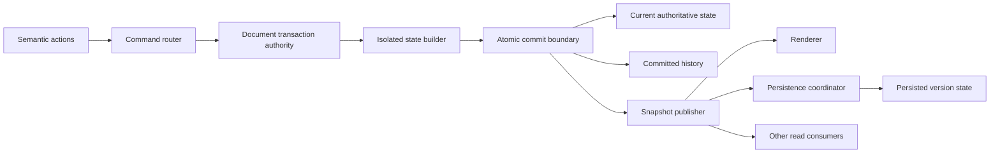
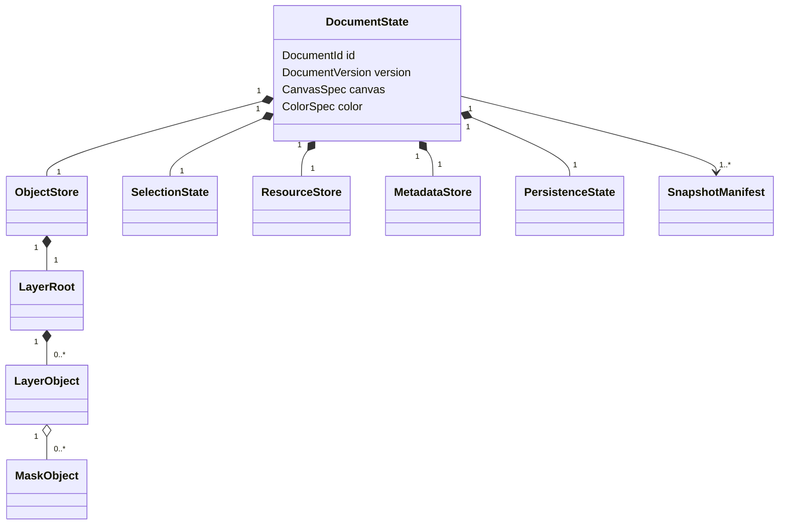
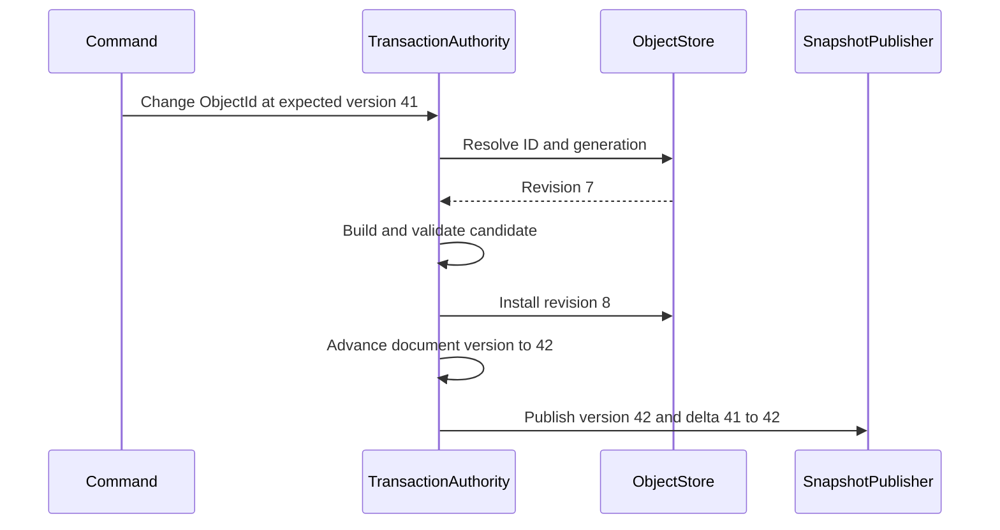
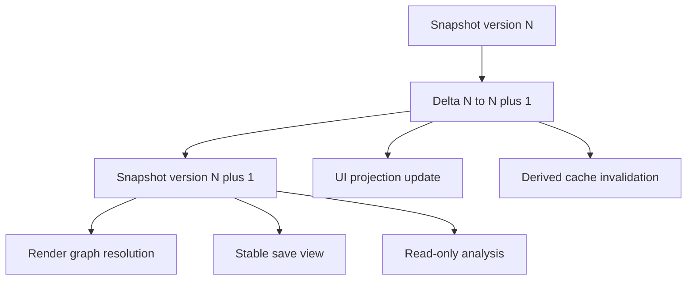
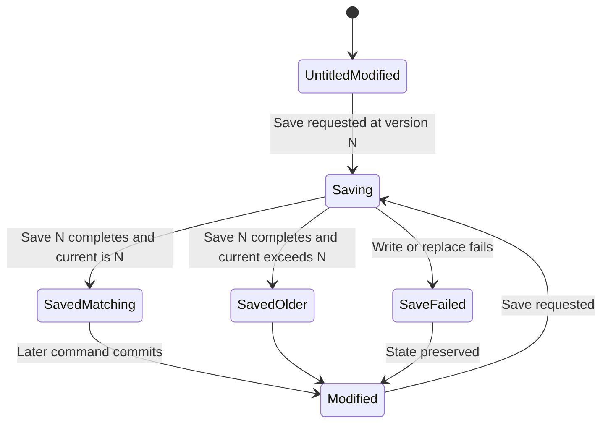
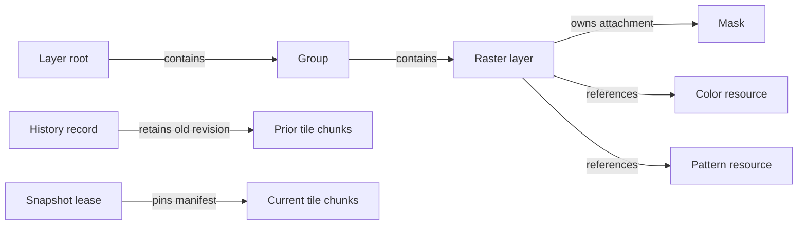
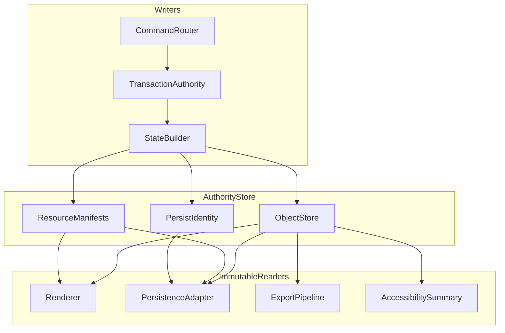

# 10 — Document Model

## Overview

The PhotoTux document model is the authoritative owner of editable image state. It defines identity, containment, raster and non-raster resources, metadata, version evolution, modified state, immutable reader views, and the invariants that every command, history operation, renderer, and persistence adapter must respect. A document is not a window, file path, renderer allocation, panel model, or serialized Rust object graph. It is a versioned semantic aggregate whose current committed state is the sole truth for editing.

Every user-visible document mutation **MUST** enter through the [Command System](08-Command-System.md). A mutating command produces zero or one atomic transaction. Successful commit advances the document version, registers history, updates persistence state, and publishes an immutable snapshot or bounded delta as one observable transition. Failed preparation, validation, or commit **MUST NOT** expose partial state. Rendering, saving, exporting, indexing, and diagnostics consume immutable views; none receives writable authority.

This specification refines the charter in [00 — Introduction](00-Introduction.md), uses the user mental model in [01 — Information Architecture](01-Information-Architecture.md), and uses normative meanings from [Requirement Keywords](Appendix/Requirement-Keywords.md). Canonical terms are defined in the [Glossary](Appendix/Glossary.md).

### Accepted v1 (shipping)

| Contract | v1 reality | Target |
| --- | --- | --- |
| Mutation spine | Named commands via `SessionState::invoke` | Full async job / extension command bus |
| Version / snapshots | Generation + metadata leases ([DR-005](Appendix/Decision-Register.md#dr-005--immutable-render-snapshots)) | Full pixel-immutable snapshot publisher |
| Kinds | Raster, Group, Text, Adjustment, Shape ([DR-027](Appendix/Decision-Register.md#dr-027--graph-kind-set-includes-shape)) | Richer resources / extension opaques |
| Session | Single document ([DR-024](Appendix/Decision-Register.md#dr-024--document-session-model)) | Multi-doc registry |
| Large docs | Full-layer GPU textures | Sparse tiles / pyramid (Phase 5) |

## Responsibilities

The document model **MUST**:

- own one coherent authoritative state for every committed document version;
- assign stable, non-positional identities to document objects and authoritative resources;
- represent canvas geometry, color interpretation, object structure, selections, masks, resources, metadata, and persistence-relevant settings;
- preserve unknown but valid extension or future-schema data without silently interpreting or deleting it;
- separate persistent document properties from workspace, view, renderer, host, and process-local cache state;
- expose mutations only through transaction authority;
- publish immutable, version-tagged snapshots and ordered deltas;
- track current version, persisted editable version, recovery checkpoint, and active save versions independently;
- support documents larger than CPU or GPU memory through sparse, lazy, and externally backed authoritative resources;
- validate containment, references, dimensions, allocation arithmetic, coordinate values, and schema limits;
- remain testable without a window system, GPU, file chooser, or Linux service;
- preserve integrity across cancellation, resource pressure, renderer loss, failed persistence, and process recovery.

The model **SHOULD** use structural sharing, copy-on-write storage, and immutable records where these reduce lock duration and snapshot cost. It **MAY** use internal arenas, persistent collections, tile stores, or generation-indexed tables, but those representations are implementation details rather than persistence schemas or binary interfaces.

The document model does not own UI focus, zoom, panel expansion, clipboard lifetime, GPU texture residency, codec execution, or filesystem authority. It may record document-associated object selection and pixel selection when those states affect semantic editing, persistence, or history. It does not infer mutations from observed UI state.

## Architecture



The transaction authority serializes conflicting mutations for one document. Preparation may run concurrently against a leased snapshot, but final applicability is revalidated at commit. The current state is replaced or advanced at a bounded boundary. History registration and snapshot publication identity are part of the same logical commit even if internal queues deliver notifications later.

### Internal hierarchy

```text
Document aggregate
├── document identity and lifecycle
├── current version and generation registry
├── document properties
│   ├── canvas extent and origin
│   ├── pixel/color interpretation
│   ├── resolution and physical units
│   └── persistence-affecting options
├── object store
│   ├── layer root and layer objects
│   ├── masks and effect nodes
│   ├── text, shape, fill, and reference objects
│   ├── guides and document annotations
│   └── opaque preserved objects
├── authoritative resource store
│   ├── raster tile manifests
│   ├── embedded profiles and fonts
│   ├── gradients, patterns, and palettes
│   └── external-reference descriptors
├── document-associated selection state
├── metadata namespaces
├── history association and checkpoints
├── persistence/save state
├── snapshot and delta publisher
└── invariant and diagnostic services
```

An internal module boundary **MUST NOT** imply independently mutable submodels. A transaction that changes a layer and its tile manifest, for example, commits both under one document version.

## Authoritative Object Graph

The document aggregate consists of records linked by stable IDs. Containment is explicit and acyclic. References that are not containment, such as a fill layer referencing an embedded gradient or a reference layer referencing a local source descriptor, are typed edges with declared ownership and missing-target policy.



The object store is indexed by `ObjectId`, not by presentation row or array offset. Ordered child collections contain IDs plus deterministic order information. Every contained object has exactly one owning document and, except the root, exactly one containment parent. Cross-links may target multiple objects but **MUST** declare whether target absence disables an operation, produces a preserved placeholder, or is invalid.

### Resizing the document (shipped)

Two commands, and they are not the same operation. `document.resize` (Image
Size) resamples every layer and mask to a new pixel size; `document.canvas-size`
(Canvas Size) changes the extent and resamples nothing, placing each layer into
the new extent at an offset and clipping what falls outside.

The offset comes from `CanvasAnchor`, Photoshop's nine-cell grid, and lives in
the engine rather than the shell because it is arithmetic worth testing: a
canvas grown by an odd number of pixels has to land somewhere, and the dialog
and the resize disagreeing about where is the sort of half-pixel drift nobody
notices until an edge is wrong. Centred anchors floor the difference, so
growing by one and shrinking by one anchor consistently.

Both clear the selection — it is in pixel coordinates that no longer describe
the same part of the image — and both record a transform history entry, so one
undo restores the size and the pixels together.

Core conceptual records include:

```rust
struct DocumentState {
    document_id: DocumentId,
    incarnation: DocumentIncarnation,
    version: DocumentVersion,
    schema_generation: SchemaGeneration,
    properties: DocumentProperties,
    objects: ObjectStore,
    resources: ResourceStore,
    selection: SelectionState,
    metadata: MetadataStore,
    persistence: PersistenceState,
}

struct ObjectRecord {
    id: ObjectId,
    generation: ObjectGeneration,
    kind: ObjectKind,
    parent: Option<ObjectId>,
    payload: BoundedObjectPayload,
    references: Vec<TypedReference>,
    revision: ObjectRevision,
}
```

These declarations illustrate semantic fields only. They do not freeze crate boundaries, enum exhaustiveness, memory layout, serialization, allocator choice, or plugin ABI.

## Identity, Generations, and Revisions

`DocumentId` identifies an open or recovered logical document independently of title and path. A newly imported source receives a new document identity unless an explicit recovery operation proves continuity. `DocumentIncarnation` distinguishes repeated openings or reconstructed runtime instances when diagnostics or stale handles need process-local disambiguation.

`ObjectId` is unique within a document identity. IDs **MUST NOT** be derived from child index, object name, memory address, file offset, hash alone, or renderer handle. An ID **MUST NOT** be reused after deletion during the document lifetime. Persistence may preserve IDs across save and reopen. Importers may map source identities to new IDs through a recorded deterministic map.

An `ObjectGeneration` detects stale handles when an internal slot is recycled. Slot reuse is permitted only if the externally stable `ObjectId` changes. A handle therefore contains document identity, object identity, and observed generation. Generation mismatch is a typed stale-reference failure, never permission to target the replacement object.

`DocumentVersion` is a monotonically increasing logical commit number. Undo and redo create newer versions. Versions never decrement and are not wall-clock timestamps. `ObjectRevision` advances when an object’s semantic record changes. `ResourceRevision` advances when authoritative resource meaning changes. Revisions permit precise applicability and cache keys but do not replace the document version that identifies coherent aggregate state.



IDs should use collision-resistant opaque values or document-scoped monotonic allocation with persisted allocator state. Exact bit width and encoding remain deferred. Ordering **MUST NOT** depend on random ID lexical order. Public diagnostics may shorten display forms but retain full identity internally.

## Document Properties and Coordinate Foundation

Document properties define canvas extent, origin, resolution, physical unit interpretation, pixel format capability, working color profile reference, alpha convention, and any document-wide settings that change output. Coordinates use a documented document space independent of viewport zoom or host scale. Finite numeric validation is mandatory. NaN, infinity, overflowed extents, and coordinate products exceeding allocation limits are rejected.

Canvas extent may be finite while layer content extends outside it. Cropping, canvas resizing, and origin changes are distinct commands. Pixel aspect ratio, resolution, and physical size are related but not interchangeable. Changing resolution without resampling changes physical interpretation; resampling changes pixel content and requires a transaction.

Transforms use explicit source and destination spaces. Matrices are validated for finite elements. Non-invertible transforms may be valid for display in limited cases but cannot become editable inverse mappings without declared behavior. No subsystem may infer whether coordinates are document, layer-local, mask-local, normalized, tile, viewport, or device space.

## Resources and Metadata

Authoritative resources are data necessary to preserve document meaning: raster tiles, embedded color profiles, embedded gradients, patterns, palettes, required font data where policy permits, vector paths, and opaque object payloads. Derived thumbnails, mip levels, GPU textures, display conversions, decoded caches, and temporary filter buffers are caches and **MUST** be reconstructible.

Each resource record declares:

- stable `ResourceId` and revision;
- kind and semantic schema version;
- content extent, precision, color/alpha interpretation, and coordinate space where applicable;
- storage disposition: inline, chunked, sparse, embedded blob, local reference, or unavailable placeholder;
- content digest used for validation or sharing, not sole identity;
- byte and element limits;
- ownership and sharing policy;
- persistence requirement;
- missing, stale, and corruption behavior;
- privacy classification for diagnostics.

Resources may share immutable chunks across versions or documents under a content-addressed cache, but document authority **MUST NOT** depend on a cache entry that can be evicted. Unsaved authoritative chunks require owned durable or memory-backed retention. A cache digest collision must not substitute unverified bytes; length and cryptographic digest verification are required where hostile data crosses a trust boundary.

Metadata is partitioned into namespaces: core document metadata, technical image metadata, descriptive user metadata, import provenance, export policy, and preserved opaque metadata. Every namespace declares size limits, encoding, normalization, editability, privacy, persistence, and round-trip policy. Metadata **MUST NOT** execute code, reconstruct filesystem paths, grant capabilities, or control allocation without validation. Unknown metadata should round-trip when safe, but malformed or excessively large data may be quarantined with a loss report.

## Snapshots and Deltas

An immutable snapshot is a coherent view of one document version. Semantic immutability allows structural sharing, lazy chunk mapping, and internally synchronized cache materialization, provided consumers cannot observe semantic changes. A snapshot lease pins only the manifests and authoritative chunks required by its contract, not every possible decoded or GPU representation.

```rust
struct DocumentSnapshot {
    document_id: DocumentId,
    incarnation: DocumentIncarnation,
    version: DocumentVersion,
    schema_generation: SchemaGeneration,
    root: SharedStateRoot,
    resource_manifest: ResourceManifest,
    lease: SnapshotLease,
}

struct DocumentDelta {
    document_id: DocumentId,
    from: DocumentVersion,
    to: DocumentVersion,
    object_changes: Vec<ObjectChange>,
    resource_changes: Vec<ResourceChange>,
    dirty_regions: Vec<DirtyRegion>,
    persistence_effect: PersistenceEffect,
}
```

A delta describes a contiguous version transition and is bounded. It may state that a consumer must reacquire a full snapshot when change volume exceeds a limit. Deltas carry semantic changes separately from renderer invalidation hints. A renderer can ignore hints and recompute correctly; hints cannot alter document meaning.



Snapshot consumers identify their tolerance for lag and lease duration. Renderer presentation may use an older complete version while a new one renders. It **MUST NOT** combine object records from one version with resource manifests from another unless a separately specified progressive contract proves coherence. Event-stream gaps force full resynchronization.

## Dirty State, Save Points, and Persistence Identity

Modified state is not a mutable Boolean. It is derived from current semantic persistence identity and the latest successfully persisted editable state. The persistence record tracks:

- current authoritative version;
- persisted editable version and state fingerprint;
- destination capability identity, if established;
- save operation IDs and captured versions;
- recovery checkpoint version and location token;
- import source provenance, distinct from save destination;
- conversion-loss state;
- last staged-write outcome;
- document format schema version.

Saving captures snapshot version N. Edits may advance current state to N+1 while encoding continues. Successful durable replacement records N as persisted. Modified state remains true because N+1 is current. If the user later undoes to semantic content equal to the persisted state, policy may report unmodified by comparing a stable persistence fingerprint; it must not assume version equality because versions are monotonic.



Staged write and atomic replacement behavior belongs to persistence, but the document model authoritatively accepts a save-point update through a command or internal transition on the same mutation spine. A save adapter cannot clear dirty state directly. Save destination paths or host file handles are capabilities outside portable document semantics; only safe persistence identity metadata enters the model.

## Workflows

### Create a document

1. Presentation collects bounded canvas and color parameters.
2. `document.create` validates dimensions, precision, profile, background, and budgets.
3. Builder allocates document identity, root object, initial layer if requested, empty selection, metadata stores, and version zero or first committed version according to policy.
4. Registration exposes the document only after all invariants pass.
5. Initial snapshot is published.
6. Workspace creates a view separately; view creation cannot alter document content.
7. Untitled document is modified until an editable save establishes a persisted state.

### Apply a raster edit

1. Tool previews against snapshot N without mutation.
2. Gesture completion submits a command naming document, active edit surface, object ID, expected revision, affected bounds, and bounded stroke data.
3. Worker prepares changed tiles outside authority using immutable source chunks.
4. Commit revalidates object existence, generation, revision, lock, and resource budget.
5. Transaction installs new tile manifest and object/resource revisions.
6. History receives forward/inverse resource references.
7. Version N+1 and dirty regions publish atomically.
8. Renderer requests new tiles; dirty state derives from persistence comparison.

### Delete and restore an object

Deletion removes containment and active semantic references in one transaction. History retains the object record and required authoritative resources under budget. Object ID remains retired from new allocation. Undo creates a newer version and restores the same object ID when no invariant conflict exists. If current graph evolution makes original placement invalid, undo **MUST** fail atomically or use an explicitly defined safe placement policy; it cannot silently restore under another parent.

### Save while editing

The save coordinator leases snapshot 120 and encodes it. Painting commits versions 121 through 126. Persistence durably replaces the destination with version 120 and submits save-point completion. The document records persisted version 120, current 126, and modified true. A subsequent save may reuse unchanged chunks but must capture one coherent later snapshot.

### Reopen and migrate

Decoder validates header, limits, chunk graph, identities, and schema versions into a quarantine representation. Migrations are pure or transaction-like transformations with explicit input/output schema. Unknown supported objects remain opaque. Only a coherent validated state enters document registry. Runtime IDs preserved by format remain stable; malformed duplicate IDs reject or undergo a documented deterministic remap before visibility.

## Object Relationships and Contracts

Containment edges define lifetime and traversal. Typed reference edges define dependencies without ownership. An object cannot be contained twice. Deleting an owner either deletes owned descendants, detaches them through explicit command semantics, or rejects; behavior is object-kind-specific and previewed.

The layer root owns top-level compositing objects. Layers may own masks and effects. Resources can be referenced by multiple objects. Selection state may reference active selection channels but does not own layer objects. Metadata may refer to object IDs only through typed, validated links. History references prior resources through retention leases, not current object ownership.



Contracts are explicit: object lookup returns found, absent, stale generation, wrong document, wrong kind, or preserved-opaque status. No API returns a mutable optional pointer whose validity extends across a command boundary.

## Invariants

- One document identity has exactly one current authoritative state per incarnation.
- Current document version advances monotonically for every committed mutation, including undo and redo.
- Failed or cancelled pre-commit work does not advance version.
- Every live object has one stable ID, one generation, one kind, and one owning document.
- Deleted IDs are not reassigned to unrelated objects during the document lifetime.
- Containment forms an acyclic rooted hierarchy; every non-root contained object has one parent.
- Typed references either resolve to compatible targets or satisfy their declared missing-target policy.
- Object and resource revisions correspond to semantic change, not cache materialization.
- Snapshot version, root, resource manifest, and metadata are coherent.
- Derived caches can be discarded without losing unsaved edits.
- Current state and persisted editable state are tracked independently.
- Workspace or view changes do not alter modified state.
- Unknown preserved data is not silently dropped during an otherwise lossless save.
- External file, extension, and host handles never become ambient authority inside the model.
- All counts, dimensions, offsets, strides, and byte calculations use checked arithmetic and configured limits.

Invariant validation runs on candidate commit and on untrusted load. Expensive whole-graph checks may be sampled in release builds but **MUST** remain available in diagnostic and test configurations. Local checks cannot replace full validation at trust boundaries.

## Memory and Concurrency

Authoritative memory is budgeted separately from reconstructible caches, history retention, snapshot leases, and prepared command data. Budget accounting reports logical bytes, resident CPU bytes, mapped bytes, temporary bytes, and retained history bytes without double-counting shared chunks. Eviction order favors speculative and derived data. Unsaved authoritative content is never evicted unless durably spilled to an owned local recovery store with integrity validation.

Per-document mutation authority serializes commits. Read consumers use immutable snapshots without holding mutation locks. Snapshot creation should be proportional to changed structure, not total document pixels. Long-lived readers receive lease deadlines or budget pressure callbacks; critical saves may retain stable views longer than thumbnails. A consumer that exceeds policy may be cancelled or forced to reacquire, but a committed document remains valid.

Worker results carry source document identity, version, object generations/revisions, resource digests, and applicability predicates. Results never apply by “latest pointer.” Locks are not held across filesystem I/O, GPU submission, shader compilation, codec calls, host callbacks, or extension execution.

wgpu resources are derived. A tile upload may correspond to resource revision R and snapshot version V, but device loss only discards that representation. CPU-authoritative or recoverable chunks remain owned by the document/resource system. The model does not choose a final async runtime, executor topology, tile dimension, or Rust crate arrangement.

## Failure, Cancellation, and Recovery

Builder allocation failure abandons the candidate and releases provisional chunks. Reference validation failure returns a typed error with unchanged version. Snapshot delivery failure after commit marks affected consumers for full resynchronization; it does not roll back an observed transaction. Invariant failure freezes further mutation for the document, captures bounded local diagnostics, and offers save-copy or recovery only when safe.

Cancellation before commit leaves no authoritative effects. Once authoritative replacement begins, cancellation cannot split commit. A cancellation arriving after the boundary receives committed status; reversal is a later undo command. Background decoding, filtering, and snapshot materialization check cancellation at bounded intervals and release leases idempotently.

Recovery journals or checkpoints contain versioned, integrity-checked state sufficient to reconstruct committed edits under configured policy. They are local, access-restricted, and not equivalent to a user-confirmed save. Recovery never silently overwrites the original destination. On startup, recovered content receives clear provenance and modified state until user saves.

Corrupt authoritative chunks discovered after opening isolate affected resources. If a verified prior chunk or recovery checkpoint exists, restoration occurs only through an explicit repair command and history record. Otherwise the document enters degraded read-only or partially inspectable state. Fabricating pixels without disclosure is forbidden.

## Persistence, Security, and Accessibility

Serialized schemas are independent from Rust layout. They have explicit versions, bounded nesting, deterministic identity encoding, chunk lengths, checksums, and migration rules. Unknown required semantics reject opening; unknown optional objects use opaque placeholders when safe. Saves use a stable snapshot and report conversion loss before replacing destinations.

Documents and metadata are private local data. Diagnostics redact names, paths, metadata values, thumbnails, pixel samples, and content hashes unless the user explicitly includes them. Importers validate duplicate IDs, recursive graphs, decompression ratios, malformed profiles, text lengths, and integer products. External references do not auto-open arbitrary paths. Host adapters supply scoped capabilities.

Accessibility consumers need a semantic summary of document title, dimensions, color mode, modified state, active edit target, layer count, selection bounds, and operation status. The document model exposes structured values; presentation supplies localized names and roles. Pixel content is not dumped into accessibility events. Updates are coalesced by committed version, and sensitive metadata is not announced without user navigation.

## Design Rationale, Alternatives, and Tradeoffs
**Authoritative aggregate versus independently mutable subsystems.** Independent layer, selection, and metadata stores appear modular but permit cross-store partial state. Aggregate transaction authority costs coordination but protects atomic semantic edits.

**Stable IDs versus positional indices.** Indices are compact and cache-friendly but break under reorder, asynchronous results, undo, and multi-view selection. Stable IDs plus internal slot generations preserve correctness while permitting optimized storage.

**Monotonic versions versus history cursor versions.** Reusing old version numbers after undo confuses caches and async jobs. Monotonic evolution makes causality explicit; semantic fingerprints handle equality with save points.

**Transactions and sharing versus whole-document copies.** Whole copies simplify isolation but exceed practical memory for large raster documents. Persistent manifests and reversible deltas add complexity while keeping changed-data cost bounded.

**Embedded-only resources versus references.** Embedding maximizes portability but increases size and may conflict with licensing or user intent. References reduce duplication but can become stale. Explicit disposition and missing-resource policy support both without hidden network or ambient filesystem access.

**Opaque preservation versus eager rejection.** Rejecting every unknown object prevents accidental loss but harms forward compatibility. Opaque preservation permits round-trip when containment, size, and safety can be validated; unknown semantics affecting core invariants still require rejection.

## Rejected Alternatives

- UI view models as document truth: rejected because multiple views, headless tests, history, and persistence require independent authority.
- GPU textures as authoritative pixels: rejected because device loss, budget eviction, and cross-device behavior would threaten edits.
- File path as document identity: rejected because untitled, Save As, moved files, portals, and duplicate views invalidate the assumption.
- Mutable references shared across threads: rejected because lifetime and commit boundaries become unverifiable.
- Global process version counter: rejected because document-local scheduling and recovery need independent evolution.
- Unbounded metadata maps: rejected because hostile files can force memory exhaustion and ambiguous persistence.
- Hash-only resource identity: rejected because collisions, mutable references, and policy identity differ from content equality.
- Silent schema flattening: rejected because loss of editability violates document integrity.

## Best Practices

- Keep semantic records small and move bulk bytes into versioned resource chunks.
- Include coordinate space, color interpretation, alpha convention, precision, and bounds in every raster contract.
- Make ID allocation deterministic in tests and collision-safe in production.
- Separate object revision from document version and cache generation.
- Publish deltas only after latest full snapshot is resolvable.
- Use fingerprints for persistence equality, never for unvalidated authority.
- Treat zero-area canvases, empty selections, missing optional resources, and off-canvas content as explicit valid or invalid cases.
- Fuzz graph loading, identity maps, arithmetic, metadata nesting, and migration.
- Test snapshot lease pressure and event-stream gaps.
- Keep diagnostic IDs useful without exposing content.

## Future Extensibility

The object store may add deterministic procedural layers, richer vector/text structures, new mask kinds, animation-related state, or locally installed extension objects. New kinds **MUST** define containment, references, persistence, bounds, coordinate spaces, snapshot behavior, history reversibility, security limits, and fallback representation before adoption.

Additional desktop hosts may implement the same portable document contract. Alternate storage engines may replace current structures if they preserve IDs, versions, snapshots, deltas, and failure semantics. Stable plugin ABI, final file format, exact tile geometry, UI toolkit, and async runtime remain deferred. Extensibility is a semantic contract, not permission to expose mutable Rust internals.

## Testability and Diagnostics

Headless fixtures construct documents through commands, serialize stable snapshots, and compare semantic state independent of memory addresses and collection hash order. Property tests generate valid and invalid graphs, apply command sequences, undo/redo, and assert invariants after every commit. Model checking should explore commit/cancel/save races with a controlled scheduler.

Diagnostics record document/incarnation IDs, versions, object counts, revision transitions, snapshot lease counts, authoritative and cache bytes, transaction correlation, dirty-region counts, save-point transitions, and invariant codes. They omit content by default. Snapshot dumps used in tests have deterministic ordering and explicit redaction.

Failure injection points cover ID allocation, chunk allocation, builder finalization, history retention, state installation, event publication, recovery scheduling, and save-point update. A test must distinguish failure before and after observable commit.

## Deterministic Acceptance Scenarios

### Stable identity through reorder

Create three layers with IDs A, B, and C. Reorder C before A. Assert names and panel rows change order, IDs and generations do not change, document version advances once, and a stale row index cannot target the prior occupant. Undo restores order under a newer version while retaining IDs.

### Save race

Capture snapshot version 10 for save, then commit edits producing versions 11 and 12. Complete durable save of 10. Assert persisted version is 10, current version is 12, modified state remains true, snapshot 10 remains coherent, and no later tiles appear in saved output.

### Cancelled raster preparation

Start a tile edit at version 20, allocate provisional changed chunks, then cancel before commit. Assert version, object revision, resource manifest, history, and modified state are unchanged; provisional chunks and leases reach zero.

### Snapshot stream gap

Commit versions 31, 32, and 33 while forcing a consumer to miss delta 31-to-32. Assert it rejects delta 32-to-33, reacquires full snapshot 33, and never combines manifests from different versions.

### Duplicate hostile identities

Decode a file containing two object records with the same persisted ID under different parents. Assert the file does not enter the visible registry until policy either rejects it or completes a deterministic documented remap. No object becomes ambiguously addressable.

### Device loss

Render version 50, discard all GPU resources, and reconstruct renderer from snapshot 50. Assert authoritative bytes, history, modified state, and object revisions remain unchanged; reconstructed output matches CPU/reference tolerance.

### Semantic return to save point

Save state S at version 60, commit opacity change at 61, and undo at 62. If persistence fingerprint policy is enabled, assert modified state becomes false because semantic persisted state matches S while version remains 62. If policy is disabled, assert conservative modified state remains true; behavior must be declared and consistent.

### Recovery checkpoint

Commit through version 75, persist recovery checkpoint 74, then simulate process loss before checkpoint 75. Reopen recovery. Assert restored state identifies version/provenance, never claims user-confirmed save, remains modified, and original destination is untouched.

## Extended Invariants and Neighbor Contracts

This section deepens the document-model contract for implementers who must keep layer, selection, mask, brush, filter, color, and render subsystems mutually consistent under cancellation, device loss, and persistence races. It does not redefine earlier sections; it states additional invariants, edge cases, CPU/GPU boundaries, concurrency rules, persistence obligations, and acceptance scenarios that close residual ambiguity.

### Aggregate invariants under multi-consumer pressure

The document aggregate **MUST** remain the only writer of authoritative object, resource, selection, and persistence-identity state. Concurrent readers may hold immutable snapshot leases for rendering, export, save, indexing, accessibility, and diagnostics. Lease holders **MUST NOT** promote cached or GPU-resident bytes into authority. When a lease expires because retention policy discards an old snapshot, consumers **MUST** reacquire a newer full snapshot rather than stitching orphaned deltas onto an expired base.

Within one incarnation, document versions advance strictly monotonically. Object revisions advance when that object’s semantic record or owned resource manifest changes. Cache generations, GPU texture generations, and view overlay generations **MUST NOT** be stored as document versions or object revisions. A reader that confuses these counters **MUST** be treated as defective, not as a migration problem.

Identity invariants remain absolute under reorder, kind-preserving edits, undo that restores prior semantics under a newer version, save/reopen, recovery reopen, and clipboard round-trip within the same document incarnation. Positional indices, panel row numbers, and z-order ranks are projections. Commands address objects by stable ID and generation where generation is required to detect reuse after deletion. Deleted IDs **MUST NOT** be reused within an incarnation.

Resource chunks carry content digests for integrity and deduplication hints, but authority remains the manifest that binds object IDs to chunk IDs under a version. Two documents may share identical chunk bytes without sharing identity. Cross-document paste **MUST** allocate fresh object IDs and, when policy requires isolation, fresh chunk IDs even if digests match.

### Edge cases in canvas, emptiness, and sparse authority

Zero-area canvases are invalid for ordinary editable documents and **MUST** be rejected before registration. Empty layer stacks are valid: a document may open with only a root and no user layers. Empty pixel selections, unrestricted selections, and absent selection channels remain distinct as defined by the selection system; the document model stores their declared states without collapsing them.

Sparse raster authority may omit tiles whose effective content is transparent under the declared alpha convention. Consumers **MUST** treat missing tiles as explicit empty coverage for that space, not as unknown. Off-canvas content that remains addressable through transforms **MUST** remain reachable by ID even when bounds fall outside the canvas rectangle, subject to configured extent limits. Arithmetic that expands dirty regions, selection extents, or mask bounds **MUST** use checked integer products and reject overflow before allocation.

Unknown optional objects may round-trip as opaque placeholders when containment, size, and safety validate. Unknown required semantics that affect compositing, color interpretation, or history reversibility **MUST** reject open or mark the affected subtree unavailable without inventing substitute pixels. Silence is forbidden: every rejection or unavailable state exposes a typed diagnostic code.

### Failure modes before and after commit

Preparation failures leave the prior authoritative state, history cursor association, modified fingerprint inputs, and published snapshot identity unchanged. Failures include ID exhaustion under hostile input, chunk allocation refusal, invariant violation in the builder, history retention refusal, and cancelation. Provisional resources allocated during preparation **MUST** reach zero outstanding leases after failure.

Commit installation is atomic with respect to observable readers. If installation succeeds and subsequent notification delivery fails, the transaction remains committed; consumers detect the gap through version discontinuity and reacquire. The document model **MUST NOT** roll back a completed install because a renderer or panel missed an event.

Recovery checkpoints are not user-confirmed saves. Restoring a recovery checkpoint **MUST** identify provenance, keep modified state true unless an explicit policy proves semantic equality with a confirmed save point, and leave the original destination file untouched. A failed save of version N while the live document is at version N+k **MUST** leave persisted version unchanged and current version at N+k.

### CPU and GPU boundaries

CPU-side authoritative bytes and manifests are the recovery floor. GPU textures, staging buffers, and pipeline caches are disposable projections keyed by snapshot version, object revision, color contract, and device generation. Device loss **MUST** discard GPU resources without mutating document authority, history, or modified state. Reconstruction reads immutable snapshots and rebuilds caches; it never invents tiles absent from authority.

Headless tests **MUST** exercise create, mutate, snapshot, save, reopen, undo, redo, cancel, and recover paths with no window system and no GPU. Any code path that requires a surface for correctness of the document model is non-conformant.

### Concurrency and scheduling contracts

Conflicting mutations for one document serialize at the transaction authority. Asynchronous preparation may run on worker pools against leased snapshots. Applicability at commit revalidates target revisions, selection revisions, resource manifests, and schema versions. Stale preparation results **MUST** be rejected without side effects.

Snapshot publication may deliver full snapshots and ordered deltas. Consumers that miss a delta **MUST** reject subsequent deltas that do not chain from their base and reacquire a full snapshot. Save operations capture a stable snapshot version and **MUST NOT** observe later commits as part of that save’s byte stream.

Backpressure applies to provisional allocation and snapshot lease counts. When budgets refuse new leases, commands fail with typed resource pressure before corrupting authority. The model **MAY** prefer canceling disposable render work over refusing user edits, but it **MUST NOT** evict unsaved authoritative chunks to satisfy GPU cache pressure.

### Persistence identity and neighboring subsystem contracts

Persistence adapters consume immutable snapshots. They never hold writable document handles. Layer, selection, and mask subsystems contribute records through the aggregate; they do not open independent write transactions against the file. Brush and filter engines prepare candidate resource manifests that become authoritative only at document commit. Color management supplies profile resources and interpretation records stored as document resources; display profile changes remain outside persistence identity. The rendering engine reads snapshots and dirty deltas; its caches are not save inputs.

Clipboard transfer packages object subgraphs with resource closure under fresh IDs when entering another document. History stores reversible transactions keyed by document version ranges. Accessibility reads structured summaries coalesced by committed version and **MUST NOT** receive raw pixel dumps as ordinary events.



### Additional acceptance scenarios

#### Lease expiry mid-export

Acquire snapshot lease at version 40 for export. Commit versions 41 and 42 while retention drops version 40. Assert export either completes solely from retained leased bytes captured at acquire time or fails with typed lease-loss; it never mixes version 40 manifests with version 42 tiles. Document authority remains at 42.

#### Metadata namespace collision

Import a file that declares two persistence-affecting metadata keys with identical names under different namespaces and one hostile nested map exceeding depth limits. Assert depth rejection occurs before registration, no partial metadata appears in the visible registry, and diagnostics omit values while reporting namespace and depth codes.

#### Cross-subsystem atomic paint

Commit a brush segment that updates raster tiles, dirties a layer revision, and intersects an active selection revision in one transaction. Assert one document version, one history registration, matching layer and resource revisions, and that cancelation before commit restores all three domains to the prior snapshot.

#### Fingerprint policy toggle stability

With persistence fingerprint policy enabled, save, edit, undo to semantic equality, and assert modified becomes false while version advanced. Disable policy in a new incarnation, repeat the sequence, and assert modified remains true. Behavior differences are declared; neither path rewrites history versions backward.

#### Opaque extension round-trip under save race

Preserve an unknown optional extension object through edits that do not touch it. Start save of version 15, commit version 16 that still preserves the opaque object, complete save of 15. Reopen the saved file and assert the opaque object survives with validated bounds; live document remains at 16 with the same opaque bytes until subsequent explicit conversion.

### Neighbor contract checklist

- Command system: sole mutation entry; document never observes UI models as writers.
- Layer system: containment and kind records live in the object store; compositor inputs are derived.
- Selection system: document-associated channels persist when format support claims them; overlays do not.
- Mask system: attachments are ordinary objects with typed edges; cycles reject pre-commit.
- Brush and filter engines: provisional chunks become authoritative only at commit.
- Color management: embedded profiles are resources; display context is not.
- Rendering engine: disposable caches keyed by snapshot identity; never authoritative.
- History: transactions correlate to versions; undo creates newer versions with restored semantics.
- Persistence and recovery: independent version lanes for current, persisted, recovery, and in-flight save.

## Acceptance Criteria

- Every document mutation is traceable to one command and zero or one committed transaction.
- Stable IDs survive reorder, property edits, snapshots, save/reopen, and valid undo restoration.
- Document versions never decrement or repeat within an incarnation.
- Current, persisted, recovery, and in-flight save versions remain independently observable.
- Snapshots are coherent under concurrent edit and save.
- Cache or GPU eviction cannot lose unsaved authoritative content.
- Unknown safe data round-trips; unknown unsafe semantics reject explicitly.
- Untrusted graphs cannot exceed configured dimensions, depth, count, or bytes through unchecked arithmetic.
- Headless tests create, edit, snapshot, save, reopen, undo, redo, cancel, and recover without UI or GPU dependencies.

## Cross References

- [00 — Introduction and System Charter](00-Introduction.md) — product boundaries and foundation invariants.
- [01 — Information Architecture](01-Information-Architecture.md) — document, view, selection, and active-target mental model.
- [08 — Command System](08-Command-System.md) — sole mutation, transaction, scheduling, and publication contracts.
- [11 — Layer System](11-Layer-System.md) — heterogeneous object hierarchy and compositing ownership.
- [12 — Selection System](12-Selection-System.md) — document-associated selection channels.
- [13 — Mask System](13-Mask-System.md) — attached scalar coverage objects.
- [20 — History and Undo](20-History-Undo.md) — transaction retention, checkpoints, and traversal.
- [21 — Clipboard](21-Clipboard.md) — rich payload identity and cross-document transfer.
- [Glossary](Appendix/Glossary.md) — canonical terminology.
- [Requirement Keywords](Appendix/Requirement-Keywords.md) — normative interpretation.
- [Cross-Reference Index](Appendix/Cross-Reference-Index.md) — handbook dependency map; its planned numbering predates this specification set.
- Downstream: `24-Persistence-and-Recovery.md`.
- Downstream: `31-Performance-and-Concurrency.md`.
