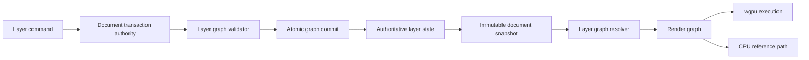
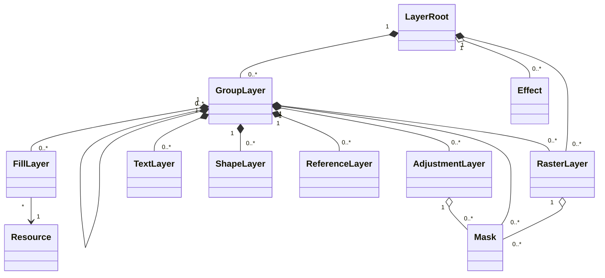
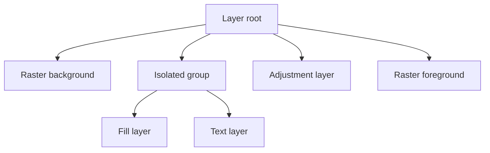
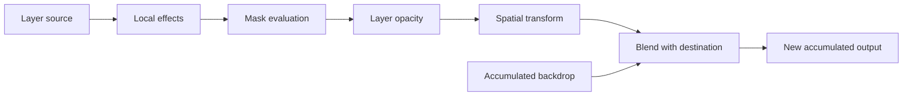
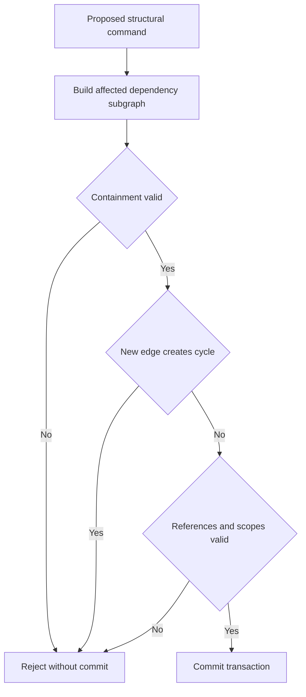
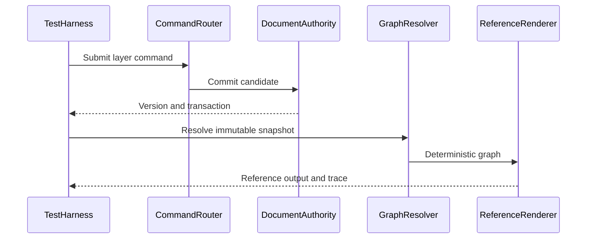
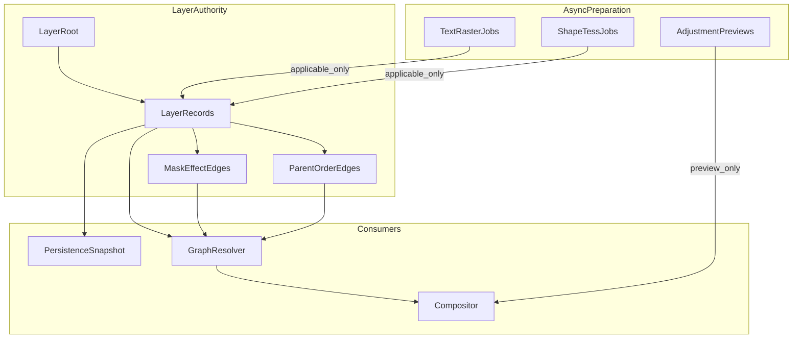

# 11 — Layer System

## Overview

The PhotoTux layer system defines the heterogeneous, ordered document structure evaluated into visible image content. It supports groups, raster layers, adjustment layers, fill layers, text layers, shape layers, and local reference layers without treating all kinds as mutable pixel buffers. Layers are authoritative document objects. Panels present them, tools target them, and the renderer evaluates immutable snapshots of them; none of those consumers owns layer truth.

Every structural or semantic layer mutation **MUST** use the [Command System](08-Command-System.md) and commit through the [Document Model](10-Document-Model.md). Reorder, create, delete, rename, set opacity, set blend mode, transform, attach a mask, edit text, update a fill, or replace raster content are commands. Rendering never repairs or mutates an invalid graph. A command candidate that would introduce a containment or evaluation cycle **MUST** be rejected before commit.

Normative terms follow [Requirement Keywords](Appendix/Requirement-Keywords.md), and vocabulary follows the [Glossary](Appendix/Glossary.md). This document specifies semantic contracts, not final Rust types, serialized format, UI toolkit, plugin ABI, tile size, or exact wgpu pipeline layout.

## Responsibilities

The layer system **MUST**:

- maintain one rooted, ordered, acyclic containment hierarchy;
- provide stable IDs independent of row, index, name, or allocation address;
- represent heterogeneous layer kinds through explicit bounded schemas;
- define compositing order, visibility, opacity, blend mode, isolation, clipping, transforms, masks, and effects;
- distinguish source content, editable parameters, derived rasterization, and cached render output;
- preserve layer editability unless an explicit destructive command rasterizes, merges, or flattens it;
- expose an unambiguous active edit surface distinct from object selection and focus;
- prevent cycles across containment, clipping, effect, reference, and dependency edges;
- publish precise object and spatial deltas after commit;
- remain valid when resources are missing, renderer devices are lost, or optional extension kinds are unavailable;
- support large sparse raster content and lazy non-raster evaluation under memory budgets;
- provide headless validation and deterministic evaluation fixtures.

The system **SHOULD** preserve source precision and parameters across ordinary edits. It **MAY** cache intermediate composites or rasterized forms, but caches are reconstructible and cannot become document authority.

## Architecture



Layer semantics live in the portable core. Linux adapters present rows, menus, drag targets, accessibility nodes, and native input, then submit semantic commands. Toolkit objects and platform handles **MUST NOT** enter layer records.

### Internal hierarchy

```text
Layer subsystem
├── layer root
├── ordered containment store
├── common layer properties
│   ├── identity and name
│   ├── visibility and locks
│   ├── opacity and blend mode
│   ├── transform and bounds
│   └── clipping/isolation policy
├── kind payloads
│   ├── raster source
│   ├── adjustment operation
│   ├── fill definition
│   ├── text structure
│   ├── shape structure
│   ├── local reference descriptor
│   ├── group policy
│   └── opaque preserved kind
├── mask/effect attachments
├── dependency graph and cycle detector
├── compositing resolver
├── snapshot/delta projection
└── validation and diagnostics
```

## Object Model

```rust
struct LayerRecord {
    id: ObjectId,
    generation: ObjectGeneration,
    revision: ObjectRevision,
    parent: ObjectId,
    order: OrderKey,
    common: LayerCommon,
    kind: LayerKindPayload,
    masks: Vec<ObjectId>,
    effects: Vec<ObjectId>,
}

struct LayerCommon {
    name: BoundedText,
    visible: bool,
    opacity: UnitInterval,
    blend_mode: BlendModeId,
    transform: Transform2D,
    locks: LayerLocks,
    clipping: ClippingPolicy,
    isolation: IsolationPolicy,
}
```

This conceptual shape is not an ABI. `LayerKindPayload` is versioned and bounded. Common properties exist only when semantics apply; an unsupported property command returns a typed rejection rather than silently storing an ignored value.



The class diagram illustrates allowed examples, not an exhaustive restriction. Any layer kind may accept masks or effects only when its capability descriptor says so.

## Root, Ordering, and Groups

Every document has exactly one synthetic layer root. It is not ordinarily deletable, reorderable, paintable, or persisted as a user-created layer. Top-level layers are its ordered children. Visual stacking uses an explicit canonical order; presentation may show topmost first, but APIs and persistence **MUST** state orientation.

Order keys are deterministic and independent of transient row indices. Implementations may use vectors, fractional keys, trees, or sequence labels. Rebalancing order keys must not change user-visible order or layer IDs. A reorder transaction validates source set, target parent, insertion location, locks, and cycle constraints atomically.

Groups contain ordered children and contribute one evaluated result to their parent. A group declares compositing policy:

- **isolated:** children composite into an intermediate transparent surface, then group opacity, mask, transform, and blend apply once;
- **pass-through:** eligible child contributions participate in parent context while group visibility, masks, clipping, and adjustments obey defined propagation;
- **bounded or unbounded extent:** output bounds derive from child/effect union or an explicit clip;
- **collapsed presentation:** view-only and never changes evaluation.

Pass-through is not “skip the group.” Resolver expands semantics while retaining group masks, visibility, locks, and effect scope. Unsupported combinations must be rejected or normalized through a documented command, never guessed by renderer.



Compositing traverses canonical bottom-to-top order. Hidden subtrees may be skipped only if no semantic side effect exists; layer evaluation must be pure, so skipping affects performance only.

## Layer Kind Semantics

### Raster layers

A raster layer references an authoritative sparse pixel resource plus format, extent, local origin, color interpretation, alpha convention, and optional content bounds. Painting changes resource manifests and layer revision through transactions. Transparent pixels may retain color according to declared storage semantics. A raster layer is paintable only when unlocked, supported, materialized, and selected as active edit surface.

Transforms remain nondestructive by default. A destructive transform resamples pixels into a new authoritative resource and resets or composes transform according to explicit command semantics. “Apply Transform” and “Set Transform” are distinct commands.

### Adjustment layers

An adjustment layer stores a deterministic operation descriptor and parameters. It consumes a defined input scope and emits transformed output without owning source pixels. Scope may be all eligible content below within the parent, a clipped base, or an explicit bounded group, but it cannot be an arbitrary hidden back-reference.

Parameters declare types, units, ranges, color space, edge behavior, precision, deterministic expectations, and CPU/reference availability. Preview uses isolated parameters; commit updates the descriptor once. Missing operation implementation preserves the record and displays an unavailable placeholder rather than flattening it.

### Fill layers

A fill layer generates local deterministic content from a bounded definition: solid color, gradient, pattern, or other declared procedural source. It records coordinate space, transform, repeat/edge mode, profile interpretation, seed where randomness is deterministic, and resource references. It does not store a full raster unless explicitly rasterized.

Resource changes invalidate dependent fill output by resource revision. Application-global resource edits do not silently change embedded document output; a layer references either a pinned embedded resource revision or an explicit local linked resource policy.

### Text layers

A text layer owns text content, spans, paragraph structure, layout bounds, shaping inputs, transform, and font references or preserved fallback information. Text remains editable. Rendering may cache glyph runs and raster tiles, but those are derived.

Font substitution is visible and does not mutate authoritative style unless user accepts a command. Text content has bounded length and normalization policy. Bidirectional ordering, grapheme boundaries, script shaping, vertical layout if supported, and accessibility text representation are semantic concerns. Rasterize Text is destructive and produces a raster layer through one transaction while preserving history data under budget.

### Shape layers

A shape layer owns vector paths, geometry primitives, boolean structure, stroke/fill styles, winding rule, transform, and resource references. Paths use finite document or layer-local coordinates. Boolean results may be cached, but source paths remain authoritative. Open and closed subpaths, stroke alignment, joins, caps, dashes, antialiasing, and fill rule must be explicit.

Editing control points changes vector records, not cached pixels. Converting to raster, expanding a stroke, or resolving boolean geometry is an explicit command with previewed loss of editability.

### Reference layers

A reference layer points to a user-authorized local source or embedded snapshot through a capability-safe descriptor. It never grants ambient path access and never requires network services. Policy distinguishes:

- embedded immutable content;
- local linked content with explicit refresh;
- linked content pinned to a verified source fingerprint;
- unavailable placeholder retaining transform and metadata.

Refresh is a command. Filesystem change detection may offer refresh but cannot mutate the document automatically. Cross-document live references are not supported unless a future coordinator defines lifetime, cycle, save, and recovery semantics. Reference layers cannot form dependency cycles through source documents.

### Opaque preserved layers

Unknown optional layer kinds may be retained as bounded opaque records with preview or fallback image when available. They are not editable by core and cannot inject executable behavior. Their containment and declared bounds must validate. Saving must preserve opaque bytes exactly or disclose inability before replacement.

## Blend, Opacity, Alpha, and Precision

Opacity is a finite normalized scalar with defined clamping at command validation. It is applied at a specified stage after source generation, local masks/effects as defined, and before or during blending according to compositing contract. A 0-opacity layer contributes no visible color but remains present, editable, and serializable.

Blend mode descriptors define source/destination input spaces, premultiplication expectations, channel function, alpha equation, range behavior, NaN handling, precision floor, and fallback. IDs are stable semantic identifiers, not UI labels or shader function names. Unknown modes preserve the layer but render a disclosed fallback or unavailable state; they are never silently replaced in authoritative data.



Actual effect/mask/transform ordering can vary by declared attachment semantics, but one resolved order is part of snapshot meaning. Color-space conversions are explicit render nodes. Intermediate precision should prevent avoidable clipping. CPU reference and wgpu paths compare under documented tolerances.

## Transforms and Coordinate Spaces

Each layer has a local coordinate space and a transform into parent space. The composed transform into document space is derived from ancestors. View transforms are separate. Masks may use layer-local, parent, or document space as defined in [13 — Mask System](13-Mask-System.md).

Transform records state matrix convention, pivot semantics, interpolation policy when rasterized, and bounds behavior. Matrices contain finite values. Perspective or non-affine transforms require a separate supported representation rather than overloading affine fields. Singular transforms may remain as nondestructive states when rendering defines them, but commands requiring inverse mapping reject with a precise reason.

Changing parent normally preserves either local transform or document-space appearance according to explicit command parameter. Drag-and-drop presentation must state which policy applies. Reparent preserving appearance computes a new local transform transactionally and rejects numeric instability.

## Clipping, Isolation, Effects, and Masks

Clipping chains associate one or more layers with a valid base in the same compositing context. They do not create containment. Chain rules define base eligibility, order, alpha source, group boundaries, hidden-base behavior, and reordering consequences. Removing or moving the base either breaks the chain through explicit transaction effects or rejects if command scope did not authorize that change.

Effects are ordered attachments or adjustment nodes with explicit input scope. Masks are separate objects attached at declared slots. Attachment order is stable and visible. Applying a mask destructively, deleting it, disabling it, and unlinking its transform are distinct commands.

Isolation creates intermediate surfaces and impacts blend results and memory. Resolver computes minimum bounds where possible and tiles larger intermediates. Isolation flags are document semantics, not renderer optimization hints.

## Cycle Prevention

Containment alone must be a tree. Evaluation dependencies form a directed graph containing group expansion, clipping bases, effect inputs, resource dependencies, and reference sources. Before commit, validator checks proposed graph. Adding edge U→V is invalid if V reaches U under dependency classes that require acyclicity.



Incremental topological indexes may optimize checks, but a full deterministic validator remains available. Depth limits protect stack and memory. Renderer detecting a cycle indicates invariant failure; it stops affected evaluation and reports diagnostics rather than choosing an arbitrary break edge.

## Workflows

### Create and paint raster layer

1. `layer.create-raster` resolves target document, parent, insertion anchor, format, name, and initial extent.
2. Command validates parent capability and budgets.
3. Transaction creates stable layer/resource IDs and inserts one child.
4. User activates raster edit surface through semantic action.
5. Brush gesture previews against snapshot.
6. Commit replaces changed resource chunks, advances revisions/version, and records history.
7. Renderer consumes delta; layer panel follows IDs rather than rows.

### Reorder multiple layers

1. Presentation submits ordered source IDs, target parent ID, insertion anchor ID, and preserve-transform policy.
2. Resolver rejects duplicate sources, descendants of another moved source where ambiguous, locked objects, missing targets, and cycles.
3. Candidate removes sources and inserts them while preserving relative order.
4. Reparent transform compensation is calculated when requested.
5. One transaction commits or none.
6. Object selection and focus projections remain associated by ID.

### Edit adjustment with live preview

Preview parameters are held outside authoritative state and evaluated against snapshot N. On accept, one `layer.set-adjustment-parameters` command verifies target revision and parameter schema. On cancel, preview resources are dropped. If another edit changes target before accept, command rejects or rebases only fields explicitly declared independent.

### Rasterize text

Command captures source text layer and requested output precision/profile/bounds. Worker renders deterministically from snapshot. Commit revalidates source revision, creates raster resource, replaces object kind or object according to command semantics, retains inverse text record in history, and publishes one version. Missing font or unsupported shaping causes pre-commit failure unless user explicitly accepts documented substitution.

### Refresh local reference

Linux host adapter supplies a read capability selected by user or previously authorized policy. Codec validates source under limits outside document lock. Prepared immutable content carries source fingerprint and target layer revision. Commit updates embedded/pinned source representation. File watcher alone never commits.

## IDs, Versions, and Invariants

Layer IDs are document object IDs. Kind conversion should preserve ID only when semantic identity remains understandable and all references remain valid; otherwise replacement creates a new ID and transaction maps old to new for projections. Layer revision changes on semantic property, payload, attachment, or parent/order changes. Child edits do not necessarily increment ancestor object revision, but document version and derived subtree generation reflect them.

Invariants:

- exactly one layer root exists;
- every live layer has one parent in the same document;
- no layer contains itself directly or transitively;
- sibling order is total and deterministic;
- dependency graph is acyclic for all declared acyclic edges;
- opacity and transform elements are finite and validated;
- every blend mode and layer kind has known semantics or preserved unavailable representation;
- attached mask/effect belongs to one valid slot unless sharing is explicitly supported;
- active edit surface resolves to one editable object or none;
- hidden, locked, and collapsed states have distinct meanings;
- derived render resources never determine authoritative payload;
- destructive conversions disclose and transact editability loss;
- command failure leaves graph, selection projections, history, and snapshot unchanged.

## Memory and Concurrency

Raster authority uses sparse resources and shared chunks. Non-raster layers retain bounded source parameters. Resolver and renderer may cache subtree bounds, dependency topology, intermediate tiles, glyph runs, tessellation, and pipeline variants by document version, object revision, resource revision, transform, color context, and output parameters.

Cache eviction affects latency only. Intermediate surfaces obey per-view and global GPU budgets. Large isolated groups tile or degrade preview quality according to declared policy while final output preserves semantics. A layer never becomes unavailable merely because its cached thumbnail was evicted.

Mutations serialize per document. Multiple snapshots and views may render concurrently. Resolver works on immutable graph records. Prepared rasterization/filter results include source version, layer generation/revision, resource fingerprints, and applicability. Stale results do not overwrite newer content.

Queues are bounded. Visible viewport work takes priority over thumbnails; saves and recovery retain reserved capacity. UI thread never waits for full subtree bounds, codec reads, font loading, or GPU completion. Runtime, worker implementation, and crate packaging remain deferred.

## Failure, Cancellation, and Recovery

Structural validation failure commits nothing. Resource allocation failure during new layer creation releases provisional IDs/chunks; retired ID policy applies only after commit. A renderer failure displays an error placeholder for affected subtree while document remains editable and saveable. Device loss discards derived resources and rebuilds from snapshots.

Cancellation during preparation drops previews and provisional data. Commit is bounded and non-interruptible once installation begins. Cancelling after commit reports success plus timing; undo reverses it. A partially decoded reference or partially rasterized text never enters the graph.

Recovery restores committed layer records and retained resources from checkpoint/journal. Unknown kinds remain opaque. If one resource chunk is corrupt, affected layer enters explicit unavailable/degraded state; sibling layers remain inspectable. Repair is a command. Recovery cannot silently flatten unsupported layers to previews.

## Persistence, Security, and Privacy

Serialized layers use versioned schemas with bounded children, paths, text, geometry, effect depth, and resources. Rust enum discriminants and memory layout are not serialized contracts. Duplicate IDs, invalid parents, cycles, excessive depth, malformed transforms, non-finite parameters, decompression bombs, and recursive references reject before document registration.

Reference layers receive explicit local file capabilities through host adapters. Stored source descriptions do not grant access. Refresh does not follow surprising symlink or replacement behavior without host policy. Text, layer names, source paths, thumbnails, and content are private; diagnostics redact them by default.

Extension layer kinds, if later supported, provide declarative bounded data and capability descriptors. They cannot execute during graph validation while locks are held, inject arbitrary shaders without validation, or depend on network services. Missing extensions preserve content and disclose unavailable evaluation.

## Accessibility

Layer presentations expose role, name, kind, hierarchy level, position, expanded state, visibility, lock state, selection, active edit target, mask/effect attachments, opacity, blend mode, and unavailable/degraded status. Indentation and thumbnail appearance are insufficient.

Keyboard commands navigate, reorder, toggle visibility, rename, activate edit surfaces, and open properties without requiring drag. Reorder announcements name object count, destination parent, and position. Active layer pixels and active mask are distinct announced states. Continuous rendering progress does not flood events.

Generated previews and thumbnails need concise alternatives based on semantic kind and bounds, not invented descriptions of image content. Text layer content may be exposed when user navigates into text editing, subject to privacy and length limits.

## Design Rationale and Tradeoffs
**Heterogeneous records versus universal pixel layer.** Universal pixels simplify rendering but destroy text, shape, fill, and adjustment editability. Heterogeneous semantics add resolver complexity and preserve nondestructive workflows.

**Tree containment plus dependency graph versus unrestricted graph.** A tree gives predictable navigation, ownership, and ordering. Typed dependency edges support clipping and effects without making deletion/lifetime ambiguous. Unrestricted graph would require cycle resolution and complex UI.

**Stable IDs versus row indexes.** IDs survive reorder and asynchronous work; indexes are valid only for transient presentation.

**Nondestructive transform versus eager resampling.** Stored transforms preserve source and enable iteration. They increase render bounds and filtering costs. Explicit apply commands provide destructive optimization when chosen.

**Pass-through groups versus isolated-only groups.** Pass-through matches useful compositing behavior but complicates resolution and mask scope. Explicit policy avoids renderer guesses.

**Local references versus automatic live links.** User-triggered refresh preserves local control and reproducibility. Automatic mutation from file watchers would bypass command/history intent and create recovery races.

## Rejected Alternatives

- Flat layer list: rejected because groups and scoped effects require hierarchy.
- Arbitrary DAG containment: rejected because ownership, ordering, deletion, and accessibility become ambiguous.
- Renderer-owned layer graph: rejected because renderer loss cannot threaten document truth.
- Widget row objects as layer handles: rejected because panels are replaceable projections.
- Automatic flattening of unknown kinds: rejected because it silently loses editability.
- Blend mode fallback written into document: rejected because viewing limitations must not mutate semantics.
- Network-backed references: outside product boundary.
- Global mutable resource references: rejected because unrelated preference changes could alter saved output.
- Unbounded effect recursion: rejected for predictability, memory safety, and denial-of-service resistance.

## Best Practices

- Model layer operations by semantic result.
- Keep common properties minimal; avoid false uniformity across kinds.
- Define evaluation order before optimizing it.
- Include all color, transform, mask, resource, and blend inputs in cache keys.
- Preserve source records during previews.
- Use stable IDs in panels, commands, history, and diagnostics.
- Validate graph edges both incrementally and with full test checks.
- Make destructive conversion names exact.
- Keep layer bounds conservative; incorrect narrow bounds cause missing output.
- Test empty groups, zero opacity, off-canvas content, singular transforms, missing resources, and deep valid trees.
- Compare GPU output against a CPU/reference implementation under declared tolerances.

## Future Extensibility

Future deterministic layer kinds may add richer procedural content, specialized channel composition, or animation state. Each new kind **MUST** define source authority, parameters, bounds, color/alpha, transforms, attachments, evaluation dependencies, persistence, history, fallback, security limits, accessibility summary, and CPU/reference behavior.

New blend modes require stable IDs and conformance fixtures. New hosts can present the same graph through native controls. New storage engines can change ordering and resource layout without changing semantic contracts. No future extension may bypass commands, mutate snapshots, or freeze an in-process binary ABI prematurely.

## Testability and Diagnostics

Headless tests create every layer kind through commands, serialize snapshots, resolve compositing graphs, and inspect deterministic node order. Property generators build valid trees and proposed invalid cycles. Transaction tests inject failure at removal, insertion, transform compensation, resource retention, history registration, and publication.

Reference rendering fixtures specify canvas, source values, color context, alpha convention, blend mode, masks, transform, expected pixels, and tolerance. CPU output is semantic reference where practical. GPU variants are tested across supported feature tiers without requiring bit identity where floating-point rules differ.

Diagnostics record IDs, kinds, revisions, parent/order transitions, dependency counts, resolved node counts, intermediate bounds, cache bytes/hits, cycle-check time, stale prepared results, and typed failures. Names, text, paths, and pixels are redacted.



## Deterministic Acceptance Scenarios

### Group cycle rejection

Create groups A and B with B inside A. Attempt to move A inside B. Assert typed cycle error, unchanged parent/order/revisions/version/history, and no projection flicker claiming success.

### Heterogeneous round trip

Create raster, adjustment, fill, text, shape, and embedded reference layers with masks and transforms. Save and reopen. Assert IDs, kinds, parameters, order, coordinate spaces, resources, and rendered reference output remain equivalent.

### Reparent preserving appearance

Place raster layer under transformed group A. Move it under transformed group B with preserve-document-space enabled. Assert composed document transform remains equal within declared numeric tolerance, local transform changes, one transaction commits, and undo restores exact prior record.

### Stale text rasterization

Begin rasterizing text revision 5 at version 80. Edit text to revision 6/version 81 before preparation completes. Assert rasterization commit is rejected as stale, revision 6 remains editable, and no raster resource enters authority.

### Pass-through versus isolated

Evaluate same child stack under pass-through and isolated group policies using a non-normal blend mode. Assert outputs match separate golden fixtures, policy change creates one transaction, and renderer cache keys do not cross-use results.

### Missing reference source

Open a document whose local reference capability is unavailable. Assert layer remains present with ID, transform, metadata, and explicit unavailable status; document opens without ambient path access; user may relink through a command.

### Device loss during composite

Lose wgpu device while rendering a large isolated group. Assert document state/history unchanged, GPU caches released, CPU or reconstructed GPU path resumes, and no partial frame is labeled as current complete version.

### Multi-layer atomic reorder

Move three noncontiguous siblings into a group where one is locked. Under atomic policy, assert all remain in original positions and command reports locked target. Under an explicitly separate partial-operation command, structured outcomes must identify each result; ordinary reorder never partially succeeds.

## Extended Invariants and Neighbor Contracts

This section deepens layer-system obligations for graph resolution, kind preservation, compositing inputs, concurrency, persistence, and failure isolation. It complements earlier object-model and workflow sections without restating them.

### Layer-graph invariants

Every layer object has a stable ID, a kind, a parent edge or root membership, an explicit sibling order key, a local transform, blend/opacity/alpha policy fields required by its kind, and zero or more typed attachments such as masks and effect nodes. Containment is a tree or forest under the document root; evaluation graphs may add reference edges but **MUST** remain acyclic after expansion. Cycle detection runs before commit and rejects candidates that would create parent cycles or evaluation cycles through procedural or adjustment dependencies.

Kind is not a cosmetic label. Ordinary edits **MUST NOT** change kind implicitly. Destructive operations that rasterize text, merge layers, apply masks into pixels, or flatten groups are separately named commands with explicit loss reports. After such commands, the resulting objects carry new kind semantics and new resource manifests under new or reused IDs according to the command contract; identity reuse is forbidden when the prior object remains addressable in history snapshots that readers still lease.

Pass-through and isolated group policies are distinct evaluation modes. Cache keys include the policy bit, child revision vector or equivalent merkle of child inputs, blend modes, masks, and coordinate space. Cross-using a pass-through cache entry for an isolated evaluation is a correctness defect even if pixels appear similar on a single fixture.

### Edge cases in ordering, locking, and missing content

Noncontiguous multi-select reorders are atomic under ordinary commands: either every addressed sibling moves to the validated destination or none do. Locked, hidden, or unavailable targets produce structured outcomes. A separate partial-operation command may exist only if it documents per-target results; ordinary reorder **MUST NOT** partially succeed.

Reference layers whose local source capability is missing remain present with ID, transform, metadata, and explicit unavailable status. Opening such a document **MUST NOT** perform ambient filesystem probes beyond the declared capability grant. Relink is a command. Missing fonts, missing embedded profiles required by a fill, or missing procedural evaluators follow the same pattern: retain structure, disclose unavailability, refuse silent substitution of invented pixels.

Clipping chains that leave the clip source outside the clipped stack’s local group **MUST** either validate as an intentional document-space clip under declared policy or reject. Nesting depth, child count, and effect stack length are bounded with checked arithmetic. Hostile files that claim enormous child arrays fail before allocation.

Zero-opacity layers remain in the graph and retain editability. Fully transparent raster tiles may be omitted from sparse manifests; the layer record still exists. Empty groups are valid. Moving the last child out of a group does not delete the group unless a dedicated command says so.

### Failure modes and authority isolation

Async text rasterization, shape tessellation, adjustment preview, and reference resolution may fail or become stale. Stale results **MUST NOT** enter authority. Renderer or GPU failure cannot alter layer records, order, kinds, or history. A composite that fails mid-frame leaves the last complete frame labeled with its prior identity; it never publishes a mixed-version stack as current.

Destructive merge/flatten commands that fail during preparation leave sources unchanged. Failures after candidate validation but before install are indistinguishable from cancel: no version advance. If install succeeds and snapshot notification fails, the layer graph remains at the new version and consumers resynchronize.

### CPU and GPU boundaries

Layer authority is CPU-resident semantic records plus authoritative resource manifests. GPU composites, mip chains, glyph atlases, and effect intermediates are disposable. CPU reference resolution **MUST** produce deterministic graph dumps suitable for golden tests. wgpu paths are accelerators bound by declared tolerances. Device loss discards acceleration caches and continues from snapshots; it does not rasterize editable text or vectors into authority as a side effect of recovery.

Headless graph resolution **MUST** function without surfaces. Thumbnail generation is a projection and **MUST NOT** be required for accessibility hierarchy exposure.

### Concurrency

Layer commands serialize with other document mutations at the transaction authority. Preparation may read a leased snapshot while another command prepares against a different lease. Commit-time checks confirm parent IDs, order keys, lock state, revision vectors, and cycle freedom. Reparent-with-preserve-document-space computes compensating local transforms against the snapshot used for preparation and revalidates at commit; if ancestor transforms changed, the command rejects or recomputes under declared policy rather than applying a stale compensation matrix.

Renderer invalidation consumes deltas naming changed layer IDs and bounds. Workers completing out of order **MUST** still produce cache entries keyed by full input identity so that a late slow tile for an old revision cannot replace a newer one.

### Persistence and migration

Editable formats preserve kind-specific parameters for core kinds through ordinary save/reopen. Migration adapters preserve evaluation meaning. Changing blend math, group isolation defaults, or text shaping versions is a semantic conversion requiring version advancement and loss reporting when exact preservation is impossible. Unknown optional effect nodes may round-trip opaquely; unknown blend modes required for correctness reject or mark unavailable per policy.

Clipboard subgraphs include masks and resources in closure. Paste into another document allocates fresh IDs and rewrites internal edges. Cross-document paste **MUST NOT** leave dangling IDs pointing into the source document.

### Neighboring subsystem contracts

- Document model: owns versions, snapshots, and resource chunk authority shared by layers.
- Selection system: supplies pixel scope for layer edits; object selection is distinct from focus.
- Mask system: attachments contribute coverage inputs; apply/remove are layer-affecting commands.
- Brush engine: paints into raster or mask targets identified by layer/mask IDs and revisions.
- Filter engine: nondestructive nodes attach as effects or adjustment layers; destructive apply replaces raster authority.
- Color management: interprets layer buffers; assignment is not a silent side effect of composite.
- Rendering engine: evaluates the resolved graph; never writes layer records.
- History: stores reversible graph and resource deltas for layer transactions.
- Text and shape engines: provide editable sources; rasterization to pixels is explicit.



### Additional acceptance scenarios

#### Effect stack order stability

Attach three effect nodes to one raster layer, reorder the middle effect above the first, save, reopen, and assert IDs, order, parameters, and reference composite match. Undo reorder under a newer version restores prior order without recycling effect IDs.

#### Clip source deletion rejection

Create a clipping chain and attempt to delete the clip source while clipped dependents remain. Assert rejection or explicit break-clip command semantics per declared policy; ordinary delete never leaves dependents clipped to a missing ID.

#### Concurrent reparent stale compensation

Begin preserve-document-space reparent of layer L from group A to group B. Before commit, rotate group A. Assert reparent candidate rejects or recomputes; committed local transform never equals the stale compensation that ignored A’s rotation.

#### Sparse transparent layer bounds

Paint a small opaque dab far from the origin on an otherwise empty large layer. Assert sparse manifest stores only needed tiles, layer bounds reflect content policy, export and composite treat omitted tiles as transparent, and moving the layer updates bounds without materializing a full-canvas allocation.

#### Unavailable adjustment evaluator

Open a document whose adjustment kind schema is newer than the host. Assert the layer remains in order with parameters preserved opaquely or as unavailable, composite uses disclosed fallback or omission per policy, editing is disabled, and save does not flatten the adjustment into pixels without user conversion acceptance.

#### Accessibility without thumbnails

With thumbnail generation disabled, navigate the layer hierarchy through accessibility APIs. Assert names, kinds, indices, expanded state, lock/visibility, and active edit target are available without requiring bitmap previews.

### Failure-mode matrix for implementers

| Trigger | Authority change | History | Renderer |
| --- | --- | --- | --- |
| Cycle detected pre-commit | None | None | No success claim |
| Stale text raster | None | None | Drop candidate |
| Device loss mid-composite | None | None | Discard GPU caches |
| Merge prep OOM | None | None | Unchanged |
| Merge install success, notify fail | New version | Registered | Must resync |
| Missing reference source on open | Unavailable status only | None | Disclosed placeholder |

## Acceptance Criteria

- All core layer kinds retain their declared editability through ordinary save/reopen.
- Containment and evaluation cycles cannot commit.
- Layer identity survives reorder and valid kind-preserving edits.
- Every compositor input has explicit semantics and complete cache identity.
- Renderer/GPU failure cannot alter layer authority.
- Destructive rasterize, merge, apply-mask, and flatten operations are separately named and undoable within history policy.
- Headless graph resolution is deterministic.
- Accessibility exposes hierarchy and active edit surface without thumbnail dependence.
- Host adapters and UI toolkit types remain outside portable layer records.

## Cross References

- [00 — Introduction and System Charter](00-Introduction.md) — authority and rendering principles.
- [01 — Information Architecture](01-Information-Architecture.md) — layer navigation, focus, selection, and active target.
- [08 — Command System](08-Command-System.md) — mutation, validation, async preparation, and atomic commit.
- [10 — Document Model](10-Document-Model.md) — object identity, versions, resources, snapshots, and dirty state.
- [12 — Selection System](12-Selection-System.md) — pixel selection as command scope.
- [13 — Mask System](13-Mask-System.md) — attachment and coverage semantics.
- [20 — History and Undo](20-History-Undo.md) — reversible layer transactions.
- [21 — Clipboard](21-Clipboard.md) — rich cross-document layer transfer.
- [Glossary](Appendix/Glossary.md) — canonical terms.
- [Requirement Keywords](Appendix/Requirement-Keywords.md) — normative force.
- [Cross-Reference Index](Appendix/Cross-Reference-Index.md) — foundation map; planned filenames there predate this specification set.
- Downstream: `13-Compositing-and-Blend-Semantics.md`.
- Downstream: `17-Text-Vector-and-Generated-Content.md`.
