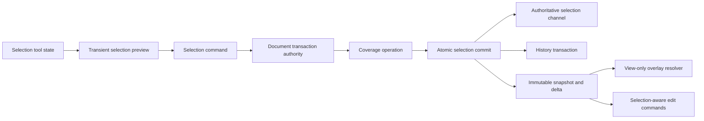
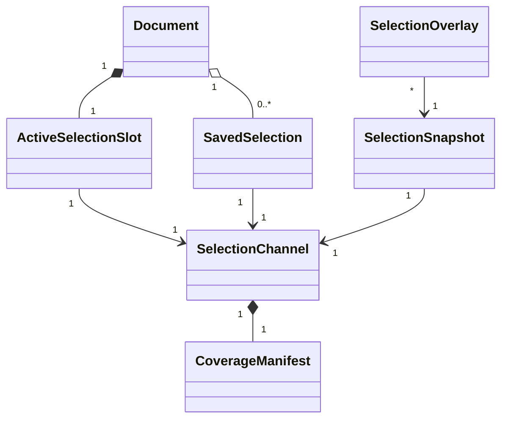
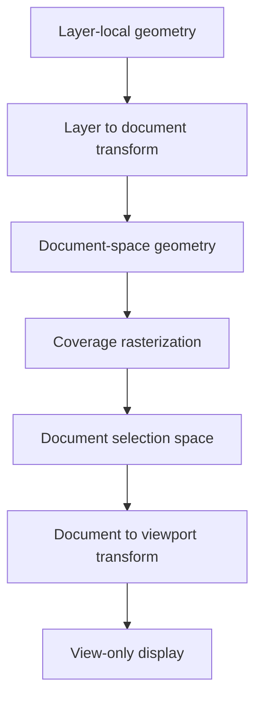
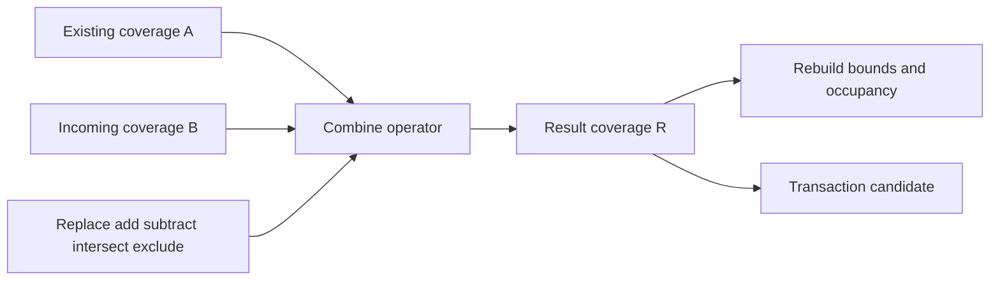
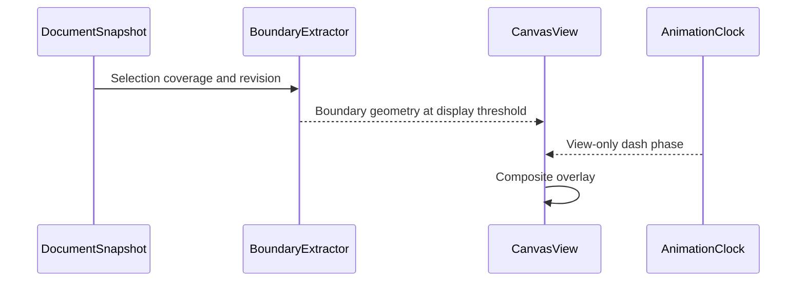
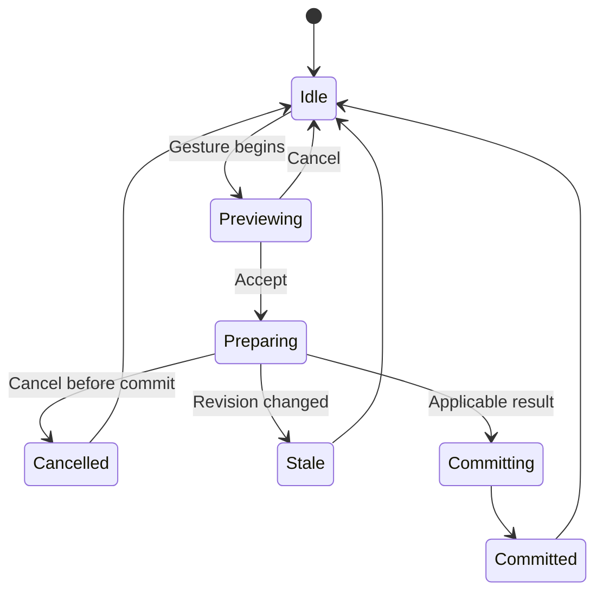
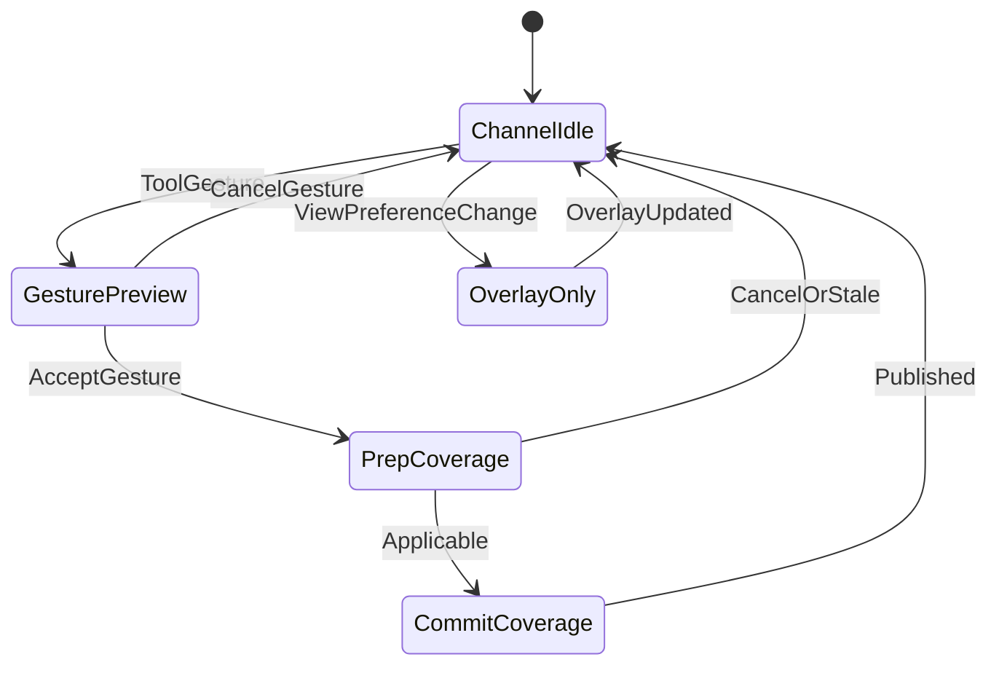

# 12 — Selection System

## Overview

The PhotoTux selection system defines pixel selections as document-associated scalar coverage fields used to scope editing operations. A pixel selection is not the same as selected layer objects, keyboard focus, context target, active edit surface, a path, a mask, or the animated boundary shown by a canvas view. Its authoritative meaning is coverage over document space: zero excludes a sample, one includes it fully, and intermediate values preserve antialiasing, feathering, transformed edges, and partial operation strength.

Selection mutations **MUST** use the [Command System](08-Command-System.md) and commit to the [Document Model](10-Document-Model.md). Selection tools may display transient previews against immutable snapshots, but only a committed command changes selection coverage. Marching ants, tint overlays, handles, and quick-preview modes are view projections and **MUST NOT** be stored as selection truth or mark a document modified.

This specification uses normative language from [Requirement Keywords](Appendix/Requirement-Keywords.md), vocabulary from the [Glossary](Appendix/Glossary.md), and the selection/focus distinctions established by [01 — Information Architecture](01-Information-Architecture.md). It does not freeze tile dimensions, UI toolkit, async runtime, final file format, or GPU kernel implementation.

## Colour-based selection

The **Magic Wand** (`tool.select.wand`) and **Colour Range** (`tool.select.color-range`) differ in exactly one thing: whether the match is contiguous. The wand floods outward from the seed pixel and stops at the first pixel outside the tolerance; colour range takes every matching pixel in the layer wherever it is. Both are one call to `phototux_engine::color_select_mask`, whose `contiguous` flag *is* that difference.

Tolerance is a fraction of the largest possible colour distance — squared Euclidean over four 0–255 channels — so `0.0` selects only exact matches and `1.0` selects everything, whichever channels happen to differ.

The algorithm lives in `phototux_engine`, which has no wgpu, while the pixels live in GPU textures. The host reads the layer, calls the engine, and combines the resulting R8 coverage into the mask through `SelectionMask::apply_coverage`; the command then records bounds, history and generation. That is the same division as `raster.fill` and the other host-executed edits: the engine owns *which pixels belong together*, the GPU crate owns *how to move them*.

Two refusals worth naming. A seed outside the layer is an error rather than a clamp — the caller named a pixel that is not there, and selecting a different one is an edit nobody asked for. And the flood uses an explicit stack rather than recursion, because a flood across a 4K layer is sixteen million pixels deep in the worst case, which no call stack survives.

## Modify operations

Five ops, all on `SelectionModifyOp`, which owns its wire name, display label, menu radius and action-id suffix so the Select menu is generated rather than restated:

| Op | Effect |
| --- | --- |
| Feather | Box-blur the mask edge. The one op the document remembers, because it is a property of the selection channel rather than a one-off edit of the mask. |
| Grow / Shrink | Dilate / erode. |
| Smooth | Erode-then-dilate followed by dilate-then-erode — the open-then-close pair, which drops specks and then fills nicks. |
| Border | The dilation minus the erosion: the band a stroke along the outline would cover. |

A conformance test refuses an op that no action can invoke, and it fired the moment Smooth and Border were added against three hand-written menu entries.

Grow and Shrink above are the *morphology*. The **menu labels are Expand… and
Contract…**, which is what Photoshop calls them, and the distinction matters:
Photoshop also has a Select ▸ Grow, and it extends a selection to neighbouring
pixels of similar colour. Labelling a fixed dilation "Grow…" hands a Photoshop
user the wrong command under the name of one they already know.

All five live in a **Select ▸ Modify** submenu, again Photoshop's placement, and
each opens a radius prompt (`SelectionModifyDialog`) rather than applying the
registry's default the instant it is clicked. The ellipsis in the label is a
promise, and for feather the radius *is* the operation: a fixed 4px feather and
a fixed 2px expand are close to useless. The action's argument is now the value
the prompt opens on rather than the value it applies.

## Responsibilities

The selection system **MUST**:

- represent authoritative pixel-selection coverage with explicit precision, extent, origin, and coordinate space;
- preserve fractional edge coverage and deterministic empty/full semantics;
- support replace, add, subtract, intersect, and exclusion-style combination through defined scalar equations;
- support invert, clear, select-all, feather, grow, shrink, border, transform, and rasterization from supported geometric sources;
- distinguish transient tool preview from committed selection;
- expose stable selection/channel identity, monotonic revisions, and document-version publication;
- provide bounds and occupancy summaries without treating them as authority;
- apply selection coverage consistently to raster edits, fills, transforms, filters, and other selection-aware commands;
- support sparse storage and bounded computation for large documents;
- define cancellation and stale-result behavior for expensive operations;
- remain independent from renderer devices and Linux presentation APIs;
- validate imported or clipboard selection data as hostile input.

The system **SHOULD** retain precision sufficient to avoid visible degradation through repeated combinations. It **MAY** provide saved selection channels, temporary named channels, or vector-derived selection sources, provided ownership and persistence are explicit.

## Architecture



The portable core owns coverage equations, coordinate contracts, channel records, and transaction integration. CPU implementations provide deterministic reference and fallback. wgpu kernels may accelerate feathering, morphology, transformations, and overlay generation, but GPU buffers are derived or provisional until a transaction commits recoverable authoritative data.

### Internal hierarchy

```text
Selection subsystem
├── active pixel selection slot
├── saved selection channel registry
├── channel metadata
│   ├── stable identity
│   ├── revision and source document version
│   ├── coordinate space and extent
│   ├── precision and scalar convention
│   └── sparse occupancy summary
├── authoritative coverage storage
├── combine operators
├── geometric rasterizers
├── feather and morphology kernels
├── transform/resampling kernels
├── preview state contracts
├── overlay and boundary extraction
├── command/history adapters
└── validation and diagnostics
```

## Selection Channels and Object Model

A document has one active pixel-selection slot. The slot always has semantic state, even when empty. Implementations may represent empty and full-canvas selections symbolically rather than allocate tiles. Saved selection channels are separate document objects or resources with stable IDs. Activating, replacing, loading, or storing a channel is explicit.

```rust
struct SelectionChannel {
    id: SelectionId,
    generation: ObjectGeneration,
    revision: SelectionRevision,
    space: SelectionSpace,
    extent: IntegerRect,
    precision: CoveragePrecision,
    storage: CoverageStorage,
    summary: CoverageSummary,
}

enum CoverageStorage {
    Empty,
    FullWithinExtent,
    SparseTiles(SelectionTileManifest),
    PreservedUnavailable(OpaqueSelectionRecord),
}
```

The conceptual declarations do not define final Rust layout or serialization. `CoverageSummary` contains conservative nonzero bounds, definitely-full bounds where useful, tile occupancy, and digest. It is derived and may be rebuilt. Coverage storage is authority.



Saved channels may share immutable coverage chunks with active selection and history. Editing one uses copy-on-write and cannot mutate another channel accidentally.

## Coverage Semantics

Coverage values lie in the closed interval [0,1]. Storage may use normalized integers or floating point, but conversion rules and rounding are explicit. Non-finite values are invalid. Values below zero or above one from intermediate kernels are clamped only at specified stages; silent repeated clamping must not alter mathematical definitions.

A selection-aware raster operation computes effective operation coverage from selection, brush/tool coverage, mask coverage, source alpha, and operation opacity in a defined order. Multiplicative scopes generally use:

```text
effective = clamp(selection × tool × mask × operation_opacity, 0, 1)
```

This equation is informative; individual commands must declare whether selection samples at destination, source, or both during transforms. Coverage is not color and has no color profile. Its interpolation occurs in scalar space. Alpha conventions of image buffers do not change selection meaning.

An empty selection ordinarily means no pixels selected, not “selection restriction disabled.” Commands that choose to treat absence of an explicit selection as unrestricted must model that distinction. PhotoTux therefore distinguishes `SelectionConstraint::None` from an active empty coverage field where necessary. User-facing “Clear Selection” normally returns to the unrestricted state according to product policy, while saved empty channels remain mathematically empty. The exact active-slot representation **MUST** avoid ambiguity.

## Coordinate Spaces and Extent

Active pixel selection is defined in document space. Integer pixel cells align with the document raster convention. Sample positions, pixel-center convention, and edge inclusion are fixed across CPU and GPU paths. Canvas resize, origin shift, and crop commands state whether selection moves with document coordinates, clips to new canvas, or retains off-canvas coverage.

Coverage may exist outside visible canvas when document semantics permit off-canvas content. Operations restricted to canvas intersect coverage with canvas extent. Saved channels record extent independently. Layer-local geometry converted to selection is transformed into document space at command snapshot version.

Coordinate values and extents use checked arithmetic. Kernels receive bounded regions including halo requirements. Transform operations declare source space, destination space, matrix convention, resampling filter, edge mode, and output extent.



View zoom, rotation, mirroring, device scale, and ant animation never change authoritative coverage.

## Antialiasing

Antialiasing computes fractional coverage near geometric boundaries. Every geometric selection source declares antialiasing enabled/disabled and its sampling rule. Reference rasterization may use analytic area coverage or a deterministic supersampling rule. GPU acceleration must match the reference within documented tolerance.

Disabling antialiasing produces binary coverage according to a documented inclusion test at pixel centers or area threshold. It does not quantize an already antialiased selection unless a separate threshold command is used.

Combining antialiased channels preserves intermediate values. Boundary extraction for marching ants uses a display threshold, commonly conceptually 0.5, but this threshold is view configuration and does not change selection. A selection can contain low nonzero feathered coverage with no visible ant at a chosen threshold; tint overlays and numeric summaries help expose it.

Repeated transformations should avoid unnecessary precision loss. Authoritative channel precision must be at least the document’s declared selection precision; preview may use lower resolution only when visibly labeled and final commit computes required quality.

## Combine Modes

Given existing coverage `A` and incoming coverage `B`, both normalized:

- **Replace:** `R = B`.
- **Add/union:** `R = 1 - (1 - A)(1 - B)`.
- **Subtract:** `R = A(1 - B)`.
- **Intersect:** `R = AB`.
- **Exclusive difference:** `R = A(1 - B) + B(1 - A)`.

These probabilistic-coverage equations preserve soft edges. A future mode using `max` or `min` semantics would be a distinct stable operator, not an implementation substitution. Equations, precision, and rounding are normative inputs to conformance tests.



Combine commands use immutable A and B views, even when storage aliases. Sparse kernels reason about symbolic empty/full tiles to avoid materializing entire canvases. The result commits atomically.

## Feathering

Feathering softens selection boundaries using a declared distance metric and kernel. Parameters include horizontal/vertical radius or one isotropic radius, units, edge behavior, quality, and whether expansion occurs inward, outward, or symmetrically according to operation definition.

A Gaussian-style feather must define radius-to-sigma mapping, truncation support, normalization, precision, and boundary handling. Other kernels require distinct IDs. “Feather 10 px” cannot vary silently by device. For large radius, separable CPU/GPU implementations may differ only within declared tolerance.

Feathering an empty selection stays empty. Feathering full selection within a finite extent depends on outside-extent coverage policy; the command must provide an evaluation boundary. Off-canvas samples are zero unless operation explicitly uses another rule. Processing region expands by kernel halo and uses checked bounds.

Live feather preview is transient. Final command revalidates source selection revision. If selection changes during preparation, result is stale and rejected unless command explicitly reruns on latest state.

## Grow, Shrink, and Border

Grow and shrink are grayscale morphology on coverage. Grow uses dilation; shrink uses erosion. Structuring element shape, radius, metric, edge policy, and fractional coverage behavior are explicit. Circular, square, and diamond metrics are distinct. A radius of zero is a no-change outcome.

Grow cannot overflow coordinate arithmetic or allocate unbounded extents. Shrink of features narrower than structuring element becomes empty. Border selection is defined from grown/shrunk results under a stated equation and direction, not from marching-ant pixels.

For antialiased input, morphology may operate directly on scalar coverage or on a thresholded binary field followed by antialias reconstruction. PhotoTux core must choose and identify one semantic mode per command ID; implementations cannot switch based on GPU capability. Direct grayscale morphology is recommended because it preserves soft coverage.

## Selection Transforms

Selection transform changes coverage geometry without transforming image content. It stores transient handles and matrix in tool preview; accept submits one command. Parameters define pivot, source bounds, destination extent, affine or supported projective mapping, resampling filter, edge mode, and clipping policy.

Inverse mapping is used where possible to avoid holes. Singular transforms are rejected for resampling unless a defined lower-dimensional rasterization exists. Nearest sampling is available for hard-edged workflows; higher-quality scalar interpolation preserves soft coverage. Resampled values are bounded.

Transforming a selection alongside layer content is an atomic command group only when both are intended as one semantic operation. Otherwise commands remain separate. A selection transform does not change view transform, layer transform, or active edit target.

## Marching Ants and Other View-Only Projections

Marching ants are an animated display of an iso-coverage boundary. They are not persisted, not included in history, not copied as selection content, and not used by edit commands. Their phase, dash length, speed, contrast, threshold, and animation enabled state belong to view/workspace preferences.



Reduced-motion preference disables phase animation while retaining a static high-contrast boundary or tint. High zoom may show pixel-aligned coverage. Overlay caches key selection revision, threshold, viewport transform, and extraction quality. Cache loss never changes selection.

## Workflows

### Rectangle selection with add mode

1. Host normalizes pointer input into document coordinates.
2. Tool stores drag geometry and displays transient antialiased preview.
3. Escape, focus loss, or device removal cancels preview.
4. On release, tool submits bounded rectangle geometry, antialias policy, and Add combine mode.
5. Worker rasterizes B against snapshot selection A.
6. Commit revalidates selection revision and installs R.
7. History stores reversible changed tiles or prior manifest.
8. Snapshot delta invalidates selection-aware commands and overlays.

### Feather existing selection

Command captures selection revision, radius, units, kernel ID, and boundary policy. A worker computes sparse output with required halo. Progress reports tiles or phases. Cancellation before commit releases output. Commit validates source revision and budget. History records prior/new manifests. Overlay derives from new coverage.

### Load saved channel

User chooses a saved selection by stable ID and combine mode. Command resolves source channel in same document, snapshots source and active coverage, applies equations, and commits active channel only. Shared chunks remain immutable. Deleting saved channel later cannot affect loaded result.

### Selection-aware fill

Fill command captures target edit surface, active selection snapshot/revision, fill source, color context, and affected bounds. Selection does not mutate. Prepared tile output records both layer and selection applicability. If either changes before commit, operation rejects or explicitly reruns; it never applies old selection to new target silently.

### Convert path to selection

Path geometry and transform are read from immutable document snapshot. Rasterization uses declared fill rule and antialias policy. Result combines with active channel and commits one selection transaction. Editing the source path later does not alter selection unless a future live relation is explicitly modeled.

## Relationships and Contracts

Pixel selection is document-associated. Object selection is an interaction set of layer/object IDs. Masks are persistent coverage objects attached to compositing targets. Paths are vector objects. All can convert through commands, but identity and lifetime remain separate.

```text
Object selection: chooses layer/object command targets
Pixel selection: limits spatial effect in document space
Active edit surface: receives painting or transform output
Mask: limits attached compositing contribution
Path: editable vector geometry
Marching ants: visual projection of pixel selection boundary
```

Selection-aware command descriptors declare whether they:

- ignore pixel selection;
- require nonempty explicit selection;
- treat no explicit selection as full operation extent;
- sample selection in source or destination space;
- snapshot selection at invocation or commit;
- combine selection with tool/mask coverage;
- retain selection unchanged or update it atomically.

Hidden assumptions are forbidden. A filter cannot observe a newer selection than the snapshot used for its pixels.

## IDs, Revisions, Versioning, and Invariants

The active channel has stable identity for the document lifetime or an explicit slot identity plus replaceable value. Saved channels have unique object IDs. Selection revision advances on semantic coverage or declared metadata change. Document version advances on every committed selection mutation, including undo/redo.

Invariants:

- coverage values are finite and within [0,1];
- authoritative coordinate space is explicit;
- active selection semantics distinguish unrestricted from mathematically empty;
- channel extent and tile addressing use checked arithmetic;
- summaries conservatively contain actual nonzero coverage;
- marching-ant state never influences command results;
- combine equations are device-independent;
- saved and active channels do not share mutable chunks;
- stale prepared results never overwrite newer revisions;
- selection mutation produces one transaction or none;
- undo creates a new document version;
- GPU resources and overlay geometry are derived;
- import and clipboard payloads cannot allocate before limits validate.

## Memory and Concurrency

Coverage storage is sparse and tile-oriented without fixing tile dimensions here. Uniform empty/full tiles use symbolic representations. Compressed authoritative chunks may be shared between snapshots/history. Decoded CPU tiles, distance fields, boundary geometry, and GPU textures are caches.

Memory accounting separates active authority, saved channels, history retention, snapshots, prepared output, CPU caches, and GPU caches. Feather and morphology jobs reserve output plus halo workspace before starting. Under pressure, overlays and speculative previews are evicted first. Unsaved authoritative selection is retained or durably spilled with integrity checks.

One document authority serializes selection commits with other document mutations. Read-only kernels run concurrently from snapshots. Long work does not hold document locks. Prepared results carry document ID/version, selection ID/generation/revision, parameter digest, bounds, and applicability.

Boundary extraction is lower priority than input and commit. Animation clocks run in presentation and coalesce frames. Multiple views may display the same selection with different overlays without duplicating authoritative coverage.

## Failure, Cancellation, and Recovery

Invalid radius, matrix, bounds, precision, or combine mode rejects before work. Allocation failure leaves active selection unchanged. Worker failure releases provisional tiles. If history cannot retain inverse under policy, command may compact/checkpoint before commit or reject; it cannot commit an unundoable mutation that claimed undoability.

Cancellation checks occur at tile or bounded kernel phases. Before commit, cancellation leaves no change. During bounded commit, cancellation reports finishing. After commit, reversal uses undo. Overlay cancellation has no document effect.

Recovery includes active and saved selection records when document format/checkpoint policy persists them. Corrupt selection chunks produce explicit unavailable selection state or document-open rejection based on whether core editing safety can be maintained. Recovery does not reinterpret corrupt bytes as empty, because that could broaden destructive operations.

## Persistence, Security, Privacy, and Accessibility

Editable save records selection precision, extent, coordinate convention, sparse chunks, channel IDs, and schema versions. Formats unable to preserve selection channels must disclose loss before conversion or export. Export normally ignores selection unless export command explicitly uses it as crop/alpha scope.

Imported channels, clipboard coverage, and drag payloads are hostile. Validators bound dimensions, tile counts, compressed and decoded bytes, nesting, and transform values. Decompression uses quotas and cancellation. Selection names and bounds may be private; diagnostics redact names and content. Clipboard integration follows [21 — Clipboard](21-Clipboard.md).

Accessibility exposes whether pixel selection is unrestricted, empty, partial, or full within stated bounds; conservative bounds; active transform state; combine mode; operation progress; and available commands. It does not announce every ant animation frame. Reduced motion yields static boundary. Selection operations have keyboard-reachable parameterized actions, numeric geometry entry where feasible, and status announcements on commit or failure.

## Design Rationale and Tradeoffs
**Coverage field versus binary bitmap.** Binary storage is smaller and simple but loses antialiasing and feathering. Scalar coverage preserves professional edge quality at memory/compute cost.

**Document-space selection versus layer-local selection.** Document space gives consistent scope across layers and views. Layer-local storage might follow transforms naturally but makes multi-layer edits ambiguous. Conversions explicitly map layer geometry to document coverage.

**Committed selection history versus ephemeral-only selection.** Selections influence destructive edits and user intent. Undoable persistence prevents unexpected loss. View overlays remain ephemeral.

**Sparse raster authority versus retained geometric recipe.** A raster field can represent arbitrary painted and combined selection. Retained geometry is compact but cannot cover every operation. Tools may retain preview geometry until commit; saved paths remain separate editable objects.

**Exact scalar combine equations versus max/min shortcuts.** Defined equations make soft-edge outcomes reproducible. Different operators may be offered under separate semantics.

## Rejected Alternatives

- Marching-ant pixels as selection: rejected because display threshold and zoom discard coverage.
- Implicit selection absence equal to empty: rejected because unrestricted and select-nothing operations diverge catastrophically.
- GPU-only channel authority: rejected because device loss and eviction cannot risk command scope.
- View-local active pixel selection: rejected because multiple views must share document editing state.
- Automatic path-selection linkage: rejected because source edits would mutate selection outside explicit commands.
- Silent binary quantization after transforms: rejected because edge quality degrades.
- Unbounded full-canvas buffers: rejected because large documents require sparse behavior.
- Layer object selection reused as pixel selection: rejected because target identity and spatial coverage are distinct.

## Best Practices

- Use symbolic empty/full representations.
- Keep coverage math documented beside tests.
- Include coordinate convention and precision in every kernel contract.
- Preserve source revision in async results.
- Compute conservative bounds; false-wide costs performance, false-narrow corrupts results.
- Use immutable chunk sharing for saved channels and history.
- Test radii at zero, one, very large values, and extent edges.
- Test antialiased subpixel geometry and repeated transforms.
- Separate overlay settings from document state.
- Ensure every selection-aware command declares absence/empty behavior.
- Compare wgpu kernels with deterministic CPU fixtures.
- Rate-limit progress and accessibility announcements.

## Future Extensibility

Future capabilities may include additional morphology metrics, higher precision channels, multiple active channel slots for specialized workflows, richer path conversion, channel arithmetic, or locally installed deterministic selection operators. Each addition **MUST** define scalar math, coordinate space, precision, bounds, resource budget, persistence, history, cancellation, security, accessibility, and reference tests.

The storage engine may change tile size or compression without changing semantic coverage. Other platform hosts can present the same actions. No extension receives mutable channel pointers or arbitrary shader authority. Stable external ABI remains deferred.

## Testability and Diagnostics

Headless tests use small exact coverage matrices and larger sparse fixtures. Property tests verify output range, identity laws, commutativity where applicable, empty/full laws, monotonic grow/shrink properties, and no mutation on failure. Differential tests compare CPU and wgpu output under tolerances.

Diagnostics record channel ID/revision, document version, operation ID, bounds, occupied tile count, logical/resident bytes, kernel ID, radius, queue/compute time, cancellation phase, stale rejection, and overlay extraction time. Coverage samples and names are omitted by default.

Fault injection targets allocation, halo creation, worker completion, history retention, commit, snapshot publication, overlay cache, and recovery decode. Controlled schedulers test races between selection preparation and layer/selection edits.



## Deterministic Acceptance Scenarios

### Soft-edge combination

Use one-pixel channels A=0.25 and B=0.5. Assert Add yields 0.625, Subtract 0.125, Intersect 0.125, Exclusive Difference 0.5, and Replace 0.5 within declared precision. CPU and GPU agree within tolerance.

### Marching ants independence

Display one selection at different zooms, rotations, thresholds, animation phases, and reduced-motion settings. Apply identical fill command from same snapshot. Assert resulting pixels and history are identical and no overlay change advances document version.

### Stale feather

Start feather on revision 9. Commit rectangle replacement to revision 10 before feather completes. Assert feather result is rejected as stale, revision 10 remains authoritative, provisional memory is released, and no history entry appears for feather.

### Empty versus unrestricted

Run a selection-aware delete once with unrestricted active state and once with explicit empty saved channel loaded. Assert unrestricted affects operation extent, explicit empty changes nothing, command outcomes identify scope, and no implicit conversion occurs.

### Grow at extent limit

Place nonzero coverage near maximum valid coordinate and request grow radius exceeding configured extent. Assert checked validation rejects before allocation, document version/history remain unchanged, and error reports parameter/budget.

### Cross-view overlay

Open two views of one document. Configure ants in one and tint overlay in another. Commit selection in first view. Assert both observe same new channel revision while retaining independent view-only overlay settings.

### Cancel transform

Preview affine selection transform, allocate GPU preview, then press Escape. Assert authoritative manifest/revision/version unchanged, preview resources released, and accessibility announces cancellation once.

### Save and reopen

Persist active antialiased selection and two saved channels with shared chunks. Reopen. Assert coverage values, IDs, extents, precision, unrestricted/empty distinction, and channel independence. Editing one channel after reopen does not mutate others.

## Extended Invariants and Neighbor Contracts

This section tightens selection-system contracts for coverage authority, view-only projections, sparse storage, concurrency with paint and filters, persistence precision, and neighbor boundaries.

### Channel invariants

Pixel selection channels are document-associated scalar coverage objects with stable IDs, revisions, extents, precision, and emptiness/unrestricted predicates. Object selection, keyboard focus, active edit target, mask attachment, vector path editing, and marching-ants overlays are distinct concepts. A command that mutates pixel coverage **MUST NOT** silently mutate object selection, and overlay preference changes **MUST NOT** advance document version.

Coverage values live in a declared numeric domain. Combine-mode equations are deterministic under stated precision. Soft edges are first-class: antialiased geometry, feather kernels, and brush-painted selection strokes write fractional coverage without forced binary thresholding unless a named threshold command runs. Unrestricted state means operations use their natural full extent; explicit empty means selection-aware operations become no-ops that still report scope clearly.

Saved channels and the active channel are independent objects that may share immutable chunks through copy-on-write. Editing one channel after a share **MUST** copy affected chunks before mutation so peers do not alias. Channel reorder and rename are semantic if persisted; view filter of the channel list is not.

### Edge cases at extent, precision, and geometry

Selections may extend to configured maximum coordinates. Grow, shrink, border, and feather operations that would expand beyond limits fail validation before allocation. Zero-radius feather is identity. Negative parameters reject. Operations on unrestricted state either reject as inapplicable or convert through an explicit command that materializes bounds; implicit conversion is forbidden.

Affine transforms of selection coverage preview in view space but commit in document space with explicit resampling policy. Cancel discards preview resources and leaves revision unchanged. Rotations and non-uniform scales use the declared filter; CPU and GPU paths meet tolerance, including at tile seams.

Binary-looking tools still produce the channel’s precision. A rectangular “hard” select into an antialiased channel may write exact 0/1 values without changing channel precision metadata. Narrowing precision is a conversion command with loss reporting.

### Failure modes

Async feather, grow, path rasterize, and load-from-mask jobs carry source revision tokens. If the channel moves ahead, results are stale and release provisional memory. History is not written for rejected jobs. Corrupt compressed chunks never decode to full-white coverage by default; open fails or the channel becomes unavailable with metadata preserved.

Clipboard paste of hostile selection payloads validates dimensions, decompression ratios, and precision. Overflowing claims reject before sparse materialization. Partial paste into a document that cannot represent the precision either converts with acceptance or refuses.

### CPU and GPU boundaries

Authoritative coverage is CPU-side sparse chunks (or equivalent portable store). GPU resident masks accelerate preview, ants thresholding, and tool feedback. Device loss drops GPU copies; ants and tint overlays rebuild from authority. Marching ants animation phase, zoom, rotation, and reduced-motion settings are view-local and excluded from replay keys that affect editing output.

Fill, stroke, delete, and filter operations that consume selection read coverage from the snapshot leased for the command. They never sample the overlay framebuffer as selection truth.

### Concurrency and backpressure

Selection mutations serialize with other document commands. Brush, filter, and transform preparations that embed a selection revision revalidate at commit. A selection change during long paint preparation causes declared reject-or-rerun policy; silent application of old coverage to new target bytes is forbidden.

Sparse stores support selections larger than GPU memory. Workers page chunks; budgets refuse unbounded inflation. Overlay cache eviction may hitch animation but cannot clear the channel. Multi-view documents share channel revisions and keep independent overlay settings.

### Persistence

Formats that claim editable selection support preserve precision, IDs, extents, unrestricted/empty distinction, and chunk integrity through save/reopen. Quantizing soft selections on export to foreign formats requires a loss report. Recovery checkpoints include selection when the editable format does. View-only ants preferences do not persist as document semantics unless the product explicitly stores workspace state elsewhere.

### Neighboring subsystem contracts

- Document model: versions, snapshots, resource manifests for coverage chunks.
- Layer system: selection-aware edits target layers by ID; object selection is separate.
- Mask system: conversion both ways clones values under new IDs; no live alias of mutable chunks.
- Brush engine: selection scopes dabs; painting selection itself targets a channel ID.
- Filter engine: soft selection weights ROI; halo planning includes selection bounds when applicable.
- Color management: selection is scalar coverage, not a color buffer; no display-profile dependence.
- Rendering engine: overlays are non-authoritative projections composited after document content.
- History: channel transactions undo/redo with newer versions.
- Clipboard: rich payloads validated as hostile input.



### Additional acceptance scenarios

#### Precision narrowing refusal

Attempt to save an antialiased channel into a destination profile that only stores binary masks without user-accepted conversion. Assert refusal or explicit conversion plan; reopening the original document retains fractional coverage.

#### Soft selection filter weight

Apply a destructive filter under a soft selection with mid-grey coverage on a constant-color layer. Assert output interpolates by coverage per the filter’s selection contract, history records selection revision used, and changing display profile does not alter committed pixels.

#### Shared chunk copy-on-write

Create saved channel S by duplicating active channel A. Paint into A. Assert S’s bytes remain unchanged, A’s revision advanced, and shared immutable chunks are copied on write only for dirty regions.

#### Path rasterize seam

Rasterize a long diagonal path into selection across many tiles at high zoom commit scale. Assert CPU and GPU coverage agree within tolerance at tile boundaries and that ants threshold changes do not alter the committed channel.

#### Object selection independence

Select three layers in the object channel, then replace the pixel selection. Assert layer object selection remains, pixel revision advances once, and a subsequent delete-pixels command does not delete layers.

#### Accessibility reduced motion

Enable reduced motion and verify selection changes announce bounds and mode without requiring ants animation. Commit a selection change and assert a single coalesced announcement per version, not per animation frame.

### Invariant checklist

- Overlay never writes authority.
- Unrestricted ≠ empty ≠ missing channel.
- Stale async work cannot commit.
- Sparse missing chunk = zero coverage in range, not unknown.
- Multi-view: shared channels, independent overlays.
- Cross-conversion with masks clones identity.
- Hostile dimensions fail before allocation.
- Headless tests cover combine math, feather races, and save/reopen without GPU.

### Combine-mode algebra documentation obligations

Implementations **MUST** publish exact equations or bit-exact pseudocode for Add, Subtract, Intersect, Exclusive Difference, and Replace at each supported precision. Fixtures include 0, 1, midtones, and NaN-quarantine cases. Floating pipelines quarantine non-finite inputs to zero coverage before combine. Integer pipelines saturate per schema. Documentation of equations lives with descriptors so CPU and GPU cannot diverge by “equivalent” reinterpretation.

## Acceptance Criteria

- Pixel selection, object selection, focus, mask, path, and overlay remain distinct.
- Coverage equations and geometric rasterization are deterministic under stated tolerances.
- Every mutation commits atomically through a command and history transaction.
- Marching ants never alter document state or editing output.
- Sparse storage supports selections larger than memory-resident GPU capacity.
- Async stale results cannot replace newer selection.
- Save/reopen preserves precision and identity where editable format claims support.
- Host/UI technology remains outside portable selection semantics.
- Accessibility communicates selection state without relying on animation or color alone.

## Cross References

- [00 — Introduction and System Charter](00-Introduction.md) — authority, GPU, and local-first principles.
- [01 — Information Architecture](01-Information-Architecture.md) — selection, focus, context, and active-target distinctions.
- [08 — Command System](08-Command-System.md) — sole mutation spine and async applicability.
- [10 — Document Model](10-Document-Model.md) — identity, versions, resources, snapshots, and persistence.
- [11 — Layer System](11-Layer-System.md) — object targets and selection-aware layer edits.
- [13 — Mask System](13-Mask-System.md) — persistent attached coverage and conversion.
- [20 — History and Undo](20-History-Undo.md) — reversible channel transactions.
- [21 — Clipboard](21-Clipboard.md) — selection payload transfer and hostile input validation.
- [Glossary](Appendix/Glossary.md) — canonical definitions.
- [Requirement Keywords](Appendix/Requirement-Keywords.md) — normative meanings.
- [Cross-Reference Index](Appendix/Cross-Reference-Index.md) — foundation map; planned numbering there predates this specification set.
- Downstream: `16-Brush-and-Stroke-Engine.md`.
- Downstream: `18-Input-and-Gesture-Model.md`.
