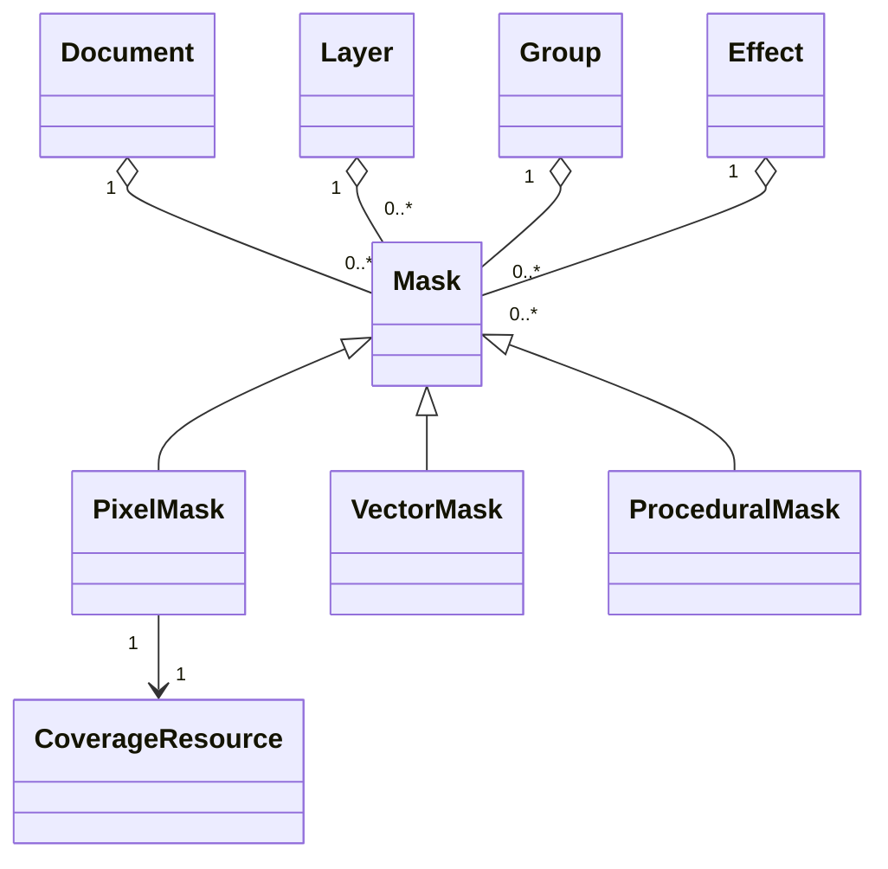
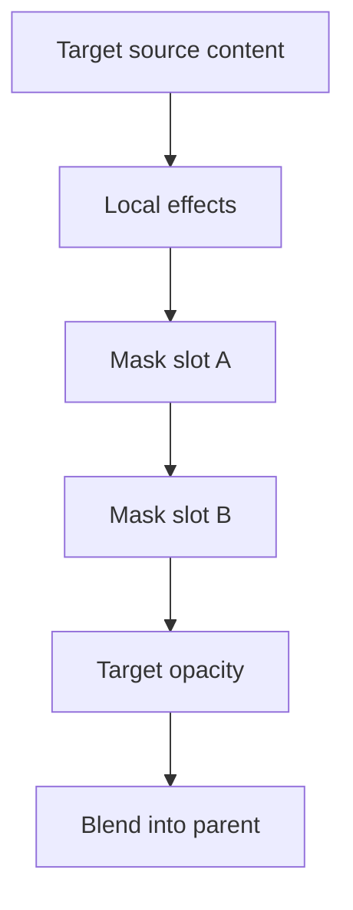
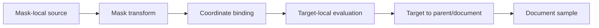
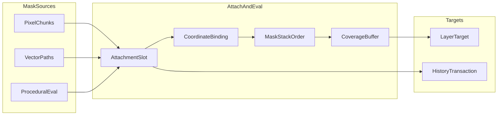

# 13 — Mask System

## Overview

The PhotoTux mask system defines persistent scalar coverage objects attached to layers, groups, effects, and other explicitly maskable operations. A mask limits an attached target’s contribution without destructively deleting source content. Masks are document objects with stable identity, editable source semantics, coordinate-space contracts, transforms, compositing order, persistence, and history. A mask is not a pixel selection, alpha channel, clipping chain, opacity property, path overlay, or temporary tool preview, though commands may convert among compatible representations.

Mask creation, editing, attachment, reordering, enabling, unlinking, applying, and deletion **MUST** use the [Command System](08-Command-System.md). The [Document Model](10-Document-Model.md) owns mask truth. The [Layer System](11-Layer-System.md) consumes mask results during compositing. Rendering reads immutable snapshots and cannot normalize or repair mask records by mutation.

This specification uses [Requirement Keywords](Appendix/Requirement-Keywords.md), the [Glossary](Appendix/Glossary.md), and selection coverage conventions from [12 — Selection System](12-Selection-System.md). It remains vendor-neutral and does not freeze UI toolkit, tile dimensions, serialized layout, async runtime, or extension ABI.

## Responsibilities

The mask system **MUST**:

- support raster/pixel, vector, and deterministic procedural mask semantics;
- represent mask coverage as finite normalized scalar values with explicit precision;
- attach masks only to compatible slots under deterministic ordered evaluation;
- provide stable IDs, generations, revisions, and document-version integration;
- define mask-local, target-local, parent, and document coordinate mappings explicitly;
- distinguish mask content transform from target transform and linked movement policy;
- support enable/disable, invert, density, feather, transform, edit, duplicate, convert, apply, detach, and delete through exact commands;
- prevent ownership, attachment, reference, and evaluation cycles;
- preserve target source content during nondestructive masking;
- expose masks as distinct active edit surfaces;
- publish immutable snapshot records and precise invalidation;
- support sparse large masks and bounded procedural/vector evaluation;
- survive renderer/device loss and missing optional implementations without corrupting documents.

The system **SHOULD** retain source vector or procedural parameters until explicit rasterization. It **MAY** support multiple ordered masks per target, shared immutable source resources, and specialized effect-input masks, provided attachment and edit semantics remain unambiguous.

## Architecture


The portable core owns object semantics, equations, coordinate spaces, graph validity, history effects, and persistence contracts. wgpu may accelerate rasterization, blur, morphology, transforms, and composition. GPU resources remain derived; a device loss cannot change masks.

### Internal hierarchy

```text
Mask subsystem
├── mask object registry
├── attachment slots and order
├── common mask properties
│   ├── identity and name
│   ├── enabled and invert
│   ├── density and feather
│   ├── coordinate binding
│   └── transform-link policy
├── source kinds
│   ├── pixel coverage manifest
│   ├── vector geometry/style
│   ├── procedural descriptor
│   └── opaque preserved source
├── source-to-target mapping
├── coverage resolver
├── cycle/invariant validator
├── snapshot/delta adapter
├── history/resource retention
└── diagnostics
```

## Object Model

```rust
struct MaskRecord {
    id: ObjectId,
    generation: ObjectGeneration,
    revision: ObjectRevision,
    attachment: MaskAttachment,
    common: MaskCommon,
    source: MaskSource,
}

struct MaskCommon {
    name: BoundedText,
    enabled: bool,
    invert: bool,
    density: UnitInterval,
    feather: FeatherDescriptor,
    space: MaskCoordinateBinding,
    transform: Transform2D,
    link_policy: MaskLinkPolicy,
}
```

These conceptual fields do not freeze memory or file layout. The attachment identifies owner target, slot kind, and deterministic order. A mask can be detached only if detached masks are a supported document object class; otherwise removal deletes attachment/object through a reversible transaction.



## Common Coverage Semantics

Every resolved mask produces coverage `M` in [0,1]. Zero fully suppresses the target contribution at that sample; one leaves it unaffected; intermediate values proportionally retain contribution. Mask coverage is scalar, profile-independent, and not image luminance unless a command explicitly derives it from color.

Common modifiers apply in fixed order. One recommended semantic sequence is:

1. evaluate source coverage in source space;
2. map/resample into attachment evaluation space;
3. apply source-specific antialiasing;
4. apply feather;
5. invert if enabled;
6. apply density as `M' = 1 - density × (1 - M)`;
7. combine with other masks in attachment order.

The exact adopted order is part of saved semantics and tests. Implementations cannot reorder for performance unless mathematically equivalent within declared tolerance. Density zero disables suppression while retaining mask source; enabled false bypasses the entire mask according to attachment contract.

Multiple ordinary masks generally combine multiplicatively: `Mcombined = M1 × M2 × ...`. Alternate combine operators require explicit per-mask modes and stable equations. Target opacity and source alpha are separate compositing inputs.

## Pixel Masks

A pixel mask stores authoritative sparse scalar coverage, extent, origin, precision, and tile manifest. It is a paintable edit surface when active and unlocked. Painting uses mask-space or document-space mapping declared by the attachment. Brush color is interpreted as coverage according to tool semantics, not through document color profile.

Pixel mask chunks may share immutable storage with selections, copied masks, snapshots, and history, but mutable aliasing is forbidden. Uniform black/white tiles use symbolic representation. Bounds summaries are derived.

Creation sources include all-white, all-black, current pixel selection, source alpha, source luminance under an explicit color transform, or imported channel data. Every source is a distinct parameterized command. “Add Mask” cannot hide whether initial coverage reveals or suppresses content.

## Vector Masks

A vector mask stores editable paths, primitives, boolean groups, fill rules, antialias policy, and transform. Coverage derives from vector rasterization at requested output resolution. Source geometry remains authoritative; tessellation, edge lists, signed distance fields, and raster tiles are caches.

Vector semantics define open-path behavior, winding/even-odd fill, boolean operation order, stroke contribution if supported, curve precision, and handling of self-intersections. Coordinates are finite and bounded. Geometry complexity limits protect import and evaluation.

Editing path nodes commits vector records. It does not replace the mask with raster coverage. Rasterize Vector Mask is an explicit destructive conversion retained by history under policy.

## Procedural Masks

A procedural mask stores a deterministic bounded descriptor such as gradient, noise with fixed algorithm/seed, geometric falloff, thresholded channel expression, or other local computation. “Procedural” means parameterized deterministic computation, never model-based generation or remote service.

Descriptor requirements:

- stable operation ID and schema version;
- finite bounded parameters;
- declared coordinate space and extent;
- resource references with pinned revisions;
- deterministic seed and algorithm version where randomness exists;
- precision, edge, and sampling semantics;
- CPU/reference behavior or declared validated fallback;
- evaluation cost and memory budget;
- persistence and missing-implementation behavior.

Missing implementations preserve descriptor and show unavailable state or embedded fallback preview. They do not silently bake or delete source.

## Attachment Model

An attachment slot declares eligible target kinds, allowed mask kinds, multiplicity, ordering, evaluation stage, coordinate mapping, and lifecycle. Layer masks limit final layer contribution. Group masks limit resolved group contribution or declared pass-through scope. Effect masks interpolate or scope effect application. Other future slots require separate contracts.



This diagram illustrates one slot order; target descriptors define actual order. Attachment order changes are semantic commands and history entries. A mask belongs to exactly one attachment unless shared-mask objects are explicitly introduced. Sharing a source resource is not sharing mask identity/properties.

Deleting target handles owned masks atomically. Policy may delete them with target, detach them to a channel registry, or reject unless user chooses; no orphan records are silently discarded. Undo restores target and masks with original IDs.

## Coordinate Spaces

Mask coordinate binding names source and evaluation spaces:

- **mask-local:** intrinsic source coordinates before mask transform;
- **target-local:** target content coordinates;
- **parent:** target parent/group coordinates;
- **document:** global document coordinates;
- **normalized bounds:** normalized target or explicit rectangle, only when descriptor defines behavior.

The mapping chain is explicit:



Renderer uses inverse mapping where required. Singular mappings reject edits needing inverse; nondestructive display behavior must be specified. Canvas view transforms never enter mask authority.

### Linked and unlinked transforms

Linking is a policy for future target-transform commands, not a hidden shared matrix. When linked, a target move/transform command includes corresponding mask transform update so visual relation follows declared binding. When unlinked, target transform changes while mask remains anchored in its binding space.

Unlinking does not alter current appearance. It changes how subsequent commands group transforms. Linking likewise does not snap matrices. Commands record target and mask revisions and commit all affected records atomically. UI chain icons are projections of `MaskLinkPolicy`.

Reparenting target or changing coordinate binding may require transform compensation to preserve appearance. Numeric failure rejects the operation. “Change Binding Preserving Appearance” and “Reinterpret in New Binding” are distinct commands.

## Compositing and Evaluation

Resolver builds mask evaluation nodes from immutable target/mask records. It computes conservative bounds, source dependencies, transforms, feather halo, and required precision. Masks may be evaluated per tile. Vector/procedural masks can generate only requested regions. Pixel masks supply sparse tiles.


Cache keys include document version or complete revisions, mask kind/schema, source revision, resource revisions, transform/binding, feather, invert, density, output tile, resolution, and precision. Missing keys risk stale coverage and are correctness defects.

CPU reference evaluation defines expected scalar output. wgpu kernels may use feature-tier-specific paths while meeting tolerance. Device loss invalidates caches only.

## Mask Operations

### Enable and disable

Disable bypasses mask effect while retaining source and properties. It is undoable and does not delete resources. Disabled masks remain visible in object hierarchy and accessibility.

### Invert

Nondestructive invert toggles property. Destructive pixel inversion rewrites coverage and is a separate command. Vector/procedural inversion should use property unless explicit source rewrite semantics exist.

### Feather and density

Feather is a nondestructive common modifier by default. Applying feather to pixel data destructively is separate. Density weakens suppression according to fixed scalar equation.

### Apply mask

Apply Mask destructively incorporates resolved mask into target content where target kind supports it, then removes mask. For raster content, it modifies alpha/coverage under explicit straight/premultiplied and zero-alpha color rules. For non-raster targets, apply may require rasterization and must disclose that consequence.

Apply and Remove are never aliases. Remove discards mask effect and source while leaving target content otherwise unchanged. Apply requires stable snapshot, preparation, and atomic replacement/removal.

### Convert and copy

Mask-to-selection, selection-to-mask, vector-to-pixel, channel-to-mask, and duplicate-mask operations are commands. They specify coordinate mapping, extent, precision, combine mode, and ownership. Conversion creates independent identity; immutable chunks may initially share.

## Workflows

### Create pixel mask from selection

1. Action resolves target layer and active selection snapshot.
2. Command specifies reveal/suppress mapping, attachment slot, binding, and linked state.
3. Validator checks target capability and absence of conflicting slot constraints.
4. Builder converts selection coverage into independent pixel mask manifest.
5. One transaction creates mask ID, attaches it, updates target relation, history, and version.
6. Active edit target may move to mask only if action explicitly requests it.

### Paint an unlinked mask

Tool resolves mask as active edit surface. Preview maps document input through inverse mask binding. Gesture command names mask ID/generation/revision and changed bounds. Commit replaces mask tiles only. Target source remains unchanged. Renderer invalidates target output.

### Transform target with linked mask

Target transform command discovers linked masks through authoritative relation. Candidate calculates target transform and required mask adjustments. All revisions update in one transaction. If any mask is locked or compensation invalid, entire command rejects.

### Apply raster mask

Worker reads target and resolved mask from snapshot N, generates new recoverable raster chunks, and records original target/mask resources for inverse. Commit revalidates both revisions, replaces target manifest, removes attachment/object, and publishes one transaction. Cancellation before commit leaves both untouched.

### Edit procedural parameters

Panel holds preview descriptor outside document. Resolver evaluates preview under bounded budget. Accept submits schema-versioned parameters. Commit validates resource references and deterministic constraints. Missing resource returns typed failure or preserved unavailable state according to descriptor.

## Relationships and Contracts

Mask identity belongs to document. Attachment edge establishes target relation. Source resources may be shared immutably. Selection is independent document coverage. Active edit target points to a mask or another compatible surface by stable ID.

```text
Layer/group/effect
└── ordered mask attachment
    └── mask object
        ├── common modifiers
        ├── coordinate binding and transform
        └── source
            ├── pixel coverage resource
            ├── vector geometry
            └── procedural descriptor/resources
```

Target descriptors expose mask capabilities to command validation and UI availability. Presentation availability is advisory; execution revalidates. Renderer receives resolved immutable records and cannot call command handlers.

## IDs, Revisions, Versions, and Invariants

Mask ID is stable through edits, enable toggles, reorders, and binding changes. Kind conversion preserves ID only if semantic continuity and references remain valid; otherwise it replaces with mapped new ID. Revision advances for source, property, attachment order, transform, or binding changes. Target revision may advance when attachment relation changes. Document version always advances on commit.

Invariants:

- every attached mask and target belong to same document;
- each mask has one owner attachment unless explicit sharing exists;
- attachment slot accepts mask kind and multiplicity;
- attachment and evaluation dependency graphs are acyclic;
- coverage and density are finite within [0,1];
- transforms are finite and coordinate spaces explicit;
- procedural descriptors are deterministic and bounded;
- vector geometry obeys complexity and numeric limits;
- source and target authority are independent from caches;
- disable differs from delete, and remove differs from apply;
- linked state changes future command behavior without hidden immediate mutation;
- stale preparation cannot overwrite newer mask or target;
- command commit, history, and snapshot publication are coherent.

## Cycle Prevention

Cycles may arise if procedural masks sample targets influenced by themselves, references cross attachment scopes, or future shared masks depend on owner output. Core mask sources should avoid arbitrary target sampling. Any dependency is a typed directed edge and participates in layer graph cycle detection.

Adding attachment or changing source references computes affected dependency subgraph. A path from proposed dependency target back to mask/owner rejects. Depth and edge limits are enforced before allocation. Runtime cycle detection indicates invariant failure and does not choose an arbitrary fallback.

## Memory and Concurrency

Pixel masks use sparse chunks. Vector/procedural sources are compact but evaluation caches may be large. Memory accounting separates authoritative source, history, snapshot leases, prepared apply output, CPU raster cache, and GPU cache. Feather halos and transform intermediates reserve budget.

Mask commits serialize with target/layer/selection mutations. Read-only evaluation proceeds concurrently from snapshots. Prepared apply/conversion work carries document version, mask/target generations/revisions, resource digests, and applicability. Locks never span GPU, filesystem, codec, host, or extension work.

Visible mask editing receives interactive priority. Thumbnail and offscreen mask rasterization shed first. Queues are bounded. Multiple views share authority but retain view overlays and active presentation independently.

## Failure, Cancellation, and Recovery

Invalid attachment, cycle, resource reference, coordinate mapping, or parameter rejects without mutation. Allocation failure releases provisional chunks. Renderer failure shows explicit unavailable subtree but preserves mask. Missing procedural implementation retains descriptor.

Cancellation before commit leaves target and mask unchanged. Apply-mask commit is bounded and non-interruptible after authority replacement begins. Post-commit cancellation returns committed outcome; undo restores source/mask if retained.

Recovery persists mask objects, attachments, sources, resources, and revisions. Corrupt mask data cannot be interpreted as all-white because that could expose content or broaden edits. Policy rejects open, marks mask unavailable while preserving target, or restores verified checkpoint. Repair is explicit.

## Persistence, Security, Privacy, and Accessibility

Schemas encode kind, IDs, attachment, order, precision, coordinate binding, transform, common modifiers, source version, and bounded resources. Unknown optional masks preserve opaque data and fallback; unknown required evaluation may make target unavailable. Saves disclose loss before formats that cannot retain masks.

Imported geometry, compressed pixel chunks, procedural graphs, profiles used for luminance conversion, and extension descriptors are untrusted. Validators enforce bytes, dimensions, recursion, edge count, arithmetic, and execution budgets. Procedural descriptors cannot execute arbitrary code or access files. Local references require capabilities.

Mask names, thumbnails, bounds, and source descriptors are private in diagnostics. Accessibility exposes mask name/kind, target relation, order, enabled, inverted, density, feather, linked state, lock, active-edit state, and unavailable status. Keyboard users can activate, reorder, toggle, link/unlink, apply, remove, and open properties. Apply and remove consequences are announced distinctly.

## Design Rationale and Tradeoffs
**Separate mask objects versus layer alpha mutation.** Objects preserve source and editability, permit vector/procedural kinds, and clarify active target. They add graph complexity.

**Explicit coordinate binding versus inferred following.** Inference feels convenient but breaks under reparent and transforms. Binding plus link policy makes behavior testable.

**Nondestructive common modifiers versus rewriting source.** Properties preserve quality and reversibility. Resolver carries extra nodes. Explicit apply commands remain available.

**Multiple ordered masks versus one mask.** Multiple masks support composition and specialized scoping but increase UI and evaluation complexity. Deterministic attachment order and multiplicative default keep semantics tractable.

**CPU authority/reference plus GPU acceleration versus GPU-only.** Reference behavior improves conformance and recovery; GPU supplies performance.

## Rejected Alternatives

- Treat mask as layer thumbnail state: rejected because it is editable persistent content.
- Store link as shared mutable transform pointer: rejected because unlinking and history become ambiguous.
- Apply on delete by default: rejected because destructive consequences differ.
- Interpret corrupt mask as white: rejected because it can reveal suppressed content.
- Implicit color-profile conversion of scalar coverage: rejected because masks are not color.
- Arbitrary procedural scripts in document: rejected for determinism and security.
- Network-dependent mask resources: outside product boundary.
- Renderer-generated mask IDs: rejected because renderer is derived consumer.
- Shared mutable mask across targets: rejected until conflict, lifetime, and coordinate semantics are specified.

## Best Practices

- Name exact target and consequence in every mask command.
- Keep scalar math and evaluation order beside reference tests.
- Include binding/transform/source revisions in cache keys.
- Preserve vector/procedural source until explicit rasterization.
- Use all-white/all-black symbolic pixel storage.
- Validate inverse mappings before gesture commit.
- Test linked transforms under nested groups.
- Treat bounds as conservative optimization only.
- Keep active mask visually and semantically distinct from layer pixels.
- Fuzz attachment graphs and procedural descriptors.
- Inject failure into apply-mask preparation and commit.
- Ensure missing implementations preserve source.

## Future Extensibility

Future mask slots or deterministic source kinds may be added after defining attachment scope, scalar equations, coordinate mapping, dependencies, persistence, fallback, history, budgets, security, accessibility, and reference fixtures. Shared mask instances require explicit ownership and per-attachment transform semantics. Other hosts may present same semantic actions through native controls.

Storage, tessellation, and GPU kernels may evolve. No mask contract freezes Rust layout, shader packaging, toolkit, or stable binary ABI. Extensions never receive writable document references.

Compatibility remains semantic: equivalent coverage, attachment order, coordinate mapping, reversibility, and failure behavior are required across implementations.

## Operational Compatibility and Migration

Mask schema migration **MUST** preserve evaluation meaning, not merely parse fields. A migration that changes feather radius interpretation, antialias convention, coordinate origin, density equation, vector fill rule, or procedural algorithm version is a semantic conversion and requires a new descriptor or explicit compatibility adapter. Loading must retain the original record until converted output validates. If exact migration is impossible, the decoder preserves the old mask as unavailable with an embedded fallback where safe, or rejects opening; it never presents changed coverage as equivalent.

Capability negotiation separates readable, editable, and renderable status. A host may inspect a mask whose source evaluator is unavailable. A renderer may display a verified fallback while editing remains disabled. Persistence may round-trip an opaque source even when core cannot evaluate it. These statuses are independent and exposed to commands and accessibility.

Document format conversion computes a mask loss report before destination replacement. The report identifies masks that would rasterize, lose coordinate binding, collapse attachment order, quantize precision, discard procedural parameters, or become target alpha. User acceptance is tied to exact document version and conversion plan; later mask changes invalidate it.

Local migration diagnostics include schema IDs, adapter path, object count, elapsed time, and result category. They exclude source geometry, coverage, names, and resource bytes. Migration runs under the same depth, memory, cancellation, and checked-arithmetic limits as hostile import. Cancellation before document registration leaves no visible partial state.

## Testability and Diagnostics

Headless fixtures cover pixel, vector, and procedural sources at tiny exact matrices and large sparse extents. Property tests assert coverage range, disabled identity, density endpoints, double invert identity, deterministic source output, and no cycles. CPU/GPU differential tests include transforms, feather, and nested groups.

Diagnostics record IDs/revisions, attachment target/slot, source kind/schema, bounds, cache bytes, evaluation time, stale results, cycle checks, apply preparation, and failure codes. Content, names, paths, and coverage samples remain redacted.

Fault injection covers source allocation, vector rasterization, procedural evaluation, transform compensation, history retention, target replacement, attachment removal, publication, and recovery decode.

## Deterministic Acceptance Scenarios

### Linked transform

Create target and document-space pixel mask with linked policy. Move target through command. Assert target and mask transforms change atomically to preserve relation, one history entry exists, and undo restores both under newer version.

### Unlinked transform

Repeat with unlinked policy. Assert target transform changes while mask transform remains byte-equivalent, output changes according to document anchoring, and link icon is projection only.

### Apply versus remove

Duplicate identical masked raster targets. Apply mask to one and remove from other. Assert applied target pixels/alpha incorporate coverage and mask disappears; removed target pixels remain unchanged and mask disappears; outputs/history differ predictably.

### Procedural determinism

Evaluate seeded procedural mask on CPU and two wgpu feature tiers. Assert values meet tolerance, reopening retains algorithm version/seed, and cache eviction does not alter output.

### Cycle rejection

Attempt procedural dependency on composite that includes its owning target. Assert pre-commit cycle rejection, unchanged graph/version/history, and actionable diagnostic edge path.

### Stale apply

Begin applying mask revision 4 to target revision 8. Paint mask to revision 5 before worker finishes. Assert prepared output rejects, target revision 8 remains, mask 5 remains attached, and provisional chunks release.

### Corrupt mask recovery

Corrupt one compressed mask chunk. Assert system never substitutes white silently. Depending declared policy, open fails or target shows unavailable mask with preserved metadata and recovery option.

### Selection conversion

Convert antialiased selection to pixel mask, then mask back to selection with same document-space extent/precision. Assert values match tolerance, IDs differ, and later edits do not alias mutable chunks.

## Extended Invariants and Neighbor Contracts

This section expands mask-system depth for attachment integrity, evaluation order, linked transforms, apply/remove semantics, procedural safety, concurrency, and persistence of editable coverage.

### Attachment and evaluation invariants

A mask is a first-class object with stable ID, source kind (pixel, vector, procedural), revision, coordinate binding, and attachment slot relative to a target. Attachment is an explicit edge in the document graph. Disabled masks are identity for coverage evaluation but remain present for editing and persistence. Invert is a semantic flag or non-destructive node, not a destructive rewrite, unless a named bake command runs.

Evaluation order is deterministic: target source, then mask stack in attachment order, then layer blend participation as defined by the compositor contract. Density mapping, feather, and vector fill rules are part of the mask’s schema version. Changing those meanings is migration, not a silent runtime tweak.

Linked transform policy updates target and mask transforms atomically so document-space relative placement is preserved. Unlinked policy updates only the addressed transform. UI icons reflecting link state are projections; authority is the policy bit on the attachment record.

### Edge cases

Empty pixel masks are valid and yield zero coverage where extent is defined. Vector masks with empty path sets behave likewise. Procedural masks with seeds and algorithm versions must evaluate identically across CPU and enabled GPU tiers within tolerance. Nested groups containing masked children compute mask coordinate spaces through declared bindings; ambiguous bindings reject at commit.

Applying a mask into a target is destructive relative to the prior editable pair: coverage is incorporated into target pixels/alpha per command math, and the mask object is removed or detached per command. Removing a mask deletes the attachment without changing target pixels. Disabling is neither apply nor remove. Rasterizing a vector or procedural mask into a pixel mask is a kind-changing conversion with loss reporting when editability narrows.

Mask painting uses the brush engine against the mask object ID. Painting must not require the mask to be the active layer in the UI sense if the command carries an explicit target; active edit target and command target remain consistent with information-architecture rules.

### Failure modes

Procedural dependency cycles that include the owning target’s composite reject before commit with an actionable edge path in diagnostics. Stale apply jobs that finish after mask or target revisions advance reject and release provisional chunks. Corrupt mask chunks never become full-white coverage silently. Missing procedural evaluators leave the mask unavailable while retaining parameters when safe.

Device loss during mask preview or apply preparation discards GPU intermediates. Authority unchanged. CPU path may complete apply only if still applicable at commit.

### CPU and GPU boundaries

Pixel mask authority is sparse scalar chunks. Vector and procedural sources remain editable on CPU; GPU may rasterize for evaluation and preview. Cache keys include source revision, transform, feather, invert, density schema, coordinate space, and device generation. Eviction can force re-rasterization but not semantic change.

Selection conversion clones coverage into a new ID space. Live links between selection channels and masks are forbidden unless an explicit future synchronized-link feature is specified; current architecture treats conversion as copy.

### Concurrency

Mask edits serialize through document transactions. Filter and brush operations that sample masks capture mask revision in their applicability token. Reordering attachments concurrent with evaluation invalidates caches through deltas. Workers must not write mask authority; only commit installs new manifests.

Large feather or procedural evaluation runs under cancellation and budgets. Mid-evaluation cancel leaves prior mask revision in place. Progress reporting is optional and redacted.

### Persistence and migration

Editable formats preserve pixel, vector, and procedural masks with schema versions. Migration preserves evaluation meaning. If a host cannot evaluate a procedural algorithm version, it may round-trip opaquely, display verified fallback, and disable editing—three independent statuses. Document conversion that would rasterize vectors or bake procedurals reports loss before destination replacement.

Recovery includes masks when the editable format does. Clipboard transfer deep-copies mask subgraphs with fresh IDs and rewritten attachment edges.

### Neighboring subsystem contracts

- Document model: object IDs, versions, resource chunks, snapshots.
- Layer system: attachment targets; compositing consumes evaluated coverage.
- Selection system: conversion peer; distinct from persistent masks.
- Brush engine: paints mask scalars; display profile excluded from authority keys.
- Filter engine: may use masks as inputs; halo planning includes mask blur radii when sampling.
- Color management: masks are scalar; color transforms do not rewrite coverage.
- Rendering engine: evaluates masks in the graph; cache-only GPU residency.
- History: apply/remove/disable/invert/rasterize are distinct reversible command classes.
- Clipboard: hostile validation of extents and compression.



### Additional acceptance scenarios

#### Nested group coordinate binding

Place a pixel mask with document-space binding on a layer inside a rotated group. Move the group. Assert mask evaluation follows binding policy, linked/unlinked bits behave as specified, and reference renders match golden fixtures for both policies.

#### Double invert identity

Toggle invert twice without baking. Assert coverage returns to the prior evaluative result within tolerance and a single undo step walks invert flags rather than pixel bakes.

#### Feather then apply atomicity

Feather a mask, then apply to target in one user action that expands to one or more transactions under declared policy. Assert intermediate disabled/feathered states are not partially visible after failure, and successful apply removes mask editability as specified.

#### Procedural seed stability under eviction

Evaluate a procedural mask, evict all caches, change display profile, re-evaluate. Assert coverage digest matches prior evaluative digest; only presentation may change if a view proof depends on unrelated settings—and mask evaluation itself remains profile-independent.

#### Clipboard mask into locked target

Paste a mask attachment onto a locked layer. Assert rejection, no orphan mask object in the root, and clipboard contents remain available for a subsequent paste onto an unlocked target.

#### Concurrent paint and apply

Start apply of mask revision 3 while a brush stroke prepares mask revision 4. Assert apply either completes against revision 3 and brush commits afterward as revision 4 on the still-attached mask under policy, or apply rejects if policy requires latest—never applies revision 3 onto a target while simultaneously destroying revision 4 without order.

### Implementer checklist

- Disabled ≠ removed ≠ applied.
- Linked transform updates are atomic across target and mask.
- Cycles fail closed.
- GPU loss ≠ white mask.
- Conversion clones IDs.
- Schema migration preserves meaning or discloses loss.
- Accessibility exposes attachment relation and active mask edit surface without relying on overlay color alone.

### Density mapping and feather interaction order

When both density curves and feather are present, evaluation order is schema-defined and versioned. Reversing order is a behavior change. Fixtures cover density-then-feather versus feather-then-density only when a schema explicitly offers a mode switch; otherwise a single order applies. Disabled masks skip both. Invert applies at the schema-defined stage and is covered by double-invert identity tests.

## Acceptance Criteria

- Pixel, vector, and procedural masks preserve distinct editable semantics.
- Attachments and coordinate bindings are explicit and cycle-free.
- Linked/unlinked behavior is deterministic and transaction-based.
- Apply, remove, disable, invert, and rasterize remain distinct commands.
- GPU/device/cache loss cannot change mask authority.
- Async stale work cannot overwrite target or mask.
- Persistence either retains mask editability or reports loss before save.
- Accessibility exposes mask relation and active edit surface.
- All mutation follows command/history/snapshot contracts.

## Cross References

- [00 — Introduction and System Charter](00-Introduction.md) — authority and local-first boundaries.
- [01 — Information Architecture](01-Information-Architecture.md) — active edit target and action naming.
- [08 — Command System](08-Command-System.md) — mutation and async commit.
- [10 — Document Model](10-Document-Model.md) — IDs, resources, snapshots, and persistence.
- [11 — Layer System](11-Layer-System.md) — attachment targets and compositing.
- [12 — Selection System](12-Selection-System.md) — scalar coverage and conversions.
- [20 — History and Undo](20-History-Undo.md) — reversible attachment/apply records.
- [21 — Clipboard](21-Clipboard.md) — rich mask transfer.
- [Glossary](Appendix/Glossary.md) — canonical terms.
- [Requirement Keywords](Appendix/Requirement-Keywords.md) — normative interpretation.
- [Cross-Reference Index](Appendix/Cross-Reference-Index.md) — foundation map; its planned numbering predates this specification set.
- Downstream: `13-Compositing-and-Blend-Semantics.md`.
