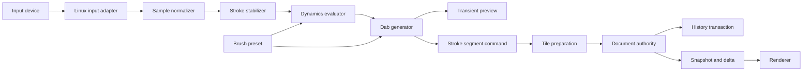
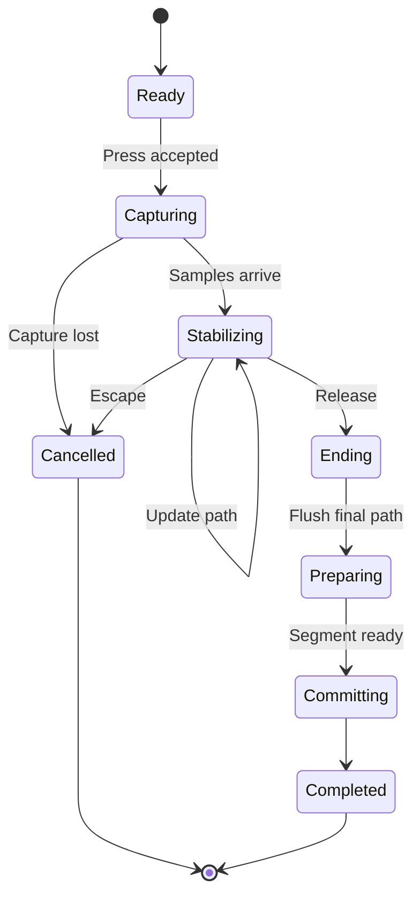
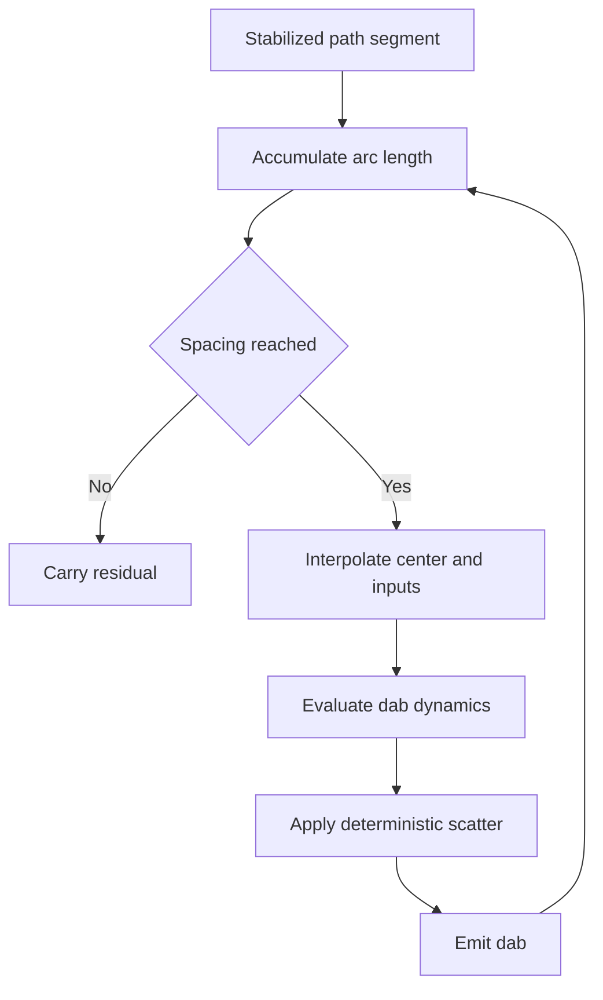
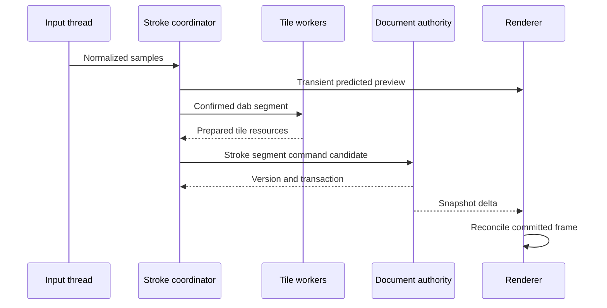
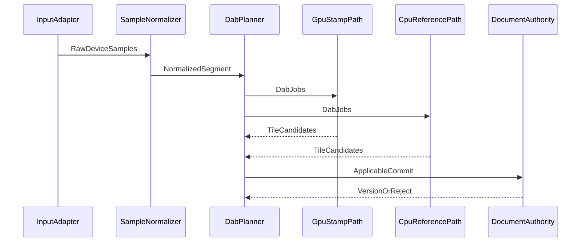

# 14 — Brush Engine

## Overview

The PhotoTux brush engine converts normalized pointer, pen, and synthetic local input into deterministic raster coverage and color changes. It separates device sampling, gesture interpretation, stroke stabilization, dynamics, dab generation, stamp evaluation, blending, tile preparation, authoritative commit, and replay. A brush resource describes behavior; a tool owns transient interaction state; a stroke command requests mutation; the document owns committed pixels. No brush component may mutate a layer, mask, selection, history record, or document resource outside the [Command System](08-Command-System.md).

Brush rendering is GPU-first, not GPU-only. wgpu compute and render pipelines are the preferred interactive path. A bounded CPU implementation **MUST** provide semantic fallback, reference fixtures, recovery from unsupported device capabilities, and operation on systems without a usable adapter. GPU buffers and preview textures are derived. Authoritative stroke results are recoverable CPU-addressable tile chunks committed by transaction authority.

This specification follows [00 — Introduction](00-Introduction.md), [10 — Document Model](10-Document-Model.md), [12 — Selection System](12-Selection-System.md), [13 — Mask System](13-Mask-System.md), and [20 — History and Undo](20-History-Undo.md). Normative terms follow [Requirement Keywords](Appendix/Requirement-Keywords.md).

## Responsibilities

The brush engine **MUST**:

- normalize timestamped samples without losing device provenance needed by dynamics;
- produce a stable stroke coordinate stream independent of viewport transforms;
- support configurable smoothing, stabilization, prediction, interpolation, and latency policy;
- map pressure, tilt, bearing, rotation, velocity, direction, distance, and time through explicit dynamics curves;
- generate deterministic dabs with spacing, scatter, rotation, scale, texture, flow, opacity, and blend semantics;
- support procedural tips and bounded local stamp resources without executable brush payloads;
- apply pixel selections and masks through explicit coverage equations;
- invalidate exact conservative tile regions and retain halo requirements;
- submit every committed stroke segment through commands and history transactions;
- merge segments into one meaningful history step without hiding version order;
- replay suitable strokes using pinned preset, resource, algorithm, color, and coordinate inputs;
- support sparse canvases larger than GPU memory;
- expose cancellation, queue pressure, degraded quality, and typed failures;
- remain portable in core semantics while Linux adapters provide native tablet events.

The engine **SHOULD** present a low-latency preview before authoritative tile commit, keep input-to-preview below one display frame on reference hardware, and avoid discontinuities when switching between GPU and CPU implementations. It **MAY** predict near-future samples for presentation, but predicted samples **MUST NOT** become authoritative unless confirmed by real input under an explicit reconciliation rule.

## Architecture



Input and preview can proceed while earlier segments prepare. Commit order remains causal. The preview is tagged with source document version, edit-surface revision, selection revision, preset revision, and stroke sequence. Reconciliation replaces preview only with output produced from compatible committed state.

### Internal hierarchy

```text
Brush subsystem
├── input session
│   ├── device identity and capabilities
│   ├── timestamp normalization
│   ├── coordinate conversion
│   └── discontinuity detection
├── stroke state
│   ├── raw sample ring
│   ├── stabilized path
│   ├── cumulative distance and time
│   ├── deterministic random stream
│   └── segment and dab sequence
├── preset resolver
│   ├── tip and stamp
│   ├── dynamics mappings
│   ├── spacing and scatter
│   ├── texture and material
│   └── blend behavior
├── dab generator
├── coverage and color evaluator
├── GPU pipeline family
├── CPU reference and fallback kernels
├── tile dependency and invalidation planner
├── preview compositor
├── command/history adapter
├── preset serializer and migration
└── diagnostics
```

## Spatial and Data Layout

```text
Document space
┌──────────────────────────────────────────────┐
│ tile y-1 │ tile y-1 │ tile y-1              │
├──────────┼──────────┼────────────────────────┤
│ tile x-1 │ dirty    │ dirty plus tip halo    │
├──────────┼──────────┼────────────────────────┤
│          │ dirty    │ changed dab coverage   │
└──────────────────────────────────────────────┘

Sample stream
raw events → normalized samples → stable path → dab centers
                                              ├─ tip transform
                                              ├─ texture sample
                                              ├─ coverage
                                              └─ blend into tile
```

Coordinates are converted from device pixels through viewport and document transforms before stabilization. Stabilization therefore operates in document units and is unaffected by later viewport zoom. Presets can express diameter and spacing in document pixels, physical units, or a declared view-relative mode. View-relative mode is presentation dependent and **SHOULD NOT** be used for replayable production strokes unless resolved values are recorded.

## Core Contracts

```rust
struct BrushSample {
    sequence: SampleSequence,
    monotonic_time: Duration,
    document_position: Point2,
    pressure: UnitInterval,
    tilt: Option<Tilt2>,
    bearing: Option<Angle>,
    barrel_rotation: Option<Angle>,
    device: DeviceInstanceId,
    flags: SampleFlags,
}

struct StrokeDescriptor {
    stroke_id: StrokeId,
    target: EditSurfaceRef,
    preset: PinnedBrushPreset,
    initial_color: ColorValue,
    blend: BrushBlendDescriptor,
    stabilizer: StabilizerDescriptor,
    random_seed: Seed,
    source_versions: StrokeSourceVersions,
}

struct Dab {
    sequence: DabSequence,
    center: Point2,
    transform: Affine2,
    opacity: UnitInterval,
    flow: UnitInterval,
    hardness: UnitInterval,
    texture_phase: Point2,
    color: ColorValue,
}
```

These are conceptual contracts, not frozen Rust layouts. Every sequence is bounded and checked. Numeric fields reject NaN and infinity. Angles use one canonical orientation and wrap rule. Pressure absence follows declared device fallback, normally one. A sample gap, device removal, timestamp reversal, or capture loss creates a discontinuity marker rather than an invented connecting line.

## Input Sampling and Normalization

Linux adapters ingest native pointer and tablet events, including high-resolution coordinates, pressure, tilt, tool type, eraser state, device identity, and monotonic timestamp when available. Toolkit or compositor objects terminate at adapter boundary. Core receives a stable portable sample contract.

The normalizer **MUST**:

- preserve event order per captured device;
- convert timestamps to one monotonic session clock;
- reject or clamp impossible values according to field policy;
- map coordinates through one immutable view transform snapshot;
- identify coalesced, predicted, synthesized, and real samples;
- retain device capability absence distinct from a reported zero;
- split streams after excessive time, distance, target, or transform discontinuity;
- bound sample rate and ring memory.

If host events arrive faster than processing, backpressure may coalesce intermediate movement while retaining first, last, extrema needed by dynamics, and sufficient geometry to satisfy maximum path error. Pressure extrema cannot be discarded blindly. Button transitions, device changes, discontinuities, and final release are never coalesced away.

## Stabilization and Path Reconstruction

Stabilization converts noisy input into a path while trading latency against smoothness. Descriptors identify algorithm and version, radius or delay, strength, end catch-up, velocity sensitivity, and corner policy. Supported semantic families may include weighted moving average, spring follower, distance-window smoothing, and fitted spline. Presets store a stable algorithm ID, not an implementation type name.

The stable path **MUST**:

- begin from the accepted initial sample;
- remain causal during live display unless the UI declares delayed noncausal smoothing;
- preserve explicit discontinuities;
- terminate according to a defined release/catch-up policy;
- produce finite coordinates;
- bound deviation and retained samples;
- yield identical reference output from identical normalized input and descriptor.



Prediction is view-only. Predicted points carry a prediction generation and disappear or reconcile when corresponding real samples arrive. Authoritative dab placement uses normalized real samples and deterministic interpolation. If a stroke segment was committed before prediction correction, only confirmed dabs may have entered it.

## Dynamics

A dynamics mapping transforms one or more normalized inputs into a parameter multiplier or offset. Inputs include pressure, speed, path direction, tilt magnitude, tilt direction, barrel rotation, cumulative distance, elapsed time, dab index, and deterministic random values. Each mapping defines input normalization, curve, combination mode, output range, smoothing, and missing-input fallback.

Curves use bounded piecewise linear or cubic control points with deterministic evaluation. Sorting, duplicate abscissas, tangent policy, extrapolation, and clamping are explicit. Dynamic outputs never become non-finite. Combining size-pressure and random-size, for example, follows declared multiplication or addition order.

Velocity is computed from stabilized or raw path according to descriptor, with a stated time window and units. Direction at zero movement retains prior valid direction or uses preset default. Tilt orientation is transformed correctly when canvas view is mirrored or rotated before entering document-space semantics. Device calibration belongs to application preference and is snapshotted into resolved stroke inputs.

Randomness uses a specified splittable or counter-based deterministic generator identified by algorithm version and seed. Random values derive from stroke ID plus dab index and channel, not worker scheduling order. Scatter X, scatter Y, angle jitter, size jitter, color jitter, and texture jitter use independent named streams so adding one future channel does not shift all existing values.

## Dabs, Spacing, and Interpolation

A dab is one bounded brush application. Dab centers are generated along stabilized path by accumulated arc length. Spacing may be an absolute distance or a fraction of current diameter. If diameter changes dynamically, the algorithm defines whether next threshold uses prior, current, or integrated diameter; reference behavior uses integrated local spacing to avoid pressure-induced bunching.

The generator carries residual distance across samples and command segments. Segment boundaries cannot restart spacing. The first dab policy, stationary dab policy, and final dab policy are preset semantics. Time-based airbrush emission is separate from distance-based spacing and uses monotonic time ticks with a maximum emission rate.

Large event gaps are interpolated only within configured distance/time limits. Beyond a discontinuity threshold the engine starts a new subpath. Maximum dabs per sample, segment, and stroke prevent malformed presets from creating unbounded work. Exceeding limits yields visible degraded/rejected status; it never silently hangs the UI thread.



## Tips, Stamps, Scatter, and Texture

Tip kinds include analytic circle/ellipse, bounded bitmap stamp, and deterministic procedural tip descriptors. Analytic tips define hardness and edge function. Bitmap tips define dimensions, scalar or colored interpretation, precision, profile if colored, alpha convention, origin, and sampling filter. Procedural tips are bounded declarative operations; document or preset files cannot contain executable shaders.

Tip transform composes translation, diameter, aspect, rotation, optional tilt projection, and scatter in a canonical order. Scatter may be normal/tangential to path or document-axis aligned. Distribution identifies uniform disk, uniform rectangle, Gaussian-like bounded distribution, or another versioned algorithm. Values are bounded to a declared multiple of diameter.

Texture modulates coverage, color, or both. It specifies coordinate space, transform, repeat mode, interpolation, channel interpretation, profile, strength, phase policy, and resource revision. Texture may anchor to document, stroke, or dab. Document anchoring yields consistent grain across strokes; stroke anchoring begins at stroke origin; dab anchoring restarts per stamp. Cache and replay keys include this distinction.

Stamp resources loaded from local preset catalogs or documents are untrusted. Decoders validate dimensions, compressed size, decoded bytes, profile length, channel count, and arithmetic before allocation. Missing stamps leave presets unavailable or use an explicitly declared safe fallback; they are never replaced silently.

## Coverage, Color, and Blending

Per-sample effective coverage is computed from tip coverage, flow accumulation, opacity, texture modulation, pixel selection, target mask constraints where applicable, and operation-specific coverage. Evaluation order is stable. A representative normal-paint model is:

```text
dab_coverage = clamp(tip × texture × flow × dynamics, 0, 1)
scope_coverage = clamp(selection × tool_scope, 0, 1)
effective = clamp(dab_coverage × scope_coverage, 0, 1)
source_alpha = effective × source_color_alpha × stroke_opacity
```

Flow controls contribution per dab; opacity bounds accumulated stroke contribution according to blend descriptor. Repeated overlapping dabs can accumulate differently under normal, build-up, erase, replace, smudge, or coverage-preserving modes. Each blend mode defines working color space, linear/nonlinear requirements, premultiplication, alpha equation, transparent-color handling, precision, clamp behavior, and CPU/GPU tolerance.

Color is captured as a profiled value and converted by [16 — Color Management](16-Color-Management.md) into target working/compositing representation. Color jitter operations identify their space. Scalar mask painting bypasses color-profile conversion and maps brush value to coverage. Erasing changes alpha/coverage through explicit rules; it is not painting background color.

Premultiplied intermediates are preferred for compositing. Straight target storage is converted at controlled boundaries. Zero-alpha color preservation policy is explicit because destructive brush edits may otherwise create halos. High-bit-depth documents retain sufficient intermediate precision and avoid early normalized-eight-bit quantization.

## Tile Planning and Invalidation

The planner transforms each dab’s conservative support bounds into affected tile coordinates. Bounds include tip filtering radius, texture filter footprint, blend readback, smudge pickup, selection sampling, and any kernel halo. False-wide bounds cost work; false-narrow bounds corrupt pixels and violate correctness.

Tiles are prepared from one immutable target snapshot. For ordinary paint, each changed tile reads prior target, selection coverage, and pinned resources, then writes provisional output. Operations requiring neighboring pixels declare halo and dependency tiles. Cross-tile reads use immutable source data so execution order does not alter results.

```text
Tile job key
├── document and snapshot version
├── target object ID, generation, revision
├── target tile coordinate and format
├── selection ID and revision
├── stroke ID and segment/dab range
├── resolved preset and resource revisions
├── color transform identity
├── blend implementation version
└── CPU/GPU feature tier
```

Dirty deltas list changed authoritative tile resources and conservative document-space regions. Renderer may reuse unaffected tiles. Thumbnail and mip invalidation derives from changed base tiles. History stores pre-first and post-last manifests for coalesced segments under budget.

## GPU and CPU Boundaries

wgpu path uploads source tiles, selection tiles, tip/texture resources, dab parameter buffers, and color transforms. Dispatches are tile-bounded. Pipelines are selected from validated feature tiers and prewarmed for common formats. Shader compilation never occurs while holding document authority.

GPU results become authoritative only after a recoverable readback or equivalent durable CPU-addressable resource has completed and validated. Interactive preview may present GPU-only transient output before readback, but command success waits for commit-ready resources. Implementations may use CPU authority with simultaneous GPU preview to reduce readback cost.

CPU fallback implements identical dab placement, random streams, coverage equations, blend ordering, and edge sampling. SIMD and parallelism may optimize it without changing scheduling-dependent results. Differential tests define exact results for integer paths and tolerances for floating-point/color transforms. A preset cannot require GPU-only semantics for core editing.

If GPU lacks texture format, storage feature, precision, or binding capacity, scheduler chooses an equivalent multipass GPU path or CPU fallback. Degradation is reported when performance or preview quality changes, not when semantics remain equivalent.

## Scheduling, Concurrency, Cancellation, and Backpressure

Input collection and transient cursor feedback have highest interactive priority. Preview jobs follow. Commit-ready stroke segments outrank thumbnails and offscreen rendering but do not starve save/recovery capacity. Per-document mutation commits serialize; tile preparation may run in parallel from the same snapshot.

Queues are bounded by sample count, dab count, tile jobs, provisional bytes, and GPU submissions. Under pressure:

1. speculative prediction is dropped;
2. preview resolution may decrease visibly;
3. movement samples coalesce under geometric error bounds;
4. adjacent uncommitted dab ranges combine;
5. background render jobs cancel;
6. input is rejected with actionable resource-pressure status if correctness cannot be maintained.

User-confirmed mutation is never silently dropped. Samples already acknowledged as part of an active stroke either commit, remain represented in pending state, or produce a disclosed partial-stroke outcome at a valid segment boundary.

### Acquiring pressure from the host

Pressure **MUST** be read from a device-aware input path. A toolkit's plain mouse-event type generally carries position and buttons only; reading a pressure field from it yields nothing, and because a missing field reads as absent rather than as an error, the failure is silent — every dab is stamped at full pressure and the dynamics above never see a signal, while the preset UI continues to offer pressure controls that do nothing.

Where the device reports no pressure, the adapter **MUST** substitute the declared fallback of full pressure, so pointer devices behave exactly as they would with the dynamics disabled. An adapter that monitors the pointer alongside the gesture handler **MUST NOT** take an exclusive grab, or it changes which component owns the gesture while only meaning to observe it.

### Pressure across a segment

Input samples arrive far more slowly than dabs are placed — tens per second against hundreds — so a segment between two samples carries many dabs. Dynamics inputs **MUST** be interpolated across that segment rather than held at the sample value: stamping the arriving pressure on every dab of its segment turns a smooth press into one visible step per input event, and the step count tracks the input rate rather than anything the user did.

Spacing **MUST** be derived from the diameter actually being stamped, not from the nominal brush size, and **MUST** be re-evaluated as the segment is walked rather than fixed at its start. Holding spacing at the nominal width while pressure shrinks the dab places small dabs at large-dab intervals, and the stroke breaks into separate dots — the visible form of the pressure-induced bunching named above, in the thin direction. A brush whose size does not follow pressure **MUST** be unaffected by this rule, so that pointer devices without pressure behave exactly as before.

### Bounding dab work

A dab covers a small disc; the pass that draws it **MUST NOT** cost the whole target. Where the tip is produced by discarding fragments outside a full-target draw, the rasterizer still visits every pixel of the layer, so a small dab on a large document does thousands of times the fragment work it needs. Dab draws **MUST** be bounded to the region the dab can touch, and that bound **MUST** include the tip's soft edge and the rounding between a centre in continuous coordinates and the texels it covers.

A batch of dabs **MUST** be recorded as one pass. Beginning a pass per dab forces a pipeline drain and a full attachment load and store between consecutive dabs of the same stroke, which is the dominant cost of a batch long before the fragments are. Draws within one pass blend in submission order, so batching is behaviour-preserving.

A dab lying entirely outside the target **MUST NOT** be drawn, since an empty bounding region is not a valid scissor.

Because a bound that is too tight silently truncates a stroke rather than failing, the bound **MUST** be verified against painted pixels — a suite that never reads back after stamping cannot observe it.

### Presenting an in-progress stroke

Stamping and presenting are separate rates. Dabs are placed by arc length, so their rate is pointer speed over spacing and has no relationship to the display; presentation is bounded by the refresh rate no matter how often it is asked for.

The mid-stroke composite trigger **MUST** therefore be paced against elapsed time, not against a dab count. A count-based trigger fails in both directions from one constant: a small brush moved quickly composites several times per displayed frame, spending GPU bandwidth and shared-queue time on frames nobody sees, while a large brush moved slowly can go seconds between composites with the stroke already stamped but invisible.

The pacing interval **MUST** admit the fastest display the product targets without firing twice within one frame at the slowest. Stamped dabs that arrive too close together to be paced out **MUST** still reach the canvas once the stroke goes quiet: a stroke that pauses with the pointer down produces no further samples, so a trigger that only runs on arrival would leave its last dabs stamped and unpresented until the user moves again.

Stroke end **MUST NOT** composite more than once. Flushing the tail of a stroke and finalizing it are separate steps, and asking both to composite pays twice at the moment the user lifts the pen.

Cancellation before first commit drops preview and provisional resources. Cancellation after committed segments stops future segments; committed segments remain one undoable partial gesture. A bounded commit cannot be interrupted after authoritative installation begins. Device removal or focus loss follows tool policy: cancel uncommitted tail, optionally retain earlier segments, and report exact result.



## Cache and Resource Lifetime

Preset resolution, curve tables, tip mip levels, texture decodes, dab parameter buffers, pipeline variants, selection uploads, source tiles, and preview composites are caches. Each has an owner, byte count, generation, and eviction policy. Preset and document resources remain authoritative outside caches.

Snapshot leases pin source manifests while tile work runs. Prepared result leases own output until commit or cancellation. History leases retain previous tile chunks. GPU upload leases end after submission completion, but logical cache entries may remain. Device loss invalidates all device-generation entries.

Cache keys include every semantic input. Resource content digest alone is insufficient when profile interpretation, algorithm version, sampling, alpha, or coordinate space differs. Eviction affects latency only. Under memory pressure preview and decoded resource caches evict before authoritative/history resources. Unsaved tiles may spill only to protected local storage with integrity metadata.

## Preset Format and Versioning

A brush preset is a versioned bounded declarative document:

```text
BrushPreset
├── stable preset schema and behavior version
├── display metadata
├── tip descriptor and pinned resources
├── size, aspect, angle, hardness
├── spacing and time emission
├── dynamics mappings and curves
├── scatter distributions and seed policy
├── texture descriptor
├── color/coverage behavior
├── blend descriptor
├── stabilization defaults
└── compatibility and fallback declaration
```

Preset files **MUST NOT** contain executable code, native paths granting authority, remote references, or unvalidated shader modules. Resource links are local catalog identities or embedded blobs; resolving a stored path requires host-granted capability. Unknown required behavior marks preset unavailable. Unknown optional display metadata may round-trip.

Migrations preserve output meaning. Changing spacing integration, random generator, hardness curve, stamp sampling, dynamics interpolation, or blend equation requires a new behavior version. Migration that cannot preserve semantics retains old descriptor and evaluator or reports incompatibility; it cannot quietly reinterpret.

Resolved stroke descriptors pin all mutable application preferences and catalog resource revisions needed for replay. Editing a preset during an active stroke affects the next stroke unless a tool explicitly begins a new segment under a visible policy.

## Replay and Determinism

Replayable stroke data contains normalized confirmed samples or canonical stabilized path, algorithm versions, resolved preset, resource identities and bytes, seed, target coordinate convention, color/profile identity, selection snapshot identity where replay semantics require it, and blend behavior. Recording raw device events alone is insufficient.

History ordinarily retains tile manifests because replay can be costly and sensitive to target state. Replay is valid only against declared source resource fingerprints and exact semantic implementation. Macros may replay a stroke command against a chosen target only when coordinate and selection policy is explicit.

Determinism does not require bit-identical floating-point output across all GPUs. It requires stable dab count/order, random values, dependency graph, equations, and output within declared per-format tolerances. Export or conformance can use CPU reference when stronger repeatability is required.

## Failure, Device Loss, and Recovery

Malformed samples, preset parameters, transforms, or resource bounds reject before allocation. Worker failure releases provisional tiles. A tile failure prevents that segment commit; earlier committed segments remain valid. History reservation failure rejects before installation.

GPU device loss cancels device-generation preview and compute jobs. Source snapshots, preset descriptors, samples, and CPU-authoritative resources survive. Scheduler reconstructs wgpu resources on a replacement adapter or resumes with CPU. No partial GPU output is committed without recoverable validation. Presentation may temporarily show last complete committed frame and a device-recovery status.

If a process fails after segment commit but before final release, recovery restores committed transactions only. Uncommitted input may be discarded unless a separately integrity-checked local stroke journal records canonical segments. Recovery never invents a release point or claims a partial preview was saved.

## Persistence, Security, Privacy, and Accessibility

Editable documents store committed pixel results and any stroke objects only if a future nondestructive stroke layer explicitly defines them. Ordinary raster history may store stroke metadata plus manifests under policy. Brush presets and local catalogs persist separately from documents unless embedded.

Input streams can reveal handwriting and behavior. Diagnostics redact coordinates, pressure series, colors, resource names, document names, and pixel samples by default. They retain counts, durations, bounds sizes, algorithm IDs, queue depths, and failure codes. Presets from files and clipboard are hostile and subject to size, nesting, decompression, curve-point, dab-rate, and resource limits.

Accessibility exposes active brush name, size, opacity, flow, blend behavior, target kind, pressure mapping availability, stabilization state, operation progress, cancellation, and typed failure. Numeric controls and keyboard commands provide alternatives for parameters. Continuous samples do not flood announcements. Stroke completion is announced once; partial completion and device loss are announced with exact preserved-state meaning. Visual cursor outlines support high contrast and scale without becoming semantic coverage.

## Design Rationale and Alternatives
**Dabs versus continuous distance fields.** Dabs match stamp resources and established dynamics, scale to tiles, and replay naturally. Continuous fields can produce smoother analytic strokes but complicate textured tips and incremental commit. Future path-based brushes may coexist behind distinct descriptors.

**Document-space stabilization versus device-space stabilization.** Device space gives consistent physical feel across zoom but embeds view dependence. Document space gives replayable geometry. Host calibration and resolved size modes can preserve useful feel while canonical output remains document based.

**GPU preview plus recoverable commit versus GPU authority.** GPU authority minimizes transfer but device loss risks edits and history. Recoverable output costs bandwidth but maintains foundation invariants.

**Manifest retention versus replay-only history.** Manifest swaps guarantee undo independent of resources and algorithms. Replay-only is smaller but fragile and expensive. Hybrid policy can retain manifests for recent edits and checkpoints later.

**Segment commits versus one commit at release.** One commit simplifies history but risks large latency and memory for long strokes. Segments provide bounded work and crash resilience; history coalescing preserves one user gesture.

## Best Practices

- Capture one immutable view transform at sample normalization boundaries.
- Keep random channels counter-based and independently named.
- Carry spacing residual across samples and segments.
- Use conservative support bounds including filters and pickup halos.
- Separate preview quality from authoritative quality.
- Pin preset/resource revisions for stroke lifetime.
- Build inverse retention before each segment commit.
- Test pressure-zero, duplicate timestamps, stationary input, extreme tilt, and device removal.
- Make erasing and scalar-mask painting explicit semantics.
- Never compile untrusted preset code or shaders.
- Reserve queue and memory capacity for save and recovery.
- Compare CPU and wgpu paths with traceable dab sequences.

## Future Extensibility

Future deterministic engines may add vector-retained strokes, wet-media simulations, bristle models, dual tips, pattern painting, channel-specific brushes, or new local input devices. Each addition **MUST** define authoritative representation, deterministic inputs, tile dependencies and halo, CPU/reference or recoverable fallback, history strategy, cancellation, persistence, security limits, accessibility, and migration.

Extensions may contribute declarative preset schemas only after capability, validation, compatibility, execution budget, and fallback rules exist. They cannot receive mutable document pointers or arbitrary GPU authority. No feature may require cloud access, accounts, generative models, or proprietary services.

## Testability and Diagnostics

Headless tests feed canonical samples into normalizer, stabilizer, dynamics, and dab generator. Golden traces record stable path points, dab centers, transforms, dynamics outputs, random channels, dirty tiles, and result digests. Small exact RGBA and scalar matrices verify blending. Sparse large-canvas fixtures verify bounds and budget behavior.

Property tests assert finite output, monotonic dab sequence, bounded spacing error, deterministic random values, cancellation cleanup, and no mutation on failure. Differential tests run CPU and wgpu tiers. Controlled schedulers reorder tile completion to prove output and commit order remain stable.

Diagnostics record stroke/segment IDs, algorithm versions, sample/dab/tile counts, latency stages, queue pressure, CPU/GPU path, memory, cache hits, cancellation phase, device generation, stale rejection, and transaction correlation. Content remains redacted.

## Acceptance Scenarios

### Pressure and spacing

Replay a stroke with increasing pressure and diameter-relative spacing. Assert dab centers follow integrated spacing policy, size grows by pinned curve, segment boundaries do not duplicate dabs, and CPU/GPU outputs meet tolerance.

### Scatter determinism

Render identical normalized input twice with same preset and seed under different worker schedules. Assert scatter, angle, texture phase, dirty tiles, and final pixels match. Change one named random channel and assert unrelated channels remain unchanged.

### Selection race

Start preparing a stroke segment against selection revision 7, then commit selection revision 8. Assert segment candidate rejects or reruns under declared policy; it never applies old selection silently to newer state.

### Long coalesced stroke

Commit twenty bounded segments. Assert twenty monotonic document versions, one visible history step, pre-first/post-last manifests, atomic undo, and no sample loss under bounded coalescing.

### Device loss

Lose wgpu device after preview and before tile readback. Assert no unvalidated output commits, document/history remain coherent, CPU or reconstructed GPU path regenerates from canonical segment, and preview status identifies recovery.

### Cancel after partial commit

Commit three segments, prepare fourth, then cancel. Assert fourth leaves no authority, first three remain one undoable partial stroke, all provisional resources release, and result reports committed bounds.

### Malicious preset

Load a preset claiming huge stamp dimensions, millions of curve points, and excessive dab rate. Assert validation rejects before large allocation or execution, no catalog mutation occurs, and diagnostics contain only bounded schema context.

### Mask painting

Paint identical scalar mask stroke at two display profiles and zoom levels. Assert authoritative coverage is identical, view state does not enter cache/replay keys, and accessibility reports mask target distinctly.

## Extended Invariants and Neighbor Contracts

This section deepens brush-engine contracts for input normalization, dab determinism, tile planning, GPU/CPU equivalence, stroke coalescing, preset safety, and integration with selection, masks, color, and rendering.

### Stroke and segment invariants

Every committed brush mutation originates in a command and installs through a document transaction. A logical stroke may comprise multiple segments for latency and memory bounding. Segment commits advance monotonic document versions; history coalescing **MAY** present one undo step for a continuous stroke while retaining the ability to reconstruct per-segment manifests for recovery and diagnostics.

Normalized samples carry document-space positions, pressure, tilt, rotation, and timestamps under a declared sample schema version. Stabilization and path reconstruction are pure functions of normalized input, preset parameters, and algorithm version. Random channels for scatter, jitter, and texture phase are named, seeded, and replayable. Changing one named channel’s seed **MUST NOT** silently reshuffle unrelated channels.

Dab sequences are totally ordered. Spacing integration does not duplicate dabs at segment boundaries under the continuous-stroke policy. Diameter-relative spacing, absolute spacing, and count-limited stamps are distinct modes with explicit parameters. Tips, stamps, and textures are resource IDs with versions; missing resources fail validation rather than substituting undefined bitmaps.

### Edge cases

Zero pressure, zero radius, and empty tip masks produce no tile writes but may still create an undoable no-op only if the command policy records intentional empty strokes; otherwise they complete without version advance. Extremely high sample rates coalesce under declared bounds without dropping the first or last sample of a segment. Stylus hover without contact does not paint. Barrel-button or modifier modes switch tools through command routing, not by mutating presets in place during the stroke unless an explicit mode parameter is part of the stroke plan captured at gesture start.

Painting on locked, unavailable, or wrong-kind targets rejects. Painting through soft selection multiplies dab coverage by selection samples at dab footprints with halo for resampling. Mask painting writes scalars; color painting writes color+alpha under the target’s color contract. Smudge and similar sampling brushes declare read ROI and cannot read past cancelled or stale target revisions.

### Failure modes

Device loss between preview and readback prevents unvalidated GPU output from committing. Candidates either complete on CPU from the canonical segment or reject. Cancel after partial multi-segment stroke keeps committed segments as one undoable partial stroke and drops the in-flight segment’s provisional tiles. Malicious presets claiming huge stamps, unbounded curve points, or impossible dab rates fail schema validation before allocation.

Queue overflow applies backpressure: the engine sheds preview quality or delays sampling coalescence under policy, but it **MUST NOT** drop committed segment bytes or reorder dab application relative to the canonical sequence.

### CPU and GPU boundaries

Canonical segment records and final authoritative tiles are CPU-side. GPU paths stamp dabs, evaluate dynamics approximations, and upload atlases. Equivalence tests compare CPU reference to each wgpu tier at declared tolerances, including premultiplied edges and zero-alpha hidden color. View zoom, rotation, and display profile **MUST NOT** enter authoritative dab placement keys. Presentation-only brushes for overlays are out of scope for document authority.

Linux tablet adapters normalize hardware events into the portable sample schema. Portable core **MUST NOT** depend on a particular vendor SDK.

### Concurrency

Stroke preparation reads target revision, selection revision, mask revision, color space, and resource versions. Commit revalidates. A selection or target change mid-segment triggers reject-or-rerun. Multiple documents may paint concurrently; one document serializes conflicting writers. Tile workers may finish out of order, but install merges by dab sequence and tile coordinate under the segment’s plan.

Invalidation publishes dirty tiles including tip support and any filter-like halo the brush declares. Renderer caches drop those tiles for the new version only.

### Persistence and presets

Presets are local, declarative, versioned, and non-executable. They reference resource digests or embedded bounded blobs. Catalog mutation occurs through explicit import commands with validation. Stroke replay for history thumbnails uses canonical segments, not live input devices. Editable documents persist pixels/masks, not the ephemeral gesture stream, unless a debug recording feature is explicitly enabled by the user and stored as optional sidecar data outside core authority.

### Neighboring subsystem contracts

- Document model: installs tile manifests and versions.
- Layer system: identifies paint targets and lock state.
- Selection system: scopes coverage; revision in applicability.
- Mask system: scalar targets for mask brushes.
- Filter engine: may follow brush for destructive effects but remains separate.
- Color management: converts brush color into target space before blend; display proof does not recolor authority.
- Rendering engine: shows previews and commits; never authors dabs into authority without command commit.
- History: coalesced undo vs monotonic versions.
- Input/gesture model: supplies raw events to normalization only.



### Additional acceptance scenarios

#### Segment boundary spacing

Split a long stroke into segments at fixed time policy while diameter-relative spacing is active. Assert no doubled dab at the join, integrated distance continues, and undo coalescing still removes the whole logical stroke.

#### Soft selection halo

Paint with a large soft tip across a selection edge. Assert tiles outside the selection’s dilated halo remain unchanged, edge tiles match CPU reference, and changing ants threshold afterward does not alter pixels.

#### Color space assignment mid-stroke

Begin a stroke, then attempt to assign a new document profile mid-stroke. Assert the in-flight stroke either completes under the captured plan or cancels cleanly; a committed mid-stroke profile change cannot split dab color interpretation without an explicit command boundary.

#### Smudge stale read

Start a smudge segment sampling target revision 10. Paint elsewhere to revision 11 before smudge commits. Assert smudge rejects or reruns per policy; it never blends revision 10 samples into revision 11 tiles silently.

#### Preset resource miss

Load a preset referencing a missing stamp resource. Assert tool activation fails with typed missing-resource status, no unknown memory stamps are invented, and the catalog entry can be repaired by relinking locally.

#### Accessibility stroke status

During a long stroke under screen reader use, assert progress/status exposes tool name, target kind, and busy state without dumping coordinates or pixel samples each dab.

### Determinism checklist

- Named RNG channels are independent.
- Algorithm versions pin stabilization and dynamics.
- Worker reordering cannot change final tiles.
- GPU loss falls back without semantic drift beyond tolerance.
- Preview ≠ commit unless applicability keys match.
- Headless replay from golden sample traces matches fixture digests.

## Acceptance Criteria

- Every committed brush mutation has one command origin and transaction.
- Normalized samples, dynamics, dab placement, scatter, and resource versions are replayable.
- GPU loss or cache eviction cannot lose committed or pending recoverable edit state.
- CPU fallback preserves semantics within declared tolerance.
- Selection and target revisions participate in applicability.
- Segment coalescing preserves one meaningful undo without hiding monotonic versions.
- Presets are bounded, versioned, local, declarative, and non-executable.
- Tile invalidation includes complete support and halo.
- Linux tablet integration remains outside portable brush semantics.
- Diagnostics and accessibility expose operation state without leaking stroke content.

## Cross References

- [00 — Introduction and System Charter](00-Introduction.md)
- [01 — Information Architecture](01-Information-Architecture.md)
- [08 — Command System](08-Command-System.md)
- [10 — Document Model](10-Document-Model.md)
- [11 — Layer System](11-Layer-System.md)
- [12 — Selection System](12-Selection-System.md)
- [13 — Mask System](13-Mask-System.md)
- [15 — Filter Engine](15-Filter-Engine.md)
- [16 — Color Management](16-Color-Management.md)
- [17 — Rendering Engine](17-Rendering-Engine.md)
- [20 — History and Undo](20-History-Undo.md)
- [Glossary](Appendix/Glossary.md)
- [Requirement Keywords](Appendix/Requirement-Keywords.md)
