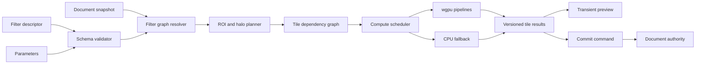
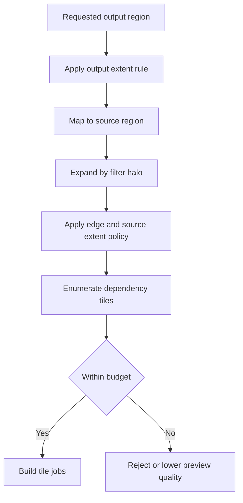
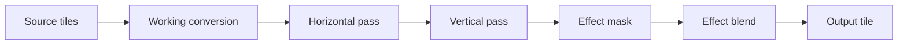
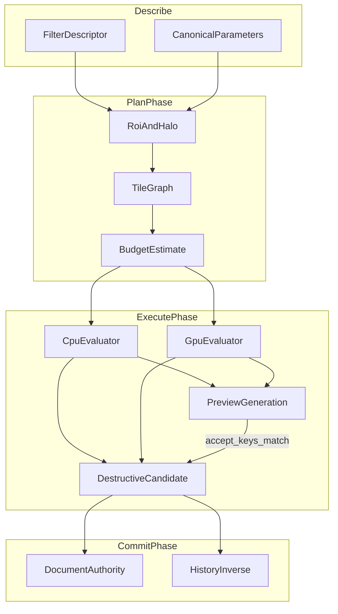

# 15 — Filter Engine

## Overview

The PhotoTux filter engine evaluates bounded deterministic image operations over immutable document snapshots. It supports nondestructive effect nodes, adjustment layers, transient previews, and explicit destructive application to raster edit surfaces. A filter descriptor defines semantics; parameters define one invocation; an evaluator produces derived tiles; only a command transaction may install changed authoritative pixels or persistent nodes.

Filters are GPU-first, not GPU-only. wgpu compute/render pipelines provide preferred acceleration. Every core filter **MUST** have a CPU implementation that is either the semantic reference or a validated equivalent fallback. Device capability, memory pressure, pipeline compilation, or device loss cannot make document truth inaccessible. GPU resources are derived or provisional until result chunks are recoverable by document authority.

Normative keywords follow [Requirement Keywords](Appendix/Requirement-Keywords.md). Filters inherit command, snapshot, history, layer, selection, mask, color, and rendering constraints from the linked specifications.

## Responsibilities

The filter engine **MUST**:

- register stable versioned descriptors with bounded parameter schemas;
- declare input/output formats, color space, alpha convention, precision, dimensions, and edge behavior;
- calculate conservative regions of interest and input halos;
- construct an acyclic tile dependency graph;
- support cancelable version-bound previews without mutation;
- represent nondestructive filter nodes as editable document objects;
- apply destructive filters through one command and zero or one transaction;
- provide CPU/GPU equivalence evidence under declared tolerances;
- schedule visible tiles before offscreen work while reserving save/recovery capacity;
- bound memory, queue depth, dispatch dimensions, recursion, and intermediate surfaces;
- reject stale results rather than overwrite newer edits;
- survive device loss by rebuilding or choosing CPU;
- persist semantic descriptors independently from Rust, shader, or toolkit layout;
- expose diagnostics and accessible progress without leaking image content.

It **SHOULD** fuse compatible operations when fusion preserves exact graph semantics and cache identity. It **MAY** use approximate reduced-resolution preview if labeled and final commit/export uses required quality.

## Architecture



### Internal hierarchy

```text
Filter subsystem
├── descriptor registry
├── parameter schema and canonicalizer
├── semantic graph resolver
├── ROI and halo analyzer
├── tile dependency graph builder
├── format/color/alpha negotiation
├── preview session manager
├── nondestructive node adapter
├── destructive apply coordinator
├── wgpu pipeline library
├── CPU reference/fallback kernels
├── scheduler and budget manager
├── cache and resource leases
├── persistence/migration adapters
└── diagnostics/conformance
```

## Descriptor Contract

```rust
struct FilterDescriptor {
    id: FilterId,
    schema_version: SchemaVersion,
    behavior_version: BehaviorVersion,
    parameter_schema: ParameterSchema,
    input_ports: BoundedList<InputPort>,
    output: OutputContract,
    extent_rule: ExtentRule,
    roi_rule: RoiRule,
    halo_rule: HaloRule,
    color_rule: ColorRule,
    alpha_rule: AlphaRule,
    precision_rule: PrecisionRule,
    edge_modes: BoundedSet<EdgeMode>,
    determinism: DeterminismContract,
    implementations: ImplementationSet,
    resource_limits: FilterLimits,
}
```

Descriptors are declarative. They **MUST NOT** contain executable callbacks in persisted documents. Built-in implementation binding occurs through a trusted registry keyed by ID and behavior version. Future extensions require isolation and capability policy; unknown implementations preserve node data and optional verified fallback rather than silently flattening.

Parameter schemas define type, units, finite range, default, enum values, array limits, nested depth, normalization, animation capability if ever introduced, and whether changes affect ROI or pipeline specialization. Unknown required fields reject. Optional fields use descriptor-version defaults. Display labels are not semantic IDs.

Canonicalization converts equivalent values to one deterministic representation: normalized angles, sorted control points where order is not semantic, canonical floating zero, normalized text encoding, and stable map order. It never changes an out-of-range value silently unless schema explicitly defines clamping.

## Filter Families

Core families include point operations, neighborhood convolution, separable blur, morphology, geometric resampling, frequency-domain operations, color transforms, compositing helpers, noise using fixed algorithms and seeds, and analysis-derived deterministic transforms. Every family defines bounds and edge semantics.

Point filters read one input sample and need no spatial halo. Neighborhood filters request a radius or kernel support. Separable filters may execute horizontal and vertical passes with an intermediate tile set. Geometric filters map output coordinates into source coordinates and compute potentially nonrectangular conservative input bounds. Global filters may require full-input analysis; they declare reduction phases and cannot masquerade as local tile filters.

No filter may rely on network data, user accounts, generated model output, or vendor-specific service semantics. Randomized local filters use a stable algorithm/version and explicit seed. Time is not an implicit input.

## Parameters and State

Filter parameter state exists in three forms:

1. presentation draft, mutable and view-local;
2. preview descriptor, immutable and bound to source snapshot;
3. committed node or destructive transaction parameters, authoritative.

Changing a slider updates preview state and cancels/coalesces older evaluation. Accept submits one command with exact target, source revisions, parameter digest, and preview quality independent final-quality policy. Cancel discards preview. Presentation cannot write an adjustment node directly.

Nondestructive nodes store descriptor ID/version, canonical parameters, input scope, masks, blend/opacity where applicable, coordinate context, and resource references. Derived output tiles are caches. Destructive apply stores output pixels in the target resource and history retains the prior/new manifests.

## Region of Interest and Halo

ROI maps requested output region to all source regions needed to compute it. Halo expands a source region for neighborhood support. Rules are semantic and conservative:

```text
requested output tile
└── output support bounds
    └── inverse transform or local mapping
        └── source ROI
            └── kernel halo
                └── source dependency tiles
```

A Gaussian blur descriptor defines sigma, radius mapping, truncation, and edge mode. Its halo is deterministic. A displacement filter includes maximum displacement plus interpolation support. A shadow filter shifts and expands bounds. A global histogram operation declares the full relevant extent as reduction input.

ROI arithmetic uses checked integer and floating operations. Infinity, NaN, wraparound, excessive radius, or output beyond configured extent rejects before allocation. Incorrect narrow ROI is a correctness failure. False-wide ROI is allowed but diagnosed because it wastes work.



Edge modes include transparent, constant, clamp, mirror, wrap, and operation-specific modes. Their coordinate formulas and behavior for empty extents are fixed. Nondestructive node semantics save the mode. Preview cannot choose another mode merely for speed.

## Tile Graph

Graph nodes represent source tiles, conversion nodes, filter passes, reductions, intermediates, composites, and outputs. Edges carry tile coordinate, required region, format, precision, profile, alpha, and generation. Graph construction is deterministic from snapshot and request.



The graph **MUST** be acyclic. Persistent filter dependencies participate in layer dependency cycle validation. Runtime graph cycles indicate invariant failure. Graph node IDs derive from semantic key material, not allocation order. Topological order has a stable tie breaker for tests and diagnostics.

Tile size is provisional and can differ between storage and compute. Planner handles borders and partial tiles explicitly. A filter cannot assume contiguous full-image memory. Multi-tile kernels read immutable source generations so parallel completion order does not change results.

## Preview Workflow

1. Presentation opens a preview session against snapshot N and target revisions.
2. Parameters are validated and canonicalized.
3. Resolver creates a preview graph for visible viewport and requested quality.
4. Scheduler cancels obsolete generations and prioritizes visible coarse-to-fine output.
5. Renderer composites preview as a transient branch above committed version N.
6. Accept submits a command with final parameters and applicability.
7. Nondestructive accept creates/updates a filter node; destructive accept prepares final tiles and commits manifests.
8. Cancel releases graph/cache leases and returns display to latest committed snapshot.

Preview never changes modified state or history. A preview can lag parameter input but must identify generation so old tiles cannot appear as current. Progressive preview may mix resolutions only under one parameter generation and source snapshot; it cannot mix semantic versions.

## Shipped adjustment kinds

`phototux_engine::AdjustmentParams` is the single home for the adjustment vocabulary. Each variant answers for its own wire key, display label, composite-shader op code, defaults, editor slots and CPU reference — so a kind is either complete everywhere or it does not compile.

| Kind | Key | Editor slots |
| --- | --- | --- |
| Brightness/Contrast | `brightness` | Brightness, Contrast |
| Levels | `levels` | Black, White, Gamma, Output Black, Output White |
| Exposure | `exposure` | Stops, Gamma |
| Hue/Saturation | `hue` | Hue, Saturation, Lightness |
| Invert | `invert` | *(none)* |
| Threshold | `threshold` | Level |
| Posterize | `posterize` | Levels |
| Vibrance | `vibrance` | Amount |
| Black & White | `black-white` | Red, Green, Blue |
| White Balance | `white-balance` | Temperature, Tint |

Colour-space conversion the kinds share lives in `phototux_engine`'s `color` module, not with the kind that uses it: `rgb_to_hsl` / `hsl_to_rgb` are what Hue/Saturation turns on, and the WGSL in `phototux_gpu::composite` mirrors them, so the parity fixture sweeping every kind on a real device is what holds the two implementations together. They sat in `layer.rs` — two of that file's twenty concepts and the only two with no layer in them — where a shader comment pointing at "phototux_engine::rgb_to_hsl" sent readers to the layer module.

Slots are positional: an entry's index in `editor_slots` *is* its index in `slots`, so a parameter cannot be described by one index and read from another. `MAX_ADJUSTMENT_SLOTS` (8) bounds the list, because the composite shader carries that many floats per layer — raising it is a uniform-layout change, and a kind wanting a curve or a gradient should take a lookup texture instead of a longer slot list.

Three rules hold the vocabulary together, each pinned by test:

- **`gpu_op` is never `0`.** Zero is the shader's "no adjustment", so a kind that reaches it renders as an invisible layer rather than as an error. This mapping previously lived in `phototux_gpu` behind a `_ => 0` arm, and four of the seven kinds fell into it — creatable, serializable, editable, and drawing nothing.
- **`slots` and `with_slots` are inverse.** The chrome edits an adjustment only through the three slots, so a parameter the projection drops is a control that silently does nothing.
- **`apply_rgb` is the reference the WGSL mirrors**, and a device-backed fixture composites every kind and compares against it. Without it there is nothing to notice a shader arm that was never added.
- **`editor_slots` is the only range.** `clamped` reads its bounds from that table rather than restating them, and `every_adjustment_slot_keeps_exactly_the_range_its_editor_offers` asserts every slot of every kind, in both directions. The two used to be written independently — a literal table for the sliders and a literal `clamp` per arm — and three slots disagreed: Levels and Exposure gamma were `0.1..=3` to the slider and `0.01..=10` to the clamp, Posterize `2..=32` against `2..=256`. The engine could therefore hold a value no slider could express, and the first touch of that slider would snap it back and change the document without being asked to. The narrower range is the one kept, because it is what the user can reach and no shipped document can hold anything outside it — the slider is the only writer. Widening gamma towards Photoshop's `0.10..=9.99` wants a non-linear slider first: neutral at 1.0 sits nine percent along a linear track of that width. The one rule a per-slot range cannot state stays written out — Levels' white point must remain above its black point, or the span inverts.

Adding a kind is a variant plus one arm in each method, an arm in the shader, and **nothing in the chrome**: the Properties editor builds itself from `editor_slots`, and the Layer-menu entry is generated from `ALL_KINDS`. Vibrance, Black & White and White Balance were added this way and reached the menu and the inspector with no QML edit at all.

## Shipped filter kinds

`phototux_engine::FilterParams` carries the filter vocabulary the same way `AdjustmentParams` carries the adjustment one: wire key, label, shader mode, defaults, editor slots and a significance threshold, all on the variant.

| Kind | Key | Editor slots |
| --- | --- | --- |
| Gaussian Blur | `gaussian` | Radius |
| Box Blur | `box` | Radius |
| Motion Blur | `motion` | Distance, Angle |
| Zoom Blur | `zoom` | Amount |
| Sharpen | `sharpen` | Amount |
| Unsharp Mask | `unsharp` | Radius, Amount |
| High Pass | `high-pass` | Radius |
| Clarity | `clarity` | Radius, Amount |
| Denoise | `denoise` | Radius, Amount |
| Add Noise | `noise` | Amount |
| Emboss | `emboss` | Strength, Angle |
| Invert | `invert` | *(none)* |
| Offset | `offset` | X, Y |

### The stack is a stack

`LayerRenderPlan.filters` is an ordered list of what the layer asks for, not one slot per kind. The slot form discarded three things at once, all of them silently:

- **Ordering.** A sharpen stacked before a blur ran after it, because the executor called its fixed helpers in a fixed sequence. Sharpening a blur and blurring a sharpen are different pictures.
- **Repeats.** Two Gaussian blurs merged into the larger radius. That is not what two blurs look like, and it is not what the effect stack in the Properties panel says is there.
- **Kinds with no slot.** A `_ => {}` arm absorbed Box Blur, Invert and Offset, so three kinds in the vocabulary could not render — and the gallery's own five-kind list refused them a preview as well.

Three executor shapes cover every kind, chosen by the kind rather than the call site: a separable blur (`gaussian`, `box`), a pass reading a blurred copy alongside the source (`unsharp`, `high-pass`, `clarity`, `denoise` — see `blur_radius_input`), and a plain one-input pass. Adding a kind is a variant, one shader mode, and nothing else: the Filter menu entry comes from `ALL_KINDS` and the gallery builds its sliders from `editor_slots`.

## Nondestructive Nodes

A nondestructive filter node preserves source and parameters. It may be an adjustment layer, ordered layer effect, fill/effect node, or another declared graph object. Its scope is explicit: one layer source, subtree result, clipped base, or bounded composite input.

```rust
struct FilterNodeRecord {
    object_id: ObjectId,
    revision: ObjectRevision,
    descriptor: PinnedFilterDescriptor,
    parameters: CanonicalParameters,
    input_scope: FilterInputScope,
    extent: ExtentPolicy,
    enabled: bool,
    opacity: UnitInterval,
    blend: BlendModeId,
    masks: BoundedList<ObjectId>,
}
```

Updating parameters is a command and one transaction. Renderer invalidates dependent tiles based on changed parameters, ROI, and node revision. Disabling bypasses evaluation without deleting source. Rasterize/Apply Filter is separate and discloses loss of editability.

Missing descriptor implementation leaves record present and unavailable. If an embedded verified fallback exists, renderer may display it while editability remains unavailable. Saving round-trips the semantic record. It never rewrites descriptor to a different available filter.

## Destructive Apply

Destructive apply operates on an immutable target and selection/mask context. It prepares complete changed tile resources outside document locks. Candidate includes source version, target generation/revision, source manifest digest, selection revision, filter descriptor/version, canonical parameters, affected regions, and inverse retention.

Commit revalidates applicability, installs new manifest, advances object/document revisions, registers history, and publishes delta atomically. If selection scopes application, unselected pixels retain original values and soft coverage interpolates filtered/original results under explicit linear/premultiplied semantics.

Multi-layer destructive application is atomic by default. A separately named batch command may report per-target results. Normal “Apply Filter” cannot partially mutate a target set while claiming one operation.

## Color, Alpha, Precision, and Format Negotiation

Every graph edge declares pixel format, channel meaning, color profile/space, transfer function, alpha representation, and numeric range. Filter descriptors state preferred semantic space. Convolution of color generally occurs in linear working space; filters intentionally operating on encoded values declare that behavior.

Alpha policies include independently filter color/alpha, preserve alpha, filter premultiplied channels, unpremultiply/filter/repremultiply, derive alpha, or reject alpha input. Unpremultiplication defines epsilon and zero-alpha color policy. Hidden RGB under zero alpha is never lost accidentally.

Intermediate precision is at least descriptor minimum and should match high-bit-depth document requirements. HDR values may exceed nominal one. Clamping occurs only at defined nodes. NaN/Infinity generated by arithmetic is normalized according to descriptor fault policy and diagnosed; uncontrolled propagation into GPU addresses or persistence is forbidden.

Format conversion nodes are explicit in graph and cache keys. [16 — Color Management](16-Color-Management.md) supplies pinned transforms. CPU and GPU use equivalent transform definitions.

## GPU Pipelines

wgpu implementations declare required features, limits, storage texture formats, workgroup assumptions, binding counts, and precision behavior. Registry maps one semantic behavior version to one or more implementation variants. Capability selection cannot alter semantics.

Pipeline keys include descriptor/behavior version, parameter specialization, input/output format, color/alpha policy, edge mode, workgroup variant, shader package version, and device generation. Compilation is asynchronous and outside document locks. Common pipelines may prewarm locally.

Dispatch dimensions use checked arithmetic and device limits. Uniform/storage buffers are bounded and initialized. Shader code is built-in or accepted only through a future validated extension boundary; document bytes never become arbitrary shader source. Readback validates row pitches and expected byte counts before constructing provisional resource chunks.

GPU fusion may combine conversion, point filters, and blending. Fusion is accepted only when dependency, rounding, clamp, alpha, and color ordering remain within the descriptor tolerance. A diagnostic mode disables fusion for differential analysis.

## CPU Equivalence

CPU kernels are portable semantic implementations. They process tiles with explicit halos and stable traversal. Parallelism partitions independent tiles or rows but reductions use deterministic combination order where result sensitivity matters. SIMD paths preserve lane-independent formulas and defined rounding.

Equivalence classes:

- exact: integer/channel permutations and specified fixed-point operations;
- bounded numeric: floating convolution, resampling, color transforms;
- perceptual bounded: only when descriptor explicitly defines a perceptual metric in addition to numeric safety bounds.

Tests record maximum/mean error, alpha error, edge behavior, and out-of-range handling. “Looks similar” is not conformance. If a GPU path exceeds tolerance, scheduler disables that variant and records local diagnostic; CPU remains available.

## Scheduling and Concurrency

Priority tiers:

1. input and authoritative short commits;
2. visible interactive preview tiles;
3. accepted foreground destructive preparation;
4. visible committed render dependencies;
5. save/recovery reserved work;
6. export final-quality work;
7. offscreen cache and thumbnails;
8. speculative precomputation.

Exact ordering between save and foreground work is budgeted so neither starves. Per-document commit authority serializes mutation, while graph evaluation runs concurrently from snapshots. Multiple views may request same semantic tile and share in-flight work through a keyed promise/lease.

Queues are bounded by jobs, graph nodes, CPU bytes, GPU bytes, and submissions. Parameter changes cancel old preview generations. Backpressure coalesces progress, drops speculative/offscreen work, lowers declared preview resolution, and rejects excessive requests before jeopardizing current authority.

Global filters reserve reduction/output resources before start. Chunked reduction uses bounded intermediates and cancellation checkpoints. No filter holds document locks while waiting on worker, GPU, profile, codec, filesystem, or extension work.

## Cancellation

Cancellation is hierarchical: document/session, preview session, operation, graph generation, tile job. It is idempotent. CPU kernels check at row/tile or bounded algorithm phases. Submitted GPU work generally cannot be preempted; cancellation marks results unwanted and prevents commit.

Before commit, cancellation releases outputs and creates no history. Once bounded authoritative install begins, cancellation reports finishing or committed. A destructive filter committed after late cancellation is undoable. Preview cancellation has no document effect.

If a filter algorithm has a long noninterruptible kernel, descriptor must bound duration per dispatch/chunk. Unbounded monolithic work is nonconforming.

## Cache and Resource Lifetime

Caches include graph plans, ROI results, converted source tiles, intermediate tiles, reductions, pipeline objects, bind groups, CPU kernel tables, and final derived tiles. Keys include all semantic inputs and source revisions. Cache entries have byte accounting, owner, device generation, last use, rebuild cost, and lease count.

Persistent nondestructive nodes do not own cached results. Snapshot leases pin source manifests. Preview leases are short and lowest retention priority. Save/export leases may outlive viewport requests. Device loss drops device entries. Missing caches affect latency only.

Eviction prefers speculative and old preview entries, then offscreen intermediates, then reconstructible committed-view tiles. It cannot evict unsaved authoritative chunks as filter cache. Shared entries account physical and logical bytes without double-free.

## Deterministic Behavior

Determinism requires descriptor/behavior version, canonical parameters, input snapshot/revisions, resource identities, color transform, edge rules, precision, seeds, reduction order, and implementation tolerance. Worker timing is not input. Hash-map iteration cannot set graph order. Random filters use coordinate- and channel-addressed streams.

Final export consistency uses same semantic graph as viewport, with export resolution/quality explicitly supplied. Preview approximations cannot leak into export cache keys. CPU reference can produce conformance output where device variation exceeds final policy.

## Failure, Device Loss, and Recovery

Schema, target, ROI, extent, budget, or graph validation failure produces no job or transaction. Worker failures release leases. One failed tile invalidates dependent output and returns a typed operation error; destructive apply cannot commit a partial manifest unless command explicitly defines independently valid regions.

On wgpu device loss, all device-generation pipelines, buffers, textures, and in-flight outputs are invalid. Preview displays last complete committed frame or CPU result. Nondestructive graph remains semantic document state. Destructive preparation restarts on replacement device or CPU from source snapshot if still applicable.

Out-of-memory causes staged pressure response: cancel speculative work, evict cache, reduce preview, choose lower-memory equivalent plan, use CPU streaming, or reject. It never changes filter radius, edge mode, precision floor, or output extent silently.

Recovery journals contain committed node records or destructive tile manifests/history according to policy, never transient previews. An interrupted apply before commit leaves no authoritative result. After commit, transaction is recoverable even if renderer notification was lost.

## Persistence and Versioning

Persisted nodes encode stable descriptor ID, schema/behavior version, canonical parameters, scope, edge/extent rules, masks, color/alpha semantics, and bounded resources. In-memory types, wgpu pipelines, and shader bytecode are not persistence contracts.

Migrations preserve semantic output. A changed blur radius mapping, resampling kernel, seed algorithm, border equation, or alpha order requires behavior adapter or new version. If exact migration is unavailable, node remains preserved/unavailable with optional verified fallback or document opening rejects when required for safe meaning.

Destructive results persist as ordinary authoritative pixels and history if format policy includes it. Export formats unable to represent nondestructive nodes receive a conversion/loss plan tied to exact snapshot version before replacement.

## Security, Privacy, and Accessibility

Imported filter graphs, parameters, kernels, metadata, and fallback blobs are hostile. Validators enforce graph depth/edges, parameter arrays, image extents, decompression, iteration limits, dispatch sizes, intermediate bytes, and time budgets. Filters receive immutable pixel/resource capabilities, not ambient filesystem access. No filter performs network requests.

Diagnostics redact parameter values when they may reveal content or user choices, along with layer names, paths, thumbnails, histograms, and pixels. Safe fields include descriptor IDs, dimensions bucketed by policy, node counts, timings, cache bytes, implementation tier, and error codes.

Accessibility exposes filter name, target scope, nondestructive/destructive consequence, parameters with units/ranges, preview state, approximate-quality state, progress phase, cancellation, unavailable reason, and completion. Keyboard users can navigate parameters, reset groups, accept/cancel preview, and invoke equivalent commands. Progress announcements are rate-limited.

## Design Rationale and Tradeoffs
**Tile graph versus whole-image buffers.** Tiles support documents larger than memory and precise invalidation. They add halo and scheduling complexity. Global filters use explicit reductions rather than abandoning tile architecture.

**Descriptor semantics versus shader-defined semantics.** Stable descriptors permit CPU fallback, migration, security, and headless tests. Shader-defined meaning couples documents to drivers and executable payloads.

**CPU reference versus GPU-only.** CPU costs implementation effort but enables conformance, recovery, unsupported hardware, and deterministic diagnostics.

**Nondestructive nodes versus eager apply.** Nodes preserve editability and support live changes but increase render graph cost. Explicit destructive apply remains available under history.

**Version-bound preview versus direct mutation rollback.** Isolated preview avoids noisy history and rollback hazards. It requires transient graph management and reconciliation.

**Conservative ROI versus exact geometric ROI.** Conservative bounds are simpler and safe; exact bounds reduce work but risk missing output. Optimization may tighten only with proof and tests.

## Best Practices

- Put semantic version in every descriptor and cache key.
- Define ROI/halo alongside reference tests.
- Canonicalize parameters before digesting or caching.
- Keep edge, alpha, color, and precision explicit.
- Allocate inverse/history resources before destructive commit.
- Prefer separable/streaming plans when semantically equivalent.
- Bound every global reduction and GPU dispatch.
- Test tiny images smaller than halo and empty extents.
- Disable failing GPU variants without disabling filter semantics.
- Never reuse preview-quality results for final export without matching keys.
- Keep persistent nodes declarative and non-executable.

## Future Extensibility

New local deterministic filters, multi-input nodes, richer graph optimization, and sandboxed contributions may be added after defining descriptor compatibility, ROI, halo, extent, color/alpha, CPU fallback, GPU validation, budgets, persistence, history, security, and accessibility. New graph optimizers must prove equivalence.

Alternative storage tile sizes, wgpu backends, and CPU vectorization can change behind contracts. Stable binary plugin ABI remains deferred. No extension can mutate documents outside commands or depend on cloud, accounts, generative systems, or proprietary workflows.

## Testability and Diagnostics

Headless fixtures evaluate exact tiny matrices and large sparse images. Golden cases cover each edge mode, alpha state, profile, precision, selection softness, ROI boundary, and halo overlap. Differential harness executes CPU and each supported wgpu tier.

Property tests assert finite outputs, bounds conservation, tile partition equivalence, deterministic graph order, cancellation cleanup, and unchanged authority on failure. Metamorphic tests compare tiled versus monolithic reference, separable versus direct kernels where mathematically equivalent, and repeated cache-cold/warm output.

Diagnostics connect action, preview generation, operation, graph, tile, pipeline, transaction, document version, and presented frame. They record queue wait, compilation, upload, dispatch, readback, CPU time, cache hit/eviction, stale rejection, and device loss.

## Acceptance Scenarios

### Halo correctness

Blur an impulse centered on a tile edge. Compare one-tile, multi-tile, CPU, and GPU execution. Assert no seam, complete halo dependencies, matching edge policy, and tolerance compliance.

### Stale destructive apply

Prepare filter at target revision 12 and selection revision 4. Paint target to revision 13 before completion. Assert commit rejects as stale, new paint remains, provisional output releases, and no history record appears.

### Nondestructive preview

Change parameters rapidly through ten generations. Assert obsolete jobs cancel, only latest generation presents, modified state/history remain unchanged until accept, and accept creates one node transaction.

### Device loss

Lose device between horizontal and vertical passes. Assert no partial destructive output commits, node remains editable, CPU/rebuilt GPU restarts from coherent source, and last complete frame is not labeled as new version.

### CPU/GPU equivalence

Evaluate HDR premultiplied input with zero-alpha colors, nonlinear display profile, and soft selection. Assert explicit conversion/alpha nodes, finite values, hidden-color policy, and numeric bounds.

### Global reduction under pressure

Run a histogram-based filter on a sparse large document under low memory. Assert bounded chunked reduction, visible progress/cancellation, no full-image allocation, deterministic reduction order, and either valid output or pre-commit rejection.

### Missing implementation

Open document with unknown optional filter version and verified fallback. Assert node and parameters round-trip, fallback may display as disclosed, editing is disabled, and save does not flatten silently.

### Host independence

Run descriptor validation, graph resolution, CPU evaluation, destructive commit, undo, save, and reopen headlessly. Assert no Linux toolkit or GPU surface dependency enters core.

## Extended Invariants and Neighbor Contracts

This section expands filter-engine depth for descriptors, ROI/halo correctness, tiled evaluation, preview versus commit, destructive apply atomicity, CPU/GPU equivalence, and neighbor contracts with selection, masks, color, and rendering.

### Descriptor and graph invariants

Every filter is described by a machine-readable descriptor naming ID, schema version, behavior version, parameter domains, color/alpha/precision contracts, edge modes, ROI/halo functions, CPU implementation presence, wgpu variants, and history/inverse planning for destructive capability. Registries reject duplicate semantic IDs and GPU-only core filters that lack CPU fallback for document correctness.

Evaluation graphs are directed acyclic tile graphs. Planning computes output extent, source ROI, halo, intermediate formats, and estimated bytes without mutating authority. Any runtime source read outside planned ROI/halo is a defect. Global reductions stream or chunk under deterministic order; incidental full-image allocations under low memory are non-conformant when a bounded algorithm exists.

Nondestructive nodes store parameters and input edges; caches are disposable. Destructive apply replaces target raster authority atomically with inverse data reserved for undo under history policy. Preview generations are transient, cancelable, and never history-bearing until accept.

### Edge cases

Empty inputs, one-pixel inputs, dimensions smaller than halo, and partial edge tiles have explicit edge-mode fixtures. Off-canvas ROI clamps under checked arithmetic. Separable kernels must match direct kernels where mathematics demands equivalence. Soft selections weight contributions; unrestricted versus empty selection scopes differ. Missing masks or resources fail typed validation.

HDR and negative values remain finite under declared policies. Zero-alpha hidden color follows alpha contract nodes explicitly inserted in the graph—no silent premultiply guesses. Quality knobs for preview versus export are cache keys, not hidden globals.

Unknown optional filter versions may round-trip with disclosed fallback display and disabled editing. Silent flattening on save is forbidden.

### Failure modes

Stale destructive apply against outdated target or selection revisions rejects without history entries. Device loss between passes prevents partial destructive install. Failures during inverse reservation, candidate validation, or install leave prior authority intact. Notification failure after install preserves the transaction and forces consumer resync.

Queue saturation cancels obsolete preview generations. Only the latest applicable generation may present as current preview. Accepting a preview reuses bytes only when snapshot, parameters, quality, color, alpha, and implementation keys match final policy; visual similarity alone is insufficient.

### CPU and GPU boundaries

CPU evaluators provide reference or tolerance-bounded reference output. wgpu variants advertise feature tiers and fallbacks. Core filters required for document open/edit **MUST** run headlessly on CPU. Pipelines compile against adapter limits before admitting jobs; unsupported combinations return capability errors before destructive work.

Color transforms required by a filter appear as explicit graph nodes owned with color-management contracts. The filter engine does not embed opaque third-party color behavior inside unlabeled passes.

### Concurrency and cancellation

Planning and evaluation may run on workers against leased snapshots. Parameter scrubbing allocates new preview generations and cancels old ones, including after GPU submission where the API allows. Destructive apply holds applicability tokens for target, selection, mask, and resource revisions. Tile completion reordering cannot change deterministic reduction results.

Cancellation granularity is declared per descriptor. Cancel before install is a no-op on authority. Budgets refuse plans that exceed hard resident-byte limits.

### Persistence

Nondestructive graphs persist by descriptor ID and canonical parameter encoding. Behavior version changes that alter output beyond tolerance require migration or unavailable state. Destructive results persist as ordinary raster tiles; the filter instance does not remain unless the command created a nondestructive node instead.

Export and viewport share semantic graphs with distinct quality/output keys. Cache sharing requires exact compatible keys.

### Neighboring subsystem contracts

- Document model: snapshot leases, versions, resource install.
- Layer system: adjustment layers and effect stacks host nondestructive nodes.
- Selection system: soft weights and ROI constraints.
- Mask system: optional inputs; halo includes mask blur when sampled.
- Brush engine: separate; filters do not inject into dab loops.
- Color management: explicit conversion nodes and profile resources.
- Rendering engine: executes graphs, presents previews, never bypasses command accept for authority.
- History: inverse planning for destructive apply; parameter transactions for nodes.
- Persistence: descriptor inventories and hostile parameter validation.



### Additional acceptance scenarios

#### Tile partition equivalence

Run a blur on a fixture once as monolithic CPU reference and once as forced single-tile-width partitions. Assert outputs match within tolerance and planner-declared halo edges were touched.

#### Preview accept key mismatch

Generate a preview at quality Q1, then change only the quality key and accept without recomputation. Assert accept either recomputes or refuses to install Q1 bytes as Q2 final; it never promotes mismatched keys.

#### Selection empty versus unrestricted

Run the same sharpen descriptor under unrestricted selection and under explicit empty selection. Assert unrestricted processes natural extent and empty is a structured no-op without pixel changes or history spam beyond the declared no-op policy.

#### Adjustment layer device loss

Scrub parameters on an adjustment layer, lose device, recover. Assert node parameters unchanged, preview rebuilds, and no destructive rasterization of the adjustment into the parent occurred.

#### Histogram cancellation

Start a histogram-based filter on a huge sparse document and cancel at mid-reduction. Assert no partial destructive install, reduction buffers release, and a subsequent run does not reuse half-finished reduction state.

#### Hostile parameter bomb

Load a document node with parameters claiming enormous kernel radii and iteration counts. Assert planning rejects pre-allocation, document opens with unavailable node or rejects per policy, and diagnostics omit pixel content.

### Conformance reminders

Publish descriptor inventories, planning traces, and tolerance corpora. Record device tier and behavior versions in evidence. Distinguish preview, nondestructive accept, and destructive apply in operation traces. Keep diagnostics local, bounded, and redacted.

### Operator algebra and tile commutativity notes

Where a descriptor claims separability, horizontal-then-vertical evaluation **MUST** match the monolithic kernel within tolerance on fixtures that include impulses on tile corners, constant HDR plateaus, and soft-selection ramps. Non-separable claims **MUST NOT** advertise separability for scheduling shortcuts. Commutativity of independent color-matrix nodes with spatial kernels is false in general; planners **MUST** preserve descriptor-declared node order even when algebraic rewrites appear tempting for performance.

Integer parameter quantization for UI widgets **MUST NOT** silently alter canonical parameter encoding used for cache keys and persistence. Displayed rounded values may differ from stored canonical values only when the schema defines an explicit display mapping. Undo restores canonical parameters, not widget-rounded approximations.

Cross-document paste of nondestructive filter nodes rewrites input edges to newly allocated layer IDs and rejects dangling references. Paste **MUST** validate parameter domains against the destination host’s descriptor inventory before commit; unknown required descriptors become unavailable nodes rather than destructive baked pixels.

## Acceptance Criteria

- Every filter mutation uses command and transaction authority.
- Descriptors fully define parameters, ROI, halo, edge, color, alpha, precision, and deterministic behavior.
- Tile graph evaluation is acyclic, bounded, and partition-independent.
- Nondestructive nodes preserve editability and survive missing caches/devices.
- Destructive apply is atomic and undoable under history policy.
- CPU fallback and wgpu paths meet declared equivalence.
- Preview is transient, cancelable, version-bound, and never mistaken for committed state.
- Device loss preserves document and permits reconstruction or CPU continuation.
- Persistence is semantic, versioned, hostile-input validated, and local-first.
- Export and viewport share semantic graph while keeping quality keys distinct.

## Implementation Conformance Contract

An implementation claiming conformance **MUST** publish a machine-readable descriptor inventory naming every built-in filter ID, schema version, behavior version, supported parameter domains, CPU implementation, wgpu variants, precision floor, and tolerance fixture set. Registry startup **MUST** reject duplicate semantic IDs, descriptors without bounded schemas, destructive-capable filters without inverse/history planning, and GPU-only core filters. A release changing observable output outside an existing tolerance **MUST** advance behavior version and retain a migration or unavailable-state policy.

Each evaluator **MUST** expose a planning mode that calculates output extent, source ROI, halo, intermediate formats, estimated resident bytes, dispatch count, and cancellation granularity without touching authoritative state. Planning estimates may be conservative, but measured hard-limit overruns **MUST** terminate before unsafe allocation. Tests **MUST** compare planner dependencies with instrumented reads; any source read outside declared ROI/halo is a defect, and any required sample omitted by planning is a correctness failure.

Conformance evidence **MUST** include empty input, one-pixel input, dimensions smaller than halo, partial edge tiles, off-canvas extent, negative/HDR values, straight and premultiplied alpha, zero-alpha hidden color, soft selection, missing mask/resource, and maximum valid parameter cases. Every edge mode **MUST** have exact coordinate fixtures. Global operations **MUST** demonstrate bounded streaming or reduction rather than incidental full-image allocation.

Preview tests **MUST** force rapid parameter changes, out-of-order worker completion, cache eviction, queue saturation, and cancellation after GPU submission. Only latest applicable generation may present as current. Accepting preview **MUST** recompute or reuse results only when source snapshot, parameters, quality, color, alpha, and implementation keys match final policy. A visual preview match alone is insufficient evidence.

Destructive-apply tests **MUST** inject failure during source acquisition, CPU/GPU preparation, readback, inverse reservation, candidate validation, authoritative installation, history publication, and snapshot notification. Failures before installation leave target, version, history, and modified state unchanged. Notification failure after installation preserves committed transaction and forces consumer resynchronization.

Operational diagnostics **SHOULD** allow engineers to reconstruct graph planning without recording pixels: descriptor/version, canonical parameter digest, node kinds, ROI rectangles, halo sizes, tile edges, formats, color/alpha contracts, implementation tier, and timings. Diagnostic export remains explicit, local, bounded, and redacted.

## Cross References

- [00 — Introduction](00-Introduction.md)
- [08 — Command System](08-Command-System.md)
- [10 — Document Model](10-Document-Model.md)
- [11 — Layer System](11-Layer-System.md)
- [12 — Selection System](12-Selection-System.md)
- [13 — Mask System](13-Mask-System.md)
- [14 — Brush Engine](14-Brush-Engine.md)
- [16 — Color Management](16-Color-Management.md)
- [17 — Rendering Engine](17-Rendering-Engine.md)
- [20 — History and Undo](20-History-Undo.md)
- [Glossary](Appendix/Glossary.md)
- [Requirement Keywords](Appendix/Requirement-Keywords.md)
