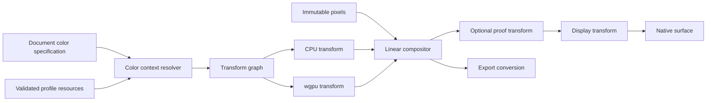
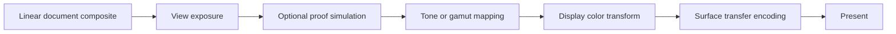
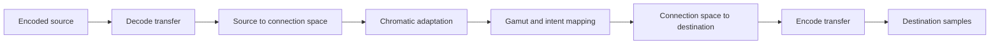
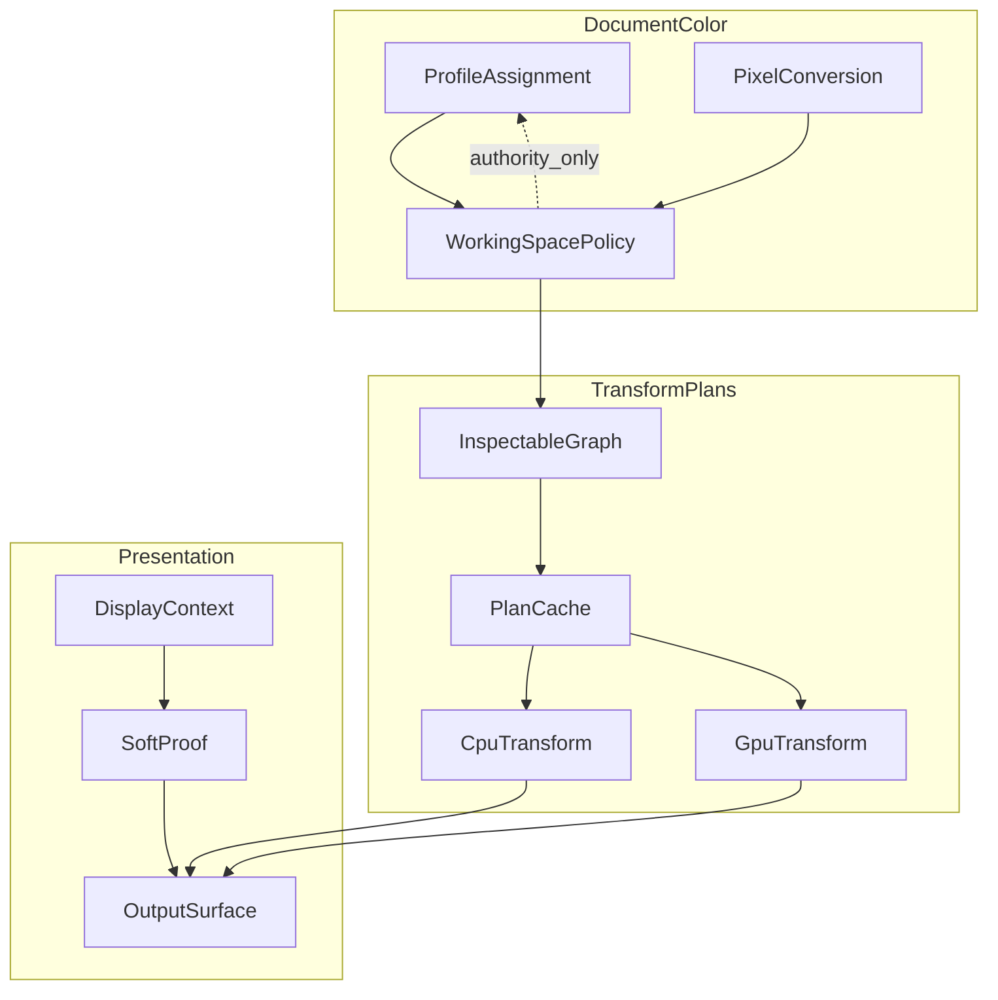

# 16 — Color Management

## Overview

PhotoTux color management defines how numeric samples acquire color meaning, how document working values are converted for compositing, proofing, display, and export, and how profile resources survive save/reopen. It separates profile assignment from pixel conversion, document working space from display space, and scene/display-referred values from storage encoding. Color is authoritative document semantics; monitor transforms and GPU lookup resources are derived.

The system supports high-bit-depth integer and floating-point images, wide gamut, HDR values, scalar channels, straight and premultiplied alpha, and local Linux display integration. Rendering is GPU-first through wgpu, with CPU reference/fallback transforms for unsupported devices, export consistency, diagnostics, and device loss. Normal editing remains local-first and requires no network, account, remote profile service, or proprietary workflow.

Normative meanings follow [Requirement Keywords](Appendix/Requirement-Keywords.md). Canonical ownership and snapshot rules come from [00 — Introduction](00-Introduction.md) and [10 — Document Model](10-Document-Model.md).

### Accepted v1 (shipping)

Foundation only: `document.assign-profile` and `document.convert-profile` for built-in sRGB ↔ Display-P3 ([DR-012](Appendix/Decision-Register.md#dr-012--assign-profile--convert-profile)). Soft-proof, display ICC discovery, and arbitrary ICC byte pipelines remain **Deferred**.

## Responsibilities

Color management **MUST**:

- attach explicit interpretation to every color-bearing authoritative buffer;
- distinguish assigning a profile from converting pixel values;
- define document working, compositing, display, proof, export, and resource spaces;
- composite color in a declared linear-light representation unless a blend descriptor explicitly requires another space;
- define transfer functions, primaries, white point, adaptation, range, precision, and channel order;
- define straight/premultiplied alpha and zero-alpha color behavior at every boundary;
- support high-bit-depth and HDR values without implicit clamping;
- build deterministic versioned transforms from validated local profiles;
- provide CPU and wgpu execution under stated tolerances;
- cache transforms with complete semantic and device identities;
- integrate Linux display-profile discovery behind host adapters;
- preserve document integrity when profiles are absent, malformed, changed externally, or unsupported;
- expose proofing and display warnings without mutating document pixels;
- validate profile data as hostile input;
- retain accessible semantic status independent of color-only UI cues.

It **SHOULD** minimize repeated conversions and quantization. It **MAY** use matrix/TRC fast paths, multidimensional lookup tables, or specialized HDR pipelines when output remains conformant.

## Architecture



### Internal hierarchy

```text
Color subsystem
├── profile resource store
│   ├── embedded document profiles
│   ├── application-local profiles
│   ├── host-discovered display profiles
│   └── preserved unavailable profiles
├── color-space descriptors
├── transform builder
│   ├── decode transfer
│   ├── matrix/LUT conversion
│   ├── chromatic adaptation
│   ├── gamut mapping intent
│   └── encode transfer
├── compositing-space policy
├── alpha conversion policy
├── proofing pipeline
├── HDR/display mapping
├── CPU evaluator
├── wgpu evaluator
├── transform/LUT cache
├── Linux host adapter
└── diagnostics/conformance
```

## Color Object Model

```rust
struct DocumentColorSpec {
    working_profile: ProfileRef,
    compositing_space: CompositingSpace,
    channel_model: ChannelModel,
    storage_precision: SampleFormat,
    alpha: AlphaConvention,
    reference_range: ReferenceRange,
}

struct ColorSpaceDescriptor {
    id: ColorSpaceId,
    profile_revision: ProfileRevision,
    channel_model: ChannelModel,
    primaries: Optional<Primaries>,
    white_point: Optional<WhitePoint>,
    transfer: TransferFunction,
    range: NumericRange,
}

struct ColorTransformKey {
    source: ColorSpaceIdentity,
    destination: ColorSpaceIdentity,
    intent: RenderingIntent,
    adaptation: AdaptationPolicy,
    black_point: BlackPointPolicy,
    precision: TransformPrecision,
    alpha: AlphaTransformPolicy,
}
```

Conceptual fields do not freeze Rust layout or profile library. IDs are stable semantic identities; content digests verify bytes but are not sole identity. Every buffer contract includes color descriptor or states explicitly that values are scalar/non-color.

## Color Spaces and Roles

The **source space** interprets imported or embedded pixel values. The **document working space** is the editable document-wide reference unless layers retain explicit source spaces. The **compositing space** is the linearized representation used while combining layers. The **display space** describes a monitor/output path. The **proof space** simulates a selected delivery process. The **export space** is chosen by export command.

These roles may reference the same profile but remain semantically distinct. Changing display profile never marks document modified. Changing working profile through conversion does. Assigning a profile changes interpretation metadata while leaving numeric samples unchanged. Converting profile transforms samples to preserve appearance as defined by intent.

```text
Authoritative path
stored samples + assigned profile
        ↓ decode
working color meaning
        ↓ linearize
compositing values
        ↓ document graph
committed semantic image

Presentation path
semantic image → proof simulation → display conversion → surface encoding
```

No component may infer sRGB-like semantics merely because samples are 8-bit RGBA. Missing interpretation follows explicit import policy: ask, use configured default with disclosure, preserve untagged status, or reject where ambiguity is unsafe.

## Profile Resources

Profiles are bounded immutable resources with stable IDs, schema/type, validated bytes, content digest, parsed summary, source provenance, revision, and persistence policy. Embedded profiles travel with documents. Display profiles are host resources and never silently become embedded working profiles. Local application profiles are user-managed resources.

Profile parsing runs outside document locks and treats bytes as hostile. Limits cover total size, tag count, offsets, overlapping ranges, LUT dimensions, channel counts, recursion, text metadata, numeric tables, and arithmetic. Unsupported tags are preserved when safe but cannot influence execution without validation.

An embedded profile referenced by authoritative pixels cannot depend only on an evictable cache. Parsed structures and GPU LUTs are derived; original validated bytes or canonical semantic representation remain retained. Profile names are display metadata, not identity.

Missing profile behavior is typed:

- required working profile missing: document opens degraded/read-only or rejects according to recoverability;
- display profile missing: use declared fallback display assumption and warn without document mutation;
- proof profile missing: disable proof view while preserving proof preference/reference;
- export profile missing: reject export conversion or request explicit replacement;
- optional layer profile missing: preserve layer and render disclosed fallback/unavailable state.

## Assignment and Conversion Commands

`color.assign-profile` changes interpretation. It names target scope, profile resource, and consequence. It normally changes appearance because numeric values remain unchanged. `color.convert-profile` reads source snapshot, transforms samples, updates profile reference, and commits changed tile resources atomically. These commands are never aliases.

Conversion workflow:

1. resolve target pixels and exact source profile/revision;
2. validate destination profile and conversion policy;
3. present gamut/alpha/precision consequences where needed;
4. capture immutable source snapshot and selection scope if applicable;
5. prepare transformed sparse tiles using CPU or wgpu;
6. build inverse retention before commit;
7. revalidate source object/profile revisions;
8. install pixel manifests and destination profile in one transaction;
9. publish color/resource dirty delta;
10. invalidate all dependent render/filter caches.

Changing document working profile may require all color-bearing layers, generated colors, gradients, swatches, filter parameters, and embedded resources to follow a declared policy. Partial conversion that leaves ambiguous mixed semantics is forbidden. Mixed-space layer support, if enabled, records each layer source explicitly.

## Transfer Functions and Linear Compositing

Transfer decoding maps stored encoded values to linear light or another declared scene representation. Matrix/TRC profiles may use analytic or sampled curves. LUT profiles use validated interpolation. Negative and above-one values follow profile and numeric-range policy rather than automatic clipping.

Layer blending ordinarily uses linear-light premultiplied values:

```text
Cs = decode_and_convert(source_rgb)
As = source_alpha
Ps = Cs × As
Cd = destination_linear_rgb
Ad = destination_alpha
Pd = Cd × Ad
Pout = Ps + Pd × (1 - As)
Aout = As + Ad × (1 - As)
```

Blend modes may require unassociated colors. Their descriptor defines safe unpremultiplication, blend function, alpha equation, and repremultiplication. Legacy or explicitly encoded-space blend modes are separate semantic IDs. Renderer cannot choose encoded blending as an optimization.

Compositing space defines primaries/white point and linear transfer. Working encoded space and compositing linear space share colorimetry unless policy specifies a wider internal space. Choosing a wider internal space requires explicit gamut handling and conformance fixtures.

## Alpha and Premultiplication

Alpha is coverage/opacity, not a color channel. It does not pass through color profiles. Buffers declare straight or premultiplied representation. Premultiplication occurs in linear compositing space unless a specific interchange contract states otherwise.

Unpremultiplication uses:

```text
if alpha > epsilon:
    straight = premultiplied / alpha
else:
    straight = zero_alpha_policy
```

`epsilon` and zero-alpha policy are format/operation semantics. Options include preserve hidden straight color from authoritative storage, canonical zero, or unavailable. Conversion must not amplify noise near zero uncontrollably. Premultiplied values satisfy bounded relationship only when numeric range is normalized SDR; HDR and negative values require more nuanced validation.

Applying masks multiplies premultiplied color and alpha consistently. Erasing is alpha modification, not painting black. Filters declare whether they preserve, transform, or independently process alpha. Export conversion includes explicit straight/premultiplied boundary.

## High-Bit Depth and Numeric Precision

Supported sample classes include normalized integers, half/float formats, and potentially wider CPU working values. Every operation declares minimum precision and rounding. Eight-bit display output does not reduce document authority. Intermediate pipelines avoid repeated encode/decode and quantization.

Integer conversion specifies scaling, round-to-nearest policy, saturation, and dithering where used. Floating conversion specifies NaN, infinity, subnormal, negative, and above-range behavior. Invalid non-finite authoritative samples are sanitized only through an explicit import/repair policy; derived arithmetic failures are diagnosed and contained.

HDR values are not equivalent to wide gamut. Reference range records nominal diffuse white, peak assumptions where applicable, and scene/display-referred interpretation. Values above one remain valid in linear intermediates. Tone mapping is a display/export operation unless committed through a named filter/command.

## HDR Display and Tone Mapping

Display output context includes profile/colorimetry, transfer function, luminance capability, surface format, compositor support, and user proof/display policy. Linux host adapter reports capability; core resolves semantic output. Capability can change when moving a window between displays.

HDR presentation pipeline:



View exposure and display tone mapping are view state unless user applies them to document. Moving a view to SDR display changes only presentation. Two views may show different display/proof contexts while sharing one document.

If native HDR output is unavailable, renderer uses declared SDR mapping and status. It never clamps silently and claim HDR conformance. Screenshots/export specify whether they capture document, proofed view, or presented surface.

## Proofing and Gamut Warning

Soft proofing simulates conversion to proof profile and optional return to display. Proof setup defines profile, rendering intent, black-point policy, paper/black simulation, adaptation, gamut-warning criterion, and display transform. It belongs to view/workspace state unless document explicitly stores output intent metadata.

Gamut warning is a view overlay derived from a defined criterion. It does not alter pixels or modified state. Overlay uses more than color alone: pattern, boundary, status, or accessible description. Warning thresholds and colors are preferences and included in overlay cache keys.

Proof transforms are pinned per frame. A profile change invalidates proof cache. Missing proof profile disables simulation with clear status; it does not fall back to a different profile silently.

## Transform Construction

A transform graph may contain transfer decode, matrix conversion, LUT interpolation, chromatic adaptation, gamut mapping, black-point adjustment, proof round trip, and transfer encode. Builder validates channel compatibility and creates a canonical ordered graph.



Rendering intent semantics are stable IDs. Unsupported intent/profile combinations return typed status. Transform quality specifies interpolation and LUT resolution, but preview/final variants must meet separate tolerances and have distinct keys.

CPU transform is canonical reference where practical. GPU representation may bake graph into 1D/3D LUTs plus matrices. LUT construction itself uses pinned CPU evaluation or validated equivalent. Tetrahedral/trilinear interpolation choice is semantic. Matrix multiplication order and adaptation model are versioned.

## GPU and CPU Boundaries

wgpu resources include profile curve textures, 3D LUTs, uniform matrices, proof LUTs, and surface conversion pipelines. They are keyed by transform identity, quality, formats, and device generation. They may be evicted and rebuilt.

Document pixels remain authoritative in CPU-addressable/recoverable chunks. GPU conversion used for destructive profile conversion reads back validated output before commit. Display conversion remains derived and need not read back. Export may choose CPU for deterministic reference or GPU when validated and recoverable.

Feature limitations trigger equivalent multipass or CPU path. A device lacking 3D texture precision cannot silently use lower precision below policy. Shader compilation and LUT upload occur outside document locks. Device loss discards GPU transforms only.

## Transform Cache and Resource Lifetime

Transform cache identity includes:

- source/destination profile IDs, revisions, and validated digests;
- intents, adaptation, black-point, proof options;
- source/destination formats and numeric ranges;
- alpha handling and zero-alpha policy;
- transform behavior/library version;
- interpolation/quality;
- device generation for GPU resources.

CPU canonical transforms may be shared across documents because profiles are immutable. GPU instances belong to a device. Cache entries expose logical/resident bytes, build cost, lease count, and privacy classification. Eviction affects latency only.

Profile replacement creates a new resource revision. Existing snapshots retain old profile lease. Active save/export continues with captured revision. Display profile change creates new host generation and schedules new frames; old complete frame may remain until replacement is ready.

## Scheduling, Concurrency, Cancellation, and Backpressure

Display transform work is frame-critical and prioritized with viewport rendering. Profile parsing, LUT construction, destructive conversion, proof cache, and export run asynchronously. Per-document color mutations serialize through command authority. Read-only transforms consume snapshots concurrently.

Queues are bounded. Repeated display-profile events coalesce to latest per view, but a frame uses one coherent output context. Proof parameter changes cancel obsolete generations. Cache construction uses in-flight sharing so identical requests do not duplicate large LUTs.

Destructive conversion checks cancellation at tile boundaries. Before commit it has no effect. GPU submissions may finish after cancellation but results are discarded. Commit is bounded/noninterruptible. Backpressure drops speculative proof/gamut tiles, reduces labeled preview quality, evicts transforms, streams conversion, or rejects before changing semantics.

## Deterministic Behavior and Export Consistency

Transform output is determined by profile bytes/revisions, canonical graph/version, intent, numeric formats, interpolation, alpha policy, and input values. Worker scheduling and hash order are not inputs. CPU/GPU differences must satisfy format-specific tolerances.

Viewport and export share transform semantics but may use different target profile, resolution, tone mapping, and quality explicitly. Export never captures compositor-managed presentation accidentally. “Export proof appearance” is a distinct option that serializes exact proof pipeline into export plan.

Final export records source snapshot version and color plan. Edits or display-profile changes during export do not alter it. Export conversion failure leaves document unchanged and destination follows staged-write policy.

## Linux Color Integration

Linux-native host adapters discover per-output profile and color capability through available desktop/compositor services and local configuration. Core contract returns output identity, profile bytes/capability, generation, confidence/source, HDR metadata where available, and typed unavailable state. It does not expose toolkit objects.

Window movement across outputs may involve one primary output or policy for spanning. Host emits generation change; view rebuilds display transform. If service is absent, fallback display assumption is explicit and status accessible. Application does not search arbitrary filesystem paths based on document metadata.

Profile chooser uses native/portal file capabilities where appropriate. Imported profile bytes are copied/embedded or referenced according to user choice and capability policy. Core never assumes a persistent path authority from chooser display name.

## Failure and Device-Loss Recovery

Malformed profile rejects or enters preserved unavailable resource state before use. Transform build failure identifies source/destination and preserved document state. Failed display transform keeps last complete frame or declared safe fallback, with warning. It never mutates profile assignment.

GPU device loss invalidates all GPU color resources and surface context. Renderer rebuilds from immutable snapshots and CPU transform definitions. CPU display path may provide degraded output if presentation stack allows. Authoritative pixels, profiles, history, and modified state remain unchanged.

Out-of-memory evicts LUT/profile parse caches, reduces preview quality, selects streaming CPU conversion, or rejects. It cannot lower final conversion precision silently. External display profile disappearance affects view only. Embedded profile corruption discovered after open moves affected content to explicit degraded state; repair is a command.

## Persistence, Migration, and Compatibility

Editable save stores document color specification, embedded profile resources, per-layer exceptions, reference ranges, alpha conventions, and semantic transform/filter parameters. It does not store device handles, monitor transforms, GPU LUTs, or parsed library objects.

Schemas are versioned independently from implementation. Migration preserves color meaning. Changes to transfer equation, matrix convention, adaptation, LUT interpolation, white scaling, tone map, alpha handling, or rounding require compatibility adapter or new behavior version.

Formats unable to preserve profiles, HDR range, high bit depth, alpha, or mixed spaces produce a loss report before destination replacement. Assigning fallback profile during import is recorded provenance and user-visible; it cannot masquerade as embedded source truth.

## Security, Privacy, and Accessibility

Profiles and metadata are untrusted parsable binaries. All offsets/counts/lengths use checked arithmetic. Parsing and transform construction have CPU/memory/time limits and cancellation. Profile text does not become filesystem path, executable code, shader source, or capability.

Document profiles, output names, paths, sampled colors, images, and metadata are private. Diagnostics redact them by default. Local logs can retain profile type, size, validated tag counts, transform IDs, timing, cache bytes, and error codes.

Accessibility exposes document working profile status, bit depth, HDR/SDR interpretation, alpha convention, proof status, display-profile availability, gamut-warning state, and conversion consequences. Assignment and conversion actions use distinct names/descriptions. Warnings never rely only on hue. Profile lists and settings are keyboard navigable, and progress is rate-limited.

## Design Rationale and Alternatives
**Explicit profiles versus assumed encoding.** Assumptions simplify common files but silently misinterpret professional content. Explicit untagged policy preserves honesty.

**Linear compositing versus encoded compositing.** Linear behavior follows light arithmetic and avoids halos, while some legacy appearances differ. Explicit legacy blend IDs preserve compatibility without compromising default.

**Premultiplied intermediates versus straight.** Premultiplication simplifies compositing and filtering edges. Straight authoritative storage may preserve hidden colors. Controlled conversion boundaries support both.

**CPU reference plus GPU execution versus one library path.** Dual paths cost testing but ensure fallback, device recovery, and headless export. Canonical transform graphs prevent semantic drift.

**Host display profile as view state versus document state.** Display conditions vary per machine/output and cannot define document meaning. Document output intent may persist separately.

**Embedded profiles versus external references.** Embedding improves portability and determinism. References reduce duplication but need capability and missing-resource policy. Working profiles should generally be embedded.

## Best Practices

- Tag every color buffer and every scalar buffer explicitly.
- Decode transfer before ordinary compositing.
- Keep alpha out of profile transforms.
- Include zero-alpha policy in filter/blend contracts.
- Pin profile revisions for snapshots, saves, and exports.
- Distinguish view tone mapping from document edits.
- Avoid repeated encode/decode and eight-bit intermediates.
- Treat HDR range and gamut as separate axes.
- Validate profile bytes before allocation or GPU upload.
- Differential-test CPU and wgpu transforms.
- Keep display integration in host adapters.
- Never clear modified state after export-only conversion.

## Future Extensibility

Future support may include additional channel models, spectral metadata, richer HDR output contexts, advanced proof conditions, device-link resources, and platform hosts. Each addition **MUST** define interpretation, transform graph, alpha, precision, fallback, persistence, security, accessibility, and conformance fixtures.

Alternate profile engines may replace implementation if semantic/version contracts and fixtures pass. New GPU algorithms require CPU/reference evidence. Extensions cannot inject arbitrary transform code or network dependencies.

## Testability and Diagnostics

Headless tests use analytic profiles, known matrices/curves, malformed profile corpus, high-bit-depth ramps, HDR/negative values, zero-alpha hidden colors, and proof round trips. Golden fixtures state numeric tolerances and rounding.

Property tests verify identity transforms, finite handling, premultiply/unpremultiply bounds, cache-key separation, snapshot pinning, and unchanged authority on failures. Controlled schedulers race profile change, save, display migration, and destructive conversion.

Diagnostics record profile/transform IDs, revisions, transform graph node kinds, CPU/GPU tier, build/evaluation time, cache hits/bytes, precision, display generation, device loss, stale result, and typed errors. No pixels or private names by default.

## Acceptance Scenarios

### Assign versus convert

Duplicate one image. Assign destination profile to first and convert second. Assert first numeric pixels unchanged and appearance changes; second pixels change under intent to preserve appearance; both are separate undoable transactions.

### Linear blend

Composite known semitransparent encoded colors. Assert decode, linear premultiply, blend, display encode order. Compare CPU/GPU and reject encoded shortcut under normal blend ID.

### Zero-alpha conversion

Convert pixels containing alpha zero with nonzero hidden RGB. Assert declared preservation/canonicalization policy, no division explosion, deterministic output, and round-trip behavior.

### Display migration

Move one view between outputs with different profiles while another view remains. Assert document version/modified state unchanged, each frame uses coherent transform generation, and views differ only by presentation.

### HDR fallback

Open HDR document on SDR-only host. Assert values remain authoritative above one, view uses declared mapping, status reports SDR fallback, and export to HDR retains source range.

### Device loss

Lose wgpu device during proof transform. Assert profile/document resources survive, GPU cache clears, CPU/rebuilt GPU restores output, and no document mutation/history occurs.

### Malformed profile

Parse profile with overflowing tag offsets and huge LUT dimensions. Assert rejection before allocation/read, no resource registration, bounded diagnostic, and document stays safe.

### Concurrent export

Export snapshot N to selected profile while changing working profile at N+1. Assert export uses pinned N plan, current remains modified, and no display profile enters export identity.

## Extended Invariants and Neighbor Contracts

This section deepens color-management contracts for explicit buffer labeling, assignment versus conversion, linear compositing, HDR precision, CPU/GPU transforms, Linux display integration, persistence of profiles, and neighbor boundaries.

### Color object invariants

Every color-bearing buffer carries explicit color space, transfer function, channel model, numeric precision, range, and alpha semantics. Untagged buffers are forbidden in portable core paths. Working buffers used for compositing follow the document’s declared working policy, typically linear premultiplied under named encoding. Display-referred preview buffers are separate objects with presentation contracts and **MUST NOT** be written back as authority without a conversion command.

Profiles are resources with digests, classes, and parse generations. Transform plans are inspectable graphs: decode, source-to-connection, chromatic adaptation, intent mapping, destination encode, alpha boundary handling, clamp points, and LUT interpolation. Hidden library defaults that affect pixels are non-conformant where avoidable; any unavoidable native limitation is declared in capability matrices.

Assignment and conversion are distinct commands. Assignment attaches interpretation without resampling pixels. Conversion rewrites samples into a destination space and advances resource revisions. Proof simulation and view exposure adjustments are presentation or explicit soft-proof modes; they do not mutate document profiles unless the user accepts a conversion.

### Edge cases

Out-of-gamut colors, negatives, and above-one values in HDR ranges remain representable through transforms that declare clipping or gamut-mapping behavior. Near-black ramps test TRC precision. Integer endpoints and half-float paths have fixture corpora. Premultiplied edges and zero-alpha hidden color require explicit alpha policy nodes. Grayscale, matrix/TRC, and multidimensional LUT profiles exercise different plan shapes.

A window spanning multiple outputs with different display profiles selects presentation transforms per output or per surface region under host policy; document assignment remains unchanged. HDR capability hotplug updates presentation only. Absent color services degrade to declared fallback presentation without rewriting authority.

### Failure modes

Malformed profiles—overlapping tags, cyclic references, invalid signatures, huge tables, truncated curves, duplicate tags, malformed text, unsupported channels, decompression bombs, arithmetic overflow—fail parse before registration. Partially trusted profiles never enter the cache. Transform construction failure aborts the commanding operation before pixel writes.

Device loss invalidates GPU LUT textures and matrix uniforms bound to a device generation. CPU transforms continue. Display-profile loss cannot change document authority or modified state. Export that loses an embeddable profile reports loss before destination replacement.

### CPU and GPU boundaries

CPU transforms are the conformance reference path. wgpu variants may use LUTs, shapers, or matrix shaders at declared quality tiers. Caches key by complete profile digests, intent, adaptation, alpha policy, quality, precision, and device generation—not by display names or file paths. Linux integration adapters supply ICC or system profile bytes into portable resource registration; adapters remain outside portable core types.

Compositor linearization uses the same contracts as explicit conversions. Brush and filter engines request conversions through color services rather than ad hoc matrices.

### Concurrency

Transform plan building may run off-thread. Results are immutable and shareable. Profile parse is idempotent under digest. Concurrent display hotplug updates presentation context generations; in-flight export captures a stable snapshot and color plan at start and ignores later hotplug for that job.

Commands that assign or convert revalidate resource IDs at commit. Stale plans referencing replaced profiles reject.

### Persistence and migration

Documents embed or reference profiles per disposition policy. References do not auto-fetch from the network. Missing referenced profiles open as unavailable color interpretation with disclosed status; ambient search of the host disk beyond granted capabilities is forbidden. Migration of working-space defaults is a semantic conversion with acceptance.

Proof settings may persist as document-associated soft-proof state if the product so defines; pure view preferences remain workspace-local. Accessibility announcements describe color mode and profile presence without reading profile copyright strings unless the user navigates metadata.

### Neighboring subsystem contracts

- Document model: stores profile resources and color specs on canvas/objects.
- Layer system: buffers carry color contracts into compositing.
- Selection and mask systems: scalar; not color-managed as RGB.
- Brush engine: converts tool color into target space before blend.
- Filter engine: inserts explicit color/alpha nodes in graphs.
- Rendering engine: builds presentation transforms from display context + document snapshot.
- History: assignment/conversion/proof acceptance are distinct transaction kinds.
- Persistence: semantic profiles or explicit loss.
- Security: hostile profile parse limits; redacted diagnostics.



### Additional acceptance scenarios

#### Assignment without resample

Assign a new interpretation profile to a raster layer whose bytes are already in that encoding. Assert resource digest of pixels unchanged, color spec revision advances, one history entry, and visual change—if any—comes only from interpretation, confirmed by conversion-to-self digest equality fixtures.

#### Conversion vs proof

Enable soft proof toward a CMYK-like simulation profile, then export with document RGB profile. Assert export bytes follow export plan, not the proof view, unless export explicitly includes proof. Document assignment unchanged by toggling proof.

#### Hotplug during paint

Begin a brush stroke, hotplug a display with a different profile mid-stroke. Assert authoritative dab colors follow the stroke’s captured document/target plan; presentation may update between frames without recoloring committed tiles.

#### GPU LUT eviction

Build a GPU transform cache, force eviction and device generation bump, re-render. Assert CPU and new GPU path meet tolerance and document version/profile assignment unchanged.

#### Hostile profile import

Import a profile with a decompression bomb table. Assert rejection before catalog registration, no partial cache entry, and diagnostics contain parser codes without dumping table bytes.

#### Multi-view proof divergence

Open two views of one document; enable proof in one only. Assert both edit the same authority, proof view differs in presentation only, and a conversion command from either view affects the shared document once.

### Capability and evidence checklist

Enumerate supported profile classes, intents, sample formats, alpha policies, HDR modes, and transform tiers. Conformance corpora cover ramps, primaries, near-black, OOG, NaN/Inf containment, and LUT structures. Reports record OS color stack presence, corpus revision, hardware tier, tolerances, and justified deviations.

### Working-space policy and buffer tagging discipline

Pipelines that create intermediate buffers **MUST** tag each buffer at allocation time. Untagged intermediates are defects even if subsequent code “knows” the space. Premultiply and unpremultiply nodes are explicit and ordered relative to nonlinear encoding nodes; swapping them is a behavior-version change. Soft-proof chains that simulate substrate tint or black-point compensation declare those stages in the inspectable graph.

Named color swatches stored in documents carry either absolute PCS coordinates or profile-relative values with an embedded profile reference. Mixing the two without conversion commands is forbidden. Palette edits that change only UI labels do not advance pixel resource revisions; edits that change stored color values do.

Exporter tone-mapping for SDR destinations is an export-plan stage, not a silent mutation of HDR document buffers. Users may accept a destructive convert-to-SDR command separately. Diagnostics for color operations report plan IDs and tolerance classes without emitting sampled pixel tuples unless a developer fixture harness explicitly requests them under local test configuration.

## Acceptance Criteria

- Every color-bearing buffer has explicit space, transfer, precision, range, and alpha semantics.
- Assignment and conversion remain distinct commands.
- Ordinary compositing is linear and premultiplied under declared policy.
- HDR/high-bit-depth values avoid implicit display-driven clipping.
- CPU and wgpu transforms meet declared conformance tolerances.
- Device or display-profile loss cannot change document authority.
- Transform caches include complete profile, behavior, alpha, quality, and device identity.
- Linux integration remains a native adapter outside portable core.
- Persistence retains semantic profiles or reports loss before conversion.
- Security and accessibility behavior is explicit, local, and testable.

## Implementation Conformance Contract

A conforming build **MUST** enumerate supported profile classes, channel models, transfer functions, intents, adaptation policies, sample formats, alpha policies, HDR output modes, CPU transform paths, and wgpu transform variants. Unsupported combinations return typed capability results before destructive work. Release evidence **MUST** identify profile parser/transform behavior versions and reference corpus revisions; changing observable equations beyond tolerance requires compatibility version advancement.

Every transform plan **MUST** be inspectable as a canonical graph. The graph records decode, source-to-connection conversion, adaptation, intent mapping, destination conversion, encode, alpha boundaries, clamp points, numeric precision, and LUT interpolation. Hidden library defaults are prohibited where they affect output. Transform caches **MUST** derive identity from graph inputs rather than display names or profile paths.

Conformance fixtures **MUST** cover neutral ramps, saturated primaries, near-black values, out-of-gamut colors, negative and above-one values, NaN/Infinity containment, integer endpoints, half-float precision, premultiplied edges, alpha zero with hidden color, grayscale, and profiles with matrix/TRC and multidimensional LUT structures. Tests compare CPU and each enabled wgpu tier at every supported output precision. Aggregate image similarity cannot hide excessive per-channel, alpha, or boundary error.

Profile-security tests **MUST** exercise overlapping tags, cyclic references, invalid signatures, huge tables, truncated curves, duplicate tags, malformed text, unsupported channels, decompression pressure, and arithmetic overflow. Parsing failure cannot register a partially trusted profile or upload unvalidated bytes. A parsed-profile cache miss may reduce performance only.

Linux integration tests **MUST** simulate absent color services, output hotplug, profile generation change, a window spanning outputs, HDR capability change, and host denial. Each event affects presentation context only. Document version, profile assignment, history, and modified state remain unchanged unless user invokes a color command.

Export tests **MUST** capture a stable snapshot and exact color plan, mutate document and display context concurrently, and verify destination uses only captured inputs. Assignment, conversion, proof simulation, view exposure, tone mapping, and export conversion require distinct operation traces. Diagnostic traces **SHOULD** expose graph/version/tolerance and device generation while redacting profile names, paths, metadata, sampled values, and image content.

Conformance reports **MUST** identify tested operating context, corpus revision, hardware tier, numeric tolerances, and every declared deviation from recommended behavior.

## Cross References

- [00 — Introduction](00-Introduction.md)
- [08 — Command System](08-Command-System.md)
- [10 — Document Model](10-Document-Model.md)
- [11 — Layer System](11-Layer-System.md)
- [13 — Mask System](13-Mask-System.md)
- [14 — Brush Engine](14-Brush-Engine.md)
- [15 — Filter Engine](15-Filter-Engine.md)
- [17 — Rendering Engine](17-Rendering-Engine.md)
- [20 — History and Undo](20-History-Undo.md)
- [Glossary](Appendix/Glossary.md)
- [Requirement Keywords](Appendix/Requirement-Keywords.md)
