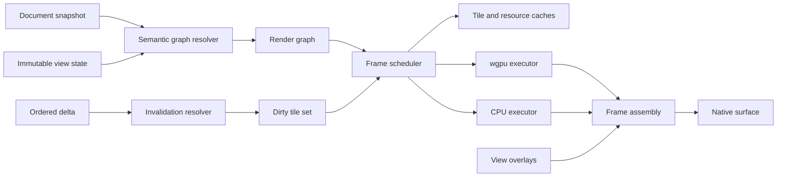
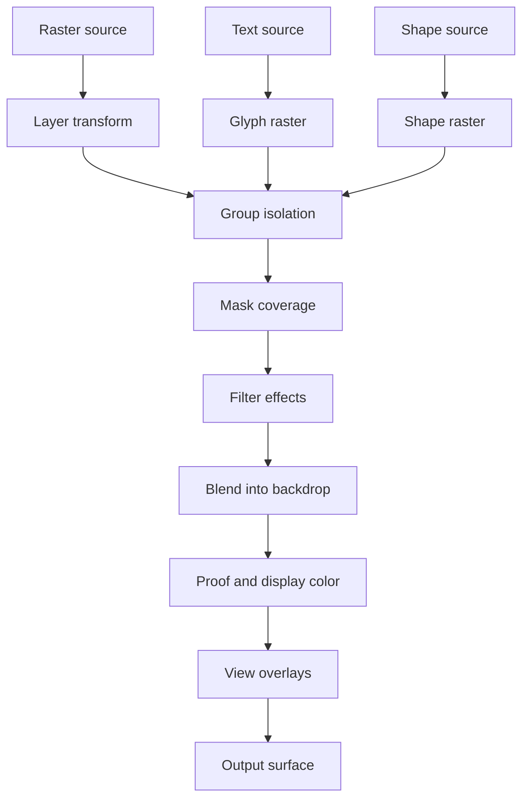
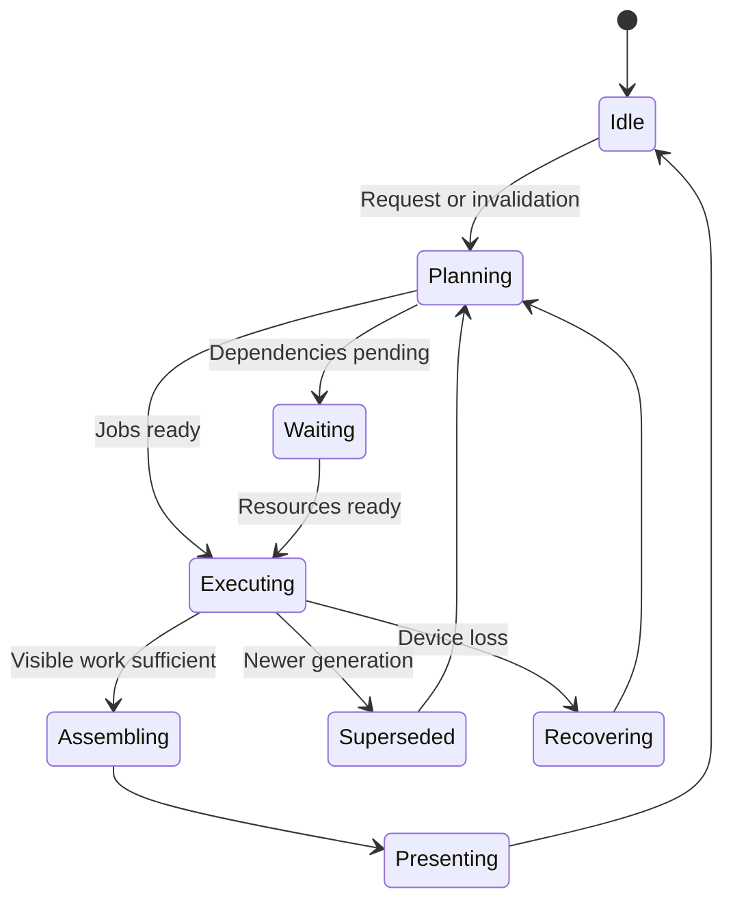
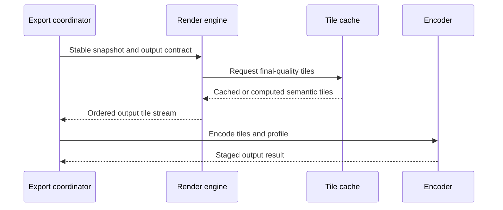
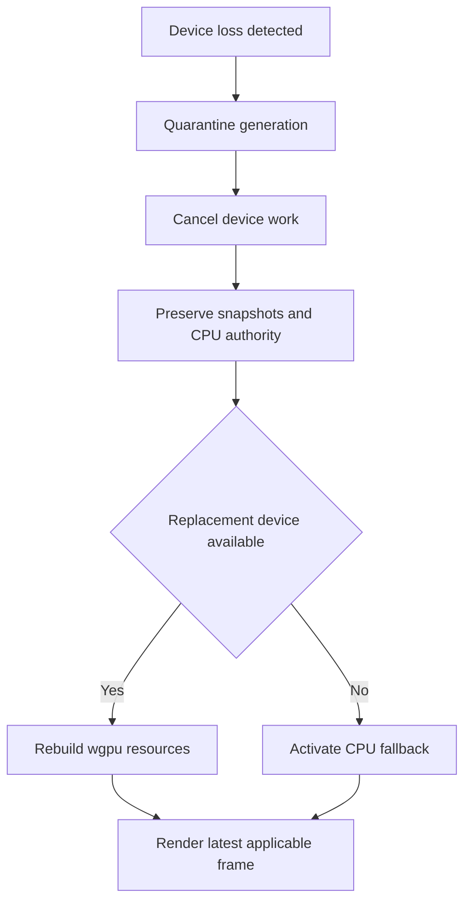
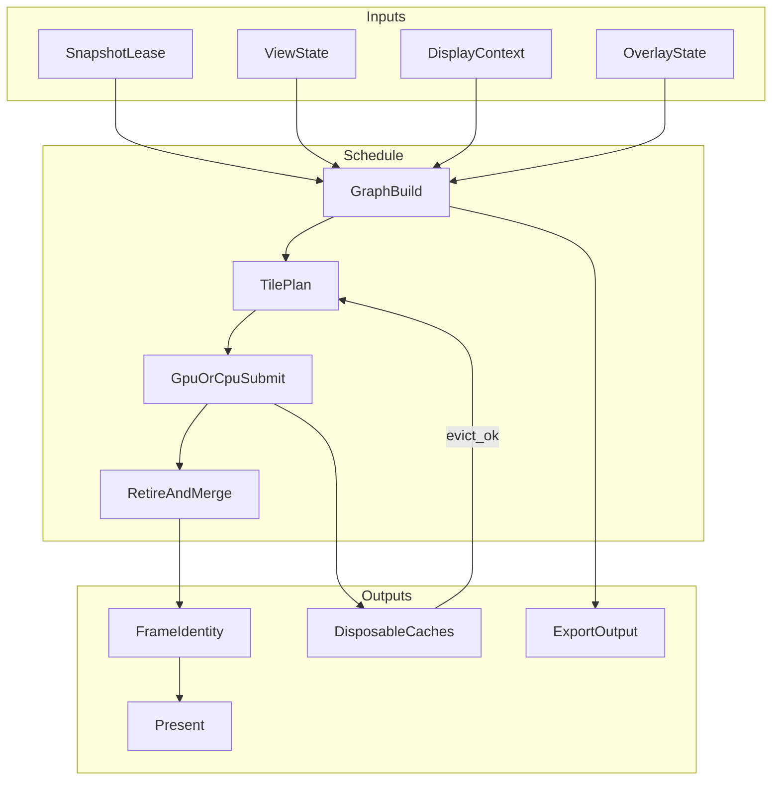

# 17 — Rendering Engine

## Overview

The PhotoTux rendering engine produces viewport frames, thumbnails, previews, proofed output, and export intermediates from immutable document snapshots. It resolves layer, mask, filter, text, shape, brush-preview, color, and overlay semantics into an explicit render graph. It owns derived GPU/CPU resources and caches; it never owns document truth and never mutates authoritative objects.

wgpu is the primary GPU abstraction. Architecture is GPU-first, not GPU-only: CPU reference/fallback composition **MUST** remain available for unsupported operations, headless verification, bounded degraded operation, and recovery. Documents may exceed GPU and CPU memory. Sparse authoritative tiles, a resolution pyramid, bounded caches, demand-driven graph resolution, and streaming export prevent full residency assumptions.

Normative language follows [Requirement Keywords](Appendix/Requirement-Keywords.md). Rendering inherits snapshot, command, layer, selection, mask, filter, color, history, and platform boundaries from foundation specifications.

## Responsibilities

The renderer **MUST**:

- consume coherent immutable snapshots and ordered deltas without writable authority;
- construct deterministic acyclic render graphs with complete semantic inputs;
- composite layers, masks, effects, filters, text, shapes, and colors in defined order;
- render only conservative dirty regions while preserving correctness;
- support tiled source/output larger than device memory;
- maintain a multiresolution tile pyramid for responsive view navigation;
- keep viewport/navigation and overlays distinct from document content;
- enforce CPU/GPU memory, submission, pipeline, and frame budgets;
- schedule newest visible work ahead of stale/offscreen work;
- prevent incompatible versions or generations from appearing in one complete frame;
- support CPU fallback and compare it to wgpu under declared tolerances;
- recover from surface change, device loss, out-of-memory, and shader/pipeline failure;
- make export output semantically consistent with viewport at matching parameters;
- expose local diagnostics and accessible status without pixel-content leakage.

The renderer **SHOULD** present a last complete frame rather than tearing semantic versions. It **MAY** show progressive quality within one snapshot under an explicit contract.

## Architecture



### Internal hierarchy

```text
Rendering subsystem
├── snapshot/delta subscriber
├── semantic graph resolver
├── render-graph compiler
├── dirty-region propagator
├── tile pyramid manager
├── viewport request planner
├── frame scheduler
├── compositor
├── filter/mask/text/shape adapters
├── color/proof/display pipeline
├── overlay compositor
├── wgpu device/surface manager
├── CPU fallback renderer
├── cache and memory-budget manager
├── export render coordinator
└── diagnostics/recovery
```

## Render Request and State Contracts

```rust
struct RenderRequest {
    request_id: RenderRequestId,
    snapshot: SnapshotLease,
    view: ImmutableViewState,
    output: OutputTarget,
    quality: RenderQuality,
    priority: RenderPriority,
    cancellation: CancellationId,
}

struct ImmutableViewState {
    view_id: ViewId,
    viewport: DeviceRect,
    document_to_view: Transform2D,
    device_scale: Scale2,
    display_context: DisplayColorContext,
    proof: Optional<ProofContext>,
    channels: ChannelView,
    overlays: OverlayState,
    generation: ViewGeneration,
}

struct FrameIdentity {
    document_id: DocumentId,
    document_version: DocumentVersion,
    view_generation: ViewGeneration,
    output_generation: OutputGeneration,
    quality_generation: QualityGeneration,
}
```

Contracts are conceptual and do not freeze Rust layout. Numeric fields are finite and bounded. A render request holds a snapshot lease but no document mutation authority. Presentation accepts a frame only if identity is still applicable.

## Render Graph

The graph represents semantic dependencies, not command execution. Node families include source tile, generated layer, text rasterization, shape rasterization, mask resolution, filter pass, color conversion, transform/resample, isolation surface, blend/composite, proof/display conversion, pyramid downsample, overlay, and output.



Every node declares:

- stable semantic kind/version;
- input edges and revisions;
- output extent and conservative bounds;
- coordinate spaces and transforms;
- tile/region request mapping and halo;
- color, alpha, channel, precision, and range;
- deterministic behavior/tolerance;
- cache key fields;
- CPU/GPU implementation status;
- resource estimate and cancellation granularity;
- failure/fallback policy.

Graph compilation is deterministic. Stable topological ordering uses semantic node IDs and explicit child order. Cycles are rejected by document validators; a detected runtime cycle is invariant failure. Graph optimizer may cull invisible nodes, fuse passes, collapse identity transforms, or reuse subtree output only when semantic equivalence is proven.

## Compositor Semantics

Resolver traverses canonical layer order and expands groups, pass-through behavior, clipping, masks, effects, opacity, transforms, blend modes, and isolation. It never infers missing semantics. Each group/effect boundary determines whether an intermediate surface is required.

Composite operations use explicit linear/compositing color, premultiplication, alpha equation, clamp points, and precision from [16 — Color Management](16-Color-Management.md). Unsupported blend modes produce a typed unavailable subtree or declared display fallback without changing document data.

Conservative bounds propagate upward. A layer with unknown/unbounded procedural extent uses declared canvas/request bounds and is diagnosed. Opacity zero and hidden pure nodes can be culled because evaluation has no side effects. Locks and panel collapse do not affect rendering.

## Tile Model

Rendering partitions large regions into tiles while leaving exact dimensions provisional. Storage tiles, compute tiles, pyramid tiles, and surface damage rectangles may differ. Each tile address includes semantic plane, level, coordinates, border policy, and source identity.

```text
Tile pyramid
level 0: full document resolution  [0,0] [1,0] [2,0] ...
level 1: half linear dimensions    [0,0] [1,0] ...
level 2: quarter dimensions        [0,0] ...

Viewport request
document bounds → suitable level → visible tiles → margin ring
                                     ├─ current version
                                     └─ lower-resolution fallback
```

Partial edge tiles define valid rectangle. Tile padding cannot be sampled as image data. Filters request halo from neighboring source tiles using immutable generation. Composite output tiles are independent where dependency graph permits.

Tile cache key includes snapshot or complete object/resource revisions, graph node version, tile coordinate/level, color/alpha/precision, transform quantization only when exact policy allows, proof/display context, filter parameters, text/font revisions, shape geometry revision, and implementation behavior version.

## Tile Pyramid

Pyramid levels provide zoomed-out display and progressive fallback. Level generation uses a versioned downsampling filter in linear premultiplied space unless channel semantics require scalar processing. Alpha, hidden colors, HDR, and edge behavior remain explicit.

Pyramid tiles are derived. Missing levels regenerate from authoritative base or another valid level under a declared chain. A level from document version N cannot fill a complete frame labeled N+1. During edit, renderer may display complete old frame N while generating visible N+1 tiles, or show progressive N+1 with explicit same-version coarse tiles.

Dirty base regions propagate to all affected parent tiles. Filter halos and transformed bounds propagate before pyramid invalidation. Rebuilding offscreen high levels is lower priority. Export normally evaluates requested final resolution directly rather than trusting viewport pyramid approximations.

## Viewport Planning

Planner maps viewport device rectangle through inverse view transform to document region, expands by resampling support and prefetch margin, selects pyramid level, and orders tiles center/interaction first. View rotation, mirroring, fractional scale, and high DPI are view state and do not mark document modified.

Fast pan/zoom may reuse and transform last complete frame temporarily while new tiles render. Reprojection is visibly a presentation fallback and never used for pixel-accurate sampling/export. Cursor-centered zoom updates view generation; stale frames are discarded.

Multiple views share semantic/composite tiles where keys match, but display/proof and viewport output may differ. A view moving between displays invalidates only output-color stages when upstream composite keys remain valid.

## Dirty Regions and Deltas

Document deltas identify changed objects/resources and spatial hints. Renderer validates contiguous version stream. A gap forces full snapshot graph re-resolution. Hints optimize but do not define meaning.

Invalidation propagates:

1. map changed source bounds into node output spaces;
2. expand filter/mask/text/shape support and halo;
3. propagate through transforms conservatively;
4. invalidate blend output above changed contribution as required;
5. invalidate group intermediates and pyramid ancestors;
6. invalidate proof/display/overlay outputs dependent on content;
7. retain unaffected semantic tiles.

Blend stacks may require recompositing upper layers in same region but not unrelated tiles. Adjustment layers can widen dependency to all content below in scope. Global filters invalidate full declared extent. False-wide is safe; false-narrow is corruption.

## Frame Scheduling

Frame scheduler receives document deltas, view changes, resource readiness, and surface events. It forms deadlines and work sets:



Priority order protects input feedback, visible current-view tiles, transient active-tool preview, committed visible updates, save/recovery reserved capacity, export foreground tasks, offscreen margin, thumbnails, and speculative pyramid work. Priority aging prevents user foreground operations from starvation, while obsolete view work cancels aggressively.

Frame budget includes CPU planning, uploads, GPU execution, assembly, and present preparation. Scheduler may split graph across frames and use same-version coarse output. It cannot alter final semantic parameters to meet deadline. Presentation quality state identifies coarse, partial, complete, degraded, or stale-complete.

## Concurrency and Backpressure

Snapshot graph resolution and CPU tile jobs run on workers. Render coordinator owns wgpu device/queue interaction according to implementation affinity. Surface presentation happens on required host thread. Document locks are never held across graph compile, GPU work, font/profile parsing, or present.

Queues are bounded by requests, graph nodes, tile jobs, uploads, GPU submissions, readbacks, and bytes. Coalescing keeps newest view transform and newest snapshot generation per view. User mutations are not renderer queue items and cannot be lost because renderer is overloaded.

Pressure policy:

1. cancel stale/superseded requests;
2. drop speculative and thumbnail work;
3. reduce prefetch margin;
4. evict reconstructible caches;
5. present lower-resolution same-version tiles;
6. reduce explicitly transient preview quality;
7. choose CPU/streaming equivalent;
8. report resource failure while preserving last complete frame.

Save/recovery maintain separate reservations so rendering cannot consume all memory or worker capacity. Export receives bounded share and does not freeze interaction.

## GPU Execution

wgpu device manager selects adapter feature tier, validates limits, creates device/queue, tracks device generation, and owns pipeline/resource factories. Pipelines are keyed completely and built asynchronously. Shader packages are trusted application resources; persisted documents never inject shader source.

GPU graph execution records bounded command buffers. Upload/download row alignment and buffer sizes use checked arithmetic. Resource usage transitions and submission dependencies are explicit. Texture atlases, bindless-like strategies, or arrays may optimize but cannot make tile identity ambiguous.

Intermediate textures use pools keyed by format, size, sample count, and usage. Pool entries are zeroed/fully overwritten before read to avoid information leakage. Aliasing lifetimes follow graph intervals. No target is reused before queue completion lease releases.

Surface configuration responds to size, scale, format, HDR/color, and compositor events. Zero-sized/minimized surfaces suspend presentation without losing document/render graph state.

## CPU Fallback

CPU renderer implements graph semantics for core nodes using sparse tiles and bounded intermediates. It may be slower, but it **MUST** permit document inspection, export/save-independent operation, and reference tests when wgpu is unavailable. Unsupported expensive paths return typed unavailable status only if no conformant CPU implementation exists, which core features should avoid.

Parallel CPU composition uses immutable inputs and deterministic tile boundaries. Reductions have stable order. SIMD paths obey precision/tolerance. CPU output can upload to a simple surface pipeline when compute features are absent, or integrate with host presentation adapter through a bounded pixel buffer.

GPU and CPU traces compare node-by-node to isolate divergence. A device-specific failing pipeline variant is quarantined locally and scheduler uses another path.

## Overlays

Overlays include selection boundaries/tints, guides, grids, transform handles, brush cursor and preview, text cursor/selection, shape nodes, snapping hints, diagnostics, and out-of-canvas indicators. Most are view/transient state and render after document color/proof unless semantic requirement places them earlier.

Overlay graph is separate from document graph. Changing ant phase, cursor, guide visibility, or focus does not invalidate document composite or modified state. Overlays define color, contrast, scale, reduced motion, clipping, hit-test relation, and accessibility counterpart.

Pixel selection coverage itself is document state, but marching ants are overlay. Brush predicted preview is transient and reconciled with commit. Text edit selection is interaction state, while text content/style is document state. Export excludes overlays unless an explicit export command requests a document annotation class.

## Cache and Memory Budgets

Cache classes:

- decoded authoritative-source views;
- GPU source tiles;
- graph plans and bounds;
- intermediate filter/group tiles;
- composite tiles;
- pyramid tiles;
- text glyph atlases/runs;
- shape tessellation/raster tiles;
- color transforms/LUTs;
- pipelines/bind groups;
- overlay geometry;
- final frames.

Every cache publishes CPU/GPU/logical bytes, owner, generation, rebuild cost, last use, and leases. Process and per-device budgets have soft/hard limits. Per-view fairness prevents one huge view from evicting all others. Eviction never touches document authority.

Resource lifetimes are decoupled from object lifetimes. Deleting a layer commits document change; old snapshots/history may retain source chunks while renderer cache entries expire when leases drop. Device resources die with device generation. Snapshot release does not require immediate cache deletion if key remains valid and budget permits.

## Frame Consistency

A complete frame uses one `FrameIdentity`. Graph source records, resource manifests, selection/masks, profiles, fonts, and output context resolve under that identity. A tile from older document version cannot be inserted merely because coordinate matches.

Progressive frames may combine quality levels only for same semantic version and view generation. Presentation labels quality internally and replaces atomically or by explicitly tracked tile coverage. Hit testing and color sampling use committed snapshot and exact coordinate path, not stale displayed pixels without disclosure.

Frame presentation completion is not command success. UI action state follows command/document streams. Renderer lag is visible status only when relevant.

## Export Consistency

Export coordinator asks renderer for an offscreen render plan against stable snapshot, output extent/resolution, color profile, alpha, precision, metadata, and quality. It uses same semantic graph resolver and node behavior versions as viewport. Differences are explicit output parameters, not alternate hidden implementations.



Streaming export bounds memory. Tile order is deterministic where codec permits. View-only overlays, exposure, proof, or display transforms are excluded unless export plan names them. Cache entries can be shared only when every semantic/quality key matches.

## Deterministic Behavior

Deterministic graph resolution depends on snapshot, view/output parameters, resource revisions, node behavior versions, and stable ordering. Worker timing and GPU submission grouping do not alter meaning. Floating differences are bounded by node/format tolerance. Exact integer/scalar nodes remain exact.

Reference fixtures include CPU output, graph trace, tile dependency list, and tolerances. Optimizer/fusion must produce equivalent trace endpoints. Pipeline cache warmth cannot alter output. Final export may force reference-quality path.

## Failure, Device Loss, and Recovery

Graph validation failure affects requested subtree/frame and returns typed error; renderer does not repair document. Missing resource shows an explicit unavailable representation or preserved last verified fallback. Allocation pressure invokes eviction/degradation policy before failure.

Device loss procedure:

1. mark device generation lost and stop accepting its resources;
2. fail/cancel in-flight device work and prevent stale completion publication;
3. preserve document snapshots, CPU resources, graph requests, and last complete frame;
4. release device resources without waiting indefinitely;
5. select replacement adapter/device or CPU fallback;
6. rebuild pipelines, color resources, visible tiles, and surfaces;
7. resume with new output generation;
8. record bounded local diagnostics.



Surface loss/reconfiguration is narrower and need not rebuild device caches. Repeated device failure triggers bounded retries, then CPU/degraded status rather than loop. Save and document commands continue because renderer is not authority.

## Persistence, Security, and Accessibility

Render caches, pipelines, framebuffers, and device identities are not document persistence. Documents persist semantic layer/effect/text/shape/color records. Optional local pipeline caches are process data, versioned and discardable. They cannot be trusted across incompatible binaries/devices without validation.

Shader dimensions, dispatch counts, buffer offsets, texture extents, profile/font data, and imported object graphs are validated before GPU use. Intermediate resources are initialized to avoid cross-document leakage. Diagnostics redact pixels, thumbnails, layer/text names, paths, profile names, and sampled colors. No renderer operation requires network.

Accessibility exposes render/device status, current/lagging version when relevant, zoom/pan/rotation values, proof/display state, degraded quality, progress, cancellation, and unavailable subtrees. Canvas has semantic document/object summaries; pixels are not its only accessibility representation. Overlays use non-color cues, high contrast, scalable handles, and reduced motion.

## Design Rationale and Alternatives
**Render graph versus immediate layer drawing.** Graph makes dependencies, halos, caches, scheduling, and export reuse explicit. Immediate drawing is simpler but couples traversal to presentation and hinders large tiled documents.

**Immutable snapshots versus locking document during frame.** Snapshots permit concurrent editing/save and deterministic identity. Locks would stall input and invite deadlocks.

**Tile pyramid versus full-resolution every frame.** Pyramid enables responsive zoom and large documents. It consumes cache and needs correct invalidation.

**Last complete frame versus mixed-version fast updates.** Complete frames preserve semantic coherence. Mixed versions may look faster but can misrepresent masks/effects and user state.

**GPU-first plus CPU fallback versus GPU-only.** Fallback protects device compatibility, testability, and recovery at implementation cost.

**Shared semantic graph for export/view versus separate export renderer.** Sharing prevents subtle output drift. Explicit output parameters preserve final-quality needs.

## Best Practices

- Key every cache by complete semantic inputs.
- Keep graph nodes pure and immutable.
- Use conservative bounds and test transform/halo edges.
- Cancel obsolete view work early.
- Reserve resources for save/recovery.
- Never label mixed document versions as complete.
- Separate overlays from document composite.
- Validate every GPU dimension and offset.
- Pool only fully described, safely initialized resources.
- Differential-test CPU and wgpu per node.
- Treat display color as output context, not document mutation.
- Rebuild from snapshots after device loss.

## Future Extensibility

Future graph nodes, alternate platform surfaces, additional wgpu backends, advanced virtual texturing, richer HDR presentation, deterministic procedural layers, or sandboxed local extensions may be added after defining bounds, dependencies, color/alpha, CPU/reference fallback, persistence, budgets, security, accessibility, and recovery.

Tile dimensions, allocator, runtime, pipeline packaging, and UI toolkit remain replaceable. No extension receives raw mutable device/document authority. No cloud renderer, account, generative service, or vendor-specific workflow is implied.

## Testability and Diagnostics

Headless graph tests resolve snapshots into stable node/edge traces. Tiny exact composites verify order, masks, alpha, blending, text/shape rasterization, and overlays. Large sparse fixtures enforce memory budgets. Differential tests execute CPU and wgpu tiers.

Controlled schedulers reorder job completion, drop deltas, race view/snapshot generations, and inject device loss. Property tests assert cache-cold/warm equivalence, tile partition equivalence, full invalidation recovery, finite bounds, no authority mutation, and lease cleanup.

Diagnostics record frame identity, graph/node/tile counts, dirty regions, queue wait, CPU/GPU timings, uploads/readbacks, pipeline builds, cache hit/eviction, memory budget, frame quality, stale drops, surface events, device-loss generation, and export correlation.

## Acceptance Scenarios

### Delta gap

Drop one ordered document delta, then deliver next. Assert renderer refuses incremental application, reacquires latest full snapshot, invalidates safely, and never combines incompatible manifests.

### Tile-edge effect

Render blur and transformed mask across tile boundaries at multiple pyramid levels. Assert no seams, complete halo, conservative dirty propagation, and CPU/GPU tolerance.

### Fast navigation

Pan/zoom rapidly while edit commits. Assert old view jobs cancel, transformed last frame may appear as disclosed fallback, newest applicable same-version tiles win, and document command result is independent.

### Device loss

Lose device while isolated group and display LUT are in flight. Assert generation quarantine, no stale frame publication, document/history unchanged, caches rebuilt or CPU fallback, and save remains available.

### Memory pressure

Open document larger than GPU memory with two views and export. Assert bounded residency, per-view fairness, streaming export, reserved durability capacity, and no authoritative eviction.

### Overlay independence

Change selection-ant phase, brush cursor, grid, and proof warning. Assert no document version/history change, upstream composite cache remains valid where appropriate, and reduced-motion mode suppresses animation.

### Export consistency

Render same snapshot/parameters to viewport offscreen target and export target at matching resolution/profile/quality. Assert semantic pixels meet tolerance and display-only transforms/overlays are absent.

### CPU fallback

Disable GPU before startup. Create/edit/render/proof/export supported document headlessly or through simple presentation. Assert core output validity and typed performance degradation only.

## Extended Invariants and Neighbor Contracts

This section deepens rendering-engine contracts for graph identity, tile pyramids, frame coherence, cache budgets, export parity, device-loss recovery, concurrency backpressure, and strict non-authority of GPU resources.

### Frame and graph invariants

A presented frame carries one applicable identity binding document snapshot version, view parameters, display/proof generation, and output color contract. Progressive frames and last-complete frames are distinguishable in state. No complete frame may mix document tiles from different versions or output-color resources from different generations.

Render graphs name semantic nodes with stable dependency edges, source revisions, extents, ROI/halo, formats, color/alpha, precision, implementation behavior, and output identity. Graph dumps use stable ordering and redaction. Pointer values, hash iteration order, GPU handles, and worker completion order **MUST NOT** affect dump identity.

Overlays—selections ants, UI guides, tool previews—composite after document content under view-local settings. They never write document authority. Export paths use the same semantic graph family with explicit output-quality and inclusion knobs; cache sharing requires exact compatible keys.

### Edge cases

Documents larger than CPU/GPU budgets remain editable through sparse tiles and pyramid levels. Viewport planning requests only visible tiles plus prefetch under policy. Minimize, resize, surface replacement, and queue overflow must not publish mixed frames. Font and vector nodes invalidate on resource revision changes; a periodic full redraw may serve as oracle but cannot hide broken incremental invalidation.

Empty layers, missing optional effects, and unavailable references produce disclosed placeholders without inventing successful content. Zero-size viewports cancel work cleanly. Integer zoom and fractional zoom both respect sampling contracts declared by nodes.

### Failure modes

Device loss during upload, pipeline compile, compute, render pass, readback, or present quarantines old-generation callbacks. Snapshot leases and CPU-authoritative resources survive. Reconstruction validates pipelines against adapter limits before admitting jobs. Repeated reconstruction failures settle into stable CPU/degraded presentation with bounded retries and actionable status—not a tight automatic loop that hammers the driver.

Resource hard-budget exhaustion returns typed failures. The renderer **MUST NOT** rely on OS process death, unbounded driver allocation, or eviction of document/history resources to survive. Cache eviction affects latency and transient quality only.

Stale jobs for superseded graph generations never present as current. Late completions update metrics at most and discard payloads.

### CPU and GPU boundaries

CPU paths provide reference or tolerance-bounded reference for node families. Each family declares which wgpu feature tiers implement it and what fallback applies when a tier is missing. Core document display cannot depend on an unreported GPU-only node. Headless graph dumps and deterministic frame harnesses run without surfaces.

Linux-native surface and color adapters supply presentation targets and display profiles into portable contracts; toolkit widgets remain outside the renderer’s semantic graph.

### Concurrency and backpressure

Scheduling phases include snapshot acquire, graph build, tile plan, submit, retire, and present. Commits, view changes, display-profile changes, proof changes, and resize may interleave between phases; the scheduler ensures one applicable identity per presented complete frame. Workers execute tiles concurrently; retirement merges by identity keys.

Backpressure sheds prefetch, lowers preview quality, or cancels obsolete generations before dropping interactive correctness. Export jobs may run with separate budgets and **MUST NOT** starve authority-preserving interactive frames into mixed-version presentation; if export must pause interaction, that policy is explicit.

### Persistence interaction

The renderer is not a persistence actor. It may hint dirty regions and thumbnail projections, but save bytes come from document snapshots. Recovery after crash does not trust GPU caches. Thumbnail caches are disposable and redacted from diagnostics by default.

### Neighboring subsystem contracts

- Document model: snapshot/delta source of truth.
- Layer system: resolved compositing inputs.
- Selection and mask systems: overlay and coverage nodes.
- Brush and filter engines: preview nodes and invalidation; commits arrive as new snapshots.
- Color management: presentation and working transforms as graph nodes.
- Text and shape engines: glyph/geometry sources with revision tokens.
- History: version advancement drives invalidation; renderer does not undo.
- Command system: user edits never originate from render callbacks.
- Accessibility: frame busy/degraded state without pixel dumps.



### Additional acceptance scenarios

#### Mixed-version refusal

Commit document version 100 while tiles for version 99 are still retiring. Assert the presenter never shows a complete frame containing both versions’ document tiles. Progressive indicators may show incomplete work for 100.

#### Display change coherence

Change display profile between submit and present. Assert the presented complete frame either uses the old display generation entirely or waits for a new frame with the new generation—never shaders from one and LUTs from the other.

#### Invalidation completeness

Mutate one source tile, one transform, one group isolation policy, one feathered mask, one global adjustment, one font, one shape stroke, and one display context across separate commands. Instrumented execution asserts each affected output rebuilds and unaffected reusable nodes remain when keys allow.

#### Export versus viewport parity

Compare viewport-offscreen and export graphs at matched semantic parameters, then vary resolution, proof inclusion, profile, alpha, and quality. Assert differences only where keys differ and streaming order does not change composited export bytes.

#### Budget ceiling

Construct a document whose logical size exceeds configured CPU and GPU budgets. Record peak authoritative, snapshot, prepared, CPU-cache, GPU-cache, upload, intermediate, and export bytes. Assert typed resource failure rather than process kill when hard caps hit, and that authoritative/history bytes remain intact.

#### Callback quarantine after device loss

Lose device during compute, then deliver a late callback from the lost generation. Assert payload discard, no present, no cache insert under the new device generation, and successful reconstruction path proceeds from snapshot leases.

#### Overlay independence

Toggle selection ants and guide visibility while a long composite runs. Assert document tile identities unchanged, overlays update without version advance, and reduced-motion settings affect overlay animation only.

### Scheduling evidence checklist

Provide headless graph dumps, deterministic frame harness logs, budget peaks, invalidation traces, device-loss recovery traces, and export parity digests. Record device tier, budget configuration, graph behavior versions, output tolerances, and justified deviations from recommended scheduling. Diagnostics correlate command transaction, snapshot delta, graph generation, tile jobs, submissions, frame identity, and presentation without embedding pixels, text, names, paths, profiles, or thumbnails unless the user explicitly exports them.

### Pyramid residency and prefetch ethics

Mip or pyramid levels are disposable. Promoting a low-resolution preview tile into a complete-frame slot under a high-zoom identity is forbidden. Prefetch **MAY** decode neighbors and coarser levels, but prefetch cancellation **MUST** be cheaper than committing a mixed-identity frame. When memory pressure hits, evict prefetch before interactive critical tiles, and evict interactive caches before touching authoritative document or history bytes—which the renderer must not own.

Debug overlay modes that tint dirty regions or show tile grids are view-local, redacted from ordinary diagnostics, and disabled in release default accessibility presentations. They never alter graph outputs used for export. A conformance harness may enable them to correlate invalidation rectangles with command deltas.

## Acceptance Criteria

- Rendering consumes immutable snapshots and never mutates document authority.
- Graph resolution, tile dependencies, and invalidation are deterministic and conservative.
- Documents larger than GPU memory render under bounded residency.
- Frames never silently mix incompatible versions or output generations.
- CPU fallback covers core semantics and matches wgpu tolerances.
- View overlays remain non-authoritative and independently accessible.
- Device/surface loss preserves document, save, history, and recovery.
- Export uses same semantic graph with explicit output-quality differences.
- Cache eviction affects latency/quality state only, never correctness or edits.
- Linux-native surface/color adapters remain outside portable core.

## Implementation Conformance Contract

A renderer claiming conformance **MUST** provide a headless graph-dump interface and a deterministic frame harness. Graph dumps name semantic nodes, stable dependencies, source revisions, extents, ROI/halo, formats, color/alpha, precision, implementation behavior, and output identity. Dumps use stable ordering and redaction. They must not depend on pointer values, hash iteration, GPU handles, or worker completion order.

Every node family **MUST** declare whether CPU output is exact reference or tolerance-bounded reference, which wgpu feature tiers implement it, and what fallback occurs when a tier is unavailable. Core document display cannot depend on an unreported GPU-only node. Startup and device reconstruction validate pipeline families against adapter limits before admitting jobs.

Frame-coherence tests **MUST** force snapshot commits, view changes, display-profile changes, proof changes, resize, minimize, surface replacement, queue overflow, and device loss between every scheduling phase. A presented frame carries one applicable identity. Last-complete and progressive frames are distinguishable in state; no complete frame may contain document tiles from different versions or output-color resources from different generations.

Memory conformance **MUST** use a document whose logical size exceeds configured CPU and GPU budgets. Evidence records peak authoritative, snapshot, prepared, CPU-cache, GPU-cache, upload, intermediate, and export bytes. Renderer **MUST** remain within hard budgets or return typed resource failure. It cannot rely on operating-system termination, unbounded driver allocation, or emergency eviction of document/history resources.

Invalidation tests **MUST** mutate one source tile, one transform, one group policy, one mask with halo, one global adjustment, one font, one shape stroke, and one display context. Instrumented graph execution verifies all affected outputs rerender and unaffected semantic nodes remain reusable where contract allows. A periodic full redraw is useful as differential oracle but cannot conceal incorrect incremental logic.

Export consistency evidence **MUST** compare viewport-offscreen and export graph resolution at matching semantic parameters, then explicitly vary resolution, proof/display inclusion, color profile, alpha, and quality. Cache sharing occurs only on exact compatible keys. Streaming order cannot alter composited output.

Recovery tests **MUST** lose the device during upload, pipeline compilation, compute, render pass, readback, and present. Old-generation callbacks are quarantined. Snapshot leases and CPU-authoritative resources survive. Repeated reconstruction failures terminate in stable CPU/degraded state with bounded retries and actionable status, not an automatic loop.

Local diagnostics **SHOULD** correlate command transaction, snapshot delta, graph generation, tile jobs, submissions, frame identity, presentation, and export. Instrumentation remains optional for correctness and excludes pixels, text, names, paths, profiles, and thumbnails unless explicit user export includes them.

Conformance evidence **MUST** record tested device tier, budget configuration, graph behavior versions, output tolerances, and any justified deviation from recommended scheduling behavior.

## Cross References

- [00 — Introduction](00-Introduction.md)
- [08 — Command System](08-Command-System.md)
- [10 — Document Model](10-Document-Model.md)
- [11 — Layer System](11-Layer-System.md)
- [12 — Selection System](12-Selection-System.md)
- [13 — Mask System](13-Mask-System.md)
- [14 — Brush Engine](14-Brush-Engine.md)
- [15 — Filter Engine](15-Filter-Engine.md)
- [16 — Color Management](16-Color-Management.md)
- [18 — Text Engine](18-Text-Engine.md)
- [19 — Shape Engine](19-Shape-Engine.md)
- [20 — History and Undo](20-History-Undo.md)
- [Glossary](Appendix/Glossary.md)
- [Requirement Keywords](Appendix/Requirement-Keywords.md)
