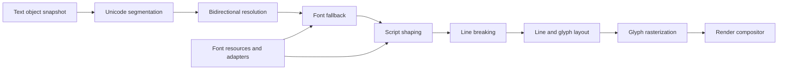
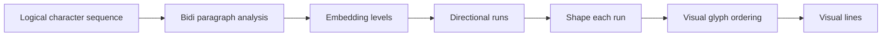
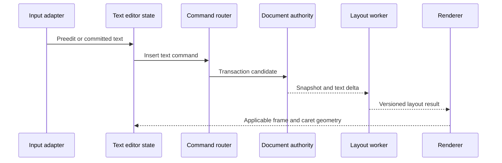
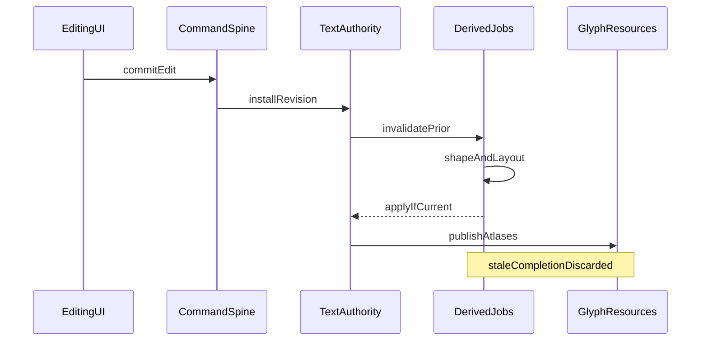

# 18 — Text Engine

## Overview

The PhotoTux text engine preserves editable Unicode text while producing deterministic layout and raster output. A text layer owns characters, paragraphs, style runs, layout geometry, transforms, and font references. Shaped glyph runs, line breaks, glyph outlines, atlases, and raster tiles are derived caches. Text edits, style changes, layout changes, font substitution acceptance, conversion to paths, and rasterization are commands that commit history transactions.

The portable core defines text semantics and interfaces. Linux-native adapters discover local fonts, observe font changes, expose input methods and accessibility, and resolve user-authorized font resources without leaking toolkit objects into document records. Rendering is GPU-first through wgpu glyph/path pipelines, with CPU shaping/raster fallback and reference fixtures. Missing fonts never silently rewrite authoritative styles.

Normative language follows [Requirement Keywords](Appendix/Requirement-Keywords.md). Text inherits document, layer, command, history, color, and rendering invariants from foundation documents.

## Responsibilities

The text engine **MUST**:

- store valid Unicode scalar text with explicit normalization and line-ending policy;
- preserve editable paragraph and style-run structure;
- segment graphemes, words, sentences, scripts, and bidi runs using versioned rules;
- shape scripts with language, direction, OpenType features, variation axes, and font fallback;
- define deterministic font selection from pinned resources and declared fallback;
- support horizontal layout and explicitly declare any vertical support;
- calculate line breaking, alignment, spacing, tabs, decoration, and overflow;
- keep logical text order distinct from visual glyph order;
- preserve caret/selection mapping across clusters and bidi runs;
- rasterize at requested resolution without changing text authority;
- handle missing/corrupt fonts with visible, persistent status;
- use commands/transactions for every persistent mutation;
- remain bounded for hostile text, fonts, features, and geometry;
- provide CPU fallback/reference and wgpu rendering;
- expose complete accessible text, styles, editing state, and failures.

It **SHOULD** preserve imported font/style intent even when local rendering is unavailable. It **MAY** embed font subsets only when licensing, format, and user policy permit.

## Architecture



### Internal hierarchy

```text
Text subsystem
├── text object model
│   ├── Unicode content
│   ├── paragraph records
│   ├── style runs
│   ├── layout frame
│   └── transform/effect references
├── Unicode services
│   ├── normalization
│   ├── grapheme/word boundaries
│   ├── script segmentation
│   ├── bidirectional algorithm
│   └── line breaking
├── font catalog and resolver
├── OpenType shaping adapter
├── fallback planner
├── layout engine
├── editing/caret mapping
├── glyph outline and raster services
├── wgpu/CPU render adapters
├── caches/resource leases
├── persistence/migration
└── diagnostics/accessibility
```

## Text Object and Contracts

```rust
struct TextLayerPayload {
    content: TextBuffer,
    paragraphs: BoundedList<ParagraphRecord>,
    styles: BoundedList<StyleRun>,
    frame: TextFrame,
    transform: Transform2D,
    language_default: LanguageTag,
    normalization: NormalizationPolicy,
    font_policy: FontResolutionPolicy,
}

struct StyleRun {
    range: TextRange,
    font: FontReference,
    size: Length,
    variations: BoundedMap<AxisTag, FiniteValue>,
    features: BoundedMap<FeatureTag, FeatureValue>,
    language: Optional<LanguageTag>,
    script_override: Optional<ScriptTag>,
    direction_override: Optional<TextDirection>,
    color: ColorValue,
    tracking: Length,
    baseline_shift: Length,
    decorations: DecorationSet,
}
```

Conceptual only. Text ranges use one canonical indexing unit, preferably Unicode scalar or UTF encoding offsets with robust conversion helpers. Public contracts **MUST NOT** confuse bytes, scalar values, grapheme clusters, shaping clusters, and glyph indices.

Text content contains no embedded executable markup. Paragraph/style records are typed bounded schemas. Overlapping styles are canonicalized into deterministic nonoverlapping effective runs or represented by a defined cascade; arbitrary ambiguous overlap is forbidden.

## Unicode Content and Normalization

Text storage accepts valid Unicode scalar sequences. Invalid encoded import is rejected or replaced under explicit import-loss policy before document visibility. Internal encoding may be UTF-8, rope, piece table, or another structure, but persistence and command ranges define stable semantic conversion.

Normalization policy is recorded because NFC, NFD, and unchanged sequences can differ in code points while rendering similarly. Automatic normalization during ordinary load/edit can break identifiers, variation sequences, or range mappings. Default should preserve entered valid sequence while input methods may commit normalized text according to host behavior. Any normalization command is explicit and undoable.

Line endings are canonical paragraph separators internally. Import/export maps platform sequences without storing host convention as semantic text. Control characters are classified: valid bidi/format controls remain with visible inspection aids; prohibited controls or embedded nulls follow validation policy. Diagnostics and UI can reveal directional controls to prevent spoofing without deleting them silently.

## Segmentation

Unicode data version is part of behavior compatibility. Segmentation computes grapheme clusters for caret movement/deletion, word boundaries for navigation, script runs for shaping, bidi paragraphs/runs, and line-break opportunities. Results are derived and cached by text revision plus rule version.

Grapheme deletion removes one extended grapheme cluster under normal command, not one byte or glyph. Combining marks, emoji sequences, regional indicators, and joiner sequences remain coherent. Advanced commands may delete code points explicitly but must be distinct.

Script segmentation resolves Common and Inherited characters using surrounding context. Language influences shaping and fallback. Overrides are scoped style semantics and cannot create invalid ranges.

## Bidirectional Text

Bidirectional resolution operates per paragraph on logical text, style direction overrides, and Unicode controls using a pinned algorithm version. It produces embedding levels and visual runs. Authoritative text remains logical order.



Caret movement supports logical and visual policies explicitly. Selection stores logical ranges; painting visual highlights maps clusters through runs. A single logical selection can appear discontinuous visually. Hit testing returns nearest caret boundary with affinity, run direction, and cluster mapping.

Bidi controls are not inferred from glyph order. Copy retrieves logical text. Export preserves controls unless conversion policy states otherwise. Accessibility exposes logical reading content and direction metadata.

## Font Resources and Identity

A font reference may identify:

- embedded full font or permitted subset;
- pinned local font fingerprint and face coordinates;
- family/style request with saved fallback candidates;
- preserved source reference unavailable locally;
- generic family policy resolved by host.

Family display name alone is insufficient identity. Resolved face identity includes validated font bytes fingerprint, face index, variation coordinates, synthetic-style policy, and shaping-relevant tables/version. Local font updates create a new catalog generation and may alter unresolved requests, never already embedded/pinned bytes.

Font files are hostile. Parsers bound tables, offsets, glyph counts, contours, composites, variation stores, color glyph data, names, bitmaps, recursion, and arithmetic. Fonts do not gain filesystem capability from stored path metadata.

## Linux Font Adapter

Linux adapter discovers installed fonts and generic-family preferences through local platform services/configuration. It returns portable face metadata and scoped read capabilities or validated resource bytes. It observes catalog changes and increments generation. Core never imports fontconfig/toolkit types.

Input methods deliver committed text and preedit spans through host adapter. Preedit is transient presentation state; commit submits text command. Compose/dead keys, virtual keyboards, and accessibility input follow same semantic insertion path. Toolkit cursor rectangles are derived from core layout and mapped by host.

Font fallback policy may consult platform catalog for unresolved generic/local requests. For deterministic documents, resolution result is pinned in snapshot and optionally saved as fingerprints/fallback records. Reopening on another host reports substitutions rather than silently changing style.

## Font Fallback

Fallback selects fonts for text clusters not covered by primary face. Resolver considers exact style request, script/language, codepoint and variation-sequence coverage, emoji/text presentation, OpenType shaping capability, color-glyph support, and user/application fallback policy.

Selection operates on grapheme/script clusters, not individual code points when splitting would break shaping. Combining marks should stay with base where possible. Emoji ZWJ sequences must not be arbitrarily divided. If no face covers complete cluster, resolver uses deterministic best effort and marks missing glyphs.

```text
Style run
├── requested face
├── cluster coverage scan
├── primary covered run
├── fallback candidate search
│   ├── document embedded faces
│   ├── saved fallback identities
│   ├── local script fallback
│   └── generic fallback
└── missing-glyph run
```

Fallback is a derived resolution unless user accepts `text.replace-font` or embeds/subsets a font through command. Cache keys include catalog generation for unpinned requests. Layout status records substitutions for UI/accessibility.

## OpenType Shaping

Shaping input includes text slice, direction, script, language, face identity, size/scale, variation coordinates, feature ranges, cluster level, and behavior/library version. Output includes glyph IDs, advances, offsets, clusters, unsafe-break flags, and attachment information.

Features such as kerning, ligatures, contextual alternates, localized forms, numeral styles, small caps, and vertical substitutions use stable tags and bounded values. Default feature set is documented. Unknown tags may persist but evaluator reports support.

Shaping never uses visual glyph count as character count. Ligatures map multiple characters to one glyph; decomposition can map one character to many. Cluster monotonicity follows direction contract. Cursor positions avoid unsafe cluster interior unless advanced editing policy exposes them.

Variation axes validate finite values against face ranges. Named instances resolve to explicit coordinates. Optical size automatic behavior records resolved policy so layout is reproducible.

## Paragraph and Line Layout

Paragraph style defines alignment, base direction, writing mode, line-height policy, first/rest indentation, tabs, spacing before/after, justification, hyphenation policy, and overflow. Layout frame defines point-text or area-text behavior, bounds, columns if supported, padding, vertical alignment, and clipping/overflow.

Line breaking uses Unicode opportunities plus shaping unsafe-break data, explicit breaks, white-space policy, and optional local dictionary hyphenation. Hyphenation resources are versioned local resources; absence changes status and uses no-hyphen fallback. It never downloads dictionaries.

Line construction:

1. resolve paragraph bidi and style/script runs;
2. resolve fonts and shape candidate spans;
3. derive legal break opportunities;
4. fit advances into frame width;
5. reshape around context-sensitive break where required;
6. apply alignment/justification;
7. position baselines and decorations;
8. compute conservative ink/logical bounds;
9. map logical ranges to visual clusters.

Justification defines which opportunities expand, limits, script-specific behavior, and deterministic distribution of rounding error. Tabs resolve from paragraph tab stops or default interval. Trailing whitespace handling is explicit. Negative tracking and baseline shifts affect bounds.

## Style Runs and Editing

Style commands target logical ranges snapped according to property policy. Applying style to part of a grapheme may expand to cluster or remain codepoint range if semantically meaningful; behavior is stated. Runs merge only when complete effective styles and provenance are equivalent.

Insertion inherits style from caret affinity and paragraph policy. Deletion updates runs and paragraphs atomically. Pasting validates text/style/font resources and performs one transaction. Composition preedit does not enter history until committed.



Text editing selection/caret is interaction state unless product chooses document-associated text selection; text content and styles are document state. Undo groups input into meaningful words/IME commits under bounded merge policy while preserving committed versions.

## Layout Bounds and Transforms

Text layout occurs in layer-local coordinates. Layer transform maps to parent/document; view transform maps to device. Font size units and document resolution policy are explicit. Point text expands naturally; area text reflows inside frame. Transforming frame versus transforming layer are distinct commands.

Logical bounds include layout advances/frame; ink bounds include glyph outlines, decorations, stroke/effects, and antialias support. Bounds are conservative. Missing-glyph representations contribute defined advance and bounds. Singular transforms may display under forward mapping but hit testing requiring inverse returns unavailable.

## Glyph Rasterization

Shaped glyphs resolve to outlines, embedded bitmaps, or color glyph graphs under validated font support. Rasterization modes include grayscale coverage and, if used, subpixel output only under a display-specific pipeline. Document/export rasterization **MUST NOT** bake display subpixel assumptions.

At ordinary zoom, glyph coverage may use CPU outline rasterization cached in atlases or wgpu path/coverage generation. At high zoom, vector outlines can rasterize per tile. Hinting policy is explicit and tied to output context; viewport hinting must not alter vector text authority or export unexpectedly.

Color glyphs define palette, layer, bitmap/profile, and compositing semantics. Unsupported color formats use monochrome outline or missing-glyph fallback only when declared and disclosed. SVG-like font content, if supported, is parsed as hostile bounded vector data without script or external resources.

Raster output uses [16 — Color Management](16-Color-Management.md), linear premultiplied composition, and layer/mask semantics. Text color/style values are authoritative profiled colors. Glyph coverage is scalar.

## GPU and CPU Boundaries

Shaping and line layout normally run on CPU because of complex data dependencies and mature local libraries, behind portable interfaces. Raster/composite is GPU-first via wgpu. CPU raster path provides reference/fallback. GPU glyph atlas entries are derived and device-generation bound.

Destructive `text.rasterize` evaluates exact snapshot and requested output precision/profile/bounds, generates recoverable raster chunks, then commits replacement through command/history. GPU output requires readback/validation before authority. Device loss before commit restarts CPU/GPU; text source remains.

Pipeline keys include glyph resource identity, raster mode, size/transform class, hinting, output scale, precision, color glyph palette, and device generation. Atlas coordinates are never persisted or used as glyph identity.

## Scheduling, Concurrency, Cancellation, and Backpressure

Text commands commit quickly to source records. Shaping/layout is asynchronous from snapshots. Visible active-edit paragraph receives priority, then visible text layers, caret geometry, committed viewport render, export, offscreen layers, thumbnails, and speculative fallback scans.

Worker results carry document/version, text object generation/revision, font catalog generation, font fingerprints, layout frame revision, behavior versions, and applicability. Stale results drop. A newer text edit cancels older shaping for affected paragraphs while unrelated paragraphs may reuse caches.

Queues are bounded by text length, paragraphs, runs, fallback candidates, glyphs, outlines, atlas bytes, and jobs. Backpressure cancels speculative scans, coalesces repeated edits, shapes visible range first under one semantic generation, evicts glyph caches, and reports resource pressure. It never drops committed text.

Cancellation during layout/raster creates no document effect. Rasterize commit is bounded. Font catalog updates do not mutate text; they schedule derived re-resolution. Locks never span font parsing, host callbacks, GPU work, or accessibility callbacks.

## Caches and Resource Lifetime

Caches include segmentation, bidi levels, script runs, fallback plans, shaped runs, line layouts, glyph outlines, hinting results, CPU bitmaps, GPU atlases, text raster tiles, and hit-test indexes. Complete keys include text/style/frame revisions, Unicode/shaping/layout versions, font identities, output scale/mode, and color context.

Font bytes required for authoritative reproducibility are embedded/pinned resources or explicit missing references, not evictable cache only. Snapshot leases pin text and font resources. GPU atlas eviction affects latency. Catalog generation invalidates unresolved fallback plans but not embedded face identities.

Cache memory is separately budgeted from text authority/history. Active editing retains nearby layout preferentially. Device loss drops atlases and pipelines. Font removal marks future resolution unavailable/substituted while existing embedded bytes remain.

## Missing Fonts and Substitution

Missing-font state is structured per requested face and affected ranges. Layout may use a deterministic fallback while preserving requested reference. UI and accessibility expose substitution. Saving retains original request plus resolved fallback policy where format allows.

`text.replace-font` is an explicit command changing style runs. `text.accept-substitution` may pin current fallback identity. `text.embed-font` copies permitted bytes into document under license/policy. No automatic action rewrites style because a local package is installed or removed.

If metrics differ, fallback reflows area text. This is presentation from preserved semantics, not document mutation. Export can reject unresolved fonts, use disclosed fallback, or convert to outlines/raster under explicit conversion plan.

## Persistence and Versioning

Editable save records Unicode content, normalization policy, paragraphs, styles, features, variations, language/script/direction, frame, transform, requested font references, embedded/subset resources, and behavior versions needed for compatibility. Derived glyph IDs/runs/atlas data are not authoritative because they depend on font/shaper versions.

Embedding shaped glyph IDs without font bytes is not portable. Optional cached layout may accelerate reopen only if fingerprinted and discardable. Unknown optional style properties round-trip when safe. Unknown required layout semantics make layer unavailable rather than silently rasterizing.

Migrations preserve text and layout meaning. Changes to indexing, bidi, segmentation, line-break, justification, shaping defaults, feature ranges, variation interpretation, or font identity require adapters/versioning. Original record is retained until migrated output validates.

## Security, Privacy, and Accessibility

Text/font/import data is hostile. Limits cover bytes, scalars, paragraphs, style runs, nesting, features, axes, fallback candidates, glyph count, contours, composite depth, color glyph graphs, and layout dimensions. Checked arithmetic protects offsets and advances. Font tables cannot access files/network or execute scripts.

Text content, layer names, font paths, and language can be private. Diagnostics redact content and names, recording counts, scripts in coarse form only under policy, face fingerprints shortened/redacted, timings, cache, and errors.

Accessibility exposes editable text in logical reading order, paragraph/line structure, selection/caret, language, direction, style attributes, miss/missing-font status, bounds, and actions. It does not expose only raster pixels. Bidi visual navigation communicates logical positions. IME preedit and committed text states use appropriate platform semantics. Font substitution and destructive rasterization consequences are announced.

## Deterministic Behavior

Deterministic layout pins text/style/frame, Unicode data version, shaping/layout behavior versions, font bytes/face index/variations, fallback decisions, and output context. Local catalog ordering is normalized with stable tie breakers. Worker scheduling does not affect fallback or line breaks.

Exact glyph pixels may vary across approved rasterizers only within defined tolerance; line breaks, glyph IDs for pinned font/shaper behavior, advances, clusters, and caret mapping should be stable under compatibility policy. Export may use canonical CPU path.

## Failure, Device Loss, and Recovery

Invalid text ranges, fonts, transforms, or style schemas reject without mutation. Shaping failure marks affected run unavailable/missing glyph and preserves text. Layout allocation failure retains prior complete frame and reports status. Renderer failure never rewrites text.

Device loss clears glyph atlases/raster tiles and rebuilds from shaped/layout caches or source snapshot. CPU raster fallback remains. Rasterize operation lost before commit has no effect; after commit transaction/history survive.

Recovery stores committed text source and resources. Preedit and uncommitted caret state may be lost. Recovery never substitutes text content or flatten text automatically. Corrupt embedded font can leave editable text with missing-font state; verified fallback is disclosed.

## Design Rationale and Tradeoffs
**Editable source versus storing glyphs.** Source preserves editing, accessibility, and fallback. Glyphs alone freeze one font/shaper and lose characters. Derived glyph caches provide speed.

**Logical text versus visual order storage.** Logical order is required for editing, copy, bidi, and semantics. Visual order is derived.

**Pinned font identity versus family name.** Pinning improves reproducibility; family requests improve portability and user intent. Storing both request and resolution status supports explicit policy.

**CPU shaping plus GPU raster versus all-GPU.** Shaping complexity favors CPU and mature parsers; GPU excels at raster/composite. Portable boundaries retain future options.

**Fallback without mutation versus automatic replacement.** Preserving requested style prevents environmental changes from dirtying documents. User can accept replacement explicitly.

## Best Practices

- Never index text with glyph indices.
- Keep logical, grapheme, cluster, and visual mappings explicit.
- Pin font bytes/fingerprints for reproducible output.
- Cache by Unicode/shaper/layout versions.
- Preserve original requested font through fallback.
- Keep IME preedit transient.
- Bound hostile font contours and color glyph graphs.
- Use conservative ink bounds.
- Exclude display subpixel rendering from document rasterization.
- Differential-test CPU/wgpu glyph composition.
- Make rasterize/convert-to-path consequences explicit.
- Provide structured text accessibility independent of canvas pixels.

## Future Extensibility

Future capabilities may add vertical writing, text on path, richer typography, columns, deterministic hyphenation resources, local spell services, variable/color font formats, and sandboxed layout contributions. Each **MUST** define Unicode behavior, font identity, persistence, fallback, bounds, history, CPU/GPU behavior, security, and accessibility.

No extension receives arbitrary font parser callbacks under document locks or mutable text references. No network font service, account, generated text, or proprietary workflow is implied.

## Testability and Diagnostics

Headless fixtures cover Latin, Arabic, Hebrew, Indic, Southeast Asian, CJK, combining marks, emoji sequences, mixed bidi, variation selectors, missing glyphs, variable fonts, and malformed fonts. Golden traces include logical ranges, bidi levels, fallback faces, glyph IDs, clusters, advances, lines, caret positions, and bounds.

Property tests edit random valid text/runs, assert range validity, round-trip mapping, no cluster split in normal deletion, deterministic fallback, and unchanged authority on failures. CPU/wgpu raster comparisons use coverage tolerances.

Diagnostics record object/revision, lengths/counts, Unicode/shaper/layout versions, fallback/missing counts, glyph/line counts, timings, cache bytes, stale drops, raster path, and device loss. Content remains redacted.

## Acceptance Scenarios

### Mixed bidi editing

Lay out Latin and Arabic in one paragraph. Move visual/logical caret, select across runs, copy, insert, undo. Assert logical content/ranges, visual highlights, cluster boundaries, and monotonic versions.

### Complex shaping

Shape combining and contextual script with ligatures and language features. Assert pinned font/feature inputs, stable clusters/advances, safe line breaks, and CPU/GPU raster tolerance.

### Missing font

Open document without requested face. Assert style retains request, deterministic fallback or missing glyph displays, substitution is accessible, modified state unchanged, and explicit replacement creates transaction.

### Font catalog change

Install/remove local font through external system while document open. Assert adapter generation changes, unpinned fallback re-resolves as derived state, pinned embedded text remains identical, and no silent mutation occurs.

### Stale layout

Start layout revision 8, commit edit revision 9, then finish old worker. Assert old result drops and cannot move caret/frame. Resources release.

### Rasterize and undo

Rasterize text with exact snapshot/profile/precision. Assert one transaction replaces/creates raster according to command, history retains text source, undo restores same text ID/records where policy defines, and missing font blocks unless substitution accepted.

### Device loss

Lose device with glyph atlas in use. Assert text source/layout remain, atlas invalidates, CPU/rebuilt GPU renders, and no document/history mutation occurs.

### Malicious font

Load font with cyclic composites and overflowing offsets. Assert bounded parser rejection, text remains with unavailable face, no GPU upload, and diagnostic redacts path/content.

## Acceptance Criteria

- Text remains editable Unicode with paragraph/style structure through ordinary save/reopen.
- Shaping, fallback, bidi, scripts, line layout, and OpenType inputs are explicit/versioned.
- Missing fonts preserve requested styles and never silently mutate document.
- Logical ranges map safely to visual glyphs/carets across complex scripts.
- CPU fallback and wgpu raster paths meet declared tolerance.
- Rasterization is explicit, atomic, undoable under history policy, and color-correct.
- Font/Linux/input-method adapters remain outside portable core.
- Cache/device loss cannot destroy text authority.
- Accessibility exposes semantic text rather than pixels only.
- Hostile text/font data is bounded and local-first.

## Implementation Conformance Contract

A conforming text implementation **MUST** identify Unicode segmentation, bidi, line-breaking, shaping, font-parser, and layout behavior versions in local build metadata and deterministic traces. Upgrading any dependency that changes cluster boundaries, embedding levels, glyph selection, advances, break opportunities, fallback order, or raster output beyond tolerance requires reviewed compatibility evidence and, where saved meaning depends on it, a behavior-version change.

Text-range APIs **MUST** state indexing unit and provide checked conversion among storage offsets, scalar indices, grapheme boundaries, shaping clusters, glyphs, and visual caret positions. Tests **MUST** reject offsets inside encoded scalar sequences and prevent normal caret/delete operations from splitting extended grapheme clusters or unsafe shaping clusters. Range transformation after insertion/deletion must be deterministic for forward and backward selections.

Font resolution evidence **MUST** include duplicate family names, multiple face indexes, variable axes, generic aliases, local catalog reordering, removed files, changed font bytes under same path, incomplete script coverage, combining-mark fallback, emoji variation sequences, and no viable face. Stable tie breaking cannot depend on filesystem enumeration. Requested style remains authoritative until explicit replacement.

Layout fixtures **MUST** cover empty paragraphs, trailing separators, tabs, hard/soft breaks, very narrow and zero-sized frames, mixed bidi, contextual scripts, ligatures, combining sequences, vertical metrics, negative tracking, baseline shifts, decorations, transformed frames, overflow, and missing glyphs. Golden evidence includes logical-to-visual and visual-to-logical mapping, not screenshots alone.

Concurrency tests **MUST** complete old segmentation, fallback, shaping, layout, hit-test, and glyph-raster jobs after a newer text revision. Every stale result must fail applicability and release leases. Active input, IME preedit, accessibility queries, font-catalog updates, save, and device loss are raced under a controlled scheduler.

Destructive rasterization and conversion-to-path tests **MUST** reserve history inverse before commit, pin source fonts and color context, and inject failure through every preparation and commit phase. Before commit, source remains unchanged; after commit, result is recoverable and undo restores semantic text under documented identity policy.

Diagnostics **SHOULD** make failures reproducible using counts, versions, face fingerprints, feature tags, run structure, direction levels, line metrics, and error codes while excluding actual text, names, paths, and font-private metadata. Accessibility tests inspect semantic text independently from rendered glyph output.

## Operational Edge Cases and Boundary Contracts

Text objects sit at the intersection of Unicode storage, font resources, shaping caches, layout frames, input methods, accessibility trees, and render tiles. Edge cases are therefore not rare curiosities; they are the normal stress surface of a local-first editor that must remain editable under incomplete fonts, hostile files, and concurrent catalog change.

Empty and near-empty content **MUST** remain first-class. A text layer with zero scalars still owns paragraph policy, default style, layout frame, transform, and missing-font status. Caret placement, hit testing, and accessibility exposure **MUST** succeed without inventing placeholder characters. A single combining mark without a base, a lone regional-indicator half, an incomplete emoji ZWJ sequence, and a trailing paragraph separator each retain storage identity; editing operations act on grapheme and cluster contracts rather than naive byte cuts.

Frame geometry extremes are contractual. Zero width, zero height, negative margins after transform, extremely narrow columns, and frames smaller than one em **MUST** produce deterministic overflow and line-break outcomes rather than NaN advances or infinite layout loops. Soft-hyphen opportunities, forced breaks, tab stops beyond the frame, and hanging punctuation **MUST** either apply under declared policy or be rejected with structured diagnostics. Transformed frames (rotation, reflection, nonuniform scale) keep logical ranges authoritative; hit tests convert through invertible view and object transforms and fail closed when a transform is singular.

Style-run surgery has hard boundaries. Insertions split runs only at legal scalar and grapheme edges. Deleting across run boundaries recomputes the resulting style continuum deterministically from left-priority or declared merge rules; implementations **MUST NOT** leave overlapping or gapped run coverage. Nested or overlapping run proposals from import adapters are normalized before commit or rejected. Feature tags, variation-axis values, baseline shifts, tracking, and OpenType language tags remain pinned in the authoritative style snapshot even when the active face cannot realize them.

Font identity is stronger than family name strings. Duplicate PostScript or family names, multiple faces in one collection, variable-font instance snapshots, and same-path different-bytes events are distinct resource identities. Catalog reordering on Linux adapters **MUST NOT** change resolved faces for pinned references. Generic aliases (`serif`, `sans-serif`, `monospace`) resolve through explicit local policy tables with stable tie-break keys. When no face covers a script run, missing-glyph and missing-font statuses accumulate without rewriting the requested style authority.

IME and accessibility preedit are non-authoritative until commit. Composition strings, candidate windows, and transient underline ranges **MUST NOT** mutate document text, history, or saved style runs. Cancellation of composition restores the prior caret and selection exactly. Assistive queries observe committed text plus an explicit preedit overlay channel so screen readers do not treat ephemeral composition as document truth.

## Failure Modes, Security, and Trust Boundaries

Hostile text and font inputs are expected. The engine **MUST** bound maximum scalars, style-run count, paragraph count, feature-tag cardinality, variation-axis count, embedded-font bytes, and shaping-job fan-out. Oversized or recursive font tables, malformed name tables, cyclic references in collection indexes, and decompress bombs fail closed with structured error codes before allocator exhaustion can threaten the session.

Font parsing and subsetting execute in bounded workers with memory and time quotas. Failures yield missing-font or corrupt-font status on the text object; they never patch style runs to “whatever rendered.” Embedded font subsets, when policy permits, carry license and provenance metadata and **MUST NOT** execute bytecode, scripts, or external URL fetches. Linux font adapters may open user-authorized filesystem paths only; network font retrieval is out of scope for the portable core.

Diagnostics are privacy-preserving. Traces record counts, behavior versions, face fingerprints, script tags, bidi levels, line metrics, and error codes. They **MUST NOT** emit raw document text, personal names from font metadata when redaction policy applies, absolute filesystem paths, or clipboard-adjacent content. Accessibility trees expose semantic text to assistive technologies under user session control without writing that text into shared diagnostic sinks.

Destructive conversion (text-to-path, text raster bake) is a named command path. Preparation may fail after allocating temporary outlines; authority remains semantic text until history inverse reservation and atomic commit succeed. Partial GPU uploads or atlas corruption roll back leases without inventing path layers. Security-relevant failures during conversion are indistinguishable in user messaging from resource failures insofar as both refuse commit; diagnostics distinguish them for developers under redaction rules.

## Concurrency, Cancellation, and Consistency

Segmentation, fallback planning, shaping, line breaking, layout, glyph raster, and hit-index builds are preemptible derived jobs keyed by text-object revision and behavior-version tuple. A newer edit **MUST** invalidate applicability of older job results even if those jobs complete later. Workers **MUST** drop stale outputs, release resource leases, and never publish glyphs or carets from a superseded revision into the interactive frame.

IME input, pointer caret hits, font-catalog updates, theme-driven UI chrome, document save, and device-loss recovery may interleave. The authoritative order is command-transaction order on the document timeline. Catalog change mid-shaping marks fallback dirty; interactive display may show temporary missing glyphs while a new plan is built, but saved style references remain unchanged unless the user accepts an explicit substitution command.

Backpressure applies when shaping or atlas upload queues exceed budget. The engine **SHOULD** coalesce layout requests to the latest revision, shed speculative previews, and keep caret mapping responsive using last-good layout only when explicitly marked approximate. Approximate layout **MUST NOT** be written into export, history, or accessibility committed ranges.

Device loss invalidates GPU glyph atlases and path caches. CPU reference raster and outline caches remain usable for recovery. Rebuild is revision-scoped; concurrent edits during rebuild follow the same stale-result rejection rules. Save and autosave pin text authority and font references, not transient atlas contents.



## Migration, Compatibility, and Persistence Evolution

Persisted text records store Unicode content, paragraph and run structure, layout-frame parameters, transforms, font references, feature and axis pins, missing-font status, and behavior-version marks needed for layout compatibility. Derived glyph runs, line boxes, carets, and atlases are omitted or treated as rebuildable cache.

Migrations **MUST** be total and staged. Unknown future style fields round-trip as opaque preserved data when safe; unknown required fields block load with actionable diagnostics. Downgrading a document to an older engine that cannot honor a behavior version surfaces preserved-unavailable status rather than silent reflow that changes line breaks under the user’s nose. Changing Unicode segmentation or bidi editions is a compatibility event: documents either keep the pinned behavior version for editing fidelity or present an explicit reflow acceptance command.

Font references migrate by stable resource identity and checksum, not by ephemeral filesystem paths alone. Path hints are advisory for local rediscovery. If a face cannot be rediscovered, missing-font status persists and export/print paths report substitution policy before rasterizing.

## Extended Acceptance Scenarios

**Zero-frame layout:** Create a text object with a zero-width frame containing mixed Latin and Arabic. Assert deterministic overflow metrics, caret clamps, no non-finite advances, and accessibility exposure of full logical text.

**Grapheme-safe delete:** Place caret inside an extended grapheme cluster and emoji ZWJ sequence; invoke delete/backspace. Assert cluster-atomic deletion, run coverage continuity, and inverse history restoring exact scalars and styles.

**Catalog race:** Begin shaping revision N; deliver font-catalog removal of the primary face; commit edit revision N+1. Assert N results never publish, N+1 missing-font status is visible, and requested styles remain unchanged.

**IME cancel:** Start composition over a bidi boundary, cancel IME. Assert document bytes and history cursor unchanged, caret restored, and accessibility preedit channel cleared.

**Conversion failure injection:** Fail atlas upload during text-to-path preparation after inverse reservation attempt. Assert semantic text unchanged when reservation or commit fails; when commit succeeds, undo restores text identity per policy.

**Hostile font bound:** Load a face with recursive tables exceeding parse budget. Assert worker timeout/memory reject, corrupt-font status, no style rewrite, and session remaining responsive.

**Privacy trace:** Trigger layout failure on a layer containing sensitive wording. Assert diagnostics omit text and paths while retaining versions, fingerprints, and error codes.

## Cross References

- [00 — Introduction](00-Introduction.md)
- [01 — Information Architecture](01-Information-Architecture.md)
- [08 — Command System](08-Command-System.md)
- [10 — Document Model](10-Document-Model.md)
- [11 — Layer System](11-Layer-System.md)
- [15 — Filter Engine](15-Filter-Engine.md)
- [16 — Color Management](16-Color-Management.md)
- [17 — Rendering Engine](17-Rendering-Engine.md)
- [19 — Shape Engine](19-Shape-Engine.md)
- [20 — History and Undo](20-History-Undo.md)
- [Glossary](Appendix/Glossary.md)
- [Requirement Keywords](Appendix/Requirement-Keywords.md)
