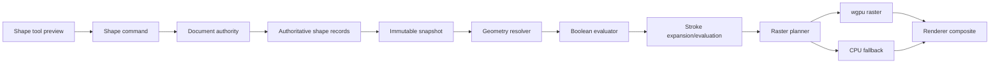
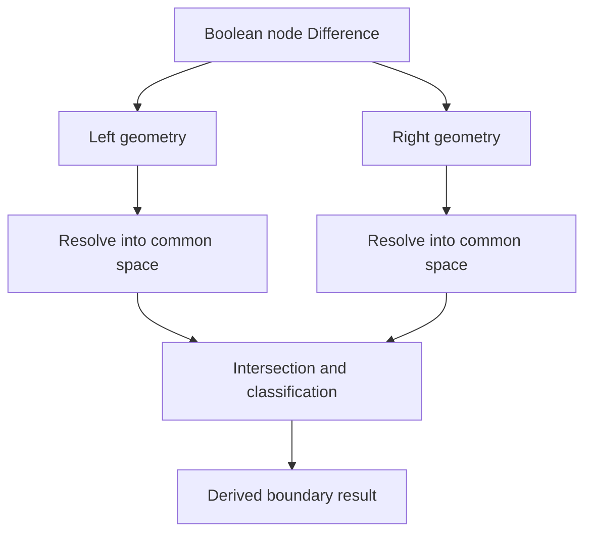
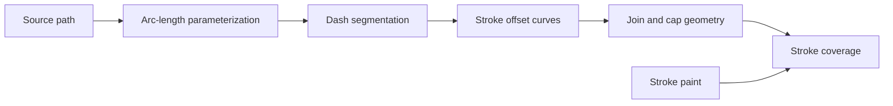
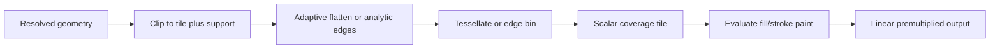
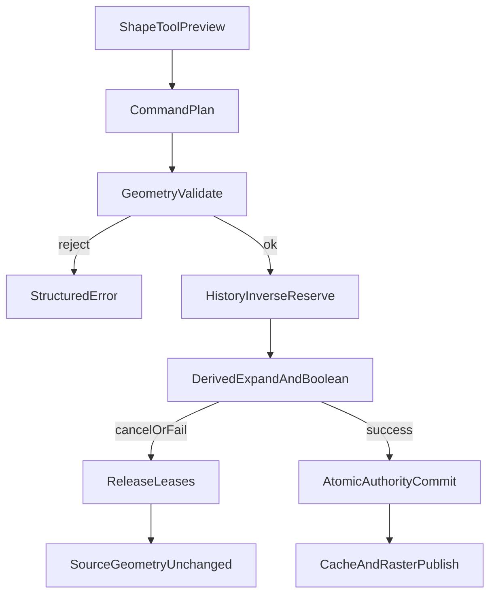

# 19 — Shape Engine

## Overview

The PhotoTux shape engine preserves editable vector geometry while producing antialiased raster contributions for compositing. Shape layers own paths, parametric primitives, boolean structure, fills, strokes, transforms, and resource references. Flattened paths, boolean results, tessellation, coverage tiles, signed-distance aids, and GPU buffers are derived caches.

Every persistent geometry/style mutation **MUST** enter through the [Command System](08-Command-System.md), commit a history transaction, and publish immutable snapshots/deltas. Tools may hold transient handles and previews, but renderer and presentation cannot mutate shape records. Conversion to paths, expansion of stroke, boolean bake, and rasterization are explicit commands with distinct editability consequences.

Rendering is GPU-first through wgpu, not GPU-only. A CPU geometry/raster path provides reference behavior, fallback, export consistency, and recovery. Core geometry is cross-platform; Linux-native adapters provide input, accessibility, clipboard/file capabilities, and presentation without contaminating semantic records.

### Accepted v1 (shipping)

[DR-027](Appendix/Decision-Register.md#dr-027--graph-kind-set-includes-shape): `LayerKind::Shape` with rect / ellipse / line primitives, fill/stroke, create + rasterize commands, CPU/GPU raster contribution. Boolean ops, full parametric sets, and advanced path editing are **Deferred** incremental work.

## Gradient shapes

Five shapes, declared by `phototux_engine::GradientKind`:

| Kind | What the drag means |
| --- | --- |
| Linear | Along the drag, perpendicular bands |
| Radial | Outward from the start, circular bands |
| Angle | A sweep of angle around the start; the drag sets where zero points rather than how far the ramp reaches |
| Reflected | Along the drag and mirrored back, so the start is the centre of the band |
| Diamond | Outward from the start in a rotated square (Chebyshev distance in the drag's frame) |

What varies between them is only *where a point sits on the ramp* — `parameter_at`, which decides what the user's drag means and is therefore document policy. Interpolating the colour and walking the buffer stay with the fill code in `phototux_gpu`. `GradientRamp` carries the shape, both endpoints and both colours as one value, because they are five halves of one answer: a caller holding the endpoints but not the shape cannot paint.

Every kind reads `0` at the drag's start, so the first colour always appears where the user pressed, and every kind clamps to `0..=1` however far the point lies from the drag. A click with no drag names no gradient and fills flat rather than dividing by zero. Tests assert all three, plus that no two kinds map the same probe identically — a shape the chrome offers and the maths does not distinguish is a shape that does not exist.

## Responsibilities

The shape engine **MUST**:

- represent finite bounded paths and parametric primitives with stable object/subobject identities;
- define coordinate systems, transforms, winding/fill rules, and contour orientation;
- support line, quadratic/cubic curve, close, and declared arc semantics;
- define fills, gradients/pattern references, strokes, joins, caps, dashes, alignment, and opacity;
- evaluate ordered boolean union, intersection, difference, and exclusion deterministically;
- preserve source geometry until explicit conversion/bake;
- provide exact or tolerance-bounded bounds, hit testing, snapping, and rasterization;
- separate transient tool geometry from authoritative records;
- invalidate conservative affected tiles and dependencies;
- schedule bounded CPU/GPU work with cancellation and stale-result checks;
- support documents larger than memory through region/tile evaluation;
- persist versioned geometry independent from Rust/GPU layout;
- validate hostile path/primitive/resource input;
- expose keyboard-accessible editing and structured accessible summaries.

It **SHOULD** retain parametric editability and nondestructive transforms. It **MAY** use analytic rasterization, tessellation, coverage masks, or hybrid methods when output conforms.

## Architecture



### Internal hierarchy

```text
Shape subsystem
├── shape object registry
├── path and subpath records
├── parametric primitive records
├── geometry command builders
├── transform and coordinate services
├── fill style resolver
├── stroke style/evaluator
├── boolean expression resolver
├── bounds and hit testing
├── snapping/index services
├── tessellation/analytic raster planning
├── wgpu raster pipelines
├── CPU reference/fallback
├── caches/resource leases
├── persistence/migration
└── diagnostics/accessibility
```

## Object Model

```rust
struct ShapeLayerPayload {
    geometry: GeometryTree,
    styles: BoundedList<ShapeStyle>,
    transform: Transform2D,
    coordinate_space: ShapeSpace,
}

enum GeometryNode {
    Path(PathRecord),
    Primitive(PrimitiveRecord),
    Boolean(BooleanRecord),
    Group(GeometryGroup),
    PreservedUnavailable(OpaqueGeometry),
}

struct PathRecord {
    id: GeometryId,
    revision: GeometryRevision,
    subpaths: BoundedList<Subpath>,
    fill_rule: FillRule,
}

struct ShapeStyle {
    fill: Optional<FillStyle>,
    stroke: Optional<StrokeStyle>,
    opacity: UnitInterval,
    blend: BlendModeId,
}
```

Conceptual only. Geometry node IDs are stable within shape object and are not array indexes. Point/segment IDs support selection and async applicability. Deleting a point retires its ID under object policy. Reordering storage cannot retarget handles.

## Coordinate Spaces and Numeric Model

Geometry is stored in shape-local coordinates. Shape layer transform maps local to parent/document. Nested geometry groups may add transforms when explicitly supported. View/device transforms are derived and never saved as geometry.

Coordinates use a documented finite floating or fixed semantic domain. Exact in-memory precision remains implementation choice, but serialization, comparison tolerances, and overflow limits are fixed. NaN and infinity are invalid. Products, subdivision counts, tile indexes, and allocation sizes use checked arithmetic.

Transform contracts name matrix convention, multiplication order, pivot, and source/destination spaces. Affine transform is baseline. Projective transforms use separate type and behavior. Singular transforms may render forward but operations requiring inverse mapping—hit testing, local drag, some snapping—return typed unavailable.

```text
shape-local geometry
    ↓ optional geometry-node transforms
layer-local resolved geometry
    ↓ layer transform
document geometry
    ↓ view transform
viewport/device geometry
```

Editing a layer transform differs from applying transform to geometry. `shape.set-transform` preserves source coordinates. `shape.apply-transform` rewrites coordinates and resets/composes transform, with explicit handling of stroke scaling and primitive preservation.

## Path Representation

A subpath starts with one move point, contains bounded segments, and is open or closed. Segment types:

- line from current point to endpoint;
- quadratic curve with control and endpoint;
- cubic curve with two controls and endpoint;
- declared elliptical arc converted/evaluated under stable arc parameters;
- close connecting to initial point under fill/stroke rules.

Zero-length segments are valid only under defined stroke-cap behavior and are ignored or retained explicitly for fill. Duplicate points, cusps, self-intersections, and open contours are not automatically “repaired.” Commands may simplify or clean geometry explicitly.

Fill of open subpaths treats them as implicitly closed for interior determination under declared rule, while stroke remains open unless close exists. Fill rules are nonzero winding and even-odd with exact edge-crossing convention. Contour orientation is informative for nonzero but boolean algorithms may canonicalize orientation in derived output.

Bezier evaluation uses stable parameter range and adaptive subdivision/error metric or analytic method. Flattening tolerance is output-space dependent and included in cache identity. Authoritative paths never become flattened solely because a cache was produced.

## Parametric Primitives

Parametric primitives retain meaningful controls:

- rectangle with optional independent corner radii;
- ellipse/circle;
- line;
- polygon/star with center, radii, points, rotation, and rounding;
- rounded polygon where semantics are defined;
- arc/pie/chord;
- other bounded deterministic primitives added through versioned schemas.

```rust
struct PrimitiveRecord {
    id: GeometryId,
    revision: GeometryRevision,
    kind: PrimitiveKindId,
    behavior_version: BehaviorVersion,
    parameters: CanonicalParameters,
    local_transform: Transform2D,
}
```

Parameters define units, finite ranges, clamping/rejection, orientation, degeneracy, and output path mapping. A rectangle with radius exceeding half extent uses a fixed normalization rule. Polygon point count has limits. Star inner radius and winding behavior are explicit.

Editing primitive handles updates parameters, not converted path points. `shape.convert-primitive-to-path` is a command preserving appearance and creating editable path segments; history retains primitive. Operations unsupported parametrically may offer conversion preview, never automatic hidden conversion.

### Starting geometry for a new shape layer

What "New Rectangle" actually creates is `phototux_engine::ShapePreset` (`shape_preset.rs`), one variant per menu entry, next to the path helpers it calls. Two properties hold for every preset and are asserted rather than assumed:

- **Every dimension is a fraction of the document.** A preset that used absolute pixels would open too small to grab on a 4K canvas and off-canvas on a small one. The tests state this as "doubling the document doubles the shape" plus a minimum fraction of the smaller dimension — the proportionality half is what catches a size that was clamped to a constant, which a "did it enclose anything" check passes.
- **An unknown kind creates nothing.** `ShapePreset::parse` returns `Option` with no fallback, unlike [`tool_id::is_known`](32-Developer-Guide.md#shared-vocabularies), which does fall back. Picking an unknown *tool* would leave the user with no tool; creating an unrequested *layer* is a document mutation they then have to notice and undo, so making nothing is the recoverable answer.

`kind_key` is deliberately not `as_str`: a gradient and a live rectangle both record `rect`, since they are rectangles differing only in what decorates them.

## Geometry Hierarchy and Boolean Operations

Geometry tree permits ordered groups and boolean nodes. Boolean record references child geometry under containment, not arbitrary document objects, unless future typed reference semantics exist. Operations:

- union: interior belonging to either child;
- intersection: interior belonging to both;
- difference: left interior excluding right;
- exclusion: interior belonging to exactly one.

Boolean evaluation occurs in a common coordinate space after child local transforms. Fill rules and open-path treatment are explicit. Stroke is normally applied after boolean fill result unless “outline participates in boolean” is a separately modeled expanded geometry.



Boolean source remains editable. Result paths are cache. `shape.bake-boolean` replaces expression with path result through explicit transaction. Child order matters for difference and deterministic tie handling. Expression graph is acyclic and bounded in depth/edges.

Robustness requires defined tolerance model. Topological classification should use adaptive/exact predicates where practical and avoid arbitrary epsilon that changes with zoom. Coincident edges, tangencies, self-intersections, tiny loops, and degenerate segments have conformance fixtures. If operation cannot produce valid result, renderer reports unavailable node; it cannot mutate source to fix it.

## Fill Styles

Fill kinds include solid color, gradient, pattern, and bounded deterministic local procedural fill. Each declares coordinate space, transform, repeat/edge, interpolation, color profile, alpha, opacity, and resource revision. Fill rule belongs to geometry.

Solid colors are profiled values converted by [16 — Color Management](16-Color-Management.md). Gradients define stable stops, interpolation color space, spread method, geometry, midpoint policy if any, and stop ordering. Patterns reference embedded/pinned resources and transform. Missing resources preserve style and show disclosed unavailable/fallback output.

Fill evaluation produces premultiplied linear contribution under compositor contract. Coverage from shape rasterization multiplies fill alpha. Transparent fills remain editable. A fill can exist without stroke and vice versa.

## Stroke Model

Stroke style defines width, units, alignment, cap, join, miter limit, dash array/offset, profile/variable width if supported, paint, opacity, and transform-scaling policy.

Caps: butt, round, square, and any future named behavior. Joins: miter, bevel, round, with miter-limit equation explicitly defined. Dashes use nonnegative lengths, even/odd normalization policy, offset wrap, phase continuity across subpaths, and zero-length handling. Empty/invalid all-zero arrays reject.

Stroke alignment can be center, inside, or outside where interior is well-defined. Inside/outside for open or self-intersecting paths requires explicit unavailable or conversion semantics. It cannot vary by backend.



Nondestructive stroke evaluation retains source path/style. `shape.expand-stroke` converts visual stroke to fill geometry under a stated tolerance and transform context. It is destructive to stroke editability and undoable. Variable-width profiles, if added, must define interpolation and cusp behavior.

Transform scaling policy distinguishes geometric stroke that scales with shape from non-scaling/view-like stroke. Non-scaling document strokes require a document-space definition and cannot depend on viewport zoom for export.

## Bounds

Geometry bounds are conservative and classified:

- control bounds: cheap bounds containing curve controls;
- exact/analytic path bounds: extrema-aware geometry bounds;
- stroke bounds: expanded by width, caps, joins, miter, dashes;
- effect bounds: expanded by filters/masks;
- transformed document bounds;
- ink bounds after clipping.

Bounds caches key geometry/style/transform revisions and behavior. A false-narrow bound causes missing rendering/hit testing and is a correctness defect. Unbounded procedural fill does not make shape geometry unbounded; effects may.

## Hit Testing

Hit testing maps document/view point through inverse transforms, then evaluates fill interior, stroke distance/coverage, control points, handles, and bounding boxes according to tool mode. It returns semantic target path:

```rust
struct ShapeHit {
    shape_object: ObjectId,
    geometry: GeometryId,
    subpath: Optional<SubpathId>,
    segment: Optional<SegmentId>,
    control: Optional<ControlPointId>,
    kind: ShapeHitKind,
    distance: FiniteLength,
    document_position: Point2,
}
```

Tolerance is derived from accessible device-pixel target size mapped into document/local space, not stored geometry. Hit order is deterministic: explicit active handles, selected geometry, visual stacking, geometric distance, stable ID tie breaker. Hidden/locked objects follow tool policy and cannot be edited accidentally.

Hit testing may use spatial index but confirms exact semantic test. Stale indexes carry revisions and drop. GPU picking may accelerate presentation but CPU semantic confirmation is required before command targeting.

## Snapping

Snapping is a tool interaction service, not automatic geometry mutation. Candidate sources include document/grid guides, pixel grid, canvas bounds/center, shape points, path extrema, intersections, tangents, centers, baselines, equal spacing, angles, and selected-object bounds.

```text
Pointer proposal
├── query spatial index within device-derived radius
├── generate typed candidates
├── filter by enabled snapping policy
├── score distance + semantic priority
├── apply hysteresis/lock
└── show candidate and submit resolved geometry on commit
```

Snap policy is workspace/tool preference unless command records final constraint. Candidate includes source object/revision and exact snapped document value. Final command revalidates source; if changed, it rejects or uses unsnapped raw proposal under explicit policy. It never snaps to stale hidden geometry silently.

Angle constraints, symmetric handles, tangent continuity, and modifier behavior are consistent across tools. Snapping indicators are overlays and accessible status. Reduced motion and high contrast apply.

## Tool Workflows

### Draw parametric rectangle

1. Host input maps to document coordinates.
2. Tool captures origin, current corner, modifiers, and snap candidates in transient state.
3. Preview creates immutable primitive descriptor outside document.
4. Escape/focus loss cancels without mutation.
5. Release submits `shape.create-primitive` with parent, insertion, bounds, radii, style, and snap-resolved values.
6. Command validates target, dimensions, resources, and budgets.
7. One transaction creates shape/object IDs and publishes dirty bounds.

### Edit path node

Tool selects stable point/handle ID. Drag preview updates isolated geometry branch and raster overlay. Commit command names shape generation/revision and exact new coordinates/continuity mode. Concurrent geometry change causes stale rejection. History stores before/after bounded records.

### Boolean composition

User selects geometry nodes in defined order. Command creates nondestructive boolean node after validating same shape/document, ownership, transforms, cycles, complexity, and style policy. Renderer computes derived result. Bake is separate.

### Expand stroke

Worker resolves source path/style/transform at snapshot, computes bounded fill geometry, verifies topology, and builds candidate. Commit replaces stroke semantics with paths according to explicit output policy and history retains source. Cancellation/stale result commits nothing.

### Rasterize shape

Command captures output bounds, resolution, profile, precision, antialias quality, target layer policy, and source revision. CPU/wgpu generates recoverable tiles. Atomic commit replaces or creates raster layer. Source remains in history under budget.

## Rasterization Semantics

Rasterizer converts fill/stroke geometry to scalar coverage at requested sample grid. Pixel-center convention, fill edge inclusion, antialiasing, flattening error, and compositing are versioned. Coverage lies in [0,1].

Methods may include analytic edge integration, adaptive supersampling, scan conversion, tessellation to triangles with multisample/coverage strategy, or hybrid. GPU and CPU may differ internally but match reference tolerance. Tessellation must not expose cracks between contours/tiles.



Tile clipping preserves winding and intersections at boundaries. Antialias support expands dirty bounds. High zoom does not alter authoritative geometry, only raster quality. Export uses requested final scale rather than cached viewport tiles unless keys match exactly.

## GPU and CPU Boundaries

CPU generally performs geometry validation, robust booleans, bounds, hit testing, snapping indexes, and reference rasterization. wgpu accelerates coverage, paint evaluation, and compositing. GPU tessellation may be used if bounded and equivalent.

GPU buffers contain immutable flattened vertices/edges, indices, transforms, styles, and tile bins keyed by geometry revision and device generation. They are derived. Device loss discards them. Persisted documents contain no GPU offsets, tessellation, or shader code.

Destructive rasterization results become authoritative only after recoverable output validation. Nondestructive viewport shape output remains cache. Unsupported GPU features select multipass or CPU; shape layer never requires GPU-only meaning.

## Scheduling, Concurrency, Cancellation, and Backpressure

Active handle/cursor preview has highest shape priority, followed by visible selected geometry, visible shape raster tiles, accepted geometry preparation, export, offscreen tiles, thumbnails, and speculative tessellation. Document commits serialize; bounds/boolean/tessellation/raster jobs use snapshots.

Worker results carry document/version, object generation/revision, geometry/style/resource revisions, transform, quality, and applicability. Stale results drop. A geometry edit invalidates only dependent caches and affected conservative regions.

Queues and resources are bounded by geometry nodes, points, segments, intersections, boolean depth, subdivision steps, tessellation vertices, tile bins, CPU/GPU bytes, and jobs. Under pressure scheduler cancels speculative work, reduces preview-only quality, evicts caches, streams tiles, or rejects before commit. It never simplifies authoritative geometry silently.

CPU algorithms check cancellation at bounded subdivision/intersection/tile phases. Submitted GPU work can be abandoned. Commit is noninterruptible once installation begins. Long boolean/bake/raster operations expose phase progress and cancellation.

## Caches and Resource Lifetime

Caches include primitive-to-path results, transformed geometry, curve extrema/bounds, flattenings by tolerance, arc-length tables, boolean results, stroke expansions, spatial indexes, tessellation, GPU edge/vertex buffers, coverage tiles, paint resources, thumbnails, and hit-test aids.

Keys include all geometry/style/transform/resource revisions, fill/stroke rules, behavior versions, output scale/tolerance, color context, tile coordinate, and device generation. Bounds/hit caches never cross revisions. View tolerance entries cannot feed export unless exact key matches.

Authoritative geometry/resources and history are separate from caches. Snapshot leases pin source records. Prepared command leases own provisional baked/raster output. Device loss drops GPU entries. Eviction affects latency only.

## Deterministic Behavior

Determinism covers primitive expansion, transform order, boolean child order, topology predicates/tolerances, dash placement, joins/caps, flattening error, snapping tie breaks, raster sample convention, and random-free paint semantics. Worker order cannot alter intersection ordering or tessellation output meaning.

Floating topology is challenging; conformance emphasizes stable classified output and raster pixels within tolerance, not identical internal vertex order unless serialized by a bake command. Baked path output uses deterministic canonical contour/order/point representation.

## Persistence and Versioning

Editable save records geometry tree, stable IDs, primitives with behavior versions/parameters, paths, fill rules, boolean nodes, styles, transforms, fill/stroke resources, and preserved unknown bounded data. It excludes tessellation, indexes, GPU buffers, coverage tiles, and viewport snapping.

Migrations preserve geometry meaning. Changes to primitive generation, arc conversion, winding, boolean classification, dash phase, miter limit, flattening, or raster sample convention require adapters/versioned behavior. If exact evaluation unavailable, preserve record as unavailable with optional verified fallback; never silently bake or reinterpret.

Export/conversion formats unable to preserve booleans, primitives, gradients, strokes, or transforms receive loss plan tied to snapshot. User may choose convert to paths or raster explicitly.

## Security, Privacy, and Accessibility

Imported paths/resources are hostile. Validators limit coordinates, nodes, contours, segments, control points, primitive counts, boolean depth, intersection work, subdivision, dash elements, gradient stops, pattern bytes, and transforms. Checked arithmetic precedes allocation. Procedural fills are bounded declarative and cannot access files/network or execute shaders/scripts.

Shape names, geometry, bounds, resource names, document paths, and thumbnails are private. Diagnostics redact content while recording counts, operation types, timings, cache, and failures.

Accessibility exposes shape kind/name, hierarchy, bounds and position with units, fill/stroke summary, transform, lock/selection, node/segment count, primitive parameters, boolean operation, and unavailable state. Keyboard actions create primitives with numeric values, select/navigate nodes, nudge points, edit handles/parameters, invoke booleans, expand/rasterize, and cancel operations. Snap status announces target/value without relying on guide color.

## Failure, Device Loss, and Recovery

Invalid geometry, topology, resource, or transform rejects command without mutation. Boolean failure preserves expression/source and marks derived output unavailable. Allocation/tessellation/raster failure releases provisional resources. Renderer cannot “repair” source.

Device loss clears GPU geometry/coverage and rebuilds from snapshot or CPU. Authoritative shape/history remains. Rasterize lost before commit has no effect; after commit recoverable transaction survives. Last complete frame may remain during recovery.

Recovery persists committed source geometry and required resources. Corrupt optional geometry can become unavailable opaque object; required structural corruption may reject open. Recovery does not substitute empty geometry because that could hide content/loss. Repair/simplify is explicit command.

## Design Rationale and Alternatives
**Editable paths/primitives versus raster authority.** Vector source scales and remains editable. Raster is simpler but loses structure. Explicit rasterization bridges workflows.

**Nondestructive boolean tree versus immediate path replacement.** Tree preserves operands and parameter changes, at render cost. Bake offers optimization with disclosed loss.

**Stable subobject IDs versus indices.** IDs survive insert/delete and async work; indexes are transient.

**CPU robust geometry plus GPU raster versus all-GPU.** Robust topology and fallback favor CPU; GPU accelerates repeated tile raster. Separation protects authority.

**Conservative bounds versus aggressive approximate bounds.** Conservative bounds avoid missing pixels at performance cost. Exact optimization is added only with proof.

**Snapping as transient tool service versus automatic constraint.** Transient snapping preserves explicit final coordinates. Persistent constraints would require a separate solver/history specification.

## Best Practices

- Preserve source geometry through previews and caches.
- Use stable IDs for points/segments/nodes.
- Define fill, stroke, boolean, and transform order before optimization.
- Include output tolerance and scale in geometry cache keys.
- Use robust predicates for topology.
- Bound subdivision and intersection work.
- Test degenerate/tangent/coincident/self-intersecting geometry.
- Keep view hit tolerance out of document data.
- Distinguish transform, apply-transform, expand-stroke, bake, and rasterize.
- Compare CPU/wgpu coverage at tile boundaries.
- Keep snapping accessible and revalidate source on commit.
- Never persist GPU/tessellation artifacts as sole geometry.

## Future Extensibility

Future shape semantics may add richer primitives, variable-width strokes, text on paths, persistent constraints, symbols, mesh gradients, compound styles, or sandboxed deterministic local geometry operations. Each **MUST** define source authority, IDs, transforms, bounds, topology, persistence, history, CPU/GPU fallback, budgets, security, accessibility, and migration.

Alternative tessellators, spatial indexes, and wgpu backends can evolve behind semantic tests. No extension receives mutable document pointers, arbitrary shaders, network resources, accounts, or generative behavior.

## Testability and Diagnostics

Headless fixtures cover lines, curves, arcs, open/closed/self-intersecting paths, every fill rule, joins/caps/dashes, transformed primitives, booleans with tangencies/coincident edges, gradients/patterns, and tile boundaries. Golden traces include resolved bounds, topology summaries, snap candidates, dirty tiles, and CPU coverage.

Property tests generate bounded geometry and assert finite output, containment of ink by bounds, transform round trips where invertible, boolean identities on valid sets, deterministic primitive conversion, cache-cold/warm equality, and no mutation on failure. Fuzzers target parsers and topology.

Diagnostics record shape/geometry IDs/revisions, node/segment counts, operation/behavior versions, bounds, intersection/subdivision/tessellation counts, CPU/GPU timings, cache bytes, stale drops, cancellation, device generation, and typed failures. Coordinates and content are redacted.

## Acceptance Scenarios

### Parametric editability

Create rounded rectangle, edit radius/size, save/reopen. Assert primitive parameters/ID remain, derived path/raster can be evicted, and appearance matches reference.

### Boolean tangency

Union/intersect paths sharing tangent/coincident edges. Assert deterministic topology/raster, no cracks, source operands remain editable, CPU/GPU coverage meets tolerance, and bake yields canonical bounded path.

### Stroke semantics

Render dashed cubic with miter/round joins at transforms and tile edges. Assert dash phase, cap/join, scaling policy, bounds, dirty halo, and no seams.

### Snapping stale source

Preview snap to shape point revision 3, move source to revision 4 in another view, then commit. Assert command revalidates and rejects/re-resolves under policy; it never commits stale snapped coordinate silently.

### Cancel expand

Begin expensive stroke expansion, cancel during subdivision. Assert source/style/version/history unchanged, provisional geometry released, and status returns idle.

### Rasterize and undo

Rasterize HDR gradient shape to high-bit-depth target. Assert color/alpha semantics, recoverable tiles, one transaction, source retained in inverse, and undo restores editable identity.

### Device loss

Lose wgpu device while coverage tiles render. Assert GPU caches invalidate, CPU/new device regenerates from snapshot, document/history unchanged, and no partial frame labeled complete.

### Malicious geometry

Import geometry with huge counts, recursive boolean graph, NaN coordinates, and excessive dash array. Assert bounded validation rejects before large work/allocation and no document object becomes visible.

## Acceptance Criteria

- Paths, primitives, boolean structures, fills, strokes, and transforms remain editable and explicit.
- Geometry/subobject IDs survive ordinary edits and asynchronous work.
- Boolean, stroke, bounds, snapping, and raster semantics are deterministic/versioned.
- CPU fallback and wgpu output meet declared tolerance, including tile edges.
- Derived caches/device resources never become shape authority.
- Destructive conversion/bake/expand/rasterize operations are exact named commands and undoable under policy.
- Scheduling, cancellation, backpressure, and memory remain bounded.
- Persistence preserves editability or reports loss before conversion.
- Linux/toolkit integration stays outside portable shape records.
- Security and accessibility have structured testable behavior.

## Implementation Conformance Contract

A conforming shape implementation **MUST** publish behavior versions for primitive expansion, arc interpretation, curve extrema, fill classification, boolean topology, dash measurement, cap/join construction, stroke alignment, flattening, snapping, and raster sampling. A release changing visible geometry beyond declared tolerance advances the relevant behavior version and supplies migration or preserved-unavailable handling.

Geometry validation **MUST** be total over bounded input and return structured errors for non-finite coordinates, invalid IDs, duplicate containment, cycles, excessive depth/count, unsupported primitive parameters, noninvertible operations, and resource limits. Validation cannot modify candidate geometry as repair. Simplification, cleanup, winding normalization, and degeneracy removal are explicit previewable commands.

Topology fixtures **MUST** cover disjoint, crossing, tangent, coincident, overlapping, self-intersecting, nested, reversed, zero-area, and extremely small contours at varied coordinate magnitudes. Boolean output is tested both structurally after canonical bake and visually through reference raster. Reordering worker tasks or cache state cannot change contour classification.

Stroke fixtures **MUST** cover open/closed paths, zero-length segments, cusps, every cap/join, miter thresholds on both sides, odd/even dash arrays, phase wrapping, transforms with reflection/nonuniform scale, inside/outside alignment eligibility, and tile boundaries. Bounds instrumentation verifies raster writes never occur outside declared support.

Snapping/hit-test tests **MUST** use rotated/mirrored views, fractional scale, overlapping shapes, locked/hidden objects, stale indexes, singular transforms, and equal-distance candidates. Stable semantic priority and IDs decide ties. Final command always revalidates candidate source revision.

Raster tests **MUST** compare CPU and each wgpu tier at subpixel translations, high zoom, tiny geometry, HDR paints, soft masks, and adjacent tiles. Cache-cold, cache-warm, different tile partition, and different job order produce equivalent output.

Failure injection **MUST** cover boolean planning, intersection storage, stroke expansion, tessellation, GPU upload, raster readback, history inverse reservation, authoritative commit, and publication. Before commit all source geometry remains byte/semantically equivalent; after commit recovery and undo remain valid. Diagnostics expose versions, counts, topology phases, bounds, and errors while redacting geometry coordinates and private resource data.

## Operational Edge Cases and Boundary Contracts

Shape authority is the editable geometry graph: parametric primitives, path nodes, attributes, fills, strokes, clips, and boolean source references. Flattened contours, dash expansions, tessellations, and raster tiles are derived. Edge cases concentrate where topology, numerics, and tool intent disagree.

Degenerate geometry is explicit. Zero-length segments, coincident points, collapsed rectangles, arcs with null radii, polygons with repeated vertices, and contours with fewer than the minimum points for their type **MUST** validate with structured errors or canonical empty outcomes under named cleanup commands. Validation never “fixes” candidate geometry in place during probe; only explicit simplify/cleanup commands mutate authority.

Numeric magnitude spans matter. Coordinates near zero, near large finite limits, and mixed scales inside one group stress extrema, hit thresholds, and boolean predicates. Implementations **MUST** document working precision, reject non-finite values, and define snap/hit tolerances in document space after view transform inversion. Tangent and coincident cases in boolean operations have deterministic classification tables; floating noise cannot flip inside/outside labels across reruns with identical inputs and behavior versions.

Containment and hierarchy limits are hard. Cyclic parent references, duplicate child IDs, excessive nesting depth, and excessive contour/point counts fail validation before scheduling expensive booleans. Boolean operands that share IDs incorrectly, reference deleted revisions, or cross locked layers are rejected at command planning.

Stroke edge cases include open paths with asymmetric caps, closed paths with coincident start/end, dash arrays of odd length, zero gaps, phase wrapping beyond pattern length, miter joins beyond threshold on both sides of a turn, reflective transforms, and inside/outside alignment on open paths. Ineligible alignments return structured errors rather than silently switching to centered stroke. Flattening budgets bound segment fan-out; exceeding budget fails the job without partial authoritative expansion.

Hit testing and snapping confront overlapping candidates, locked/hidden objects, masked shapes, equal-distance ties, and stale spatial indexes. Priority is semantic and stable: selectable unlocked objects outrank guides; identical distances break ties by declared ID order. Tool previews may use approximate indexes; final commands revalidate against source revision.

## Failure Modes, Security, and Trust Boundaries

Malicious or accidental geometry can attempt combinatorial explosion through boolean cascades, dash expansion, offset curves, and tessellation. The engine **MUST** enforce point, contour, nesting, operation-depth, and temporary-buffer budgets. Failures free scratch memory and leave prior authoritative geometry untouched.

Path deserialization bounds coordinates, verb counts, and custom attribute blobs. Unknown verbs in older files map to preserved-unavailable segments when safe, or reject the shape record when semantics would be inventable. No shape payload may include executable code, scripting, or external resource fetches. Linked image fills follow import trust rules elsewhere; the shape engine consumes validated paint references only.

Diagnostics report topology phase, operand counts, bounds, behavior versions, and error codes. They **MUST NOT** dump full coordinate arrays from user documents into shared logs by default. Accessibility exposes shape roles, names, and transform summaries, not raw vertex dumps, unless a developer probe is explicitly enabled.

Destructive expand-stroke, bake-boolean, convert-to-raster, and convert-to-path commands reserve history inverses before replacing editable sources. Failure after preview but before commit preserves parametric editability. GPU tessellation or tile upload failures do not leave half-applied boolean results in the layer tree.

## Concurrency, Cancellation, and Consistency

Boolean planning, intersection, stroke expansion, flattening, tessellation, bounds, hit-index, and raster jobs are revision-keyed. Completion after a newer geometry revision is discarded. Interactive tools may show previews from in-flight jobs marked non-authoritative; committing a node edit cancels those leases.

Memory pressure and backpressure shed speculative boolean previews first, then non-visible tile rasters, then cold caches. Authoritative path records and the current undo inverse remain pinned within history policy. Worker reordering **MUST NOT** change boolean topology outcomes for the same operands and behavior version.

Device loss drops GPU meshes and raster tiles. CPU reference paths and analytical bounds remain. Rebuild proceeds by visible priority. Concurrent edits during rebuild invalidate stale meshes through the same applicability gate used for booleans.



## Migration, Compatibility, and Persistence Evolution

Persisted shapes store primitive parameters or path verbs, paint references, stroke attributes, hierarchy, and behavior versions for arc interpretation, boolean topology, and stroke expansion. Tessellations and dash caches are omitted.

Migrations rewrite obsolete primitive encodings into current parametric forms without baking to paths unless the user accepts irreversible conversion. If a boolean algorithm version changes visible topology beyond tolerance, documents either pin the old behavior version or require an explicit rebuild command with preview. Missing paint resources leave shapes geometrically intact with unresolved-fill status.

Group transforms and nonuniform scale interact with stroke alignment and dash length. Migration notes **MUST** record whether dash lengths are in local or world space for the behavior version so reopen does not silently restripe artwork.

## Extended Acceptance Scenarios

**Tangent boolean stability:** Compute union/intersection on near-tangent circles at multiple coordinate magnitudes. Assert identical classification across shuffled worker order and cold/warm caches for one behavior version.

**Dash phase wrap:** Stroke an open path with odd-length dash array and phase beyond pattern length under reflective transform. Assert deterministic caps/joins and bounds that enclose all ink.

**Stale snap commit:** Show snap preview to object A; delete A before mouse-up commit. Assert final command revalidates, rejects stale target, and leaves geometry unchanged or snaps to next valid candidate per policy.

**Expand cancel:** Start expand-stroke on a dense path; cancel before commit. Assert no authoritative path replacement, leases released, and history cursor unchanged.

**Budget bomb:** Submit nested boolean chain exceeding operation-depth budget. Assert structured rejection, no partial layer mutation, and responsive UI thread.

**Device-loss mesh:** Lose wgpu device after tessellation publish. Assert analytical bounds and CPU fallback remain, meshes rebuild, and document geometry bytes unchanged.

**Locked hit ignore:** Hit-test stack with locked top shape over unlocked lower shape. Assert selection planning ignores locked geometry and reports the unlocked target.

## Interop with Text, Masks, and Filters

Shapes that clip text frames, serve as vector masks, or feed filter ROI geometry remain shape-authoritative until an explicit bake converts them. Text-on-path and text-in-shape layout consume path samples as derived inputs; editing the path invalidates text layout revisions without rewriting style runs. Mask attachments reference shape IDs; deleting a shape fails closed if a mask still requires it, or detaches under a named command that records history. Filter nodes that consume vector silhouettes pin path revision hashes so async filter completion cannot apply against a newer silhouette without revalidation. Export of mixed vector/raster compositions records whether shapes stayed editable or were rasterized under the export plan, preserving the same irreversibility messaging used by in-app bake commands.


## Persistence Integrity and Diagnostic Contracts

Shape persistence treats parametric primitives, path verbs, hierarchy, paint references, stroke attributes, and pinned behavior versions as the sole reopen authority. Tessellation buffers, dash expansions, spatial indexes, and raster tiles **MUST** rebuild from that authority after load. A conforming loader rejects non-finite coordinates, cyclic containment, duplicate geometry IDs, and unbounded verb counts before any shape becomes selectable. When an older document pins a boolean or stroke behavior version the current engine no longer executes byte-identically, the loader either keeps the pin with a rebuild-preview command or marks affected shapes preserved-unavailable; it never silently rebooleans artwork under a new algorithm during open.

Diagnostic contracts for shapes mirror other engines: counts, revisions, topology phase codes, bounds summaries, cache generations, and typed errors are retained; full coordinate dumps, private resource paths, and paint pixel payloads are redacted by default. Accessibility exposes role, name, transform summary, and fill/stroke presence without requiring vertex enumeration. Golden conformance fixtures cover reopen after bake, reopen after expand-stroke undo, and reopen with missing paint resources so editability loss is never accidental.

## Cross References

- [00 — Introduction](00-Introduction.md)
- [01 — Information Architecture](01-Information-Architecture.md)
- [08 — Command System](08-Command-System.md)
- [10 — Document Model](10-Document-Model.md)
- [11 — Layer System](11-Layer-System.md)
- [12 — Selection System](12-Selection-System.md)
- [13 — Mask System](13-Mask-System.md)
- [15 — Filter Engine](15-Filter-Engine.md)
- [16 — Color Management](16-Color-Management.md)
- [17 — Rendering Engine](17-Rendering-Engine.md)
- [18 — Text Engine](18-Text-Engine.md)
- [20 — History and Undo](20-History-Undo.md)
- [Glossary](Appendix/Glossary.md)
- [Requirement Keywords](Appendix/Requirement-Keywords.md)
