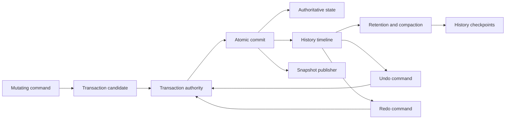
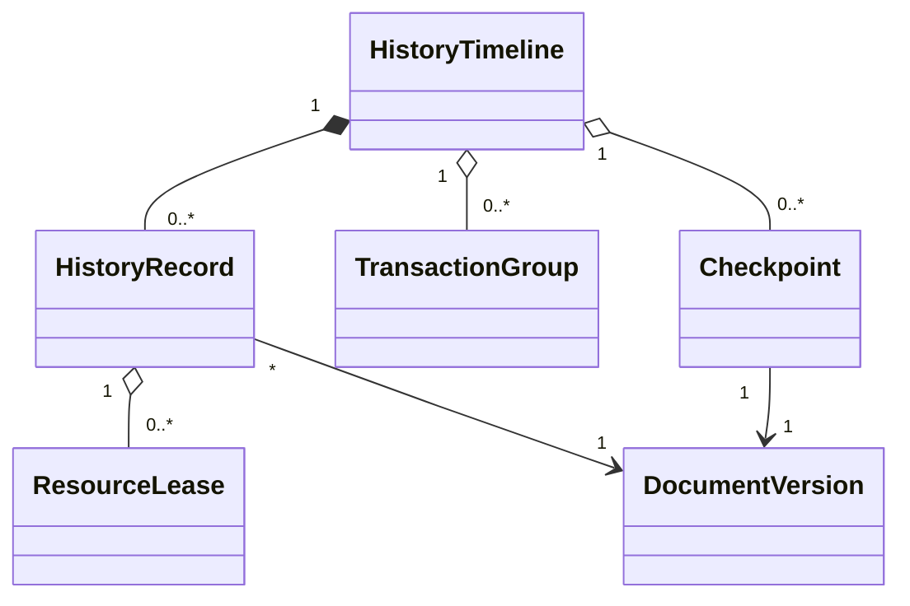
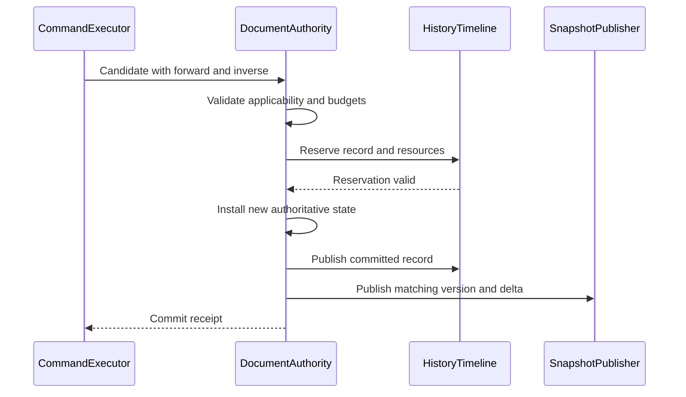
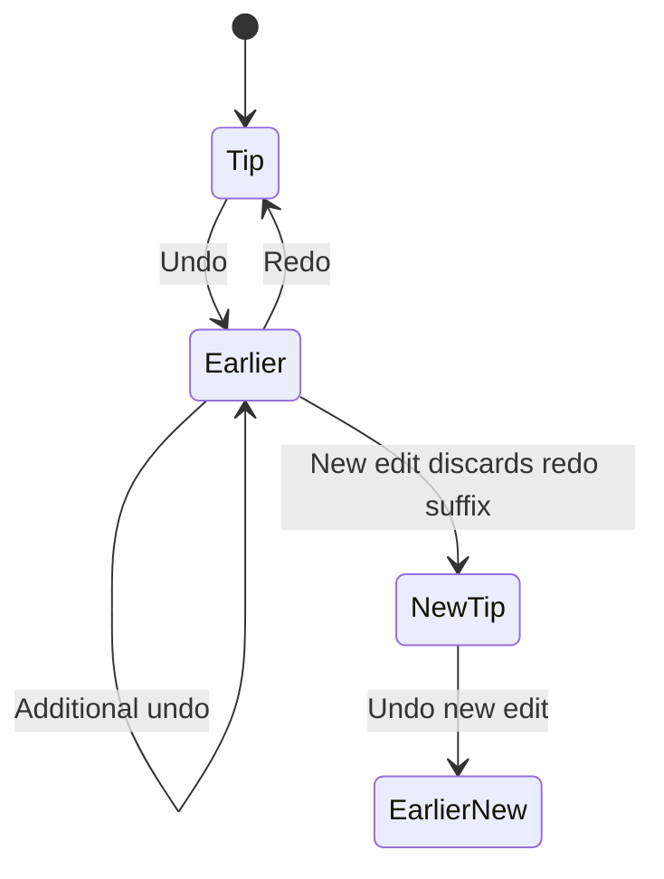
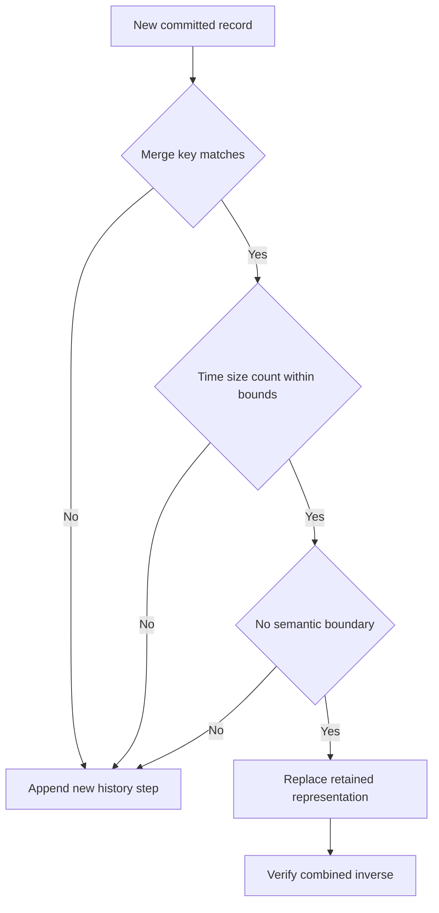
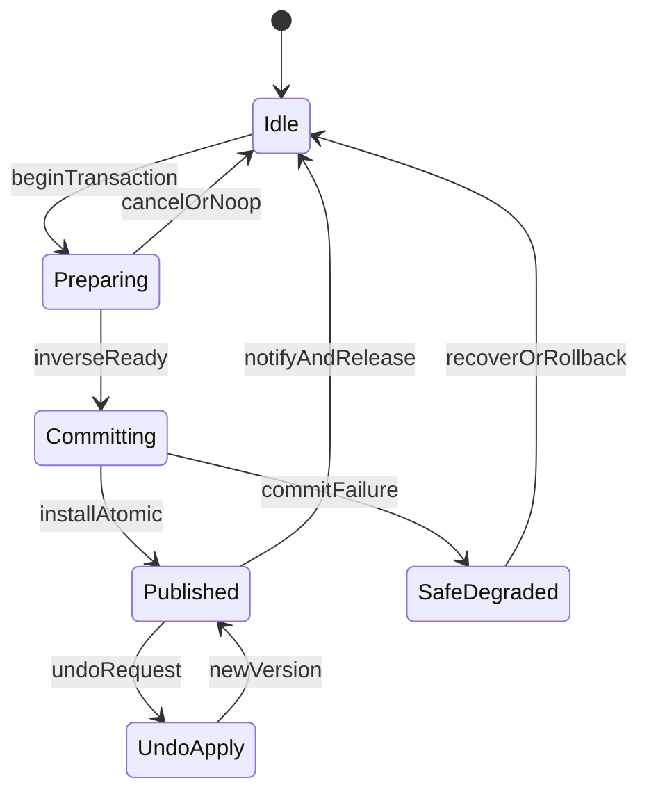

# 20 — History and Undo

## Overview

PhotoTux history is the ordered, budgeted record of committed document transactions. Undo and redo operate on semantic transaction records, not raw UI events, widget values, renderer frames, or whole-process snapshots. Every history-visible mutation originated in the [Command System](08-Command-System.md), committed atomically to the [Document Model](10-Document-Model.md), and published a new immutable version. Undo and redo are commands that apply inverse or forward meaning and create new monotonic document versions; they never rewind a version counter.

History protects iterative editing while respecting finite memory, large raster resources, asynchronous operations, save checkpoints, and unavailable optional implementations. It combines reversible deltas, retained immutable resources, deterministic replay where safe, and periodic checkpoints. No single strategy is sufficient for every operation.

Normative keywords follow [Requirement Keywords](Appendix/Requirement-Keywords.md), and canonical terms follow the [Glossary](Appendix/Glossary.md). This document does not freeze runtime, database, file format, compression, crate boundaries, or extension ABI.

## Responsibilities

The history system **MUST**:

- register a committed transaction atomically with its authoritative document state;
- retain enough validated information to reverse every transaction advertised as undoable;
- create new versions for undo and redo;
- preserve stable object identities and resource semantics through traversal;
- support atomic transaction groups and bounded presentational coalescing;
- define deterministic behavior when a new edit occurs after undo;
- enforce separate memory/disk budgets without discarding current authority;
- coordinate checkpoints with save and recovery while distinguishing their purposes;
- reject or explicitly bound operations whose inverse cannot be retained;
- handle async preparation, cancellation, stale results, and post-commit notification loss;
- remain headlessly testable and independent of renderer/UI/host technology;
- expose structured labels, availability, failure, and diagnostics without private content.

History **SHOULD** keep recent meaningful operations readily undoable and compact older records through checkpoints. It **MAY** persist history in editable documents only when format, privacy, compatibility, and size policies explicitly support it.

## Architecture



The timeline is logically per document. Independent documents traverse independently. Cross-document atomic history is unsupported unless a future coordinator defines prepare, commit, crash recovery, and partial-failure semantics.

### Internal hierarchy

```text
History subsystem
├── timeline identity and cursor
├── transaction records
│   ├── semantic metadata
│   ├── forward representation
│   ├── inverse representation
│   ├── affected objects/regions
│   ├── retained resources
│   └── applicability/invariant data
├── transaction groups
├── coalescing index
├── checkpoint catalog
├── branch policy
├── memory and spill budgets
├── traversal executor
├── persistence/recovery bridge
├── compatibility adapters
└── diagnostics
```

## Transaction Record

```rust
struct HistoryRecord {
    transaction_id: TransactionId,
    sequence: HistorySequence,
    command_id: CommandId,
    source_version: DocumentVersion,
    committed_version: DocumentVersion,
    label: HistoryLabel,
    forward: HistoryOperation,
    inverse: HistoryOperation,
    affected_objects: BoundedSet<ObjectId>,
    affected_regions: BoundedList<DirtyRegion>,
    retained_resources: ResourceLeaseSet,
    merge: Option<MergeDescriptor>,
    persistence_effect: PersistenceEffect,
    compatibility: HistoryCompatibility,
    correlation: CorrelationId,
}
```

Conceptual only. Records contain semantic reversible representations, not executable callbacks or mutable object pointers. `HistoryOperation` may be object deltas, tile-manifest swaps, retained records, parameter changes, graph edits, or a deterministic replay descriptor with verified resources.



## Forward, Inverse, Delta, and Replay Strategy

History chooses representation per transaction:

1. **Symmetric property delta:** before/after bounded values, suitable for opacity, names, transforms, parameters, and visibility.
2. **Structural delta:** insertion/removal/reparent records with IDs, parent/order, attachments, and retained object payloads.
3. **Resource-manifest swap:** old/new immutable tile or chunk manifests, suitable for raster and pixel-mask edits.
4. **Algorithmic inverse:** only when mathematically exact or explicitly tolerance-bounded and independent of changed external state.
5. **Deterministic replay:** original semantic operation plus pinned inputs/algorithm version, used only when replay is guaranteed and cheaper than output retention.
6. **Checkpoint boundary:** materialized state used when traversing compacted ranges or when opaque operation history cannot remain independently reversible.

Inverse-by-negating-parameters is unsafe for lossy transforms, clipping, quantization, random operations, color conversion, and changed resources. Such operations retain prior authoritative state or checkpoint. Original command invocation alone is not sufficient unless descriptor guarantees deterministic replay and captures every semantic input.

Forward and inverse representations are validated before commit. An undoable transaction cannot commit first and “compute undo later.” Resource leases become history-owned atomically.

## Atomic Commit Contract



Readers observe old state/old timeline or new state/new timeline. If history reservation fails before installation, commit aborts. Publication delivery failure after installation does not erase commit; subscribers resynchronize from latest snapshot and timeline.

## Timeline, Cursor, and Branching Policy

The default timeline is linear for user-visible undo/redo. It has an applied prefix and redo suffix. Undo moves the semantic cursor by applying inverse as a new command/version; the historical source records remain ordered. Redo applies forward meaning when valid.

**The redo suffix is part of the projection, not a hidden stack.** `HistoryService::rows_newest_first` walks the redo entries before the applied ones and marks them `undone`, and the panel draws them dimmed above the cursor. A projection listing only the applied prefix deletes a row the instant it is undone: nothing then says what redo would bring back, and there is nothing left to click to get there — a timeline that only remembers where you have stayed. Clicking a row on either side is one command, `history.jump`: `undo_steps_to_entry` answers for the applied prefix and `redo_steps_to_entry` for the suffix, and the follow-up carries the direction so the host replays the right one. The suffix disappears only where the policy below says it does, at branch replacement.

Where an undo step retains a copy of a surface rather than a description of the change, retention **MUST** be bounded by bytes rather than by entry count. A count bounds nothing useful when entry size scales with document size: the same limit is a few megabytes on a small canvas and gigabytes on a large one, and the failure arrives as allocator pressure or eviction stalls rather than as a clear limit. Depth follows from the budget, so a large document simply keeps fewer steps.

The most recent step **MUST** survive trimming even when it alone exceeds the budget. The alternative is that painting becomes unundoable exactly on the documents where an accidental stroke is most expensive to lose.

**Every committed entry MUST reach the timeline projection.** A command that pushes history but reports no other invalidation still changed the timeline, and a projection keyed only on layer or selection invalidation will not be told. The observable failure is a history list that omits entries and silently corrects itself at the next unrelated edit, which is worse than a stale list because it reads as authoritative. Entry notification **MUST** be driven by the entry list changing, not inferred from a neighbouring sync flag.

When a new ordinary edit commits after undo, default policy discards the visible redo suffix from active traversal. Retained resources are released subject to snapshots/checkpoints. This is “linear branch replacement.” The discarded branch may remain briefly in a diagnostic tombstone but is not user-reachable history and cannot retain unbounded private data.



A future visible branching history may preserve alternatives, but it requires explicit UI, persistence, merge, privacy, budget, and save-point semantics. Hidden branching is rejected because users cannot predict which state redo reaches.

The monotonic document-version stream differs from logical timeline cursor. Undoing transaction committed at version 10 might create version 20. Redo might create 21. Async applicability always uses current version/revisions, never cursor position alone.

## Undo Execution

`history.undo` resolves the latest applied undoable group, checks lifecycle and authority, and constructs a new transaction candidate from inverse representation. It validates:

- retained resources are present and verified;
- target identities/generations are compatible;
- current state matches expected postconditions of the record or defined traversal chain;
- no active critical operation forbids traversal;
- inverse still satisfies graph, dimensions, references, and security invariants;
- memory required for new snapshot and redo retention is available.

Successful undo commits authoritative state, registers traversal state, advances version, and publishes deltas. Whether undo itself appears as another visible row is presentation policy; internally it is auditable state evolution. Repeated Undo targets the preceding logical operation, not the undo command record recursively.

If inverse cannot apply, undo fails atomically. The system does not partially restore some layers. An optional repair command may establish a checkpoint boundary but must disclose lost traversal.

### Host-side steps

Two things the timeline can undo are not in the document graph, so the engine
cannot hold their inverse: the pixel selection, whose coverage mask is a GPU
texture, and a transform or flatten commit, which overwrites layer buffers.
The engine records the *step* and hands the host a
`HostHistoryAction::{Undo,Redo}(HistoryKind)`; the host keeps the snapshots.

Those snapshots live in `HostUndoStack<T>` (`phototux_ui::host_undo`) — one for
selection, one for transform, with different bounds because a selection
snapshot is one coverage mask and a transform snapshot is every layer's pixels.
The type is what enforces the three rules that were previously restated at each
call site: the bound, that recording an edit discards the redo branch, and that
stepping in either direction hands the current state to the opposite branch.

That last rule is why it is a type. It was written out four times inside
`apply_host_history` — capture, pop from one stack, push what was captured onto
the other, restore — and transposing the last two in any one of the four would
have left undo appearing to work while redo walked the wrong branch. Nothing
could have caught it: the four copies sat in a method that talks to
`phototux_canvas`, so no test reached them. The type has no GPU in it and its
tests are the first to run over these rules.

Stepping back past the oldest recorded selection is not an error; it steps back
to having made none, so the selection is cleared. `undo` therefore drops the
state it was handed when it has nothing to return, rather than stranding it on
the redo branch where it would offer a redo to a state the undo path never
produced.

Merge and flatten record their snapshot *before* invoking the command, so that
it captures the pixels the command is about to replace. When the command
refuses, `discard_last` withdraws it — otherwise a refused edit would leave a
no-op step on the undo stack.

## Redo Execution

Redo resolves the next record in active suffix and applies forward representation. It revalidates resources and invariants. Deterministic replay uses pinned algorithm/schema/resources, not current defaults. Redo cannot silently substitute missing fonts, profiles, brushes, or extension operations.

If a required optional implementation is unavailable, durable semantic deltas should still apply without executing it. If history stored extension-dependent replay only, redo reports unavailable and preserves state. Core policy should reject such fragile history representations before third-party support.

## Transaction Groups

An atomic group represents one semantic operation with multiple subchanges that either all commit or none: applying a mask modifies pixels and removes attachment; reparent preserving appearance modifies parent/order/transform; paste creates resources and layers together.

A presentational group combines several already committed transactions under one visible undo step while preserving ordered inverse application. It is allowed only when rollback of the whole group remains atomic at traversal or the group stores a combined inverse candidate. UI grouping alone cannot expose half-undone state.

Nested groups have bounded depth. Group IDs and labels are stable. A failed child during atomic construction aborts all. Cancellation semantics are declared before execution.

## Coalescing

Continuous gestures and repeated parameter adjustments can produce many committed versions but one meaningful history entry. Coalescing changes retention/presentation, not commit ordering.

Records may coalesce only when:

- command family and merge key match;
- document and target IDs match;
- records are causally consecutive with no intervening nonmergeable transaction;
- parameter/schema and inverse representations are compatible;
- elapsed time, record count, changed bytes, and affected bounds stay within limits;
- no save/checkpoint/history observation boundary requires separation;
- accessibility label remains truthful;
- combined inverse restores state before first record and forward reaches state after last.

Brush segments can merge by retaining pre-first and post-last manifests plus necessary geometry. Opacity slider changes can merge before-first/after-last values. Coalescing never merges across different active edit surfaces merely because labels match.



## Async Operations

Long filters, transforms, imports into a document, and apply-mask operations prepare from immutable snapshot. They do not reserve a future history position while allowing intervening edits. Prepared candidate returns with source versions, revisions, reversible resources, and applicability. Final commit either succeeds at current authority or becomes stale.

Progress/cancellation belong to operation ID. Cancellation before commit creates no history entry. Once commit boundary begins, cancellation cannot remove the transaction. A user may undo after committed completion. If work has externally visible persistence effects, history reverses document state only; it does not delete exported files or undo filesystem replacement.

For incremental visible operations, each segment must be a valid committed transaction. A later segment failure leaves earlier observed segments committed and normally coalesced as one history step. The operation result clearly reports partial gesture completion; silent rollback of observed commits is forbidden.

## Memory Budgets and Retention

History has configurable soft/hard budgets by document and process. Accounting includes record metadata, unique retained authoritative chunks, shared chunk proportional/physical bytes, checkpoints, spill files, compression workspace, and pending candidates. It separates CPU resident, mapped, local-disk spill, and GPU-derived bytes.

Eviction/compaction order:

1. release derived thumbnails and traversal caches;
2. compress eligible retained resources;
3. spill immutable verified chunks to protected local storage;
4. materialize checkpoint at a selected version;
5. discard oldest traversal range before checkpoint according to policy;
6. reject new high-cost undoable command if minimum guarantee cannot be met.

Current state is never evicted as “history.” Snapshot leases and save operations protect required chunks. User sees effective undo boundary and budget policy. A command that would exceed hard budget may offer explicit destructive/no-history execution only if product policy permits and consequence is clear; default is rejection or checkpoint.

Checkpoint creation is asynchronous preparation followed by catalog registration. It must not stall document mutations. If newer edits occur, checkpoint remains valid for captured version.

## Save Points and Checkpoints

A save point identifies semantic state durably written as editable document. A history checkpoint materializes state for traversal. A recovery checkpoint protects interruption. They may share immutable chunks but have different authority and retention.

```text
Save point: user destination durability and modified-state comparison
History checkpoint: traversal acceleration and compaction anchor
Recovery checkpoint: local interruption recovery
Render snapshot: immutable reader view, usually short-lived
```

Saving does not clear history by default. Save completion at version N marks persisted state even if current is newer. Undo across save point can make document modified or semantically equal depending persistence fingerprint policy. “Revert to Saved” is a command that applies saved snapshot/state as a new transaction or explicit document replacement; it is not version counter rewind.

History persisted inside document is optional. If omitted, reopening begins with current state and empty runtime timeline. Recovery may restore recent history according to privacy/budget policy but never claims it was user-saved.

## Workflows

### Undo paint gesture

Paint gesture commits five segments versions 101–105 and coalesces one history step retaining manifest before 101 and after 105. Undo validates active tip, swaps to retained prior tile manifest, advances version 106, preserves layer ID, and publishes dirty tiles. Redo swaps forward manifest at version 107.

### New edit after undo

Undo two steps, leaving redo suffix B/C. Commit new layer rename D. Timeline releases B/C active redo resources and appends D at new tip. Redo becomes unavailable. Document versions remain monotonic throughout.

### Undo structural delete

Delete group retains group subtree records, resources, parent, order, masks, and references. Undo restores same IDs atomically. If a conflicting object illegally reused an ID, invariant failure blocks traversal; normal allocator policy prevents this.

### Large filter under pressure

Filter candidate requires old/new raster manifests exceeding soft budget. History manager compresses/spills old chunks and may create checkpoint. If hard budget still fails, commit rejects before installation. User content remains unchanged.

### Save during history traversal

At logical earlier state/version 220, save captures snapshot. Redo creates 221 while write runs. Save completion records persisted state 220; current remains modified at 221. Timeline is unaffected.

## IDs, Versioning, and Invariants

Transaction IDs are unique per document/session identity and persisted where history persistence requires. History sequence provides deterministic order and is not a document version. Group/checkpoint IDs are stable. Correlation IDs connect action, command, transaction, render, and save diagnostics.

Invariants:

- every visible undoable step maps to complete reversible committed records;
- commit and history registration are atomically observable;
- undo/redo advance document versions;
- current authority never depends on an evictable history-only record;
- redo suffix policy is deterministic;
- coalescing preserves exact before-first and after-last semantics;
- traversal never partially applies a group;
- retained resource identity and integrity validate before use;
- save/history/recovery checkpoints remain distinct;
- cancellation before commit adds no history;
- post-commit notification loss does not erase history;
- external side effects are not falsely represented as undoable document effects;
- unknown executable payloads are never stored in history.

## Memory and Concurrency

Per-document timeline mutation occurs under document transaction authority or tightly coupled authority. Snapshot readers may inspect immutable history summaries concurrently. Compression, spill, checkpoint materialization, and label formatting run outside document locks against leased records.

Compaction decisions synchronize resource lease counts so no chunk is deleted while current state, snapshot, save, recovery, clipboard delayed-render payload, or another history record needs it. Bounded queues and reserved durability capacity prevent history compression from starving saves.

History UI virtualization consumes summaries, never full raster deltas. Timeline projection carries generation so stale rows cannot invoke wrong sequence after compaction. UI thread does not decompress history.

## Failure, Cancellation, and Recovery

Inverse validation/allocation failure aborts undo with unchanged state/cursor. Spill write failure falls back to memory until hard policy requires compaction/rejection. Corrupt spill data marks affected boundary unavailable and captures diagnostics; it does not fabricate inverse.

Checkpoint failure leaves existing records. Compaction commits catalog and retention changes atomically after checkpoint verification. Process interruption during compaction recovers old or new valid catalog, never half-deleted resources.

Recovery replays only fully committed journal transactions with integrity and schema validation. Replay stops at first invalid boundary and reports recovered version. Optional history restoration validates every retained resource. Missing extension implementation cannot execute opaque callbacks; durable declarative deltas or checkpoint determine recoverability.

## Persistence, Security, Privacy, and Accessibility

Persisted history uses versioned bounded schemas, integrity checks, and explicit algorithm/resource compatibility. It excludes ambient capabilities, executable pointers, secrets, and uncontrolled command inputs. Spill/recovery files use user-private permissions, unpredictable names, safe replacement, and cleanup policy. Paths, layer names, text, thumbnails, pixels, and clipboard content are redacted from diagnostics.

Host adapters provide local storage capabilities; core history does not invent paths. Normal operation requires no remote service or user identity. Importing a document with embedded history treats records as untrusted: counts, graph references, chunks, compression, schema, and inverse consistency validate before exposure.

Accessibility exposes Undo/Redo names, target summary, availability, disabled reason, group boundaries, current position, busy state, and failure. Labels use domain language: “Undo Paint Mask,” not transaction IDs. History panel supports keyboard navigation and does not create thousands of tab stops. Compaction or lost boundary is announced without exposing private object names unless already visible.

## Design Rationale and Tradeoffs
**Hybrid deltas/checkpoints versus one mechanism.** Deltas are efficient for local edits; checkpoints bound traversal and extension compatibility. Whole snapshots per step are too expensive, replay-only is fragile.

**Linear default versus branching.** Linear history matches predictable Undo/Redo and bounded retention. Branching preserves alternatives but needs a substantially different user model.

**Monotonic versions versus cursor rewind.** Monotonic versions make caches and async stale detection safe. Cursor rewind appears simple but aliases distinct causal states.

**Pre-commit inverse construction versus lazy inverse.** Pre-commit costs resources but guarantees advertised undo. Lazy construction can fail after user state changed.

**Budget visibility versus unbounded best effort.** Explicit boundaries avoid sudden process failure and hidden swapping. Some old history is lost under policy, but current document remains protected.

## Rejected Alternatives

- UI event log: lacks semantic targets, atomicity, and durable resources.
- Full document clone per step: unacceptable memory for large raster work.
- Re-execute original commands using current defaults: nondeterministic and unsafe.
- Undo by decrementing document version: breaks immutable consumers and stale detection.
- Silent partial undo of multi-object operation: violates transaction meaning.
- Hidden infinite branch graph: unpredictable and unbounded.
- GPU buffers as retained inverse: device loss would destroy undo.
- Automatic deletion of exported files on undo: document history lacks filesystem authority and user expectation.
- Extension callbacks embedded in records: insecure and incompatible.

## Best Practices

- Construct and validate inverse before commit.
- Prefer immutable manifest swaps for large raster changes.
- Keep history labels semantic and bounded.
- Coalesce by causal merge key, never by label text.
- Preserve IDs through undo restoration.
- Distinguish logical cursor, history sequence, and document version.
- Account unique and shared bytes accurately.
- Test hard-budget rejection before state installation.
- Verify checkpoint before deleting covered records.
- Keep save point independent from cursor.
- Inject cancellation at every async phase.
- Fuzz persisted history and resource manifests.

## Future Extensibility

Future visible branch history, selective undo, local macros, or persistent timelines require separate semantic conflict, UI, compatibility, privacy, and budget specifications. Selective undo is especially not ordinary inverse application: later dependent transactions may require transformation or rejection.

Alternate storage engines, compression, and executors may evolve behind record/checkpoint contracts. Additional hosts consume same summaries. No evolution may bypass command authority or freeze unstable Rust/ABI layouts.

## History Availability and User Policy

Undo availability is a structured query evaluated against the current logical cursor, document lifecycle, retained-resource health, active transaction state, and command authority. A disabled Undo control is advisory. Invocation **MUST** revalidate because compaction, recovery, target closure, or resource failure can occur after presentation. The result names the next logical operation, whether it is grouped, and the reason traversal is unavailable.

Policy settings declare memory budget, optional protected spill budget, minimum recent-step objective, coalescing limits, checkpoint cadence, and whether persisted history is enabled. Defaults are application preferences, not document semantics, unless an editable format intentionally embeds a retention policy. Changing policy does not rewrite current document content or clear modified state. An explicit Clear History command establishes a new traversal boundary, preserves current authority, releases eligible resources, and provides irreversible consequence text.

History labels are immutable semantic summaries stored with records or derived from stable command metadata. Localization may change displayed text without changing merge identity. Labels do not contain full layer names, paths, text contents, or parameter dumps by default. A target count and generic kind provide useful context while limiting privacy exposure.

### Traversal under changed operational capability

History must distinguish semantic prerequisites from acceleration. Loss of wgpu device, a render pipeline, thumbnail cache, or Linux desktop service cannot disable an otherwise valid undo. Loss of an authoritative retained chunk, required schema adapter, or opaque operation implementation can. CPU or reconstructible fallback is used where semantics remain available.

Read-only document state may permit inspection of history but reject traversal. A save in progress normally does not block undo because it reads a stable snapshot; a bounded format-specific critical section may defer traversal only if authority requires it. Export never controls history. Recovery writes observe committed versions and cannot manufacture an undo step.

### Timeline import and document reopening

When editable history is present in a document, loader validates checkpoint first, then each record’s IDs, sequence, version relationships, resource references, forward/inverse consistency, group boundaries, and byte limits. It exposes no partially trusted timeline. Policy may open current state while quarantining invalid optional history, but must report the lost traversal boundary and never apply unvalidated inverse data.

When history is not persisted, reopening starts with an empty timeline anchored at loaded state. The loaded state may be considered a baseline checkpoint. Undo cannot cross into a previous process merely because object versions were preserved. Recovery-restored history is marked recovery provenance and remains distinct from user-saved history.

### Deterministic traversal trace

For conformance debugging, a redacted traversal trace contains logical cursor before/after, selected record/group IDs, current and resulting document versions, representation class, resource validation result, invariant-check result, commit outcome, and publication sequence. The trace is bounded and local. Replaying a trace is permitted only in a headless fixture with explicit document resources; diagnostics alone are not executable command input.

## Testability and Diagnostics

Model-based tests generate command/undo/redo/new-edit sequences and compare current semantic state with a reference timeline. Property tests assert inverse-forward round trips where exact, stable IDs, no partial group state, and monotonic versions. Controlled schedulers explore save, checkpoint, compaction, and async commit races.

Diagnostics record transaction/group/checkpoint IDs, command IDs, versions, sequence/cursor, representation kind, retained bytes, merge decisions, traversal latency, stale/failure codes, spill integrity, and compaction phases. Private content is omitted.

Fault injection covers inverse allocation, lease reservation, state install, record publication, spill write/flush/rename, checkpoint verification, redo resource load, and event overflow.

## Deterministic Acceptance Scenarios

### Monotonic traversal

Commit A at 1 and B at 2. Undo B, undo A, redo A. Assert versions 3, 4, 5; semantic states match expected; no version repeats.

### Coalesced stroke

Commit ten compatible stroke segments. Assert ten document versions and one visible history step. Undo restores pre-first manifest atomically; redo restores post-last; intermediate versions remain diagnostic history but not separate user steps.

### Branch replacement

Commit A/B/C, undo C and B, then commit D. Assert redo unavailable, D follows A logically, B/C resources release when unleased, and state equals reference A+D.

### Hard budget

Configure budget below required inverse for a large filter and disable checkpoint relief. Assert command rejects before commit, document/history/snapshot unchanged, and error identifies history budget.

### Save checkpoint distinction

Save version 10, create history checkpoint 12, recovery checkpoint 13, current 14. Assert all identities remain separate and clearing old history cannot change saved/current/recovery state.

### Notification loss

Drop history-panel event after commit. Assert transaction and snapshot are readable, panel resynchronizes from timeline generation, and undo works.

### Corrupt spill

Corrupt inverse spill for an old step. Assert current state safe, traversal stops at explicit boundary, no fabricated restore, and diagnostics redact content.

### Async cancellation

Cancel filter before commit and another during bounded commit. Assert first creates no record/version; second reports committed transaction and is undoable.


## Acceptance Criteria

- Every undoable commit has complete reversible representation before installation.
- Undo/redo always create monotonic versions.
- Coalescing preserves semantic endpoints and atomic traversal.
- Linear branch replacement is deterministic.
- Memory pressure compacts history without risking current authority.
- Save, history, recovery, and render snapshots remain distinct.
- Async cancellation follows commit boundary.
- Headless model tests reproduce all timeline states.
- History persistence, when enabled, validates hostile data and preserves privacy.


## Implementation Conformance Contract

A conforming history implementation **MUST** publish behavior versions for inverse representation classes, coalescing eligibility, branch-replacement policy, checkpoint schema, spill integrity, and compaction phases. Changing visible undo semantics, retained inverse fidelity, or checkpoint recoverability beyond declared policy advances the relevant behavior version and supplies migration or preserved-unavailable handling for persisted history when persistence is enabled.

Transaction records **MUST** be total over the committed command set advertised as undoable. Each record binds transaction identity, monotonic sequence, command identity, source and result document versions, forward and inverse representation handles, affected object or region summaries, resource leases, and applicability invariants. Incomplete inverse reservation fails closed before document installation. Undo and redo **MUST** create new monotonic document versions; they never rewrite or reuse version numbers.

Coalescing tests **MUST** prove that presentational merge preserves semantic endpoints: undoing a coalesced stroke group restores the pre-first manifest atomically, redo restores the post-last manifest, and intermediate versions remain available to diagnostics without becoming separate user steps unless policy expands them. Branch replacement after undo followed by a new edit **MUST** drop redo availability deterministically and release unleased redo resources under budget policy without touching current authority.

Budget and spill fixtures **MUST** cover hard rejection before commit, checkpoint relief when enabled, corrupt spill detection, and compaction that never discards the inverse required for the current cursor. Save checkpoints, history checkpoints, recovery checkpoints, and render snapshots remain distinct identities in every fixture. Fault injection covers inverse allocation, lease reservation, state install, record publication, spill write/flush/rename, checkpoint verification, redo resource load, notification overflow, and async cancellation on both sides of the commit boundary.

Diagnostics **SHOULD** expose cursor position, record and group identities, representation class, retained bytes, merge decisions, traversal latency, stale or failure codes, and compaction phase while omitting private pixel, text, path, and layer-name content.

## Operational Edge Cases and Boundary Contracts

History is the reversible memory of authoritative document mutations. Edge cases arise when coalescing, branching, async completion, persistence spills, and user policy interact with the atomic commit contract.

Empty and no-op candidates never become timeline steps. A command that validates, allocates previews, then discovers no semantic delta **MUST** abort without advancing versions, consuming coalescing identity, or notifying panels as if a commit occurred. Conversely, a mutation that changes only non-document channels (transient UI) **MUST NOT** create document history records.

Coalescing boundaries are semantic, not temporal alone. Stroke coalescing merges samples that share tool identity, target layer revision base, color/precision context, and unbroken gesture ID. Focus loss, layer switch, blend-mode change, selection-channel switch, and explicit user commit break coalescing even if timestamps are close. Undo of a coalesced stroke restores the pre-gesture endpoint atomically; partial sample undo is forbidden unless a future explicit “expand coalesced step” command is introduced and versioned.

Branch replacement after undo-then-edit is linear and deterministic. Discarded redo tails release inverse resources under retention policy; their identities never resurrect by accident when a later undo reaches the branch point. If retention still holds a discarded tail for crash forensics, it is unreachable from the user cursor and cannot be applied without an explicit recovery tool outside normal undo/redo.

Save points, checkpoints, and history cursors are distinct. Saving does not truncate the timeline unless user policy requests it. Loading a document restores document authority first; history availability follows persistence policy and may open as a fresh empty timeline when history was not saved. Mixed states—document at version V with history cursor claiming otherwise—are rejected at load.

Selection-only and mask-channel edits may live on documented side channels or unified timeline entries per project policy, but each undoable commit still requires a complete inverse before installation. Cross-channel transactions that mutate pixels and selection together undo as one atomic step.

## Failure Modes, Security, and Trust Boundaries

Inverse materialization can fail for resource exhaustion, I/O errors on spill, or inability to snapshot a large raster. Failure before installation means no timeline append and no document version bump. Failure during bounded commit after the document mutation became visible is a critical path: implementations **MUST** either complete the inverse installation under recovery, roll back the document mutation, or enter a safe degraded mode that blocks further edits until recovery, never a silently irreversible head.

Corrupt spill files, truncated inverse blobs, and hostile history persistence are validated like other untrusted input. Checksums, lengths, and schema versions gate application. Corruption stops traversal at an explicit boundary with user-visible explanation; the engine **MUST NOT** fabricate pixels or layer trees to “skip past” damage.

History diagnostics and crash reports **MUST NOT** include document pixels, text contents, file paths to user assets, or layer names by default. They record transaction kinds, sizes, versions, coalescing IDs, and error codes. Accessibility announcements for undo/redo describe action summaries without dumping full payloads.

Extension-originated transactions are still core-validated. An extension crash after requesting a mutation but before core commit creates no history. After commit, undo is a core operation; the extension need not be alive for inverse application if the inverse is fully owned by core.

## Concurrency, Cancellation, and Consistency

Async filters, imports, and long renders may prepare results off-thread. History records appear only at the commit boundary defined by the command system. Cancellation before that boundary leaves no step. Cancellation requests after commit are ignored for history purposes; users undo instead.

Concurrent undo requests, redo requests, and new edits are serialized through the command spine. A stale undo click targeting an obsolete cursor generation fails closed. Panel notifications may drop; resynchronization reads timeline generation and cursor from authority rather than trusting event streams.

Memory pressure compaction may drop deep redo tails or compress old inverses into checkpoints. Compaction **MUST NOT** risk the current authoritative document or the inverse needed for the next undo under declared retention guarantees. If compaction cannot preserve the next-undo inverse, it **MUST NOT** proceed silently.



## Migration, Compatibility, and Persistence Evolution

When history persistence is enabled, on-disk records version their schema independently from document bytes. Migrations rewrite step envelopes, inverse encodings, and coalescing metadata. If an inverse codec becomes unavailable, the loader marks a truncation boundary rather than skipping with open redo across the gap.

Behavior-version changes in filters, text, or shapes do not rewrite old inverses in place during idle time. Applying an old inverse onto a document whose object behavior versions advanced requires compatibility rules: either the inverse carries enough raw before-state to restore bytes, or traversal stops with preserved-unavailable history beyond that point.

Document reopen without saved history starts a new timeline generation. Document reopen with saved history validates that head document hash matches the history head claim before enabling undo.

## Extended Acceptance Scenarios

**Noop suppression:** Run a brightness command with zero delta. Assert no version bump, no panel step, and coalescing identity unused.

**Coalesce break on layer switch:** Paint on layer A, switch to B mid-gesture policy break, paint again. Assert two undo steps restoring each endpoint.

**Redo tail discard:** Undo twice, edit, attempt redo. Assert discarded tail unreachable and memory released per policy.

**Spill checksum fail:** Corrupt deep inverse checksum. Assert current document safe, undo stops with boundary message, no fabricated restore.

**Async cancel pre-commit:** Cancel long filter before commit. Assert no history record and base version unchanged.

**Compaction pin:** Force memory pressure while next-undo inverse is large. Assert compaction either preserves that inverse or refuses drop with explicit status.

**Extension death after commit:** Commit extension-mediated blur; kill extension process; undo. Assert core inverse restores pixels without extension code.

## Multi-Document and Workspace Coupling

Each document owns an independent timeline generation. Workspace-level actions that do not mutate document authority create no document history. Closing a document releases or persists its timeline per policy without affecting other open documents’ cursors. Pasting across documents creates history only on the target; the source clipboard freeze is not a history step. Autosave checkpoints must not be confused with undo steps in UI copy: restoring an autosave is a load/recovery operation, while undo walks the live timeline of the current session authority.

## Cross References

- [00 — Introduction and System Charter](00-Introduction.md) — transaction and reliability invariants.
- [01 — Information Architecture](01-Information-Architecture.md) — history presentation and action semantics.
- [08 — Command System](08-Command-System.md) — transaction candidates, commit, merge, cancellation.
- [10 — Document Model](10-Document-Model.md) — authoritative versions, snapshots, dirty/save points.
- [11 — Layer System](11-Layer-System.md) — structural and raster inverse records.
- [12 — Selection System](12-Selection-System.md) — channel history.
- [13 — Mask System](13-Mask-System.md) — mask apply/attachment history.
- [21 — Clipboard](21-Clipboard.md) — paste transactions and delayed payload leases.
- [Glossary](Appendix/Glossary.md) — canonical terminology.
- [Requirement Keywords](Appendix/Requirement-Keywords.md) — normative force.
- [Cross-Reference Index](Appendix/Cross-Reference-Index.md) — foundation dependency map.
- Downstream: `24-Persistence-and-Recovery.md`.
- Downstream: `29-Reliability-and-Failure-Handling.md`.
