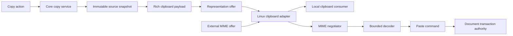
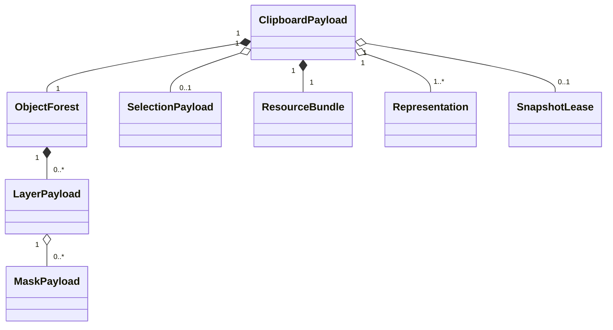
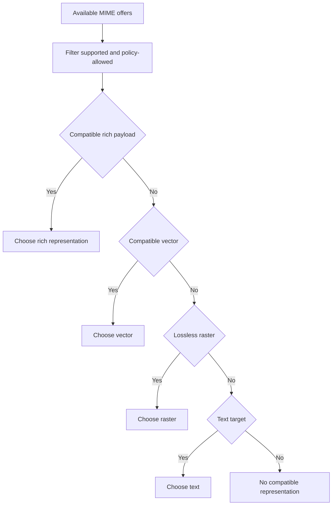
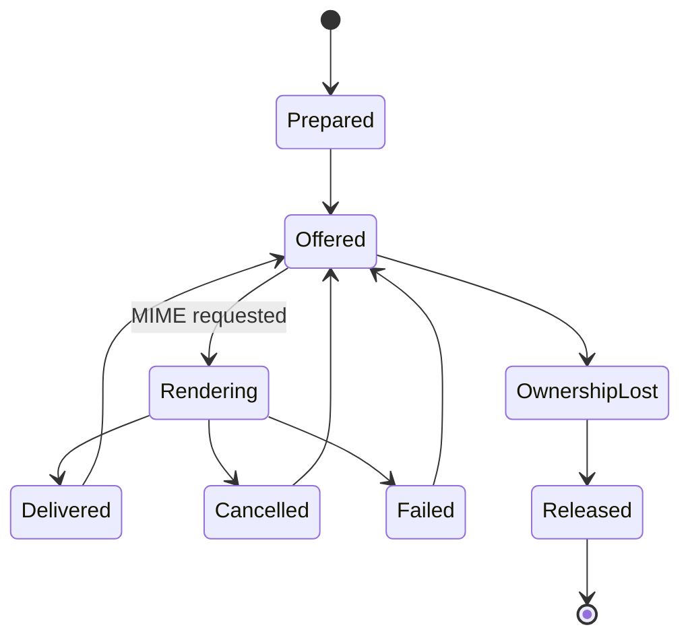
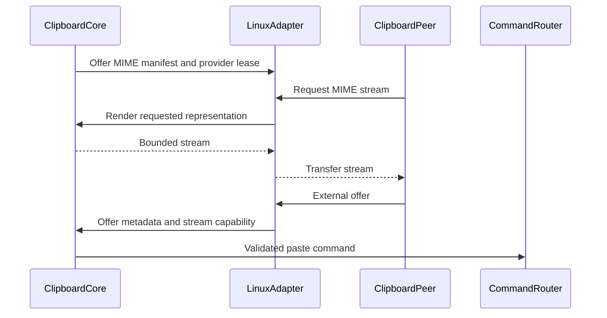
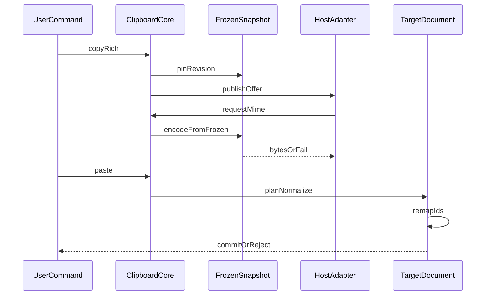

# 21 — Clipboard

## Overview

The PhotoTux clipboard system transfers image-editing content within one document, across local documents, and through platform clipboards without reducing rich editable structures to pixels unless negotiation requires it. Internal copy creates an immutable, bounded rich payload describing selected layers, masks, selections, resources, coordinate context, color interpretation, and safe provenance. Linux host adapters advertise and retrieve MIME representations. Paste validates every representation as hostile input and commits document changes only through the [Command System](08-Command-System.md).

Clipboard ownership is transient platform state, not document authority. Copy normally does not mutate a document or enter history. Paste is a mutating command and produces one atomic transaction. Delayed rendering may keep snapshot/resource leases so expensive MIME bytes are produced only when requested; those leases are budgeted, cancellable, private, and never writable.

This specification follows [Requirement Keywords](Appendix/Requirement-Keywords.md), the [Glossary](Appendix/Glossary.md), [Document Model](10-Document-Model.md) identity/version rules, and rich object semantics in [11 — Layer System](11-Layer-System.md), [12 — Selection System](12-Selection-System.md), and [13 — Mask System](13-Mask-System.md). It does not choose a UI toolkit, Linux clipboard library, final internal MIME name, file format, or binary ABI.

## Responsibilities

The clipboard system **MUST**:

- preserve maximum safe editability for internal transfers;
- offer interoperable standard MIME representations through host negotiation;
- treat all received payloads, including self-originated bytes, as untrusted at decode boundaries;
- copy from one coherent immutable document snapshot;
- paste only through validated atomic commands;
- map IDs, resources, color profiles, coordinates, transforms, and references deterministically;
- define cross-document precision and color-conversion policy before commit;
- support delayed representation rendering under explicit snapshot/memory/time budgets;
- avoid leaking private content through diagnostics, accessibility, clipboard history assumptions, or unnecessary formats;
- survive clipboard-owner loss, host denial, malformed offers, cancellation, and process shutdown;
- keep portable semantic payload construction separate from Linux-specific MIME transport;
- provide headless codec/negotiation/paste tests.

The system **SHOULD** advertise a compact rich representation plus common raster and text/vector representations when meaningful. It **MAY** support drag-and-drop through the same payload contracts, with distinct operation/lifetime policy.

## Architecture



Core defines semantic payload and codecs. Host adapter owns platform selection/clipboard ownership, MIME advertisement, stream transfer, cancellation, and desktop errors. It does not mutate documents directly.

### Internal hierarchy

```text
Clipboard subsystem
├── copy target resolver
├── immutable payload builder
├── rich payload schema
│   ├── object forest
│   ├── mask/effect attachments
│   ├── selection coverage
│   ├── resource bundle
│   ├── color/precision metadata
│   ├── coordinate anchor
│   └── safe provenance
├── representation registry
├── MIME negotiator
├── delayed renderer and lease manager
├── bounded stream encoders/decoders
├── paste planner
├── ID/resource remapper
├── Linux host adapter
├── privacy/security policy
└── diagnostics
```

## Clipboard Payload Model

```rust
struct ClipboardPayload {
    payload_id: ClipboardPayloadId,
    schema_version: ClipboardSchemaVersion,
    source: SourceContext,
    anchor: ClipboardAnchor,
    objects: BoundedObjectForest,
    selection: Option<CoveragePayload>,
    resources: BoundedResourceBundle,
    metadata: ClipboardMetadata,
    representations: RepresentationManifest,
}
```

Conceptual only. No Rust memory layout is a persistence or transport promise. Payload is immutable after offer publication. It is either fully materialized or references immutable snapshot/resource leases through process-local handles that never cross trust boundary.



The object forest preserves relative hierarchy and stacking order without claiming source parent ownership in destination. External links are classified: embed required resource, remap within payload, preserve safe local reference descriptor, or mark unresolved. Arbitrary source-document pointers are forbidden.

## Copy Scope and Semantics

Copy resolves one explicit scope:

- selected layer/object forest;
- active layer pixels within pixel selection;
- active mask or saved channel;
- vector path/shape/text content;
- flattened visible result within bounds;
- metadata/text value where a focused editor owns standard text copy.

Focus and active edit target determine default action through information architecture, but copy command/query records resolved scope exactly. Copying layer rows differs from copying selected pixels. The UI communicates result and offered formats.

Copy reads snapshot N. All object records, tiles, masks, resources, profiles, and selection coverage derive from N. If content changes while payload builds, payload remains N or operation restarts explicitly. It cannot mix versions.

Copy is usually non-mutating and absent from document history. A “cut” operation is copy preparation plus delete command. Delete occurs only after host confirms ownership/offer establishment sufficient under policy. If clipboard ownership later disappears, cut deletion is not automatically undone; it remains an ordinary undoable command. A failed offer must not delete.

## Rich Internal Representation

Rich payload is vendor-neutral in semantics even if MIME identifier is application-specific. It includes:

- schema version and declared feature set;
- source document coordinate convention, canvas context, precision, working profile descriptor, and alpha convention;
- stable payload-local IDs and source IDs only for provenance/remapping;
- ordered object forest with kinds, common properties, transforms, and bounded payloads;
- mask/effect attachment relationships;
- raster manifests or encoded chunks with checksums;
- text/vector/fill/procedural source records;
- selection coverage and copy bounds when relevant;
- embedded resources and safe pinned references;
- anchor/origin and recommended paste offset;
- conversion requirements and unsupported-feature flags;
- content sizes and integrity manifest.

Source document ID, paths, usernames, and private metadata are omitted unless semantically required and user-approved. Object IDs are never inserted directly into destination. Paste allocates new destination IDs and builds a complete mapping. Internal references resolve through payload-local IDs.

Unknown optional fields are skipped/preserved according to schema. Unknown required semantics reject rich representation and may fall back to another offered MIME.

## MIME Representation and Negotiation

The representation registry maps semantic payload capabilities to MIME offers. Candidate families include:

- application-specific rich structured payload;
- lossless raster image with alpha and profile metadata where format supports it;
- common raster image fallback;
- standard vector representation for compatible shapes;
- plain and rich text for text-editing scope;
- URI/file-list only for deliberate file-copy operations, never inferred from reference layers;
- selection/channel-specific internal representation.

Exact MIME identifiers are selected later through interoperability validation. Negotiation ranks representations by preservation, safety, decoder availability, size, destination capability, and user intent.



MIME labels are claims, not proof. Decoder sniffs/validates content as appropriate. Rich MIME from another process is never trusted as internal memory. If top-ranked decode fails, fallback may try the next safe offer only when failure indicates malformed/unsupported representation and policy avoids repeated expensive hostile inputs. Diagnostics report chosen/fallback class without content.

Linux adapters handle Wayland/X11 compatibility through available desktop mechanisms, but core receives abstract offers and streams. Clipboard manager persistence is optional external behavior; PhotoTux cannot assume ownership survives process exit.

## Delayed Rendering

Large payloads should not eagerly encode every format. Delayed rendering advertises representations backed by an immutable `ClipboardOfferLease`. On request, encoder reads snapshot/payload and streams bytes.



Lease policy bounds:

- snapshot age and retained authoritative bytes;
- number of simultaneously rendered formats;
- encoder memory and output bytes;
- render duration and cancellation checkpoints;
- process shutdown grace;
- history/resource chunks pinned only for payload lifetime.

Under memory pressure, service may materialize one compact rich representation to protected temporary local storage, drop expensive snapshot leases, or withdraw lower-priority offers. It must not silently advertise a format it can no longer provide. Temporary files use private permissions and secure cleanup.

Delayed rendering never holds document locks, GPU-only authority, UI thread, or mutable resources. Renderer may accelerate flattening from snapshot, but CPU/recoverable path is required for reliability.

## Paste Planning

Paste is two-phase: decode/plan outside mutation authority, then validate/commit. `PastePlan` contains destination document ID/version, insertion parent/anchor, new object/resource requirements, ID map, color/precision decisions, coordinate mapping, conversion/loss summary, affected bounds, memory/history budget, and applicability predicates.

```rust
struct PastePlan {
    destination: DocumentId,
    source_payload: ClipboardPayloadId,
    expected: VersionVector,
    insertion: InsertionDescriptor,
    id_map: BoundedIdMap,
    resource_plan: ResourceImportPlan,
    color_plan: ColorTransferPlan,
    coordinate_plan: CoordinateTransferPlan,
    objects: BoundedPreparedObjects,
    effects: EffectSummary,
}
```

Commit revalidates destination parent, locks, active target, version policy, budgets, and graph acyclicity. It creates all objects/resources and selection updates in one transaction or none. Partial paste is forbidden unless a separately named command presents per-item outcomes before commit.

## Identity and Object Relationships

Source object IDs are provenance only. Destination allocates unique IDs and remaps:

1. allocate destination IDs for every payload object/resource requiring identity;
2. map containment edges within payload;
3. map attachments and internal references;
4. deduplicate immutable resources only after verified semantic/content equality;
5. resolve external references through declared embed/link/unavailable policy;
6. validate cycles and target capabilities;
7. discard source IDs from active destination authority except optional sanitized provenance.

Pasting into same document still creates new IDs for duplication. “Move” within document is a layer reorder command, not clipboard paste. Resource deduplication does not merge independently editable object identity.

## Cross-Document Coordinates

Payload anchor defines source document point, copied bounds, and object-local transforms. Destination mapping policy may:

- preserve document-space pixel coordinates;
- place relative to destination viewport center;
- offset repeated pastes deterministically;
- preserve physical size using resolution;
- preserve pixel size;
- paste in place when source/destination coordinate conventions are compatible.

Policy is explicit in command parameters and user feedback. Viewport center is resolved at action time by presentation and supplied as document coordinate; portable core never reads a window.

Nested object transforms are preserved relative to payload forest root. A root placement transform maps source anchor into destination. Matrix arithmetic validates finiteness and invertibility where needed. Different canvas origins and resolutions do not silently change size.

Repeated paste offset belongs to workspace/session state keyed by payload and destination view; it does not modify payload. “Paste in Place” ignores offset and uses source coordinates.

## Cross-Document Color and Precision

Rich payload carries source working/profile interpretation and per-resource color/alpha metadata. Destination paste policy distinguishes:

- preserve numeric values and assign source interpretation within embedded object where supported;
- convert values to destination working space;
- retain embedded source profile for independent layer content;
- reject or ask when destination cannot represent source precision/profile;
- flatten through an explicit output color space for raster fallback.

Profile assignment and pixel conversion are never conflated. Color conversion occurs once at a declared stage using pinned source/destination profiles and intent/precision policy. Transparent pixels and premultiplication are handled explicitly.

High-bit-depth or wide-range source pasted into lower capability destination requires conversion summary: clipping, quantization, alpha loss, unsupported channels, and metadata loss. Default should preserve editability/precision when document model supports it. Silent clipping is forbidden.

For standard raster MIME lacking trustworthy profile, decoder applies documented assumed-profile policy and reports it. It does not guess from host display profile.

## Layer, Mask, and Selection Transfer

Rich layer copy preserves kind, hierarchy, opacity, blend, transform, masks, effects, and resources. Unsupported destination feature either remains opaque/unavailable, converts through explicit accepted plan, or rejects. It never silently flattens.

Copying a mask alone preserves source kind, common modifiers, binding relative to a payload anchor, and scalar precision. Pasting onto a target validates slot, maps coordinate space, and creates new mask ID. Pasting as a selection converts through [12 — Selection System](12-Selection-System.md) equations.

Copying selected pixels creates raster payload bounded by selection/nonzero content under explicit policy and includes selection coverage/offset so soft edges survive. Pasting typically creates a new raster layer rather than writing active layer unless action is “Paste Into Active Surface.” The latter validates edit surface, selection interaction, color conversion, and history.

## Workflows

### Copy and paste rich layers

1. Resolve selected layer forest by stable IDs.
2. Capture coherent snapshot N and payload anchor.
3. Build bounded object/resource manifest.
4. Publish rich and compatible fallback MIME offers.
5. Destination requests rich data, possibly delayed.
6. Decoder validates schema/limits/integrity.
7. Paste planner allocates new IDs and conversion plan.
8. User accepts any loss summary.
9. Commit inserts complete forest atomically and records history.
10. Renderer consumes immutable delta; selection/focus projections target new IDs.

### Copy selected pixels

Copy computes conservative bounds and retains source raster plus selection coverage from same snapshot. Raster encoding multiplies/combines alpha according to declared representation; rich payload can preserve separate coverage. Empty selection yields NoChange or empty payload by action policy, never accidental whole-layer copy.

### Cut layers

Service establishes offer successfully, then submits delete command for resolved IDs/version. Delete is one history transaction. If source changed before delete, cut fails stale and clipboard may still contain copied snapshot; UI reports that content was copied but not removed.

### Paste external raster

Adapter lists offers. Negotiator selects safest lossless raster. Stream decoder enforces dimensions/decompression/bytes and extracts profile under limits. Planner converts or embeds profile, chooses placement, creates raster resource/layer, and commits. Malformed payload never reaches visible document.

### Paste text

If focused text editor owns action, standard text inserts through text-edit command. If canvas/layer context owns action, text may create editable text layer if supported. Scope resolution is explicit and accessibility announces destination.

## Host Adapter Contract



Host errors map to ownership lost, permission denied, unsupported mechanism, transfer cancelled, peer disconnected, timeout, or external protocol failure. Core does not depend on toolkit objects. Adapter calls never occur while document locks are held.

## IDs, Versions, and Invariants

Clipboard payload ID identifies one immutable offer generation. Representation generation changes if offers are withdrawn/replaced. Operation IDs track encoding/decoding/paste. Payload-local IDs are unique and bounded. Destination IDs are newly allocated.

Invariants:

- one payload derives from one coherent source snapshot;
- delayed encoders cannot observe later document state;
- copy does not mutate document;
- paste commits zero or one transaction;
- source IDs never collide/reuse as destination authority;
- internal references remap only to declared payload/destination targets;
- color/precision/coordinates are decided explicitly;
- advertised representation has a valid provider or is withdrawn;
- MIME and self-origin claims never bypass validation;
- clipboard loss cannot corrupt document/history;
- temporary data and leases are bounded and released;
- diagnostics exclude content by default;
- normal operation never requires a remote service or user identity.

## Memory and Concurrency

Payload budget includes manifests, pinned unique resource bytes, encoded representations, temporary files, decode buffers, prepared paste resources, and history inverse. Shared snapshot chunks use lease accounting. Eager small text/metadata formats may materialize; large raster/rich data stream.

Encoders/decoders run in bounded worker queues. Only one or configured few expensive formats render concurrently. Backpressure pauses stream production rather than unbounded buffering. Cancellation propagates from host request/ownership to encoder subjobs.

Paste planning uses destination snapshot without holding mutation lock. Prepared resources are provisional. Commit revalidates. UI thread handles only lightweight offer/presentation events.

wgpu may flatten complex layers into raster fallback, but payload remains reproducible after device loss. GPU result must transfer into recoverable validated representation before offer relies on it.

## Failure, Cancellation, and Recovery

Copy target stale before snapshot returns typed no-change/retry. Offer failure does not mutate document. Cut deletion occurs only after required offer success. Ownership loss releases leases and cancels encoders. Peer disconnection is ordinary cancellation.

Decoder failure quarantines/discards bytes and may try safe fallback representation. Allocation/decompression limits stop early. Paste preparation failure leaves destination unchanged. Cancellation before commit releases provisional resources. Cancellation during bounded commit reports committed outcome; Undo reverses paste.

Process crash loses platform clipboard unless external manager retained encoded formats. Recovery does not restore clipboard by default because content is private transient state. Private temporary representations are cleaned on startup by ownership/age policy and never presented as recovered documents.

## Security and Hostile Inputs

Threats include false MIME labels, oversized dimensions, decompression bombs, recursive object graphs, duplicate IDs, malicious profiles/fonts/vector paths, integer overflow, path traversal, symlink tricks, URI injection, huge text, invalid encoding, extension payloads, and peers that stall streams.

Defenses:

- byte, time, count, nesting, dimension, and decompression-ratio limits before allocation;
- checked arithmetic for all strides/offsets/products;
- streaming parsers and bounded buffering;
- schema and integrity validation;
- codec isolation where architecture provides it;
- no file access from metadata or references without capability;
- no arbitrary code, shader, or extension callback from payload;
- timeout/cancellation for stalled peers;
- destination graph/invariant validation;
- sanitize text used in labels/diagnostics;
- private temporary storage and explicit cleanup.

URI offers are not opened automatically. A paste action may import local files only after host grants read capabilities and user intent is clear. Rich payload from same process still crosses serialization validation if bytes travel through platform.

## Privacy

Clipboard is observable by local desktop components and clipboard managers depending environment. PhotoTux advertises only representations needed for selected content. Copying layer structures should not automatically include full document metadata, source paths, hidden unrelated layers, history, thumbnails beyond payload, or credentials.

UI may warn for unusually large or sensitive metadata according to local policy. Diagnostic logs record MIME classes, sizes, timing, and errors, not data. Accessibility announces format and object count, not hidden text or pixels unless user navigates them.

“Clear Clipboard” requests host ownership replacement/release where supported and drops internal leases. It cannot guarantee external managers erase prior copies; UI must not claim otherwise.

## Accessibility

Copy, Cut, Paste, Paste in Place, Paste as New Layer, Paste Into Active Surface, and Paste as Mask are distinct actions with availability and disabled reasons. Completion announces object count/type and destination. Conversion/loss prompts are keyboard navigable and identify precision, profile, editability, or alpha consequences.

Progress for delayed large transfers is rate-limited. Cancellation remains reachable. Clipboard preview does not depend only on thumbnail/color. Focus returns predictably after errors. Sensitive clipboard text is not automatically spoken in full.

## Persistence

Clipboard payload is not part of editable document persistence. Temporary encoded offers are operational state. A paste commits ordinary document objects, after which save behavior follows destination format. Source provenance retained in pasted objects is minimal and sanitized.

Internal schema versions evolve independently from document schema. Compatible optional fields default safely. Incompatible required semantics trigger fallback or rejection. No long-term compatibility is promised merely because a MIME exists; version policy must be declared before external third-party commitment.

## Design Rationale and Tradeoffs
**Rich plus standard formats versus raster-only.** Rich preserves editability; standards interoperate. Multiple representations cost encoding and attack surface, managed through delayed rendering and policy.

**Immutable snapshot payload versus live object references.** Snapshots are coherent and safe across edits. Live references are cheaper but race, leak authority, and fail across processes.

**New destination IDs versus preserving IDs.** New IDs avoid collisions and false identity continuity. Payload-local remap preserves internal relationships.

**Explicit color plan versus automatic destination conversion.** Explicit plan prevents silent clipping and distinguishes assignment/conversion. It adds occasional user decisions.

**Streaming/delayed rendering versus eager bytes.** Delayed work saves memory/latency for unused formats but pins resources and depends on owner lifetime. Budgets/materialization balance this.

## Rejected Alternatives

- System clipboard bytes as authoritative internal state: rejected because ownership is transient/untrusted.
- Direct mutable object pointers for in-process paste: rejected because they bypass validation and snapshot coherence.
- Preserve source IDs in destination: rejected due collision and identity confusion.
- Always flatten copied layers: rejected due editability loss.
- Trust application-specific MIME: rejected because external peers can forge it.
- Auto-open URI/path metadata: rejected for least authority.
- Assume display profile for untagged raster: rejected because display and image interpretation differ.
- Keep unlimited snapshots until clipboard changes: rejected for memory safety.
- Restore clipboard from crash recovery by default: rejected for privacy.
- Network clipboard synchronization: outside product boundary.

## Best Practices

- Build all representations from one snapshot.
- Advertise few useful formats, ranked by semantics.
- Stream large payloads.
- Validate self-originated serialized bytes.
- Allocate destination IDs before resolving references.
- Separate profile assignment from conversion.
- Preserve physical or pixel size only by explicit policy.
- Keep copy and cut deletion separate failure boundaries.
- Include delayed-render leases in resource pressure accounting.
- Fuzz MIME decoders and rich graph remapping.
- Test owner loss at every transfer phase.
- Redact payload content from traces.
- Make Paste variants discoverable and exact.

## Future Extensibility

Future standard representations, richer vector/text interchange, or local extension object transfer require bounded schemas, capability checks, fallback, privacy, compatibility, and fuzz fixtures. Drag-and-drop may reuse payloads while adding source/destination action negotiation and pointer lifecycle.

Other platform hosts implement abstract offer/stream contracts. Clipboard transport technology can change without changing core paste semantics. No design here freezes toolkit, in-process ABI, or final MIME identifier.

## Testability and Diagnostics

Headless tests build payloads from deterministic snapshots, encode/decode each representation, plan paste into varied documents, and compare semantic graphs. Property tests generate object forests, ID collisions, resource sharing, coordinate origins, profiles, and malformed limits.

Diagnostics record payload/operation IDs, source version, MIME classes, logical/encoded bytes, lease bytes/age, chosen fallback, decode limits, plan conversions, destination version, cancellation phase, and error codes. Content is redacted.

Fault injection covers snapshot lease, encoder allocation, stream backpressure, owner loss, decoder limits, temporary storage, profile conversion, destination ID allocation, history budget, commit, and notification.

## Deterministic Acceptance Scenarios

### Coherent delayed copy

Copy layers at version 40, then edit source to 41 before peer requests raster MIME. Assert delayed output reflects 40 only, source edit remains independent, and lease releases after ownership loss.

### Cross-document ID remap

Paste payload whose source IDs collide with destination IDs. Assert all pasted objects receive new unique IDs, internal mask/resource references map correctly, existing destination objects remain unchanged, and undo removes complete pasted forest.

### Color conversion

Paste tagged high-precision raster into different-profile destination under preserve and convert policies. Assert preserve retains source interpretation; convert changes values once using declared policy; loss summary appears for reduced precision; no display profile is used.

### Hostile dimensions

Offer raster claiming dimensions whose byte product overflows or exceeds budget. Assert rejection before allocation, no destination transaction/version, bounded diagnostics, and UI remains responsive.

### Cut offer failure

Force Linux adapter to deny clipboard ownership. Invoke Cut. Assert source objects remain, no delete transaction/history entry occurs, and error identifies offer failure.

### Ownership loss during encoding

Request large representation, then revoke ownership midstream. Assert encoder observes cancellation, temporary output/leases release, source/destination documents unchanged, and no unbounded worker remains.

### Rich fallback

Provide malformed rich MIME plus valid lossless raster. Assert rich decoder fails under bounds, negotiator selects raster once, paste creates raster layer with explicit lost-editability status, and hostile rich content is not partially imported.

### Paste in place

Copy nested transformed layers from canvas origin A and paste into document origin B with Paste in Place. Assert source document-space placement maps according to declared coordinate convention, hierarchy-relative transforms remain, and viewport does not influence result.

### Mask transfer

Copy vector mask and paste onto compatible layer. Assert new mask ID, preserved vector source/modifiers, remapped coordinate anchor, valid attachment, and no mutable alias to source.

### Privacy trace

Copy text/layers with private names/paths and trigger errors. Assert diagnostic export without explicit sensitive inclusion contains IDs, sizes, MIME, and codes but no text, names, paths, pixels, or thumbnail.


## Acceptance Criteria

- Internal copy preserves rich editable semantics when destination supports them.
- Standard MIME negotiation interoperates without trusting labels.
- Every payload derives from one immutable source version.
- Paste allocates new IDs and commits atomically through one transaction.
- Color, profile, precision, alpha, and coordinates have explicit transfer plans.
- Delayed rendering is bounded, cancellable, and private.
- Hostile clipboard input cannot force unchecked allocation, file access, or execution.
- Clipboard ownership loss cannot alter documents.
- Linux adapters remain outside portable core.
- Accessibility exposes exact paste actions and conversion consequences.


## Implementation Conformance Contract

A conforming clipboard implementation **MUST** publish behavior versions for rich payload schema, MIME negotiation order, color and precision transfer plans, coordinate paste conventions, delayed-render lease policy, and hostile decode limits. Changing paste-visible semantics, identity remap rules, or loss reporting beyond tolerance advances the relevant behavior version and documents migration for internal payload readers.

Copy services **MUST** capture one immutable source snapshot version and derive every offered representation from that version alone. Paste commands **MUST** allocate new object identities, remap internal references, validate budgets before allocation, and commit through one transaction. Cut **MUST NOT** delete source objects until platform offer ownership succeeds under declared policy; offer failure leaves the document unchanged.

Negotiation fixtures **MUST** cover rich-preferred internal paste, standard raster/text/vector fallbacks, malformed rich with valid raster, overlapping MIME labels, empty offers, and oversized dimension claims. Color fixtures cover preserve versus convert policies, profile-tagged high-precision rasters, alpha association, and precision reduction with loss summaries. Coordinate fixtures cover Paste in Place, viewport-relative paste rejection or normalization per policy, and nested transform forests.

Delayed rendering tests **MUST** prove lease cancellation on ownership loss, revision pinning so source edits after copy do not alter offered bytes, time and memory budgets, and no writable handles into live documents. Host adapter tests keep Linux MIME transport outside portable payload construction. Diagnostics **SHOULD** record MIME types, sizes, negotiation choices, remap counts, conversion classes, and error codes while redacting pixels, text, layer names, and filesystem paths.

Clipboard conformance additionally requires headless round-trips for layer forests with masks, selection channels, and shared resources; ID collision tables; and privacy traces that prove sensitive payload bodies never appear in default diagnostic export. Drag-and-drop, when enabled, reuses the same codecs with distinct lifetime tests for gesture cancel before drop commit.

## Operational Edge Cases and Boundary Contracts

Clipboard transfers cross trust, identity, color, precision, and host-adapter boundaries. Edge cases focus on delayed rendering, ownership loss, partial offers, and paste into incompatible documents.

Empty selection copy is a defined outcome: either a rejected command with explanation or an empty payload that paste treats as no-op. Implementations **MUST NOT** silently copy an entire layer when the user asked for a pixel selection that happened to be empty. Cut with failed offer publication rolls back destructive deletion; cut never deletes first and hopes the host accepts data later.

Delayed rendering promises multiple MIME representations from one frozen source revision. The source document may continue editing; encoders **MUST** read the frozen snapshot, not live layers. If the snapshot is evicted under memory pressure before the host collects a format, the adapter fails that format request without substituting live data from a newer revision.

Paste planning handles missing layers, locked targets, incompatible color spaces, mismatched precision, absent fonts for text payloads, and selection shapes that do not fit. Each incompatibility is structured: convert with preview, paste as new layer, or reject. “Paste in place” uses stored document coordinates only when the target document shares the coordinate basis or an explicit transform policy applies; otherwise paste centers or uses viewport policy without inventing cross-document identity.

ID remapping is mandatory across documents. Layer IDs, mask IDs, filter-node IDs, and object refs in rich payloads receive new IDs; dangling references become structured drops with counts. Within the same document, paste may preserve or remap per command options, but never duplicates IDs.

## Failure Modes, Security, and Trust Boundaries

External clipboard bytes are hostile input. Dimension fields, compressed streams, embedded paths, and metadata blocks pass through the same bounded decoders as import. Pathological sizes fail before allocation. Rich internal formats from another PhotoTux instance are still untrusted until schema validation and capability checks succeed.

Host adapters **MUST NOT** interpret toolkit selection objects as trusted pointers into core memory. All transfers serialize through bounded byte envelopes or validated shared-memory regions with length and type headers. Legacy exotic MIME types unknown to the negotiator are ignored; they do not trigger decoder plugins without explicit format-adapter registration.

Privacy requires that clipboard traces omit pixel samples, text bodies, and absolute paths. Temporary encode files are created with restrictive permissions and wiped after offer completion or cancellation. Clipboard contents are not written into autosave documents unless the user pastes.

Security messaging avoids echoing attacker-controlled metadata strings into HTML-like UI without escaping. Failure to decode is a normal outcome, not a crash.

## Concurrency, Cancellation, and Consistency

Copy preparation, delayed encode, and paste normalize jobs are asynchronous with cancellation. Ownership-loss signals from the host cancel outstanding encodes and clear the local offer registry entry. A paste command pins target document revision; completing normalize against a superseded target fails applicability.

Concurrent copies replace the local offer generation. Stale delayed-render callbacks for the old generation return failure to the host. Paste transactions reserve history inverses before mutating layers; failed paste commits nothing.

Backpressure limits concurrent encode formats and maximum frozen snapshot bytes. Under pressure, the negotiator may advertise fewer formats, preferring rich internal plus one raster fallback, rather than risking session thrash.



## Migration, Compatibility, and Persistence Evolution

Clipboard schemas version independently. Newer clients may offer richer payloads; older clients ignore unknown chunks inside a versioned container when safe, or reject the rich format and fall back to raster/text. Persisting clipboard state across sessions is optional and off by default; when enabled, encrypted-at-rest or permission-restricted local stores still revalidate on read.

Document schema advances may make old rich clipboard payloads non-applicable. Paste then uses raster/text fallbacks or rejects with upgrade messaging. Behavior versions for color conversion and text shaping are pinned inside the frozen snapshot so delayed encode matches what the user copied.

## Extended Acceptance Scenarios

**Empty pixel selection:** Copy with empty mask. Assert no full-layer leakage and clear user feedback.

**Delayed stale generation:** Publish offer generation 1; copy again to generation 2; host requests MIME for generation 1. Assert failure, no live encode from current doc.

**Ownership loss mid-encode:** Kill host offer during PNG encode. Assert worker cancel, temp wipe, and document unchanged.

**Cross-doc ID remap:** Paste rich layers with filters into another document. Assert new IDs, no collisions, dangling refs counted.

**Color mismatch paste:** Paste wide-gamut pixels into narrow document. Assert planned conversion preview or explicit reject; no silent primary misuse.

**Cut offer fail:** Host rejects offer publication. Assert cut deletion not applied and selection preserved.

**Hostile dimensions:** External image advertises enormous dimensions. Assert reject before allocation and session health.

## Selection Channel and Mask Paste Details

Pixel pastes may carry an embedded selection outline distinct from layer bounds. Paste planning decides whether to replace the active selection, intersect, or ignore the outline based on command options declared in the UI. Vector mask transfers validate closed-path requirements before attach; open paths used as masks fail with structured errors rather than auto-closing unless the user runs an explicit close command first. Floating selections produced by paste are ordinary layers with transient UI designation until explicitly anchored; crash recovery promotes or discards them under document recovery rules without host clipboard involvement.

## Cross References

- [00 — Introduction and System Charter](00-Introduction.md) — local-first, least-authority, and host boundaries.
- [01 — Information Architecture](01-Information-Architecture.md) — focus, active target, copy/paste actions, and context.
- [08 — Command System](08-Command-System.md) — paste mutation, jobs, cancellation, and commit.
- [10 — Document Model](10-Document-Model.md) — snapshots, identity, resources, profiles, and versions.
- [11 — Layer System](11-Layer-System.md) — rich object forests and transforms.
- [12 — Selection System](12-Selection-System.md) — selected-pixel coverage transfer.
- [13 — Mask System](13-Mask-System.md) — mask source and attachment transfer.
- [20 — History and Undo](20-History-Undo.md) — paste/cut transactions and lease accounting.
- [Glossary](Appendix/Glossary.md) — canonical terminology.
- [Requirement Keywords](Appendix/Requirement-Keywords.md) — normative interpretation.
- [Cross-Reference Index](Appendix/Cross-Reference-Index.md) — foundation map.
- Downstream: `26-Linux-Host-Integration.md`.
- Downstream: `30-Security-and-Trust-Boundaries.md`.
