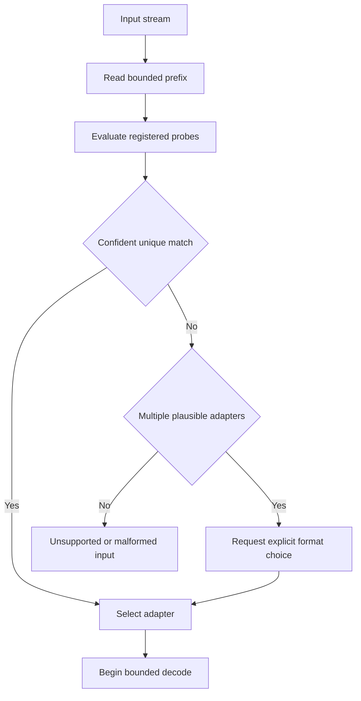
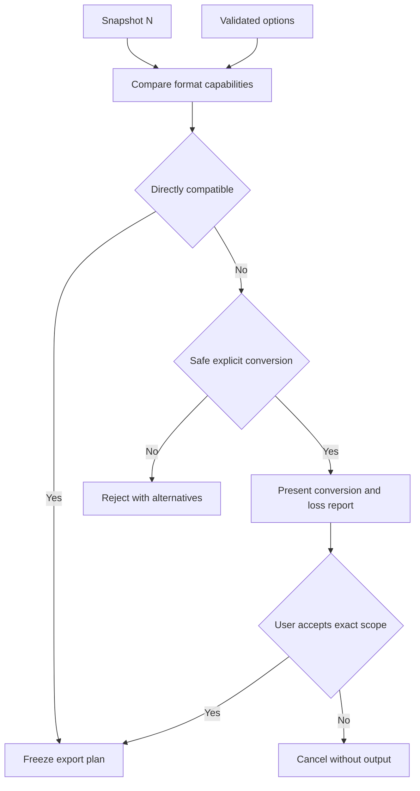

# 22 — Import and Export

## Overview

Import and export convert between untrusted external representations and PhotoTux document semantics. Import is a staged `probe → decode → normalize → validate → register` pipeline. Export is a staged `plan → snapshot → render/convert → encode → flush → replace` pipeline. Neither pipeline receives writable document references. Import constructs a quarantined intermediate representation and exposes a document only after one atomic registration boundary. Export reads one immutable snapshot and never changes document saved identity or modified state.

This specification is vendor-neutral. Third-party format interoperability is provided through bounded adapters; no proprietary workflow, remote service, account, cloud storage, AI, or generative feature is implied. Rust is the intended core language and wgpu may accelerate suitable rendering or conversion, but codec libraries, async runtime, process model, toolkit, final native format, and plugin ABI remain unvalidated. Normative keywords use [Requirement Keywords](Appendix/Requirement-Keywords.md); canonical terms use the [Glossary](Appendix/Glossary.md).

## Responsibilities

The import/export subsystem **MUST**:

- identify formats by bounded content probing rather than filename alone;
- decode all input as hostile data under byte, dimension, recursion, allocation, decompression, CPU-time, and object-count limits;
- normalize decoder output into explicit document, object, raster, color, alpha, coordinate, metadata, and resource contracts;
- keep provisional import data outside the visible document registry until complete validation;
- route any import into an existing document through the [Command System](08-Command-System.md) and one history transaction;
- capture one coherent immutable snapshot for every export;
- disclose feature, precision, color, alpha, metadata, and editability losses before export replacement;
- stream input and output where format semantics permit;
- expose operation ID, phase, progress, cancellation, preserved state, and retry policy;
- stage output and atomically replace the destination where the host/filesystem supports it;
- distinguish Save, Save As, Save a Copy, Export, and batch export;
- use explicit local file capabilities supplied by a host adapter;
- preserve application responsiveness and reserve capacity for save/recovery;
- produce deterministic output for identical semantic inputs and declared encoder behavior;
- keep codec failures, crashes, and malformed data from corrupting document authority.

It **SHOULD** support incremental raster decoding, deterministic tile order, bounded metadata preservation, resumable internal planning, and out-of-process codecs where risk or dependency quality warrants isolation. It **MAY** use wgpu for export rendering or color conversion after equivalence and device-loss behavior are validated. GPU output used by an encoder must become a recoverable validated stream; GPU resources are never export authority.

## Shipping formats

`phototux_io::RasterFormat` is the vocabulary: PNG, JPEG, WebP, TIFF, BMP and GIF, each with the extensions its own reader accepts. `Export` adds the layered Photoshop subset, which is not a `RasterFormat` because it is not flat.

**The file dialogs read that list rather than restating it.** The host publishes `exportNameFiltersJson` from `RasterFormat::ALL`, and `Main.qml` binds `nameFilters` to it. The hand-written list that used to live in the QML had drifted in the direction nobody notices — it offered four of the six formats the writer handles, so a BMP or a GIF could be opened, edited and never saved back, with no error anywhere. `every_format_offers_extensions_its_own_reader_accepts` holds each format's extensions against `from_path`, and `the_export_dialog_takes_its_formats_from_the_engine` fails if the QML grows its own list again.

## Architecture


Portable core owns format-neutral contracts, limits, normalization, document validation, snapshot capture, export planning, and outcome semantics. Codec adapters own format parsing and encoding. Linux host adapters own chooser/portal integration, opaque file handles, replacement capabilities, filesystem identity, and host errors. Presentation owns option collection and progress display. No adapter may mutate a document or clear modified state directly.

### Internal hierarchy

```text
Import/export subsystem
├── format registry
│   ├── built-in descriptors
│   ├── extension contribution descriptors
│   └── compatibility generations
├── input coordinator
│   ├── bounded probe reader
│   ├── adapter selector
│   ├── streaming source
│   ├── decoder isolation
│   ├── normalization pipeline
│   └── quarantine resource store
├── export coordinator
│   ├── capability and loss planner
│   ├── immutable snapshot lease
│   ├── render/color/metadata plan
│   ├── streaming encoder
│   └── staged-write coordinator
├── operation registry
│   ├── progress aggregation
│   ├── cancellation tree
│   └── resource budgets
├── metadata policy
├── security and trust policy
├── migration/compatibility adapters
└── diagnostics and conformance fixtures
```

## Core Contracts

```rust
struct FormatDescriptor {
    id: FormatId,
    schema_version: SchemaVersion,
    media_types: BoundedList<MediaType>,
    extensions: BoundedList<FileExtension>,
    probe: ProbeDescriptor,
    import_capabilities: ImportCapabilities,
    export_capabilities: ExportCapabilities,
    metadata_policy: MetadataCapabilities,
    isolation: IsolationRequirement,
    provenance: ContributionProvenance,
}

struct ImportRequest {
    operation_id: OperationId,
    source: LocalReadCapability,
    source_hint: Optional<FormatHint>,
    policy: ImportPolicy,
    limits: ImportLimits,
    cancellation: CancellationId,
}

struct ExportRequest {
    operation_id: OperationId,
    source: SnapshotLease,
    destination: LocalReplaceCapability,
    format: FormatId,
    options: BoundedValue,
    color: ExportColorPlan,
    metadata: MetadataExportPolicy,
    limits: ExportLimits,
    cancellation: CancellationId,
}
```

These are semantic examples, not frozen Rust layouts or public ABI. `LocalReadCapability` grants reads for one selected object or stream. `LocalReplaceCapability` grants creation/staging/replacement under host policy; it is not a reusable directory capability unless explicitly issued. Format IDs and option schemas are versioned independently from codec implementation.

An import adapter returns:

```rust
struct DecodedPackage {
    format: FormatIdentity,
    source_summary: SanitizedSourceSummary,
    canvas: DecodedCanvas,
    objects: BoundedDecodedGraph,
    resources: BoundedDecodedResources,
    metadata: BoundedMetadataSet,
    warnings: BoundedList<ImportWarning>,
    integrity: DecodeIntegrity,
}
```

`DecodedPackage` is quarantined and cannot enter rendering, history, accessibility trees, or document registries before normalization and validation. Decoders never return executable callbacks, toolkit objects, raw host handles, shader source, mutable document references, or trusted object IDs.

An export plan records exact source snapshot version, output extent, pixel/sample representation, color transform, alpha convention, layer flattening or retained structure, metadata decisions, encoder behavior version, deterministic ordering policy, estimated work, destination replacement semantics, and accepted loss report.

## Format Probe and Selection

Probe reads a small bounded prefix and, when descriptor declares it, a bounded set of non-overlapping ranges. Probe cannot seek arbitrarily, decompress payloads, parse complete metadata, or allocate from untrusted counts. A `ProbeResult` contains confidence, required additional bytes, candidate subtype, and contradiction reasons.

Selection order is:

1. collect adapters whose declared signatures fit available bytes;
2. reject adapters whose minimum size or structural markers contradict input;
3. rank exact structural signatures before weak textual or extension hints;
4. use filename extension and media type only as hints;
5. resolve ties through deterministic registry priority and user selection when ambiguity remains;
6. record chosen descriptor/version and probe evidence;
7. reopen or rewind the source through capability-supported semantics before decode.



An extension mismatch does not override a strong signature. A signature claim does not make bytes safe. A source that changes between probe and decode must be read through a stable capability snapshot or rejected as incoherent. Non-seekable streams use replay buffering bounded by probe limit.

## Decode Pipeline

Decode operates incrementally:

1. validate container header and declared feature version;
2. establish checked dimensions, channel count, sample type, frame/page count, and resource budgets;
3. parse structural tables with checked offsets and non-overlap policy;
4. stream raster blocks, rows, or tiles while enforcing output-byte and decompression-ratio limits;
5. parse profiles, fonts, paths, metadata, and embedded resources through their own hardened validators;
6. produce payload-local IDs and typed references;
7. verify required checksums or integrity records;
8. finalize one immutable decoded package;
9. release decoder and source resources after normalization acquires required ownership.

Streaming is not permission for partial visibility. A decoder may report previews or headers to progress UI, but no unvalidated pixels become document authority. Multi-page or multi-document formats reserve all required document registrations before exposing any unless descriptor explicitly defines independent-member import. An independent member still validates and registers atomically.

Decoder output must define coordinate origin, orientation, pixel aspect, physical resolution, channel semantics, transfer function/profile status, alpha representation, premultiplication, numeric range, and hidden-color behavior. Missing information remains “untagged/unknown under policy”; it is not guessed from display profile or file extension.

## Normalize and Validate

Normalization translates format-specific structures into PhotoTux semantics without retaining decoder-owned pointers. It:

- applies declared orientation and coordinate transforms;
- maps source object hierarchy to payload-local semantic objects;
- canonicalizes text encodings and validates finite numeric values;
- assigns new document/object/resource identities or deterministic import mappings;
- converts packed/interleaved layouts to supported authoritative resource contracts;
- records source precision and any normalization conversion;
- separates profile assignment from pixel conversion;
- normalizes alpha without discarding hidden colors unless policy says so;
- validates layer containment, masks, effects, references, and bounds;
- classifies unknown content as preserved opaque, converted with consent, or unsupported;
- applies metadata policy;
- calculates exact authoritative and history/recovery budget requirements.

Normalization must not silently flatten editable structure. If document model cannot represent a source feature, import offers a named conversion when safe, preserves an opaque bounded object when round-trip is possible, or rejects. Conversion choices and discarded fields become structured import warnings retained as source provenance where useful.

Final validation runs [Document Model](10-Document-Model.md) invariants: unique stable IDs, acyclic containment, typed references, finite dimensions/transforms, checked raster sizes, valid profiles, bounded metadata, supported resource dispositions, coherent snapshot root, and no ambient capabilities. Only then does lifecycle register the document and workspace create a view.

## Import Workflows

### Open as a new editable document

1. User selects a local source through file chooser/portal adapter.
2. Host issues one read capability and sanitized display identity.
3. `document.open` creates an import operation, not a visible empty document.
4. Probe chooses a format descriptor.
5. Decoder streams into quarantine under limits.
6. Normalizer produces a candidate document aggregate.
7. Invariant validator and budget manager approve candidate.
8. Lifecycle atomically registers document identity and initial snapshot.
9. Workspace attaches a canvas view.
10. Import provenance and warnings remain inspectable.

The opened imported document is modified unless source is the native editable format and open policy establishes a valid persisted identity. A third-party source is import provenance, not automatically an editable save destination. Save and Export remain distinct.

### Import into an existing document

Decoded package is converted into a `document.import-content` prepared command against snapshot N. Planner maps coordinates, profiles, precision, object IDs, resources, and insertion target. Commit revalidates target and creates one transaction with complete inverse. Cancellation or stale failure before commit leaves document and history unchanged. Large prepared resources remain provisional and budgeted.

### Batch import

Batch import is a collection of independent operations by default. One failure does not corrupt or roll back successfully registered documents. A compound format requiring all members declares atomic set semantics. Progress reports member and aggregate phase. Batch ordering follows explicit input order, not worker completion order.

## Export Planning

Export planning is pure over snapshot and descriptor capabilities. The planner compares:

- document dimensions and desired output region;
- layer/object/editability features;
- sample type, bit depth, channels, HDR range, alpha, and premultiplication;
- document and target profiles, rendering intent, and transfer behavior;
- text/vector/resource retention;
- metadata namespaces, orientation, resolution, and thumbnails;
- format limits such as maximum dimensions or frame count;
- encoder options and behavior versions.

It produces `Compatible`, `CompatibleWithTransformations`, or `Unsupported`. Transformations are individually named: flatten layers, rasterize text/shapes, reduce precision, remove alpha, convert profile, map HDR range, crop unsupported extent, omit unsupported metadata, or normalize orientation. User acceptance binds to the exact snapshot/options/loss set. If scope changes, acceptance is invalidated.



## Export Execution and Streaming

Final execution:

1. acquire immutable snapshot and required resource leases;
2. validate destination capability and staged-replace policy;
3. create sibling/host-provided temporary output without replacing destination;
4. build output render graph using [Rendering Engine](17-Rendering-Engine.md);
5. stream deterministic rows, tiles, frames, or object chunks into encoder;
6. apply one pinned [Color Management](16-Color-Management.md) plan;
7. encode selected metadata after sanitization;
8. finalize format indexes, checksums, and footer;
9. flush bytes and required metadata under durability policy;
10. atomically replace destination where supported;
11. release snapshot and temporary resources;
12. publish outcome with snapshot version, bytes, losses, and destination status.

Streaming uses bounded buffers and backpressure. Encoder cannot request full image materialization unless descriptor declares an accepted hard requirement and planner proves budget. Tile traversal order is deterministic where format permits. Global encoders may use bounded temporary storage for indexes or transforms, but temporary bytes count against operation budget.

Viewport display transforms, proofing, overlays, selection ants, guides, tool previews, and monitor profile are excluded unless a distinct export option names a semantic inclusion. Export does not capture compositor pixels.

## Metadata Policy

Metadata is partitioned into core technical image metadata, descriptive user metadata, color/profile data, orientation/resolution, source provenance, application-private editability metadata, thumbnails/previews, and opaque third-party namespaces. Every format adapter declares supported namespaces and maximum encoded size.

Default policy:

- required color interpretation and output dimensions are included when representable;
- orientation is normalized or encoded exactly according to plan;
- descriptive metadata is included only according to user export preference;
- source paths, recovery records, history, operation IDs, internal object IDs, workspace state, and private diagnostics are excluded;
- unknown metadata is preserved only when safe, bounded, semantically applicable, and format allows lossless carriage;
- metadata capable of external references cannot grant file access;
- embedded thumbnails derive from export snapshot and are size-bounded;
- malformed text is rejected or sanitized with disclosed loss;
- location or personally identifying fields are controlled by explicit metadata policy, not silently added.

Metadata stripping does not alter document metadata. Editing metadata in the document is a command and history transaction; choosing export omission is operation state.

## Progress and Cancellation

Progress has phases rather than one misleading percentage:

```rust
enum TransferPhase {
    Probing,
    Decoding,
    Normalizing,
    Validating,
    Registering,
    Planning,
    Rendering,
    Encoding,
    Flushing,
    Replacing,
    CleaningUp,
}
```

Each phase reports completed/estimated units when known, current member/frame/tile without private names, byte counts, and cancellability. Progress is monotonic within a phase, rate-limited, and accessible. Unknown totals use indeterminate state with concrete phase.

Cancellation is cooperative and idempotent. During probe/decode/normalize/render/encode, workers stop at bounded checkpoints and release provisional resources. Before import registration or existing-document commit, no authority changes. Before export replacement, temporary output is deleted or quarantined. Once atomic replacement succeeds, cancellation returns successful completion because externally visible durability occurred. Flush/replace critical sections are bounded and shown as “finishing” when noninterruptible.

## State and Invariants

- Every import source is read through an explicit local capability.
- Every decoder output remains untrusted until normalization and full validation.
- No partially decoded package enters a visible document.
- New-document import publishes one coherent initial snapshot or none.
- Existing-document import commits zero or one transaction.
- Every export reads exactly one immutable snapshot version.
- Export never clears modified state or establishes editable identity.
- Save a Copy never clears modified state.
- Format hints never override contradictory validated content.
- All dimensions, offsets, strides, counts, and products use checked arithmetic.
- Metadata cannot grant capabilities, execute code, or select arbitrary paths.
- Destination is not reported successful before declared durability stage.
- Cancellation before commit/replace leaves no authoritative or destination partial state.
- Codec, GPU, and host failures cannot mutate source document authority.
- All queues, temporary bytes, retained snapshots, and output sizes are budgeted.

## Threading, Scheduling, and Backpressure

Host/UI thread performs chooser interaction, lightweight state updates, and progress presentation only. Probe and decode run on bounded codec workers or isolated processes. Normalize/validate run on CPU workers over immutable/quarantined records. Document registration/commit runs on document authority. Render coordinator owns wgpu work. I/O coordinator owns staged writes and durability.

No document lock spans codec calls, filesystem I/O, user prompts, GPU completion, extension transport, or metadata parsing. Worker results carry operation ID, source capability generation, descriptor generation, snapshot/document version, and applicability.

Resource priority protects interactive commands and critical save/recovery before speculative thumbnails or background exports. Backpressure pauses source reads or output generation, reduces bounded preview work, evicts caches, streams smaller chunks, or rejects operation before authority/destination change. It never silently drops input records or output tiles.

## Security and Trust Boundaries

Threats include decompression bombs, oversized dimensions, integer overflow, recursive graphs, overlapping offsets, malformed profiles/fonts/paths, parser vulnerabilities, hostile metadata, path traversal, symlink races, special files, stalled streams, codec crashes, extension impersonation, and output replacement attacks.

Required defenses:

- pre-allocation checked limits for compressed and expanded bytes;
- maximum canvas/frame/page/channel/object/resource/depth counts;
- watchdog and cancellation for codec CPU time;
- bounded reads and parser recursion;
- validated offsets, lengths, checksums, and non-overlap;
- no paths reconstructed from metadata;
- capability-scoped file access and host-mediated replacement;
- no source-provided shader, command, callback, or executable payload;
- process isolation for high-risk/untrusted codec contributions where feasible;
- crash containment that releases leases and preserves document state;
- private temporary files with unpredictable names and safe permissions;
- initialized buffers before cross-document reuse;
- redacted diagnostics.

Sandboxing is defense in depth, not replacement for validation. An in-process built-in codec remains subject to identical limits. An out-of-process codec receives only source stream, option schema, budget, cancellation, and output transport required for its job.

## Failure and Recovery

Probe failure returns unsupported/ambiguous status without decoder side effects. Decode failure destroys quarantine package. Normalization failure identifies unsupported semantic feature and any safe alternate import. Validation failure never registers. Registration notification loss after atomic registration causes registry/workspace resynchronization, not duplicate registration.

Export encoder failure leaves prior destination intact when staged replacement is available. Disk full, permission loss, peer disconnect, or filesystem removal produces typed external error. A temporary file may be quarantined for diagnostics only under privacy/retention policy. Replacement success followed by notification failure remains success. Export retry creates a new operation and snapshot unless user explicitly retries the same retained plan.

Codec process crash affects only its operation. Coordinator terminates transport, reclaims shared buffers, invalidates provisional results, and may offer a different adapter only when format selection and security policy permit. Automatic retry of malformed input is bounded; repeated crash does not loop.

Process recovery does not resume arbitrary external export because destination state may be ambiguous. Startup may clean stale private temporary files after identity/age validation. A native save has separate recovery policy. Imported packages that never registered are discarded.

## Persistence, Versioning, and Migration

Format descriptors, probe rules, option schemas, normalization behavior, and encoder behavior are independently versioned. A document records source format/provenance only as bounded informational data. Export diagnostics record behavior version so outputs can be reproduced in fixtures.

Changing pixel rounding, orientation interpretation, alpha handling, metadata normalization, profile conversion, compression semantics, object mapping, or deterministic order requires behavior-version advancement and compatibility tests. Saved export presets store semantic options by stable IDs; unknown options survive only when safe and do not become active without validation.

No in-memory Rust type or native codec ABI is a persistence promise. Extension format adapters negotiate protocol/schema versions through [23 — Plugin SDK](23-Plugin-SDK.md). Native document schema belongs to [27 — File Formats](27-File-Formats.md).

## Design Rationale and Alternatives
**Probe then decode versus extension dispatch.** Content probing handles renamed files and prevents obvious misdispatch. It costs a bounded prefix read. Extension remains useful as hint.

**Quarantine normalization versus decoder-built documents.** Quarantine adds copying and schemas but prevents parser code from acquiring authority and centralizes invariants.

**Streaming versus full materialization.** Streaming bounds memory and supports huge images. Some global codecs require indexes; bounded temporary storage addresses that without making full residency universal.

**Stable snapshot export versus live document reads.** Snapshot guarantees coherent output while editing continues. Live reads would mix versions or require long locks.

**Staged replacement versus direct destination writing.** Staging protects existing files and makes cancellation predictable. Filesystems/portals lacking atomic replace require explicit reduced guarantee and must never claim atomicity.

**Generic format adapters versus format logic in document model.** Adapters isolate interoperability and hostile parsing. Core remains independent of third-party structures.

**Out-of-process preference versus mandatory isolation.** Isolation contains crashes and narrows authority but adds transfer cost and platform complexity. Policy can require it by risk class after validation.

## Best Practices

- Probe little; validate deeply.
- Parse into bounded values before allocation.
- Keep decoder and normalizer separately fuzzable.
- Build document IDs only after source graph validity is known.
- Stream raster data and output with backpressure.
- Pin profile/resource revisions for full operation.
- Make every conversion and omission visible in a structured report.
- Keep metadata policy independent from codec defaults.
- Never use monitor color context for import/export interpretation.
- Preserve destination until replacement succeeds.
- Treat cancellation as normal control flow.
- Differential-test tiled and full-reference output.
- Isolate codec dependencies from document authority.
- Record behavior versions, not library implementation internals alone.

## Future Extensibility

Future adapters may add generically described third-party raster, vector, layered, scientific, or interchange formats; multi-frame output; local batch hosts; and sandboxed extension codecs. Each addition **MUST** define probe strength, schemas, streaming behavior, limits, metadata, color/alpha, unknown-feature policy, deterministic behavior, cancellation, isolation, migration, diagnostics, and conformance fixtures.

No extension point promises stable native ABI. No adapter may require network access for normal operation. Remote destinations, proprietary services, account-bound codecs, AI processing, and generative output remain outside scope.

## Testability and Diagnostics

Headless tests use in-memory read/write capabilities, deterministic clocks, bounded streams, fake codec isolation, controlled schedulers, and semantic snapshot fixtures. Fuzz targets cover probe, container parser, metadata, profile, object graph, decompression, normalization, and option schemas.

Diagnostics record operation ID, descriptor/behavior version, probe outcome, phase timings, bytes read/written, decoded dimensions/counts, limit reached, snapshot version, conversion classes, queue wait, cancellation phase, staged-write outcome, and sanitized error code. Paths, metadata values, image content, thumbnails, layer names, and profile names are excluded by default.

### Deterministic acceptance scenarios

**Hostile dimensions:** Input declares width and row stride whose product overflows. Assert rejection before allocation, no visible document, bounded diagnostic, and source capability release.

**Probe mismatch:** File extension suggests one format while exact signature identifies another. Assert signature-selected adapter, warning about hint mismatch, and successful bounded decode.

**Streaming cancellation:** Decode a large compressed raster, cancel after several output tiles, and assert no document registration, all temporary chunks/decoder processes released, and cancellation observed within configured checkpoint bound.

**Import into edited document:** Prepare content at destination version 8, commit another edit to 9, then finalize. Assert explicit stale/revalidate policy, no overwrite, and any successful import is one history transaction at a later monotonic version.

**Export while editing:** Export snapshot 20 while edits create 21–24. Assert output contains only version 20, current remains modified, and export completion does not change persisted version.

**Disk full:** Existing destination contains valid bytes. Inject disk-full during staged encoding. Assert old destination unchanged, temporary output cleaned/quarantined, document unchanged, and retry policy actionable.

**Cancel after replacement:** Deliver cancellation immediately after atomic replacement. Assert operation reports successful replacement, no false rollback claim, and output checksum matches plan.

**Codec crash:** Crash isolated decoder after allocating shared buffers. Assert process termination, buffer/lease reclamation, no registration, unrelated documents operational, and bounded crash diagnostic.

**Metadata policy:** Export document containing private paths, descriptive fields, color profile, and internal history. Select technical-only policy. Assert output includes required dimensions/profile, excludes paths/descriptive/history, and document metadata remains unchanged.

**CPU/wgpu equivalence:** Export identical snapshot through validated CPU and wgpu rendering paths. Assert encoded semantic pixels meet declared tolerance and encoder ordering/checksum are deterministic where byte identity is promised.


## Acceptance Criteria

- Import follows probe, decode, normalize, validate, and atomic registration.
- Export follows plan, immutable snapshot, render/convert, encode, flush, and staged replacement.
- Hostile input cannot trigger unchecked allocation, ambient file access, execution, or document mutation.
- Streaming keeps memory bounded for inputs and outputs larger than configured memory.
- Cancellation before authority/replacement leaves no partial user state.
- Export from version N remains coherent while N+1 edits continue.
- Loss reports identify every unsupported semantic feature before replacement.
- Metadata policy is explicit, private by default, and independent from document mutation.
- Linux chooser/portal/filesystem behavior remains behind host capabilities.
- Codec or wgpu failure preserves document truth and prior destination.
- Third-party interoperability remains generic and adapter-isolated.
- No workflow requires cloud, account, AI, proprietary service, or stable native plugin ABI.


## Implementation Conformance Contract

A conforming import/export implementation **MUST** publish behavior versions for probe strength, container parse, color and alpha normalization, object-graph mapping, loss-report taxonomy, staged-write protocol, and streaming tile order where byte identity is promised. Changing visible import structure, export pixels beyond tolerance, or metadata policy advances the relevant behavior version and supplies fixtures proving migration or explicit re-export.

Import **MUST** follow probe, decode, normalize, validate, and atomic registration. Export **MUST** follow plan, immutable snapshot, render or convert, encode, flush, and staged replacement. Hostile dimension, compression, and metadata fixtures fail before unchecked allocation. Cancellation before authority registration or destination replacement leaves no partial user-visible state.

Streaming tests **MUST** keep memory bounded for inputs and outputs larger than configured memory, observe cancellation at declared checkpoints, and differential-test tiled versus full-reference output under CPU and validated wgpu paths. Disk-full, codec-crash, and atomic-replace races are mandatory fault injections. Metadata policy tests prove technical-only, privacy-preserving, and full-descriptive modes without mutating document metadata as a side effect of export. Probe mismatch tests prefer signatures over file-name hints and warn on disagreement.

Diagnostics **SHOULD** record operation identities, descriptor versions, phases, bytes, dimensions, limit hits, and sanitized errors while excluding paths, thumbnails, layer names, and pixel content by default. Conformance also requires multi-frame policy tests, indexed-color normalization evidence, and proof that Export never clears modified state while Save follows its own checkpoint contract.

## Operational Edge Cases and Boundary Contracts

Import and export are streaming trust boundaries between filesystem bytes and editable document authority. Edge cases include ambiguous probes, truncated streams, metadata conflicts, batch cancellation, and export of incomplete editability.

Probe conflicts occur when magic bytes, extensions, and container brands disagree. Selection policy uses ordered evidence with user-visible format choice when confidence is below threshold. Implementations **MUST NOT** guess a lossy decoder if a safer identifiable editable path exists without user confirmation.

Truncated or growing files are bounded. Readers enforce maximum header sizes, chunk counts, and decompressed ratios. A file that claims more pixels than policy allows fails before raster buffers allocate. Progressive imports may show previews marked non-authoritative until normalize validates the full required subset for the chosen open mode.

Import into an existing document specifies target layer placement, color conversion, resolution policy, and whether metadata merges or drops. Name collisions receive deterministic suffixes. Linked versus embedded resource policy is explicit; links never silently become embeds.

Export planning pins document revision, color proof policy, layer visibility snapshot, and precision. Exporting while edits continue either waits for a pinned snapshot or rejects; it **MUST NOT** stream a tearing mix of old and new layers. Hidden layers, guide layers, and non-export channels follow explicit include flags.

Batch import/export jobs are ordered with deterministic failure isolation: one file failure does not corrupt others; summaries report per-item outcomes. Partial batch cancel stops pending items and leaves completed outputs intact.

## Failure Modes, Security, and Trust Boundaries

Codecs are hostile-input surfaces. Image bombs, zip bombs inside containers, insane ICC profiles, cyclic chunk references, and overlong EXIF/XMP blocks fail closed. Format adapters run with budgets and **MUST NOT** receive ambient filesystem access beyond the user-selected paths and declared side-car policy.

Extension-provided format adapters are capability-scoped. They receive byte ranges or streaming handles, not core document mutators. Normalized results enter the document only through core validation and commands. A crashing adapter fails the item; it cannot tear the layer tree.

Metadata policy strips or preserves personally identifiable fields under user settings. Export **SHOULD** warn before writing GPS, voice annotations, or editor serials when privacy mode requests minimization. Import never executes embedded scripts or opens network URIs found in metadata.

Diagnostics capture format IDs, versions, byte lengths, stage names, and error codes—not pixel dumps or full metadata blobs.

## Concurrency, Cancellation, and Consistency

Decode, normalize, encode, and checksum stages are cancellable. Cancellation before authoritative open leaves no document. Cancellation during export deletes incomplete temp outputs atomically and retains the previous file when replacing in place via staged rename.

Workers for independent batch items run with bounded parallelism. Shared decoder caches are keyed by content checksum and codec version; eviction cannot change already-committed imports. Progress events coalesce so UI remains responsive without becoming a side channel for content bytes.

Device loss during GPU-accelerated color convert falls back to CPU transforms for the pinned job or fails the job without corrupting the target path.


## Migration, Compatibility, and Persistence Evolution

Native editable containers migrate through document schema rules; import/export adapters declare their own capability versions. An older app encountering a newer native file refuses lossy open when required chunks are unknown, offering preserve-as-opaque where policy allows.

Export presets are preference-scoped data, not document authority. Migrating presets drops unknown keys and keeps safe defaults. Changing color-management behavior versions changes export pins; reopen of old presets records the pinned versions used at last export.

Side-car files (XMP companions, display-profile hints) have explicit discovery rules and never override user-selected primary bytes without confirmation.

## Extended Acceptance Scenarios

**Ambiguous probe:** Feed mismatched extension and magic. Assert chooser or safe reject; no silent wrong codec.

**Truncated stream:** Cut file mid-scanline. Assert structured failure, no partial authoritative document for open-as-new.

**In-place export atomicity:** Export overwrite; crash after temp write before rename. Assert original file intact on recovery.

**Batch isolation:** Three files, middle hostile bomb. Assert others succeed, middle fails, UI summary accurate.

**Adapter crash:** Kill extension codec mid-decode. Assert item failure only and core session stable.

**Privacy strip:** Export with minimization on. Assert GPS absent and user-visible summary of stripped fields.

**Live edit pin:** Begin export; mutate layer mid-job. Assert exporter uses pinned snapshot or rejects tearing.

## Color, Precision, and Layer Policy During Transfer

Import normalization pins source primaries, transfer functions, and alpha association before pixel promotion into document working space. Ambiguous untagged rasters take the user or application default interpretation only after an explicit decision point when policy requires confirmation. High-bit-depth sources do not silently quantize on import; if the document precision cannot hold them, planning offers dithered conversion, precision upgrade, or reject. Export of layered compositions to flat formats composites with the same blend and mask semantics as interactive proof for the pinned revision. Layer name collisions, restricted characters in foreign formats, and length limits produce deterministic renaming tables included in the job summary so batch scripts can correlate outputs. ICC profile embedding and exclusion follow export presets without reading UI theme display profiles into document color.

## Recovery, Quarantine, and Operator Playbooks

Failed imports leave quarantine artifacts only when the user opts into preserve-for-diagnostics; default policy deletes temp decode trees on failure. Operators investigating systemic codec faults enable a bounded diagnostic pack that stores headers, chunk maps, and redacted error traces without full pixel payloads. Replacing a file in place uses directory-entry rename rules appropriate to Linux filesystems; cross-filesystem export falls back to copy-into-temp then replace with explicit free-space checks. Read-only target directories fail planning before encode. Resume of interrupted multi-gigabyte exports is optional and, if unimplemented, must not leave users believing a partial file is complete—extensions claim `.partial` or equivalent until atomic commit succeeds. Checksums written beside exports are preference-gated and never substitute for format-level integrity inside the container.

## Cross References

- [00 — Introduction and System Charter](00-Introduction.md) — local-first boundaries, hostile input, and persistence invariants.
- [01 — Information Architecture](01-Information-Architecture.md) — Save/Export distinction and user workflow.
- [02 — Application Lifecycle](02-Application-Lifecycle.md) — operation registration, document registration, save, and shutdown.
- [08 — Command System](08-Command-System.md) — import mutations, jobs, cancellation, and commit boundaries.
- [10 — Document Model](10-Document-Model.md) — authoritative state, normalization targets, IDs, snapshots, and modified state.
- [16 — Color Management](16-Color-Management.md) — source interpretation and export transforms.
- [17 — Rendering Engine](17-Rendering-Engine.md) — immutable export rendering and streaming tiles.
- [20 — History and Undo](20-History-Undo.md) — existing-document import transaction and inverse retention.
- [21 — Clipboard](21-Clipboard.md) — shared hostile decode, negotiation, and transfer principles.
- [23 — Plugin SDK](23-Plugin-SDK.md) — extension format adapters and capability isolation.
- [26 — Dialogs](26-Dialogs.md) — file chooser, conversion confirmation, and progress surfaces.
- [27 — File Formats](27-File-Formats.md) — native editable container and adapter boundary.
- [Glossary](Appendix/Glossary.md) — canonical terminology.
- [Requirement Keywords](Appendix/Requirement-Keywords.md) — normative interpretation.
