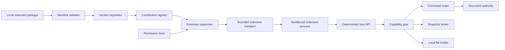
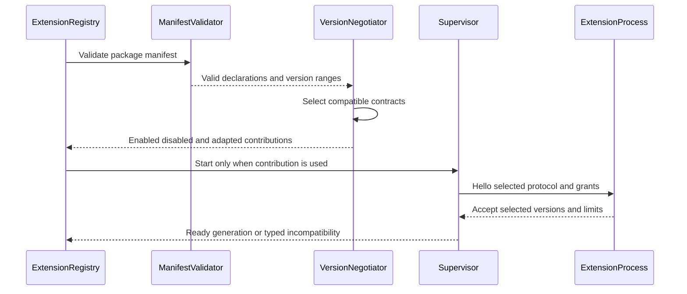
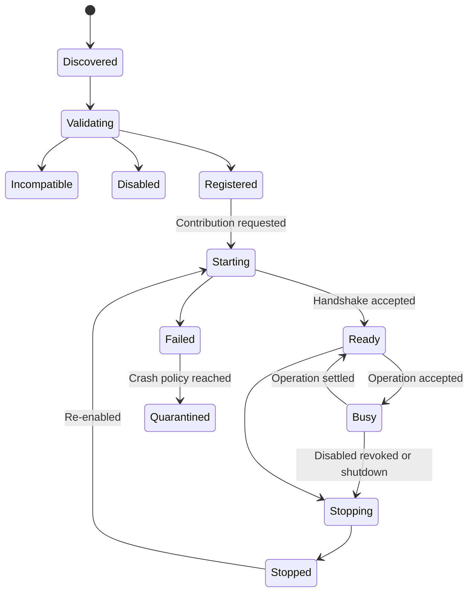
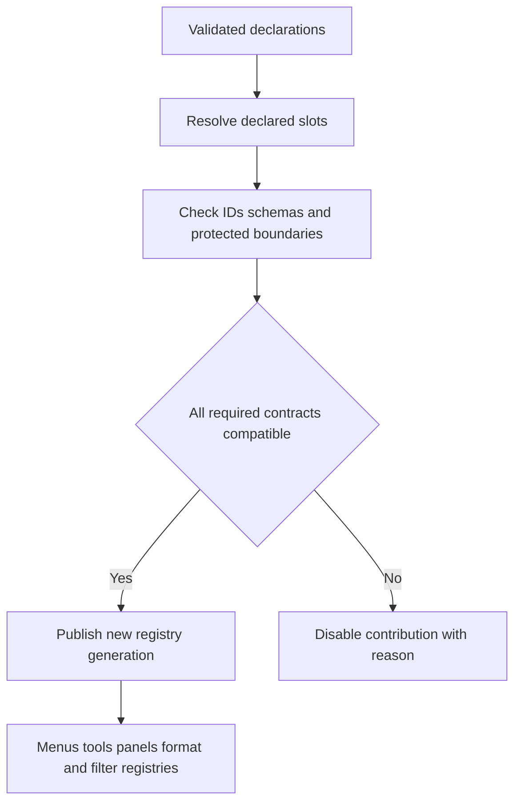
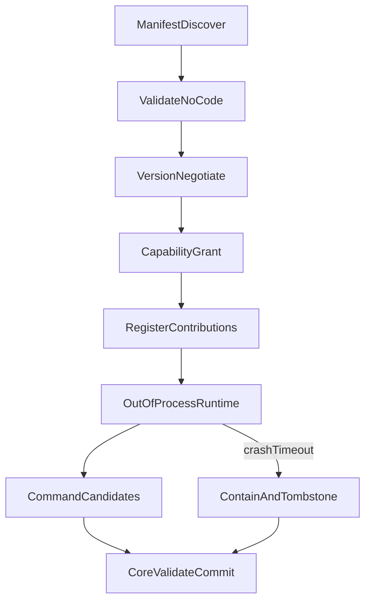

# 23 — Plugin SDK

## Overview

The PhotoTux Plugin SDK defines a capability-based extension contract for locally installed commands, filters, format adapters, tools, panels, and related declarative contributions. Extensions are optional components across a trust boundary. Installation does not imply trust, registration does not grant authority, and compatibility does not grant access. The host validates manifests, negotiates protocol and contribution versions, obtains user-approved capabilities, applies resource budgets, and mediates every call.

Out-of-process execution and sandboxing are preferred because they contain crashes, narrow filesystem and memory authority, and prevent extension code from blocking the UI or holding document locks. Exact isolation technology remains provisional pending Linux and cross-platform spikes. This document does not promise a stable Rust, C, C++, toolkit, wgpu, or other native binary ABI. A versioned serialized protocol, a component model, a narrow source SDK, or another mechanism may implement these semantics after validation. No cloud registry, product account, remote execution, AI, generative feature, telemetry requirement, or proprietary workflow belongs to this contract.

Extensions do not become alternate mutation paths. Every semantic mutation invokes a registered command through [08 — Command System](08-Command-System.md), produces zero or one transaction, updates [20 — History and Undo](20-History-Undo.md), and publishes immutable snapshots consumed by rendering. Normative language follows [Requirement Keywords](Appendix/Requirement-Keywords.md); terms follow the [Glossary](Appendix/Glossary.md).

## Responsibilities

The extension subsystem **MUST**:

- discover and validate bounded manifests without executing extension code;
- identify extension package, publisher/provenance class, version, contribution schemas, and requested capabilities;
- negotiate host protocol and each contribution contract independently;
- deny undeclared, unavailable, expired, or revoked capability use;
- isolate extension failures from documents, UI, renderer, history, saves, and other extensions;
- prefer sandboxed/out-of-process execution for third-party computation and parsing;
- route all document/workspace/preference mutations through host commands;
- provide immutable snapshots or narrower declarative views, never writable document references;
- keep host APIs deterministic, bounded, versioned, cancellable, and independent of toolkit objects;
- enforce CPU, memory, output, queue, file, GPU, and elapsed-time budgets;
- support cancellation, timeout, process termination, restart policy, and crash diagnostics;
- preserve opaque extension document data when implementation is unavailable and safe;
- provide accessible, keyboard-operable semantic presentation for extension actions and panels;
- avoid stable native ABI claims until an explicit compatibility decision is validated;
- keep normal editing operational when every third-party extension is disabled.

It **SHOULD** use least authority, default-deny permissions, declarative registration, deterministic contribution ordering, protocol schemas suitable for fuzzing, and process-per-risk-domain isolation. It **MAY** provide a trusted in-process path for reviewed components shipped with the same release, but such components remain subject to command, snapshot, budget, accessibility, and conformance rules. “Built in” is provenance, not permission to bypass architecture.

## Architecture



Manifest validation and contribution indexing occur before process start. Supervisor owns process lifecycle and transport. Capability gate owns authorization. Snapshot broker exposes immutable, bounded semantic projections. File broker converts user/host grants into narrow handles. Command router remains sole mutation authority. Presentation adapters render declarative action, tool, or panel models without allowing arbitrary toolkit access.

### Internal hierarchy

```text
Extension subsystem
├── package discovery
├── manifest parser and schema validator
├── compatibility negotiator
├── contribution registry
│   ├── command/action contributions
│   ├── filter/effect contributions
│   ├── format adapter contributions
│   ├── tool contributions
│   └── panel/inspector contributions
├── permission authority
│   ├── requested capability review
│   ├── grants, denial, and revocation
│   └── scope and expiry
├── process/sandbox supervisor
├── bounded protocol transport
├── host API facade
│   ├── snapshot/query broker
│   ├── command invocation broker
│   ├── file capability broker
│   ├── task/progress broker
│   └── semantic UI broker
├── resource budget manager
├── crash/timeout containment
├── persistence and migration
└── diagnostics/conformance harness
```

## Manifest Contract

```rust
struct ExtensionManifest {
    manifest_version: SchemaVersion,
    extension_id: ExtensionId,
    display: ExtensionDisplayMetadata,
    package_version: SemanticVersion,
    host_protocol: VersionRange,
    contributions: BoundedList<ContributionDeclaration>,
    requested_capabilities: BoundedSet<CapabilityRequest>,
    process: ProcessDeclaration,
    resources: ResourceDeclaration,
    compatibility: CompatibilityDeclaration,
}

struct ContributionDeclaration {
    contribution_id: ContributionId,
    kind: ContributionKind,
    contract_version: VersionRange,
    descriptor: BoundedValue,
    entrypoint: EntrypointRef,
    required_capabilities: BoundedSet<CapabilityId>,
    budgets: RequestedBudgets,
}
```

Conceptual only. No field order, enum layout, calling convention, allocator, or Rust trait is an ABI promise. Manifest is data, not code. Parsing validates bytes, text lengths, nesting, duplicate IDs, namespace ownership, version ranges, executable references, resource counts, and path confinement. Display names never establish identity.

`ExtensionId` is stable, globally collision-resistant within local registry policy, and cannot use reserved built-in namespaces. Contribution IDs are namespaced beneath extension identity. Package replacement cannot silently claim another identity. Signatures or package provenance may support trust decisions, but cryptographic validity alone does not grant capabilities or prove safety.

Manifest may declare optional contributions. Failure of one malformed contribution quarantines that contribution when independent validation is possible; a malformed identity, process declaration, or security-critical field rejects the package. Registry publication is atomic by generation so readers see old complete or new complete contribution sets.

## Version Negotiation

Compatibility is layered:

1. manifest envelope version;
2. host transport/protocol version;
3. host API service versions;
4. contribution contract version;
5. serialized object/filter/format schema version;
6. optional behavior or deterministic algorithm version.



Negotiation chooses one explicit intersection; it never compares display strings or assumes newest is compatible. Optional additive fields require declared defaults. Changed semantic meaning requires a new contract or behavior version. Host adapters may support a bounded set of older versions through pure translation. Unsupported contributions remain disabled with exact reason; they are not silently interpreted under a nearby version.

Package version and protocol version are independent. A package update may retain protocol behavior; host update may support multiple package versions. Persisted extension data records extension ID, contribution ID, schema/behavior version, fallback class, and bounded opaque payload. It never records native vtables or executable pointers.

No compatibility statement in this document constitutes a stable public commitment. Stability levels must be declared per contract: experimental, release-line, or separately guaranteed. Native ABI is explicitly unstable and unpromised.

## Capability and Permission Model

A capability is an unforgeable, scoped, revocable grant:

```rust
struct CapabilityGrant {
    grant_id: CapabilityGrantId,
    extension: ExtensionId,
    capability: CapabilityId,
    scope: CapabilityScope,
    constraints: CapabilityConstraints,
    issued_generation: RegistryGeneration,
    expiry: Optional<MonotonicDeadline>,
}
```

Capability classes include:

- invoke declared host commands within target schema;
- read bounded document snapshot summaries;
- read selected raster/object data for one operation;
- produce prepared filter/output data;
- receive one user-selected local read capability;
- receive one user-selected staged-write capability;
- persist bounded extension-owned settings;
- publish semantic panel state;
- use bounded temporary private storage;
- request host-rendered progress/notification;
- optionally request validated GPU compute service, never raw global device authority.

Ambient home-directory, current-directory, environment, process enumeration, unrestricted network, clipboard surveillance, raw unrelated input, arbitrary command interception, unrestricted GPU, and toolkit access are not implied. Network capability is outside normal product scope and should not be offered by the core SDK. File capabilities name exact selected files/streams and operation modes. Extension cannot convert a display path into authority.

Permission decisions distinguish manifest request, administratively available capability, user grant, operation-specific lease, and actual API call. Installation may store denied requests without repeatedly prompting. Capability escalation after update requires explicit review. Revocation stops new calls, cancels dependent operations, closes brokered handles, and terminates extension if it cannot reach safe quiescence.

## Extension Lifecycle



Discovery does not execute code. Registered does not require a live process. Lazy start reduces attack surface and resource use. Handshake includes selected protocol, extension identity, capability grants, resource limits, locale-independent schemas, cancellation channel, and host generation. Extension must echo/accept exact values before use.

Each operation has ID, deadline, cancellation token, budget, input leases, and terminal outcome. Supervisor tracks child process identity and transport generation. Responses from prior generation are stale. Restart never reuses an operation ID or assumes in-memory extension state survived.

On application shutdown, new extension work is rejected, active operations receive cancellation, and supervisor waits bounded grace before termination. Extension cannot delay document save/recovery unless it owns data required for a currently executing command; such operations must have host-owned prepared/checkpoint semantics before commit.

## Deterministic Host APIs

Host APIs are request/response or bounded stream contracts. They must:

- accept explicit IDs, versions, schemas, capabilities, and limits;
- use deterministic ordering for collections;
- avoid wall-clock values unless operation explicitly requests them;
- expose monotonic deadlines separately from user timestamps;
- return typed errors and stable codes;
- define cancellation and partial-stream semantics;
- avoid implicit active document, focused view, current directory, locale-sensitive parsing, random seed, or display profile;
- require a seed and behavior version for deterministic randomized algorithms;
- redact private data beyond granted scope;
- never return mutable core references.

```rust
interface ExtensionHostApi {
    describe_host(request: HostDescriptionRequest) -> HostDescription;
    query_snapshot(request: SnapshotQuery, grant: CapabilityGrant) -> AsyncResult<SnapshotProjection, HostError>;
    stream_raster(request: RasterReadRequest, grant: CapabilityGrant) -> AsyncStream<RasterChunk, HostError>;
    submit_command(request: ExtensionCommandRequest, grant: CapabilityGrant) -> AsyncResult<CommandOutcome, HostError>;
    report_progress(update: ProgressUpdate) -> Result<Void, HostError>;
    request_file(request: FileIntentRequest, grant: CapabilityGrant) -> AsyncResult<BrokeredFile, HostError>;
}
```

Host description reports capabilities, selected API versions, limits, and semantic feature flags. It does not expose crate versions as behavior promises. Snapshot projections contain stable IDs and immutable values scoped to contribution. Raster streams declare extent, tile order, coordinate space, color/alpha, precision, checksums where needed, and source version.

Host APIs must remain deterministic under worker scheduling. If an extension asks for object enumeration, host returns canonical document order or explicit sort. Hash iteration and pointer order never leak into output.

## Command Extension Point

An extension command contribution declares stable action/command IDs, user-facing metadata, scope, target schema, parameter/result schemas, required capabilities, mutation class, execution class, undo policy, cancellation, confirmation class, accessibility metadata, and deterministic behavior.

Registration validates descriptors; execution authority is separate. Extension may:

1. receive immutable bounded inputs;
2. prepare a declarative result outside document authority;
3. return a `TransactionProposal` or invoke permitted core commands;
4. let core validate IDs, resources, graph invariants, history inverse, and applicability;
5. commit through transaction authority.

Extension cannot append history directly, increment document versions, publish snapshots, forge built-in command provenance, or execute arbitrary callbacks during undo. An undoable extension command must provide durable declarative forward/inverse data or use core command composition. If complete inverse cannot be retained before commit, command cannot claim undoability.

Host-owned command wrappers remain available when extension unloads only if transaction representation is independent. Original extension command invocation alone is insufficient for history replay unless every input, algorithm version, and resource is pinned and compatibility promised.

## Filter and Effect Extension Point

Filter descriptors define parameter schema, input/output planes, color/alpha/precision semantics, region-of-interest and halo mapping, bounds, determinism, seed policy, tile independence, global reductions, CPU/reference status, cancellation granularity, memory estimate, and fallback behavior.

Nondestructive effect nodes may persist extension ID, filter ID, behavior/schema version, parameters, and opaque bounded data. Missing implementation produces a preserved unavailable node or cached fallback only under explicit document policy; it never silently deletes effect. Native document save must round-trip unknown safe payload.

Execution receives immutable input tile streams and returns output chunks with exact coordinates and checksums. Host validates sizes, finiteness, format, completeness, and no overlap/gaps before prepared result can commit or enter derived render cache. Raw wgpu device or shader injection is not part of baseline SDK. A future GPU service may accept validated bounded kernels or preapproved shader modules only after a separate security decision.

Filter scheduling obeys host priority and budgets. Extension cannot create unbounded internal fan-out through host calls. Global filters declare whole-input need so planner can reject or spill safely.

## Format Adapter Extension Point

Format contributions implement descriptor, bounded probe, decode, normalize-support declaration, and/or encode. They follow [22 — Import and Export](22-Import-Export.md). Source bytes and metadata are hostile even if extension claims format ownership.

Preferred architecture runs third-party codecs out of process with only a brokered stream, options, budget, cancellation, and quarantined output protocol. Decoder returns format-neutral `DecodedPackage`; it never constructs live documents. Encoder receives an immutable semantic/render stream and staged output capability; it never reads arbitrary document state or clears modified status.

Probe descriptors must be cheap and declarative when possible. Executable probing receives strict prefix/range quota. Codec crashes abort operation and preserve prior destination. Adapter option schemas are versioned and bounded. Third-party format interoperability is described generically, without vendor-specific workflow assumptions.

## Tool Extension Point

A tool is an interaction state machine that translates normalized input, parameters, active target, and immutable context into transient preview requests and commands. Tool descriptor declares target compatibility, cursor/overlay semantics, parameter schema, modifier behavior, gesture states, cancellation, command output, accessibility alternative, and resource budgets.

Extension does not receive raw unrelated global input. Presentation sends normalized tool events only while tool owns a valid interaction lease. Pointer capture, focus loss, device removal, tool switch, and Escape produce cancellation. Tool preview is non-authoritative and generation-bound. Gesture commit invokes declared command; direct pixel mutation is forbidden.

High-frequency tool protocols require bounded batching and latency validation. Host may coalesce move samples under declared semantics. Extension cannot block UI thread while interpreting events. If process crashes during gesture, host cancels preview/capture, restores prior active tool or stable failed state, and commits nothing not already observed. Incremental committed segments follow core history merge rules.

## Panel and Semantic UI Extension Point

Panel extensions contribute semantic UI models, not arbitrary native widgets in baseline design. Descriptor declares panel type, scopes/follow policy, allowed component vocabulary, actions, state schema, focus behavior, persistence, accessibility, minimum/preferred layout, and update budgets.

```text
Extension panel model
├── section/group
├── text and status
├── action button
├── toggle/choice
├── bounded list/tree
├── numeric/text parameter editor
├── progress/task view
└── canvas-independent preview asset
```

Host presentation chooses toolkit controls and applies [25 — Themes](25-Themes.md), [28 — UX Guidelines](28-UX-Guidelines.md), and [29 — Accessibility](29-Accessibility.md). Every control has role, name, state, value, action ID, validation, and focus order. Extension cannot inject arbitrary HTML, run UI-thread callbacks, hide core save/security status, create top-level menu categories freely, or inspect other panels.

Panel state updates are immutable generations. Events reference component ID and model generation. Stale events reject. Model limits cover node count, depth, text, list size, update rate, and asset bytes. Large lists use paging/virtualization contracts. Extension panel failure removes presentation, restores focus to deterministic surviving region, and preserves document truth.

## Contribution Registration and Ordering

Registries publish immutable generations. Contributions enter declared slots:

- action/menu/context slots by semantic domain;
- filter families by capability;
- format adapter candidates by signatures and policy;
- tool groups by target/interaction family;
- panel zones and inspector sections by scope.

Extensions cannot replace, shadow, relabel, reorder across protected boundaries, or hide core contributions. Ordering uses declared slot, stable priority class, extension ID, and contribution ID; install time and hash order are not inputs. Conflicting IDs reject later contribution. Missing extension leaves unresolved shortcuts, panel tombstones, and opaque document data where applicable.



## Permission UX and Trust

Permission presentation names extension, requested capability, exact scope, triggering action, duration, and consequence. It must distinguish:

- install/enable extension;
- allow contribution registration;
- allow one selected file read/write;
- allow repeated access to a declared local location, if product ever supports it;
- allow document-content read for one operation;
- allow persistent extension settings;
- revoke all grants.

Bundling unrelated grants into “full access” is prohibited. A denied optional capability leaves other contributions usable when declared independent. User can inspect effective grants and active operations. Security-critical permission status cannot rely on color alone and is keyboard/screen-reader accessible.

Trust labels use factual provenance such as shipped-with-release, locally installed, signature verified, or unverified. “Verified signature” must not be labeled “safe.” Safe-start may disable all third-party extensions while preserving documents and recovery discovery.

## Threading, Scheduling, and Backpressure

Extension process work is never performed on host/UI thread. Transport reader validates frames before dispatch. Host API services use bounded queues per extension and operation. Document commit re-enters document authority only after preparation. No core lock spans transport, extension execution, sandbox startup, file broker calls, GPU waits, or user prompts.

Budgets include:

- concurrent operations and queued requests;
- request/response bytes and nesting;
- raster/object stream bytes;
- resident/shared/temporary memory;
- CPU time and wall deadline;
- file bytes and temporary storage;
- output object/tile counts;
- progress/update rate;
- panel model nodes and events;
- restart frequency.

Backpressure pauses streams, rejects new low-priority requests, coalesces panel/progress updates, cancels speculative work, or terminates nonresponsive process. It never silently drops a user mutation request. Save/recovery and interactive core work retain reserved capacity.

## Failure, Cancellation, and Crash Containment

Typed failures include incompatible, denied, revoked, malformed request, invalid response, stale source, resource limit, timeout, cancellation, process crash, transport loss, unsupported host feature, and invariant violation. Every outcome identifies operation, extension/contribution, preserved state, retry safety, and sanitized correlation ID.

Cancellation is hierarchical: session → extension → contribution → operation → subrequest. Extension receives cancellation and bounded grace. Host stops accepting outputs after cancellation generation. If extension ignores cancellation, supervisor closes transport and terminates process. Cancellation before core commit leaves no transaction. During bounded commit, committed result stands and can be undone.

Process crash:

1. quarantine process generation;
2. cancel its operations and revoke leases;
3. reclaim shared memory and file handles;
4. discard unvalidated prepared outputs;
5. cancel tool capture/previews and remove panel projections;
6. preserve opaque document nodes and current authority;
7. record bounded redacted crash context;
8. restart only under bounded policy and explicit safety class.

Repeated crashes disable contribution/extension for session and offer safe-start inspection. Automatic restart never repeats a mutating command unless idempotency and commit status are provable. Unknown commit status is resolved from core transaction authority, not extension memory.

## State and Invariants

- Manifest validation executes no extension code.
- Registration grants no runtime authority.
- Every API call carries a current scoped capability.
- Every extension mutation enters the same command/transaction spine as built-in behavior.
- Extensions never receive writable document, history, renderer, workspace, or preference objects.
- Snapshot and stream data are immutable and version-tagged.
- Core locks never span extension code or transport.
- One operation has one terminal outcome.
- Extension crash cannot roll back or corrupt an observed core commit.
- Missing extension never causes silent deletion of safe opaque document data.
- Contribution ordering is deterministic.
- Permission revocation prevents new access and bounds existing cleanup.
- No native memory layout or calling convention is a compatibility promise.
- Extension absence cannot prevent core New/Open/Edit/Save/Export/Undo workflows.

## Persistence, Migration, and Unavailable Extensions

Separate stores hold extension registry state, enabled/disabled policy, permission grants, extension-owned preferences, workspace panel state, and document-embedded extension objects. They never merge blindly. Each uses versioned schema, size limits, staged writes, and migration.

Permission grants bind extension identity, capability, scope, and package/provenance constraints. Package identity mismatch or privilege expansion invalidates affected grants. User denial is preserved to avoid prompt loops. Sync is not provided.

Extension-owned application settings are namespaced and bounded. Host may preserve unknown settings across downgrade but cannot activate unknown semantics. Panel workspace state is convenience data and cannot contain document authority. Document-embedded extension data must define:

- required extension/contribution and schema;
- whether object can be rendered from cached fallback;
- whether it can be moved/copied/deleted while opaque;
- round-trip preservation;
- bounds and security validation;
- editability when implementation returns;
- migration ownership.

If extension is unavailable, core preserves bytes only when envelope, size, containment, and references are safe. Unknown data affecting fundamental document invariants rejects open or enters explicit degraded read-only state. Saving cannot silently drop it.

## Security Boundaries

Threats include malicious packages, parser bugs, confused-deputy host APIs, capability forgery, path traversal, symlink races, transport desynchronization, oversized messages, decompression bombs, extension-to-extension attacks, shared-memory leakage, stale response application, UI spoofing, command namespace collision, and denial of service.

Defenses include:

- package/manifest validation before execution;
- OS/process sandbox where selected;
- no ambient file/network/device authority;
- unforgeable capability leases checked at use;
- length-prefixed bounded protocol with schema validation;
- initialized shared buffers and ownership handoff;
- operation/source/version/generation checks;
- brokered staged writes;
- deterministic host-owned confirmation and permission UI;
- per-extension quotas and watchdogs;
- extension provenance on sensitive actions;
- no executable payloads in documents/history;
- redacted local diagnostics;
- safe-start and quarantine.

Sandbox policy must account for Linux-native behavior without coupling core to one sandbox mechanism. Platform hosts may implement equivalent isolation. An inability to sandbox a risk-class contribution can disable it rather than weakening required containment.

## Design Rationale and Alternatives
**Capabilities versus ambient APIs.** Capabilities add grant plumbing but make authority explicit, revocable, testable, and narrow.

**Out-of-process preference versus in-process SDK.** Process isolation contains crashes and avoids ABI coupling. Serialization and raster transfer add latency; streaming/shared-buffer protocols mitigate cost. Reviewed built-ins may remain in-process.

**Serialized semantic protocol versus native ABI.** Protocols support version negotiation, sandboxing, and multiple languages. Native ABI is faster for fine-grained calls but freezes layouts, allocators, threading, unwinding, and toolkit assumptions prematurely.

**Declarative panel UI versus arbitrary widgets.** Declarative models ensure host styling, accessibility, focus, and crash containment. They limit bespoke UI. Vocabulary can grow through versioned semantic components.

**Host-validated transaction proposals versus mutable object access.** Proposals preserve command/history invariants and stale detection. Mutable access is simpler but unsafe across threads, processes, and versions.

**Opaque preservation versus mandatory extension availability.** Preservation protects data portability but cannot execute unknown semantics. Unsafe invariant-bearing unknowns must reject rather than pretend compatibility.

## Best Practices

- Keep manifests static, bounded, and executable-free.
- Ask for smallest capability at latest possible operation boundary.
- Design host APIs in coarse deterministic batches.
- Carry operation, source version, and generation on every response.
- Build inverse representation before extension mutation commit.
- Prefer host-owned color, tile, staged-write, and progress services.
- Keep panel models semantic and accessible.
- Make process termination an ordinary tested cleanup path.
- Fuzz protocol and every contribution schema.
- Test extension disabled, denied, crashed, stale, and upgraded states.
- Never key compatibility by display label.
- Preserve extension provenance in diagnostics without leaking content.
- Keep core workflows independent of extension registry health.

## Future Extensibility

Future work may validate component-model runtimes, language bindings, richer semantic UI controls, local automation, additional deterministic compute services, or narrower native accelerators. Any adoption **MUST** retain capabilities, commands, immutable snapshots, process/crash containment, bounded resources, accessibility, migration, and explicit stability level.

A stable SDK release requires published compatibility matrix, protocol conformance suite, sandbox threat model, lifecycle guarantees, permission UX, deterministic fixtures, packaging rules, and deprecation windows. Until those exist, contracts remain architectural direction rather than ABI promise.

## Testability and Diagnostics

Conformance harness supplies fake host APIs, deterministic snapshots, scripted capabilities, in-memory file brokers, controlled clock/scheduler, bounded transports, crash injection, malformed messages, and semantic UI accessibility recorder. Extension authors can run headless manifest, command, filter, format, tool, and panel tests without native windows.

Diagnostics record extension/contribution identity, package/protocol/schema versions, process generation, capability class/scope hash, operation IDs, request/response sizes, queue/CPU/memory/time budgets, cancellation, crash/timeout, command/transaction outcome, and registry migration. Document content, pixel data, text, paths, metadata values, and file names are excluded by default.

### Deterministic acceptance scenarios

**Permission denial:** Enable extension with panel and format contributions; deny file-read capability. Assert panel loads if independent, format operation is disabled with reason, no repeated prompt loop, and extension receives no handle/path.

**Stale filter:** Start extension filter from snapshot 10, commit paint to 11, return output for 10. Assert applicability rejects or explicitly rebases only declared semantics; output never overwrites paint.

**Crash during command preparation:** Crash process after returning half a tile stream. Assert no transaction/history/version, provisional bytes reclaimed, tool/panel state recovered, and unrelated documents/extensions continue.

**Crash after commit:** Commit validated extension command, then crash before reply. Assert core transaction authority reports committed result once, history/undo works, and restart does not duplicate command.

**Capability revocation:** Start long read stream, revoke document-read grant, and assert new reads reject, active stream cancels within bound, handles close, no prepared result applies, and panel indicates revoked state.

**Manifest upgrade:** Install new package requesting extra capability and changed contribution schema. Assert previous grants do not cover expansion, compatible contributions negotiate, incompatible contribution disables with exact reason, and persisted unknown data remains.

**Missing effect implementation:** Open native document containing safe extension effect. Disable extension. Assert object and opaque parameters round-trip, UI marks unavailable, core can inspect/move/delete according to fallback policy, and save does not drop payload.

**Panel accessibility:** Render extension panel with tree, numeric field, action, and progress. Assert semantic roles/names/states, deterministic tab/arrow navigation, 200% scaling, high contrast, reduced motion, stale event rejection, and focus recovery after process termination.

**Resource exhaustion:** Extension floods requests and progress events. Assert per-extension queue bounds, update coalescing, background rejection, core save/edit responsiveness, and termination after policy threshold.

**Protocol corruption:** Send oversized length, unknown required enum, duplicate operation ID, and stale generation response. Assert transport rejects each before allocation/application, revokes process generation when required, and records bounded diagnostics.


## Acceptance Criteria

- Manifest discovery and validation execute no extension code.
- Version negotiation selects explicit compatible protocol and contribution versions.
- Capabilities are scoped, revocable, default-deny, and checked at use.
- Commands, filters, formats, tools, and panels use declared extension points only.
- Every semantic mutation remains a core-validated command/transaction.
- Extensions receive immutable bounded data, never writable core objects.
- Out-of-process crash or timeout leaves documents/history/saves valid.
- Permissions and extension provenance are accessible and inspectable.
- Unknown safe extension data survives disabled/missing implementation.
- Host APIs and contribution ordering are deterministic and headlessly testable.
- Native plugin ABI remains explicitly unpromised.
- No extension workflow requires cloud, account, proprietary service, AI, or generative functionality.


## Implementation Conformance Contract

A conforming Plugin SDK host **MUST** publish protocol and contribution schema versions, capability classes, budget dimensions, crash and restart policy, and permission persistence formats. Changing mediation semantics, snapshot immutability rules, or permission durability advances versions and supplies a conformance suite entry.

Manifest validation **MUST** complete without executing extension code. Version negotiation selects explicit compatible protocol and per-contribution versions; display names never key compatibility. Capabilities are default-deny, scoped, revocable, and checked at use. Commands, filters, formats, tools, and panels operate only through declared extension points; every semantic mutation remains a core-validated command and transaction.

Conformance fixtures **MUST** cover permission denial, stale filter applicability, crash before and after commit, capability revocation mid-stream, manifest upgrade expanding permissions, missing effect implementation with opaque data survival, panel accessibility, resource exhaustion, and protocol corruption. Headless fake host APIs are mandatory; native windows are not required for core suite results. Diagnostics **SHOULD** record extension identity, package and protocol versions, process generation, capability hashes, operation identities, budgets, and outcomes while excluding document pixels, text, and paths.

## Operational Edge Cases and Boundary Contracts

The plugin SDK is a mediated contribution surface, not an in-process license to mutate core memory. Edge cases center on negotiation failures, partial contributions, unload races, and opaque data survival.

Manifests with duplicate extension IDs, overlapping command IDs, or capability declarations exceeding the host allow-list fail discovery without executing extension code. Optional contributions may be dropped when incompatible; required contributions fail the whole extension load. Ordering among extensions is deterministic by explicit rank then ID; lexical filesystem order is not authoritative.

Version negotiation can select a lower compatible protocol than the extension’s newest. Hosts **MUST** speak only negotiated versions on that connection. Receiving a newer-than-negotiated opcode is corruption and kills the generation. Older hosts ignore unknown optional manifest fields and still enforce required ones.

Unload and disable while a filter is running cancels the job at the next bounded checkpoint. Panels contributed by the extension tombstone immediately; commands disappear from menus but in-flight committed transactions remain undoable through core inverses. Shortcut bindings to missing commands become inert and visible as unavailable.

Opaque extension objects in documents survive missing implementations as non-executable blobs with schema IDs. Users can delete or export them; they cannot silently activate when a different extension reuses an ID. ID namespaces are registry-scoped to prevent spoofing.

## Failure Modes, Security, and Trust Boundaries

Default deny is absolute. Filesystem, document-read, document-write, clipboard, process, and network capabilities are distinct. Network and account capabilities remain unpromised in PhotoTux’s local-first charter; hosts **MUST** reject manifests requesting cloud or remote inference features as unsupported rather than silently ignoring while loading other parts.

Process isolation treats shared-memory maps as length-prefixed read-only views unless a specific writable scratch capability exists. Extensions never receive raw GPU device handles or pointers into history spills. Timeout, memory, and CPU budgets terminate runaway workers; termination is indistinguishable from crash for document integrity purposes—both leave core authoritative state valid.

Permission UX surfaces provenance: install path, manifest hash, requested capabilities, and user decisions. Revocation applies to subsequent uses; it does not rewrite past history. Hostile manifests with misleading display names still show technical IDs.

Diagnostics record extension ID, capability checks, opcodes, timings, and error codes—not document pixels or user file contents passed through the extension.

## Concurrency, Cancellation, and Consistency

Host API calls are serialized per extension generation or explicitly documented as concurrent-safe read snapshots. Mutations always return as command candidates for core validation. Parallel progress events coalesce by operation ID. Stale responses with old generations are dropped.

Core may call into multiple extensions for contribution gathering; each sees immutable snapshots. Contribution assembly has a deadline; late replies are omitted with warnings, never blocking save.



## Migration, Compatibility, and Persistence Evolution

Extension settings live in namespaced preference stores with schema versions. Missing extensions leave settings intact but inactive. Renaming an extension ID is a new identity; migration hooks are explicit and user-approved, never heuristic based on display name.

Document-embedded opaque blobs carry `schema_id` and `min_host_version`. Hosts that cannot interpret them preserve bytes. If a blob becomes required for rendering a layer type the core does not understand, the layer shows preserved-unavailable rather than approximating with another extension.

Protocol migrations prefer dual-speak windows with negotiated versions. Removing an opcode requires a major protocol bump and failure on residual speakers.

## Extended Acceptance Scenarios

**Duplicate command ID:** Two manifests claim the same command. Assert deterministic winner or dual-fail per policy, no double registration.

**Capability revoke mid-session:** Revoke document-write; assert subsequent mutation attempts fail and prior undos still work.

**Unload during filter:** Disable extension during tile compute. Assert cancel, no partial commit, tombstone panel.

**Opaque survive:** Save document with opaque blob; remove extension; reopen. Assert blob preserved and non-executable.

**Protocol corruption:** Send oversized length prefix. Assert transport reject and generation revoke without core heap corruption.

**Negotiation downgrade:** Extension supports v3/v2; host v2. Assert v2 only and v3 opcodes rejected.

**Resource flood:** Extension spam progress events. Assert coalescing, queue bounds, and eventual termination threshold.

## Cross References

- [00 — Introduction and System Charter](00-Introduction.md) — least authority, deferred ABI, and local-first boundaries.
- [01 — Information Architecture](01-Information-Architecture.md) — extension slots and semantic presentations.
- [02 — Application Lifecycle](02-Application-Lifecycle.md) — safe start, process lifecycle, shutdown, and recovery.
- [03 — Workspace System](03-Workspace-System.md) — extension panels, tombstones, and restoration.
- [07 — Context Menus](07-Context-Menus.md) — bounded contribution slots and provenance.
- [08 — Command System](08-Command-System.md) — sole mutation path and extension mediation.
- [09 — Shortcut System](09-Shortcut-System.md) — extension action bindings and unload behavior.
- [10 — Document Model](10-Document-Model.md) — snapshots and opaque extension objects.
- [15 — Filter Engine](15-Filter-Engine.md) — filter ROI, tile, precision, and deterministic semantics.
- [17 — Rendering Engine](17-Rendering-Engine.md) — render graph and GPU authority boundaries.
- [20 — History and Undo](20-History-Undo.md) — durable reversible extension transactions.
- [22 — Import and Export](22-Import-Export.md) — codec adapter boundary.
- [24 — Preferences](24-Preferences.md) — extension-owned setting schemas and permission persistence.
- [25 — Themes](25-Themes.md) — semantic token boundary for extension UI.
- [28 — UX Guidelines](28-UX-Guidelines.md) — contribution UX requirements.
- [29 — Accessibility](29-Accessibility.md) — semantic tree and assistive technology requirements.
- [Glossary](Appendix/Glossary.md) — canonical terminology.
- [Requirement Keywords](Appendix/Requirement-Keywords.md) — normative interpretation.
