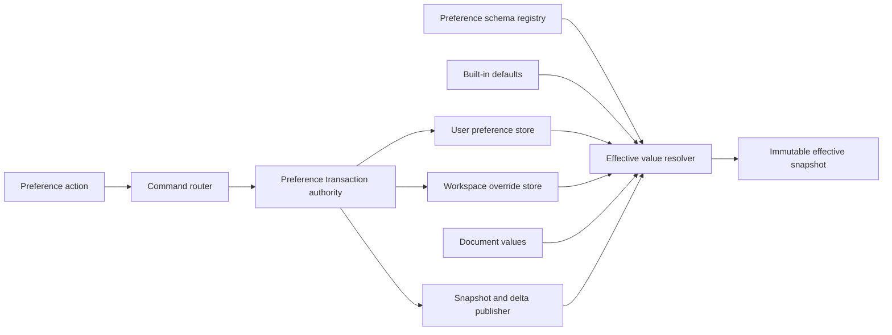
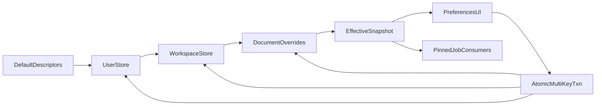

# 24 — Preferences

## Overview

Preferences define versioned local configuration for application behavior, workspace defaults, document defaults, host integration, accessibility, resources, diagnostics, and extension policy. A preference is not automatically document state. Every setting declares scope, schema, default, owner, persistence location, effective-value precedence, validation, migration, sensitivity, determinism impact, restart policy, and reset behavior.

PhotoTux uses four effective-value layers: built-in default, user preference, workspace override, and document value. The layers do not form one arbitrary map. A key explicitly declares which layers are legal and how they combine. Document values travel with editable content only when they define document meaning; user and workspace settings remain local. Temporary interaction state is outside persisted preference precedence.

Preference mutation uses the [Command System](08-Command-System.md) and an atomic preference transaction. Document-scoped changes that alter document semantics use document commands and history; preference commands cannot bypass [10 — Document Model](10-Document-Model.md). Settings are local-first. Synchronization, accounts, cloud backup, policy servers, telemetry-driven defaults, AI, and proprietary service settings are explicitly out of scope. Normative language follows [Requirement Keywords](Appendix/Requirement-Keywords.md); terms follow the [Glossary](Appendix/Glossary.md).

### Accepted v1 (shipping)

XDG `preferences.json` + Preferences dialog: panel visibility, last tool, guides/grid/rulers/snap toggles, restore-last-tool. Host-owned preference mutations (not document history). Full snapshot/precedence engine, workspace topology persistence, and preference command bus remain **target**.

## Responsibilities

The preference subsystem **MUST**:

- register stable namespaced setting IDs with bounded versioned schemas;
- distinguish built-in default, user, workspace, document, session, and temporary values;
- compute effective values through declared precedence and merge semantics;
- validate type, range, units, enum, dependencies, capability, and security policy before commit;
- apply multiple related changes atomically through preference transactions;
- route document-semantic changes through document commands and history;
- publish immutable preference snapshots and ordered deltas;
- persist user/workspace domains separately using staged replacement;
- migrate schemas through pure, testable, versioned transforms;
- preserve unknown safe extension settings without activating unknown semantics;
- recover field-by-field where independence is proven and quarantine invalid sources;
- expose restart, reload, document-output, security, and accessibility consequences;
- keep secrets and file capabilities outside ordinary preference values;
- remain usable with storage unavailable by retaining explicit in-memory state and warning;
- support deterministic headless tests with injected host capabilities.

It **SHOULD** provide per-key, per-section, workspace, and full-user reset; export/import only for explicitly portable non-sensitive subsets; searchable semantic categories; and change previews for broad resets. It **MAY** support administrative read-only constraints in a future local deployment profile, but no remote policy mechanism is defined.

## Architecture



Core preference service owns schemas, validation, precedence, transactions, snapshots, migration, and local persistence contracts. Workspace manager owns workspace topology and values defined by [03 — Workspace System](03-Workspace-System.md). Document authority owns document properties. Linux host adapter reports capabilities, theme/contrast/motion signals, file chooser behavior, and configuration roots; it does not reinterpret settings.

### Internal hierarchy

```text
Preferences subsystem
├── schema registry
│   ├── built-in setting descriptors
│   ├── extension namespaces
│   └── compatibility adapters
├── value domains
│   ├── built-in defaults
│   ├── user values
│   ├── workspace overrides
│   ├── document properties
│   ├── session values
│   └── temporary interaction values
├── effective-value resolver
├── validation and dependency engine
├── transaction authority
├── immutable snapshot publisher
├── persistence stores
├── migration and quarantine
├── reset/import/export planner
├── semantic preferences presentation
└── diagnostics/conformance tests
```

## Schema and Descriptor Contract

```rust
struct PreferenceDescriptor {
    id: PreferenceId,
    schema_version: SchemaVersion,
    value_schema: ValueSchema,
    default: DefaultProvider,
    allowed_scopes: ScopeSet,
    precedence: PrecedencePolicy,
    merge: MergePolicy,
    persistence: PersistencePolicy,
    application: ApplicationPolicy,
    sensitivity: SensitivityClass,
    determinism: DeterminismImpact,
    dependencies: BoundedList<PreferenceDependency>,
    accessibility: PreferenceAccessibility,
    provenance: ContributionProvenance,
}

enum PreferenceScope {
    User,
    Workspace(WorkspaceId),
    Document(DocumentId),
    Session,
    Temporary(InteractionId),
}
```

Conceptual only; no Rust layout is persisted or exposed as ABI. IDs use stable semantic namespaces such as `render.preview-quality`, `history.memory-budget`, `accessibility.reduced-motion`, `workspace.default-preset`, and `extension.example.setting`. Labels and category positions are presentation metadata, not identity.

`ValueSchema` defines scalar/object/list type, numeric unit and range, finite-value rule, string normalization and length, enum compatibility, collection depth/count, default, and cross-field constraints. Arbitrary executable validators are forbidden across extension boundaries. Built-in complex validation is identified by behavior version and must be pure over bounded values and capability snapshots.

`DefaultProvider` is constant or deterministic over explicit host capability class. It cannot depend on network, current document content, wall-clock randomness, hidden GPU benchmark, or previous invalid value. Hardware-adaptive defaults must expose selected value and remain stable until an explicit re-evaluation action.

## Scope Model

Scope answers ownership and persistence:

- **Built-in default:** immutable release-defined fallback.
- **User:** local behavior across workspaces/documents.
- **Workspace:** layout/task-specific override; never document authority.
- **Document:** persisted semantic value affecting interpretation/output/editability.
- **Session:** process-lifetime operational value, generally not durable.
- **Temporary:** gesture/dialog preview or one invocation; never persisted as preference.

A descriptor may permit only a subset. Brush preview opacity might allow user/workspace. Document working profile is document-only and governed by [16 — Color Management](16-Color-Management.md). Memory budget is user/session. Active tool is workspace/session. Export option choice may be operation preset but never silently document state.

Scope transitions are explicit actions. “Use this as default” writes a user/workspace value; changing current document remains a separate document command. Copying a document value into default does not change the document again.

## Effective Precedence

Baseline precedence for a key that allows all semantic layers:


This means “later allowed layer overrides earlier” only for descriptors with `Replace` merge. Other policies include:

- `Replace`: highest present legal layer wins;
- `FieldOverlay`: declared object fields override independently;
- `OrderedAppend`: bounded contributions append in deterministic source order;
- `SetUnion`: canonical semantic IDs union, with explicit removal tombstones;
- `MinConstraint` or `MaxConstraint`: operational safety cap combines values;
- `ProhibitedOverride`: lower owner is authoritative and higher layers cannot change it.

Blind recursive JSON merge is prohibited. A workspace cannot override a document-semantic value merely because keys collide. Security hard limits can constrain user-requested soft budgets but must expose effective clamp and source. Host capability can mark setting unsupported; it does not silently replace with another semantic value.

```rust
struct EffectivePreference {
    id: PreferenceId,
    value: BoundedValue,
    source: EffectiveSource,
    contributing_layers: BoundedList<LayerContribution>,
    constraints: BoundedList<AppliedConstraint>,
    descriptor_version: SchemaVersion,
    preference_revision: PreferenceRevision,
}
```

## Transactions and Mutation Spine

Every persistent preference mutation is a command such as `preferences.set`, `preferences.reset`, `preferences.apply-section`, or `workspace.set-preference-override`. UI drafts are ephemeral. A command submits:

```rust
struct PreferenceTransaction {
    transaction_id: PreferenceTransactionId,
    base_revision: PreferenceRevision,
    edits: BoundedList<PreferenceEdit>,
    target_scope: PreferenceScope,
    reason: PreferenceChangeReason,
    confirmation: Optional<PreferenceConfirmation>,
}
```

Commit workflow:

1. resolve descriptors and registry generation;
2. validate target scope and caller authority;
3. validate each value/schema;
4. validate cross-key dependencies against candidate effective snapshot;
5. classify runtime effects, restart requirements, and document consequences;
6. stage candidate store representation;
7. atomically install new preference revision;
8. publish immutable delta;
9. persist captured revision asynchronously or synchronously according to durability class;
10. report applied, pending-restart, constrained, or failed state.

All edits commit or none. An invalid hidden advanced field blocks the transaction and is surfaced at its collapsed section. Runtime consumers receive a coherent revision. Persistence failure after in-memory commit reports “active but not durable” and schedules bounded retry; it does not roll back behavior unpredictably. Security-sensitive grants may require durability before activation and declare that policy.

Preference transactions are not document history. If a UI surface combines “change this document” and “make default,” it orchestrates two clearly labeled commands and reports independent outcomes. Cross-authority atomicity is not assumed.

## Immutable Snapshots and Consumer Contract

Consumers receive immutable effective snapshots scoped to application, workspace, document, view, or operation:

```rust
struct PreferenceSnapshot {
    revision: PreferenceRevision,
    registry_generation: RegistryGeneration,
    context: PreferenceContext,
    values: ImmutablePreferenceMap,
}
```

Rendering, tools, dialogs, and extension brokers pin snapshots for one operation/frame/gesture where consistency matters. A preference update publishes an ordered delta identifying changed IDs and effect classes. Stream gaps trigger full snapshot reacquisition.

Document commands must capture deterministic-output preferences as explicit command parameters or behavior versions when result depends on them. History replay cannot use current changed default. Export plans pin exact effective export settings. Renderer may update view-only quality on next frame generation, but one frame uses one coherent preference revision.

## Preference Categories

Presentation categories are semantic and stable:

```text
Preferences
├── General
│   ├── startup and local session behavior
│   ├── language/units presentation
│   └── recent local items
├── Interface
│   ├── theme and scaling
│   ├── workspace defaults
│   └── interaction feedback
├── Input and Shortcuts
├── Canvas and Rendering
├── Color Management
├── Files and Metadata
├── History and Recovery
├── Performance and Resources
├── Accessibility
├── Extensions and Permissions
└── Diagnostics and Privacy
```

Categories do not mirror crates. Search indexes name, description, category path, synonyms, and consequences without recording private values. Extension settings appear in an Extensions section or approved semantic category with visible provenance. Extensions cannot create deceptive security categories or override core labels.

## Defaults and Reset Semantics

Built-in defaults are explicit data versioned by `DefaultsVersion`. A release may change untouched defaults. User overrides retain intent across upgrades. Stores record overrides/tombstones, not a copied complete default set.

Reset scopes:

- reset one setting at selected scope;
- reset one category at selected scope;
- reset workspace overrides while preserving user/document values;
- reset user preferences while preserving documents, workspaces if excluded, recovery, resources, and extension packages;
- restore built-in shortcut/theme/workspace defaults through their subsystem commands;
- clear extension permission grants through an explicit security action.

A reset preview lists affected count, scopes, restart/reload consequences, and excluded domains. Reset is atomic per authority and uses staged persistence. “Reset all preferences” must not delete documents, native recovery, clipboard, user resources, plugin packages, or source files. Destructive deletion of local caches is a separate operation because caches are reconstructible, not preferences.

## Validation and Dependency Rules

Dependencies are declarative:

- `requires`: another capability/value must exist;
- `conflicts`: values cannot coexist;
- `enabled_when`: presentation availability predicate;
- `constrains`: one value bounds another;
- `invalidates`: consumer/cache effect on change;
- `restart`: host/process/component restart requirement;
- `deterministic_capture`: value must be copied into command/plan.

Validation uses candidate effective state, not edit order. Cyclic dependencies are rejected at descriptor registration. Cross-extension dependencies reference stable public contribution IDs and tolerate absence. Disabled controls retain stored value unless reset policy says otherwise; hidden invalid values remain surfaced.

Numeric budgets use explicit units and hard limits. Zero, auto, unlimited, and inherit are distinct enum cases, not overloaded numbers. Non-finite values reject. Paths are not ordinary strings: directory/file access uses host-selected capabilities or local resource-root descriptors with explicit authority.

## Runtime Application Policies

Settings declare:

- `Immediate`: next projection/update uses new value;
- `NextOperation`: running operations retain captured value;
- `NewDocument`: existing documents unchanged;
- `NewView`: existing views unchanged unless user reapplies;
- `ComponentRestart`: affected service rebuilds;
- `ApplicationRestart`: persisted now, active after restart;
- `DocumentCommandRequired`: preference UI cannot apply directly.

Immediate does not mean synchronous expensive rebuild on UI thread. It means new preference revision is authoritative; consumers schedule bounded updates. Theme changes rebuild semantic presentation without altering document. Renderer budget changes cancel/evict derived work under [17 — Rendering Engine](17-Rendering-Engine.md). History budget change compacts asynchronously without deleting current authority. Extension permission revocation follows [23 — Plugin SDK](23-Plugin-SDK.md).

Restart-required changes remain visibly “pending restart” and can be reverted. Restart UI cannot claim completion before a new process observes the revision. Safe-start may ignore custom workspace/theme/extension activation while preserving persisted values for later recovery.

## Persistence Format

User and workspace stores are separate versioned envelopes:

```rust
struct PreferenceStoreEnvelope {
    store_schema: SchemaVersion,
    defaults_version: DefaultsVersion,
    revision: PreferenceRevision,
    values: BoundedMap<PreferenceId, SerializedPreferenceValue>,
    unknown: BoundedMap<PreferenceId, OpaquePreferenceValue>,
    checksum: IntegrityCode,
}
```

The actual encoding remains open. Requirements:

- independent from in-memory Rust layout;
- deterministic canonical key ordering where checksums/diffs rely on it;
- bounded record, key, value, string, list, and nesting sizes;
- staged write and atomic replacement where available;
- user-private permissions for sensitive operational settings;
- no document pixels or recovery payloads;
- no raw toolkit handles, monitor ordinals as identity, GPU objects, callbacks, or capability secrets;
- unknown fields preserved only under bounded safe envelope;
- original retained/quarantined during migration until replacement validates.

Workspace values follow workspace persistence, not user preference file. Document values follow [27 — File Formats](27-File-Formats.md). Extension settings are namespaced and quota-limited. Diagnostic preferences cannot enable remote transmission because telemetry is outside scope.

## Migration

Migration is a sequence of pure transformations:


Migration rules:

- stable ID, not label/category, identifies setting;
- rename uses explicit ID alias map;
- unit changes convert with bounded deterministic rounding;
- semantic changes create new ID/schema or explicit migration requiring consequence;
- removed setting may remain opaque for downgrade only when harmless;
- invalid independent values can fall back individually;
- invalid structural envelope quarantines whole source;
- extension migration runs in bounded declarative host transformation or isolated extension process, never under store lock;
- migration failure leaves old file intact and loads safe defaults/compatible values.

Default evolution is separate from schema migration. `base_defaults_version` lets manager determine whether a value is user override or old copied default. No migration reaches network or relies on current display/GPU behavior.

## Import and Export of Preference Sets

Optional local export includes only declared portable keys. It excludes file capabilities, recent paths, recovery locations, permission tokens, diagnostics contents, extension secrets, device-specific display identities, and document data. Export is a staged local write.

Import treats files as hostile. It validates schema/limits, resolves IDs, previews additions/replacements/removals/conflicts, identifies unsupported host settings, and commits one preference transaction. Unknown extensions/settings remain disabled records. Import never auto-installs extensions or grants capabilities. User can import selected categories.

This feature is not synchronization. There is no merge service, remote identity, cross-device conflict resolution, account, or background transfer. Copying a file manually is ordinary local interoperability.

## Concurrency, Threading, and Backpressure

Preference authority serializes commits. Schema registry publishes immutable generations. Persistence, migration, conflict analysis, and expensive capability probes run off UI thread over immutable snapshots. Commit and presentation update use appropriate serialized authorities.

Pending preference UI draft retains base revision. If another commit changes overlapping keys, apply performs three-way semantic conflict analysis or rejects; it never silently overwrites by stale form. Non-overlapping edits may rebase only when descriptor permits.

Consumers label async results with preference revision and context generation. Old theme preview, shortcut analysis, renderer reconfiguration, or extension permission result is discarded when stale. Notification queues are bounded; repeated changes coalesce by latest revision while consumers detect gaps and reacquire.

## Security, Privacy, and Trust

Preferences are not a secure secret store. Passwords, private keys, capability tokens, and credentials are outside product scope. Sensitive values such as local history/recovery policy, extension grants, and diagnostic detail receive user-private storage and redaction but should contain references/decisions rather than secrets.

Hostile preference files can attempt oversized allocation, invalid paths, extension impersonation, unsafe renderer limits, inaccessible UI, or denial of service. Readers enforce limits and hard safety constraints. A user value cannot raise parser, memory, or sandbox limits above implementation hard caps without a separately validated advanced policy.

Extensions register only their namespace, cannot read unrelated values, and receive effective values needed for their contribution. Extension settings cannot alter core security, file, permission, save, recovery, or accessibility requirements. Theme packages cannot redefine semantic state meaning; see [25 — Themes](25-Themes.md).

Diagnostics record IDs, sources, revisions, validation/migration codes, and effect classes—not private paths, text values, metadata, or document context. Preference search history remains local and avoids logging queried private values.

## Accessibility

Preferences UI exposes semantic headings, sections, labels, descriptions, current/effective/source values, units, ranges, reset actions, validation errors, dependencies, restart status, and disabled reasons. Search results announce category and current state. Every operation is keyboard reachable.

Tab order follows sections; complex category navigation uses tree/list arrow model rather than thousands of tab stops. Invalid controls are related to error descriptions. Mixed/effective override states communicate source in text, not color. Reset confirmation identifies exact scope. Applying changes preserves focus by semantic setting ID.

At 200% scaling, categories and controls reflow without horizontal clipping. High contrast and reduced motion settings apply even to preference UI used to change them; preview includes a safe revert countdown only when accessibility risk warrants and never traps keyboard focus. Screen readers receive rate-limited announcement of applied, pending restart, persistence failure, or invalid changes.

## Failure, Cancellation, and Recovery

Unreadable store loads defaults, quarantines source where possible, and reports persistence state without preventing recovery discovery. Partially invalid independent values fall back and retain diagnostic references. Checksum/truncation failure rejects envelope. Unsupported newer schema loads only fields whose envelope compatibility is explicitly known and avoids overwriting source.

Persistence failure after commit leaves active in-memory revision, marks non-durable, and keeps newest snapshot for bounded retry. On shutdown, lifecycle attempts staged write within deadline but never claims success if not durable. Next startup uses last valid stored revision.

Migration cancellation occurs before replacement and leaves original. Import/reset preview cancellation changes nothing. Once atomic preference commit occurs, cancellation cannot erase observed behavior; reversal is a new transaction/reset. Component reconfiguration failure leaves preference authoritative but marks consumer degraded or rolls back only through an explicit compensating preference transaction whose outcome is visible.

An invalid setting causing startup crash can trigger safe-start defaults without deleting user values. User can inspect/quarantine/reset offending scope. Safe-start status is explicit and local.

## State and Invariants

- Every registered preference has one stable ID, schema, default, allowed scopes, and merge policy.
- Effective values derive only from legal layers and explicit constraints.
- A preference transaction publishes all edits or none.
- Document-semantic values change only through document authority/history.
- Preference revisions increase monotonically.
- Consumers observe one coherent snapshot revision.
- Unknown settings never become active without a descriptor.
- Missing extension preserves bounded settings but grants no authority.
- Persistence failure does not silently claim durability.
- Reset scope never expands implicitly.
- Host capability affects availability/constraint, not hidden semantic substitution.
- Deterministic document operations capture relevant values explicitly.
- Sync, accounts, cloud state, and secret storage are absent.

## Design Rationale and Alternatives
**Typed schemas versus free-form key/value maps.** Schemas add registration/migration work but prevent unit, scope, validation, and discoverability ambiguity.

**Layered precedence versus copied settings.** Layers preserve ownership and defaults. Copies drift and make it impossible to explain effective source.

**Declared merge versus recursive merge.** Declared semantics prevent invalid topology and security bypass. Recursive merge is convenient but semantically undefined.

**Transactions versus immediate field writes.** Transactions preserve cross-field constraints and coherent consumer updates. Field writes expose invalid intermediate states.

**Override deltas versus full default snapshots.** Deltas retain user intent through default evolution. Full snapshots are simpler but freeze obsolete defaults.

**Separate stores versus one configuration blob.** Separation protects domain ownership and recovery. It requires coordinated UI for multi-domain actions.

**No synchronization versus premature sync schema.** Local files keep trust and conflicts simple. Sync needs identity, merge, encryption, deletion, and service policy outside product scope.

## Best Practices

- Name settings by semantic outcome, not widget.
- Use explicit units and finite ranges.
- Distinguish auto, inherit, disabled, and numeric zero.
- Keep defaults deterministic and inspectable.
- Store overrides, not copied defaults.
- Capture output-affecting values in commands/export plans.
- Keep document values out of user/workspace stores.
- Migrate by stable IDs, never labels.
- Test corrupted, older, newer, and missing-extension records.
- Make persistence failure visible without blocking editing.
- Keep extension namespaces and quotas strict.
- Redact values in diagnostics by default.
- Offer reset at nearest useful scope.

## Operational Conformance Record

Each release **MUST** emit a machine-readable, locally inspectable conformance record naming the preference registry generation, defaults version, supported store schemas, migration chains, hard safety limits, and every setting whose application requires restart or deterministic capture. The record **MUST NOT** contain user values. Tests compare it with UI category/search exposure so a registered setting cannot become unreachable or undocumented. Release validation opens the previous supported store versions, applies every migration, stages and rereads output, exercises reset at each legal scope, and confirms unknown extension values remain inert. A changed default, unit, scope, merge rule, or deterministic impact is a reviewed compatibility event even when serialized type remains unchanged.

## Future Extensibility

Future local deployment constraints, alternate platform hosts, additional accessibility preferences, resource policies, and extension-defined semantic settings may be added. Every new key **MUST** declare full descriptor contract, migration, precedence, deterministic impact, failure, security, accessibility, and tests.

Any future synchronization proposal requires a separate architecture covering identity, encryption, conflict resolution, deletion, offline behavior, service independence, privacy, and scope. It is not implied here.

## Testability and Diagnostics

Headless harness provides deterministic schema registry, fake host capabilities, in-memory stores with staged failure, controlled revision scheduler, migration corpus, extension registration/removal, and snapshot/delta recorder. Property tests generate legal/illegal descriptors, layers, dependencies, values, and transactions.

Diagnostics record descriptor ID/version/provenance, transaction/revision, changed IDs, effective sources, constraints, validation code, migration chain, store durability, stale consumer result, and timing. Values are redacted by sensitivity policy.

### Deterministic acceptance scenarios

**Precedence:** Set built-in 10, user 20, workspace 30, document 40 for a legal replace key. Assert effective 40. Remove document then workspace values and assert 30 then 20 without changing unrelated layers.

**Illegal scope:** Attempt workspace override for document-only working profile. Assert schema rejection, no preference revision, no document transaction, and UI points to document color command.

**Atomic validation:** Submit two edits where second violates dependency. Assert neither applies, effective snapshot/revision/store unchanged, and all bounded field errors returned.

**Concurrent draft:** Open draft at revision 7, externally change same key at 8, then apply. Assert explicit conflict/review or descriptor-approved rebase; no silent overwrite.

**Save determinism:** Begin export with captured preference revision 12, change default dithering at 13, and assert export uses captured value while next export uses 13.

**Migration:** Load old unit in MiB and migrate to bytes with checked conversion. Assert stable ID, exact value, original retained until verified replacement, and deterministic output.

**Corrupt store:** Provide truncated envelope with huge declared count. Assert rejection before allocation, defaults load, recovery/documents untouched, and source quarantined.

**Missing extension:** Load bounded settings for absent extension. Assert values preserved inactive, no capability granted, core UI unaffected, and settings reactivate only after compatible descriptor validation.

**Persistence failure:** Commit theme preference, fail staged replacement. Assert active revision and UI theme change are visible with non-durable warning; restart uses prior durable state.

**Reset:** Reset workspace category while user/document values exist. Assert only workspace values removed, document version unchanged, user preferences retained, and exact affected count reported.

**Accessibility:** Navigate, search, edit invalid value, inspect source, reset, and apply using keyboard/screen reader at 200% scale. Assert roles, errors, focus restoration, and non-color override indicators.


## Acceptance Criteria

- Every setting has a stable typed descriptor and explicit legal scopes.
- Effective values follow default → user → workspace → document precedence only as declared.
- Multi-key changes commit atomically and publish coherent revisions.
- Document semantics never change through preference authority.
- Output-affecting operations pin exact preference values.
- Stores are versioned, bounded, staged, migratable, and independent from Rust layout.
- Unknown extension settings survive safely but remain inactive.
- Persistence/migration failures preserve last valid state and remain actionable.
- Reset/import scopes are previewed and cannot expand silently.
- Preferences UI is keyboard accessible, scalable, and exposes source/consequence.
- Synchronization is explicitly absent.
- No preference requires cloud, account, AI, proprietary service, or unvalidated ABI/runtime/toolkit.


## Implementation Conformance Contract

A conforming preferences implementation **MUST** publish descriptor schema versions, precedence rules, transaction revision semantics, store envelope versions, and migration function identities. Changing effective-value resolution, legal scopes, or durability guarantees advances versions and provides migration corpus fixtures.

Every setting **MUST** have a stable typed descriptor declaring identity, type, default, legal scopes, constraints, dependencies, sensitivity, and effect class. Effective values follow default, then user, then workspace, then document only as declared. Multi-key changes commit atomically and publish one coherent revision. Document semantic properties are never mutated through preference authority; output-affecting operations pin exact preference revisions at start.

Fixtures **MUST** cover precedence stacks, illegal scope rejection, atomic dependency validation, concurrent draft conflict or rebase, save and export pinning, unit migration, corrupt store quarantine, missing extension settings preservation, persistence failure with non-durable warning, reset scope preview, and accessibility of the preferences UI. Diagnostics **SHOULD** record descriptor identities and versions, transaction revision, changed keys, effective sources, and validation codes while redacting sensitive values per policy.

Preference conformance further requires safe-start loading with ignored corrupt overlays, deterministic effective-map dumps for headless tests, and proof that theme, shortcut, and render consumers never observe torn multi-key updates across a single published revision. Import and export of preference packs **MUST** preview scope expansion and refuse silent privilege or scope escalation.

## Operational Edge Cases and Boundary Contracts

Preferences configure hosts, workspaces, and optional document-scoped overrides without becoming a second document model. Edge cases involve scope collisions, dependent keys, atomic multi-key commits, and reset blast radius.

A key declared user-only **MUST** reject workspace or document writes. A document-scoped key never alters another open document’s effective map. When a workspace override shadows a user value, clearing the workspace key restores the user value without momentarily flashing defaults. Defaults themselves are immutable shipped descriptors; “reset to default” copies the default into the target scope rather than deleting the descriptor.

Dependent keys validate together. Enabling a high-cost GPU preference may require lowering a concurrency budget in the same transaction; split commits that leave illegal pairs are rejected. Search and filter UI may show keys the user cannot edit due to policy; those appear read-only with source explanation.

Import of preference sets is previewed with added, removed, changed, and rejected keys. Silent expansion into unrelated categories is forbidden. Document-embedded preference islands migrate with the document and do not write user stores unless the user imports them explicitly.

## Failure Modes, Security, and Trust Boundaries

Preference stores are untrusted at read. Schema validation, type checks, enum membership, range bounds, and size limits apply before activation. Hostile huge lists and deeply nested extension blobs fail closed. Extension namespaces cannot write core keys.

Secrets do not belong in preferences. Tokens, passwords, and license blobs are rejected by descriptor class. File-path preferences point to user-authorized locations and are revalidated on use; they are not ambient capabilities.

Staged persistence uses write-temp then atomic replace. Failure after in-memory publish yields a non-durable warning and restart uses last durable good store. Corruption falls back to last good or factory defaults with a recovery report.

Diagnostics include key IDs, scopes, and error codes—not necessarily the values when values may contain personal directory strings; path-valued keys are redacted to basename or hash in shared traces.

## Concurrency, Cancellation, and Consistency

Preference revisions are monotonic per store. Readers pin an immutable snapshot. Mid-UI edits that lose a race to another window’s commit reload the conflicting keys before applying. Multi-window hosts serialize writers through the preference service.

Output-affecting operations (export, render proof, filter commit) pin the exact effective values they used. Later preference changes do not mutate those pins. Interactive UI may live-update from newer snapshots without rewriting pinned jobs.



## Migration, Compatibility, and Persistence Evolution

Descriptor versions migrate values with pure functions registered in core. Unknown keys in core namespaces reject; unknown keys in extension namespaces persist inactive. Renaming a key requires a migration that copies values and leaves a tombstone for one release cycle when needed for downgrade safety.

Downgrade to older builds drops unknown newer keys from activation but may keep them serialized under a preserve bag if the format supports it. Preserve bags never execute logic.

Shortcut profiles, theme selection, history budgets, and color UI defaults migrate independently but commit through the same staging rules when exported as a bundle.

## Extended Acceptance Scenarios

**Scope reject:** Write a user-only key to document scope. Assert rejection and unchanged effective map.

**Atomic dependency:** Commit illegal pair in one transaction. Assert both keys unchanged; retry legal pair succeeds atomically.

**Reset blast radius:** Reset workspace category. Assert user and document values remain; report exact counts.

**Non-durable publish:** Fail disk replace after theme change. Assert UI shows new theme with warning; restart restores durable previous.

**Extension inactive:** Load unknown extension key. Assert preserved inactive and absent from effective core reads.

**Pin stability:** Start export; change export preference mid-flight. Assert export pins prior values.

**Import preview:** Import set touching shortcuts and themes. Assert preview listing and no apply until confirm.

## Headless and Safe-Start Interaction

Headless test harnesses load preference descriptors and stores without toolkit UI, applying the same validation and precedence engine. Safe-start launches may ignore workspace and user UI layout keys while still honoring essential accessibility and language settings required to reach recovery controls. A corrupted workspace store must not block document open: the service disables that scope, reports recovery, and continues with user+default effective maps. Preference-driven GPU feature flags that prove fatal at device init roll back to last-known-good flags for the session and mark the bad value for user review rather than crash-looping on relaunch. Command-line overrides, when provided by the host adapter, apply as a non-persisted highest preview layer only if descriptors allow ephemeral override; they never rewrite durable stores unless the user exports them.

## Accessibility, Localization, and Disclosure Coupling

Preference editors expose labels, descriptions, dependency reasons, restart requirements, and risk levels to accessibility APIs. Validation errors move focus to the first invalid control and announce the error without relying on color alone. Localized descriptor strings are not keys; keys remain stable ASCII identifiers. Translators changing punctuation must not alter value enums. Progressive disclosure hides expert GPU and history-budget keys behind searchable advanced sections, but search can still reveal them with source badges. Document-scoped overrides that affect only the current file show consequence text distinguishing them from user globals. Keyboard-only users can apply, discard, reset-scope, import, and export without pointer input; focus returns to the invoking control after modal preference dialogs close.

## Conflict Logs and Operator Diagnostics

When two windows attempt incompatible preference commits, the service records a bounded conflict log with key IDs, losing revision, winning revision, and wall-clock timestamps. Operators can export that log without exporting preference values themselves. Startup migrations emit a machine-readable report consumed by tests: keys migrated, keys dropped, keys preserved-inactive, and keys requiring user review. These reports are the authoritative evidence that a preference format bump did not silently change document-affecting defaults such as color interpretation or export precision pins.

## Effective-Map Audit Hooks

Debug builds may enable an effective-map audit that hashes the resolved preference snapshot after every commit and compares it against a deterministic fixture corpus. Mismatches fail tests before release. Production builds omit the audit hook entirely so preference application remains free of diagnostic side channels.

## Cross References

- [00 — Introduction and System Charter](00-Introduction.md) — configuration domains and local-first policy.
- [01 — Information Architecture](01-Information-Architecture.md) — hierarchy, progressive disclosure, and application preferences.
- [02 — Application Lifecycle](02-Application-Lifecycle.md) — startup, safe-start, persistence, and shutdown.
- [03 — Workspace System](03-Workspace-System.md) — workspace overrides and persistence.
- [08 — Command System](08-Command-System.md) — preference commands, transactions, and immutable publication.
- [09 — Shortcut System](09-Shortcut-System.md) — shortcut profile precedence and migration.
- [10 — Document Model](10-Document-Model.md) — document properties and deterministic snapshots.
- [16 — Color Management](16-Color-Management.md) — document color versus display/user defaults.
- [17 — Rendering Engine](17-Rendering-Engine.md) — rendering budgets and captured preferences.
- [20 — History and Undo](20-History-Undo.md) — history policy preferences versus document history.
- [23 — Plugin SDK](23-Plugin-SDK.md) — extension namespaces and permissions.
- [25 — Themes](25-Themes.md) — theme preference and semantic tokens.
- [27 — File Formats](27-File-Formats.md) — document-persisted properties.
- [29 — Accessibility](29-Accessibility.md) — accessibility settings and preference UI.
- [Glossary](Appendix/Glossary.md) — canonical terminology.
- [Requirement Keywords](Appendix/Requirement-Keywords.md) — normative interpretation.
