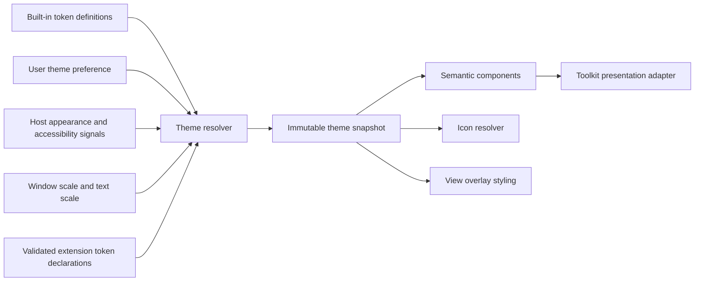
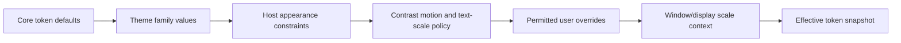
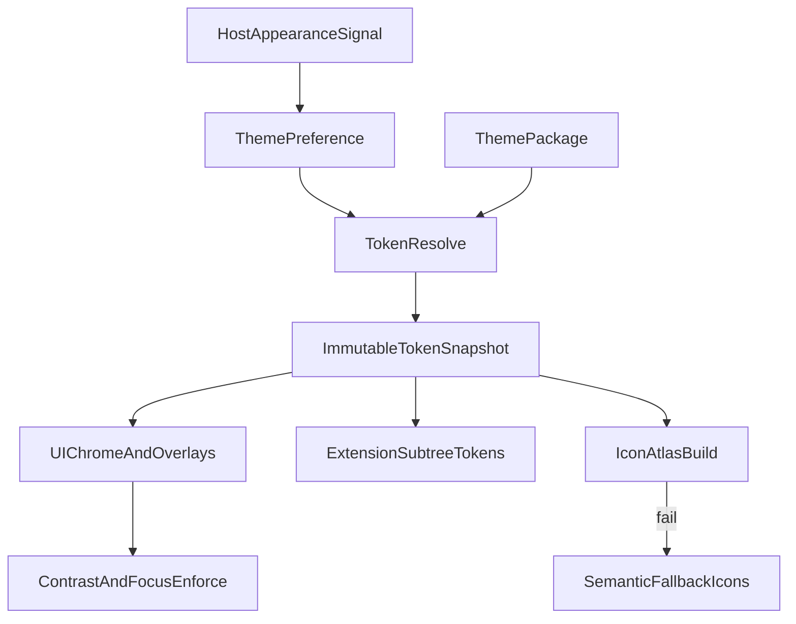

# 25 — Themes

## Overview

PhotoTux themes map semantic presentation roles to visual values without changing document meaning, action identity, command behavior, accessibility semantics, or native host authority. A theme is a versioned set of semantic tokens for surfaces, content, borders, focus, state, selection, tools, canvas chrome, overlays, iconography, typography, density, scaling, and motion. Components consume semantic tokens; they do not hardcode raw colors or infer behavior from color names.

Theme scope is presentation-only. Changing theme, contrast mode, icon set, density, or UI scale does not mark a document modified, enter document history, alter export, change canvas color management, or affect immutable render snapshots except view-overlay presentation parameters. Document colors, working profiles, proofing, sampled pixels, and exported output remain governed by [16 — Color Management](16-Color-Management.md) and [17 — Rendering Engine](17-Rendering-Engine.md).

The host may provide light/dark preference, high-contrast state, accent hints, reduced-motion state, text scaling, and fractional display scale. Linux-native adapters normalize these signals; portable theme core resolves a coherent token snapshot. No UI toolkit, CSS engine, icon library, font stack, runtime, or plugin ABI is selected here. Normative terms follow [Requirement Keywords](Appendix/Requirement-Keywords.md); canonical terms follow the [Glossary](Appendix/Glossary.md).

## Translucent tokens are `#AARRGGBB`

Qt parses an eight-digit hex colour with the **alpha first**; CSS parses the
same string with the alpha last. Five of `Theme.qml`'s washes were written the
CSS way and had shipped that way: the active tool, the selected panel tab and
every accent highlight were drawing a pale green at a quarter opacity instead
of the accent, and `scrimModal` — `#000000B8`, meaning black at 72% — parsed as
alpha `0x00`, so modal dialogs had no scrim behind them at all.

Every translucent token is written alpha-first, and a colour meant to be the
accent at some opacity keeps the accent's own digits so the two can be compared
by eye.

## Responsibilities

The theme subsystem **MUST**:

- define stable semantic token IDs independent of toolkit property names;
- resolve one coherent immutable token snapshot for each presentation context;
- distinguish content hierarchy, interaction state, severity, focus, selection, disabled, busy, invalid, destructive, and trust provenance;
- meet declared text, icon, control, focus, and non-text contrast requirements;
- communicate state through shape, text, icon, pattern, or structure in addition to color where required;
- scale layout, typography, icons, hit targets, borders, handles, and overlays using logical units;
- support host high contrast, text scaling, fractional scale, and reduced motion;
- provide icon names/semantics, mirroring policy, baseline, optical size, and accessible labels;
- keep extension styling within a bounded semantic token namespace;
- validate custom theme packages as untrusted bounded data;
- fall back field-by-field or to a complete built-in theme without making controls inaccessible;
- preserve focus and interaction state across live theme changes;
- keep canvas/document color independent from application theme;
- expose deterministic screenshots/token dumps and accessibility conformance tests.

It **SHOULD** provide built-in dark, light, and high-contrast variants; maintain stable content-first hierarchy with restrained accent use; permit user theme selection and limited local customization; and avoid motion that delays interaction. It **MAY** support additional validated local theme packages and platform-specific native token adaptation, but no extension can replace core semantic meanings.

## Architecture



Theme resolver owns semantic values and precedence. Component library owns token usage contracts. Host adapter translates logical values to toolkit/native presentation. Workspace owns context/window relation. Preferences own user choice. Accessibility policy can override theme values to preserve conformance. Renderer receives only overlay/presentation token snapshot; document graph never receives application theme.

### Internal hierarchy

```text
Theme subsystem
├── core semantic token registry
│   ├── color roles
│   ├── typography roles
│   ├── spacing and geometry roles
│   ├── elevation/separation roles
│   ├── motion roles
│   └── icon roles
├── built-in theme families
├── host appearance adapter
├── user theme preference
├── high-contrast/reduced-motion policies
├── scaling and density resolver
├── immutable token snapshot publisher
├── semantic component contracts
├── icon registry and fallback
├── extension token boundary
├── custom package validator/migration
└── visual/accessibility diagnostics
```

## Semantic Token Model

```rust
struct ThemeTokenDescriptor {
    id: ThemeTokenId,
    value_kind: ThemeValueKind,
    semantic_role: ThemeRole,
    fallback: ThemeTokenId,
    contrast: Optional<ContrastRequirement>,
    scalable: ScalePolicy,
    extension_visibility: ExtensionTokenVisibility,
}

struct ThemeSnapshot {
    theme_id: ThemeId,
    theme_version: ThemeVersion,
    revision: ThemeRevision,
    appearance: AppearanceMode,
    contrast: ContrastMode,
    motion: MotionMode,
    scale: ScaleContext,
    tokens: ImmutableTokenMap,
    icon_generation: IconGeneration,
}
```

Conceptual only. Tokens are stable IDs, not persisted Rust fields. Raw values include color in a declared UI color space, logical length, radius, border width, font role, weight, line height, duration, easing category, opacity, shadow/separation role, and icon reference. Components request tokens by semantic role and state.

Core color token families:

- `surface.application`, `surface.panel`, `surface.raised`, `surface.sunken`, `surface.canvas-chrome`;
- `content.primary`, `content.secondary`, `content.muted`, `content.inverse`;
- `border.subtle`, `border.strong`, `separator`;
- `accent.primary`, `accent.on-primary`, `accent.selection`;
- `focus.ring`, `focus.inner`;
- `state.hover`, `state.pressed`, `state.selected`, `state.disabled`;
- `status.info`, `status.success`, `status.warning`, `status.error`;
- `action.destructive`, `action.destructive-hover`;
- `trust.core`, `trust.extension`, `trust.unverified`;
- `overlay.selection`, `overlay.guide`, `overlay.snap`, `overlay.transform`, `overlay.warning`.

Names describe purpose, not hue. A dark theme may use royal-blue accent, but components never request “blue.” Severity and trust tokens require text/icon/structure companions and cannot make hue the only signal.

## Token Resolution and Precedence

Resolution layers:



Accessibility constraints are not optional styling. A user override that violates required contrast or minimum hit target is rejected or clamped with explanation. Host hints influence values only where descriptor allows; they do not rewrite semantic state. Extension tokens derive from public core extension roles after core resolution.

Every token has fallback chain ending in a built-in complete value. Cycles, missing terminal fallback, wrong value kind, non-finite numbers, unsupported color encoding, and excessive chain depth reject theme. Resolution is deterministic by token ID and explicit precedence; map iteration order does not affect result.

One component render uses one snapshot revision. Live updates publish new snapshot atomically. A window moving between displays may change scale context without changing selected theme family. Old-generation callbacks are discarded.

## Component State Matrix

Every interactive component defines state independently from token choice:

```text
Component states
├── enabled
│   ├── rest
│   ├── hover
│   ├── pressed
│   ├── selected/checked
│   └── focused combinations
├── disabled
├── busy
├── invalid
├── warning
└── destructive
```

Combined states are explicit. Focus must remain visible on selected, pressed, invalid, and high-contrast controls. Disabled content retains enough contrast to be legible while clearly unavailable; opacity-only disabling is not sufficient when it drops text below required contrast. Busy does not erase focus or label. Invalid uses message/icon/border semantics, not red alone. Destructive controls use exact labels and confirmation policy from [26 — Dialogs](26-Dialogs.md), not merely a color.

Components cannot use hover as sole indication or reveal required actions only on hover. Pointer, keyboard, touch, pen, and assistive interaction receive equivalent state. State transition never changes action identity.

## Contrast Requirements

Conformance targets are expressed as measurable ratios and non-color cues. Unless a narrower platform/accessibility standard sets stronger values:

- ordinary text **MUST** reach at least 4.5:1 against its effective background;
- large text **MUST** reach at least 3:1;
- essential icons, control boundaries, selected indicators, focus indicators, graph handles, and meaningful non-text UI **MUST** reach at least 3:1 against adjacent colors;
- disabled controls **SHOULD** remain readable while clearly inactive, with disabled reason available;
- focus ring **MUST** contrast against both component and surrounding surface or use a two-layer ring;
- canvas overlays **MUST** remain discernible over representative light, dark, saturated, textured, and transparent content through dual strokes, patterns, handles, or configurable alternatives.

Ratios are computed after color-space conversion and alpha compositing, not on uncomposited token values. Gradients/images require worst-case or protected backing strategy. High-contrast mode can replace subtle elevation/shadow with explicit borders and remove translucency.

Theme validator evaluates core component/token pairs. Runtime probes can test actual rendered pixels for adapter errors. Contrast failure in optional custom theme rejects affected theme or substitutes conformant fallback; it never silently leaves unreadable controls.

## Typography

Typography tokens describe semantic roles:

- application/body;
- compact control;
- label;
- secondary annotation;
- heading levels;
- monospace technical value;
- canvas measurement;
- status and warning.

Host/native font resolution remains adapter responsibility. Themes may choose among approved families or semantic host font roles, not arbitrary embedded executable/font payload without resource validation. Text must support locale scripts, shaping, bidirectional layout, and fallback defined by [18 — Text Engine](18-Text-Engine.md) where applicable; UI host shaping must meet equivalent behavior.

Font size uses logical units multiplied by user text scale. Components cannot cap text scale by shrinking text to fit. Labels wrap, controls expand, or layout adapts. Line height, weight, and letter spacing preserve readability. Truncation has accessible full name and is avoided for destructive consequences, validation, and critical status.

## Scaling, Density, and Geometry

Theme scale context includes host logical-to-device scale, fractional scale, user UI scale, text scale, input modality, and density preference. Values remain in logical units until host adapter rasterization.

```rust
struct ScaleContext {
    device_scale: RationalScale,
    ui_scale: PositiveScale,
    text_scale: PositiveScale,
    density: DensityMode,
    input: InputModalityClass,
}
```

Rules:

- layout and hit-target sizes use logical units;
- device-pixel snapping occurs at presentation edge with consistent rounding;
- borders remain visible at fractional scales;
- icons select optical size or vector rasterization for final scale;
- pointer/pen hit targets may be compact but keyboard/touch alternatives remain adequate;
- transform handles and overlay controls scale independently from document zoom;
- 200% UI/text scale preserves all named actions through reflow/overflow;
- density cannot reduce targets below accessibility minimum;
- native surface scale changes invalidate presentation resources, not document state.

Theme may provide compact/comfortable spacing sets. Density changes preserve hierarchy, focus order, semantic component IDs, and command geography. They do not create a separate product mode.

A density mode **MUST** drive the layout scale, not only the type scale. The density factor applies to spacing steps, control heights, hit targets, icon boxes, and the fixed chrome extents (tool strip width, dock width, toolbar/status/panel-header heights). Scaling type alone yields larger text inside unchanged chrome, which fails the 200% target above and makes the preference misleading. Corner radii are a fixed visual signature and are exempt.

Chrome extents **MUST** read their density-scaled token rather than repeat a literal, otherwise the mode silently skips whichever surfaces were hardcoded.

This applies equally to geometry **derived from** chrome rather than drawn as chrome: space reserved for a control cluster, hit-area insets that keep a drag surface clear of buttons, and minimum heights held back for stacked panels. A literal reserve is a latent overlap — at a larger density factor the chrome it was sized for outgrows it, and the surface underneath begins swallowing clicks meant for the controls on top. Where the reserve exists to clear a specific item, geometry **SHOULD** measure that item rather than restate its size.

## Iconography

Icons are semantic resources:

```rust
struct IconDescriptor {
    id: IconId,
    meaning: IconMeaning,
    variants: BoundedMap<IconVariant, IconResourceRef>,
    mirroring: MirroringPolicy,
    colorization: IconColorization,
    optical_sizes: BoundedList<LogicalSize>,
    accessible_name_policy: AccessibleNamePolicy,
}
```

Core IDs represent New, Open, Save, Export, Undo, Redo, visibility, lock, mask, warning, destructive action, navigation, disclosure, and tools. Icons do not encode vendor branding or proprietary metaphors. Uncommon, destructive, trust-sensitive, and format-loss actions require visible text in primary dialogs/menus where ambiguity exists. Tooltip is not sole label.

Directional icons mirror in right-to-left contexts when direction is spatial, not when symbol meaning is intrinsic. Text inside icons is avoided. Status icons remain distinct by silhouette in monochrome/high contrast. Disabled icons retain shape. Symbolic icons use semantic foreground tokens; multicolor icons must pass contrast and high-contrast fallback.

Missing extension icon falls back to contribution-type icon plus extension provenance, never blank control. Icon packages are bounded, parsed as untrusted, and cannot contain scripts or external references.

## Canvas and Overlay Boundary

Application theme styles canvas chrome, checkerboard, out-of-canvas area, rulers, guides, grids, handles, selection visualization, cursors, and diagnostic overlays. It does not transform document pixels.

Checkerboard is a transparency cue, not document content. Its colors, cell size, and contrast are configurable within accessible bounds and excluded from export. Selection boundaries use dual-contrast strokes or pattern. Guide/snap colors include width/pattern alternatives. Gamut warning follows color-management criterion but presentation token only controls overlay appearance.

Sampling and pixel inspection read immutable document/render semantic output, not theme-composited screen color unless action explicitly says “sample presented surface,” which is outside ordinary editing. Screenshot of application UI may include theme; document export does not.

Overlay token snapshots carry theme revision, view generation, scale, contrast, and motion. Renderer cache keys separate overlays from document composite. Theme change invalidates overlay/final presentation stages only.

**Shipped tokens — the seven overlay colours.** They lived as hex literals at
their points of use in `Main.qml`, which is a second palette by any other name
and is exactly where Qt's `#AARRGGBB` order is invisible: the crop wash had once
shipped as a pale green fill inside a cyan border because its alpha was read as
the red channel. Each is now named once in `Theme.qml` at the value it already
had — naming them is the whole point, not restyling them.

| Token | Value | Paints |
| --- | --- | --- |
| `canvasGrid` | `#40FFFFFF` | grid lines over the document |
| `canvasGuide` | `#E0FF6A00` | a guide the user placed |
| `canvasSelectionPreview` | `#22000000` | the wash under a marquee being dragged |
| `canvasOutline` | `#000000` | the marching-ants stroke under the white dashes |
| `canvasCropPreview` | `#1F3DAEE9` | the wash over what a crop would keep |
| `checkerLight` / `checkerDark` | `#2A2A2E` / `#222226` | the transparency checkerboard |

`chrome_colours_come_from_the_theme` fails the build on a colour literal
anywhere in `qml/` outside `Theme.qml`. Two sites are excepted by name and are
not chrome: the swatch palette the user paints with, and the fallbacks a shape's
fill and stroke rows show before the layer has one. Both belong to the artwork,
and theming them would change what the file contains.

## Motion and Reduced Motion

Motion tokens define semantic durations for focus transition, popover, panel reflow, progress indeterminate animation, selection visualization, and attention. Motion never delays command acceptance or critical information. Durations are bounded.

Reduced-motion mode:

- removes nonessential spatial movement, parallax, zoom, and animated reflow;
- replaces animated selection boundaries with static high-contrast pattern;
- uses immediate focus/selection state;
- reduces or stops indeterminate movement while preserving busy semantics;
- avoids flashing and rapid luminance changes;
- keeps progress available through text/value updates;
- does not disable cancellation or hide transition completion.

Animation state is ephemeral and never persisted as document/workspace truth. Cancellation or theme change snaps to valid end state. No animation callback performs document mutation.

## Theme Packages and Customization

A theme package contains manifest, token overrides, optional bounded icon resources, compatibility range, and provenance. It cannot contain executable code, shaders, commands, network references, arbitrary fonts, or toolkit stylesheets that bypass semantic validation.

```rust
struct ThemeManifest {
    schema_version: SchemaVersion,
    theme_id: ThemeId,
    version: ThemeVersion,
    base_family: ThemeFamilyId,
    compatible_tokens: VersionRange,
    overrides: BoundedMap<ThemeTokenId, ThemeValue>,
    extension_tokens: BoundedMap<ExtensionThemeTokenId, ThemeValue>,
    icons: BoundedList<IconResourceDeclaration>,
}
```

Validation enforces package bytes, entries, dimensions, path confinement, color finiteness, token kinds, fallback completeness, contrast, icon safety, and no unknown required semantics. Unknown optional tokens are preserved but inactive. Package cannot redefine core token descriptors, component state machine, accessibility thresholds, or action meaning.

User customization may expose a safe subset: theme family, accent within contrast constraints, density, UI scale, checkerboard, guide/selection overlays, and icon size. An advanced raw-token editor, if offered, uses live preview with safe revert and validates before commit. Theme preference mutation follows [24 — Preferences](24-Preferences.md).

## Extension Token Boundary

Extensions cannot invent unbounded global raw colors or inspect toolkit theme internals. Public boundary offers:

- core semantic tokens available read-only;
- extension surface/content/border/accent/state roles derived from current theme;
- bounded contribution-specific chart/data series roles when approved;
- icon foreground/background roles;
- spacing/typography/component tokens;
- explicit request for semantic status type.

Extension-defined custom tokens are namespaced and must map to a declared public semantic base. They cannot shadow core IDs, redefine error/destructive/trust meaning, reduce contrast, or style outside their presentation subtree. Host semantic panel vocabulary applies tokens automatically.

An extension drawing a custom preview receives an immutable theme projection and scale context. It must expose accessible non-visual equivalents. If extension returns raster UI assets, host checks scale variants, transparency, dimensions, and high-contrast fallback.

## Theme Workflows

### Change built-in theme

1. User selects theme in Preferences.
2. Preference command validates availability and captures current focus paths.
3. Resolver builds candidate token snapshot for each active window context.
4. Validator checks token completeness and contrast.
5. Preference transaction commits.
6. New immutable theme revisions publish.
7. Presentation adapters update/reconstruct controls without changing semantic IDs.
8. Focus and active interaction remain or cancel only when adapter cannot preserve them safely.
9. Workspace/document versions remain unchanged.

### Follow host appearance

User preference can be `FollowHost`, `Light`, `Dark`, or named theme. Host appearance generation change updates contexts in FollowHost mode. High contrast and reduced motion are independent accessibility constraints and may apply even under explicit family. Rapid host events coalesce to latest generation.

### Preview custom package

Package is read through a local file capability, parsed as hostile, validated, and loaded into a temporary preview snapshot. Preview applies to one preferences surface/window and provides Apply/Cancel/Revert. It never writes package state or alters all windows before validation. Apply installs package to local resource store and commits preference; cancellation releases resources.

### Device scale change

Moving window changes host scale generation. Resolver rebuilds scale-dependent snapshot, icon raster resources, and overlay metrics. Layout uses logical dimensions and presentation snaps final pixels. Document, history, view zoom, and export remain unchanged.

## Threading, Caches, and Backpressure

Token parsing, package validation, contrast analysis, and icon decoding run on workers over bounded immutable data. Theme resolution is pure and fast. Snapshot publication and control reconstruction occur on presentation authority. No document lock spans theme work.

Caches include resolved snapshots, icon rasterizations, text metrics keyed by font/scale, and component style plans. All are derived and keyed by theme revision, host appearance generation, scale context, contrast, directionality, and adapter behavior version. Device/surface loss discards presentation resources only.

Rapid preference/host/scale events coalesce per window. Old-generation icon loads and screenshot tests are discarded. Queue limits prioritize focused/visible window and critical accessibility changes. Failure to build optional icons uses fallback; it never blocks save/edit.

## Security and Privacy

Theme files are untrusted. Threats include archive traversal, oversized resources, decompression bombs, malformed vectors/fonts/images, external references, scripts, confusing trust visuals, invisible focus, spoofed dialogs, and denial of service.

Defenses:

- strict manifest/archive path and size limits;
- no executable content or external URL fetching;
- hardened icon/image/vector parsers;
- semantic token whitelist and namespace checks;
- mandatory contrast/focus/state conformance;
- protected security/destructive/dialog roles;
- no extension styling outside owned subtree;
- initialized buffers and bounded caches;
- local private package store where appropriate;
- redacted diagnostics.

Theme name/path and custom values are local user data. Diagnostics record IDs, versions, token/error classes, contrast results, and resource sizes—not full local paths or document content. Themes cannot access document pixels.

## Failure, Cancellation, and Recovery

Malformed/incompatible theme is rejected before activation. Missing token uses descriptor fallback; a systemic failure loads complete built-in theme. Contrast failure substitutes conformant built-in token or rejects package with exact pair/ratio. Missing icon uses semantic fallback plus text where required.

Live update failure keeps last complete theme snapshot. Presentation adapter cannot mix arbitrary token revisions within one committed reconstruction; old complete UI may remain while new snapshot prepares. If partial native update occurs, adapter must complete, roll back presentation, or reconstruct from semantic workspace snapshot. Document operations continue.

Custom preview cancellation restores prior snapshot and focus. Cancellation after preference commit is a new preference reversal. Startup crash associated with theme can enter safe-start built-in theme without deleting package/user selection; user may reset or remove it explicitly.

Device loss affects GPU-rendered icons/overlays and rebuilds from snapshot. Host theme service absence uses user choice or built-in default with explicit status only if consequential. Theme store corruption does not affect documents/recovery.

## Persistence, Versioning, and Migration

Preferences persist selected theme ID, follow-host policy, safe user overrides, UI scale/density, motion/contrast choices, and overlay options. Workspace may store bounded per-workspace presentation overrides only where descriptors allow. Documents never embed application theme.

Theme package schemas and semantic token registry have independent versions. Compatible additive tokens use fallback. Removed/renamed token IDs require migration aliases. Changed semantic meaning requires new token ID. Migration validates output and preserves original package until staged replacement.

Built-in themes are immutable per release behavior version. Screenshot baselines identify theme/token/adapter versions and host scale. No serialized toolkit stylesheet or Rust layout is compatibility contract. No stable plugin ABI is implied.

## State and Invariants

- Components consume semantic tokens, not hardcoded raw state colors.
- One presentation subtree uses one coherent theme snapshot revision.
- Theme changes never alter document version, history, save point, or export.
- High contrast/reduced motion constraints override unsafe styling.
- Focus remains visible in every interactive state.
- State and severity are not communicated by color alone.
- Scaling uses logical units and supports fractional device scale.
- Icon meaning is independent of asset filename and localized label.
- Extension tokens cannot shadow or weaken core semantic roles.
- Custom packages contain no executable/network content.
- Derived theme caches can be discarded without user-data loss.
- Missing/invalid theme always has a complete built-in fallback.

## Design Rationale and Alternatives
**Semantic tokens versus component-local colors.** Tokens centralize meaning, consistency, contrast, and live changes. Local values are faster initially but drift and block accessibility.

**Immutable snapshots versus mutable global theme object.** Snapshots provide thread/generation coherence and deterministic tests. Mutable globals create mixed-state frames and stale callbacks.

**Host signals plus app themes versus host-only styling.** Host integration respects desktop preferences while app-specific dense imaging controls need explicit semantics. Adapter keeps both without toolkit lock-in.

**Protected accessibility roles versus unrestricted customization.** Protection limits artistic freedom but prevents invisible focus, spoofed danger states, and unreadable UI.

**Declarative packages versus toolkit stylesheets.** Declarative tokens are portable, bounded, and testable. Stylesheets expose widget internals and can bypass semantic state/accessibility.

**Vector/symbolic icons plus fallbacks versus one raster set.** Scalable resources support fractional scale and high contrast, at parser/render complexity.

## Best Practices

- Name tokens by role, never appearance.
- Test state combinations, not isolated rest controls.
- Compute contrast after compositing.
- Use two-layer focus indicators over variable backgrounds.
- Keep document canvas colors out of application theme.
- Scale handles/icons independently from document zoom.
- Pair warning/destructive/trust colors with labels/icons/structure.
- Keep motion optional and nonblocking.
- Validate custom packages before preview.
- Key caches by complete theme/scale/host generations.
- Preserve semantic IDs and focus through reconstruction.
- Use text with uncommon icons.
- Differential-test host adapters against token dumps.

## Future Extensibility

Future platform hosts, additional built-in families, richer icon sets, color-vision-oriented variants, data-visualization token roles, and validated extension preview components may be added. Each new role **MUST** define semantics, fallback, contrast, states, scaling, motion, persistence, extension visibility, and tests.

Dynamic generated themes, remote theme marketplaces, account synchronization, proprietary branding packs, AI-generated assets, and network-fetched resources are outside scope.

## Testability and Diagnostics

Theme conformance harness renders a canonical component gallery for every state, scale, direction, contrast, and motion mode. It produces deterministic token dumps, accessibility trees, focus paths, and pixel screenshots for adapter comparison. Contrast tests operate on resolved composited colors. Golden screenshots supplement, not replace, semantic assertions.

Test hooks include fake host signals, scale changes, missing tokens/icons, malformed packages, custom overrides, extension panels, device loss, and presentation reconstruction failure. Property tests generate token fallback graphs and assert termination/type consistency.

Diagnostics record theme/token registry versions, snapshot revision, host appearance/scale generations, fallback IDs, contrast pair/ratio, icon resolution, cache use, adapter failure, and update timing. Document pixels and private paths remain excluded.

### Deterministic acceptance scenarios

**Live theme switch:** Focus layer opacity field, switch dark to light, and assert focus/value/action ID preserved, one coherent snapshot per subtree, no document/history/version change, and render document pixels unchanged.

**Contrast rejection:** Load package setting primary text near panel background. Assert measured failure, package not activated or conformant fallback substituted with explicit diagnostic, and UI remains readable.

**Combined states:** Render selected, focused, invalid destructive control. Assert visible focus against selected/background, invalid description and destructive consequence, keyboard operation, and no color-only distinction.

**Fractional scale:** Move window from scale 1 to fractional scale and then 2. Assert logical geometry stable, borders/icons crisp under adapter rounding, hit targets conformant, overlay handles independent from document zoom, and stale icon generation ignored.

**High contrast:** Enable host high contrast while custom theme active. Assert subtle shadows replaced by boundaries, required ratios, symbolic status shapes, focus visible, and custom package cannot override constraints.

**Reduced motion:** Begin panel reflow and animated selection, enable reduced motion. Assert animation cancels to valid final layout, selection uses static cue, focus remains, and no command/document state changes.

**Extension boundary:** Extension requests custom error color and arbitrary global surface token. Assert error maps to protected semantic role, global override rejects, extension subtree remains styled and accessible.

**Malformed icon:** Package contains oversized recursive vector/external reference. Assert rejection under bounds, no network/file read, semantic fallback icon/text appears, and worker remains responsive.

**Device loss:** Lose wgpu device during overlay/icon rendering. Assert token snapshot persists, derived GPU assets rebuild, document/render semantic state unchanged, and CPU/native fallback keeps critical controls usable.

**200% text scale:** Render preferences, export dialog, layer panel, and context menu. Assert no clipped critical labels, logical keyboard access, reflow/overflow, focus ring visibility, and complete action reachability.


## Acceptance Criteria

- Stable semantic tokens cover surface, content, interaction, severity, focus, overlay, icon, typography, geometry, and motion roles.
- Components do not infer semantic state from raw color.
- Required text/non-text/focus contrast is measurable and enforced.
- High contrast, reduced motion, text scaling, and fractional scaling remain coherent.
- Iconography has semantic IDs, fallbacks, mirroring, scaling, and accessible labels.
- Theme/overlay changes never alter document authority or export.
- Extension token boundary cannot shadow core or weaken accessibility/security states.
- Custom packages are bounded, executable-free, local, versioned, and safely recoverable.
- Linux host signals remain behind normalized adapter contracts.
- Token snapshots and tests are deterministic across worker scheduling.
- No cloud, account, AI, proprietary workflow, or unvalidated toolkit/runtime/ABI is required.


## Implementation Conformance Contract

A conforming themes implementation **MUST** publish token registry versions, contrast measurement method, icon resolution rules, motion policy, and custom package envelope versions. Changing resolved colors or metrics that affect required contrast or state discriminability beyond tolerance advances versions and updates the conformance gallery.

Stable semantic tokens cover surface, content, interaction, severity, focus, overlay, icon, typography, geometry, and motion roles. Components **MUST NOT** infer semantic state from raw color alone. Required text, non-text, and focus contrast are measurable on composited colors. High contrast, reduced motion, text scaling, and fractional scaling remain coherent together.

Fixtures **MUST** cover live theme switch with focus preservation, contrast rejection of nonconformant packages, combined selected/focused/invalid/destructive states, fractional and integer scales, host high contrast interaction with custom themes, reduced motion cancellation to valid layout, extension token boundary, malformed icon rejection, wgpu device loss during overlay or icon render, and two-hundred-percent text scale reachability. Diagnostics **SHOULD** record theme and token versions, snapshot revision, host appearance and scale generations, fallback identities, contrast ratios, and adapter failures while excluding document pixels and private paths.

Theme conformance also requires deterministic token dumps independent of worker scheduling, proof that document export pixels ignore UI theme tokens, and package activation atomicity so two themes never mix inside one control subtree mid-switch.

## Operational Edge Cases and Boundary Contracts

Themes map semantic UI roles to concrete metrics without touching document color authority. Edge cases involve contrast enforcement, fractional scaling, overlay separation, custom package validation, and extension token sandboxes.

Missing tokens in a custom package fall back through declared chains: package → built-in theme → hard safety defaults. Fallbacks **MUST** preserve contrast roles for text, focus, and error. A package that omits focus-ring metrics is incomplete; preview rejects or injects safety defaults with warnings. Components never invent semantics from raw hex pairs.

Fractional scale and 200% text scale stress geometry tokens: radii, paddings, scroll gutters, and icon sizes. Clipping of critical labels is a defect; overflow policies (wrap, scroll, elide with access to full text) are mandatory for dialogs and preferences. Canvas overlays use a separate token plane so selection chrome remains visible on both light and dark artwork without recoloring document pixels.

High contrast and forced-colors-like host signals, when present on Linux adapters, map into semantic roles through normalized contracts. The portable core does not embed toolkit theme objects. Reduced motion cancels in-flight UI animations to valid end states without altering commands or documents.

Icon packs may request mirroring for directionality. Decorative icons can mirror; directional affordances follow explicit mirror flags. Malformed vectors, external references, and scripted icons are rejected.

## Failure Modes, Security, and Trust Boundaries

Theme packages are data only: tokens, icons, optional bitmap assets, and metadata. No executable code, no network fetches during apply, no font downloads as a side effect of preview. Size and recursion limits apply to vector icons. Failure to load a package keeps the prior active theme.

Extensions may style their own panels through exposed semantic roles and limited custom tokens under a namespace. They cannot shadow core danger, focus, or privacy-critical roles to weaken visibility. Attempts to set global surface colors from an extension capability fail.

Diagnostics report package IDs, token hit/miss counts, contrast check results, and errors—not necessarily full palette dumps when custom packages may encode branding strings; user-facing names are fine, raw file paths redact.

Device loss during GPU-accelerated icon atlas rebuild falls back to CPU/native pixbufs for critical chrome. Document render device loss is handled by the rendering engine; theme snapshots remain in CPU memory.

## Concurrency, Cancellation, and Consistency

Theme changes publish immutable token snapshots with revision IDs. UI workers rebuild styles asynchronously; late rebuilds for old revisions discard. Rapid theme toggling coalesces to the latest revision. Document export and color-managed canvas proofing ignore UI theme revisions entirely.

Host appearance follow mode listens to adapter signals, debounced, and translates to built-in light/dark/high-contrast packages. Manual user theme selection overrides follow mode until reset. Conflicts resolve by explicit preference scope rules.



## Migration, Compatibility, and Persistence Evolution

Built-in theme IDs are stable. Retired IDs map to successors with recorded migrations. Custom packages declare `compat_version`; incompatible packages open in preview-only repair mode. Token renames carry aliases for at least one release so packages do not hard-break.

Preference stores persist selected theme ID and follow-host flag, not the entire resolved snapshot. Snapshots recompute after migration so contrast rules of the new engine apply.

Icon ID renames similarly alias. Missing icons after upgrade show semantic text labels rather than empty click targets.

## Extended Acceptance Scenarios

**Incomplete package:** Omit focus tokens; preview. Assert warning and safety defaults or reject; no unfocused critical actions.

**Extension shadow deny:** Extension tries to override core error color globally. Assert reject; extension local subtree still styles.

**Reduced motion cut:** Start animated panel; enable reduced motion. Assert final layout valid, no document mutation.

**Scale 200%:** Open preferences and export dialog. Assert critical actions reachable, focus rings visible, no clipped commit buttons.

**Malformed icon:** Recursive vector reference. Assert reject, fallback icon/text, worker healthy.

**Device-loss chrome:** Lose GPU during atlas rebuild. Assert token snapshot remains and critical controls usable via CPU fallback.

**Export independence:** Change UI theme during export. Assert exported pixels unaffected by chrome tokens.

## Overlay, Canvas Chrome, and Proofing Separation

Selection outlines, transform handles, guides, grids, and measurement labels consume overlay tokens, not document paint. Proofing modes that simulate paper or display profiles alter canvas presentation through the color-management engine; themes do not approximate proofing by desaturating UI chrome. When artwork is near white or near black, overlay tokens must still meet non-text contrast against both extremes via dual-tone or halo policies defined in the token set. Split-view and multi-window hosts share theme revisions but may rebuild atlases per scale factor. Printing UI chrome is out of scope for document print/export; only document pixels and vector authorities participate in those pipelines.

## Testing Matrix and Deterministic Visual Contracts

Theme conformance tests pin token snapshots and assert contrast ratios, focus visibility, and icon hit-target minima at 100%, 125%, 150%, and 200% text scale under light, dark, and high-contrast packages. Layout tests run with forced long translations to catch truncation regressions. Motion tests toggle reduced motion during transitions and assert completion states. Extension-panel fixtures verify namespaced tokens cannot read or write core danger roles. Headless runs resolve tokens without opening a display; GPU atlas tests additionally run under device-loss injection. Visual diffs, when used, compare chrome only with document canvas masked out so document color management fixtures do not false-fail on UI theme changes. Any change to safety-default tokens requires updated acceptance evidence before release tagging.

## Packaging, Signing Hints, and Local Trust

Custom theme packages may carry local checksum manifests so users can verify a package was not altered on disk after install. Cryptographic signing is optional and host-defined; the portable core only requires checksum validation when a package declares one. Packages installed from user directories never gain privileges beyond styling. Uninstall removes package files from the theme search path and falls back to the last built-in theme if the active ID disappears, preserving session usability. Duplicate package IDs resolve by explicit user choice recorded in preferences, not by scan order.

## Token Snapshot Pinning for UI Tests

UI integration tests pin theme revision IDs alongside workspace layout fixtures. A test that asserts geometry must also assert the theme revision so chrome padding changes do not masquerade as layout engine regressions. Pins are local artifacts and never require network theme catalogs.

## Cross References

- [00 — Introduction and System Charter](00-Introduction.md) — Linux-native host and deferred toolkit.
- [01 — Information Architecture](01-Information-Architecture.md) — hierarchy, state, progressive disclosure, and accessibility.
- [03 — Workspace System](03-Workspace-System.md) — layout, display changes, and focus restoration.
- [08 — Command System](08-Command-System.md) — preference mutation and immutable publication.
- [10 — Document Model](10-Document-Model.md) — document truth boundary.
- [16 — Color Management](16-Color-Management.md) — document/display color distinction.
- [17 — Rendering Engine](17-Rendering-Engine.md) — overlay separation, frames, and device loss.
- [23 — Plugin SDK](23-Plugin-SDK.md) — semantic extension UI and token capabilities.
- [24 — Preferences](24-Preferences.md) — theme selection, scope, and migration.
- [26 — Dialogs](26-Dialogs.md) — dialog state and destructive presentation.
- [28 — UX Guidelines](28-UX-Guidelines.md) — content-first layout and consistency.
- [29 — Accessibility](29-Accessibility.md) — contrast, focus, motion, and testing.
- [Glossary](Appendix/Glossary.md) — canonical terminology.
- [Requirement Keywords](Appendix/Requirement-Keywords.md) — normative interpretation.
