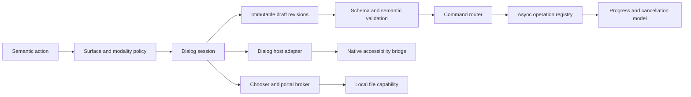
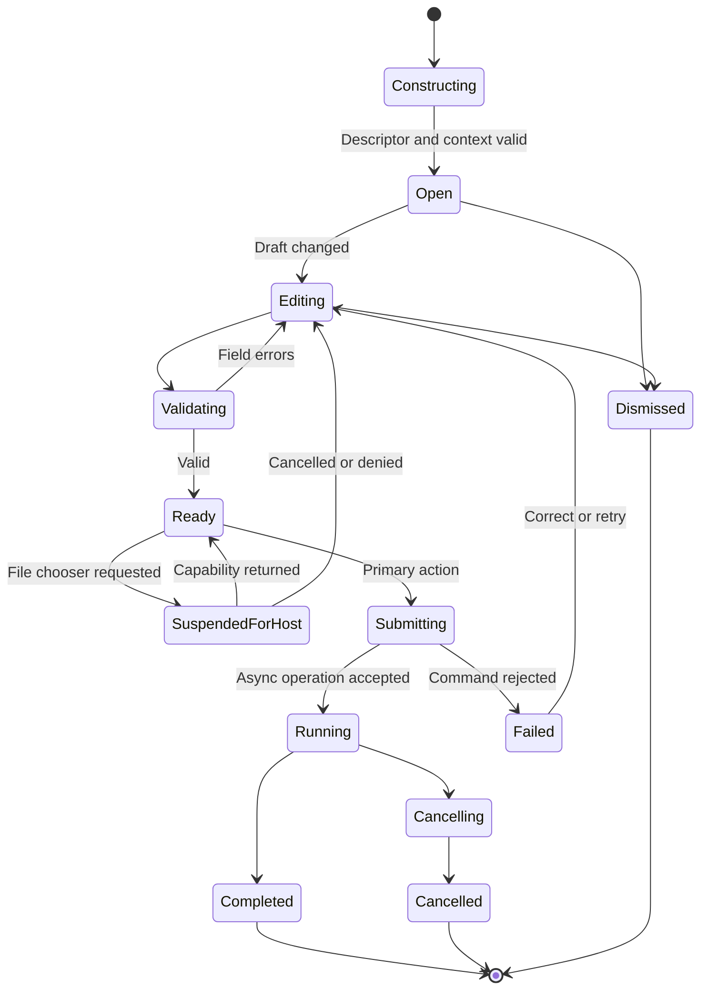
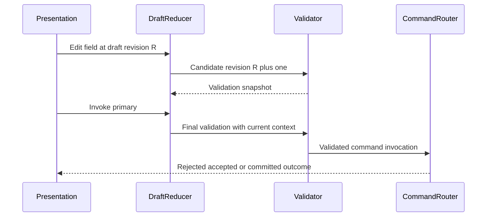
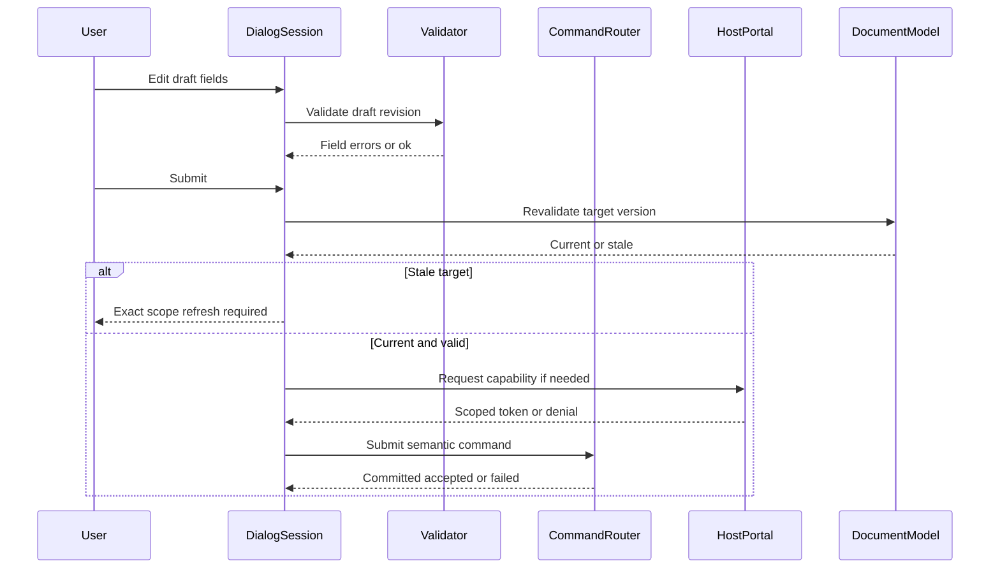

# 26 — Dialogs

## Overview

Dialogs are bounded interaction surfaces for decisions, validated parameter collection, file capability acquisition, destructive confirmation, asynchronous operation setup, progress, and failure recovery. They do not own business logic, document state, history, file paths, or long-running work. A dialog edits an isolated draft, invokes a semantic action or command, observes structured outcomes, and closes or remains available according to explicit policy.

PhotoTux minimizes modality. Persistent panels serve iterative inspection and editing; popovers serve lightweight contextual choices; dialogs serve tasks requiring a coherent parameter set, user decision, or native host mediation before commit. Modal does not mean globally blocking: scope is window, workspace, document, or application, and unrelated documents should remain usable when safety permits.

File choosers and portals are host adapters. Core receives local read/write/replace capabilities, sanitized identity, and typed errors—not toolkit objects or assumed paths. Async work leaves dialog input phase and becomes an operation with progress/cancellation in the shared task model. UI toolkit, dialog library, async runtime, portal implementation, and native plugin ABI remain unvalidated. Normative keywords follow [Requirement Keywords](Appendix/Requirement-Keywords.md); terms follow the [Glossary](Appendix/Glossary.md).

## Responsibilities

The dialog subsystem **MUST**:

- select dialog, panel, popover, inline validation, or task surface according to explicit modality policy;
- maintain isolated versioned drafts until command invocation;
- validate schemas, fields, cross-field constraints, target/version, capability, and consequences;
- route every semantic mutation through [08 — Command System](08-Command-System.md);
- preserve focus, invoking context, keyboard access, and accessibility relationships;
- distinguish primary, secondary, cancel, destructive, and help actions;
- make default action safe and prevent accidental destructive activation;
- support async acceptance, progress handoff, cancellation, failure, retry, and completion;
- obtain files through host chooser/portal capabilities without inventing authority;
- use exact consequence and target scope in destructive confirmations;
- avoid nested modal stacks and UI-thread blocking;
- remain operable at 200% scale, high contrast, reduced motion, keyboard-only, and assistive technology;
- survive target deletion, document closure, host denial, extension unload, and stale async results;
- expose deterministic headless state-machine and semantic-tree tests.

It **SHOULD** keep canvas context visible, use progressive disclosure, validate while preserving user input, consolidate multi-document decisions, and move operations longer than 250 ms into progress/task presentation. It **MAY** use native dialogs where they meet semantics/accessibility; otherwise a host-integrated custom semantic surface is acceptable.

## Architecture



Dialog core owns descriptors, draft state, validation, action semantics, lifecycle, focus restoration hints, and operation handoff. Presentation adapter owns native widgets, window/transient relationship, placement, and visual rendering. File broker owns chooser/portal interaction and capability conversion. Command router and domain authority own state change.

### Internal hierarchy

```text
Dialog subsystem
├── surface/modality policy
├── dialog descriptor registry
├── session registry
│   ├── invoking context snapshot
│   ├── draft revisions
│   ├── validation state
│   ├── focus path
│   └── operation handoff
├── semantic form model
├── validation engine
├── confirmation/consequence engine
├── file chooser and portal broker
├── async progress/task bridge
├── host presentation adapter
├── accessibility/focus coordinator
├── persistence boundary
└── diagnostics/conformance harness
```

## Surface and Modality Policy

Choose surface by task:

- **Inline:** one field or local error resolvable without losing context.
- **Popover:** small contextual choice, no broad consequence, dismissed safely.
- **Panel/inspector:** iterative properties, live preview, repeated comparison.
- **Modeless dialog:** bounded task that can coexist with document work and revalidate target.
- **Window-modal dialog:** decision must resolve before invoking window/document context continues.
- **Application resolution surface:** multi-document shutdown/recovery only when session-wide scope is real.
- **Task/progress surface:** operation already accepted and no more parameters are needed.

Modal scope must be narrowest safe scope. Export for document A does not block document B. A color-conversion parameter dialog may block conflicting mutations to its exact draft/preview target but should not freeze navigation. Preferences are usually modeless or window-scoped and use preference transactions. Error details are not automatically modal.

Nested modal dialogs are prohibited except host-owned subflow that cannot be represented otherwise, such as a native file chooser invoked from an export setup surface. The parent enters `SuspendedForHost` and does not accept actions. A confirmation triggered from another confirmation should be redesigned as one surface with full consequence.

## Dialog Descriptor and Session

```rust
struct DialogDescriptor {
    id: DialogId,
    schema_version: SchemaVersion,
    title: TextKey,
    purpose: TextKey,
    scope: DialogScope,
    modality: ModalityPolicy,
    fields: BoundedFormSchema,
    actions: BoundedList<DialogActionDescriptor>,
    validation: ValidationDescriptor,
    persistence: DraftPersistencePolicy,
    accessibility: DialogAccessibility,
}

struct DialogSession {
    session_id: DialogSessionId,
    descriptor: DialogId,
    phase: DialogPhase,
    invocation: InvocationContextSnapshot,
    base_versions: VersionVector,
    draft: DialogDraft,
    validation: ValidationSnapshot,
    focused_path: SemanticFocusPath,
    operation: Optional<OperationId>,
}
```

Conceptual fields do not freeze toolkit or Rust layout. Session IDs are unique and generation-tagged. Invocation context contains stable window/workspace/view/document/object IDs, action ID, registry generations, and focus return path; it does not retain writable references.

Dialog draft is immutable per revision. Presentation emits semantic edits. Draft reducer validates field shape and publishes new draft/validation snapshot. A dialog cannot bind controls directly to document objects. Live preview uses a version-bound preview service or temporary command state and remains cancelable/non-authoritative.

## Layout Contract

```text
┌───────────────────────────────────────────────────────────┐
│ Title                                               Close │
│ Purpose / exact target summary                            │
├───────────────────────────────────────────────────────────┤
│ Primary fields                                            │
│ Label                 [ value / control                ]   │
│ Label                 [ value / control                ]   │
│                                                           │
│ ▸ Advanced: coherent optional group                       │
│                                                           │
│ Validation / consequence summary                          │
├───────────────────────────────────────────────────────────┤
│ Help/status                     Cancel   Secondary Primary │
└───────────────────────────────────────────────────────────┘
```

Layout rules:

- title names task, not generic “Options”;
- purpose/target identifies document/object/destination scope;
- labels remain visible and programmatically associated;
- related controls form named groups;
- units appear in label/control semantics;
- advanced groups preserve values and expose hidden errors;
- action row order follows host convention while semantic action roles remain stable;
- destructive action is visually and structurally separated;
- resizing/reflow preserves reading/focus order;
- critical consequence is not hidden below initial viewport;
- long content scrolls body, not title/action row, when practical.

Dialogs avoid dense two-column forms when labels/values cannot reflow at 200%. Content-first layout gives primary fields space; explanatory prose remains concise with expandable details.

## State Model



`Submitting` disables duplicate primary activation while preserving Cancel if command can still cancel. If accepted command returns operation ID, policy chooses close-and-handoff or remain as progress surface. Long operations should hand off to task registry so closing dialog does not hide operation.

## Form and Field Contracts

Field types include bounded text, numeric with units, checkbox/toggle, single/multiple choice, file capability selection, color/profile/resource choice, dimensions, coordinates, range, metadata policy, and structured lists. Each field declares:

- stable field ID;
- value schema and default/source;
- visible label and description;
- required/optional state;
- units, range, precision, step, and formatting;
- commit/edit policy;
- dependencies and visibility;
- validation timing;
- error relation;
- sensitivity/privacy class;
- accessibility role/name/value/actions.

Numeric entry preserves user text while parsing; it does not rewrite partial valid input on each keystroke. Locale-aware display and parsing normalize into semantic units. NaN, infinity, overflow, and ambiguous units reject. Sliders have editable numeric alternatives.

Choice controls store stable semantic IDs, never localized labels or list indices. Missing option remains unresolved with explanation. File fields store capability references for session, not plain paths. Password fields are absent because accounts/secrets are outside product scope.

## Validation

Validation layers:

1. field syntax/type;
2. range/unit/finite checks;
3. cross-field constraints;
4. target existence/generation;
5. current action/capability availability;
6. resource/budget feasibility;
7. destructive/conversion consequence;
8. final command validation at execution.

Lightweight validation runs after meaningful edits with debounce where needed. Expensive analysis runs asynchronously over immutable draft/context and carries draft revision. Stale results discard. Primary action is disabled only when invalidity is known; unknown expensive feasibility may allow submit and show validation progress.

Errors identify field, reason, accepted domain, and remedy. Summary links to fields. Hidden group exposes error count and expands/focuses first invalid field. Errors are not cleared merely by focus movement. Warning does not block unless policy requires explicit acceptance. Success messages do not flood.



UI validation is advisory. Domain command always revalidates. A dialog that looked valid may fail after target changes; it remains open with current structured error and preserved draft.

## Primary, Default, Cancel, and Destructive Actions

Every action has semantic role:

- `PrimaryCommit`: performs task;
- `Secondary`: alternate non-destructive outcome;
- `Cancel`: dismisses draft/cancels preparation;
- `DestructiveCommit`: irreversible or editability-losing action;
- `Help`: opens local documentation/context;
- `Retry`: repeats safe failed operation with explicit snapshot policy.

Enter activates default only when focus control does not own Enter and default is safe. Destructive action is never default on dialog open. Space activates focused button, not implicit primary. Escape cancels one interaction layer; it does not cancel a completed commit or close when cancellation would be unsafe without explanation.

Button labels use outcomes: “Export,” “Replace File,” “Discard Changes,” “Apply Mask then Remove,” “Delete 3 Layers.” “OK,” “Yes,” and “Continue” are avoided when consequence matters. Cancel means no new command when still in draft. After operation starts, Cancel means request cancellation and must communicate phase.

## Destructive Confirmation

Confirmation is required when action discards unsaved work, overwrites/replaces external data without recoverable staging, removes editability outside history guarantee, clears history, disables necessary recovery, or grants sensitive extension capability. Routine undoable edits should not prompt.

Confirmation includes:

- exact action and target count/name where privacy/clarity allows;
- what will be lost or replaced;
- whether Undo or recovery can restore it;
- affected document version/destination identity;
- whether operation has already produced external effects;
- safe alternative;
- explicit destructive action and Cancel.

Confirmation token binds command ID, target stable IDs, relevant versions, consequence fingerprint, and expiry. If scope changes, token invalidates and confirmation refreshes. A stale “Delete 3 Layers” cannot delete 4.

Text-entry confirmation is reserved for exceptionally broad irreversible operations, not ordinary deletion. Repeated prompt suppression is allowed only for well-defined undoable/warning classes, never security or unsaved-discard scope without separate preference design.

## File Chooser and Portal Adapters

Core requests file intent:

```rust
struct FileDialogRequest {
    request_id: FileDialogRequestId,
    intent: FileIntent,
    filters: BoundedList<FileFilter>,
    suggested_name: Optional<SafeFileName>,
    initial_location: InitialLocationPolicy,
    multiplicity: SelectionMultiplicity,
    replacement: ReplacementPolicy,
    parent: WindowBinding,
}
```

`FileIntent` includes open readable file(s), select import source, create/replace export destination, Save As editable destination, select local resource, or select directory when truly required. Filters are hints; content validation follows [22 — Import and Export](22-Import-Export.md).

Host returns:

```rust
enum FileDialogOutcome {
    Selected { capabilities: BoundedList<BrokeredFileCapability>, display: BoundedList<SanitizedFileIdentity> },
    Cancelled,
    Denied { reason: HostDenial },
    Unsupported { capability: HostCapability },
    Failed { error: HostDialogError },
}
```

Paths may be absent under portals. Core must not require them. Suggested filename is sanitized and cannot contain separators/control characters. Initial location is policy/hint, not authority. Save/export replacement behavior is performed by persistence coordinator using granted capability, not assumed because chooser returned a name.

Under Wayland, host adapter owns transient-parent relationship and activation. File chooser may be native toolkit or desktop portal. Toolkit objects terminate at adapter. Tests use fake broker.

## Save, Export, and Open Dialogs

Open/import flow selects capabilities, then operation begins outside chooser. Format filters do not determine decoder. Multi-select preserves user order where host provides it, otherwise adapter declares stable order.

Save As differs from Export:

- Save As chooses editable native document destination and establishes identity only after successful durable replacement.
- Save a Copy writes editable representation without changing identity/modified state.
- Export chooses delivery format/options and never clears modified state.

Export setup groups destination, format, dimensions/region, color/profile, alpha/precision, metadata policy, and advanced format options. Capability/loss analysis updates with draft. Unsupported features produce exact conversion report. Destination chooser may occur before or after format options, but commit captures one coherent plan.

Overwrite confirmation belongs host/persistence policy. If native chooser confirms replacement, core still stages safely and handles destination identity changes. It must not show duplicate contradictory prompts unless consequence changed.

### Where a chooser opens (shipped)

`initial_location` is one policy across all four choosers — Open, Save As, Export
and Embed ICC — resolved by `root.browseForFile(dialog)` in `Main.qml` in this
order:

1. the folder of the document that is open, from `AppSession.documentPath`;
2. `root.lastBrowsedFolder`, recorded from `currentFolder` each time any chooser
   is accepted;
3. the writable Pictures location, which seeds `lastBrowsedFolder`.

The folder is *assigned* before `open()` rather than bound, because navigating
inside the chooser writes `currentFolder` and a live binding would drag the user
back out of the folder they had just entered. Each `FileDialog` keeps its own
`currentFolder`, so calling `open()` on one directly reopens wherever *that*
chooser was last used — Open, Save As and Export each remembering somewhere
different, and none of them the document in front of the user.
`every_file_dialog_opens_where_the_user_last_was` in
`crates/phototux-ui/src/chrome_contract.rs` fails the build on a direct
`someFileDialog.open()`.

## Async Progress Dialogs and Task Handoff

Progress model:

```rust
struct OperationProgress {
    operation_id: OperationId,
    phase: OperationPhase,
    completed: Optional<UInt64>,
    total: Optional<UInt64>,
    unit: Optional<ProgressUnit>,
    cancellability: Cancellability,
    status: Text,
    terminal: Optional<OperationOutcomeSummary>,
}
```

Progress is monotonic within phase, rate-limited, and names operation/target generically. Indeterminate state still reports concrete phase. ETA is optional and must not oscillate noisily or be represented as guarantee.

If operation can continue after setup surface closes, it appears in shared task/status region. Closing progress presentation does not cancel unless close action explicitly says Cancel. Application shutdown enumerates operation under [02 — Application Lifecycle](02-Application-Lifecycle.md).

Cancellation remains keyboard reachable. During noninterruptible commit/replace, action changes to disabled “Finishing” with explanation. A cancellation race returns actual terminal state: cancelled-before-commit or committed/completed. Progress never implies command success until authoritative outcome.

## Live Preview Dialogs

Preview applies to filters, transforms, color changes, or export estimates. It reads immutable snapshot and draft revision. It may use wgpu derived resources but never mutates document. Preview identity includes document version, target revisions, draft revision, renderer generation, preference snapshot, and quality.

Rapid edits cancel/coalesce obsolete previews. Preview quality reduction is labeled and final commit uses full declared semantics. Closing/Cancel removes preview and restores committed rendering. Apply submits command with draft and expected versions; final result may differ only according to declared final quality, not hidden parameters.

If target changes externally, preview becomes stale and pauses/rebases only under explicit policy. Dialog displays target-changed status. It cannot silently apply old preview to new selection.

## Keyboard and Focus

On open, focus lands on first invalid/required field, primary content, or safe initial control—not destructive button. Dialog traps focus only while truly modal, including title/body/action row. Modeless dialog participates in window region navigation.

Tab/Shift+Tab move logical fields/actions. Arrow keys operate groups/choices. Enter and Space follow control semantics. Escape unwinds popover/chooser/preview/dialog in order. Access keys/mnemonics may follow host conventions and cannot conflict with text input/IME.

On close, focus returns to invoking semantic path. If gone, nearest surviving ancestor, active canvas, then primary action access. Async completion does not steal focus. Error focus movement happens only on submit or explicit summary activation, not while typing.

## Accessibility Semantics

Dialog exposes role, title, purpose, modal state, parent relation, fields/groups, labels/descriptions, required/invalid state, values/units/ranges, warnings, progress, actions, and live regions. Native accessibility bridge maps semantic model. File portal accessibility is host responsibility, while parent resumes predictably.

Validation errors use `described-by`/equivalent relation. Error summary identifies count and links. Destructive action description states consequence. Progress announcements occur at phase changes and coarse intervals; failed save/export is assertive, ordinary completion polite. Private paths/metadata are not spoken unless user navigates the visible field.

At 200% text/UI scale, action buttons remain reachable, body reflows, critical consequences remain visible, and focus is not clipped. High contrast and reduced motion follow [25 — Themes](25-Themes.md). Dialog does not rely on icon/color alone.

## Persistence and Draft Policy

Dialog sessions and drafts are normally ephemeral. They are not document state, history, workspace persistence, or recovery. Safe “last used” values may be copied through an explicit preference command after successful completion, under [24 — Preferences](24-Preferences.md). A draft cannot silently become default.

File chooser location hints may persist locally under privacy policy, preferably as host tokens or generic location class; reusable presets do not contain private paths. Sensitive metadata/destructive confirmation drafts are not persisted. Application restart does not restore open confirmations, file choosers, gestures, text composition, or transient previews.

Operation records may persist enough local state for cleanup/recovery of staged writes, but not to reconstruct a dialog blindly. Schema/version applies to descriptor and safe presets independently. Unknown extension dialog fields remain bounded and inactive.

## Threading, Concurrency, and Backpressure

Dialog session mutation is serialized on presentation authority. Validation can run on workers over immutable drafts. Host chooser runs asynchronously. Command preparation and file I/O never block UI. Every callback carries session, draft, context, registry, and host generations.

Only latest validation/preview generation applies. Action availability can change while open; submit revalidates. Target deletion, extension unload, document close, preference/theme change, and window destruction produce deterministic session transition.

Queues for validation, preview, chooser, and progress are bounded. Rapid field edits coalesce. Progress updates coalesce by operation. User submit/cancel are never silently dropped. A slow extension validator cannot block core fields; contribution times out and becomes unavailable.

## Security and Trust

Dialogs are security boundaries because they convey permission, overwrite, destructive scope, and extension provenance. Trusted host/core chrome must be distinguishable semantically from extension-provided content. Extensions may request semantic forms through [23 — Plugin SDK](23-Plugin-SDK.md) but cannot impersonate file chooser, permission, save, recovery, or core destructive confirmation.

Threats include clickjacking-like overlays, stale confirmation, path spoofing, Unicode control characters, extension UI spoofing, accidental default destructive action, oversized labels/forms, validation denial of service, and capability leakage.

Defenses:

- host-owned protected security/destructive surfaces;
- sanitized/bidi-isolated file and extension display identities;
- exact stable target/version fingerprints;
- bounded form schemas and text;
- no arbitrary extension widgets/styles;
- capability objects withheld from display/diagnostics;
- activation/focus generation validation;
- no mutation on dialog open/hover;
- staged writes and command revalidation;
- local redacted traces.

## Failure, Cancellation, and Recovery

Descriptor failure prevents opening and leaves invocation state. Presentation failure reports alternate action route when possible. File chooser denial keeps draft and explains host limitation. Portal disconnect returns typed external failure. Invalid target disables commit while preserving draft for retarget/copy when safe.

Command rejection keeps dialog open, maps field errors, and identifies preserved state. Accepted async operation owns its lifecycle even if dialog window closes. Operation failure shows exact failed phase, destination/document safety, retry policy, alternative action, and diagnostic correlation.

Retry never repeats a mutation when commit status is unknown. Core queries command/transaction/destination authority first. A failed export can retry same snapshot only if lease/plan remains valid; otherwise user is told a new snapshot will be used. Failed Save As does not establish identity.

Window loss closes modeless dialogs and cancels drafts/previews; operations already accepted continue according to lifecycle. Modal destruction never implies confirmation. Process recovery never auto-accepts prior dialogs.

## State and Invariants

- Dialog draft is separate from authoritative state.
- Opening, editing, validating, or dismissing a dialog performs no document mutation.
- Primary/destructive submit invokes one semantic action/command.
- Final command validation is authoritative.
- Destructive confirmation binds exact action, target, versions, and consequence.
- File selection returns capabilities, not assumed paths.
- One dialog session has one terminal close outcome.
- Async operation identity outlives presentation when handed off.
- Cancellation before commit leaves no authoritative change.
- Focus remains valid and returns deterministically.
- Modal scope never exceeds actual safety scope.
- No dialog blocks UI thread on I/O, GPU, codec, or extension work.
- Draft persistence is explicit and never cloud-synchronized.

## Design Rationale and Alternatives
**Panels versus dialogs.** Panels preserve iterative canvas context; dialogs enforce bounded validated commit. Policy uses each by task rather than one universal surface.

**Drafts versus direct binding.** Drafts permit cancel, validation, stale detection, and atomic commands. Direct binding leaks partial mutations and breaks history.

**Capability-returning choosers versus path strings.** Capabilities support portals and least authority. Paths are convenient but unavailable/unsafe in many hosts.

**Progress handoff versus modal wait.** Handoff preserves responsiveness and multi-document work. It requires shared task model and clear operation ownership.

**Exact confirmation versus generic warning.** Exact scope prevents stale/desensitized approval. Generic “Are you sure?” is ambiguous.

**Native where conformant versus always custom.** Native dialogs integrate host behavior; semantic custom surfaces cover missing descriptions/dynamic workflows. Adapter boundary allows both.

## Best Practices

- Use narrowest surface and modality.
- Keep one coherent task per dialog.
- Draft first; command on explicit submit.
- Label actions by outcome.
- Never default focus to destructive action.
- Preserve input after validation failure.
- Show exact target and consequences.
- Use host file capabilities, not guessed paths.
- Handoff long work to tasks.
- Revalidate after every async boundary.
- Restore focus semantically.
- Test at 200%, high contrast, reduced motion, keyboard, and screen reader.
- Keep extension content inside semantic bounded forms.

## Future Extensibility

Future local print setup, richer batch operations, additional host portal capabilities, and extension semantic form components may be added. Every new dialog type **MUST** define scope, draft, command mapping, validation, cancellation, focus, accessibility, persistence, trust, and deterministic tests.

Remote account dialogs, cloud selectors, proprietary service authorization, AI prompt surfaces, generative options, and unvalidated toolkit/plugin ABI dependencies are outside scope.

## Testability and Diagnostics

Headless harness executes dialog descriptors and reducers without toolkit. Fake host adapter supports focus, close, scale, file selection, denial, portal disconnect, and window loss. Controlled command router yields committed, accepted, stale, field-error, cancelled, and unknown-outcome cases. Accessibility recorder compares semantic tree/focus/live events.

Diagnostics record dialog/session/descriptor versions, action ID, phase, draft revision, validation codes, target/version changes, chooser outcome class, operation ID, cancellation phase, focus before/after, and timing. Field values, paths, metadata, pixels, and private names are redacted.

### Deterministic acceptance scenarios

**Cancel draft:** Open canvas resize, edit dimensions, preview, press Escape. Assert preview removed, document/history/version unchanged, draft released, and invoking focus restored.

**Hidden invalid field:** Set invalid advanced export option, collapse group, submit. Assert group exposes error, focus can reach field, no operation/destination write begins.

**Stale destructive confirmation:** Confirm deletion of layers A/B at version 10, add C/change selection at 11, then activate. Assert token invalid, refreshed exact scope required, and no deletion.

**File portal denial:** Request Save As, deny portal. Assert document identity/persisted version unchanged, draft remains, error accessible, and no path fallback invents authority.

**Save while editing:** Submit Save As snapshot 20, edit to 21 while progress runs. Assert successful save establishes identity/version 20 but modified remains true, dialog/task reports saved older version.

**Cancel during replacement:** Cancel export before replace and after replace in separate runs. Assert first leaves destination intact; second reports completion, never false rollback.

**Target deletion:** Open layer properties modelessly, delete layer elsewhere, edit draft, submit. Assert stale error, no substitute target, preserved draft can be copied/dismissed, focus safe.

**Extension crash:** Open semantic extension dialog, crash extension validator. Assert bounded timeout, contribution unavailable, host/core dialog remains responsive, no command, and focus restored.

**Keyboard flow:** Open dialog, complete all fields, advanced group, file chooser, error summary, cancel/reopen, and submit using keyboard only. Assert deterministic focus, Enter/Space/Escape semantics, no trap, and exact action.

**Accessibility at scale:** Render destructive, export, preferences, and progress dialogs at 200% high contrast/reduced motion. Assert labels/actions/consequences visible, roles/relations complete, progress rate-limited, and no color-only state.

## Edge Cases and Race Contracts

Dialog sessions sit at the intersection of workspace focus, document versioning, host portals, and command jobs. The following edge cases are normative contracts, not optional polish.

**Multi-document modality.** When a modal dialog binds to document D at version V, activation of another document or view **MUST NOT** retarget the dialog’s draft, preview, or confirmation token. The shell **MAY** prevent focus escape from a narrowly scoped modal; if the host permits switching, the dialog remains attached to D/V and any submit revalidates against that document only. Closing D while its modal is open cancels the session with an accessible explanation; no orphan draft writes into a replacement document that reused a window slot.

**Modeless properties versus selection churn.** A modeless layer-properties dialog opened for object ID L at version V keeps that exact target. Selection changes elsewhere update the workspace but **MUST NOT** silently retarget the open draft. If the UI offers “follow selection,” that mode is an explicit user action that creates a new session generation and discards or parks the previous draft under a clear policy. Late validation results stamped with an older session generation are dropped.

**Nested confirmation during async submit.** Primary submit may open a secondary confirmation (overwrite, color conversion loss, multi-target delete). The secondary confirmation binds the same draft revision and target version token as the primary. If the document mutates while the secondary is open, both layers invalidate together. Escape dismisses only the innermost surface first; dismissing the outer surface after invalidation restores invoking focus and never applies a half-confirmed command.

**Portal disconnect mid-chooser.** If the host file portal disconnects after the user picked a destination but before capability tokens are sealed into the command plan, the dialog reports chooser failure, retains the in-memory draft, and does not invent a path from previously displayed text. A later successful chooser issues a new capability generation; stale generations cannot authorize writes.

**Preview generation races.** Live preview dialogs request render generations keyed by `(dialog_session, draft_revision, document_version)`. Frames arriving for superseded keys are discarded without painting into the dialog surface. Cancel or Escape aborts outstanding preview work and clears any temporary overlay from the active canvas view. Preview never mutates history.

**Shutdown with open dialogs.** Application shutdown walks dialogs from innermost to outermost. Uncommitted drafts never auto-save into documents or preference stores. If a dialog owns an in-flight export that already passed the replace point, shutdown waits for the operation’s declared terminal phase or hands it to the task system with identity preserved; the dialog itself still closes and restores no focus because the shell is exiting.



## Failure Modes and Recovery Mapping

| Failure class | Observable effect | Document/history | Dialog draft | Focus / AT |
| --- | --- | --- | --- | --- |
| Field validation | Inline and summary errors; submit blocked | Unchanged | Preserved | Focus moves to first invalid reachable field |
| Stale target version | Explicit stale error with current scope | Unchanged | Preserved for copy/dismiss | Remains in dialog until dismiss |
| Portal denial | Accessible denial; no invented path | Unchanged | Preserved | Returns to destination field or summary |
| Command reject | Structured outcome codes | Unchanged unless command committed | Policy per outcome | Error live region; focus kept usable |
| Extension validator crash | Contribution unavailable timeout | Unchanged | Core fields kept; extension fields inert | Focus restored to host dialog chrome |
| Progress cancel before replace | Operation cancelled | Prior destination intact | Closed or handed to task UI | Invoking focus restored |
| Progress cancel after replace | Reports completed with identity | New identity as committed | Closed | Task/history reflects actual write |
| Host window loss | Session cancelled | Unchanged | Released | Shell decides next focus; no trap |

Recovery **MUST** be honest: never claim “reverted” when replacement already completed; never claim “saved” when only a staged temp exists; never substitute a different layer, file, or document to make a stale dialog succeed.

## Accessibility and Security Hardening for Dialogs

Dialogs are high-risk for both assistive usability and trust boundary mistakes.

**Accessibility hardening.** Every dialog exposes role `dialog` or `alertdialog` as appropriate, a labelled title, and a described-by relation for consequence text on destructive surfaces. Modality that traps keyboard focus **MUST** still allow host-reserved accessibility shortcuts. Error summaries link to fields; collapsed groups that contain errors expand or otherwise expose a reachable path. Progress dialogs rate-limit announcements and expose a cancellable action with a stable accessible name. File chooser results announce success, denial, or disconnect without dumping full filesystem paths into default speech when privacy policy redacts them; a short destination label and document-relative identity suffice.

**Security hardening.** Dialogs never elevate extension trust. Extension-contributed fields validate inside the host semantic form boundary; free-form markup, arbitrary file paths from extension text, and callback pointers are rejected. Destructive confirmations bind object IDs and versions, not display names alone. Clipboard paste into path-like fields does not grant filesystem authority—only portal/capability outcomes do. Diagnostics omit field values, personal names, and absolute paths unless an explicit local debug fixture opts in.

## Neighboring Subsystem Links

Dialog behavior is incomplete unless these neighbors honor the same contracts:

- **Command System** — submit maps to one semantic command or an explicit command group; dialogs do not bypass validation or history packaging.
- **Document Model** — target identity, version tokens, and save identity are authoritative; dialogs only snapshot and revalidate.
- **Import and Export** — chooser capabilities, staged writes, loss plans, and replacement phases are owned there; dialogs present parameters and outcomes.
- **Preferences** — preference dialogs edit preference drafts, never document pixels; apply rules follow preference transactions.
- **Themes** — dialog chrome, density, contrast, and focus rings consume theme tokens; dialogs do not embed hard-coded greys that break high contrast.
- **Accessibility** — semantic tree, focus restore, and live regions are required for every dialog class listed in this document.
- **Workspace System** — modality, stacking, and invoking-focus memory are shell responsibilities coordinated with dialog session lifecycle.
- **Plugin SDK** — extension forms are descriptors and validators, not free toolkit subtrees with private modality.

## Additional Acceptance Scenarios

**Multi-document retarget refusal:** Open modal export for DocA, attempt to activate DocB, submit export. Assert plan and writes remain DocA-scoped; DocB untouched.

**Follow-selection opt-in:** Open modeless properties for Layer1, change selection to Layer2 without follow mode, edit, submit. Assert Layer1 targeted or stale—not Layer2. Enable follow mode, select Layer3, assert new session generation and Layer3 target after explicit switch.

**Nested overwrite confirm stale:** Submit Save As that requires overwrite confirm; meanwhile another process-equivalent edit bumps document version. Confirm overwrite. Assert stale handling, no write with old token, and refreshed exact consequence text.

**Preview supersession:** Rapidly scrub a resize slider producing revisions R1..R20. Assert at most one visible preview matches latest accepted revision and no R1 frame paints after R20.

**Shutdown after replace:** Start export, pass replace point, begin shutdown. Assert terminal success/failure is recorded for the operation identity and no false “cancelled cleanly” message claiming the prior file remains when it does not.

**Privacy in chooser announce:** Complete Save As to a path under a home directory with redaction enabled. Assert AT announcement uses safe label/identity, not the full absolute path string, while the command still received a valid capability.

**Preference dialog isolation:** Change a theme preference draft and a document layer opacity in separate surfaces. Cancel preference dialog. Assert theme draft discarded, document unchanged by that cancel, and no cross-store write occurred.

**Alertdialog default action:** Open destructive delete confirmation. Assert initial focus is on a safe action (Cancel or review), Enter does not activate delete by default, and Space/Enter on the destructive control still requires that control to be focused.

## Acceptance Criteria

- Surface policy minimizes modality and scopes it narrowly.
- Dialog drafts remain isolated until semantic command submission.
- Validation covers fields, dependencies, target versions, capabilities, and consequences.
- Destructive confirmations bind exact current scope and never default accidentally.
- File chooser/portal adapters return scoped capabilities and tolerate missing paths.
- Async work exposes progress, cancellation, operation identity, and safe task handoff.
- Cancellation and commit/replacement races report actual state.
- Keyboard, focus, high contrast, reduced motion, scaling, and accessibility are complete.
- Host/extension failures preserve documents, history, and prior destinations.
- Dialog state never becomes document/workspace/preference persistence implicitly.
- No UI toolkit/runtime/native ABI is assumed.
- No cloud, account, AI, generative, or proprietary workflow is present.

## Cross References

- [00 — Introduction and System Charter](00-Introduction.md) — host boundaries and failure philosophy.
- [01 — Information Architecture](01-Information-Architecture.md) — progressive disclosure, action placement, and focus.
- [02 — Application Lifecycle](02-Application-Lifecycle.md) — shutdown, save, recovery, and operation lifecycle.
- [03 — Workspace System](03-Workspace-System.md) — focus and presentation authority.
- [07 — Context Menus](07-Context-Menus.md) — action equivalence and exact destructive labels.
- [08 — Command System](08-Command-System.md) — validation, commands, jobs, progress, and cancellation.
- [09 — Shortcut System](09-Shortcut-System.md) — keyboard ownership and Escape behavior.
- [10 — Document Model](10-Document-Model.md) — authority, snapshots, and save identity.
- [16 — Color Management](16-Color-Management.md) — conversion/proof parameter semantics.
- [17 — Rendering Engine](17-Rendering-Engine.md) — preview rendering and immutable state.
- [22 — Import and Export](22-Import-Export.md) — chooser, loss planning, and staged output.
- [23 — Plugin SDK](23-Plugin-SDK.md) — extension semantic forms and trust.
- [24 — Preferences](24-Preferences.md) — preference dialogs and draft/default boundaries.
- [25 — Themes](25-Themes.md) — dialog token/state/scaling requirements.
- [28 — UX Guidelines](28-UX-Guidelines.md) — content-first layout and error language.
- [29 — Accessibility](29-Accessibility.md) — semantic tree, focus, and assistive technology.
- [Glossary](Appendix/Glossary.md) — canonical terminology.
- [Requirement Keywords](Appendix/Requirement-Keywords.md) — normative interpretation.
