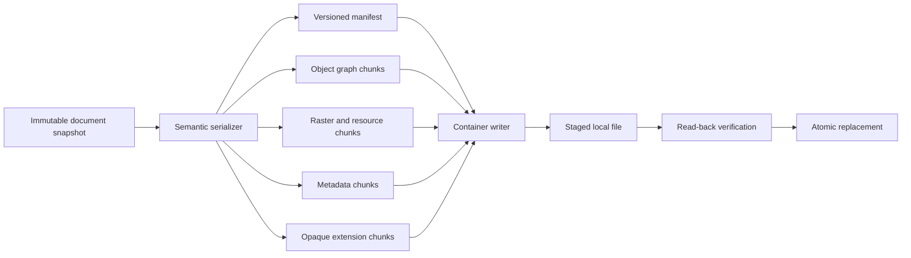
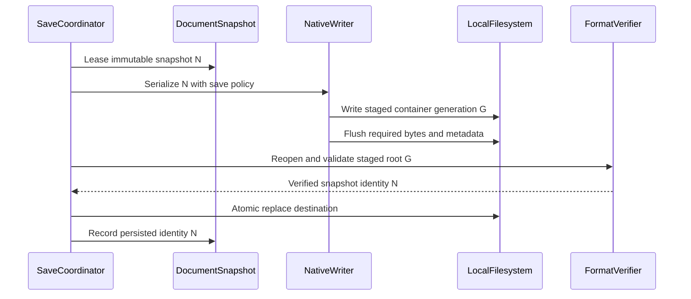
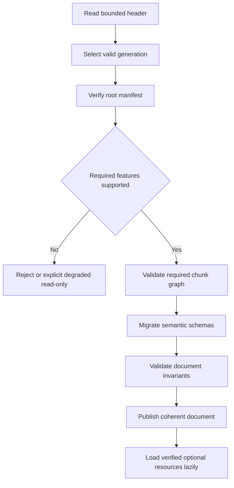
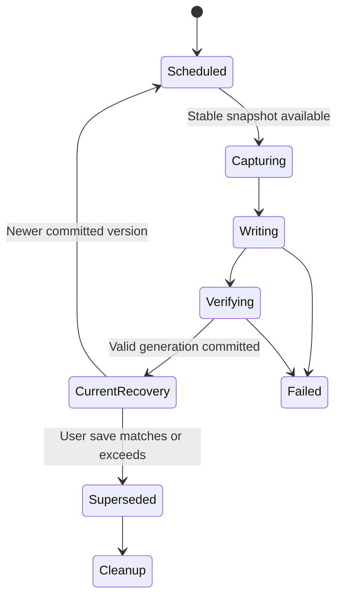
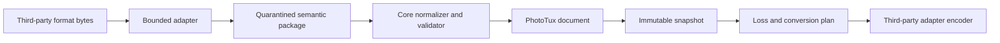
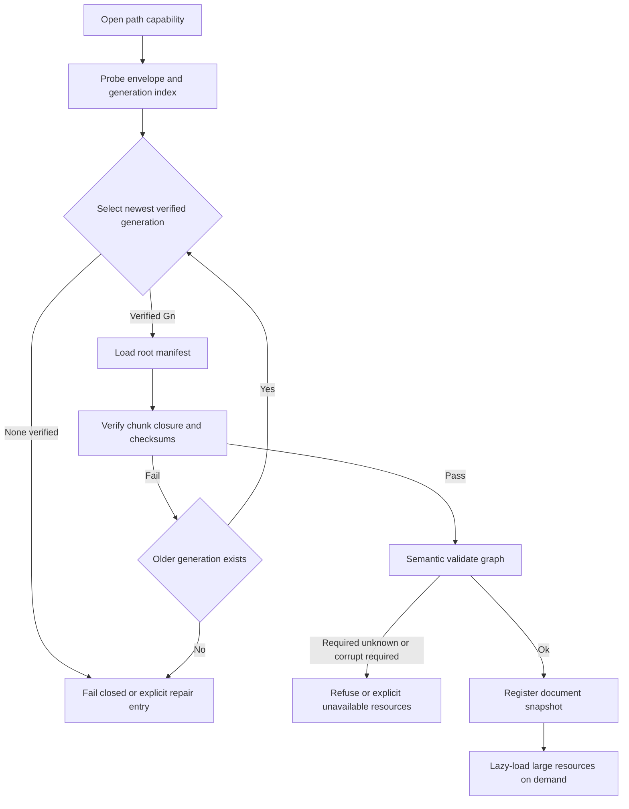

# 27 — File Formats

## Overview

PhotoTux file-format architecture separates the native editable document container from third-party interoperability adapters. The native container’s goal is faithful, recoverable, forward-compatible persistence of document semantics: stable object identity, layer hierarchy, raster resources, masks, effects, text/shapes, profiles, metadata, opaque extension objects, and optional history. It is chunked, versioned, integrity-checked, streamable where practical, and independent from Rust memory layout.

The final native encoding, extension, magic bytes, compression algorithms, database/container library, and random-access strategy remain unvalidated. This specification defines behavior and invariants, not premature byte-level commitment. A prototype must measure representative huge sparse documents, incremental saves, recovery, unknown-data round trips, corruption handling, and cross-platform host constraints before format lock.

Third-party file support remains behind [22 — Import and Export](22-Import-Export.md) adapters. Such formats may lose editability and are never treated as native document stores merely because they can encode images or layers. Interoperability is described generically; no proprietary workflow is copied or required. Normal operation is local-first and excludes cloud storage, accounts, collaboration, AI, generative payloads, and proprietary services. Normative words follow [Requirement Keywords](Appendix/Requirement-Keywords.md); terms follow the [Glossary](Appendix/Glossary.md).

## Responsibilities

The native format **MUST**:

- encode one coherent immutable document snapshot and explicit semantic schema versions;
- preserve stable document/object/resource identities without serializing process pointers;
- support chunked authoritative resources larger than CPU/GPU memory;
- validate all headers, counts, offsets, lengths, graph edges, compression, and checksums as hostile input;
- permit forward-compatible skipping and safe preservation of unknown optional data;
- reject unknown required semantics that would make interpretation unsafe;
- distinguish core manifest, object graph, resources, metadata, extension payloads, history, and recovery information;
- permit staged write and atomic destination replacement;
- detect truncation, torn writes, chunk corruption, and manifest inconsistency;
- retain prior valid generation or recovery information under declared save strategy;
- support autosave/recovery without claiming user-confirmed save;
- define migration independently from in-memory Rust types and plugin ABI;
- keep workspace, view, cache, GPU, host, dialog, and temporary operation state outside the document by default;
- report exact loss when exporting through a third-party adapter.

It **SHOULD** support sparse resources, deduplicated immutable chunks, incremental append/stage strategies, bounded index reconstruction, preview/thumbnail chunks, and partial read for initial coherent display. It **MAY** persist optional history, cached fallbacks for unavailable extension objects, or optimization indexes when each is discardable/validated and privacy policy allows.

## Architecture



Load reverses the flow through bounded container reader, chunk verifier, manifest parser, schema migration, graph/resource validator, and document registration. Container parsing never constructs live objects directly. A validated semantic package enters [10 — Document Model](10-Document-Model.md) only after all required invariants pass.

### Internal hierarchy

```text
File-format subsystem
├── native container envelope
│   ├── signature and format generation
│   ├── feature/compatibility declaration
│   ├── root manifest locator
│   └── integrity/durability markers
├── chunk store
│   ├── semantic object chunks
│   ├── raster tile/chunk data
│   ├── profiles/fonts/resources
│   ├── metadata namespaces
│   ├── extension opaque data
│   ├── optional history/checkpoints
│   └── optional previews/indexes
├── manifest and reference graph
├── reader/validator
├── writer/staging coordinator
├── compression/checksum services
├── migration/compatibility adapters
├── autosave/recovery bridge
├── third-party format adapter boundary
└── corruption diagnostics/repair planner
```

## Native Container Goals

The format must optimize for:

1. document fidelity and unknown-data preservation;
2. crash-safe staged saves;
3. large sparse raster access;
4. deterministic validation and migration;
5. corruption localization;
6. future schema growth;
7. bounded memory;
8. portable core semantics;
9. local inspectability and diagnostics;
10. no dependency on network or application account.

Byte-level simplicity is valuable but subordinate to integrity. A monolithic serialized object graph is rejected because one length error can invalidate everything, huge rasters require full materialization, unknown fields become difficult to preserve, and incremental saves are expensive.

## Container Envelope

Conceptual envelope:

```rust
struct ContainerHeader {
    signature: FixedSignature,
    container_version: ContainerVersion,
    feature_set: FeatureSet,
    generation: ContainerGeneration,
    root_manifest: ChunkLocator,
    previous_manifest: Optional<ChunkLocator>,
    limits_hint: ContainerLimitsHint,
    header_integrity: IntegrityCode,
}

struct ChunkHeader {
    chunk_id: ChunkId,
    kind: ChunkKind,
    schema_version: SchemaVersion,
    flags: ChunkFlags,
    encoded_length: UInt64,
    decoded_length: UInt64,
    compression: CompressionId,
    payload_integrity: IntegrityCode,
}
```

Conceptual only. Exact integer widths, endianness, alignment, header duplication, checksum algorithm, and locator representation are deferred. Readers must determine byte order from fixed format rule, never host architecture. Headers have fixed bounded parse prefix before variable allocation.

Container generation identifies one committed manifest set within a file, not document version. A save of document snapshot N can produce container generation G. Incremental strategies may retain previous generation G−1 until G verifies. Root manifest references every required semantic root and declares the exact document snapshot/persistence fingerprint encoded.

## Chunk Taxonomy

Required semantic chunk classes:

- document manifest and properties;
- object index/records and containment ordering;
- authoritative raster manifests and data chunks;
- selection/mask channels;
- profiles and other embedded resources;
- metadata namespace records;
- required extension-object envelopes;
- compatibility/behavior declarations.

Optional classes:

- history timeline/checkpoints;
- recovery transaction tail;
- preview/thumbnail;
- search/index acceleration;
- deduplication catalog;
- cached fallback for unavailable object;
- writer diagnostics stripped from normal distribution.

Optional means a reader can skip it without changing current document meaning. A chunk with unknown kind must declare required/optional at envelope/manifest. Unknown required chunk rejects open. Unknown optional chunk may be preserved opaque if size, identity, references, and integrity validate.

Chunk boundaries localize corruption and allow streaming. Chunk size policy is provisional and may vary by resource class. Tiny chunks increase index/seek overhead; huge chunks worsen random access/recovery. Raster storage chunks may group tiles while retaining tile-addressable manifests.

## Manifest and Reference Graph

Root manifest defines:

```rust
struct DocumentManifest {
    manifest_schema: SchemaVersion,
    document_id: PersistedDocumentId,
    persisted_snapshot: PersistedSnapshotIdentity,
    properties: ChunkRef,
    object_root: ChunkRef,
    object_index: ChunkRef,
    resource_index: ChunkRef,
    metadata_index: Optional<ChunkRef>,
    extension_index: Optional<ChunkRef>,
    history_root: Optional<ChunkRef>,
    preview_root: Optional<ChunkRef>,
    required_features: BoundedSet<FeatureId>,
    optional_features: BoundedSet<FeatureId>,
}
```

Every reference includes expected chunk kind, schema compatibility, decoded length bound, and integrity identity. References form a directed graph. Reader validates:

- all required locators in file bounds;
- no arithmetic overflow;
- no forbidden overlap;
- chunk ID uniqueness;
- expected kind/schema/length match;
- decoded/encoded size budgets;
- reference graph depth/count;
- cycles only in explicitly permitted non-containment relation class;
- one object containment parent;
- resource ownership and sharing policy;
- no reference from current authority to discarded/incomplete generation.

Manifest ordering is canonical for deterministic save/test output where byte determinism is promised. Semantic ordering follows layer/object order, not random IDs or hash iteration.

## Stable Identity Encoding

Persisted document/object/resource IDs are opaque stable values with canonical encoding. They are not array positions, file offsets, names, paths, memory addresses, or hashes alone. Reordering changes order records, not identity. Deleted IDs are not reused within document lifetime.

On open, runtime may retain persisted IDs directly when valid and collision-safe. Duplicate IDs, wrong-kind references, and ambiguous ownership reject before visibility or undergo a documented deterministic import remap only when opening as third-party import, not when claiming native fidelity.

Content digests support integrity/deduplication but do not replace semantic identity. Two independently editable resources with same bytes can remain distinct. A digest collision cannot substitute bytes without full integrity verification.

## Raster and Large Resource Storage

Raster resources use semantic manifests:

```rust
struct RasterManifest {
    resource_id: ResourceId,
    schema_version: SchemaVersion,
    extent: PixelExtent,
    tile_geometry: TileGeometryDescriptor,
    sample: SampleFormat,
    channels: ChannelLayout,
    color: ColorSpaceRef,
    alpha: AlphaConvention,
    sparse_default: SparseDefault,
    entries: BoundedTileIndex,
}
```

Exact tile geometry remains deferred. Each entry maps logical tile coordinate/plane/level to verified chunk reference and valid edge rectangle. Missing entry has explicit sparse default, never undefined bytes. Compression applies per bounded chunk/group to avoid full-image decompression.

Reader can materialize visible tiles lazily after manifest and document minimum coherent state validate. Lazy bytes remain trusted only after per-chunk verification. Decoded caches and wgpu textures are derived and never persisted as authoritative. Endianness/sample conversion, row stride, premultiplication, hidden colors, and profile references are explicit.

Large fonts, profiles, gradients, patterns, vector data, and extension payloads use equivalent bounded resource envelopes. External references are descriptors, not automatically opened paths; host capability/user resolution is required.

## Checksums and Integrity

Integrity has layers:

- fixed header integrity detects torn/garbled envelope;
- each chunk protects exact encoded or canonical decoded bytes according to algorithm contract;
- manifest protects ordered semantic references and feature declarations;
- optional whole-generation digest can support complete verification;
- staged writer read-back verifies new root and required chunks before replacement.

Checksum algorithm must resist accidental corruption; hostile substitution at a trust boundary may require cryptographic digest. Algorithm IDs are versioned and non-negotiable per chunk. Unsupported required integrity algorithm rejects.

Checksums do not prove semantic validity. A perfectly checksummed cyclic layer graph remains invalid. Reader validates both bytes and semantics. Integrity failure identifies chunk/resource scope but diagnostics do not expose content.

## Save Workflow



Writer captures one snapshot. It may reuse verified immutable chunks from prior file/cache only when complete semantic identity, bytes, integrity, and durability are proven. It cannot reference source chunks that destination replacement will make unavailable unless copied/retained in valid generation.

Staged file is created with safe permissions and non-colliding identity. Writer serializes required chunks, manifests, then commit envelope/root according to selected container strategy. Flush/durability stages are explicit. Read-back verifier uses reader path, not writer’s in-memory assumptions.

Only after successful replacement does document authority accept persisted version/fingerprint. If newer edits exist, modified remains true. Save a Copy does not change identity. Export never invokes native persisted-state update.

## Incremental Save Alternatives

Three strategies remain candidates:

1. **Complete rewrite:** simplest validation and compact output; expensive for large unchanged documents.
2. **Append generation then compact later:** fast changed-chunk saves and prior-generation fallback; file growth and complex crash recovery.
3. **External staging with chunk reuse/copy-on-write container:** balances replacement and reuse; depends on filesystem/container capabilities.

No strategy is selected without measurement. All conform to:

- destination generation is self-contained under declared external-reference policy;
- previous valid file remains until new generation verifies/replaces;
- interrupted save yields old valid or new valid state, not an accepted half generation;
- compaction is staged and independently verifiable;
- space accounting and temporary requirements are visible;
- symlink/replacement policy is host-mediated.

An in-place overwrite of unique authoritative chunks without recoverable generation is prohibited.

## Load Workflow and Minimum Coherent State

1. acquire local read capability and stable source snapshot;
2. parse fixed header under minimum bounds;
3. select newest complete supported generation deterministically;
4. validate root manifest integrity and feature compatibility;
5. enumerate required chunk graph under limits;
6. verify required structural chunks;
7. migrate semantic schemas into quarantine representation;
8. validate object/resource/metadata invariants;
9. create immutable authoritative root and initial snapshot;
10. atomically register document;
11. lazily materialize verified noncritical resources/previews.



The minimum coherent state includes complete document properties, object containment/reference graph, authoritative resource manifests, required profiles, unknown-required decisions, and all data needed to avoid false interpretation. A thumbnail alone is never a document.

## Forward and Backward Compatibility

Compatibility uses feature declarations plus per-chunk schema versions:

- older reader can skip/preserve unknown optional chunks;
- older reader rejects unknown required feature;
- newer reader migrates known older semantics;
- newer writer may preserve unknown opaque chunks from newer source when unchanged and safe;
- editing an unknown object is disallowed unless fallback contract permits specific generic operations;
- save warns/rejects if selected operation would invalidate preserved unknown data.

Unknown preservation envelope records original bytes/chunk identity, schema, required/optional class, references, and bounds. It cannot contain unchecked references to new writer offsets. Writer relocates opaque chunks while preserving payload and updates only outer validated locators.

Forward compatibility is not “ignore fields.” Unknown semantics affecting compositing, color, containment, transforms, history, or required resources can make the whole document unsafe to edit. Such files open read-only/degraded with explicit capability or reject.

## Migration

Migration is semantic, not byte-casting:

```rust
interface DocumentMigration {
    source_schema() -> SchemaVersion;
    destination_schema() -> SchemaVersion;
    required_features() -> FeatureSet;
    migrate(input: ImmutableSemanticPackage, limits: MigrationLimits) -> Result<ImmutableSemanticPackage, MigrationError>;
}
```

Migrations run in ordered explicit chain over quarantined immutable packages/builders. They use checked budgets, deterministic IDs/order, cancellation, and no host/network access. Original file remains untouched until user saves migrated document. Opening migration does not silently replace source.

Changes requiring behavior version include blend equations, color/alpha interpretation, coordinate conventions, text shaping assumptions, filter behavior, object containment, metadata semantics, and history inverse representation. Pure syntactic re-encoding may retain semantic version.

Migration tests use golden old-version corpus and semantic comparisons. A failed optional history migration may open current state without history only if format declares history optional and user receives exact warning. Failed required object migration rejects.

## Unknown Data Preservation

Opaque preservation is allowed when core can verify:

- bounded envelope and payload length;
- integrity;
- stable owner/object/resource relation;
- no influence on unvalidated core invariant;
- no executable/capability semantics;
- safe relocation/round-trip;
- missing implementation fallback behavior.

Document snapshot retains opaque chunk/resource lease. Copy/paste/import maps owner identity according to extension contract. Save includes opaque bytes unchanged unless user invokes explicit destructive conversion. Export through third-party adapters can omit unknown data only after loss report.

Removing unknown object is possible through a generic delete command if containment/lifetime is understood. Reordering may be allowed if compositing fallback defines it. Editing payload is not.

## Autosave and Recovery

Autosave is recovery persistence, not user save. It captures coherent committed versions on local schedule and stores either:

- complete recovery container;
- verified checkpoint plus committed transaction tail;
- native changed chunks with recovery-only root;
- another validated scheme meeting same invariants.

Recovery records include document/recovery identity, base persisted fingerprint when known, captured version, schema/features, checksums, timestamp, and retention policy. They use private local permissions and staged updates. Uncommitted previews/dialog drafts/gestures are excluded.



Startup validates recovery independently from source. It never overwrites original automatically. Recovered content opens with provenance and modified state. Corrupt newest recovery may fall back to verified older generation with disclosed lost range. Retention cleanup occurs only after durable facts.

Autosave frequency/budget comes from [24 — Preferences](24-Preferences.md), but format semantics remain fixed. A no-writable-state condition shows persistent warning and never claims recovery protection.

## Corruption Handling and Repair

Corruption classes:

- header/root damage;
- incomplete newest generation;
- individual optional chunk damage;
- required structural chunk damage;
- raster/resource chunk damage;
- checksum mismatch;
- graph/reference invariant failure;
- unsupported required feature;
- migration failure.

Reader selects newest fully committed root; incomplete newest generation can fall back to previous valid root without calling it newest. Optional preview/index corruption is discarded/rebuilt. Optional metadata may be quarantined with warning if isolation is proven. Required object/resource corruption prevents normal editable open.

Repair is explicit and never fabricates silent data. A repair planner may:

- use verified previous generation;
- use verified recovery checkpoint;
- omit optional corrupt chunk;
- replace missing derived preview/index;
- isolate one corrupt layer/resource into an explicit unavailable representation if containment and fallback are safe;
- open read-only inspectable structure;
- produce Save Recovered Copy.

Every repair states source, lost chunks/features, affected objects/regions, confidence, and resulting modified/provenance state. Repair command creates new authoritative document/transaction where applicable. Original remains untouched.

## Third-Party Adapter Boundary

Native reader/writer is a privileged core persistence implementation with full conformance obligations. Third-party formats enter format-neutral import/export adapters:



Adapters never bypass commands, graph validation, color policy, metadata policy, or staged writes. A format that cannot retain PhotoTux semantics is an export target, not Save target. An extension codec follows [23 — Plugin SDK](23-Plugin-SDK.md) isolation and permissions.

MIME/extension lists are hints. Content probe decides adapter. Unsupported structure is preserved/converted/rejected explicitly. No third-party adapter can insert executable data, native object layouts, or plugin callbacks into native documents.

## Metadata

Native metadata namespaces record schema, owner, editability, privacy, encoding, and limits. Core technical values such as dimensions/profile are in semantic manifest, not duplicated ambiguously. Descriptive metadata is separate. Import provenance is bounded and sanitized. Export presets may be document properties only when explicitly intended.

Paths, usernames, recent items, recovery locations, capability tokens, workspace layout, diagnostics, and caches are excluded. External reference descriptors avoid ambient paths where possible and require resolution capability. Opaque third-party metadata can round-trip if safe but cannot control allocation, code, or file access.

## Compression and Deduplication

Compression is per chunk/resource class and identified by stable algorithm/behavior version. Decoder validates encoded/decoded lengths and ratio before allocation. Unsupported required compression rejects. Compression library version is not semantic unless output/compatibility depends on it.

Deduplication may reuse immutable chunks by verified digest and semantic descriptor. Writer must ensure destination self-containment/durability. A process cache is not authoritative source. Shared chunk accounting distinguishes logical and physical bytes. Encryption is not defined; user should rely on local filesystem/storage security. Adding document-level encryption would require separate key, recovery, threat, metadata, and compatibility design.

## Threading, Streaming, and Backpressure

Reader/writer operate on bounded workers and I/O coordinator. Document authority provides immutable snapshots. Structural parsing/migration and chunk decompression run outside document locks. wgpu is irrelevant to native authority; previews may use renderer after registration.

Streaming readers request bounded chunks and pause under memory pressure. Lazy resource fetch carries file capability generation and document snapshot identity. If source changes externally, reader rejects incoherent reads unless capability guarantees stable file snapshot.

Writer queues chunk serialization/compression with deterministic output ordering. Backpressure limits outstanding buffers and disk writes. Save/recovery have reserved capacity over thumbnails/indexes. Cancellation before replacement releases temporary state. Channels are bounded.

## Security and Privacy

Threats include oversized headers, integer overflow, offset overlap, decompression bombs, graph cycles, duplicate IDs, malicious profiles/fonts/vectors, extension payloads, path traversal, symlink replacement, special files, checksummed hostile semantics, and parser exploitation.

Defenses:

- fixed bounded first parse;
- checked arithmetic everywhere;
- file/decoded/object/depth/ratio limits;
- per-chunk and manifest integrity;
- semantic graph validation;
- hardened resource parsers;
- no executable/shader/callback payload;
- host-scoped read/replace capabilities;
- private staged/recovery files;
- process isolation for optional third-party codecs;
- no network resolution;
- redacted diagnostics;
- fuzz and malformed corpus.

Document data is private. Thumbnails/previews can reveal content and are optional, access-restricted, and excluded from diagnostics. Recovery/history can contain prior sensitive states; retention and cleanup are explicit.

## Failure and Cancellation

Load cancellation before registration publishes nothing. Lazy optional load cancellation leaves document valid with pending/unavailable derived data. Required lazy chunk failure transitions affected document/resource to explicit degraded state; it cannot substitute arbitrary bytes.

Save cancellation before manifest commit/replacement leaves old destination. Cancellation after replacement reports success. Compression worker crash abandons staged generation. Read-back verification failure blocks replace. Persistence notification failure after replace does not invalidate file; document resynchronizes persisted-state update from save receipt.

Disk full preserves original under staging. Permission loss yields typed error. Cleanup failure quarantines temporary file under bounded policy. Repeated autosave failure shows durability warning while editing remains possible.

## State and Invariants

- One committed root manifest identifies one coherent encoded snapshot.
- Required references resolve to verified compatible chunks.
- Unknown required semantics never load as if understood.
- Unknown safe optional data survives lossless round trips.
- Stable IDs never derive from positions/offsets.
- Raster chunks declare extent, precision, color, alpha, and sparse defaults.
- Old destination remains valid until new staged representation verifies/replaces.
- Autosave/recovery never claims user-confirmed save.
- Workspace, GPU, caches, dialogs, and host handles are excluded from document.
- Native schema and Rust layout are independent.
- Third-party codecs never mutate live documents directly.
- Corruption recovery is explicit and never silently fabricates content.
- Normal persistence requires no network/account.

## Design Rationale and Alternatives
**Chunked container versus monolithic graph.** Chunks enable large data, localization, lazy access, unknown preservation, and incremental strategies. They add index/reference complexity.

**Manifest generations versus in-place overwrite.** Generations permit crash selection/fallback. In-place writes are space-efficient but risk irreplaceable corruption.

**Checksums per chunk versus whole-file only.** Per-chunk checksums localize damage and support reuse. Whole-generation digest can supplement complete verification.

**Opaque preservation versus reject all unknown.** Preservation improves forward compatibility. Required invariant-bearing unknowns still reject.

**Native fidelity versus using a common interchange format.** A native format can encode transaction-friendly editing semantics. Generic interchange formats are valuable adapters but cannot be assumed to preserve all structure.

**Optional history versus mandatory history.** Optional history controls size/privacy and keeps current state portable. Mandatory history increases document size and compatibility burden.

**Complete rewrite versus append/incremental.** Rewrite is simple and compact; incremental is faster for huge sparse documents. Measurement must decide implementation.

## Best Practices

- Parse bounded envelope before allocation.
- Separate byte integrity from semantic validity.
- Keep semantic IDs independent from offsets.
- Make every chunk self-describing enough for safe bounds.
- Verify staged output through reader path.
- Preserve old valid generation until replacement.
- Treat previews/indexes as discardable.
- Keep profiles/fonts/extension data under specialized validators.
- Test unknown optional and required features.
- Make repair explicit and Save Recovered Copy safe.
- Stream large raster resources.
- Never persist GPU/toolkit/runtime objects.
- Record behavior versions for semantic changes.

## Future Extensibility

Future schema versions may add object kinds, animation data, richer metadata, additional resource compression, visible branch history, or alternate chunk indexes. Each addition **MUST** declare required/optional semantics, bounds, migration, unknown preservation, checksums, recovery, security, accessibility impact, and fixtures.

Final container choice and byte format require spike evidence. Stable public format promises begin only after corpus, independent reader, fuzzing, migration, huge-document, crash, and forward-compatibility evidence exist. Nothing here promises native plugin ABI.

## Testability and Diagnostics

Headless format harness writes deterministic semantic fixtures, reopens them, compares document snapshots, and fault-injects every byte/write/flush/replace phase. Corpus includes every historical schema, unknown optional/required chunks, sparse huge rasters, extension objects, optional history, profiles/fonts, and corruption.

Diagnostics record container/schema/generation, manifest/chunk counts and kinds, encoded/decoded bytes, integrity outcomes, migration steps, lazy loads, save/recovery version, staged durability phase, fallback/repair choice, and error codes. It omits pixels, thumbnails, text, metadata values, names, and paths.

### Deterministic acceptance scenarios

**Round trip:** Create layered document with masks, profiles, sparse tiles, metadata, and safe opaque extension object. Save/reopen. Assert semantic IDs/order/resources/color and opaque bytes preserved; workspace/view state absent.

**Concurrent save:** Save snapshot 30 while editing to 31. Assert file reopens as 30, document persisted version 30/current 31, modified true, and no chunks from 31 referenced.

**Torn newest generation:** Build valid G1 and interrupted G2 with bad root integrity. Assert reader selects G1, reports incomplete G2, and never exposes mixed chunks.

**Corrupt optional preview:** Damage preview chunk. Assert document opens faithfully, preview rebuilds, diagnostic local, and modified state unchanged.

**Corrupt required raster:** Damage referenced authoritative tile. Assert normal editable open refuses or creates explicit unavailable resource under declared repair policy; no zero-filled silent substitution.

**Unknown features:** Add unknown optional chunk and unknown required feature in separate fixtures. Assert optional bytes round-trip unchanged; required fixture rejects/degrades explicitly.

**Decompression bomb:** Chunk declares tiny encoded and enormous decoded size/ratio. Assert limit rejection before allocation, no document registration, bounded worker/diagnostic.

**Migration:** Open old blend/coordinate schema. Assert deterministic semantic migration, original untouched, new save uses current schema, output matches compatibility fixture.

**Autosave recovery:** Save source version 10, recovery 14, corrupt recovery 15. Assert startup offers 14 with provenance/modified state, original untouched, and does not claim version 15.

**Disk full:** Fail staged save before root completion and during flush. Assert original destination valid in both, temporary cleanup bounded, and no persisted-state advance.

**ID stability:** Reorder objects and save. Assert object IDs unchanged, order records changed, async references still target correct objects, and no offset-based identity.

## Edge Cases and Byte-Level Contracts

Native format correctness is defined at the byte and reference-graph level. The following edge cases are required contracts for readers, writers, and repair tools.

**Sparse hole versus explicit zero tile.** A missing tile reference in a sparse raster means “no authoritative samples in that region,” not “allocate and fill with zeros.” Readers that materialize holes for editing **MUST** do so under an explicit edit policy and mark the document modified only when those samples become authoritative. Silent zero-fill that later saves as dense data is a semantic corruption of sparsity.

**Duplicate chunk IDs across generations.** Generations G1 and G2 may reuse physical storage for unchanged chunks, but each generation’s manifest **MUST** name a coherent closure. A reader that mixes a G2 root with a G1-only chunk ID not listed in G2’s closure is non-conforming. Deduplicated storage never relaxes generation isolation.

**Endian and alignment independence.** All multi-byte integers use a single declared endianness in the envelope. Readers reject undeclared or conflicting endian markers. Alignment padding is explicit length-counted; parsers never infer structure from host `alignof` or pointer size. This keeps fixtures portable across architectures without ABI coupling.

**Extension opaque payload with required feature bit.** An unknown required feature refuses normal editable open even if accompanying opaque bytes look well-formed. Optional unknown chunks round-trip; required unknowns never become executable plugins merely because bytes are preserved.

**Partial flush of staged directory.** If a staging directory contains a complete candidate root and some but not all referenced chunks, verification fails closed. Replacement of the durable generation pointer does not occur. Temporary objects are cleaned under a bounded budget; failure to clean is diagnostic, not permission to promote the incomplete candidate.

**Clock and timestamp hostility.** File and metadata timestamps are informational. Readers **MUST NOT** prefer a generation because its wall-clock stamp is newer when integrity or manifest closure fails. Attackers or clock skew cannot promote torn writes by touching mtime.

**Hard link and replace semantics.** Host replace operations **SHOULD** use atomic rename within a filesystem that preserves the prior inode’s readability until last close where the platform allows. Format logic still treats the prior generation’s bytes as the recovery source if the new generation fails verification after rename visibility races.



## Failure Modes and Integrity Mapping

| Failure mode | Detection point | User-visible outcome | Durable store |
| --- | --- | --- | --- |
| Truncated envelope | Probe | Cannot open; no partial document | Untouched |
| Bad root checksum | Generation select | Fall back to prior generation if any | Prior remains authoritative |
| Missing required chunk | Closure check | Open fails or repair entry only | Untouched |
| Corrupt optional preview | Optional validate | Open succeeds; preview rebuild | Untouched; modified false |
| Corrupt required tile | Resource validate | Refuse editable open or mark resource unavailable explicitly | Untouched until Save Recovered Copy |
| Decompression ratio exceed | Decode budget | Reject chunk; no registration | Untouched |
| Migration ambiguity | Migrator | Refuse with schema diagnostic | Original preserved |
| Disk full during stage | Staged write | Save fails; prior generation valid | Prior remains |
| Crash after replace, before ack | Load after restart | New generation if verified; else prior | Winner is verified generation only |
| Hostile zip-bomb-like chunk | Size/ratio gates | Reject before allocation | Untouched |

**Repair boundary.** Automatic repair never rewrites the user’s chosen path in place as a silent success. “Save Recovered Copy” writes a new capability-chosen destination after explicit user action. In-place rewrite tools, if ever offered, are separate privileged utilities with their own confirmation and never part of ordinary open.

## Security, Privacy, and Compatibility Hardening

**Security.** Parsers treat all inputs as untrusted. Integer overflows in length fields, nested compression, cyclic manifest references, and huge declared counts fail before allocation. Extension chunks are data, not code; loading a document never `dlopen`s content from the file. Embedded profiles and fonts pass specialized validators and size caps before use in color or text subsystems.

**Privacy.** Thumbnails, XMP-like metadata bags, and recovery siblings may contain personal paths or scene content. Default diagnostics and crash reports omit those payloads. Export of “document statistics” uses counts and versions, not sample bytes. Autosave locations inherit host permission boundaries; the format does not invent world-readable temp names.

**Compatibility.** Behavior versions record semantic changes even when chunk layouts stay identical (for example, blend-mode interpretation). Readers advertise supported behavior ranges. Writing a file that depends on a newer behavior than a declared compatibility target is a hard error in strict export modes and an explicit warning in interactive save when the user opts into newer semantics.

## Neighboring Subsystem Links

- **Document Model** — authoritative object graph, stable IDs, and snapshot versions map 1:1 into manifests; workspace chrome never serializes here.
- **Layer System / Mask System** — order, parenting, and resource references must round-trip without offset identity.
- **Color Management** — profiles are first-class validated resources; missing profile policy is semantic, not a silent sRGB guess without disclosure.
- **History and Undo** — optional history chunks are discardable; absence never invents undo stacks.
- **Import and Export** — third-party adapters produce/consume documents through normalization; they do not redefine the native envelope.
- **Application Lifecycle** — autosave, recovery offer, and shutdown flush coordinate with generation promotion rules.
- **Performance** — streaming tile I/O and bounded decode budgets are shared contracts with the performance model.
- **Testing** — corpus, fuzzing, and independent reader evidence gate public format promises.

## Additional Acceptance Scenarios

**Hole materialization:** Open sparse document, paint into a hole, save. Assert only touched regions become authoritative tiles; untouched holes remain absent, not dense zeros.

**Cross-generation mix rejection:** Craft root of G2 referencing a chunk only listed in G1. Assert reader rejects G2 rather than composing a mixed document.

**mtime bait:** Produce torn G2 with newer timestamps than valid G1. Assert G1 selected; G2 reported incomplete.

**Required unknown with opaque bytes:** Fixture declares unknown required feature plus opaque extension payload. Assert editable open refused; bytes not executed; optional salvage path if product offers it is explicit and non-default.

**Recovered copy isolation:** Corrupt required tile, choose Save Recovered Copy to a new destination. Assert original path bytes unchanged, recovered copy opens under declared repair policy, and provenance notes repair.

**Behavior version gate:** Document uses newer blend behavior; strict compatibility export to older behavior range fails closed with identifiable code; interactive save warns and records behavior version on accept.

**Cyclic reference:** Manifest resource A references B and B references A illegally for a relation that must be a DAG. Assert semantic validation rejects before document registration.

**Lazy load cancel:** Begin opening a huge document, cancel during lazy tile warm-up after minimum coherent state. Assert no partial registration left in the workspace, worker budgets release, and a retry starts clean.

## Acceptance Criteria

- Native format goals are chunked, versioned, forward-compatible, integrity-checked, and recoverable.
- One root manifest encodes one coherent immutable snapshot.
- Large sparse documents read/write under bounded memory.
- Required/optional unknown semantics are handled distinctly.
- Safe opaque extension data round-trips without execution.
- Staged verification/replacement protects prior destination.
- Checksums localize corruption but never replace semantic validation.
- Autosave/recovery remains distinct from user save.
- Migration is semantic, deterministic, local, and independent from Rust layout.
- Third-party interoperability remains behind generic hardened adapters.
- No final container/ABI/toolkit/runtime is claimed without validation.
- No cloud, account, AI, generative, or proprietary workflow is required.

## Cross References

- [00 — Introduction and System Charter](00-Introduction.md) — persistence and unknown-data invariants.
- [02 — Application Lifecycle](02-Application-Lifecycle.md) — save, recovery, startup, and shutdown.
- [08 — Command System](08-Command-System.md) — save-point updates and registration.
- [10 — Document Model](10-Document-Model.md) — authoritative graph, IDs, resources, snapshots, and modified state.
- [16 — Color Management](16-Color-Management.md) — profiles, alpha, precision, and behavior migration.
- [17 — Rendering Engine](17-Rendering-Engine.md) — derived caches versus authoritative resources.
- [20 — History and Undo](20-History-Undo.md) — optional persisted history/checkpoints.
- [21 — Clipboard](21-Clipboard.md) — rich schema and hostile payload parallels.
- [22 — Import and Export](22-Import-Export.md) — third-party adapter pipelines and staged output.
- [23 — Plugin SDK](23-Plugin-SDK.md) — extension object/codec boundaries.
- [24 — Preferences](24-Preferences.md) — autosave/history policy and store separation.
- [26 — Dialogs](26-Dialogs.md) — Save/Export/file capability flows.
- [Glossary](Appendix/Glossary.md) — canonical terminology.
- [Requirement Keywords](Appendix/Requirement-Keywords.md) — normative interpretation.
