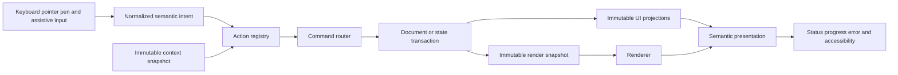
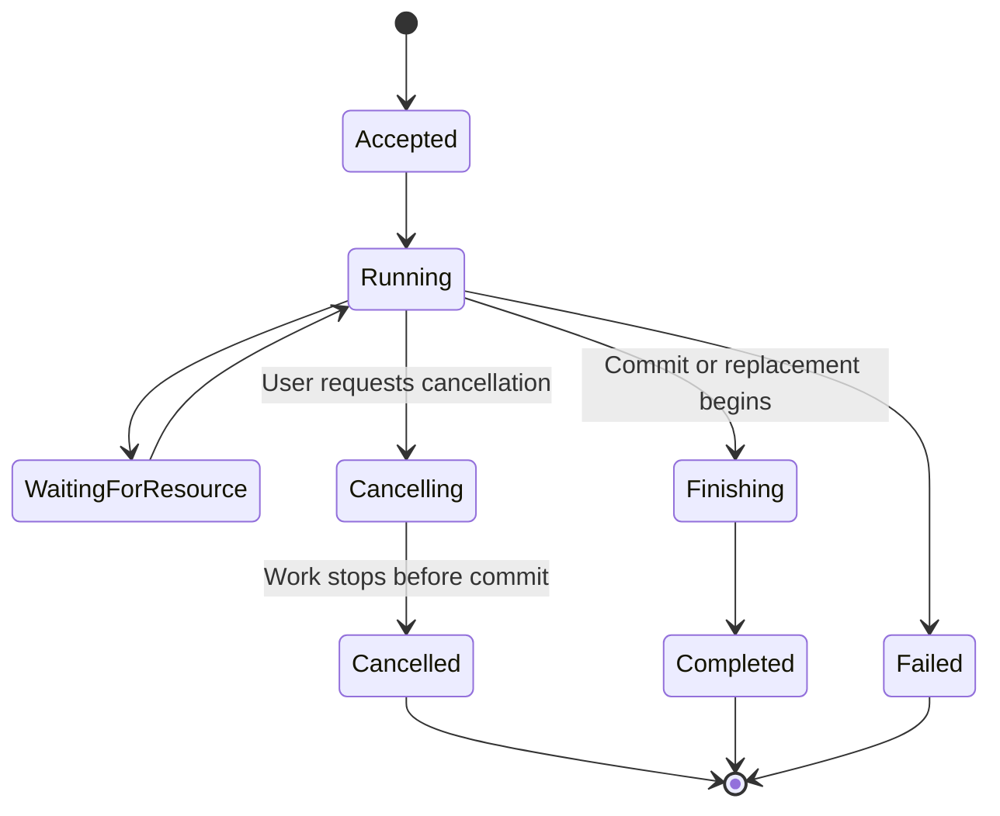
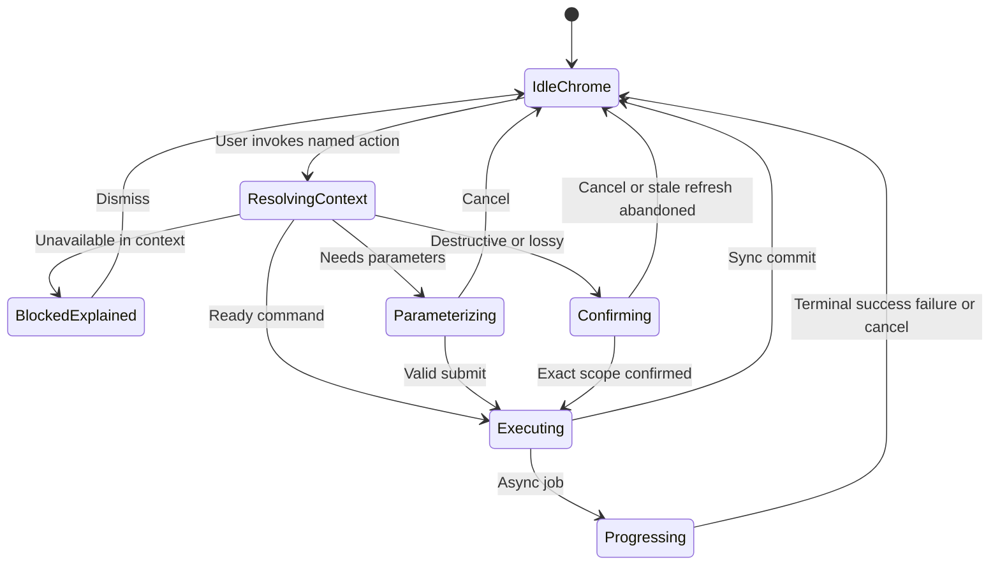

# 28 — UX Guidelines

## Overview

PhotoTux UX turns a deep raster-editing system into a predictable, content-first, keyboard-capable workflow. It is built around stable semantic actions, explicit scope, visible state, progressive disclosure, bounded latency, reversible commands, and actionable failures. Users manipulate documents and objects; widgets are projections. Familiar generic image-editing concepts are welcome, but proprietary branding, menu names, service workflows, and hidden conventions are not.

These guidelines are implementation requirements for application shell, workspaces, panels, toolbars, menus, context menus, dialogs, tools, tasks, preferences, extensions, and recovery. They refine [01 — Information Architecture](01-Information-Architecture.md) without choosing toolkit, runtime, component library, or native plugin ABI. Visual style follows [25 — Themes](25-Themes.md); detailed assistive requirements follow [29 — Accessibility](29-Accessibility.md).

The UX must preserve architecture: commands are mutation spine, document model is truth, history stores committed transactions, and renderer consumes immutable snapshots. A fast-looking UI cannot claim success before command commit, mix stale targets, hide data loss, or mutate directly. Product remains local-first with no cloud, account, collaboration, AI, generative, telemetry-dependent, or proprietary service workflow. Normative keywords follow [Requirement Keywords](Appendix/Requirement-Keywords.md); terms follow the [Glossary](Appendix/Glossary.md).

## Responsibilities

PhotoTux presentation **MUST**:

- reveal active document, focused view, selected objects, active edit target, active tool, modified state, and operation status distinctly;
- expose every named action through a stable discoverable route independent of context menus and shortcuts;
- make menu, toolbar, panel, shortcut, command search, and context presentations invoke the same action/command;
- use consistent vocabulary, units, interaction grammar, state, and placement;
- support complete keyboard workflows for named operations;
- disclose destructive, lossy, expensive, external, and extension-provided consequences before commitment;
- provide immediate acknowledgement and bounded progress for perceptible work;
- keep errors specific, actionable, persistent enough to resolve, and connected to affected scope;
- preserve focus, selection, context, and drafts across asynchronous updates where valid;
- use progressive disclosure without hiding invalidity or essential status;
- keep canvas/document content primary and optional chrome collapsible;
- remain usable at 200% scale, high contrast, reduced motion, and alternate input;
- avoid blocking unrelated documents for local work;
- handle stale state by revalidation rather than optimistic silent application.

It **SHOULD** minimize mode errors, modal interruption, pointer travel, unnecessary confirmation, and visual density; keep frequent actions close to target; expose expert acceleration without requiring memorization; and preserve stable spatial grammar. It **MAY** adapt layout responsively while retaining semantic geography and complete action access.

## Architecture



Presentation never infers authoritative mutation from local control value. A slider can show draft/preview, but commit outcome updates semantic state. Views may lag; they display coherent older state and busy/lag status rather than inventing mixed truth.

### Internal hierarchy

```text
UX system
├── application hierarchy and stable geography
├── semantic action presentations
├── focus/selection/context/active-target model
├── universal keyboard and pointer grammar
├── content-first layout and density
├── progressive disclosure
├── forms/dialogs and validation
├── tasks/progress/cancellation
├── status/notifications/errors
├── destructive and loss communication
├── performance/latency behavior
├── local help and discoverability
├── extension contribution policy
├── accessibility semantics
└── research, diagnostics, and conformance tests
```

## UX State Contract

```rust
struct PresentationContext {
    window: WindowId,
    workspace: WorkspaceId,
    focused_path: SemanticFocusPath,
    active_view: Optional<ViewId>,
    active_document: Optional<DocumentId>,
    selected_targets: BoundedList<TargetRef>,
    active_edit_target: Optional<TargetRef>,
    active_tool: Optional<ToolId>,
    document_version: Optional<DocumentVersion>,
    registry_generation: RegistryGeneration,
}
```

Conceptual only. Every action capture includes explicit context. Selection, focus, context target, and active edit target remain distinct. UI labels/status must not collapse them. Painting into a mask is shown in layer tree, canvas overlay/status, and tool target. A panel pinned to another document declares it.

State projections have generations. Async property values, thumbnails, previews, and enablement carry target/version. Stale results discard. Stable IDs preserve focus and selection across reorder/virtualization. Row index or widget pointer never identifies command target.

## Content-First Layout

Default workspace gives maximum useful area to canvas while keeping object structure, tool identity, and critical status visible:

```text
┌─────────────────────────────────────────────────────────────────┐
│ Primary actions │ Document/View identity │ Search │ Status      │
├──────────┬────────────────────────────────────────┬─────────────┤
│ Tools    │ Tabs / split-view controls             │ Objects     │
│          ├────────────────────────────────────────┤ Layers      │
│ Options  │                                        ├─────────────┤
│          │              Canvas                    │ Properties  │
│          │                                        ├─────────────┤
│          │                                        │ History     │
├──────────┴────────────────────────────────────────┴─────────────┤
│ Tool hint │ Coordinates │ Zoom │ Progress │ Color/Device state │
└─────────────────────────────────────────────────────────────────┘
```

“Content-first” does not mean hide every control. It means:

- canvas gets dominant flexible space;
- controls appear near scope and task;
- panels organize object structure/properties rather than duplicate menus;
- critical modified/save/recovery/device state remains visible;
- decoration does not compete with image;
- alignment and spacing communicate hierarchy;
- empty states offer primary next actions;
- narrow layouts collapse optional regions deterministically;
- users can hide/reorder panels without losing action reachability.

Chrome must not overlap content unpredictably. Canvas overlays are transient, avoid obscuring active work, and have accessible counterparts. Full-screen/canvas-only modes retain visible exit/action discovery and critical status.

## Stable Geography and Consistency

Users form spatial and semantic memory. Stable zones:

- top/primary action access: application/document/view commands;
- tool edge: active tool and groups;
- center: canvas/views;
- object side: layers/masks/properties;
- status edge: hints, coordinates, progress, color/device/recovery;
- dialogs: bounded setup/confirmation;
- task region: long-running operations.

Responsive adaptation may move/collapse zones but keeps action IDs, names, reading order, focus navigation, and conceptual grouping. Frequency tracking must not silently reorder menus or tool groups. User customization is explicit and resettable.

Consistency applies to verbs, nouns, units, defaults, modifiers, drag thresholds, cancellation, validation, icons, destructive placement, progress phases, and empty/error states. One object action has one canonical name across every presentation. “Save” never means export; “Close View” never means close document; “Remove Mask” never means apply then remove.

## Discoverability

Every named operation is reachable through primary menu or command search. Frequent operations may also appear in toolbar, panel, context menu, shortcut, or canvas overlay. Context menus accelerate local work but are not sole route. Double-click and long-press are never sole route.

Action discovery provides:

- canonical name and concise description;
- category/menu path;
- current shortcut;
- scope/target;
- availability and disabled reason;
- destructive/undoable classification;
- extension provenance when relevant;
- related actions and local help.

Command search indexes stable synonyms and generic industry terms while displaying canonical vendor-neutral name. Search result uses current context, but invocation revalidates. Search history remains local and avoids private metadata/paths.

Tool groups expose current tool and all members through keyboard/list. Press-and-hold may accelerate group access but a visible disclosure exists. Tooltips supplement labels; they are never sole accessible names and do not contain critical consequences.

Empty states teach next action without marketing:

```text
No document open
Open a local image or create a document.
[Open] [New]
Recent local items (optional, privacy-controlled)
```

No network/account prompt occupies normal empty state.

## Action Availability

Enabled/disabled state is educational, not authorization. Actions remain visible disabled when location teaches capability; irrelevant absent-product features are omitted. Disabled reason answers requirement: “Select at least two layers,” “Active target is locked,” “Format cannot preserve alpha,” “Extension permission denied.”

Availability computation must be cheap over immutable projections. Expensive analysis reports “Requires evaluation” and runs after invocation or asynchronously. UI cannot freeze while constructing menus.

Busy state is scoped. A document export does not globally disable editing. A target undergoing destructive commit may disable conflicting action only. Repeat activation is prevented by action busy policy while preserving cancellation/status.

## Keyboard-First Operation

Keyboard-first means every named operation can be discovered, invoked, parameterized, cancelled, and verified without pointer. It does not require assigning a shortcut to everything.

Requirements:

- logical region navigation among menu/actions, tools, canvas tabs/views, panels, status/tasks;
- visible focus at all times;
- tab for controls, arrows for composite lists/trees/tool groups;
- Home/End/Page navigation where expected;
- type-ahead for long object/resource lists;
- Context Menu key/equivalent for focused object;
- Escape unwinds one layer: composition/popover/menu/gesture/dialog/temporary mode;
- Enter/Space follow control semantics and never accidentally activate destructive default;
- shortcuts yield to text entry and IME;
- focus returns after dialogs/popovers/context menus;
- deletion/unload moves focus to deterministic surviving neighbor.

Canvas pointer gestures have parameterized keyboard alternatives where feasible: numeric transforms, nudge, zoom controls, coordinate entry, tool parameter forms. Freehand painting cannot be fully reproduced by keys, but tool selection, parameters, cancellation, history, and alternate input are accessible.

## Pointer, Pen, and Direct Manipulation

Universal grammar from [01 — Information Architecture](01-Information-Architecture.md):

- primary click selects/activates;
- drag begins after threshold and previews operation;
- double-click performs non-destructive primary edit;
- secondary click opens context actions without mutation;
- modifiers refine consistently;
- Escape/focus loss/device removal cancels active gesture.

Drag shows source, candidate target, operation, validity, and consequence. Insertion indicators distinguish before/after/into. Status says “Move 3 layers into Group A,” not “Drop allowed.” Invalid drop restores original structure. Auto-scroll is bounded.

Pen barrel maps context action. Pressure/tilt only apply where tool declares them. Touchpad navigation must not trigger edits accidentally. Hover is optional enhancement; all information/actions remain available without it.

## Progressive Disclosure

Four levels:

1. **Immediate:** active document/tool/target, canvas, primary parameters, save/undo/status.
2. **Nearby:** properties, context actions, common modifiers, task progress.
3. **On demand:** advanced color, alpha, metadata, performance, format details.
4. **Specialized:** diagnostics, extension permissions, migration internals.

Disclosure rules:

- collapsed values persist;
- hidden errors/warnings appear at group header;
- group names describe concepts, not “More” dumping grounds;
- safe defaults are visible enough to explain output;
- advanced setting cannot alter hidden destructive consequence without summary;
- expert shortcuts never remove menu discovery;
- user expansion state may persist as workspace/presentation state, not document;
- one basic/advanced mode must not split product into inconsistent state models.

### Disclosure Group Header

A collapsible group's header is the group's entire interactive surface and its only focus stop. It **MUST** carry:

- the concept name, legible whether expanded or collapsed;
- expansion state exposed non-visually, not by caret glyph alone;
- any warning or invalid value hidden inside the collapsed body, surfaced as a header badge whose text also reaches assistive technology.

It **SHOULD** show a short value summary while collapsed — the parameter a user most likely wants to confirm before deciding to expand — so the collapsed state still carries information scent.

Keyboard grammar follows the platform disclosure convention: Space and Enter toggle; Right expands a collapsed group; Left collapses an expanded one. Group registration order is stable and **MUST NOT** be reordered by usage frequency.

Group bodies **MAY** be constructed lazily on first expansion, provided the deferral is not observable: control values come from host state rather than widget lifetime, and a body retained after collapse keeps in-progress edits. Deferral **MUST NOT** delay a warning or invalid-value badge, which is computed from host state and therefore remains available while the body does not exist. See [01 — Information Architecture](01-Information-Architecture.md) for the group registry and level assignments.

## Forms and Parameter Editing

Forms use stable labels, units, constraints, and commit policy. Numeric controls support typing and adjustment; slider-only precision is forbidden. Mixed multi-selection values show mixed state, not fake average. Editing mixed value applies explicit new value to applicable targets and discloses partial applicability.

Draft changes do not mutate authority unless control is explicitly immediate command with undo/coalescing. Property slider may preview transiently and commit mergeable commands; cancel restores committed state. Text rename commits on Enter/focus policy and preserves old name on rejection.

Validation occurs near field and in summary. Do not erase user input on failure. Parsing uses locale display but semantic units. Clamp only where mathematically expected and disclosed; invalid destructive dimensions reject.

Dialogs follow [26 — Dialogs](26-Dialogs.md). Persistent inspectors serve iterative work. File controls use capabilities, not editable path fields by default.

## Latency and Responsiveness

Latency is part of meaning. Target provisional goals inherit [00 — Introduction](00-Introduction.md):

- input-to-preview should remain below 16 ms p95 for reference brush fixture;
- menu/panel actions should acknowledge within 100 ms;
- operations exceeding 250 ms should expose progress or stable busy state;
- cooperative CPU cancellation should be observed within 100 ms;
- UI thread must not wait for file I/O, GPU completion, codecs, full-document locks, or extensions.

Acknowledgement can be pressed/busy state, transient preview, task creation, or command accepted status. It cannot claim committed success. Progress reports phases and meaningful units; fake smooth percentages are prohibited.

Under pressure:

1. preserve input and command commits;
2. cancel stale previews/thumbnails;
3. reduce declared transient preview quality;
4. present complete older frame or same-version coarse frame;
5. keep save/recovery capacity;
6. expose degraded status;
7. reject before data loss.

Skeleton/loading UI is appropriate for non-authoritative lists, not for pretending document content exists. A spinner without operation identity or cancellation for long work is inadequate.

## Progress and Tasks

Every async user operation has stable operation ID, name, scope, phase, progress, cancellability, start context, and terminal outcome. Tasks appear near scope and in shared task region. Critical save/export/recovery failure persists beyond toast.



Progress principles:

- phase names: Probing, Decoding, Rendering, Encoding, Flushing, Replacing;
- count/bytes/tiles when meaningful;
- indeterminate when total unknown;
- rate-limit UI and accessibility updates;
- cancellation action remains reachable;
- “Finishing” marks bounded non-cancellable commit;
- completion identifies output/preserved state;
- retry appears only when safe and creates clear operation identity.

Global busy overlays are prohibited for document-local work. Multiple tasks summarize while allowing details. Completed tasks have bounded retention and local privacy.

## Error Messaging

Every error answers:

1. what operation failed;
2. what target/destination was affected;
3. what state remains safe;
4. whether anything committed or was replaced;
5. whether retry is safe and what it will use;
6. what user can do next;
7. diagnostic correlation when needed.

Message structure:

```text
Export failed while writing final data.
Document remains unchanged. Existing destination was not replaced.
Free local disk space or choose another destination, then retry.
[Choose Destination] [Retry] [Details]
```

Avoid “Something went wrong,” blame, implementation stack traces, raw OS errors, or unexplained codes. Translate host errors while preserving detail in diagnostics. Use exact nouns/verbs. Field errors stay by fields. Repeated identical background failures coalesce without hiding persistence risk.

Severity presentation:

- inline: local correctable validation;
- status: ordinary completion/nonblocking state;
- notification/banner: persistent operational warning;
- dialog/resolution surface: decision required or broad risk;
- task detail: async operation failure;
- diagnostic view: technical evidence.

Toasts never exclusively carry failed save, unresolved recovery, device loss, or destructive result.

## Destructive, Lossy, and External Actions

Destructive action naming identifies consequence. Confirmation is reserved for real irreversible/lossy scope, not every undoable edit. Users need confidence in Undo; over-confirmation trains dismissal.

Before flatten/rasterize/profile conversion/precision reduction/metadata stripping/export overwrite, show:

- exact scope;
- lost editability/data;
- history/recovery availability;
- output-only versus document change;
- alternative;
- target version/destination.

Save, Save As, Save a Copy, Export, Revert, Close View, Close Document, Discard, and Clear History stay distinct. External filesystem effects are not undone by document history. Extension actions display provenance when permission/data risk matters.

## Notifications and Status

Status regions communicate current tool hint, coordinates/sample, zoom/rotation, active target, progress, color/profile, renderer/device, modified/save/recovery, and warnings. Critical items cannot be hidden by extensions.

Notifications are:

- specific;
- deduplicated;
- persistent according to consequence;
- actionable;
- keyboard reachable;
- accessible;
- local and private.

Ordinary undoable command completion need not toast. Save/export completion may appear in task/status. Errors requiring action persist. Notifications do not steal focus except immediate safety resolution. Audio/haptic feedback, if host supports, is optional and never sole signal.

## Undo and History UX

Undo/Redo labels use semantic outcome: “Undo Paint Mask,” “Redo Move 3 Layers.” Availability/disabled reason reflects timeline. Coalesced gestures appear as one meaningful step. Undo does not decrement displayed document version concept; users need not see versions normally.

History panel virtualizes, preserves focus by transaction/group ID, shows logical sequence/checkpoints/boundaries, and does not expose raw event spam. Save point, recovery checkpoint, and history checkpoint are distinct in technical views. Clear History states irreversibility and preserved current document.

After command commit, UI updates from authoritative projection, not local optimistic assumption. If renderer lags, history/action state can show committed while canvas displays last complete frame with bounded status.

## Save, Import, and Export UX

Open/import displays phases and warnings. Imported third-party source is not automatically considered native saved document. On first Save, offer native editable format; Export produces delivery output. Lossy third-party “save” is not disguised.

Export:

- format-neutral initial structure;
- adapter capabilities drive options;
- exact loss/conversion summary;
- snapshot version pinned;
- editing may continue;
- progress/cancel;
- completion/reveal through local host action;
- modified state unchanged.

Failed staged write states prior destination safety. Save completion for older version says “Saved; newer changes remain.” Recovery opens as recovered/modified and never overwrites original silently.

## Workspace and Multi-Document UX

Tabs identify display name, modified, saving, recovery, and same-document multiple views. Closing tab closes view. If last owner closes modified document, resolution appears. Multi-document quit consolidates state and per-document outcomes.

Focus determines active document; pointer hover does not. Visible split views may render simultaneously, but one has active command scope. Panels declare follow/pin target. Moving panels/views never dirties documents.

Responsive layout preserves canvas minimum, action access, active tool, critical status, then collapses optional panels. Offscreen floating content returns to visible work area. Workspace restore never restores hazardous gestures/dialog confirmations.

## Extension UX

Extension contributions follow core semantic slots, names, accessibility, themes, permissions, latency, errors, and command spine. They cannot:

- create arbitrary top-level categories;
- hide/replace core actions/status;
- intercept unrelated input;
- block UI thread;
- inject inaccessible arbitrary widgets;
- mimic protected permission/file/save/recovery surfaces;
- reorder destructive boundaries;
- use proprietary service marketing in core workflow;
- require network/account for normal editing.

Provenance appears in action details, permission prompts, unavailable object state, and failures where useful. Extension crash removes/cancels its UI while preserving focus and document. Missing extension shows a bounded unavailable representation and preserved data.

## Accessibility and Inclusive Input

Accessibility is architecture, not polish. All visible state/action has semantic counterpart. Keyboard, screen reader, high contrast, reduced motion, scaling, sticky/slow keys, switch control, pointer, pen, and alternative devices operate one semantic product.

Do not create separate “accessible mode” with different commands. Preferences can adjust single-key shortcuts, sequence timeout, motion, contrast, UI scale, target size, and announcements. Details in [29 — Accessibility](29-Accessibility.md).

## Security, Privacy, and Trust UX

Permission and trust messaging states fact, scope, and consequence. “Signed” is not “safe.” File/extension capability prompt uses least authority. Display names/paths are bidi-isolated and sanitized. Sensitive metadata, clipboard content, pixels, names, and paths are not announced/logged unnecessarily.

Local-first behavior is visible but not noisy: no login blockers, sync status, cloud upsell, model downloads, or remote dependency. Diagnostics export is explicit and previews included sensitive scope.

Security controls cannot be themed/extended into misleading state. Disabled enforcement in UI is not authorization; command/capability layer revalidates.

## Threading and Asynchronous Consistency

Presentation uses immutable projections. No widget owns mutable document. UI thread handles input/layout/native presentation only. Worker results include scope IDs, source versions, draft/context/registry generations, and operation IDs.

Race policy:

- target deleted: reject/retarget only by explicit policy;
- selection changed: captured or latest scope according to action descriptor;
- document edited during preview/export: pin snapshot and disclose;
- extension unloaded: disable contribution, preserve unresolved state;
- focus changed: cancel scope-sensitive shortcut/gesture;
- frame stale: discard or show complete old version;
- notification lost: reacquire projection/snapshot.

Optimistic UI may show draft/preview distinctly. It reconciles with typed outcome. No “snap back” without explanation after rejection.

## Persistence and Migration

UX persistence domains:

- application preferences: defaults/behavior/accessibility;
- workspace state: layout, panel expansion, view arrangement;
- document: semantic content/properties;
- operation presets: bounded export/filter options where explicitly saved;
- session hints: safe local restoration;
- ephemeral: focus capture, hover, dialogs, gestures, previews.

Each uses stable semantic IDs and schema versions. Toolkit geometry/widget trees are not persisted. Migration preserves semantic focus/layout where possible and falls back safely. User-facing action names may localize; IDs and command semantics remain stable.

## Failure, Cancellation, and Recovery UX

Cancellation is always phase-aware. Before commit: no authoritative effect. After commit: report success and offer Undo where appropriate. Before staged replace: prior destination safe. After replace: report completion. Never promise rollback of observed commit/external effect.

When subsystem fails:

- preserve document over current operation;
- retain usable unrelated scopes;
- show persistent critical status;
- offer safe fallback/retry/save-copy/recovery;
- avoid automatic loops;
- keep diagnostics local/redacted.

Device loss leaves document/save/history available and presents renderer rebuilding/degraded. Codec/extension crash identifies affected contribution. Invariant failure freezes affected mutation rather than speculative repair.

## State and UX Invariants

- Every named mutation converges on one action/command semantic path.
- Visible selected, focused, active target, active view, and active document states are distinguishable.
- Presentation cannot claim command success before commit.
- No essential action is context-menu-, hover-, double-click-, gesture-, or shortcut-only.
- Destructive/lossy scope is exact and current.
- Errors identify preserved state and next action.
- Progress belongs to operation ID and never blocks unrelated scope globally.
- Document pixels/output are independent from theme/workspace.
- Focus remains visible and valid after async/model changes.
- Extension absence/failure cannot remove core workflow.
- Workspace/preference changes do not dirty documents.
- No normal workflow requires network/account/AI/proprietary service.

## Design Rationale and Alternatives
**Stable semantic actions versus widget callbacks.** Semantic actions unify discovery, shortcuts, commands, accessibility, permissions, and diagnostics. Callbacks fragment behavior.

**Content-first stable geography versus adaptive personalization.** Stable layout protects muscle memory and documentation. Explicit responsive collapse handles constraints without surprise.

**Keyboard-first plus pointer direct manipulation versus pointer-first.** Keyboard completeness improves speed/accessibility/testability. Pointer remains optimal for spatial work; both map to same semantics.

**Progressive disclosure versus basic/expert modes.** Disclosure keeps one mental model and preserved values. Separate modes drift and hide capability.

**Actionable persistent errors versus transient toast.** Persistence protects save/recovery failures. Toast is suitable only for low-risk completion.

**Scoped busy state versus global blocking.** Scoped state supports multi-document concurrency and clarifies ownership, at cost of operation tracking.

**Honest latency/degradation versus fake responsiveness.** Complete old/coarse frames and phase progress preserve truth. Fake success/mixed versions damage trust.

## Best Practices

- Lead labels with object/result.
- Keep one canonical action name.
- Show active edit target redundantly but calmly.
- Place frequent actions near target and all actions in menu/search.
- Keep commands outcome-oriented and undo labels meaningful.
- Acknowledge within bounded time without faking commit.
- Preserve drafts/input on failure.
- Scope busy/error/progress narrowly.
- Keep destructive actions separated and exact.
- Pair icons/colors with text/shape.
- Test no-panels, keyboard-only, 200%, high contrast, reduced motion.
- Test stale targets and notification loss.
- Prefer local status over repeated toast.
- Keep extension provenance visible at trust boundaries.

## Future Extensibility

Future comparison views, task-specific workspace presets, alternate platform hosts, switch-control adapters, local batch hosts, and richer semantic extension components can fit these rules. New concepts **MUST** identify hierarchy position, owner, action scope, persistence, accessibility, failure, latency, security, and tests.

Remote collaboration, cloud storage, account identity, AI/generative tools, proprietary service panels, and behavior driven by hidden telemetry remain outside scope.

## Testability and Diagnostics

UX tests operate on semantic action registries, context snapshots, dialog/form state machines, workspace projections, and accessibility trees before screenshot tests. Action-equivalence harness invokes menu, toolbar, context, shortcut, command search, panel, and tool path and compares command ID/schema/target meaning.

Controlled scheduler injects stale property results, target deletion, selection changes, frame lag, extension unload/crash, file denial, device loss, operation cancellation, and notification drops. Performance harness records input acknowledgement, action resolution, command queue, commit, projection, render, and presented frame.

Diagnostics record stable action IDs, scope/target kinds/counts, focus path, context/version generations, operation phases, latency, disabled/error codes, presentation source, and outcome. Private names, paths, text, metadata, and pixels are redacted.

### Deterministic acceptance scenarios

**Presentation equivalence:** Invoke Duplicate Layer from menu, context, shortcut, command search, and panel. Assert same action/command schema/target/transaction/history label; provenance differs diagnostically only.

**Active-target safety:** Select layer with mask, activate mask, then paint. Assert layer tree/canvas/status identify mask, command targets mask ID, Undo label names mask, and no layer-pixel mutation.

**Keyboard-only export:** Open command search, start Export, complete options/file chooser/loss review, monitor/cancel/retry using keyboard. Assert focus, exact actions, no pointer dependency, and modified state unchanged.

**Latency pressure:** Saturate thumbnails/extension work, then paint/save/open menu. Assert acknowledgements meet target/reserved capacity, stale work cancels, no dropped mutation, and degraded status is honest.

**Stale property:** Begin editing opacity for A, change selection to B, receive A async value, then submit. Assert A result cannot overwrite B, target scope is visible, and command revalidates.

**Destructive scope:** Select A/B, open delete confirmation, change selection/add C, then confirm. Assert old confirmation invalid; exact current/captured policy refreshes and no unintended C deletion.

**Save older version:** Save version 10 while editing to 11. Assert UI says saved with newer changes, modified indicator remains, and no false clean state.

**Device loss:** Lose renderer during edit. Assert persistent device status, document/history/save remain available, stale frames rejected, and restored frame uses coherent latest snapshot.

**Responsive scale:** At 200% and narrow width, assert canvas/action access/active tool/critical save error remain reachable, optional panels collapse predictably, and focus order stays logical.

**Extension crash:** Crash active extension tool/panel. Assert gesture preview cancels, no partial precommit mutation, focus restores, core tool/action access remains, and opaque document data preserved.

**Error content:** Inject disk-full export. Assert message identifies export, prior destination safety, unchanged document, remedy/retry, and local details without raw path leak.

## Edge Cases and Interaction Contracts

UX rules must hold when multiple documents, async jobs, and input modalities collide. These edge cases refine the contracts above into testable behavior.

**Focus versus selection versus edit target.** Focus is where keyboard events go; selection is the set of objects highlighted for commands; active edit target is the surface that will receive paint or transform (layer, mask, or other). UX **MUST** keep these distinguishable in chrome and status. A focused layer row with an active mask edit target **MUST NOT** look identical to “editing the layer pixels.” Status text names the edit target explicitly during tools that mutate samples.

**Command search during modal dialog.** While a modal dialog owns keyboard scope, command search either is unavailable or opens scoped to dialog actions only. Global document mutations through search are blocked until the dialog completes or cancels. This prevents invisible edits behind a confirmation that still displays an obsolete scope.

**Notification collapse under load.** When many tasks complete in a short window, notifications coalesce by operation class and document identity. Coalescing **MUST NOT** drop a failure underneath a success of a different operation. A failed export and a successful thumbnail rebuild never merge into one ambiguous “done” toast.

**Mixed multi-select property commit.** Inspectors show mixed values clearly. Committing a new value applies only to applicable targets and reports partial application counts. UX never pretends all selected objects received a property they do not own.

**Pen barrel button versus keyboard modifiers.** Barrel/secondary button mappings are discoverable and conflict-checked against reserved accessibility keys. If a mapping is unavailable on the current host, the equivalent menu/command path remains the source of truth; the UI does not invent a silent alternate gesture with different semantics.

**Locale and expansion.** Translated labels that grow **MUST NOT** clip primary actions in the first viewport of dialogs or toolbars. Overflow menus preserve order and availability. Canonical action IDs stay language-stable even when labels change.



## Failure Modes and User-Visible Recovery

| UX failure mode | User sees | Must not see | Recovery path |
| --- | --- | --- | --- |
| Stale confirmation | Exact scope refresh or cancel | Silent delete of new objects | Re-open confirm with current IDs/versions |
| Async property race | Target mismatch or discarded late value | Value applied to wrong object | Re-select; edit again |
| Export disk full | Operation, prior file safe, remedy | “Saved” or truncated success | Free space; retry; keep document |
| Device/render loss | Persistent status; editing still defined | Empty canvas mistaken as wiped document | Wait/recover device; save still offered |
| Extension crash | Contribution gone; core intact | Frozen modal with no Escape | Focus to canvas/core chrome; continue |
| Shortcut during IME | Composition continues | Random tool switch | Complete/cancel composition; then shortcuts |
| Narrow 200% layout | Overflow to reachable menus | Critical Save/Export unreachable | Use overflow/search; geometry adapts |

Copy tone stays operational: name the operation, the safe remainder, the effect, and the next step. Avoid blame, humor at failure time, and vendor-service upsells. Raw errno strings and absolute paths stay behind a disclosure control when privacy policy requires redaction.

## Accessibility and Trust in Everyday UX

Every UX pattern in this document has an accessibility obligation: names for actions, non-color state, visible focus, and keyboard reachability. Progressive disclosure that hides advanced fields **MUST** still expose errors inside those fields. Canvas-heavy workflows expose object explorers and summaries so the product is not “bitmap only” for assistive technology.

Trust UX remains local. Permission prompts for files use host portals. Extensions that request extra capabilities show purpose text tied to the contributing extension identity. No ambient account banner, no remote “AI assist” affordance, and no telemetry opt-out labyrinth appear in core chrome. Diagnostic exports warn before including sensitive payloads and default to redacted sets.

## Neighboring Subsystem Links

- **Information Architecture** — naming, scent, and hierarchy decisions UX must not contradict.
- **Workspace System** — geography stability, splits, and responsive collapse behavior.
- **Dialogs** — modality, drafts, confirmations, and chooser denial copy.
- **Command System** — single semantic spine behind every presentation.
- **Shortcut System** — scope, IME ownership, and discoverable bindings.
- **Themes** — contrast, density, and motion cues that carry state.
- **Accessibility** — semantic tree and announcement budgets for the same states UX displays.
- **History and Undo** — labels and coalescing that match what the user believes happened.
- **Import and Export** — loss language and progress honesty.
- **Plugin SDK** — contribution surfaces that obey core UX grammar or are rejected.

## Additional Acceptance Scenarios

**Edit-target clarity:** Activate mask edit target on selected layer; invoke Fill from menu and shortcut. Assert both target the mask, status names the mask, and Undo labels match.

**Search behind modal:** Open destructive confirm; invoke global command search for Merge. Assert merge does not run; user remains in confirm or dialog-scoped search only.

**Coalesced notifications:** Complete five successful thumbnail jobs and one failed export overlapping. Assert failure remains independently visible; successes may coalesce without implying export OK.

**Partial property apply:** Select raster layer and group; set a raster-only property. Assert structured partial result, group unchanged, raster updated, and message counts match.

**IME tool safety:** In layer rename, compose characters that match a tool shortcut chord. Assert no tool switch; after commit, shortcut works again from canvas focus.

**Clipped label prevention:** Load a language pack with long Save As label at 200% width-constrained shell. Assert Save As remains activatable via visible control or deterministic overflow with same action ID.

**Trust prompt copy:** Trigger file overwrite confirm and extension capability prompt in sequence. Assert each names exact resource/extension, offers cancel, and grants nothing on dismiss.

**History label match:** Run Gaussian-style blur via dialog Apply. Assert history entry uses the same user-facing name as the dialog title/action, not an internal pass name.

## Acceptance Criteria

- UX is content-first, stable, discoverable, keyboard-capable, and progressively disclosed.
- Active document/view/selection/focus/edit-target/tool states remain distinct and visible.
- Every named action has stable menu/search access and equivalent command semantics.
- Latency produces truthful acknowledgement, progress, cancellation, and scoped degradation.
- Errors state operation, safe remainder, effect, remedy, and retry.
- Destructive/lossy/external consequences are exact and current.
- Workspace, theme, and preferences remain separate from document truth.
- Async/stale results cannot target replacement objects or mixed versions.
- Extension UX conforms to core semantics, accessibility, trust, and budgets.
- 200% scaling, high contrast, reduced motion, keyboard, and assistive routes remain complete.
- No unvalidated toolkit/runtime/plugin ABI is assumed.
- No cloud, account, AI, generative, telemetry-dependent, or proprietary workflow appears.

## Cross References

- [00 — Introduction and System Charter](00-Introduction.md) — product principles, targets, and failure philosophy.
- [01 — Information Architecture](01-Information-Architecture.md) — hierarchy, actions, discoverability, and interaction grammar.
- [02 — Application Lifecycle](02-Application-Lifecycle.md) — startup, shutdown, recovery, and device loss.
- [03 — Workspace System](03-Workspace-System.md) — layout, focus, responsive adaptation, and persistence.
- [07 — Context Menus](07-Context-Menus.md) — local action completeness and target resolution.
- [08 — Command System](08-Command-System.md) — mutation spine, progress, cancellation, and outcomes.
- [09 — Shortcut System](09-Shortcut-System.md) — keyboard scope, IME, sequences, and accessibility.
- [10 — Document Model](10-Document-Model.md) — authoritative state and immutable snapshots.
- [16 — Color Management](16-Color-Management.md) — color action/loss vocabulary.
- [17 — Rendering Engine](17-Rendering-Engine.md) — coherent frames, overlays, latency, and degradation.
- [20 — History and Undo](20-History-Undo.md) — meaningful undo, coalescing, and checkpoints.
- [21 — Clipboard](21-Clipboard.md) — exact paste actions and conversion consequences.
- [22 — Import and Export](22-Import-Export.md) — open/export progress, losses, and failures.
- [23 — Plugin SDK](23-Plugin-SDK.md) — contribution UX and trust.
- [24 — Preferences](24-Preferences.md) — settings scope and progressive disclosure.
- [25 — Themes](25-Themes.md) — visual states, contrast, scaling, and motion.
- [26 — Dialogs](26-Dialogs.md) — modality, forms, confirmation, and file chooser.
- [29 — Accessibility](29-Accessibility.md) — semantic tree, focus, AT-SPI, and testing.
- [Glossary](Appendix/Glossary.md) — canonical terminology.
- [Requirement Keywords](Appendix/Requirement-Keywords.md) — normative interpretation.
