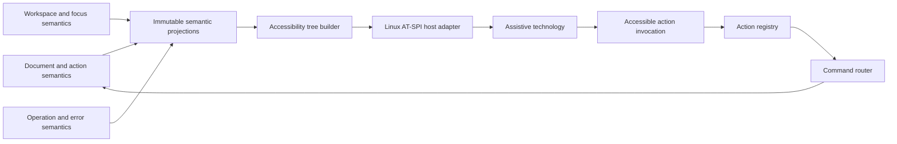
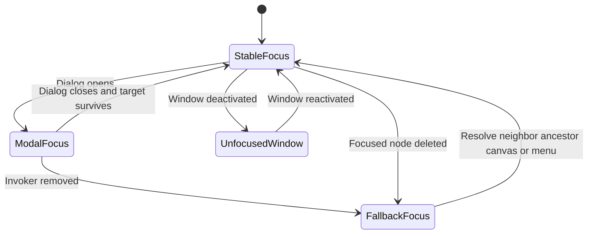
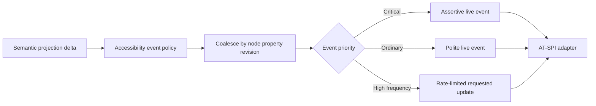
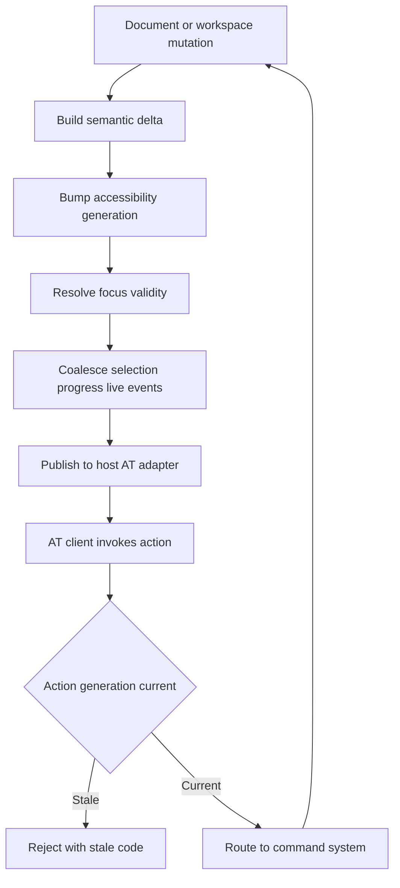

# 29 — Accessibility

## Overview

Accessibility is a semantic system boundary, not a visual afterthought. PhotoTux exposes application hierarchy, documents, views, layer/object graphs, tools, actions, properties, dialogs, tasks, errors, and renderer state through a structured accessibility tree. Every actionable concept has role, name, state, value, relationships, actions, focus behavior, and event policy independent of rendered pixels.

Linux-native accessibility uses an AT-SPI adapter at the host boundary. Portable core and presentation models expose toolkit-neutral semantics; the Linux host maps them to AT-SPI objects, interfaces, actions, states, text/value/range relations, live events, and focus. Exact UI toolkit, accessibility bridge implementation, runtime, and plugin ABI remain unvalidated. Platform hosts may map the same semantic contract to other native accessibility systems.

Accessibility preserves the architectural spine. Assistive actions invoke the same action registry and [08 — Command System](08-Command-System.md) as pointer, keyboard, menu, toolbar, context menu, and panel. The accessibility tree never receives writable document references. Document truth, history transactions, and immutable render snapshots remain authoritative. No accessibility workflow requires cloud, account, remote service, AI, generative processing, or proprietary integration.

Normative language follows [Requirement Keywords](Appendix/Requirement-Keywords.md); canonical terms follow the [Glossary](Appendix/Glossary.md).

## Naming Controls That Have No Text

Qt derives a control's accessible name from its visible text, so a `Button` or
a `ThemedCheckBox` is named already. Two kinds of control are not:

- **Sliders.** A slider has no text of its own; its label sits in a separate
  `Label` beside it and nothing connects the two. Without `Accessible.name` it
  reaches assistive technology as an anonymous "slider", and a panel of eight of
  them is unusable. Fourteen of the shell's twenty-one sliders were in that
  state.
- **Icon-only buttons.** Same problem, no text to fall back on.

Names include the current value where the value is the point — "Brush size, 12
pixels", "Foreground red, 40 percent" — because a screen-reader user adjusting a
slider needs the reading, not just the name.

`qml/` has no test runner, so these are checked from Rust:
`crates/phototux-ui/src/chrome_contract.rs` reads the shell as text and fails
when a `Slider` or `ChromeIconToolButton` block carries no name. It is the same
approach the engine uses for icon packaging and menu structure, and for the same
reason — the alternative is a list someone has to remember to update. Both
checks were verified by removing a name and watching them fail, not by trusting
a green run.

## Responsibilities

PhotoTux accessibility **MUST**:

- expose every interactive element with valid role, name, state, action, and focus semantics;
- represent application, workspace, document views, panels, object trees, properties, dialogs, menus, tasks, and critical status structurally;
- provide complete keyboard access to every named operation;
- distinguish focus, object selection, active document, active view, context target, and active edit target;
- preserve visible focus and semantic focus through virtualization, async updates, deletion, dialogs, and workspace reconstruction;
- map Linux presentation to AT-SPI without leaking toolkit objects into core;
- provide non-color cues, measurable contrast, high-contrast mode, scalable UI/text, and reduced motion;
- support input alternatives for pointer-only spatial operations where feasible;
- rate-limit/coalesce events without losing critical state;
- expose exact validation, destructive consequence, progress, cancellation, and failure;
- avoid speaking private document content, paths, metadata, clipboard data, or pixels without user navigation;
- require extension contributions to provide equivalent semantics and remain contained on failure;
- supply automated semantic checks and manual assistive-technology test matrices;
- keep core editing usable when AT-SPI or host accessibility service is unavailable.

It **SHOULD** provide structured canvas exploration, configurable shortcut timing/single-key safety, scalable handles, semantic color inspection, and task-oriented navigation shortcuts. It **MAY** support switch control, voice/action adapters, braille-oriented summaries, and richer pixel exploration through the same action/capability contracts.

## Architecture



Semantic projections are authoritative for accessibility state but not document mutation. Tree builder normalizes roles/relationships and manages stable node IDs. Host adapter publishes native protocol objects/events. Assistive invocation returns stable action ID and semantic target to action resolver. Disabled state is advisory; command revalidates.

### Internal hierarchy

```text
Accessibility subsystem
├── semantic node registry
│   ├── stable node identities
│   ├── roles/names/descriptions
│   ├── states/values/actions
│   └── relationships/hierarchy
├── tree builder and immutable snapshots
├── focus coordinator
├── keyboard/region navigation
├── object-tree navigation
├── canvas semantic explorer
├── live event/announcement policy
├── contrast/scale/motion policy
├── input alternatives
├── Linux AT-SPI adapter
├── extension semantic validation
├── privacy/redaction policy
└── automated/manual conformance harness
```

## Semantic Node Contract

```rust
struct AccessibilityNode {
    id: AccessibilityNodeId,
    generation: NodeGeneration,
    role: AccessibleRole,
    name: Text,
    description: Optional<Text>,
    state: AccessibleStateSet,
    value: Optional<AccessibleValue>,
    actions: BoundedList<AccessibleAction>,
    relations: BoundedList<AccessibleRelation>,
    children: ChildProjection,
    privacy: AccessibilityPrivacy,
}

struct AccessibilityTreeSnapshot {
    window: WindowId,
    workspace: WorkspaceId,
    revision: AccessibilityRevision,
    root: AccessibilityNodeId,
    focused: Optional<AccessibilityNodeId>,
    nodes: ImmutableNodeStore,
}
```

Conceptual only. Node identity derives from stable semantic owner and role, not widget pointer, array index, accessible name, or screen coordinate. Virtualized rows retain logical node identity while materialized; focus proxy/active descendant preserves navigation when offscreen.

Node names are concise and user-facing. Description adds consequence/context, not duplicate name. Values carry numeric range, units, text representation, mixed/indeterminate state, and editability. Actions map to stable semantic action IDs or accessibility navigation operations. Relations include labelled-by, described-by, controls, controlled-by, member-of, owns, flows-to, error-message, and active-descendant equivalents.

## Role and State Mapping

Core role families:

- application/window/workspace region;
- menu/menu item/submenu;
- toolbar/tool button/toggle;
- tab list/tab/tab panel/canvas view;
- tree/tree item/group for layers/objects;
- property panel/form/group/label/field;
- button/toggle/checkbox/radio/list/option;
- dialog/alert dialog/file chooser relation;
- status/live region/progress/task;
- document/canvas semantic summary;
- image preview with structured alternative;
- table/grid only where two-dimensional semantics are real.

State includes enabled/unavailable, focused, focusable, selected, expanded/collapsed, checked/pressed, active, busy, invalid, required, read-only/editable, modal, multiselectable, indeterminate, offscreen, and protected where appropriate.

Custom “canvas” or “layer” roles can be exposed through standard closest role plus object attributes/description until platform conventions validate richer mapping. Never mislabel a control to achieve screen-reader phrasing.

## Accessible Name and Description

Name sources follow deterministic order:

1. visible associated label;
2. explicit semantic name from descriptor;
3. object type plus sanitized visible user name;
4. stable generic fallback.

Hint text inside an empty field is not its label. Tooltip is not sole name. Icon-only common controls still have names. Repeated names include context where ambiguity exists: “Visibility, Layer 3,” “Close view, Landscape.”

Descriptions include disabled reason, destructive consequence, extension provenance, units, shortcut, or target scope only when useful. They avoid verbosity and private hidden content. A layer name intentionally visible may be spoken; hidden metadata/path is not included merely for diagnostics.

Dynamic name changes are events only when focused or semantically important. Continuous pointer coordinates do not rename canvas node at high frequency; a dedicated inspector exposes requested values.

## Accessibility Tree Hierarchy

```text
Application
└── Window
    └── Workspace
        ├── Primary menu/actions
        ├── Tool presentation
        │   ├── Active tool
        │   └── Tool options
        ├── Canvas region
        │   ├── Document tab list
        │   └── Canvas view
        │       ├── Document summary
        │       ├── Active target summary
        │       └── Optional structured canvas explorer
        ├── Panels
        │   ├── Layers/object tree
        │   ├── Properties form
        │   ├── History list
        │   └── Tasks list
        └── Status region
            ├── Tool hint
            ├── Coordinates/sample
            ├── Zoom/rotation
            └── Save/recovery/device status
```

Tree follows semantic reading order, not arbitrary widget construction order or physical side. Dock rearrangement updates order according to committed workspace topology. Decorative separators, icons, and repeated visual wrappers are excluded unless they convey state.

Critical status remains reachable even when visual overflow collapses. Hidden/collapsed panels expose representative controls with expanded state and controlled relation. A panel not present has no ghost actionable subtree, except an explicit unavailable representation.

## Focus Model

Exactly one semantic keyboard focus locus exists per active window. Native focus and semantic focus synchronize by stable IDs/generations. Focus does not imply selection or active edit target.

Focus rules:

- application start: recovery decision if required, otherwise active view or New/Open;
- dialog open: safe first required/invalid/content control;
- dialog close: invoking semantic path or nearest surviving ancestor;
- context menu close: invoking object;
- panel unload: nearest region, then active canvas, then primary actions;
- object deletion: next sibling, previous sibling, parent, then tree;
- tab close: deterministic adjacent tab/view;
- workspace reconstruction: semantic equivalent, ancestor, active canvas, menu;
- async completion: never steals focus;
- error summary focus moves only on explicit submit/activation.

Visible focus uses [25 — Themes](25-Themes.md) contrast requirements and remains visible on selected/invalid/pressed controls. Pointer interaction may move focus according to host convention, but hover never does. Focus cannot land on disabled/decorative nodes.



## Keyboard Navigation

Every named action remains reachable via menu or command search. Region navigation moves among primary actions, tools, canvas, panels, and status. Exact default shortcuts live in shortcut registry, not this document.

Composite controls:

- layer/object trees: Up/Down visible items; Left collapse/parent; Right expand/child; Home/End; type-ahead; selection modifiers; Activate separately sets edit target;
- tab lists: arrows move/select according to host convention; close is named action; multiple views announce document relation;
- tool groups: arrows browse; Enter/Space selects; current tool exposed;
- property forms: Tab fields; arrows inside choices/sliders; numeric text alternative;
- menus: arrows/submenus/type-ahead/Escape;
- dialogs: logical Tab order, safe default, Escape cancel;
- task lists: arrows, details, Cancel/Retry actions;
- canvas: named navigation for zoom/pan/rotation, tool parameter alternatives, structured explorer.

Shortcut resolver yields to text input and IME. Sticky keys, slow keys, bounce keys, and host accessibility transformations are respected. Ordered shortcut sequences offer adjustable/no-timeout mode. Unmodified printable tool shortcuts can be disabled. Temporary hold tools have toggle alternatives.

Keyboard focus movement never mutates pixels, reorders objects, toggles visibility, or changes selection unless explicit selection command is invoked.

## Object Selection and Active Edit Target

Layer tree exposes:

- level, parent, position, child count;
- expanded/collapsed;
- selected state;
- visibility, lock, enabled state;
- object type/name;
- attached mask/effect relations;
- active edit target distinct from selection;
- unavailable extension state;
- actions.

Roving focus allows focused item not selected. Screen reader announces “focused, selected” independently. Multi-selection reports count and anchor. Activating mask versus layer pixels is an explicit action and announcement: “Active edit target: mask on Layer A.”

Secondary/context invocation targets focused item and preserves selection under [07 — Context Menus](07-Context-Menus.md). Destructive action announces exact selected/context scope. Virtualization must expose collection size/position and maintain stable active descendant.

## Canvas Accessibility

Canvas cannot be exposed as an unlabeled bitmap. Baseline canvas node reports:

- document/view name and identity distinction;
- dimensions, resolution, color mode/profile status, alpha/precision;
- zoom, pan, rotation, mirroring, proof/display state;
- active tool and edit target;
- object selection count;
- pixel-selection bounds/emptiness;
- cursor/document coordinates on request;
- sampled color/value on request;
- renderer/degraded/version status;
- available navigation, inspect, and command actions.

Structured canvas explorer is a sibling/child semantic view of content:

```text
Canvas explorer
├── document bounds
├── visible object/compositing summary
├── selected objects
├── active edit target
├── pixel selection bounds
├── guides and annotations
├── cursor/sample inspector
└── available spatial actions
```

It is not a pixel dump. Users navigate objects and semantic landmarks. Pixel inspector may step coordinates, channels, and neighborhoods with bounded announcements, respecting privacy. Color values include space/profile/channel/alpha, not just hue name. Continuous mouse/brush movement does not flood events; updates occur on request or coarse configured interval.

Spatial operations provide numeric alternatives: move/transform by values, nudge, set guide, crop dimensions, selection bounds, zoom/pan controls. Freehand painting supports alternate pointing devices and configurable stabilization; no false claim that keyboard can recreate arbitrary gesture.

## AT-SPI Host Adapter

Linux adapter maps semantic nodes to AT-SPI roles, states, interfaces, relations, actions, text/value/range, component bounds, selection, table/tree semantics, and events. It owns bus registration, native object lifetime, toolkit bridge, coordinate conversion, and thread affinity. Core owns semantic identity/content.

```rust
interface AccessibilityHostAdapter {
    publish_tree(snapshot: AccessibilityTreeSnapshot) -> Result<PublishedTreeGeneration, AccessibilityHostError>;
    apply_delta(delta: AccessibilityTreeDelta) -> Result<Void, AccessibilityHostError>;
    focus(node: AccessibilityNodeId, generation: NodeGeneration) -> Result<FocusOutcome, AccessibilityHostError>;
    announce(event: AccessibleAnnouncement) -> Result<Void, AccessibilityHostError>;
    subscribe_actions(sink: AccessibleActionSink) -> Subscription;
}
```

Adapter action callback carries published tree generation, node ID/generation, semantic action ID, and parameters. Tree builder revalidates node/action and invokes action registry. AT-SPI client cannot bypass capabilities or domain validation.

Toolkit-native accessibility may implement portions directly. Conformance tests compare resulting AT-SPI tree/events to semantic oracle. Toolkit object names, addresses, and generated IDs never become persisted semantic identity.

AT-SPI service absence/failure does not block editing. Application reports local diagnostic and can retry bridge. Reconnection publishes complete current tree with new generation, not stale event replay. Assistive actions during disconnect fail safely.

## Events and Announcements

Event classes:

- focus changed;
- node created/removed/reordered;
- expanded/selected/checked/active state changed;
- value/text changed;
- validation error;
- dialog/menu opened/closed;
- task phase/progress/completion/failure;
- critical save/recovery/device/invariant status;
- active document/view/tool/target changed.

Event policy:

- derive from committed semantic projections, not every widget repaint;
- coalesce by node/property/revision;
- preserve order around focus and removal;
- rate-limit high-frequency progress/value/coordinate events;
- assertive only for immediate failure/decision;
- polite for ordinary completion/selection changes;
- never announce every brush sample/frame/tile;
- include operation identity and meaningful phase;
- do not repeat unchanged status.

### Where an announcement actually goes

The engine's `SessionState::announce` writes one sentence into
`last_announce`. `AppSession::publish_announcement` copies it to the
`lastAnnounce` QML property **and only emits when it changed**, which is this
chapter's "do not repeat unchanged status": it runs after every command, and
most commands announce nothing, so an unconditional emit would have the live
region re-read the previous action on each of them.

The shell ends the chain with a live region in the status bar — an item that
draws nothing but is not `visible: false`, because Qt drops invisible items
from the accessibility tree. It carries the text as `Accessible.name`, so the
region is inspectable from AT-SPI, and calls `Accessible.announce` (Qt 6.8+)
with `Accessible.Polite` to raise the event a screen reader speaks. Assertive
politeness is reserved for immediate failure, per the policy above.

All three parts are required for anything to be heard, which is why
`the_shell_speaks_the_engines_announcements` fails the build if the live
region loses either half.



Commit success can precede rendered frame; announcement says action committed, not image visibly finished. Renderer lag/device loss has separate status.

## Forms, Dialogs, and Validation

Each field exposes label, description, required, value, units, range, editable/read-only, mixed/indeterminate, invalid state, and error relation. In-field hint text is not a label. Sliders include numeric editing/action. Multi-select mixed state is explicit.

Dialog exposes title, purpose, modal scope, target, form groups, action roles, default, destructive consequence, progress, and focus trap only when modal. File chooser is host-native/portal but parent relationship and return focus remain.

Error summary reports count and links. Hidden advanced group announces invalid child count. On submit, focus moves to first invalid field through summary policy. Validation while typing is rate-limited and does not interrupt composition. Destructive action is never initial focus/default.

Async progress has named operation, phase, value/total/indeterminate, cancellability, and status. Cancellation remains keyboard/AT action. “Finishing” explains noninterruptible bounded commit.

## Menus, Context Menus, and Shortcuts

Menus expose menu/item roles, labels, checked state, disabled reason, current shortcut, submenu, destructive description, and extension provenance. Keyboard context menu uses focused semantic object. Menu structure remains stable while open; safe state can update without reordering.

Context menu is not sole action route. Completeness tests compare semantic menu and accessibility tree. Disabled items may be focusable under host convention to expose reason. Escape restores invoker.

Shortcuts appear in action metadata and are optional acceleration. Recorder/conflict UI is keyboard accessible and explains host-reserved, text collision, prefix, shadow, and accessibility conflicts without color alone. No simultaneous multi-nonmodifier chord is required for core workflows.

## Themes, Contrast, Scaling, and Motion

Accessibility constraints refine [25 — Themes](25-Themes.md):

- ordinary text contrast at least 4.5:1;
- large text and meaningful non-text UI at least 3:1;
- focus indicator visible against component and surround;
- state not color-only;
- high contrast replaces subtle shadow/transparency with boundaries;
- 200% UI/text scale reflows without loss of actions/content;
- handles/hit targets scale independently from document zoom;
- reduced motion removes nonessential movement/flashing;
- selection/guides/overlays use dual contrast/pattern/shape.

Zooming document canvas is not equivalent to scaling UI. Both controls are independently available. System text scale and app UI scale combine according to theme contract. No control truncates critical consequence to preserve compact layout.

Reduced motion affects panel reflow, popovers, selection animation, indeterminate progress, and canvas navigation animation; it does not remove state/progress. Flashing is avoided. Animation cannot be required to understand sequence.

**What answers to it in the shipping shell.** The whole of it — there are five things that move, and every one now reads `Theme.reducedMotion`: the slider handle's grow-under-pointer, the toast fade, the scroll bar's width and opacity, the busy indicator's spin, and the selection's marching ants. The last two are the ones the specification calls out by name and the ones that were missed: the spinner turned forever, and the ants crawled around every selection, both of them continuous motion a user cannot dismiss. The spinner now holds still and stays on screen, because its *presence* is what says work is in progress; the ants stop advancing while the outline stays exactly where it was.

The frame clock is the one exception, and it is not a transition: `FrameAnimation` in `Main.qml` polls the file worker and measures frame rate, so it keeps running. What it *publishes* answers to the preference instead — the phase that drives the ants stops advancing. `every_animation_answers_to_reduced_motion` reads every `.qml` file and fails on any animation declaration that does not consult the flag, with that clock named as the single exemption.

## Input Alternatives

Supported input semantics include keyboard, mouse, pen, touchpad, sticky/slow keys, switch/virtual action adapters, and assistive API. Core actions do not depend on device provenance for correctness.

Alternatives:

- direct drag ↔ Move/Arrange commands and numeric placement;
- canvas transform handles ↔ numeric transform dialog/inspector;
- wheel zoom ↔ named Zoom actions/value;
- color sampling ↔ cursor/sample inspector and coordinate entry;
- context click ↔ Context Menu key/action search;
- press-and-hold tool group ↔ visible disclosure/list;
- modifier hold ↔ toggle/lock alternative where practical;
- repeated nudge ↔ numeric offset;
- freehand gesture ↔ alternate pointing/stabilization, not fake keyboard equivalence.

Touch target sizing follows scale/input modality. Pen pressure/tilt has visible values/calibration where supported. Device removal cancels capture/gesture and announces cancellation only if meaningful.

## High-Information Content and Cognitive Load

Professional image editing is dense. Accessibility includes cognitive clarity:

- stable names/geography;
- concise action outcomes;
- progressive disclosure by coherent concepts;
- defaults visible/explainable;
- persistent critical state;
- undo labels;
- one active target;
- predictable Escape/Cancel;
- no surprise adaptive reordering;
- errors with remedy;
- configurable single-key safety and shortcut timing.

Avoid icon-only uncommon actions, unlabeled numeric rows, “Advanced” dumping grounds, serial shutdown prompts, repeated modal warnings, or rapidly disappearing messages. Local help explains current scope and shortcuts.

## Extension Accessibility

Extensions must provide semantic descriptor for every action, tool, panel component, form, status, progress, and custom preview. Baseline extension panels use host-rendered semantic component vocabulary. Host validates:

- unique bounded node IDs;
- role/name/value/actions;
- labels/error relations;
- focus order and restoration;
- list/tree virtualization;
- event/update rate;
- high contrast/scaling/motion;
- keyboard reachability;
- no color-only state.

Extension cannot publish raw arbitrary AT-SPI subtree independently, intercept unrelated assistive actions, hide core critical status, or execute code during tree traversal. Extension provenance appears where trust matters. On crash/unload, nodes are removed in ordered delta, focus moves safely, operations cancel, and document data remains.

Custom drawing must provide structured semantic alternative and host-managed focus/action hit targets. Raster screenshot with alt text alone is insufficient for interactive panel.

## Privacy

Accessibility can expose data to local assistive processes. Publish only what user can intentionally navigate and what operation requires. Default tree excludes:

- hidden layer pixel content;
- full metadata dictionaries;
- file-system paths not visibly shown;
- clipboard text/content previews;
- diagnostic logs;
- recovery payloads/history deltas;
- extension capability tokens;
- unrequested sampled pixel streams.

Visible user object names and text may be exposed because they are UI content. Sensitive fields use protected semantics where applicable. Announcements do not repeat private paths. Diagnostic accessibility dumps redact names/values by default and require explicit detailed export.

## Threading, Virtualization, and Backpressure

Tree snapshots/deltas derive from immutable semantic projections. Building large object summaries may run on workers, but publication/focus mapping obeys host affinity. No document lock spans AT-SPI calls or assistive callbacks.

Large layer/resource/history lists use virtualization while preserving logical collection metadata. Options:

- materialize visible plus focused range;
- expose collection count and positions;
- use active-descendant;
- fulfill bounded child query asynchronously only if AT-SPI behavior supports it;
- never drop focused node without ordered focus transition.

Event queue is bounded. Coalescing drops superseded value/progress events, never final failure/focus/removal order. Assistive client that lags can request/reconnect to full snapshot. Tree generation gaps trigger resync.

AT actions are asynchronous. UI/AT-SPI thread returns acceptance; command executes on proper authority. A blocked assistive client cannot block UI/document executor. Host API calls have timeout and isolation.

## Persistence and Preferences

Accessibility preferences include UI/text scale, high contrast/follow-host, reduced motion, single-key shortcuts, sequence timeout/no-timeout, repeat bounds, announcement detail, overlay patterns, handle size, and optional focus/navigation behavior. They follow [24 — Preferences](24-Preferences.md).

These are user/workspace settings, not document content. Document may persist semantic annotations relevant to all users, but not assistive technology state. Focus, open menus/dialogs, live announcements, AT-SPI object IDs, and virtualized materialization are never persisted.

Preference migration preserves explicit user overrides. Safe-start honors essential host accessibility signals and falls back to conformant built-in theme. Import/export of preferences excludes sensitive paths/tokens and is not sync.

## Failure, Cancellation, and Recovery

AT-SPI unavailable: application remains keyboard operable, records local status, and retries/reconnects when service appears. It must not crash or block document operations.

Tree publication failure: keep last published coherent generation where possible, stop deltas, then full resync. Do not publish references to missing parent. Adapter failure cannot mutate document.

Focus target deletion race: tree delta removes target only after selecting deterministic focus successor in same ordered publication where protocol permits. Stale assistive action for removed generation rejects and never targets positional replacement.

Async validation/task cancellation follows command/operation rules. Announcement states actual cancellation/commit outcome. Recovery UI is accessible before ordinary session restoration. Corrupt document can expose read-only structural summary only after safe validation; it never sends malformed/untrusted strings unchecked.

Device loss: announce renderer unavailable/rebuilding/degraded, whether editing/save remain available, and completion. Document semantics/accessibility tree remain. Repeated announcements are rate-limited.

## State and Invariants

- Every actionable visible concept has semantic accessible representation.
- Every accessible mutation invokes the same action/command as other input.
- Accessibility tree never owns document truth or writable references.
- Node IDs are stable semantic identities, not widget pointers/row indices.
- Exactly one semantic focus locus exists per active window.
- Focus, selection, active edit target, view, and document remain distinct.
- Tree/event snapshots are coherent by revision/generation.
- Stale accessible actions cannot target replacement objects.
- Color/motion/pixel image is never sole carrier of essential state.
- Every named action remains keyboard reachable.
- AT-SPI failure cannot corrupt or block core editing.
- Extension accessibility cannot bypass capabilities/trust.
- Private content is exposed only through intentional semantic navigation.

## Design Rationale and Alternatives
**Semantic tree versus toolkit inference.** Explicit semantics survive custom rendering, multiple hosts, virtualization, and tests. Toolkit inference is convenient but often exposes anonymous canvases/icons.

**Stable nodes versus widget identity.** Stable semantic IDs preserve focus through reconstruction. Widget identity breaks under virtualization/theme/workspace changes.

**One action spine versus accessibility handlers.** Shared actions guarantee equivalent validation/history/security. Separate handlers drift and bypass authority.

**Structured canvas explorer versus bitmap alt text.** Explorer exposes objects/state/actions. One static description cannot support editing; pixel-by-pixel default would overwhelm.

**Event coalescing versus exhaustive events.** Coalescing keeps assistive clients usable. Critical terminal/focus ordering remains protected.

**Host-rendered extension UI versus arbitrary subtrees.** Host vocabulary ensures themes, semantics, and crash cleanup. It constrains bespoke extension design.

**Keyboard completeness versus shortcut saturation.** Menus/search/forms provide complete route; shortcuts remain accelerators and can be adjusted.

## Best Practices

- Start component design from role/name/state/action.
- Keep visible label and accessible name aligned.
- Preserve focus by stable semantic path.
- Use roving focus for large composites.
- Announce phase/outcome, not every update.
- Pair color with text/icon/pattern/shape.
- Keep canvas summary concise and exploration on demand.
- Test stale node actions and virtualized deletion.
- Respect IME/sticky/slow keys.
- Offer numeric alternatives for spatial commands.
- Keep extension trees bounded and host-rendered.
- Redact accessibility diagnostics.
- Test with real AT-SPI clients, not API inspection alone.

## Future Extensibility

Future structured pixel neighborhoods, braille-oriented image summaries, voice/action adapters, switch scanning, tactile device integration, and alternate platform accessibility hosts may be added. Each **MUST** use semantic actions/capabilities, define privacy, focus, latency, cancellation, persistence, fallback, and tests.

Computer vision descriptions, remote accessibility services, cloud speech, account-linked profiles, AI-generated image descriptions, and proprietary assistive integrations are outside scope. Local deterministic manually authored/semantic summaries remain valid.

## Testability and Diagnostics

Automated layers:

1. descriptor lint: missing role/name/action/label/error relation;
2. semantic tree snapshot: hierarchy, IDs, states, relations, focus;
3. keyboard model tests: reachability, order, Escape, focus restoration;
4. AT-SPI integration: roles/interfaces/events/actions under Linux;
5. visual checks: contrast, focus, high contrast, 200%, reduced motion;
6. end-to-end assistive workflows with screen reader and keyboard;
7. extension conformance/crash tests;
8. performance/event-flood tests.

Accessibility diagnostics record semantic node/role IDs, tree/accessibility revisions, focus transitions, event type/coalescing, adapter generation, action IDs/outcomes, missing metadata codes, and timings. User names/text/paths/values are redacted unless explicit test fixture.

Manual matrix covers current supported Linux desktop/session, AT-SPI bridge, representative screen reader, keyboard only, 200% text/UI, high contrast, reduced motion, sticky/slow keys, pointer alternatives, multiple displays/fractional scale, and Wayland constraints. Conformance records exact environment; one passing toolkit inspector is insufficient.

### Deterministic acceptance scenarios

**Layer tree:** Build nested groups/layers/masks. Assert tree levels/positions/expanded/selected/visibility/lock/active-target states, arrow navigation, type-ahead, multi-selection, and same action IDs as pointer.

**Focus after deletion:** Focus selected middle layer, delete through another view. Assert one ordered removal/focus transition to deterministic sibling, no focus loss, and stale AT action for old generation rejects.

**Dialog validation:** Open export dialog, submit invalid hidden advanced field. Assert dialog/title/group/field/error relations, summary link, focus to invalid field, and no export command.

**Progress flood:** Emit thousands of tile updates plus phase/failure. Assert bounded/coalesced progress announcements, all meaningful phase transitions, final assertive failure, cancellation action reachable, and no queue growth.

**Canvas summary:** Open two views with different zoom/proof. Assert each canvas node names document/view, reports own navigation/display state, shared document relation, active view distinction, active target, and structured object explorer.

**Device loss:** Lose renderer during painting preview. Assert preview cancellation, renderer status announcement, document/history/save semantics retained, no pixel event flood, and recovery completion announced once.

**200% high contrast:** Navigate menu, tool shelf, split canvases, layer tree, properties, history, task, export dialog. Assert no clipped action, visible focus, required contrast, logical reading order, and non-color state.

**Reduced motion:** Enable reduced motion during animated panel/selection/progress. Assert stable final focus/layout, static selection cue, semantic busy/progress retained, and no flashing.

**IME and shortcuts:** Focus rename field, compose text matching tool shortcut. Assert text remains IME-owned, no tool action, Escape follows composition/editor policy, and tool remains accessible via menu.

**Extension crash:** Focus extension panel field, start extension operation, crash process. Assert nodes removed, focus moves to active canvas/ancestor, operation failure announced with provenance, no document corruption, and core tree remains.

**Privacy:** Open document with private path/metadata/hidden text and export accessibility diagnostic. Assert default dump contains roles/IDs/states but no path, hidden text, metadata values, pixels, clipboard, or recovery content.

**AT-SPI reconnect:** Publish tree, disconnect adapter, mutate workspace/document, reconnect. Assert one current full generation, no replay of stale events, correct focus/current versions, and stale client action rejected.

## Edge Cases and Semantic Tree Contracts

Accessibility correctness is a versioned semantic contract. Assistive clients may be slower than the UI; the adapter therefore treats generations as authoritative.

**Virtualized lists and offscreen rows.** Layer trees and long histories may virtualize rendering, but the accessibility tree **MUST** expose a consistent hierarchical model: either all logical children with appropriate state, or a documented windowing interface that still supports type-ahead, selection queries, and action invocation on any logically present object. Scrolling alone must not make an object permanently unreachable to AT.

**Multiple views of one document.** Each canvas view is a distinct accessible node with its own zoom, proof, and navigation state, related to one shared document node. Selection may be document-scoped while focus is view-scoped. Announcements that name “the canvas” **MUST** disambiguate which view when more than one exists.

**Focus buried under teardown.** When a panel, dialog, or extension subtree is destroyed, focus moves to a deterministic surviving ancestor before nodes are removed from the published tree. Clients never observe focus on a dead object ID. If the preferred restore target is gone, the active canvas or shell content root receives focus, never `NULL` without a follow-up set.

**Selection announcement storms.** Bulk select-all and multi-drag **MUST** coalesce selection-changed events. The final event describes the resulting selection cardinality and active edit target. Intermediate per-item floods are forbidden above the documented rate budget.

**Live region priority.** Assertive announcements are reserved for failures, destructive completions that need acknowledgement, and modal errors. Polite regions carry progress and non-critical status. An assertive failure **MUST** not be stuck behind an unbounded polite queue; the adapter applies priority and replacement rules.

**Host key reservations.** Global screen-reader and desktop accessibility shortcuts remain owned by the host. Application shortcut matching yields when the host accessibility bridge marks a key event as reserved. PhotoTux still exposes equivalent actions through menus and command search.



## Failure Modes and Assistive Recovery

| Failure mode | AT-observable effect | Core app effect | Recovery |
| --- | --- | --- | --- |
| Missing name/role on control | Lint failure; control withheld or flagged | Control may still paint for pointer users | Fix descriptor; ship blocked on lint in CI |
| Stale AT action | Rejected; optional explanation | No document mutation | Client refreshes tree; user retries |
| Adapter disconnect | Bridge empty until reconnect | App continues; local keyboard works | Full generation republish on reconnect |
| Extension crash under focus | Nodes removed; focus moved; failure announced | Document intact | Continue with core tree |
| Progress event flood | Coalesced; queue bounded | Workers unaffected | Final phase/failure still announced |
| Device loss mid-gesture | Preview cancel announced; renderer status | History/save retained | Recovery completion announced once |
| Contrast theme missing tokens | Fallback high-contrast tokens; warning | UI remains operable | Load valid theme pack |
| Screen reader absent | No AT-SPI client | Full keyboard and focus still required | Manual keyboard matrix still passes |

Assistive recovery copy follows the same operational grammar as UX errors: what failed, what remains safe, what to do next. It never dumps pixel buffers, clipboard contents, or absolute paths into default announcements.

## Security and Privacy for Accessibility Surfaces

The accessibility tree is a privileged cross-process surface on Linux. PhotoTux **MUST** minimize sensitive payload exposure:

- Default names prefer object kind plus user-visible label already shown in UI; hidden metadata fields are omitted unless the user navigates an explicit metadata UI.
- Password-like or secret preference values never appear in accessible names or descriptions.
- Diagnostic tree dumps redact text contents, paths, and resource payloads unless an explicit local fixture enables them for testing.
- Extension-contributed nodes are host-validated; extensions cannot inject arbitrary AT-SPI interfaces or listen to global desktop events through PhotoTux.
- Action invocation from AT uses the same authorization and validation path as menus—no bypass into private extension RPCs.

Accessibility is not a side channel for reading undisclosed document bytes. Canvas exploration exposes structure and summaries, not raw tile dumps.

## Neighboring Subsystem Links

- **Information Architecture** — roles and names mirror IA objects and actions.
- **Workspace System** — region teardown and focus restore paths.
- **Dialogs** — modal focus traps, validation relations, and alertdialog patterns.
- **UX Guidelines** — keyboard-first operation and error grammar shared with announcements.
- **Shortcut System** — IME ownership and host-reserved key yielding.
- **Themes** — contrast, focus rings, reduced motion, and non-color state.
- **Command System** — AT actions resolve to the same commands as pointer/menu.
- **Rendering Engine** — canvas summaries, overlays, and device-loss signals.
- **Plugin SDK** — bounded contribution semantics and crash containment.
- **Testing** — automated lint/tree/keyboard plus real AT matrix evidence.

## Additional Acceptance Scenarios

**Virtualized layer reachability:** Create 2,000 layers; jump via type-ahead to layer 1500; invoke Rename through AT action. Assert correct target ID, visible focus policy honored, and no dependency on the row having been painted earlier.

**Multi-view disambiguation:** Two views of DocA at different zooms; move focus between canvases. Assert each announcement names the view identity/zoom and shared document relation remains correct.

**Bulk select coalesce:** Select all in a 500-layer document via keyboard. Assert announcement budget holds, final cardinality is correct, and per-layer events do not grow without bound.

**Assertive over polite:** Flood polite progress updates, then emit export failure. Assert failure is announced without waiting for the entire polite backlog to drain verbatim.

**Host reserved key:** With screen reader running, press a host-reserved accessibility shortcut that the app also uses unbound. Assert host/AT receives it and PhotoTux does not fire a conflicting command.

**Secret preference:** Focus a secret-capable preference field (if present) or a redacted diagnostic value. Assert accessible name/description does not reveal the secret; only masked or non-value labels appear.

**Metadata privacy:** Document contains GPS-like metadata; navigate default layer/canvas AT nodes. Assert metadata values absent until user opens the metadata panel fields explicitly.

**Stale action after collapse:** Expand a group, focus a child, collapse via another view’s command, invoke AT action on the old child id. Assert rejection, focus on valid node, and no mutation.

**Reduced motion live regions:** Toggle reduced motion during a long export. Assert busy/progress semantics remain available as text/values without reliance on animation, and completion still announced.

**Command equivalence via AT:** Invoke Duplicate Layer from AT action on a layer node and from the menu. Assert identical command schema, target, and history label.

## Acceptance Criteria

- Complete semantic accessibility tree covers application, workspace, documents/views, panels, objects, dialogs, tasks, errors, and canvas summary.
- Linux host maps semantics to AT-SPI with stable identities and generation checks.
- Keyboard reaches every named action while respecting text/IME and host accessibility keys.
- Focus remains visible, valid, and deterministic through all lifecycle/model changes.
- Selection, focus, active edit target, active view, and active document are distinguishable.
- High contrast, non-color cues, 200% scaling, reduced motion, and input alternatives conform.
- Progress/errors/destructive consequences are structured, rate-limited, and actionable.
- Canvas is not exposed as an unlabeled bitmap.
- Extensions provide bounded host-validated semantics and fail safely.
- Automated tests plus real assistive-technology matrix produce conformance evidence.
- No toolkit/runtime/native ABI is assumed without validation.
- No cloud, account, AI, generative, or proprietary service is required.

## Cross References

- [00 — Introduction and System Charter](00-Introduction.md) — accessibility quality attributes and host boundaries.
- [01 — Information Architecture](01-Information-Architecture.md) — hierarchy, focus, selection, actions, and accessible semantics.
- [02 — Application Lifecycle](02-Application-Lifecycle.md) — startup/recovery/shutdown/device accessibility.
- [03 — Workspace System](03-Workspace-System.md) — regions, focus restoration, scaling, and display changes.
- [07 — Context Menus](07-Context-Menus.md) — keyboard invocation and semantic menu tree.
- [08 — Command System](08-Command-System.md) — shared action/command mutation and feedback.
- [09 — Shortcut System](09-Shortcut-System.md) — keyboard scope, IME, timing, and alternate input.
- [10 — Document Model](10-Document-Model.md) — semantic summaries, stable IDs, and privacy.
- [16 — Color Management](16-Color-Management.md) — accessible color/profile/proof status.
- [17 — Rendering Engine](17-Rendering-Engine.md) — canvas, overlays, coherent frames, and device loss.
- [20 — History and Undo](20-History-Undo.md) — accessible timeline and labels.
- [21 — Clipboard](21-Clipboard.md) — exact paste actions and privacy.
- [22 — Import and Export](22-Import-Export.md) — progress, losses, cancellation, and hostile input.
- [23 — Plugin SDK](23-Plugin-SDK.md) — extension semantic UI and crash containment.
- [24 — Preferences](24-Preferences.md) — accessibility preference scopes.
- [25 — Themes](25-Themes.md) — contrast, scaling, focus, iconography, and motion.
- [26 — Dialogs](26-Dialogs.md) — modality, validation, file chooser, progress, and focus.
- [28 — UX Guidelines](28-UX-Guidelines.md) — discoverability, keyboard-first operation, and error communication.
- [Glossary](Appendix/Glossary.md) — canonical terminology.
- [Requirement Keywords](Appendix/Requirement-Keywords.md) — normative interpretation.

## The layers panel is a list, not a run of labels

Assistive technology saw the layers panel as a flat sequence: a button called
"Hide Layer 1", a static text "Raster layer", a static text "Layer 1", and the
same again for the next row. No list, no rows, nothing saying which layer was
selected or which one edits would land on.

The `ListView` is `Accessible.List` and each row is an `Accessible.ListItem`
whose name is the layer's name and whose description carries the rest: kind,
whether it is hidden and whether that is its group's doing, nesting, mask
state, clipping, and the position as "N of M". Position is derived from
`stack_index` rather than taking `index` as a required property, because the
delegate's required properties are checked against the model's roles and
`index` is not one; rows are emitted top-first while `stack_index` counts from
the bottom, so the display position is the count minus it.

Selected and focused are exposed separately, which is the point of C4:
`Accessible.selected` follows the object-selection set and `Accessible.focused`
the single active layer, because a layer can be one of several selected without
being the one edits land on.

### What `visible: false` does to the tree

An item hidden with `visible: false` stays in the AT-SPI tree, reported with
neither the `visible` nor the `showing` state. That is the correct marking and
a conforming screen reader skips it — measured over the whole window, every
hidden placeholder, collapsed disclosure group and inapplicable tool-options
row comes back exactly that way. Hidden chrome is therefore *not* announced,
and the zero-sized nodes a tree dump shows are not by themselves a defect.

`Accessible.ignored` drops a node outright rather than marking it, which is
worth reaching for when an item exists only to say one thing while it shows —
the layers panel's clipping marker is one. That is tidiness, not a fix, and
this section says so because the first draft of it claimed otherwise.

The live region in the status bar is the case that genuinely needs care: it
has to stay in the tree to be announced at all, which is why it uses
`opacity: 0` and a one-pixel size rather than `visible: false`.

Every binding here reads model roles and the delegate's own properties. A
binding that reached `AppSession` would re-enter a borrowed session inside the
host slot that changed the row — handbook 32, item models are the synchronous
case.
