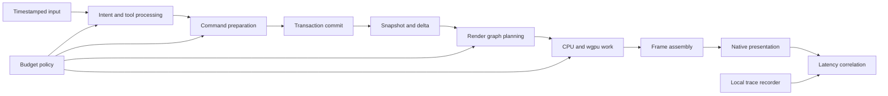
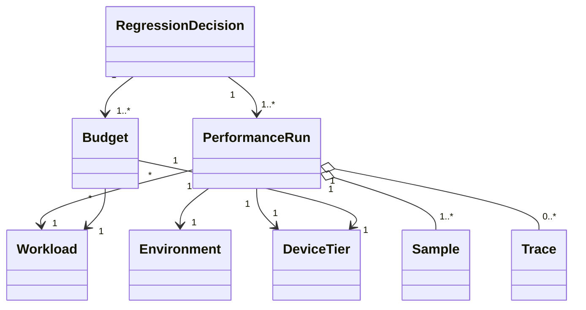
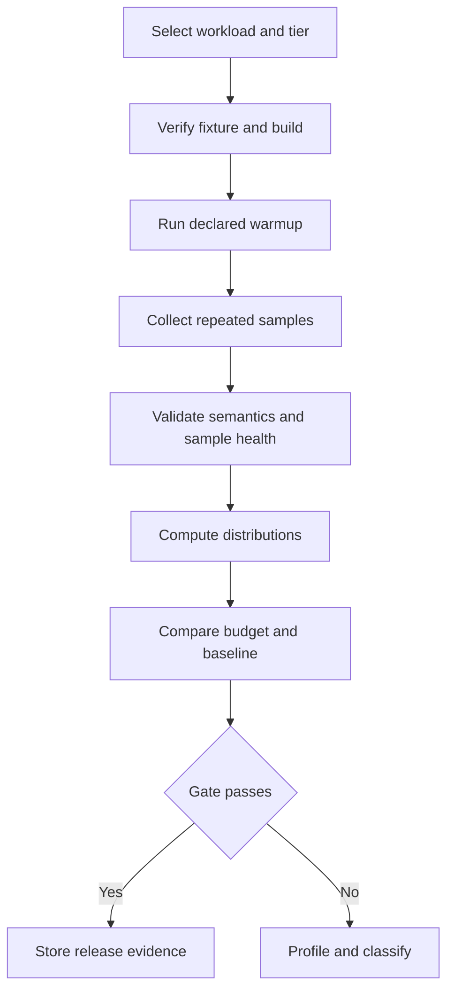
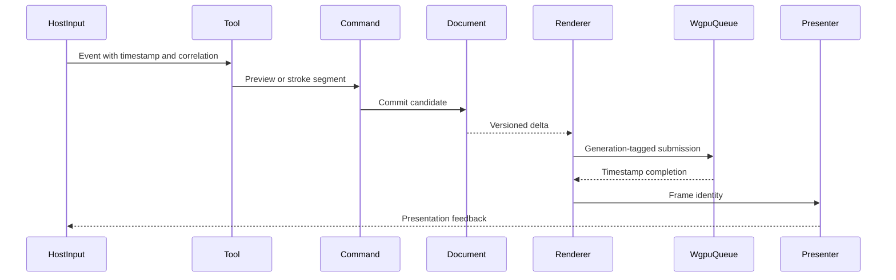
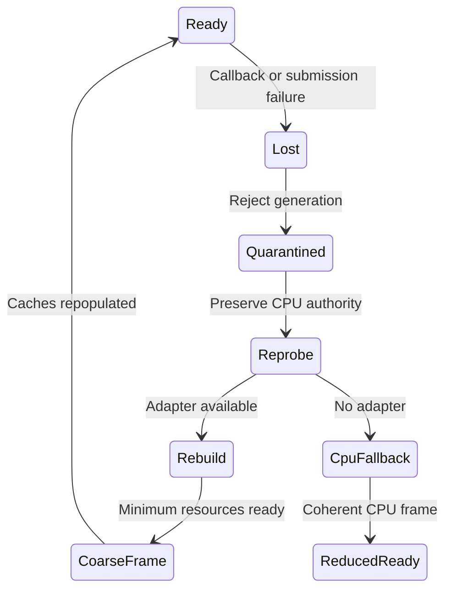

# 30 — Performance

## Overview

Performance in PhotoTux is an observable contract joining input, commands, immutable document versions, rendering, persistence, and native presentation. It is not a collection of isolated micro-optimizations. A fast shader does not compensate for an unbounded command queue; a high average frame rate does not compensate for input stalls; a rapid cold start that delays recovery discovery is not acceptable startup. Performance work **MUST** preserve document integrity, color correctness, deterministic transaction meaning, accessibility, and explicit cancellation.

This specification defines provisional measurable budgets, workload corpus, benchmark methods, local tracing, CPU/GPU profiling, scheduling and backpressure, cache and tile tuning, device tiers, regression gates, device-loss behavior, and power/thermal policy. Thresholds are hypotheses until promoted by an architecture decision supported by measurements. Reports **MUST** state hardware, software, fixture, build, sample count, confidence, and limitations. Normal measurement and operation remain local-first; no cloud telemetry, account, AI, generative service, or proprietary workflow is permitted.

Normative terms follow [Requirement Keywords](Appendix/Requirement-Keywords.md). Architecture and vocabulary follow [00 — Introduction](00-Introduction.md), [08 — Command System](08-Command-System.md), [10 — Document Model](10-Document-Model.md), and [17 — Rendering Engine](17-Rendering-Engine.md).

## Responsibilities

The performance discipline **MUST**:

- define latency, throughput, frame pacing, memory, residency, power, and cancellation as separate dimensions;
- measure complete user workflows and subsystem stages using monotonic timestamps;
- retain raw local samples and distribution summaries rather than averages alone;
- publish provisional budgets with representative fixtures and device tiers;
- prevent UI-thread waits on filesystem I/O, shader compilation, GPU completion, codecs, or extension execution;
- keep authoritative document, history, save, and recovery capacity outside reconstructible cache pressure;
- bound queues, jobs, submissions, temporary allocations, snapshot leases, and diagnostic buffers;
- cancel or supersede stale work before reducing semantic correctness;
- make preview degradation explicit and keep final output within declared correctness tolerances;
- test cold, warm, cache-thrashing, memory-pressure, device-loss, and thermal conditions;
- correlate gesture, command, transaction, snapshot, graph, tile, submission, frame, and presentation;
- diagnose CPU, GPU, transfer, synchronization, allocation, lock, and I/O costs independently;
- treat regressions as release evidence failures when gates are exceeded;
- keep benchmarks reproducible without network access or private user documents.

It **SHOULD** optimize tail latency before peak throughput for interactive paths, use representative documents rather than synthetic kernels alone, and retain trend history as local CI artifacts. It **MAY** provide an opt-in local performance recorder and redacted diagnostic export. Instrumentation **MUST NOT** become a correctness dependency or expose pixels, names, paths, metadata, stroke coordinates, or sampled colors by default.

## Architecture



Performance policy is shared, but ownership remains distributed. Input owns acquisition timestamps. Command routing owns queue and commit timings. Document authority owns snapshot publication. Renderer owns graph, cache, submission, and frame timings. Host owns presentation feedback where available. A correlation identifier connects records without sharing mutable subsystem objects.

### Internal hierarchy

```text
Performance system
├── workload and fixture catalog
│   ├── documents and resource packs
│   ├── canonical input traces
│   ├── command and lifecycle scenarios
│   └── expected semantic outputs
├── budget registry
│   ├── interactive latency
│   ├── frame pacing
│   ├── startup and restore
│   ├── memory and cache
│   ├── import/export
│   └── power and thermal
├── benchmark harness
│   ├── controlled clocks and seeds
│   ├── warmup and repetition
│   ├── environmental capture
│   └── statistical analysis
├── observability
│   ├── structured spans
│   ├── counters and gauges
│   ├── CPU sampling/instrumentation
│   ├── wgpu timestamps and markers
│   └── local artifact writer
├── scheduling controls
│   ├── priorities and reservations
│   ├── bounded queues
│   ├── cancellation and supersession
│   └── pressure escalation
├── cache and tile tuning
├── regression comparison
└── release evidence
```

## Performance Object Relationships and Contracts



A `Workload` identifies corpus revision, initial state, deterministic seed, scripted actions, expected semantic digest, quality mode, and completion criterion. An `Environment` records build profile, revision, compiler, operating system, kernel, desktop/session, CPU topology and frequency policy, memory, storage class, wgpu backend, adapter, driver, display refresh, scale, power source, and thermal state. A `Budget` identifies metric, scope, statistic, threshold, tier, and provisional or promoted status. A `Sample` retains duration or quantity plus validity flags. A `RegressionDecision` records baseline, candidate, statistical result, threshold result, exceptions, and owner.

Conceptual contracts:

```rust
struct PerformanceSample {
    run: RunId,
    workload: WorkloadId,
    metric: MetricId,
    phase: PhaseId,
    value: FiniteQuantity,
    iteration: UInt32,
    quality: QualityState,
    validity: SampleValidity,
}

struct BudgetDefinition {
    metric: MetricId,
    workload: WorkloadSelector,
    tier: DeviceTier,
    statistic: Statistic,
    threshold: FiniteQuantity,
    status: BudgetStatus,
    rationale: Text,
}
```

These contracts do not freeze a benchmark framework, tracing crate, runtime, database, or CI vendor. Measurements use stable semantic IDs, not function names alone. A phase rename requires an adapter or baseline reset record; silent metric drift is forbidden.

## Provisional Performance Budgets

All thresholds in this section are provisional. They define validation targets, not unconditional product promises. Measurements **MUST** report p50, p95, p99 where sample size supports them, maximum, median absolute deviation or confidence interval, and excluded samples. Interactive budgets apply on the reference mid tier unless stated otherwise.

### Input to preview

- Pointer or pen event acquisition to first changed preview pixel **SHOULD** be at most 16 ms p95 and 25 ms p99 for the standard brush workload on a 60 Hz display.
- At 120 Hz, target **SHOULD** be 8.3 ms p95 when presentation path and adapter support it; failure to meet this does not permit semantic sample loss.
- Input normalization and tool-state processing **SHOULD** consume at most 1 ms p95.
- Brush dab planning before worker/GPU dispatch **SHOULD** consume at most 2 ms p95 per accepted batch.
- Cancellation of an uncommitted gesture **SHOULD** remove transient preview within one presented frame.
- Menu, toolbar, panel, shortcut, and accessible action activation **SHOULD** expose accepted, committed, or busy feedback within 100 ms.

Input-to-preview begins at the earliest host monotonic timestamp reliably associated with the event and ends at confirmed presentation feedback where available. If host presentation timing is unavailable, reports **MUST** label the endpoint as submit, acquire, or application-present rather than claiming photon latency. Synthetic event injection cannot substitute for native-device runs.

### Frame pacing

- Cached pan, zoom, rotation, and overlay-only navigation **SHOULD** sustain the display cadence up to 60 Hz on mid tier and 120 Hz on high tier.
- For 60 Hz, frame intervals **SHOULD** remain below 16.7 ms at p95 and 25 ms at p99 during a 10-second navigation trace.
- No more than 1% of intervals **SHOULD** exceed twice the target interval in a stable workload.
- Frame planning on CPU **SHOULD** remain below 3 ms p95 for cached navigation and below 6 ms p95 for ordinary dirty-tile updates.
- Presentation **MUST** prefer an older complete frame or explicit same-version progressive frame over an unlabeled mixed-version frame.
- Background export, recovery, thumbnail generation, or extension work **MUST NOT** increase interactive frame p95 by more than 20% without entering disclosed pressure mode.

Frames are evaluated by interval distribution, missed-deadline runs, longest consecutive misses, and interaction-to-frame age. Average frames per second alone is insufficient because alternating 5 ms and 28 ms frames appears acceptable while visibly stuttering.

### Startup and restore

- Process start to coherent shell **SHOULD** be below 1.5 s p50 and 2.5 s p95 on mid tier with warm filesystem cache, no restored documents, and built-in contributions only.
- Cold-cache start to coherent shell **SHOULD** be below 3.5 s p95 on mid tier SSD.
- Recovery discovery result **SHOULD** be available within 1 s for 100 bounded recovery headers and **MUST NOT** wait for GPU initialization.
- A first empty or loading workspace **SHOULD** become interactive before optional resource catalog indexing completes.
- Restoring one standard document to first coherent low-resolution frame **SHOULD** complete within 2.5 s warm and 5 s cold on mid tier.
- Shader and pipeline compilation **MUST NOT** block recovery decisions or native window input.

Startup traces separate process/bootstrap, configuration, registry construction, recovery scan, host probe, window creation, workspace reconciliation, document open, device creation, pipeline readiness, and first presentation. Preloading everything to improve later benchmarks while worsening coherent-shell time is rejected.

Two rules follow from the shipped shell's startup composition, where building the QML object graph dominates and the fixed engine/module cost sets the floor:

- Host construction **MUST NOT** perform blocking host discovery for data that only a specific panel consumes. Font family enumeration is the worked example: it is deferred behind an explicit request from the Character chrome, with a usable fallback list available immediately, because fontconfig enumeration alone cost roughly a third of host construction.
- Presentation surfaces that a typical session never opens — dialogs, the command palette, collapsed inspector groups — **SHOULD** defer construction to first use. Deferral must not be observable: values come from host state, not widget lifetime.

Measured on the reference workstation (release build, offscreen platform, median of seven runs), the deferral work above moved host construction from ~91 ms to ~3 ms and first interactive frame from ~643 ms to ~558 ms. Both sit inside the ADR-008 1,000 ms gate; the 250 ms stretch remains out of reach because the Qt/QML engine and Controls module floor alone is ~190 ms and the root object graph is the next largest term.

### Memory and cache

- Idle coherent shell **SHOULD** remain below 300 MiB resident memory on mid tier after initialization settles.
- Opening the standard 4k layered document **SHOULD** add no more than 2.0 times its unique authoritative decoded bytes to peak process residency during first full view.
- Reconstructible CPU caches **SHOULD** default to at most 20% of available physical memory, with configurable floor and cap.
- GPU caches **SHOULD** target at most 50% of a conservative adapter budget and **MUST** retain emergency headroom for current visible work and surface reconstruction.
- Temporary command/filter/codec memory **MUST** have per-operation and process hard limits.
- Save and recovery **MUST** retain reserved memory/worker capacity independent of render cache occupancy.
- Cache accounting error against allocator/device observations **SHOULD** stay within 10% for owned large allocations.
- A stable idle workload **MUST NOT** exhibit monotonic resident growth across 30 open/edit/close cycles after bounded allocator/cache settling.

Logical, resident, mapped, shared, GPU, temporary, snapshot, history, authoritative, and cache bytes are reported separately. Shared immutable chunks **MUST NOT** be counted as unique per owner without also reporting physical ownership.

### Large documents

The large-document target is a sparse 16,384 × 16,384, 16-bit RGBA document with 50 mixed layers, masks, effects, and a logical size exceeding configured GPU budget. It **MUST** open and navigate without full pixel residency.

- Structural open to coherent document registration **SHOULD** remain below 3 s warm and 8 s cold on mid tier when required manifests are local.
- First viewport low-resolution frame **SHOULD** appear within 2 s after registration.
- Visible final-quality settlement after an ordinary viewport jump **SHOULD** complete within 1 s p95 for cached source and 3 s p95 for cold local source.
- Panning across sparse empty regions **SHOULD** stay within frame pacing budget.
- Peak GPU residency **MUST** remain under configured hard budget; peak process residency **MUST** remain under configured process hard budget or fail with typed resource error.
- Opening or viewing **MUST NOT** materialize all layers, all pyramid levels, or all decoded chunks.

### Brush

The standard brush uses a 256-pixel analytic tip, pressure dynamics, 25% spacing, normal blend, 4096 × 4096 8-bit RGBA target, active selection, and 20 visible layers. The stress brush uses a 2048-pixel textured tip, high sample rate, 16-bit target, scatter, and multiple dirty tiles.

- Standard input-to-preview follows the 16 ms p95 target.
- Confirmed segment preparation to authoritative commit **SHOULD** remain below 50 ms p95.
- Commit critical section **SHOULD** remain below 4 ms p95 and **MUST** be bounded.
- A 10-second stroke at canonical sample rate **MUST** keep sample, dab, tile, and provisional queues within configured bounds.
- Stress workload may lower preview resolution or coalesce samples under geometric error policy, but **MUST** preserve confirmed geometry and disclose degradation.
- Cancellation observation in CPU loops **SHOULD** remain under 100 ms; GPU cancellation is bounded by one declared submission unit.

### Filters

- Parameter change to first preview tile for a local-radius filter **SHOULD** be below 100 ms p95.
- Visible-region preview completion for standard 4k document **SHOULD** be below 500 ms p95 on mid tier for common local filters.
- Full-document final execution may exceed interactive budget but **MUST** report progress by 250 ms and check cancellation at least every 100 ms of CPU work or tile/submission boundary.
- Global-reduction filters **MUST** declare memory and pass count before acceptance.
- Background filter preparation **MUST NOT** hold document mutation authority.
- CPU and wgpu path selection may differ by tier, but final semantic tolerance remains fixed.

### Import and export

- File selection acceptance to format identification **SHOULD** be below 100 ms for local regular files whose bounded probe is cached.
- Standard 4k lossless raster import **SHOULD** exceed 150 MiB/s decoded throughput on mid tier when codec and storage permit, while remaining allocation bounded.
- Native structural open **SHOULD** expose coherent document before optional thumbnails and indexes.
- Export acceptance **SHOULD** expose operation/progress within 100 ms and first encoded output within 500 ms for streamable formats.
- Standard 4k flattened export **SHOULD** complete within 2 s p95 on mid tier for uncompressed or moderate-compression delivery settings; codec-specific evidence refines this.
- Large export **MUST** stream under bounded memory, preserve interaction reservations, and observe cancellation at tile/chunk boundaries.
- Save/export throughput claims **MUST** distinguish rendering, color conversion, encoding, flush, verification, and atomic replacement.

## Device Tiers

Tiers describe capabilities, not vendors. Final thresholds require measured reference systems.

```text
Tier L — constrained
├── 4 physical CPU cores
├── 8 GiB system memory
├── integrated GPU with conservative 1 GiB usable budget
├── local SSD
└── 1920×1080 at 60 Hz

Tier M — reference
├── 8 modern physical CPU cores
├── 16–32 GiB system memory
├── integrated or discrete GPU with 4 GiB conservative budget
├── NVMe-class local storage
└── 2560×1440 at 60–120 Hz

Tier H — high
├── 12 or more modern CPU cores
├── 64 GiB system memory
├── discrete GPU with 8 GiB or greater conservative budget
├── fast NVMe storage
└── 4k display at 120 Hz where available
```

Adapter feature level, storage throughput, memory bandwidth, driver quality, and thermal envelope are recorded separately because nominal tier labels hide important variance. Tier L may use reduced default cache budgets and preview quality. It **MUST** retain correctness, save/recovery capacity, CPU fallback, and explicit unavailable status. Tier H does not authorize unbounded caching.

## Representative Corpus

The performance corpus **MUST** be versioned, deterministic, redistributable or locally generated, free of private user content, and accompanied by semantic checks. It includes:

1. **Empty shell:** no document, default workspace, built-in contributions.
2. **Standard photograph:** 4096 × 4096, 8-bit RGBA, ten raster layers, masks, one text layer, one local filter, embedded profile.
3. **High-depth photograph:** 8192 × 8192, 16-bit or floating RGBA, wide-gamut profile, 30 layers, masks, proof transform.
4. **Large sparse document:** 16k square, 50 mixed layers, sparse tiles, off-canvas content, filters and groups.
5. **Deep hierarchy:** at least 10,000 lightweight objects with nested groups for structural and accessibility projections.
6. **Brush trace:** timestamped pressure, tilt, discontinuity, and release samples with standard and stress presets.
7. **Filter suite:** point, local-radius, separable, transform, and global-reduction operations.
8. **Import set:** compressed raster, high-bit-depth, malformed-but-rejected controls, profile-heavy, metadata-heavy, and multi-frame sources.
9. **Export set:** flattened 8-bit, high-depth, alpha, profile conversion, large streaming, and cancellation.
10. **History pressure:** repeated tile edits, structural operations, checkpoints, compression, and spill.
11. **Multi-view:** two views of one document with different zoom, proof, display scale, and rapid navigation.
12. **Device recovery:** pipeline warmup followed by injected loss at upload, compute, readback, and present.

Corpus generators use pinned algorithms and seeds. Generated images include ramps, edges, noise, transparent colors, sparse patterns, and repeated structures needed to defeat accidental compression-only wins. Each fixture records logical and unique bytes, expected object counts, profiles, alpha, tile occupancy, and output digest/tolerance.

## Benchmarking Methodology

### Run discipline

A benchmark run **MUST**:

1. identify revision and dirty working-tree state;
2. build the intended optimized or diagnostic profile reproducibly;
3. capture environment and power/thermal state;
4. verify fixture semantic digests;
5. select cold, warm, steady-state, or pressure mode explicitly;
6. run correctness oracle before timing acceptance;
7. execute warmups not included in measured samples;
8. collect enough independent iterations for stated statistic;
9. retain failed/outlier samples with validity reasons;
10. emit machine-readable and human-readable local artifacts.

Cold-cache tests require a documented cache-control method and may need elevated host operations; unavailable control is reported rather than approximated silently. Warm tests repeat until pipeline, allocator, and filesystem behavior stabilizes. Startup runs use new processes. Interactive traces use real event timing where possible. A benchmark **MUST NOT** disable validation, color correctness, history retention, or recovery reservation unless measuring a clearly named experimental variant.

### Statistics

Latency uses distributions. Throughput uses median plus variability and total work. Frame pacing uses interval histogram, deadline misses, and consecutive misses. Memory uses time series, peak by class, end-state retained bytes, and leak slope. Regression comparison uses a robust method such as confidence intervals, bootstrap, or nonparametric test; exact method remains tooling-dependent.

At least 30 iterations are recommended for short stable microbenchmarks and at least 10 complete runs for expensive workflows. Long interactive traces should contain hundreds of frame/input samples but remain independent across process runs. A result with thermal throttling, background interference, device reset, fixture mismatch, or trace overflow is flagged. Outlier removal requires a predeclared rule and both raw and filtered summaries.

### Baselines

Baselines bind revision, compiler/toolchain, device tier, driver/backend, corpus revision, and metric schema. Comparing across changed drivers or corpus requires explicit bridge evidence. Baseline refresh is reviewed like a behavior change; it cannot erase a regression. Improvement claims report both absolute budget and relative change.



## Tracing and Correlation

Local traces use nested spans and asynchronous links. Required stages include input acquisition, event normalization, action resolution, command validation, queue wait, preparation, commit wait, commit, snapshot publication, render invalidation, graph planning, tile queue wait, CPU execution, upload, GPU submission, GPU completion when available, assembly, surface acquisition, present request, and presentation feedback.

Each span records stable stage ID, start/end monotonic time, correlation ID, document/version where safe, operation/request/frame identity, queue depth, work counts, byte counts, quality state, cancellation state, CPU thread role, and device generation. It omits payloads. Trace buffers are bounded ring buffers. On overflow they count dropped records and preserve critical terminal events; they never backpressure input or correctness paths.



Clock domains are calibrated. GPU timestamps cannot be subtracted directly from CPU times without a supported mapping. Host event timestamps may have different origin. Reports identify unavailable stages rather than inventing precision.

## CPU Profiling

CPU diagnosis combines wall-clock span attribution, statistical sampling, allocation profiling, lock/queue instrumentation, and targeted counters. Sampling identifies hot instruction paths with low perturbation. Instrumentation measures short stages, queue waits, and known boundaries. Allocation profiling identifies churn, peak temporary ownership, and retained growth.

Profiles **SHOULD** distinguish:

- useful compute from waiting, spinning, sleeping, and scheduler delay;
- user/UI thread from document executor, render coordinator, worker, I/O, and extension roles;
- exclusive from inclusive cost;
- cold parser/pipeline initialization from steady state;
- allocator contention from algorithm cost;
- lock hold time from lock wait time;
- copying, decompression, color conversion, raster kernels, graph planning, and serialization;
- cancellation cleanup and stale discarded work.

Flame graphs or call trees are analysis artifacts, not stable metrics. Function names can change while semantic stages remain. Optimizing CPU utilization upward is not itself success: busy-waiting and speculative work can consume all cores while worsening latency and power. Worker count tuning **MUST** include interaction, export, save, and thermal scenarios.

## GPU and wgpu Profiling

wgpu profiling uses debug markers, pass labels, timestamp queries where supported, pipeline statistics where portable and useful, submission IDs, resource byte accounting, and backend-native tools only as supplementary evidence. Core evidence **MUST** remain understandable without one proprietary profiler.

GPU analysis separates:

- pipeline creation and shader compilation;
- bind/resource preparation;
- CPU command encoding;
- queue submit delay;
- upload and readback bytes;
- compute and render pass duration;
- inter-pass dependencies and barriers;
- surface acquire/present waits;
- texture/buffer residency and churn;
- atlas/pool fragmentation;
- device loss or validation errors;
- CPU fallback or multipass selection.

A pass label includes semantic node family, behavior version, quality, tile count, format, and device generation without document content. Timestamp availability is a capability; lack of it does not disable rendering. Timestamp readback runs asynchronously and **MUST NOT** stall the measured frame. Queries are sampled when overhead matters.

GPU occupancy estimates alone cannot prove speed. Small dispatch proliferation, transfer synchronization, pipeline switches, and oversized halos often dominate. Fusion is accepted only with output equivalence, bounded temporary memory, cancellation granularity, and cache effects measured.

## Scheduling, Backpressure, and Cancellation

The scheduler protects user intent and durability:

```text
Highest urgency
├── native input acquisition and capture safety
├── transient active-tool preview
├── short document commits
├── visible current-view rendering
├── save and recovery reserved work
├── user-requested foreground filters/import/export
├── offscreen prefetch and secondary views
├── thumbnails and indexes
└── speculative cache/pyramid work
Lowest urgency
```

Priority is not unrestricted preemption. A GPU submission already executing may complete; CPU work checks cooperative cancellation. Work units **MUST** be bounded so higher-priority work gains service. Priority aging prevents valid foreground jobs from starvation but never raises speculative work above input or critical durability.

Queues declare item and byte limits, admission policy, coalescing key, cancellation behavior, and overload result. Latest-only view transforms coalesce. Progress events coalesce by operation. Stale render requests cancel. Brush samples coalesce only under geometric and dynamics-preservation rules. User mutation commands are never silently dropped. Queue saturation returns typed pressure, pauses producer, or sheds declared derived work.

Cancellation tokens form session, document/view, operation, request, and subjob hierarchy. CPU loops check at time/work bounds. GPU jobs bind a device/request generation; late completion is discarded. Cancellation before commit leaves no authoritative state. During bounded commit, outcome is committed. Save after atomic replacement reports success. Cancellation latency is measured from request to final acknowledgment and resource release separately.

## Cache and Tile Tuning

Tuning is evidence-driven because tile geometry trades scheduling overhead, halo amplification, cache locality, transfer granularity, parallelism, and wasted visible work. Candidate dimensions **MUST** be evaluated across brush, local filter, transform, compositing, zoom, sparse documents, export, and constrained GPU limits. No one synthetic convolution selects global tile size.

Metrics include:

- cache hit ratio by class and workload;
- useful-hit byte ratio;
- eviction and immediate re-fetch rate;
- dirty-area to processed-area amplification;
- halo bytes and redundant edge computation;
- tile job count and median cost;
- upload granularity and row-padding waste;
- intermediate lifetime and peak;
- cross-view sharing and fairness;
- lock/metadata overhead per tile;
- cold-to-visible latency;
- device-loss rebuild cost.

Cache keys include document/object/resource revisions, graph behavior, tile coordinate/level, color/alpha/precision, filter parameters and halo, transform policy, proof/display context, quality, and device generation. A high hit rate with incomplete keys is corruption, not performance. Admission may reject one-use large intermediates. Eviction considers rebuild cost, recency, visibility, lease, size, and fairness; no cache decision changes semantic output.

Soft budgets trigger eviction and quality adaptation. Hard budgets block admission or return typed failure. Cache resizing under pressure is gradual enough to avoid eviction storms. Per-view quotas prevent a hidden 4k view from consuming all final-frame cache. Pipeline and color-transform caches have count and byte caps because small entry counts can hold large driver allocations.

## Large-Document Strategy

Large-document performance depends on sparse authoritative manifests, lazy verified chunk materialization, immutable snapshot sharing, region-demand graph resolution, tile pyramids, streaming codecs, and bounded history. Full-document scans require explicit operation class and progress. Opening validates required structure but may defer optional and nonvisible resource decoding.

Viewport planning requests selected pyramid level, visible tiles, then bounded margin. Fast motion cancels obsolete margins first. Dirty propagation is conservative but spatially bounded where semantics allow. Global adjustment nodes disclose full-scope cost. Save captures a stable manifest and streams chunks without decoding unchanged resources unnecessarily. Export streams semantic output tiles to codec.

Benchmarks vary sparsity, compression, layer visibility, zoom, transforms, masks, local/global filters, and storage cache. A huge empty canvas is not representative alone. Reports include logical dimensions and bytes, occupied tiles, required manifests, resident bytes, and processed dirty amplification.

## Device Loss and Recovery Performance

Device loss is both reliability and latency scenario. Recovery trace begins at callback or failed submission and ends at first coherent frame from replacement GPU or CPU fallback. Budgets are provisional:

- loss detection to visible persistent status **SHOULD** be below 250 ms;
- stale generation quarantine **MUST** occur before any later completion publication;
- save/document inspection **SHOULD** remain responsive within ordinary action budget;
- replacement probe **SHOULD** be bounded to 2 s before reporting continued recovery;
- first reduced/coarse coherent frame **SHOULD** appear within 5 s on mid tier when a compatible adapter exists;
- repeated losses **MUST** stop automatic retries after a bounded policy.



Recovery does not eagerly rebuild every cache. It rebuilds surfaces, common pipelines, display color, visible source/composite tiles, and active preview in priority order. Performance evidence injects loss during upload, compile, compute, render, readback, and present, and checks resource cleanup and stale callbacks.

## Power and Thermal Behavior

Maximum throughput is inappropriate during idle, battery operation, thermal pressure, minimized windows, or background export. Host adapters may report power and thermal hints; portable policy interprets them without depending on one Linux service.

PhotoTux **MUST**:

- cease continuous redraw when content, overlays, and animations are unchanged;
- suspend zero-sized/minimized surface rendering;
- cap speculative prefetch, thumbnail, index, and pipeline warming under pressure;
- avoid busy polling for queue/device completion;
- preserve save/recovery reservations;
- keep semantic quality explicit if preview quality changes;
- measure long workloads after thermal steady state;
- record power mode in benchmark environment.

It **SHOULD** reduce worker concurrency and frame cadence for background noninteractive work on battery or thermal pressure, while allowing explicit user foreground completion. Frame-on-demand is preferred for static editing surfaces. Animated overlays honor reduced motion and pause when not visible. A power policy cannot lower final export precision, skip durability, or alter committed filter/brush semantics.

Thermal tests run at least 15 minutes of mixed brush, navigation, and filter/export activity. Evidence records frequency throttling where observable, frame/latency drift, throughput, and surface temperature/power only when safely available. A five-second burst result is not representative sustained performance.

## Regression Gates

Gate classes:

1. **Correctness gate:** semantic digest/tolerance, invariants, and leak cleanup pass. Any failure blocks performance interpretation.
2. **Absolute budget gate:** promoted threshold **MUST** pass; provisional threshold creates review evidence.
3. **Relative regression gate:** candidate change beyond configured percent and statistical confidence requires investigation.
4. **Tail gate:** p95/p99 or worst-run regression can fail even when median improves.
5. **Memory gate:** peak hard budget or retained-growth regression fails.
6. **Frame gate:** missed-deadline bursts and long stalls are independently bounded.
7. **Power gate:** sustained activity cannot introduce uncontrolled idle/background utilization.

Initial relative guardrails are 5% for stable microbenchmarks, 10% for end-to-end latency/throughput, and 10% or 64 MiB, whichever is more meaningful, for peak memory. These are provisional and noise-calibrated per workload. Improvements in one metric do not automatically compensate for regressions in another. A change that makes median brush preview faster but doubles p99 or memory fails review.

Quarantining a benchmark requires an owner, observed instability, evidence, scope, and expiry/review date. Quarantined results remain visible and do not count as pass. Hardware-lab variation can use tier-specific baselines; CI without stable devices runs correctness and structural budgets while scheduled controlled hardware produces performance release evidence. No vendor-hosted service is assumed.

## Workflows

### Diagnose input latency

1. Reproduce canonical native brush trace and capture end-to-end correlation.
2. Verify presentation endpoint availability and clock mapping.
3. Separate host dispatch delay, tool processing, preview planning, queue wait, GPU execution, and present delay.
4. Inspect p95/p99 samples, not median trace alone.
5. Check stale work, queue depth, shader compilation, allocations, and lock waits.
6. Form one hypothesis and change one policy.
7. Re-run correctness, cold/warm, standard/stress, and power scenarios.
8. Record tradeoff and baseline impact.

### Tune a tile candidate

1. Declare candidate geometry, border, and storage/compute distinction.
2. Run corpus across brush, filters, transforms, composite, navigation, and export.
3. Measure job count, amplification, halo, transfer, cache, peak memory, and cancellation.
4. Compare device tiers and CPU fallback.
5. Inject memory pressure and device loss.
6. Reject candidate with correctness seam, hard-budget breach, or pathological workload.
7. Capture decision in ADR before freezing format-visible assumptions.

### Investigate memory growth

1. Record class-accounted time series across repeated open/edit/close.
2. Force bounded cache trim and compare expected release.
3. Inspect snapshot, history, operation, GPU completion, extension, and host leases.
4. Distinguish allocator retention from reachable object growth.
5. Assert registry/lease counts after quiescence.
6. Fix ownership root, then add deterministic lifecycle test.

### Review a performance-sensitive change

The author identifies affected semantic stages and budgets, supplies before/after runs, validates corpus output, reports device tiers and uncertainty, and explains cache/memory/power effects. Reviewer checks whether work was shifted, hidden, made stale, or moved outside measured endpoint.

## Design Rationale, Alternatives, and Tradeoffs
**Tail latency versus average throughput.** Raster workloads benefit from throughput, but users feel stalls. Interactive policy prioritizes bounded p95/p99 while export policy can maximize sustained throughput under reservations.

**Instrumentation versus sampling.** Instrumentation gives precise semantic stages but perturbs hot paths. Sampling has lower semantic precision. PhotoTux uses bounded spans plus sampling and calibrates overhead.

**GPU-first versus GPU-only.** GPU execution supports interactive compositing and filters. CPU reference/fallback costs engineering but enables headless tests, unsupported adapters, and device recovery.

**Aggressive caching versus bounded reconstruction.** Larger caches improve warm results but threaten history, saves, and system stability. Explicit soft/hard budgets and admission protect authority.

**Fixed tiles versus adaptive work units.** Fixed storage tiles simplify identity and persistence; adaptive compute tiles may fit kernels/devices. Contracts may distinguish them. Hidden dependence between persisted layout and one GPU is rejected.

**Prewarming versus startup latency.** Prewarming common pipelines reduces first-use stalls but consumes startup, memory, and power. Only measured common pipelines may warm after coherent shell; all others compile asynchronously on demand.

**Newest-only rendering versus completing queued frames.** Completing obsolete frames wastes latency and energy. Cancellation favors newest applicable view generation while retaining last coherent frame.

**Machine-specific autotuning versus stable defaults.** Autotuning can improve diverse hardware but introduces startup cost and reproducibility risk. Bounded local tuning may select among semantically equivalent validated profiles; selected policy and evidence remain inspectable.

## Anti-Patterns

- Reporting average FPS without frame intervals.
- Timing only kernel execution while excluding transfer, queue, and presentation.
- Using GPU or render caches as authoritative content.
- Unbounded worker, tile, upload, readback, or progress queues.
- Compiling shaders while document authority or UI thread waits.
- Treating all CPU cores as available to background work.
- Raising thread count until one isolated benchmark improves.
- Dropping confirmed user mutation under overload.
- Applying a stale prepared result to latest state.
- Cache keys missing profile, alpha, behavior, quality, or generation.
- Measuring only warm caches or only tiny documents.
- Hiding degraded preview quality from state and traces.
- Rebuilding every cache immediately after device loss.
- Allowing export to consume save/recovery reservations.
- Retaining diagnostic traces without bounds or redaction.
- Ignoring thermal throttling and power mode.
- Updating baseline to make a regression disappear.
- Micro-optimizing code before locating end-to-end bottleneck.
- Using sleep-based benchmarks without semantic completion.
- Comparing different corpus, driver, compiler, or metric schema as equivalent.
- Counting shared memory repeatedly or omitting driver-visible GPU allocations.
- Claiming latency to photons from application submit time.

## Best Practices

- Begin with a complete workflow trace and correctness oracle.
- Optimize stale work away before optimizing useful work.
- Keep commits short; prepare outside authority.
- Use monotonic clocks and explicit clock-domain mapping.
- Include quality state and generation in every frame sample.
- Reserve resources for durability.
- Make queue depth and bytes visible.
- Use deterministic seeds and canonical input traces.
- Measure cold, warm, pressure, and recovery states.
- Prefer spatial invalidation over full recomputation.
- Tune tile geometry across workload families.
- Measure both useful cache hits and re-fetch churn.
- Keep CPU and GPU reference endpoints comparable.
- Profile allocations and synchronization, not only compute.
- Validate idle utilization and sustained thermal behavior.
- Store raw results beside summaries.
- Document exceptions with expiry and owner.

## Future Extensibility

Future performance work may add platform hosts, alternate wgpu backends, virtual-texture strategies, new graph nodes, additional device tiers, local batch hosts, or extension compute services. Each addition **MUST** define semantic completion, budgets, queue/cancellation, memory ownership, CPU/reference behavior, device-loss handling, power behavior, corpus fixtures, and regression gates.

An optional local tuner may select tile work size, worker concurrency, prefetch, and pipeline variant from a finite validated set. It **MUST NOT** change output semantics, disable safeguards, upload measurements, depend on identity/account, or make benchmark results irreproducible. Stable configuration records selection and can be reset.

Remote benchmarking, telemetry collection, cloud rendering, AI-guided scheduling, generated assets, and proprietary profiling requirements remain outside scope. User-initiated redacted trace export may support issue diagnosis, but local operation is complete without it.

## Acceptance Criteria

- Provisional budgets exist for input-to-preview, frame pacing, startup, memory/cache, large documents, brush, filters, and import/export.
- Every budget identifies workload, statistic, device tier, and measurement endpoint.
- Representative corpus is deterministic, versioned, privacy-safe, and semantically verified.
- Benchmark reports capture environment, repetitions, distributions, invalid samples, and confidence.
- End-to-end traces correlate input through command, snapshot, wgpu, frame, and presentation.
- CPU profiling distinguishes compute, wait, allocation, lock, queue, and stale work.
- GPU profiling distinguishes encode, transfer, submit, execution, readback, surface, pipeline, and residency.
- All queues and caches have item/byte bounds and pressure policy.
- User mutations are never silently dropped; stale derived work cancels first.
- Cancellation follows pre-commit, commit, GPU submission, save-replace, and cleanup boundaries.
- Large documents operate under CPU/GPU hard budgets without full residency assumptions.
- Tile/cache tuning measures amplification, halo, hit utility, memory, tiers, and device loss.
- Device-loss tests preserve document authority and reach bounded coherent fallback/recovery.
- Idle, battery, background, reduced-motion, and sustained thermal behavior are measured.
- Regression gates protect correctness, absolute budgets, tail latency, memory, frame pacing, and power.
- Release evidence requires no cloud service, account, proprietary tool, AI, or generative workflow.

## Cross References

- [00 — Introduction and System Charter](00-Introduction.md) — quality targets and architecture invariants.
- [02 — Application Lifecycle](02-Application-Lifecycle.md) — startup, restore, shutdown, and device recovery.
- [08 — Command System](08-Command-System.md) — scheduling, commit, queues, and cancellation.
- [10 — Document Model](10-Document-Model.md) — snapshots, authority, large resources, and memory classes.
- [14 — Brush Engine](14-Brush-Engine.md) — input, preview, tile preparation, and segment commits.
- [15 — Filter Engine](15-Filter-Engine.md) — ROI, halo, compute, and preview/final quality.
- [16 — Color Management](16-Color-Management.md) — transform caches and CPU/wgpu tolerance.
- [17 — Rendering Engine](17-Rendering-Engine.md) — frame scheduling, tiles, caches, and device loss.
- [20 — History and Undo](20-History-Undo.md) — retention budgets and checkpoints.
- [22 — Import and Export](22-Import-Export.md) — staged streaming workflows.
- [23 — Plugin SDK](23-Plugin-SDK.md) — extension quotas and isolation.
- [27 — File Formats](27-File-Formats.md) — native streaming, chunking, and large-document persistence.
- [29 — Accessibility](29-Accessibility.md) — response, progress, event, and reduced-motion requirements.
- [31 — Testing](31-Testing.md) — performance, deterministic, cross-GPU, and release tests.
- [32 — Developer Guide](32-Developer-Guide.md) — implementation workflow and conformance.
- [Glossary](Appendix/Glossary.md) — canonical terms.
- [Requirement Keywords](Appendix/Requirement-Keywords.md) — normative interpretation.
