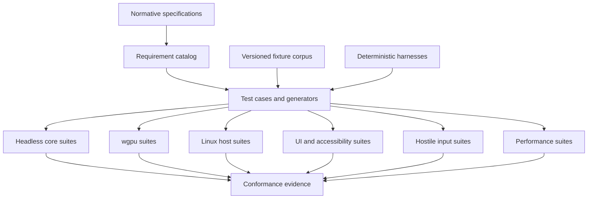
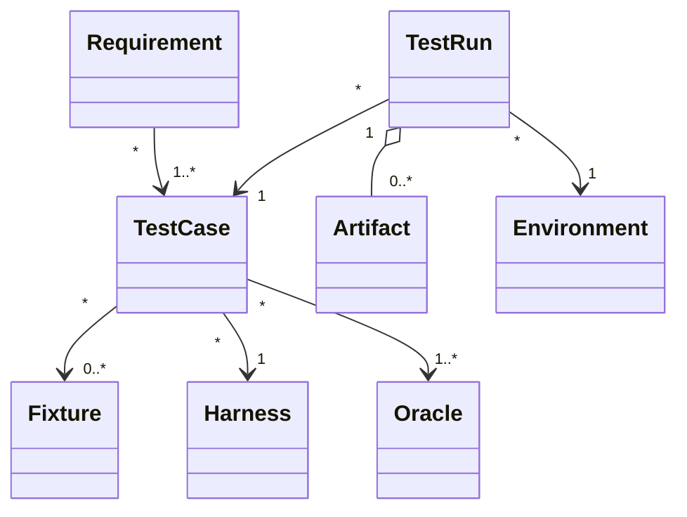
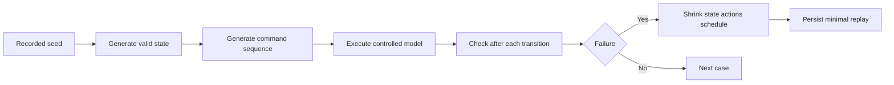
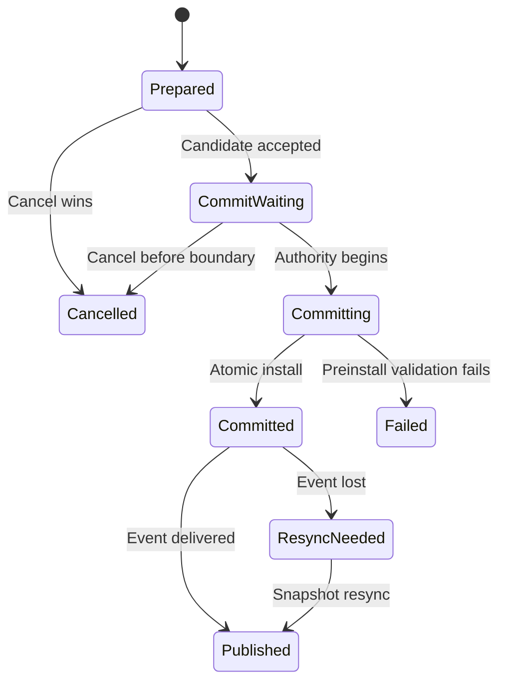
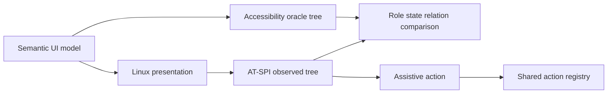
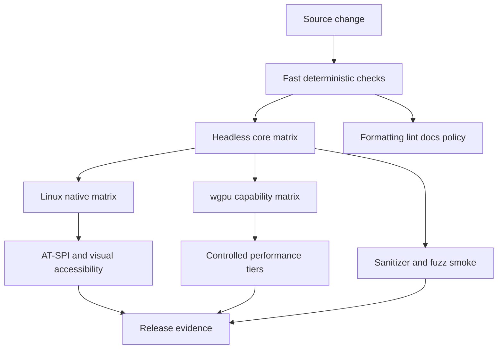

# 31 — Testing

## Overview

PhotoTux testing proves semantic correctness, document integrity, deterministic boundaries, recoverability, performance, accessibility, and cross-device behavior. Tests are not limited to UI automation or happy-path examples. The primary verification surface is the headless cross-platform core: commands create transactions, transactions evolve authoritative document versions, snapshots feed rendering and persistence, and failures leave known preserved state. Native Linux integration, wgpu execution, and user-facing workflows add focused layers around that core.

This handbook defines test taxonomy and pyramid, fixtures, unit/property/fuzz/contract/integration/UI/accessibility/performance/golden/color/cross-GPU testing, deterministic seeds and tolerances, hostile files and plugins, crash recovery, concurrency and model checking, CI matrix concepts, flaky-test policy, and release evidence. It does not select a test framework, CI vendor, fuzzing service, UI toolkit, async runtime, or final packaging system. Tool choices remain subject to architecture validation.

Testing remains local-first. Required suites **MUST** run without accounts, cloud services, remote telemetry, AI, generative systems, or proprietary workflows. Network isolation is a valid test environment, not an exceptional mode. Normative words follow [Requirement Keywords](Appendix/Requirement-Keywords.md); canonical terms follow the [Glossary](Appendix/Glossary.md).

## Responsibilities

The test system **MUST**:

- verify every persistent mutation through command, transaction, history, version, and snapshot contracts;
- run core document, command, history, format, and CPU-reference tests without window system or GPU;
- validate success, rejection, cancellation, stale applicability, resource pressure, and injected failure;
- test object identity, graph, color, alpha, coordinate, precision, persistence, and recovery invariants;
- use deterministic seeds, clocks, schedulers, ordering, locales, and fixture identities where applicable;
- define exact comparisons or explicit numeric/image tolerances before accepting optimized paths;
- treat files, profiles, fonts, presets, clipboard payloads, extension messages, and persisted history as hostile input;
- test wgpu feature tiers, CPU fallback, device loss, surface loss, and cross-GPU variance;
- cover keyboard, semantic accessibility tree, AT-SPI mapping, contrast, scaling, reduced motion, and assistive workflows;
- keep fixture provenance, schemas, generators, expected outcomes, and privacy policy versioned;
- detect leaks in snapshots, leases, GPU generations, operations, files, processes, subscriptions, and focus nodes;
- quarantine flaky tests only under explicit bounded policy;
- produce reproducible release evidence independent of one CI service.

It **SHOULD** place most cases below the UI layer, generate valid and invalid state spaces, use differential/reference oracles, and make failure artifacts small and replayable. It **MAY** include manual exploratory and assistive-technology sessions, but manual evidence cannot replace automatable invariants.

## Architecture



Requirements map to stable test identifiers. One test may cover several requirements, but coverage **MUST** remain inspectable. Passing code coverage does not establish requirement coverage. Test-only APIs expose semantic state, controlled scheduling, and fault injection without changing production behavior.

### Internal hierarchy

```text
Verification system
├── requirement and acceptance catalog
├── fixture corpus
│   ├── semantic documents
│   ├── raster/color images
│   ├── command and input traces
│   ├── native/third-party files
│   ├── hostile payloads
│   ├── extension packages/protocol streams
│   └── expected semantic/golden results
├── deterministic harnesses
│   ├── fake clock and scheduler
│   ├── in-memory staged filesystem
│   ├── fake host and lifecycle events
│   ├── CPU reference renderer
│   ├── wgpu adapter/device harness
│   ├── extension supervisor harness
│   └── accessibility semantic oracle
├── test layers
│   ├── unit and component
│   ├── property and model
│   ├── fuzz and hostile corpus
│   ├── contract and compatibility
│   ├── integration and workflow
│   ├── UI/accessibility
│   ├── golden/color/cross-GPU
│   └── performance and endurance
├── artifact and minimization services
├── quarantine registry
└── release evidence assembler
```

## Test Pyramid and Taxonomy

The pyramid expresses preferred quantity and diagnosis cost, not importance:

```text
                    ┌──────────────────────────┐
                    │ Manual release journeys │
                 ┌──┴──────────────────────────┴──┐
                 │ UI, AT-SPI, native host tests  │
              ┌──┴────────────────────────────────┴──┐
              │ Workflow and subsystem integration   │
           ┌──┴───────────────────────────────────────┴──┐
           │ Contract, compatibility, golden, cross-GPU │
        ┌──┴──────────────────────────────────────────────┴──┐
        │ Property, model, concurrency, fuzz, hostile input  │
     ┌──┴─────────────────────────────────────────────────────┴──┐
     │ Unit, pure component, schema, math, state-machine tests   │
     └───────────────────────────────────────────────────────────┘
```

Unit tests verify bounded pure behavior. Property tests explore classes of states and sequences. Fuzz tests attack parsers and state transitions with generated bytes/actions. Contract tests ensure subsystem interfaces and adapters preserve semantics. Integration tests connect real components under controlled resources. UI tests verify presentation/action equivalence and native interactions. Accessibility tests verify semantic trees and real Linux bridges. Performance tests enforce budgets. Golden tests compare stable semantic/render outputs. Endurance tests expose leaks and thermal/resource drift.

The suite **MUST NOT** invert the pyramid by expressing every command through pointer coordinates. UI automation is slow, fragile, and weak at invariant diagnosis. Conversely, headless tests cannot prove actual AT-SPI mapping, Wayland input, native surface behavior, or frame presentation; those require targeted upper layers.

## Object Relationships and Test Contracts



Conceptual metadata:

```rust
struct TestDescriptor {
    id: TestId,
    category: TestCategory,
    requirements: BoundedSet<RequirementRef>,
    fixtures: BoundedList<FixtureRef>,
    determinism: DeterminismPolicy,
    capabilities: CapabilityRequirements,
    timeout: Duration,
    isolation: IsolationPolicy,
}

struct FailureReplay {
    test: TestId,
    corpus_revision: CorpusRevision,
    seed: Seed,
    schedule: Optional<ScheduleTrace>,
    environment: EnvironmentFingerprint,
    minimized_input: Optional<ArtifactRef>,
}
```

Metadata schemas remain framework-neutral. A failure artifact **MUST** contain enough information to reproduce locally or state why exact reproduction depends on unavailable hardware. It **MUST NOT** include private user content or ambient machine secrets.

## Headless Core

The core test harness constructs documents, invokes actions/commands, controls transactions, consumes snapshots, renders CPU reference tiles, serializes formats, and exercises history without UI, native window, GPU, desktop service, or filesystem path authority. File access uses in-memory or temporary capability adapters. Clocks, seeds, and scheduling are injectable.

Minimum headless workflow:

1. create a document through `document.create`;
2. add and modify layers through commands;
3. paint or replace bounded raster tiles;
4. create selections and masks;
5. apply filter and color operations;
6. undo and redo;
7. acquire coherent snapshots;
8. save through staged writer;
9. reopen through hostile-input validator;
10. compare semantic state and reference rendering;
11. inject cancellation/failure at every boundary;
12. verify leases/resources reach expected end state.

No test may gain mutable document access merely for convenience when production code cannot. Test builders may create validated initial fixtures efficiently, but mutation behavior under test **MUST** enter command authority. Invalid-state constructors are isolated to validator tests and clearly marked.

## Unit and Component Tests

Unit tests target:

- checked arithmetic for dimensions, offsets, strides, tile indices, and byte products;
- stable ID allocation, generation checks, canonical ordering, and namespace rules;
- coordinate transforms, bounds, finite validation, and conservative expansion;
- alpha equations, blend functions, transfer curves, interpolation, and rounding;
- brush stabilization, spacing residual, random channels, dab generation, and discontinuities;
- filter ROI/halo mapping and parameter validation;
- graph topological ordering, cycle detection, and cache-key completeness;
- command schemas, enablement, conflict policies, and error classifications;
- transaction forward/inverse consistency;
- history coalescing, branch replacement, and budget accounting;
- container headers, chunk references, checksum handling, migration steps;
- capability scope, expiry, revocation, and protocol framing;
- accessibility names, roles, states, relationships, and event coalescing.

Tests use small values and exact expectations where semantics are discrete. Each boundary has zero, one, maximum valid, first invalid, negative where representable, non-finite, overflow, empty, duplicate, stale, missing, and unknown enum cases. Panics on untrusted or user-controlled input are failures.

## Property-Based Testing

Property tests generate valid documents and command sequences, not arbitrary structs that violate all preconditions immediately. Generators build canvas, object graphs, resources, selections, masks, history, and color metadata under explicit size caps. Shrinkers preserve enough validity to minimize meaningful failures.

Core properties:

- every committed mutation advances document version exactly once;
- failed or pre-commit-cancelled commands leave semantic snapshot unchanged;
- object IDs remain stable under reorder and property edits;
- containment remains rooted, single-parent, and acyclic;
- snapshots are coherent and immutable;
- forward then inverse restores semantic state where exact;
- undo/redo versions are monotonic;
- cache-cold and cache-warm output are equivalent;
- tile partition choices produce equivalent final output;
- worker completion order does not change deterministic results;
- save/reopen preserves native semantic state and safe opaque data;
- serialization order is canonical where promised;
- CPU and wgpu results satisfy declared tolerances;
- cancellation and cleanup are idempotent;
- no generated bounded input causes panic or unbounded allocation.



Model-based tests maintain a simpler reference representation for layer order, selection sets, property values, or history cursor. They compare semantic outcomes after every operation. Reference models avoid sharing implementation code that could reproduce the same bug.

## Fuzz Testing

Fuzz targets accept bounded raw bytes or structured operation streams. Persistent fuzz corpora store minimized cases and regression labels. Fuzzing **MUST** include:

- native container header, manifest, chunk graph, compression, resources, history, and migration;
- third-party probe and decoder adapter boundaries;
- profile, font, brush preset, metadata, clipboard, and extension manifest parsing;
- extension protocol frames, capability tokens, semantic panel models, and raster streams;
- command parameter schemas and unknown versions;
- document graph validation and typed references;
- history forward/inverse records;
- shader input descriptors and dispatch dimensions, not arbitrary untrusted shader source;
- action and accessibility tree deltas;
- normalized input and gesture sequences;
- save/recovery catalog readers.

Targets enforce byte, allocation, depth, count, time, and output limits. Sanitizer/debug configurations catch memory, integer, race, and undefined-behavior faults where tooling supports them. A timeout is a failure artifact, not silently discarded. Fuzz targets never access network or arbitrary host files.

Coverage-guided tools are useful but not required by contract. Corpus quality is measured by semantic feature coverage, parser states, schema versions, error categories, and known historical bugs, not line coverage alone. Every security- or integrity-relevant fuzz discovery becomes a deterministic regression test.

## Contract Testing

Contract tests verify substitutable implementations and adapter boundaries. Each implementation runs the same suite where applicable.

### Command and transaction contract

Verify schema validation, capability checks, version conflict, preparation, commit atomicity, history registration, publication order, cancellation, stale results, queue pressure, and structured outcomes. Presentations from menu, toolbar, shortcut, panel, context menu, accessibility, and extension broker must resolve equivalent command semantics.

### Snapshot consumer contract

Render, save, export, analysis, and extensions receive immutable coherent versions. Tests drop deltas, expire leases, reorder notifications, and request old snapshots. Consumers must resynchronize or reject, never combine incompatible roots/resources.

### Host adapter contract

Fake and Linux adapters receive duplicate, missing, delayed, and reordered lifecycle/input/display events. They expose normalized values and opaque capabilities without making policy decisions. Window/surface destruction cannot close documents implicitly.

### Renderer node contract

Every core node declares formats, color/alpha, bounds, ROI/halo, deterministic behavior, CPU reference, wgpu tiers, fallback, cancellation, and cache key. Conformance suite compares direct full-region evaluation with tiled and incremental evaluation.

### Codec contract

Probe is bounded. Decode returns quarantined semantic package. Encode consumes stable snapshot/stream and staged destination. Crash/cancellation leaves live document and old destination intact. Loss reports precede conversion.

### Extension contract

Manifest validation executes no code. Registration grants no capability. Process crash, timeout, malformed result, stale response, revocation, and unload preserve core state. Extension mutation always returns through command authority.

## Integration and Workflow Testing

Integration tests use real subsystem combinations with deterministic adapters. Required workflows include:

- startup with corrupt preferences, recovery candidates, absent GPU, missing extensions, and changed displays;
- create/edit/save/reopen with concurrent later edits;
- multi-view shared document with independent view state;
- brush preview, segmented commits, coalesced history, cancellation, and device loss;
- large filter preparation racing newer edit;
- profile assignment versus conversion and proof/display changes;
- undo/redo across saves, checkpoints, memory pressure, and missing optional implementation;
- clipboard copy/paste across documents with color/resource mapping;
- native save under disk-full, flush failure, replace failure, and cleanup failure;
- import hostile source and export with staged cancellation;
- extension command/filter/tool/panel crash containment;
- shutdown with multiple modified documents and failed saves;
- recovery after process interruption at every durable stage.

Each workflow asserts semantic state, versions, history, visible operation status, persistence outcome, resource cleanup, diagnostics redaction, and accessibility projection as applicable. Waiting uses semantic barriers/events, not arbitrary sleep.

## Determinism, Seeds, Clocks, and Ordering

Randomized tests use explicit algorithm identity and seed. A test failure prints seed in canonical format. Brush scatter uses named random streams; adding one stream must not shift unrelated values. Generated IDs may be deterministic in tests but production collision properties receive separate tests.

Injected monotonic clocks drive deadlines, coalescing, recovery intervals, and progress. Wall time is fixed or separately controlled. Locale, timezone, numeric formatting, hash iteration, filesystem enumeration, and thread completion order **MUST NOT** affect semantic expectations. Canonical comparisons sort only when contract says order is irrelevant; they preserve layer, child, command, and event order when meaningful.

Controlled scheduler records runnable choices and can replay them. Concurrency failures store schedule trace plus seed and minimized operation set. Tests avoid assuming that “sleep 10 ms” permits another task to run. Barriers expose phases: before validation, after snapshot, before commit, after install, before publication, before replace, and after device-generation loss.

## Concurrency and Model Checking

Concurrency verification combines:

- deterministic interleaving exploration for small state machines;
- stress testing under real threads;
- race-detection tooling where supported;
- lock-order and no-lock-across-external-call assertions;
- linearizability checks for registries and transaction authority;
- loom-like or equivalent model checking if validated, without committing to one library;
- cancellation and lifecycle state-machine models.

Critical races:

1. edit N+1 while save snapshot N completes;
2. cancel while command moves from prepared to commit;
3. undo while render/export consumes older snapshot;
4. object deletion while panel/accessibility action invokes stale ID;
5. delta overflow while subscriber processes prior version;
6. device loss while upload/readback/preview prepares authoritative result;
7. window destruction while save lease retains document;
8. extension crash before versus after core commit;
9. shutdown deadline while saves/recovery and extension jobs settle;
10. history compaction while snapshots, clipboard, and save retain chunks.



Models assert one terminal outcome, monotonic versions, no partial authority, and resource release. Model size is bounded; abstraction must preserve commit, lease, cancellation, and generation meaning.

## Golden Image Testing

Golden images are useful when paired with semantic metadata and tolerance policy. A golden fixture includes source snapshot, graph trace or behavior versions, output dimensions, color space/profile identity, alpha convention, precision, quality, backend/reference class, expected image, and comparison policy.

Comparison classes:

- **Exact:** integer masks, ID maps, discrete selection, canonical CPU operations.
- **Per-channel bounded:** absolute/relative error by format and range.
- **Perceptual plus hard limits:** display-oriented output may use perceptual metric, but alpha, edges, and maximum channel error remain bounded.
- **Structural:** graph, dirty tiles, bounds, and node outputs compared independently.

Aggregate perceptual scores cannot hide a one-pixel seam, alpha corruption, NaN, profile mismatch, or large local error. Diff artifacts include heatmap, worst coordinates in fixture space, channel statistics, and semantic node/tile attribution. They exclude private user images.

Golden updates require explicit review of expected semantic change, before/after diff, behavior version, migration impact, and cross-backend results. Bulk “accept all” without inspection is prohibited. Platform text rasterization may use structure/metric-specific fixtures unless exact font/shaping environment is pinned.

## Color Correctness Testing

Color tests follow [16 — Color Management](16-Color-Management.md). Corpus includes neutral ramps, primaries, near-black, saturated/out-of-gamut colors, negative and above-one values, integer endpoints, half/float precision, alpha zero with hidden RGB, premultiplied edges, grayscale, matrix/TRC profiles, multidimensional LUT profiles, proof round trips, and malformed profiles.

Required assertions:

- every buffer identifies color/scalar meaning and alpha;
- assignment leaves numeric samples unchanged while conversion changes under declared intent;
- ordinary compositing decodes transfer and uses declared linear premultiplied equations;
- alpha bypasses profile transform;
- premultiply/unpremultiply respects zero-alpha policy;
- no implicit eight-bit quantization or HDR clamp;
- CPU transform is exact or reference-tolerant as declared;
- each wgpu tier meets per-channel, alpha, edge, and non-finite policy;
- display profile changes affect view only;
- export uses captured color plan, never ambient display context;
- malformed profile rejects before dangerous allocation or GPU upload.

Tolerances are defined per operation, sample format, magnitude range, and backend. A single global “pixel tolerance 2” is inadequate. Floating comparisons distinguish absolute error near zero and relative error at high values. ULP-based limits may supplement but do not replace semantic range checks.

## Cross-GPU and wgpu Testing

wgpu tests enumerate adapter/backend capabilities and assign a feature tier. They do not assume identical supported formats, timestamp queries, binding counts, or precision. Core tests run on every available adapter selected explicitly; a software or CPU adapter may be a tier but cannot stand in for all hardware.

Matrix dimensions include:

- primary supported Linux wgpu backends;
- integrated and discrete adapters;
- constrained, reference, and high tiers;
- at least two driver families when hardware access permits;
- HDR/SDR and common surface formats for presentation tests;
- device without optional features to force multipass/CPU fallback;
- headless offscreen path;
- device-loss injection.

Cross-GPU comparisons use the same semantic snapshot, graph behavior, seed, and output contract. Node-by-node outputs localize divergence. Pipeline cache is cold and warm. Dispatch order variation must not alter output. Device callbacks from old generation are quarantined.

Hardware unavailable in ordinary CI does not become an untested assumption. A scheduled local lab or release qualification executes expanded matrix, while general CI runs headless CPU, validation, shader-module validation where available, and one accessible adapter. Matrix evidence names actual devices; “GPU tests passed” is insufficient.

## UI Testing

UI tests verify semantic presentation, not screenshot coordinates alone. Stable action and accessibility identifiers locate controls. Tests cover:

- application/window/workspace/document/view hierarchy;
- menus, context menus, toolbar, panels, dialogs, command search, and shortcuts;
- equivalent action resolution across presentations;
- focus, selection, context target, active edit target, and active view distinctions;
- drag threshold, preview, cancel, drop, and invalid target;
- progress, cancellation, error, retry, and recovery;
- 200% scale, fractional scale, high contrast, reduced motion, and narrow layouts;
- multi-window and multi-view lifecycle;
- Linux file chooser/portal capability return where environment supports it;
- Wayland/native input and surface changes;
- extension panel failure and focus restoration.

Tests wait for semantic revisions, operation terminal states, or frame identities. Coordinate clicks are reserved for canvas spatial behavior and native integration where semantics require geometry. Screenshots supplement assertions for layout, focus, clipping, contrast, and visual goldens.

Toolkit-independent presentation models receive headless tests. Toolkit/native smoke tests remain smaller. This keeps deferred toolkit choice replaceable and avoids encoding widget hierarchy as architecture.

## Accessibility Testing

Accessibility has automated and manual layers:

1. descriptor lint for role, name, state, action, relation, value, and privacy;
2. semantic tree snapshots with stable IDs/generations;
3. keyboard navigation and action reachability;
4. focus restoration under deletion, virtualization, dialogs, workspace changes, and extension crash;
5. event ordering, coalescing, priority, and flood bounds;
6. Linux AT-SPI role/interface/action/event mapping;
7. contrast, focus indicator, non-color cues, 200% reflow, and reduced motion;
8. real assistive-technology workflows.



Manual matrix records Linux desktop/session, toolkit/bridge build, AT-SPI service, screen reader, keyboard-only, high contrast, scale, reduced motion, sticky/slow keys, display scaling, and Wayland constraints. One accessibility inspector snapshot cannot prove workflow usability.

Privacy tests ensure hidden pixels, metadata, clipboard, recovery payload, diagnostic content, and nonvisible paths are absent from default trees/dumps. Continuous brush/frame/tile activity must not flood events.

## Hostile Files and Data

Hostile corpus includes:

- truncated and torn headers at every byte;
- integer overflow in counts, offsets, dimensions, strides, and products;
- overlapping/out-of-bounds chunks;
- duplicate IDs, cycles, excessive depth, and reference bombs;
- decompression bombs and false decoded lengths;
- checksum-valid but semantically invalid graphs;
- malformed profiles, fonts, text, metadata, and embedded resources;
- NaN, infinity, subnormal, negative dimensions, and huge coordinates;
- unknown required/optional schemas;
- corrupt history inverse/checkpoint and recovery catalogs;
- symlink/replacement races through fake host capability;
- special files, short reads/writes, source mutation during read;
- clipboard and drag payload variants.

Each case asserts bounded time and memory, no panic, no live document before validation, no partial destination replacement, typed error, and redacted diagnostics. Corpus files are safe to store and do not contain active executable payloads.

## Hostile Plugins and Extensions

Extension tests create packages and protocol peers that:

- declare duplicate/reserved IDs;
- request undeclared or broad capabilities;
- send oversized, nested, duplicate, stale, or malformed frames;
- forge extension/provenance/operation identities;
- return out-of-bounds tiles, overlapping chunks, wrong color/alpha, or NaN;
- ignore cancellation and deadlines;
- flood requests, progress, panel updates, or process restarts;
- crash before output, during stream, before commit reply, and after commit;
- retain/reuse revoked file or snapshot leases;
- publish inaccessible or cyclic semantic UI;
- attempt arbitrary path/network/toolkit/GPU authority;
- change schema/capability needs on upgrade;
- provide unknown safe and unsafe document objects.

Host assertions include process containment, queue/memory/CPU/time bounds, capability denial, no core lock across transport, one terminal operation outcome, no duplicate commit, focus recovery, opaque-data preservation, and core workflow continuity. In-process reviewed components still run semantic contract tests; trust does not waive architecture.

## Crash Recovery and Durability Testing

Crash testing terminates process or simulates abrupt loss at named persistence points:

```text
save snapshot acquired
→ staged file created
→ chunks written
→ root manifest written
→ data flushed
→ directory/metadata durability stage
→ staged read-back verified
→ destination replaced
→ persisted version recorded
→ old recovery cleaned
```

For each cut, reopening yields old valid destination or new complete destination according to durability contract; never accepted mixed state. Recovery records are independently validated. A crash after command commit but before recovery write may lose only within configured recovery objective, never corrupt prior save. A crash after atomic replace but before UI notification reports file truth on next open.

Tests cover disk full, permission loss, short write, flush failure, rename/replace failure, cleanup failure, state-directory unavailable, corrupt newest recovery with valid older generation, recovery migration, and dismissal quarantine. Original file is never overwritten by recovery automatically. Recovered document is visibly modified/provenanced.

## Performance and Regression Testing

Performance tests follow [30 — Performance](30-Performance.md). Correctness oracle runs before timing gate. Metrics include input-to-preview, frame pacing, startup, memory/cache, large documents, brush, filters, import/export, cancellation, device loss, idle utilization, and sustained thermal behavior.

Fast CI may run structural performance checks: bounded queue, hard memory limit under small fixture, no accidental full-document work, trace-stage presence, and coarse regression smoke. Controlled tier hardware runs statistical gates. Results retain raw samples, environment, corpus, build, quality state, and invalid-run reason.

A benchmark failure is not retried until green without recording first result. Automatic retry may classify environmental noise only under policy and preserves all attempts. Performance quarantine follows flaky-test policy and cannot count as release pass.

## Fixture Management

Fixture records include stable ID, revision, generator/source provenance, license/redistribution status, schema versions, semantic summary, privacy classification, expected outputs, checksums, and size. Private user documents are prohibited. Large fixtures may be generated deterministically from compact recipes.

Categories:

- tiny exact matrices for math/blend/mask/filter;
- semantic document builders;
- persisted version corpus;
- hostile minimized binaries;
- command/input/schedule traces;
- CPU reference and golden images;
- extension manifests/protocol transcripts;
- accessibility trees and host event scripts;
- performance workload recipes.

Fixture changes are reviewed. Updating source and expected output together requires explanation preventing self-confirming errors. Old-version fixtures remain immutable. Corrupt fixtures document intended failure stage. Generators are tested against stable summaries and seeds.

## CI Matrix Concept

CI is a reproducible matrix, not a vendor product:



Axes include:

- supported Rust toolchain policy and optimized/debug diagnostic profiles;
- architecture/endian targets where supported;
- Linux host/session/backend variants;
- wgpu backend and feature tiers;
- no-GPU/CPU fallback;
- locale/timezone/scale/high-contrast/reduced-motion;
- extension enabled/disabled/safe-start;
- filesystem failure/capability variants;
- current and historical format schemas;
- sanitizers/race tools where available.

Not every Cartesian combination runs per change. Tiers are fast pre-merge, broader scheduled, hardware lab, and release qualification. Selection rationale and excluded combinations are documented. Scripts emit standard exit status and machine-readable artifacts so local runners and different CI orchestrators behave equivalently. Required evidence **MUST NOT** depend exclusively on one hosted service.

## Flaky Test and Quarantine Policy

A flaky test produces nondeterministic outcomes without intended randomized evidence. Flakiness is a defect. On detection:

1. preserve all attempts, seeds, schedules, environment, and artifacts;
2. classify product race, test race, timing assumption, environment instability, hardware/driver variance, fixture corruption, or unknown;
3. minimize and create issue/record with owner;
4. quarantine only if blocking unrelated work is disproportionate and safety risk is understood;
5. set scope and review/expiry;
6. keep executing test and reporting failures;
7. remove quarantine only after repeated evidence under triggering matrix.

Quarantined tests do not count as passed or satisfy release requirement. Integrity, save/recovery, security boundary, or data-loss tests **SHOULD NOT** be quarantined for release; affected release evidence remains blocked unless explicit risk decision names missing conformance.

Retries cannot hide flakiness. A policy may run a failed test again to collect diagnosis, but original failure remains visible. Increasing timeout is accepted only with measured legitimate operation bound, not as generic repair. Sleeps are replaced with semantic synchronization.

## Test Artifacts and Diagnostics

On failure, harness stores bounded artifacts:

- descriptor, requirement refs, build/environment;
- seed, controlled clock, schedule trace;
- minimized command/byte/input sequence;
- semantic state before/after with redaction;
- versions, IDs, transaction/history summaries;
- render graph/tile trace and image diff;
- queue/lease/memory counters;
- persistence fault stage and virtual filesystem tree;
- extension protocol transcript metadata;
- accessibility tree/event delta;
- performance raw samples and trace.

Artifacts use deterministic ordering and schema versions. They exclude pixels/content unless fixture is public test data. Paths are normalized to fixture-relative forms. Local artifact storage has retention and byte limits. A failing artifact reader cannot affect test result.

## Release Evidence

A release candidate evidence bundle **MUST** contain:

- revision, build/toolchain identity, supported target statement;
- requirement-to-test coverage summary;
- unit/property/model/fuzz and sanitizer summaries;
- native and third-party format corpus results;
- command/document/history invariant scenarios;
- crash/save/recovery fault matrix;
- CPU reference, golden image, color, and wgpu cross-device results;
- Linux host lifecycle/input/surface results;
- accessibility automated and manual matrix;
- performance budgets and tier reports;
- extension capability/crash/hostile protocol results;
- known failures, quarantine records, deviations, and risk decisions;
- fixture/corpus revisions and artifact schema versions.

Evidence is generated from local artifacts and can be inspected offline. A green summary without environment, corpus, and exclusions is insufficient. Release sign-off records which provisional targets were measured, which promoted requirements passed, and which hardware/platform combinations remain unsupported.

## Workflows

### Add a command test

1. Link command descriptor to requirements.
2. Test schema/enablement cheaply.
3. Execute valid command headlessly and assert transaction, version, history, delta, and semantic state.
4. Inject stale target/version, capability denial, resource pressure, and cancellation.
5. Fail before each commit stage and assert no partial authority.
6. Drop publication and assert consumer resync.
7. Add UI presentation equivalence only for new exposure.

### Add a renderer node test

1. Declare node semantic contract, color/alpha/precision, ROI/halo, behavior version, and fallback.
2. Build tiny exact and edge/halo fixtures.
3. Compare full-region, tiled, and incremental invalidation.
4. Compare CPU and enabled wgpu tiers.
5. Test cache cold/warm, cancellation, resource pressure, and device loss.
6. Add golden only after numeric/structural oracle.

### Reproduce a fuzz failure

1. Preserve original seed/input/tool revision.
2. Minimize without losing failure category.
3. Identify trust boundary and first violated invariant.
4. Fix parser/validator/owner, not only crashing call.
5. Add minimized deterministic regression.
6. Re-run related corpus and resource-limit tests.

### Qualify a release

1. Freeze candidate revision and fixture revisions.
2. Run deterministic core and hostile matrices.
3. Run Linux host/accessibility matrix.
4. Run cross-GPU/color/golden matrix.
5. Run controlled performance tiers and endurance.
6. Assemble deviations/quarantines.
7. Reject release when mandatory evidence is absent or integrity/security/accessibility gate fails.

## Design Rationale, Alternatives, and Tradeoffs
**Headless-first versus UI-first.** Headless tests are fast, deterministic, and precise around authority. UI tests remain necessary for native behavior but are too costly and fragile for every semantic permutation.

**Property/model testing versus examples only.** Examples document known behavior; generators explore interactions and shrink surprises. They require careful valid generators and independent oracles.

**Golden images versus numeric assertions.** Goldens catch broad visual changes but can hide cause and invite blind updates. Numeric, structural, and semantic assertions precede or accompany them.

**CPU reference versus cross-GPU consensus.** GPUs may share the same bug or differ legitimately. A stable CPU/reference graph anchors semantics; cross-GPU validates optimized implementations.

**Deterministic scheduler versus stress only.** Stress finds timing issues but reproduces poorly. Controlled interleavings prove small state spaces; real stress validates assumptions under actual threads/drivers.

**Broad CI matrix versus feedback time.** Full Cartesian testing is impractical. Layered fast, scheduled, hardware, and release matrices balance speed and evidence without hiding exclusions.

**Quarantine versus repeated retry.** Quarantine is transparent debt with owner/expiry. Retries can conceal races and produce false confidence.

## Anti-Patterns

- Testing core mutations only through UI clicks.
- Giving tests mutable model access unavailable to production.
- Using sleeps as synchronization.
- Logging seed but not schedule or corpus revision.
- Random tests without deterministic replay and shrinking.
- One global image tolerance.
- Updating all goldens without semantic review.
- Treating visual similarity as alpha/color correctness.
- Treating line coverage as requirement conformance.
- Running only one GPU/backend and calling it portable.
- Skipping CPU fallback tests when GPU is present.
- Ignoring hostile inputs because adapters are “trusted.”
- Retrying flaky tests until pass.
- Quarantine without owner and expiry.
- Network-dependent required tests.
- Fixtures copied from private user documents.
- Tests dependent on hash order, locale, wall clock, or machine path.
- Asserting internal function calls instead of semantic contracts.
- Disabling validation/history/recovery to improve performance numbers.
- Crash tests that throw recoverable exceptions instead of terminating at durability cuts.
- Comparing only final state while omitting leases, history, modified state, and diagnostics.

## Best Practices

- Assert invariants after every generated commit.
- Keep fixtures small until scale is the behavior.
- Separate public test data from diagnostics redaction tests.
- Record every seed and schedule.
- Prefer semantic barriers and operation IDs.
- Maintain CPU/reference path as executable specification.
- Test exact, boundary, malformed, stale, cancelled, and pressure cases.
- Minimize every fuzz and concurrency failure.
- Run leak assertions after quiescence.
- Compare cold and warm caches.
- Preserve old format fixtures permanently.
- Test action equivalence across presentations.
- Pair automated accessibility checks with real assistive workflows.
- Keep CI scripts vendor-neutral and runnable locally.
- Review test code under same architecture rules as production.

## Future Extensibility

Future suites may cover additional platform hosts, object types, graph nodes, format schemas, extension transports, input devices, HDR outputs, or local automation. Each addition **MUST** provide headless semantic contracts, hostile inputs, compatibility fixtures, cancellation/failure cases, accessibility semantics, performance workloads, and release evidence.

Test harness implementations may adopt new Rust libraries, model checkers, fuzzers, GPU tools, or CI orchestrators after validation. No library becomes architecture merely because tests use it. Test metadata, fixture contracts, semantic oracles, and offline reproducibility remain stable concerns.

Remote device farms may supplement evidence only if local/offline alternatives and artifact identity are maintained; they cannot become required account/cloud product dependencies. AI-generated tests or images are outside suite requirements and cannot define expected semantics.

## Acceptance Criteria

- Test pyramid emphasizes headless core, property/model, fuzz, and contract suites beneath targeted UI tests.
- Every core mutation is testable without UI, GPU, or native desktop.
- Unit tests cover arithmetic, identity, bounds, schemas, color/alpha, and state machines.
- Property/model tests generate valid documents and command sequences with reproducible shrinking.
- Fuzz targets cover every untrusted parser/protocol and enforce time/memory/output bounds.
- Contract tests cover commands, snapshots, hosts, render nodes, codecs, and extensions.
- Integration workflows cover save races, multi-view, brush, filters, color, history, import/export, shutdown, and recovery.
- Deterministic seeds, clocks, locales, ordering, and controlled schedules are recorded.
- Concurrency/model tests cover commit, cancellation, save, snapshot, device, extension, and compaction races.
- Golden image policy includes semantic metadata, hard local limits, and reviewed updates.
- Color correctness covers profiles, linear compositing, alpha, HDR, precision, and export context.
- Cross-GPU matrix covers capability tiers, CPU fallback, device loss, and declared tolerances.
- UI and accessibility tests verify semantic actions, focus, AT-SPI, scaling, contrast, and reduced motion.
- Hostile file/plugin suites prove bounded containment and no partial authority.
- Crash-recovery matrix cuts every staged durability phase.
- CI matrix is layered, vendor-neutral, locally reproducible, and explicit about exclusions.
- Quarantined tests remain visible, owned, expiring, and non-passing.
- Release evidence is complete, offline-inspectable, privacy-safe, and free of cloud/account/AI/proprietary dependencies.

## Cross References

- [00 — Introduction and System Charter](00-Introduction.md) — foundation invariants and review gates.
- [02 — Application Lifecycle](02-Application-Lifecycle.md) — startup, restore, shutdown, recovery, and device loss.
- [08 — Command System](08-Command-System.md) — validation, transaction, scheduling, and cancellation.
- [10 — Document Model](10-Document-Model.md) — authority, identity, snapshots, and property testing.
- [14 — Brush Engine](14-Brush-Engine.md) — deterministic samples, dabs, CPU/wgpu, and segment tests.
- [15 — Filter Engine](15-Filter-Engine.md) — ROI, halo, global work, and differential testing.
- [16 — Color Management](16-Color-Management.md) — color corpus and tolerances.
- [17 — Rendering Engine](17-Rendering-Engine.md) — graph, tiles, frames, and device recovery.
- [20 — History and Undo](20-History-Undo.md) — model-based traversal, budgets, and checkpoints.
- [22 — Import and Export](22-Import-Export.md) — hostile codecs and staged output.
- [23 — Plugin SDK](23-Plugin-SDK.md) — extension conformance and crash containment.
- [27 — File Formats](27-File-Formats.md) — hostile corpus, migrations, and durability.
- [29 — Accessibility](29-Accessibility.md) — semantic and manual accessibility matrix.
- [30 — Performance](30-Performance.md) — budgets, corpus, profiling, and regression gates.
- [32 — Developer Guide](32-Developer-Guide.md) — implementation and review workflow.
- [Glossary](Appendix/Glossary.md) — canonical terminology.
- [Requirement Keywords](Appendix/Requirement-Keywords.md) — normative interpretation.
