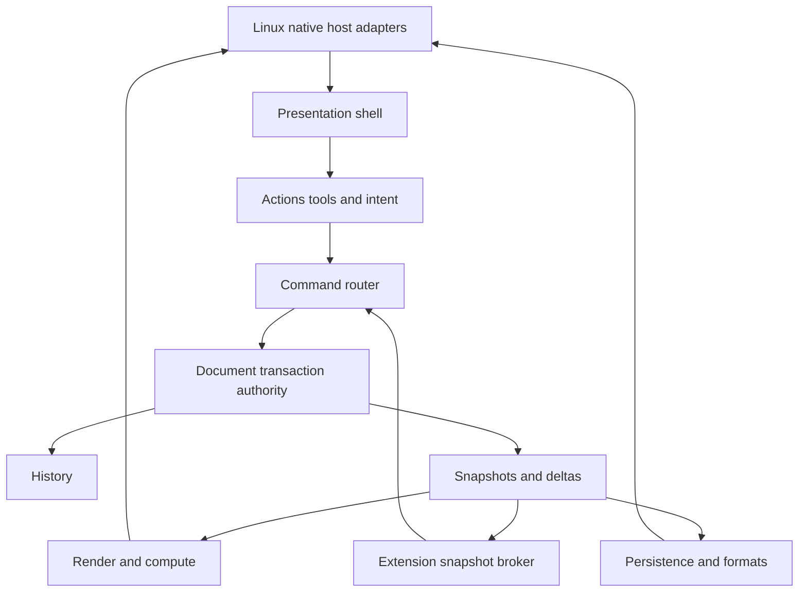
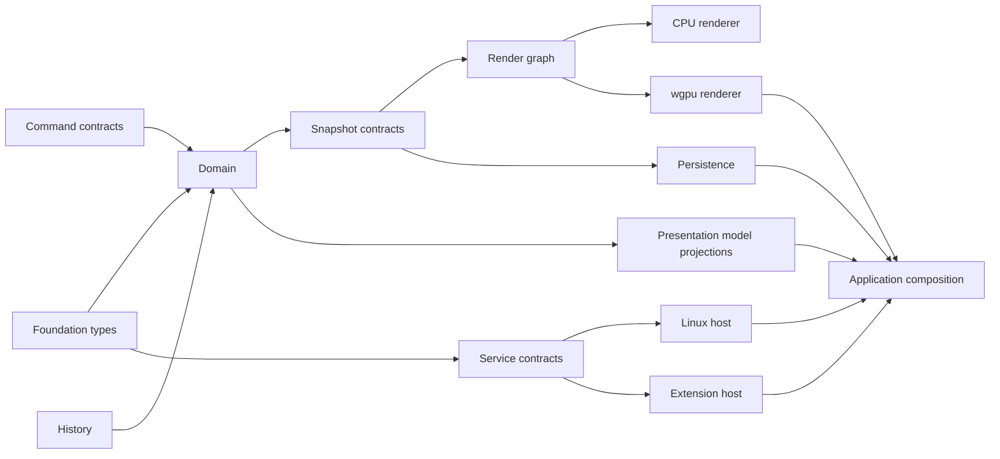
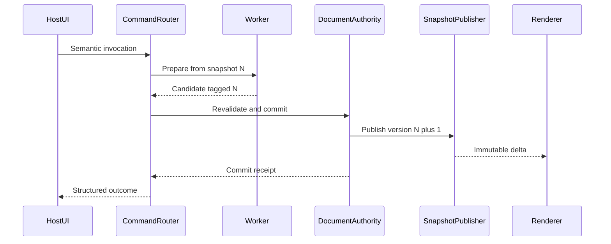
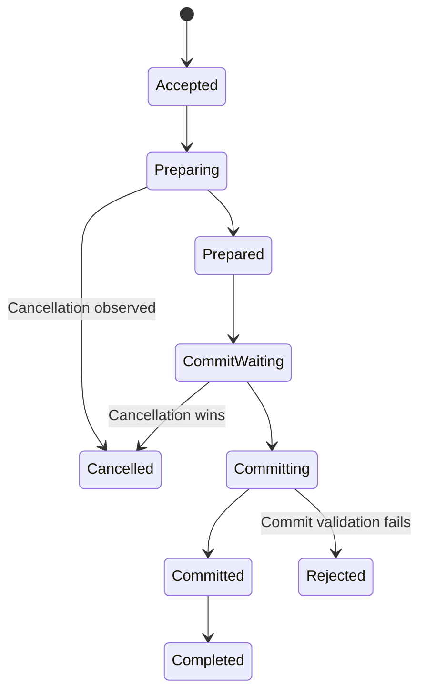
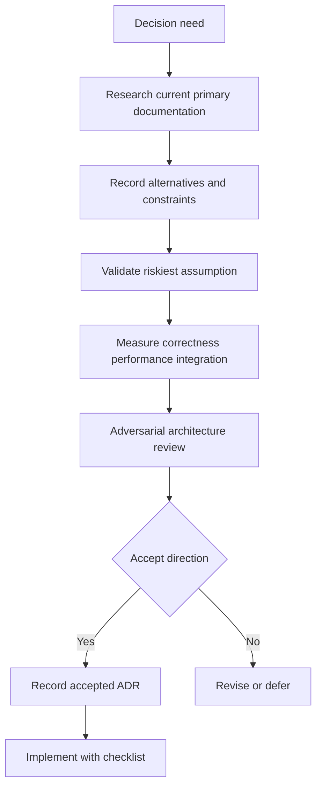
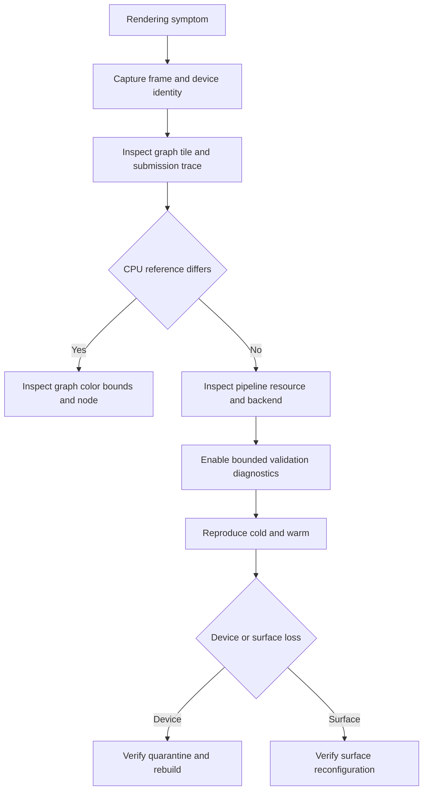

# 32 — Developer Guide

## Overview

This guide translates PhotoTux architecture into contributor boundaries, implementation workflows, review gates, and release discipline. The **shipping tech stack and Cargo members are frozen** ([DR-023](Appendix/Decision-Register.md#dr-023--tech-stack-frozen-to-shipping-codebase), [DR-025](Appendix/Decision-Register.md#dr-025--crate-topology-coarse-workspace)): Rust, Qt 6 QML + qtbridge, wgpu Vulkan-first, zero-copy present, `.ptx`. Semantic contracts (commands, snapshots, workspace models) evolve **on that stack**. Optional libraries (codecs, logging backends, sandbox tech) may still be chosen with evidence; UI toolkit and GPU API must not.

PhotoTux is a local-first raster editor with a portable semantic core, Linux-native Qt host, and wgpu rendering. The document owns authoritative editable state. Commands are the sole mutation spine. Transactions register history and publish immutable snapshots. Rendering, persistence, analysis, and extensions consume immutable views. GPU resources are derived. Toolkit and native APIs stop at host adapters (`phototux_ui` / `phototux_canvas`). Every queue, operation, capability, and cancellation boundary is explicit. Alignment contracts: [Alignment Roadmap](Appendix/Alignment-Roadmap.md). Product slices to full handbook parity: [Handbook Parity Roadmap](Appendix/Handbook-Parity-Roadmap.md) / [Handbook Parity Checklist](Appendix/Handbook-Parity-Checklist.md).

Contributors **MUST NOT** introduce cloud storage, accounts, remote services, AI or generative features, proprietary workflows, ambient extension authority, writable model references in UI, or GPU-authoritative document state. Normative words follow [Requirement Keywords](Appendix/Requirement-Keywords.md); terms follow the [Glossary](Appendix/Glossary.md).

## Responsibilities

The development process **MUST**:

- preserve foundation invariants and narrower subsystem contracts;
- keep portable semantic crates independent from native windows, toolkit objects, and platform file dialogs;
- route semantic mutation through command and transaction authority;
- expose immutable versioned snapshots to concurrent readers;
- define ownership, thread affinity, queue bounds, cancellation, and failure behavior in APIs;
- keep serialized schemas independent from Rust memory layout and native ABI;
- keep wgpu resources reconstructible and generation-tagged;
- validate all untrusted bytes, dimensions, counts, offsets, graphs, profiles, fonts, presets, and extension messages;
- support headless core tests and CPU/reference behavior for core rendering semantics;
- document high-reversal-cost decisions through ADRs before lock-in;
- add conformance tests, diagnostics, accessibility, performance, and migration implications with each feature;
- retain local/offline build, test, edit, save, recovery, and extension workflows;
- avoid claiming unvalidated libraries, toolkit, runtime, plugin ABI, or file container as final.

It **SHOULD** keep modules cohesive around semantic ownership, use explicit value contracts, minimize feature-flag combinations, and make invalid states difficult to represent after trust-boundary validation. It **MAY** reorganize proposed crates when measured evidence supports a better boundary, provided dependency and authority rules remain.

## Architecture



Arrows show control/data direction, not unconditional crate dependencies. Policy points inward: host, presentation, wgpu, codecs, and extension transports implement narrow interfaces owned by semantic layers. A domain crate never imports toolkit/window/surface types. Renderer never commits document state. Persistence never clears modified state directly. Extension code never appends history or receives mutable model objects.

### Internal hierarchy

```text
PhotoTux repository
├── foundation and policy
│   ├── stable identities and bounded values
│   ├── error/cancellation/operation contracts
│   ├── capability and diagnostics contracts
│   └── schema/version primitives
├── domain core
│   ├── document aggregate and resources
│   ├── command registry/router/authority
│   ├── history/checkpoints
│   ├── selection/masks/layers
│   ├── text/shapes/filters/brush semantics
│   └── snapshots/deltas
├── compute and presentation data
│   ├── render graph and CPU reference
│   ├── wgpu execution/device resources
│   ├── color transforms
│   └── semantic UI/accessibility models
├── services
│   ├── native persistence and recovery
│   ├── import/export adapters
│   ├── resources/preferences/workspaces
│   └── extension supervision/brokers
├── hosts
│   ├── Linux native integration
│   ├── desktop presentation implementation
│   └── optional headless host
├── applications and tools
│   ├── desktop executable
│   ├── fixture/corpus generators
│   ├── conformance harnesses
│   └── local diagnostics utilities
└── docs, ADRs, fixtures, and release evidence
```

## Rust Workspace Boundaries

### Shipping packages (binding — [DR-023](Appendix/Decision-Register.md#dr-023--tech-stack-frozen-to-shipping-codebase), [DR-025](Appendix/Decision-Register.md#dr-025--crate-topology-coarse-workspace))

```text
crates/
├── phototux              # desktop binary + QML AOT anchor
├── phototux-ui           # qtbridge QObjects; no wgpu
├── phototux-engine       # portable document/commands/history semantics; no Qt
├── phototux-gpu          # wgpu pipelines
├── phototux-canvas       # Qt↔wgpu canvas interop (± thin C++)
└── phototux-io           # .ptx + raster/PSD adapters
```

Presentation stack is **Qt 6 QML + qtbridge**. GPU stack is **wgpu 30 Vulkan-first** with zero-copy interactive present. Do not invent parallel GUI or GPU stacks.

### QML module and shared components

QML lives in `qml/` and ships through the AOT module built by `crates/phototux/build.rs` and `crates/phototux/qml-aot/CMakeLists.txt`.

| File | Role |
| --- | --- |
| `Main.qml` | Application window and shell |
| `Theme.qml` | Singleton design tokens (colors, spacing, density, type) |
| `DisclosureGroup.qml` | Collapsible inspector section ([01](01-Information-Architecture.md#disclosure-group-registry)) |
| `LazyDialog.qml` | Defers a dialog's object tree to first use |
| `PropertiesPanel.qml` | Right dock's per-layer editor body |
| `LayersPanel.qml` | Right dock's layer list, over `AppSession.layerModel` |
| `CanvasInput.qml` | Canvas pointer input and in-progress drag state |
| `PanelHeaderControls.qml`, `ThemedIcon.qml`, `ChromeIconToolButton.qml` | Panel and icon chrome |
| `ThemedButton.qml`, `ThemedCheckBox.qml`, `ThemedComboBox.qml`, `ThemedMenu.qml`, `ThemedMenuItem.qml`, `ThemedSlider.qml`, `ThemedSpinBox.qml`, `ThemedTextField.qml`, `ThemedToolTip.qml`, `ThemedDialogHeader.qml`, `ThemedDialogFooter.qml`, `ThemedScrollBar.qml` | Controls themed off `Theme.qml` rather than the Basic style. A bare `Button` / `CheckBox` / `ComboBox` / `Menu` / `MenuItem` / `ScrollBar` / `Slider` / `SpinBox` / `TextField` / `DialogButtonBox` fails `no_unstyled_controls_reach_the_user`, which reads inline declarations (`delegate: MenuItem {`) as well as line-leading ones: with no style configured the shell runs Basic, whose light palette is invisible on a developer profile with a Qt style set system-wide and obvious on a clean one. `ThemedButton` takes a `prominence` of `normal`, `primary` or `danger`, and `flat` for a run of secondary actions. |
| | `ThemedDialogFooter` is the one to reach for whenever a `Dialog` sets `standardButtons`: that property builds its buttons from the Controls style, so a dialog that never writes a button down still ships light ones. `Dialog.standardButtons` forwards to a `DialogButtonBox` footer, so the declaration stays where it was and only the footer type changes. |
| | `ThemedScrollBar` floats over content rather than sitting beside it, so a caller that cannot afford the overlap reserves `implicitWidth` at its right edge — the Properties panel and the Preferences dialog both do. |
| | `ThemedToolTip` covers the trap the guard above cannot see. `ToolTip.visible` / `ToolTip.text` on a control drive the **shared** tool tip instance, which the style builds and which cannot be restyled from one place — assigning to `ToolTip.toolTip.background` is accepted and does nothing, from an Item or from the window. Nothing is instantiated, so `no_unstyled_controls_reach_the_user` sees no bare control; `no_attached_tool_tips_reach_the_user` fails the build on the attached form instead. Declare a `ThemedToolTip` inside the control, and let it read `parent.Accessible.name` rather than giving the control a second copy of the string. |
| `NewDocumentDialog.qml`, `WelcomeDialog.qml` | Entry dialogs |
| `FilterGalleryDialog.qml`, `CommandPaletteDialog.qml`, `PreferencesDialog.qml`, `SelectionModifyDialog.qml` | Extracted shell dialogs |

A component pulled out of `Main.qml` takes its dependencies as `required property` rather than reaching for ids in the shell's scope — that scope is what makes inline blocks unmovable, and declaring the seam is what makes an extraction reviewable. Measure the crossings in both directions before cutting: ids the body reads from outside, and ids outside the body that read into it. The latter are the ones greps miss, and each one needs a function or signal on the new component rather than a reach back.

The CMake module globs `qml/*.qml` and the build script watches the `qml/` directory, so a new component is embedded and rebuilt without registration edits. Singletons are the one exception: a `pragma Singleton` type must also be listed in `QML_SINGLETONS` in the CMake module or it will not resolve.

Any file using `AppSession` must `import phototux_ui`. That module is registered at runtime by qtbridge rather than on disk, so `qmllint` reports it as unresolved and flags `AppSession` as unqualified access in every file — that output is the expected baseline, not a regression.

What is *not* baseline is `Quick.layout-positioning` and `property-override`, both of which report genuinely undefined behaviour:

- **Give a layout child an implicit size, never `width` / `height` / `anchors`.** A `RowLayout` or `ColumnLayout` owns the geometry of its children, so assigning `width: 24` fights the layout and Qt does not define who wins. Write `implicitWidth: 24` (or `Layout.preferredWidth`, when the value only makes sense inside a layout) and let the layout read it. `Layout.fillWidth` composes with either.
- **Do not name a property after one the base type already has.** `Item` already carries `scale` — the render transform — so a `readonly property real scale` on an `Item` shadows it, and no reader can tell which one a binding meant. Pick a name that says what the value is: the navigator's fit ratio is `fitScale`.

Filtering the two out of a `qmllint qml/*.qml` run should print nothing:

```bash
qmllint qml/*.qml 2>&1 | grep -cE "layout-positioning|property-override"
```

### Logical ownership map (modules — not a rename mandate)

The following names communicate **responsibilities**. Implement them as modules (or later optional crate splits) **inside** the shipping packages above — not as an immediate 18-crate rewrite ([Alignment Roadmap](Appendix/Alignment-Roadmap.md)):

```text
logical/
├── types / diagnostics          → phototux-engine (foundation modules)
├── domain / commands / history / snapshot → phototux-engine
├── color / brush / filter semantics → phototux-engine (+ GPU exec in phototux-gpu)
├── render-graph / CPU reference / wgpu exec → phototux-gpu (+ engine plans)
├── persistence / formats        → phototux-io
├── presentation model           → phototux-ui (+ QML)
├── linux host / app composition → phototux + phototux-canvas + phototux-ui
└── extension contract/host      → deferred until DR-009 seams
```

### Foundation types

`phototux-types` would contain opaque IDs, versions, finite numeric wrappers, checked extents, coordinate-space markers, bounded contracts, schema identifiers, operation IDs, capability identifiers, and small domain-neutral errors. It **MUST NOT** become a miscellaneous utilities crate or depend on domain, renderer, host, toolkit, filesystem, wgpu, or extension implementations.

`phototux-diagnostics` would define redacted event/span contracts, correlation IDs, sinks, local artifact schemas, and no-op behavior. Domain code may emit semantic diagnostics through this interface, but logging backend, file rotation, and native collection remain application concerns. Diagnostics failure never changes correctness.

### Domain aggregate

`phototux-domain` would own document state, object/resource stores, canvas/color references, stable identities, invariant validation, transaction candidates, and authoritative installation. Layer, selection, mask, text, and shape semantics may begin as modules and split only when independent contracts and compile-cost evidence justify it.

`phototux-commands` would own descriptors, invocation schemas, target/authority resolution, validation stages, scheduling interfaces, preparation contracts, and outcome types. Executors may live with feature modules while implementing command-owned traits. Router does not own document pixels.

`phototux-history` would own reversible record schemas, coalescing, timeline cursor, checkpoints, retention budgets, and traversal candidates. It coordinates atomically with domain authority through a narrow internal interface; neither can publish a half commit.

`phototux-snapshot` would own coherent immutable snapshot/delta contracts, leases, event sequencing, and resynchronization. Whether implementation is a distinct crate or domain module depends on cyclic-dependency and compile-time evidence. Public contracts **MUST NOT** expose internal arena guards or mutation locks.

### Semantic engines

Color, brush, and filter crates own portable algorithms, declarative descriptors, behavior versions, deterministic inputs, bounds/ROI/halo, and CPU/reference implementations. They do not own wgpu device, native input, UI controls, or document commit. GPU implementations consume validated plans through render/compute adapters.

`phototux-render-graph` would resolve immutable snapshots into pure graph plans, tile dependencies, formats, color/alpha, precision, and cache keys. `phototux-render-cpu` would execute reference/fallback nodes. `phototux-render-wgpu` would own adapters, devices, queues, pipelines, surfaces only through host-provided targets, resource caches, submissions, and generation recovery.

### Services and hosts

Persistence owns semantic serialization, staged writes, recovery, migration, and format-neutral packages. Format adapters parse untrusted external bytes behind limits. Native file format remains independent from in-memory Rust layout.

Extension contract owns manifests, versioned protocol values, capability scopes, semantic contribution descriptors, and bounded messages. Extension host owns process/sandbox supervision, transport, brokers, quotas, and crash containment. No stable native ABI is implied.

Presentation model owns action descriptions, immutable projections, focus/navigation semantics, panel/tool/dialog descriptors, accessibility nodes, and toolkit-neutral state. Linux host owns Wayland-compatible native windows/surfaces/input, portals/files, clipboard, AT-SPI, display/color signals, lifecycle, and power/session integration. Application crate is the composition root and may depend on all concrete implementations.

### A slot with no caller is not a feature

`cancel_io` set a token the file worker checks between layers, and `send`
resets that token before every command, so cancelling a save has always worked
and has never poisoned the next one. Nothing in the shell called the slot. The
status bar showed a spinner and the word "Working…" and offered no way out of
a large PSD export.

That is the same shape as `layer.reorder` before Layer ▸ Arrange, and it is the
shape to go looking for: a `#[qslot]` that no `.qml` file names and that
`dispatch_host_op` does not reach is either dead code or a missing control, and
the two look identical from inside the crate. `a_running_file_operation_can_be_cancelled`
pins this one — the call *and* its `ioBusy` guard, because a cancel button that
is always on screen offers to stop something that is not running.

## Dependency Rules



This diagram is conceptual; implementation may invert selected arrows through traits. Required rules:

1. Core/domain **MUST NOT** depend on Linux, toolkit, wgpu, extension process, or concrete filesystem modules.
2. Presentation **MUST NOT** receive mutable document references or create history entries.
3. Renderer **MUST NOT** depend on command executors for authority or modify snapshots.
4. Persistence **MUST NOT** update document modified state except through returned receipt and authoritative transition.
5. Extension contracts **MUST NOT** expose Rust trait objects or native layouts across isolation boundary.
6. Host adapters **MUST NOT** decide document dirty, close, recovery winner, or command validity.
7. Feature crates **SHOULD** depend on foundation and domain contracts, not application composition.
8. Cyclic crate dependencies are forbidden. Semantic cycles require interface extraction or composition redesign.
9. Optional dependencies **MUST** have absence behavior tested. Optional cannot silently become required for core workflows.
10. Public internal APIs **SHOULD** use stable values and explicit ownership rather than leaking third-party library types.

## Object Relationships and API Contracts

APIs identify owner, mutability, lifetime, thread safety, cancellation, bounds, error, and version. A name such as `process(image)` is insufficient. A semantic operation should communicate source snapshot, target extent, color/alpha, budget, behavior version, and applicability.

```rust
interface DocumentAuthority {
    snapshot(document: DocumentId) -> Result<DocumentSnapshot, AuthorityError>;
    commit(candidate: TransactionCandidate, expected: VersionVector) -> Result<CommitReceipt, AuthorityError>;
}

interface RenderService {
    request(request: RenderRequest) -> Result<RenderOperation, RenderRequestError>;
    cancel(cancellation: CancellationId) -> CancellationOutcome;
}

interface LocalFileCapability {
    identity() -> FileCapabilityIdentity;
    open_read(limits: ReadLimits) -> Result<BoundedReader, FileError>;
    create_staged_replace(policy: ReplacePolicy) -> Result<StagedWriter, FileError>;
}
```

These examples are semantic pseudocode. Final Rust traits may be synchronous, asynchronous, message-based, or split by affinity after runtime validation. They do not authorize arbitrary async traits, boxed futures, or global executors.

### Value and schema rules

- IDs are opaque newtypes, never row indices, pointers, names, or paths.
- Coordinates and rectangles identify coordinate space in type or contract.
- Floats crossing trust or authority boundaries validate finiteness and range.
- Counts and byte sizes use checked arithmetic before allocation.
- Collections at trust boundaries are bounded.
- Enums crossing persistence/protocol boundaries define unknown-value behavior.
- Serialized schemas have independent versions and migration.
- Stable error codes are data; display strings are localized presentation.
- Public structs avoid fields whose invariants can be bypassed; constructors validate.
- Cache keys include every semantic input and behavior version.

### Trait and generics policy

Use traits at genuine substitution boundaries: host services, storage capability, renderer executors, clocks, schedulers, extension transport, and diagnostic sinks. Do not abstract every function preemptively. Generics are useful for zero-cost pure algorithms and test adapters; trait objects or message boundaries can control compile-time explosion and plugin isolation. Selection is evidence-driven.

Third-party types stop at adapter modules. Wrapping every primitive is unnecessary, but types carrying authority, identity, coordinate, color, alpha, version, or persistence meaning deserve explicit wrappers. Unsafe code, if required, **MUST** be isolated behind a safe contract, justify invariant and performance need, document platform assumptions, and receive targeted tests.

## Ownership and Threading

Thread roles are contracts, not a runtime choice:

```text
Host/UI role
├── native event loop and surfaces
├── presentation projection and focus
└── bounded action submission

Document authority role
├── validation at commit
├── authoritative installation
├── history registration
└── snapshot publication

Render coordination role
├── graph planning
├── wgpu device/queue ownership
├── frame identity
└── device generation recovery

Worker roles
├── CPU tiles and filters
├── decode/encode/compress
├── profile/font/resource parsing
└── checkpoint/materialization

I/O role
├── staged persistence
├── recovery
└── bounded local resource access
```

Per-document mutations serialize through one conflict-safe authority. Independent documents may progress concurrently. Workers read immutable snapshots and return version-tagged prepared results. A result never applies through “current pointer”; it carries document, source version, object/resource revisions, and applicability.

Native window, surface, and accessibility objects remain thread-affine to host. wgpu device/queue affinity follows selected implementation and backend contract. GPU resources belong to device generation. Document and history resources remain CPU-addressable or recoverable. Dropping a view or device cannot destroy authoritative content.

Locks **MUST NOT** span filesystem I/O, GPU waits, shader compilation, extension calls, host callbacks, user prompts, or unbounded computation. Lock ordering is documented. Channels declare item and byte bounds plus overload policy. Background work cannot consume all workers/memory reserved for input, commit, save, and recovery.



## Host Slot Re-entrancy

A host slot holds exclusive access to session state for its whole body, including every change notification it publishes while running. Presentation bindings that react to those notifications therefore execute **inside** the slot that raised them.

A presentation handler that reacts to a host change notification **MUST NOT** invoke a mutating host slot synchronously. It **MUST** defer the call to the next event-loop turn. This applies to change handlers, declarative binding side effects, focus and popup lifecycle callbacks, and anything a lazy loader constructs in response to host state. Direct invocation remains correct from user input — pointer, key, and activation handlers — because the event loop already delivers those outside any slot body.

Violating this is not a recoverable error. The exclusive-access check fails and the process aborts, so it **MUST** be treated as a correctness contract rather than a style preference. Deferral additionally coalesces write-back storms — window drags, viewport resizes — into one call per turn.

Notification handlers that only assign presentation properties are unaffected; the contract governs calls back into the host.

### A delegate's required properties are model roles

Qt resolves `required property` on a delegate against the model's role names,
and a miss **aborts the delegate**: the view renders nothing, with no warning in
the log and no visible cause. A panel that has simply gone blank is the symptom.

The layer row is written out in three places — `phototux_engine::LayerRow`, the
`LayerItem` the derive turns into roles, and the delegate that declares them —
so adding a field to one and not the others is easy and silent. The guard is
`role_names_are_exactly_the_ones_qml_reads`, which compares
`QModelItem::role_names()` against the `required property` names scanned out of
the delegate. Both sides are derived; neither is a list anyone maintains. It
asserts equality in both directions, because a role the panel never reads is
dead weight crossing the boundary.

## Item models are the synchronous case

Property change notifications are the forgiving half of this. A presentation binding that merely *reads* host state may be re-evaluated after the slot returns, so reading is normally safe even though the notification was raised inside one.

Item models are not. A model's row-change notification reaches its view synchronously, and the view evaluates its delegates' bindings during that notification — still inside the slot that updated the rows. A delegate binding that reads a host property therefore re-enters the host and aborts the process, exactly as a synchronous mutating call would.

A delegate in a host-driven model view **MUST NOT** read host state in a binding. It **MUST** take per-row values as model roles, and anything else through a presentation property on an ancestor, which caches the host read on the host's own notification. Delegate handlers driven by user input are unaffected and may call host slots directly.

The indirection is easy to lose by accident: a helper function called from a delegate binding counts as a binding read, even though its body is somewhere else entirely. The layers panel hit precisely this — its icon helper resolved an asset root from the host, so an eye icon crashed the process on the first visibility toggle after the panel became model-driven.

## Error Model

Errors identify category, stable code, operation/scope, preserved state, retry safety, field details, and correlation ID. Categories include invalid input, unavailable target, stale/version conflict, capability/permission, lifecycle, unsupported feature, resource pressure, external service, codec/format, extension, device, and invariant.

Library code returns typed errors rather than logging and continuing. Application boundary maps errors to user-facing actions. Error conversion preserves source category and context without exposing private content. String matching is prohibited for control flow.

Recoverable external failures do not panic. Programmer/invariant failures may use debug assertions internally, but production authority catches isolation boundaries, freezes affected mutation when needed, and preserves last coherent state. Panics must not unwind across FFI, process protocol, native callback, or other boundary whose safety is unproven.

Partial success is explicit data. Multi-target destructive commands default atomic. Batch import/export may report per-item results only when contract declares independence. A successful commit followed by notification failure remains committed; consumers resynchronize. A successful atomic replace followed by UI notification loss remains saved.

## Cancellation Pattern

Cancellation is ordinary control flow. Each operation declares checkpoints and noninterruptible boundary. Tokens form hierarchy: session, document/workspace, command, operation, subjob. Parent cancellation propagates; sibling failure follows group policy.



Before commit, cancellation releases provisional resources and creates no transaction. Once authoritative installation begins, cancellation cannot split it; the result is committed and reversal is a later command. GPU submissions may finish after cancellation, but generation/request checks discard output. Save after replacement reports success. Cleanup is idempotent and has bounded deadlines. UI reports “finishing” only for a real bounded critical section.

## Command Implementation Workflow

Every new semantic mutation follows this sequence:

1. Define domain outcome, exact scope, target IDs, parameters, units, limits, mutation class, undo policy, conflict policy, cancellation, accessibility name, and diagnostics.
2. Confirm existing command cannot express same semantics through parameterization.
3. Add or update normative subsystem documentation and ADR when direction changes.
4. Define versioned descriptor and bounded schema independent from UI controls.
5. Implement pure validation and cheap enablement dependencies.
6. Acquire immutable snapshot and prepare expensive work outside authority.
7. Build forward and inverse representation before commit.
8. Revalidate expected versions, target generations/revisions, locks, capability, resources, and destructive confirmation.
9. Commit through transaction authority; do not append history or publish snapshots manually.
10. Return structured effects and errors.
11. Add headless tests for valid, invalid, stale, cancellation, pressure, and injected failure.
12. Add presentation/action mapping, accessibility, performance trace points, and migration/compatibility evidence.

Command IDs use stable domain outcomes such as `layer.set-opacity`, not menu paths, widget names, crate names, or implementation verbs. Executors do not own queues globally. Long commands return operation IDs and prepared candidates. Commands with external side effects distinguish document effects from files already written; undo does not secretly delete exports.

## Adding a Tool

A tool is an interaction state machine, not mutation authority. Contributor defines:

- stable tool/action ID and target compatibility;
- parameter schema, defaults, units, validation, and persistence domain;
- normalized input events and required device capabilities;
- gesture states, capture, modifiers, preview, commit, cancel, and discontinuity;
- coordinate-space conversion and immutable view transform;
- command output and history merge policy;
- queue/sample/backpressure bounds;
- accessible name, current state, keyboard/numeric alternatives where feasible;
- diagnostics and performance budgets.

Implementation keeps transient gesture state outside document. Preview is generation/version-tagged and disposable. Predicted input never becomes authoritative without confirmed reconciliation. Focus loss, device removal, Escape, tool switch, target deletion, device loss, and extension crash have explicit outcomes. Tests use canonical input traces and compare command meaning independent from native device adapter.

Mechanically, the id goes in the `tools!` list in `phototux_engine::tool_id`, which declares the constant and the `ALL` table together — the host validates against `tool_id::is_known`, so there is no second list to update. Then add the rail entry in `shell::default_tools`. Forgetting either half fails `the_tool_rail_and_the_tool_vocabulary_describe_the_same_tools`: a constant with no rail entry is a tool nothing can select, and a rail entry the host does not know is a button that silently activates the brush. QML naming the id is checked separately by `every_tool_named_in_the_qml_shell_is_a_tool_the_host_knows`, because the fallback makes a typo there look like a tool that merely does not work.

## Adding a Panel

Panels consume immutable semantic projections and emit action invocations. A panel declares application/document/view/selection/pinned following policy. It **MUST NOT** infer target from one global “active” pointer when scope differs.

Panel workflow:

1. Define user task and scope.
2. Reuse action descriptors and domain queries.
3. Define semantic component tree, focus order, virtualization, empty/loading/error/unavailable states.
4. Define projection dependencies and generation.
5. Reject stale events by node/model generation.
6. Keep expensive formatting, thumbnails, and queries off UI thread.
7. Preserve focus/selection by stable IDs.
8. Add keyboard and accessibility tree tests.
9. Add 200% scale, high contrast, reduced motion, and narrow layout tests.
10. Persist only declared workspace convenience state.

Toolkit widgets remain implementation detail. Extension panels use host-rendered semantic vocabulary unless a later ADR validates another contained model. Panel unload or crash removes nodes and restores focus without changing documents.

## Adding a File Format

First classify format as native editable, import, export, or both. Third-party formats remain adapters and cannot become Save targets when they cannot preserve PhotoTux semantics.

Format adapter **MUST** define:

- stable format ID, signatures, MIME/extension hints, bounded probe;
- decode/encode capabilities and option schemas;
- dimensions, channels, precision, color/profile, alpha, metadata, and animation/multi-item policy;
- allocation, depth, decompression, CPU, time, and output limits;
- quarantined semantic package mapping;
- unsupported/loss report;
- streaming and cancellation boundaries;
- hostile corpus and fuzz target;
- staged output and durability behavior;
- extension isolation/capabilities if third-party;
- deterministic fixtures and migration/versioning.

Decoder never mutates a visible document. It parses and validates into quarantine, then core normalizer registers one coherent document through command/lifecycle authority. Encoder consumes a stable snapshot/render stream and staged-write capability. It cannot clear modified state. Paths are host capabilities, not arbitrary strings inferred from metadata.

## Adding a Filter

A filter descriptor defines parameter schema, behavior version, input/output planes, color/alpha/precision/range, bounds mapping, ROI, halo, edge sampling, deterministic seed policy, tile independence, reductions, temporary memory, CPU/reference implementation, wgpu tiers, cancellation, fallback, and cache key.

Contributor implements tiny exact CPU fixtures before optimization. Tiled output is compared to whole-region reference and across tile boundaries. GPU path is differential-tested on supported tiers. Nondestructive effects persist semantic descriptor; destructive apply prepares output and inverse retention before command commit. A document or preset cannot inject arbitrary shader source. Global filters declare full-input passes and spill/stream policy before admission.

## Documentation and ADR Process

Documentation is architecture input, not post-implementation narration. A change that adds ownership, persistence, command, rendering, security, accessibility, performance, compatibility, or host behavior updates the relevant numbered handbook document in the same change. Cross references use actual current filenames. Normative requirements name responsible subsystem and observable behavior.

An ADR is required when a decision:

- selects UI toolkit, async runtime, native container, plugin isolation, stable ABI, or major library;
- changes crate/dependency direction;
- changes authority, thread, process, or persistence boundary;
- freezes tile geometry, cache policy, schema, protocol, or compatibility promise;
- accepts a security/accessibility/performance tradeoff;
- contradicts or refines a foundation invariant;
- has high migration or reversal cost.

ADR records status, context, constraints, considered alternatives, decision, consequences, validation evidence, revisit trigger/date, and amendments. Proposed decisions do not appear as accepted fact in code comments. Experiments can be disposable; findings and rejected assumptions are durable.



### Public documentation is a separate document for a separate reader

`internal_docs/` is the engineering handbook: normative, contributor-facing,
authoritative. It is **not** what a user reads.

The user documentation is a static site under [`web/docs`](../web/docs), and
the product site is [`web/landing`](../web/landing)
([DR-033](Appendix/Decision-Register.md#dr-033--public-web-presence-is-two-static-astro-sites-not-a-second-handbook)).
They restate behaviour for people using the editor and cite the handbook
rather than duplicating it; neither carries normative language. This is not
the second `/docs/` tree the constitution forbids.

A change to user-visible behaviour updates **both**: the handbook chapter that
owns the contract, and the page in `web/docs` that describes it to a user. A
shortcut moved, a menu entry renamed or a format newly supported is wrong in
one of them within a release otherwise.

The sites share `@phototux/design`, whose palette is `qml/Theme.qml`'s
([25 — Themes](25-Themes.md)) and whose icons come from
`assets/icons/phosphor/regular`. Do not start a second palette there.

The Node toolchain is confined to `web/` and is **not** part of the Rust gate:
`rust-tc doctor` neither builds nor checks the sites, so a broken website
cannot block a Rust change. Build and check them with `pnpm` from `web/` —
see [`web/README.md`](../web/README.md).

## Build, Check, and Test Commands

Qt 6 must be on `PATH` (`/usr/lib/qt6/bin`; host `qmake` is often Qt 5). Set `QMAKE=/usr/lib/qt6/bin/qmake`. Agent-facing command summary: root [`AGENTS.md`](../AGENTS.md).

Locked wrappers:

```bash
cargo build -p phototux
cargo run -p phototux
cargo test -p phototux_engine
cargo test --workspace
cargo test -p phototux_gpu --features gpu-tests   # optional; needs a Vulkan device
rust-tc check                                     # fastest compiler-only feedback
rust-tc quick                                     # fmt + check + clippy + tests + doctests
rust-tc doctor                                    # full local Rust-Toolchain gate
./scripts/check-rust.sh                           # rust-tc precommit (fmt + clippy; git hook)
./scripts/check-rust.sh --full                    # rust-tc doctor + SonarQube
CHECK_SONAR=0 ./scripts/check-rust.sh --full      # rust-tc doctor only
./scripts/check-sonar.sh                          # Clippy JSON + scanner + quality gate
./scripts/install-git-hooks.sh                    # once per clone → core.hooksPath=.githooks
```

The public quality CLI is **`rust-tc`** (Rust-Toolchain; wraps `just`). Do not invoke `just` directly. `rust-tc doctor` is not the `rust-doctor` Cargo binary. SonarQube project key is `phototux` (`sonar-project.properties`). Token via `SONAR_TOKEN` or gitignored `.sonar/scanner-token`. Pre-commit runs fmt + clippy only; `rust-tc doctor` and SonarQube stay opt-in.

The repository **SHOULD** also keep discoverable commands (Cargo, scripts, or a later task runner) for:

- property/model and compatibility suites;
- selected fuzz targets/corpus regression;
- CPU reference/golden/color tests;
- Linux host and AT-SPI integration;
- performance workloads vs baselines;
- documentation/link/Mermaid validation;
- release evidence packs.

Required workflows **MUST** remain runnable locally without a CI vendor. Scripts avoid downloading unpinned executables during ordinary checks.

## Linux Development Environment

Linux is the primary native host and must be developed as a real platform, not a generic Unix afterthought. Contributors record distribution, kernel, compositor/session, desktop, display scaling, GPU adapter/driver, wgpu backend, input devices, accessibility service, color service, and portal availability when reporting host issues. CachyOS/Arch-style package names and current components may differ from other distributions; documentation describes required capabilities before distro-specific package commands.

Environment capabilities include:

- Rust toolchain satisfying repository policy;
- native compiler/linker and package metadata tools;
- windowing/surface development headers selected by validated host implementation;
- Vulkan or other enabled wgpu backend runtime and diagnostics;
- Wayland session with optional X11 compatibility only where supported;
- desktop portal service for capability-based file/dialog tests where applicable;
- AT-SPI service and representative assistive technology;
- color/profile integration available to selected host adapter;
- tablet/pen input for native input qualification;
- fonts and locales from controlled fixture set for deterministic tests.

The application **MUST** handle absent portal, accessibility, color, tablet, or GPU capability with typed status. Developers should test both present and absent states. Do not hard-code `/usr`, home directories, current working directory, display names, monitor indices, or desktop-specific service availability into core.

### Environment diagnosis

Collect diagnosis before changing code:

1. identify build revision/profile and local modifications;
2. capture process environment relevant to display and wgpu without exposing secrets;
3. list available adapters and requested features/limits through application diagnostic path;
4. record selected backend, adapter, driver, device generation, surface format, display scale, and color context;
5. reproduce with optional extensions disabled and default workspace;
6. distinguish surface loss from device loss and host input from core gesture behavior;
7. run headless CPU/reference path to isolate GPU/presentation;
8. preserve bounded local trace and exact operation correlation.

Environment variables used to select backend, validation, or logging are diagnostic overrides, not permanent product configuration. Reports name them. A workaround that disables validation, color management, accessibility, or recovery cannot become default without ADR and evidence.

## wgpu Diagnostics

The renderer exposes an application-owned diagnostic summary rather than requiring contributors to infer state from driver logs. Summary **SHOULD** include:

- adapter identity class and backend;
- driver/API versions when safely available;
- supported/selected features and limits;
- surface format/present mode/color/HDR context;
- device and surface generation;
- pipeline family readiness and quarantined variants;
- GPU cache logical/resident byte accounting;
- queue submissions, uploads, readbacks, and timestamp capability;
- validation, uncaptured error, out-of-memory, and loss reason;
- CPU/multipass fallback selections;
- recent recovery attempts and bounded outcomes.



GPU debugging rules:

- validate dimensions, offsets, row alignment, formats, usages, and dispatch counts before submission;
- label passes/resources with semantic IDs and behavior versions, not user content;
- never synchronously wait on GPU from UI/document authority;
- capture pipeline compilation separately from execution;
- compare node output with CPU reference under declared tolerance;
- test cold pipeline/cache state;
- include device generation in every completion;
- initialize pooled/shared resources before read;
- distinguish driver/backend defect from incomplete semantic contract;
- quarantine only a specific failing variant when evidence supports fallback.

Native backend tools may supplement diagnosis, but no proprietary profiler is required for conformance. A backend-specific workaround **MUST** preserve semantics and identify adapter/driver applicability narrowly.

## Local Observability

Every asynchronous workflow has operation and correlation IDs. Structured spans connect action, command validation, queue, preparation, commit, snapshot, render invalidation, graph, tile, wgpu submission, frame, save/export, extension, and presentation. Fields are stable semantic identifiers and bounded counts. Paths, layer names, text, metadata, pixels, thumbnails, colors, stroke samples, clipboard, and capability tokens are redacted by default.

Instrumentation is optional for correctness. Disabled sinks have low bounded overhead. Ring buffers report overflow. Logs are not APIs; tests inspect semantic state or structured test sinks. Error messages include remedy for users while diagnostic records retain stable code and sanitized cause chain.

## Architecture Conformance

Architecture checks combine review, compile boundaries, static policy, and tests:

- portable crates cannot import host/toolkit/wgpu concrete modules;
- UI and extensions cannot obtain mutation authority;
- every mutating action maps to command;
- every renderer input is immutable/versioned;
- every persisted/protocol schema is versioned and bounded;
- every external callback occurs outside document lock;
- every queue/cache has bounds and pressure policy;
- every operation has cancellation and terminal outcome;
- every GPU object has device generation;
- every format/parser has hostile corpus;
- every visible action has accessibility semantics;
- every performance-sensitive path has trace stages and workload;
- no network/account/AI/proprietary dependency enters core workflow.

Some rules can be checked by dependency graph or lints; others require tests and reviewer judgment. A lint suppression names rule, rationale, scope, owner, and review condition. Architecture conformance is not satisfied by moving forbidden code behind a re-export.

### Shared vocabularies

A set of names that crosses a crate or language boundary — tool ids, command ids, selection ops, blend modes — is a vocabulary, and the recurring defect is the same every time: it gets written out in more than one place, the copies drift, and the drift is silent because the reading side has a fallback. An unknown tool becomes the brush; an unknown selection op does nothing but still records history.

Two rules, in this order:

1. **Give it one typed home in `phototux_engine`.** Prefer a form that cannot diverge over one that is merely checked — `tool_id`'s `tools!` macro declares the constants and the `ALL` table from one list, so the validator has nothing to fall out of step with. Where a boundary forces strings (QML has no enums, the action registry stores opaque args), parse once at the boundary and carry the type inward, so the unknown case stops existing past the parse.
2. **Assert both directions where a second list is unavoidable.** The registry, the tool rail and the QML shell are genuinely separate lists, so each has a test that every entry resolves *and* that every vocabulary member is reachable. The second half is the one usually missing, and it catches the case where something is added to the engine with no way for a user to invoke it.

Whether an unknown name falls back or is refused is a per-vocabulary judgement, not a house style. Refuse when acting on a guess would mutate the document — `SelectionModifyOp` and `ShapePreset` both return `Option`, because an edit or a layer the user did not ask for is one they must notice and undo. Fall back when refusing would leave the shell unusable — `tool_id::is_known` defaults to the brush, since no active tool is worse than the wrong one. Say which, and why, at the parse site.

Blend modes are the worked example of the first rule and of what its absence costs. The set was written out six times — an `ALL` table, three `match` arms, a serde `rename_all`, and a hardcoded QML combo — and the copies had drifted far enough that the combo offered eight of the seventeen modes, so more than half the vocabulary was unreachable from the Properties panel however correctly the compositor drew it. The `blend_modes!` macro declares the wire id, GPU code, family and label together and derives every consumer from them; the PSD codec keeps an authored `match` for the forward direction, because the compiler's exhaustiveness check on it is what caught the newly added modes, and derives the reverse direction from that. See [11 — Layer System](11-Layer-System.md#shipped-blend-set).

Host ops are the half of the registry the rule had not reached. An action either invokes a command or names a bare string that `dispatch_host_op` matches, and the only thing catching a mismatch was that function's catch-all — which raises a toast *if the user clicks the entry*, so a renamed op ships as a menu item that does nothing and the user finds it. `the_registry_and_the_host_dispatcher_name_the_same_host_ops` compares both vocabularies by reading the arms out of `lib.rs` as text. It checks the reverse direction too, which is quieter still: `dispatch_host_op` is private and its one caller passes `action.host_op`, so an arm no action names cannot be reached at all. Three had accumulated — `prefs.open`, `workspace.reset` and a `panel.toggle:` prefix — each a dead second route to a handler the command path already reaches through `HostFollowUp`.

The action registry is where this rule pays off most often. Tool, shape, boolean-op, adjustment, filter and layer-style entries are all *generated* from the enum that defines each vocabulary, so an entry cannot go missing for a member — which had already happened three times: four adjustment kinds, three filter kinds and four tool-adjacent styles were reachable from nothing the user could click. When generating replaces hand-written entries, assert the resulting ids literally against the ones that shipped: a renamed action id silently drops any custom shortcut a user has bound to it.

The same shape appears one level down, in *projections* rather than names: one piece of host state reaching QML twice, once as a bound property and once as a pushed JSON string. The bound copy updates itself; the pushed one updates only where a caller remembers, so the two disagree at exactly the moments that matter. `document_name` and `dirty` reach the window title as properties and the tab strip as `documentTabsJson`, and Save As renamed the title while the tab went on reading "Untitled". The fix is not another call site: put the push next to the emits every caller already goes through — `emit_doc_fields` — and assert it is there, which is what `the_tab_strip_is_refreshed_with_the_document_fields` does.

**Publish a property where you compute it.** `AppSession` has two ways to tell
QML a value moved, and only one of them is safe. `publish!(self, field, next,
field_changed)` compares, assigns and notifies in one place, so a value that did
not move wakes nothing. The other way is to assign the field in a `sync_*`
function and announce it blind from `emit_layer_fields`, hundreds of lines away
— two halves that are free to drift, and that drift silently in both
directions: a `sync_*` whose `emit_*` is not called leaves QML showing a stale
value, and an unconditional `x_changed()` beside a `publish!` for the same field
undoes the comparison entirely.

`published_fields_are_not_also_announced_unconditionally` catches the second
case by reading both lists out of the source. It only sees fields that go
through the macro, which is why a hand-written compare-and-notify must still end
in `publish!` for its notifying half — `set_adjustment_slot_values` did not, and
an `adjustment_slots_json_changed()` sat in `emit_layer_fields` defeating it
with nothing to say so.

An early `return` in a `sync_*` is the same bug wearing a different hat. The
no-layer arm of `sync_adjustment_fields` published three empty values and
returned before two more, so deselecting left `layer_styles_json` and
`effects_joined` describing a layer that was no longer active. State every field's
empty value in that arm rather than returning.

Shipped instances to copy from: `command_conformance::every_registered_id_is_known_and_has_meta` (command taxonomy), `selection_modify_actions_carry_a_parsable_argument` (registry args → `SelectionModifyOp`), `shape_create_actions_name_a_known_preset` plus `every_shape_created_from_the_qml_shell_names_a_known_preset` (`ShapePreset`, covering both the registry and the canvas' direct call), `the_tool_rail_and_the_tool_vocabulary_describe_the_same_tools` plus `every_tool_named_in_the_qml_shell_is_a_tool_the_host_knows` (tool ids), and `blend_gpu_codes_are_unique_and_pinned` plus `the_parity_set_covers_every_blend_mode` (blend modes). The last reads `qml/` as text, which is the only way to compare against a declarative binding; it asserts the parse found something before asserting anything about it, so a moved file reports the move rather than a false pass.

Reading `qml/` is common enough that the walk is a helper rather than a preamble: `qml_files()` returns every `.qml` file as `(name, text)`, so a new guard is three lines instead of twenty. It exists once per crate — `chrome_contract::qml_files` in `phototux_ui`, `shell::tests::qml_files` in `phototux_engine` — because the engine sits below the ui crate and must not depend on it. Four hand-written copies preceded it and had already diverged: one dropped unreadable files silently, which would have made the orphan-icon sweep *pass* by seeing less, and two lost the file name so a failure could not say where. All four decisions now live in one place, including the assertion that the corpus is non-empty — a guard that reads nothing must report a broken scan, never a kept contract.

## Contributor Onboarding

New contributors follow a bounded path:

1. Read [00 — Introduction](00-Introduction.md), [01 — Information Architecture](01-Information-Architecture.md), this guide, glossary, and requirement keywords.
2. Read subsystem document for intended change plus direct cross references.
3. Build/check workspace using current repository instructions.
4. Run headless core suite before edits.
5. Create a tiny fixture or test reproducing target behavior.
6. Identify authoritative owner, command path, snapshot consumer, host boundary, and persistence impact.
7. Discuss ADR need before selecting new library or boundary.
8. Implement smallest semantic vertical slice.
9. Run focused tests, then required broader suites.
10. Update docs, acceptance evidence, and changelog/release notes as policy requires.

Starter changes should favor pure validators, fixture coverage, documentation corrections, or isolated semantic components. A newcomer should not be asked to choose toolkit/runtime/plugin ABI through incidental feature work.

### Reading a subsystem

For any subsystem, answer:

- What state is authoritative?
- What is derived/cache/view state?
- Which IDs and versions identify it?
- Which command mutates it?
- What forward/inverse history exists?
- What snapshots/deltas expose it?
- Which thread/process owns mutation?
- What input is untrusted?
- What are cancellation and stale-result rules?
- What persists and migrates?
- What is CPU/reference versus wgpu?
- What accessibility projection exists?
- What performance budget and tests apply?

If answers are absent, improve specification before production code. Guessing ownership produces the most expensive defects.

## Code Style and Maintainability

Rust code should make contracts visible. Prefer domain names, small validated types, exhaustive internal matching, explicit unknown handling at compatibility boundaries, and short authoritative critical sections. Avoid global mutable state, ambient current document, ambient runtime handles, implicit filesystem paths, and hidden thread-local authority.

Modules expose a narrow public surface. `pub` does not mean stable external API, but unnecessary visibility increases coupling. Constructors establish invariants. Internal unsafe blocks document safety reasoning at the block and module boundary. Comments explain rationale and invariants, not syntax.

Error contexts add semantic operation and target kind without private payload. Clone is not a substitute for ownership analysis; large resource clones should share immutable chunks or state cost explicitly. Reference counting alone does not identify semantic retention reason; use leases/reasons for document, snapshot, history, save, recovery, clipboard, and operation ownership.

Performance optimizations retain readable reference path and tests. Cache introduction identifies owner, key, byte accounting, eviction, invalidation, generation, and correctness independence. Feature flags do not create architecture forks; combinations are bounded and tested.

## Review Checklist

### Architecture and ownership

- [ ] Correct authoritative owner identified.
- [ ] Mutation enters command/transaction authority.
- [ ] UI, renderer, persistence, and extension remain non-authoritative.
- [ ] Stable IDs and versions used instead of indices/pointers.
- [ ] Crate dependency direction follows policy.
- [ ] Third-party/native types stop at adapter.
- [ ] Thread/process affinity and leases are explicit.

### Correctness and lifecycle

- [ ] Success, no-change, stale, failure, cancellation, and pressure outcomes defined.
- [ ] Forward/inverse history exists before commit.
- [ ] Snapshot/delta publication remains coherent.
- [ ] Save/current/recovery versions remain distinct.
- [ ] Device/surface/window loss preserves document.
- [ ] Cleanup is idempotent and bounded.
- [ ] No lock spans external/I/O/GPU/user code.

### Data and compatibility

- [ ] Counts, dimensions, offsets, numeric values, and allocations validated.
- [ ] Color, alpha, precision, range, coordinate space, and bounds explicit.
- [ ] Schema/behavior versions and unknown handling defined.
- [ ] Migration and old fixture implications covered.
- [ ] Unknown safe data preserved; unsafe semantics rejected.
- [ ] No Rust memory layout or native ABI persistence.

### Security, privacy, and extension

- [ ] Untrusted inputs have limits and hostile tests.
- [ ] Capabilities are scoped, checked, revocable, and non-ambient.
- [ ] Diagnostics/accessibility redact private content.
- [ ] Extension crash/timeout cannot corrupt core.
- [ ] No executable payload enters document/history/preset.
- [ ] Normal operation remains offline.

### UX and accessibility

- [ ] Stable action ID, name, scope, availability, disabled reason, and target.
- [ ] Keyboard and action-search route exists.
- [ ] Role, name, state, value, relationships, focus, and announcements defined.
- [ ] Selection, focus, active target, view, and document remain distinct.
- [ ] High contrast, 200% scale, reduced motion, and non-color cues tested.
- [ ] Progress, cancellation, destructive consequence, and failure are actionable.

### Testing and performance

- [ ] Headless unit/contract coverage exists.
- [ ] Property/fuzz/model coverage added where state space or trust boundary warrants.
- [ ] Deterministic seeds/clocks/schedules and tolerances recorded.
- [ ] CPU/reference and wgpu differential coverage exists.
- [ ] Queue/cache/memory bounds and cancellation tested.
- [ ] Relevant [performance budgets](30-Performance.md) measured.
- [ ] Device loss, pressure, and stale-result cases covered.
- [ ] Documentation and acceptance criteria updated.

Checklist items not applicable include a short reason. “Handled elsewhere” links owner/test/ADR.

## Workflows

```mermaid
flowchart LR
    Scope[Define user and semantic scope] --> Docs[Read and update contracts]
    Docs --> Test[Create failing headless test]
    Test --> Implement[Implement smallest vertical slice]
    Implement --> Focused[Run focused checks]
    Focused --> Faults[Run stale cancel pressure faults]
    Faults --> Integration[Run subsystem integration]
    Integration --> Review[Architecture review checklist]
    Review --> Evidence[Record conformance evidence]
```



Do not combine opportunistic architecture refactors with a narrow behavior fix unless separation is impossible and documented. Generated files are produced by canonical generator and reviewed through source plus relevant output. Dependency additions require purpose, license/security/maintenance assessment, feature footprint, alternatives, host portability, and removal strategy.

## Design Rationale, Alternatives, and Tradeoffs
**Many semantic crates versus one core crate.** Fine crates enforce dependencies but can create compile overhead and cyclic pressure. Start with cohesive modules where boundaries are uncertain; split only when contracts and evidence support it. Dependency rules matter more than crate count.

**Traits versus concrete implementations.** Traits improve substitution and headless tests at real boundaries. Excess abstraction obscures ownership and increases compile complexity. Introduce them around validated host/service seams, not every function.

**Per-document authority versus shared mutable graph.** Serialized commit authority makes stale handling and history clear. Shared mutation may appear faster but spreads locks and partial-state risk.

**CPU reference plus wgpu versus GPU-only.** Dual implementations cost work but protect correctness, device recovery, headless testing, and compatibility. CPU may be deliberately slower while remaining bounded.

**Toolkit-neutral presentation model versus widget-centric core.** Semantic presentation supports accessibility, testing, extensions, and alternate hosts. It requires adapter work but prevents toolkit lock-in before validation.

**Out-of-process extensions versus native ABI.** Isolation and serialized contracts contain faults and avoid premature ABI commitment. Fine-grained operations need batching/streaming to control cost.

**Generic build commands versus premature task-runner lock.** Command categories keep handbook truthful while repository evolves. Once tooling is validated, an ADR and repository instructions can name exact commands.

## Anti-Patterns

- Core importing toolkit, Linux window, portal, AT-SPI, or wgpu surface types.
- UI mutating layers or history directly.
- Renderer treating texture as document truth.
- Persistence setting dirty Boolean after any write.
- File path used as document identity or authority.
- Global active document used by background work.
- Async result applied to latest state without applicability.
- Unbounded channel, task spawn, cache, trace, or retry.
- Cancellation implemented only by hiding progress UI.
- Blocking UI thread on GPU, codec, filesystem, or extension.
- Error strings used as control flow.
- Panics on untrusted input.
- Serialization derived blindly from in-memory structs.
- Exposing third-party types across multiple layers.
- Stable plugin ABI promised before isolation/version policy.
- Cache introduced without complete key and byte accounting.
- Feature flag combinations multiplying unsupported architectures.
- New dependency selected without ADR-level assessment when high impact.
- Tests relying on sleeps, private fixtures, or one GPU.
- Documentation updated after behavior ships.
- Generic “utility” crate accumulating policy and cycles.
- Unsafe code without explicit safety contract.

## Best Practices

- Start from owner and invariant.
- Keep values immutable across async boundaries.
- Revalidate immediately before commit.
- Build inverse before authoritative installation.
- Label every async result with source versions and generations.
- Bound work in count, bytes, time, and cancellation interval.
- Keep cache misses a latency issue only.
- Use CPU/reference implementation as executable specification.
- Keep native integration at host edge.
- Make diagnostics structured, local, bounded, and redacted.
- Test capability absence and failure.
- Prefer semantic IDs over implementation names.
- Add migration fixtures before changing behavior versions.
- Measure complete workflows, not isolated kernels only.
- Record rejected alternatives and revisit triggers.

## Release and Versioning

PhotoTux versions product, document schemas, command schemas, behavior algorithms, extension protocols, contribution contracts, diagnostic artifacts, and workspace/preferences independently. Product semantic version does not imply native plugin ABI. Compatibility promises are explicit per contract.

Release workflow:

1. freeze candidate revision and corpus revisions;
2. validate changelog and migration notes;
3. run [testing release evidence](31-Testing.md);
4. run controlled [performance](30-Performance.md) tiers;
5. verify native format old/new/unknown/corrupt corpus;
6. verify Linux host, wgpu fallback/device loss, and AT-SPI;
7. inspect dependency/license/security changes;
8. review quarantines, provisional deviations, and unsupported combinations;
9. build artifacts through reproducible documented process;
10. smoke install/launch/open/edit/save/export/recovery offline;
11. preserve evidence and exact source/build identity;
12. tag/release only after mandatory gates pass.

Schema changes use explicit migration and old fixtures. Behavior changes affecting pixels, brush placement, filters, color, graph, or history replay advance behavior identity. Deprecation states replacement, warning window, removal condition, and data migration. Unsupported old data fails with preserved state and actionable compatibility information.

Release artifacts and packages remain host-specific edges around one semantic core. Linux packaging may vary by distribution mechanism, but application behavior, local data locations, permissions, desktop integration, and update assumptions are documented. Automatic remote update/account service is not part of baseline.

## Future Extensibility

Workspace may gain additional hosts, local batch applications, new render nodes, formats, extension transports, or packaging systems. Each addition conforms to command authority, immutable snapshots, host boundaries, capabilities, cancellation, CPU/reference behavior, accessibility, performance, and test evidence.

Crate boundaries can evolve. A module may split for compile parallelism, isolation, reuse, or ownership clarity; crates may merge when cyclic interfaces and overhead outweigh enforcement. Changes **MUST** preserve public semantic contracts or provide migration.

Future local automation may invoke stable command schemas under explicit capabilities. It does not gain mutable document access. Additional GPU APIs remain behind wgpu direction unless an ADR demonstrates required capability, portability, fallback, and migration. No future extension is presumed to require cloud, account, AI, generative, or proprietary services.

## Acceptance Criteria

- Repository architecture proposal separates foundation, domain, compute, services, hosts, applications, and evidence.
- Rust workspace boundaries remain proposals and do not commit unvalidated libraries.
- Dependency rules prevent host/toolkit/wgpu/extension mechanisms from entering portable authority.
- Document, command, history, snapshot, renderer, persistence, extension, and presentation ownership is explicit.
- Thread roles, leases, queue bounds, locks, stale results, and device generations are defined.
- Error model identifies preserved state and retry; cancellation honors commit and replace boundaries.
- Command workflow constructs inverse, revalidates, commits once, and adds headless evidence.
- Tool, panel, format, and filter workflows preserve semantic boundaries and accessibility.
- Documentation/ADR process governs high-reversal-cost decisions and validated spikes.
- Build/check/test command categories remain generic until tooling is locked and locally runnable.
- Linux environment guidance covers Wayland/native host, portals, AT-SPI, color, input, and absence states.
- wgpu diagnostics cover adapter, limits, pipelines, resources, submissions, loss, and CPU fallback.
- Review checklist covers architecture, lifecycle, data, security, accessibility, testing, and performance.
- Contributor onboarding teaches authoritative owner and contract discovery before code.
- Release/versioning distinguishes product, schema, behavior, protocol, and ABI promises.
- Architecture conformance can be inspected through dependency checks, tests, and review.
- Core edit/save/recovery workflows require no network, cloud, account, AI, generative, or proprietary service.

## Cross References

- [00 — Introduction and System Charter](00-Introduction.md) — canonical architecture and product boundaries.
- [01 — Information Architecture](01-Information-Architecture.md) — semantic hierarchy and action presentation.
- [02 — Application Lifecycle](02-Application-Lifecycle.md) — ownership, startup, shutdown, and recovery.
- [08 — Command System](08-Command-System.md) — mutation, validation, scheduling, and outcomes.
- [10 — Document Model](10-Document-Model.md) — authority, identity, snapshots, and resources.
- [14 — Brush Engine](14-Brush-Engine.md) — tool-to-command and CPU/wgpu implementation.
- [15 — Filter Engine](15-Filter-Engine.md) — filter contract and compute boundaries.
- [16 — Color Management](16-Color-Management.md) — explicit color/alpha and transform behavior.
- [17 — Rendering Engine](17-Rendering-Engine.md) — graph, tiles, wgpu, CPU fallback, and device loss.
- [20 — History and Undo](20-History-Undo.md) — inverse, coalescing, checkpoints, and budgets.
- [22 — Import and Export](22-Import-Export.md) — codec and staged-write workflow.
- [23 — Plugin SDK](23-Plugin-SDK.md) — capabilities, isolation, and deferred ABI.
- [27 — File Formats](27-File-Formats.md) — native format, schemas, migration, and hostile input.
- [29 — Accessibility](29-Accessibility.md) — semantic UI, AT-SPI, keyboard, and focus.
- [30 — Performance](30-Performance.md) — budgets, diagnostics, scheduling, and regression gates.
- [31 — Testing](31-Testing.md) — test pyramid, matrices, fixtures, and release evidence.
- Root [`AGENTS.md`](../AGENTS.md) — agent constitution (commands, crate boundaries, quality gate).
- [Glossary](Appendix/Glossary.md) — canonical terminology.
- [Requirement Keywords](Appendix/Requirement-Keywords.md) — normative interpretation.
\n

### Documentation links

```bash
python3 scripts/check-docs-links.py
```

Checks every internal link in `internal_docs/` and in `web/docs` — that the
file or route exists, and that a `#fragment` matches a heading on the page it
lands on. A cross-reference that misses is invisible: the browser scrolls to
the top of the page it *did* find and the reader takes that for the section.
DR-024 was renamed from "Single document session v1" to "Document session
model" and five handbook pages went on pointing at the old anchor, quietly
sending anyone who followed them to the top of the Decision Register.

The two roots resolve differently — the handbook links relative files, the
Astro site links routes — and heading slugs follow GitHub's rule, where each
space becomes its own hyphen. That is why `## DR-023 — Tech stack` is
`#dr-023--tech-stack`: the em dash is dropped and both spaces around it
survive. Collapsing them is the mistake that makes this check report a hundred
links broken when none are.
