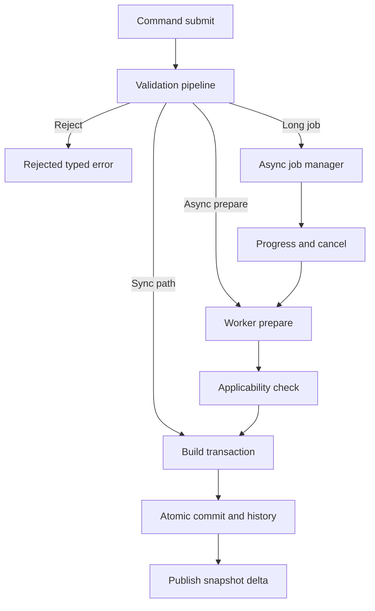

# Command Taxonomy

## Purpose

Canonical taxonomy of PhotoTux commands: scopes, mutation classes, execution classes, undo policies, and representative ID families. This appendix organizes the contracts in [08 — Command System](../08-Command-System.md) for implementers, reviewers, and extension authors. Normative keywords follow [Requirement Keywords](Requirement-Keywords.md).

Commands are the sole semantic mutation spine for **document-authoritative** commits ([08](../08-Command-System.md) Accepted v1). Presentations emit actions or QML slots; host adapters resolve to `SessionState::invoke`; commands produce transactions or typed failures. Widgets MUST NOT mutate the authoritative document graph outside this taxonomy.

### Shipped command IDs (v1 router)

Registered in `phototux_engine::command_id` and exercised via `SessionState::invoke`:

| Family | IDs |
| --- | --- |
| History | `history.undo`, `history.redo`, `history.jump` |
| Layer | `layer.create`, `layer.create-fill`, `layer.set-fill-color`, `layer.delete`, `layer.set-active`, `layer.set-visibility`, `layer.set-opacity`, `layer.set-blend`, `layer.reorder`, `layer.group`, `layer.ungroup`, `layer.set-clip`, `layer.set-locks` |
| View | `view.zoom-to`, `view.zoom-to-fit`, `view.pan-to`, `view.pan-by`, `view.zoom-at`, `view.set-tool` |
| Document | `document.new-preset`, `document.new-size`, `document.assign-profile`, `document.convert-profile`, `document.set-icc`, `document.set-soft-proof`, `document.crop`, `document.rotate-90` |
| Selection | `selection.replace`, `selection.deselect`, `selection.invert`, `selection.select-all`, `selection.modify`, `selection.color-select`, `selection.to-mask` |
| Mask | `mask.create`, `mask.delete`, `mask.set-enabled`, `mask.set-attributes`, `mask.create-vector`, `mask.apply`, `mask.to-selection` |
| Text / Shape | `text.create`, `text.set-content`, `text.bake`, `shape.create`, `shape.rasterize`, `shape.boolean` |
| Filter / style | `filter.add-adjustment`, `filter.set-parameters`, `filter.add-effect`, `filter.set-gaussian-radius`, `filter.preview`, `filter.set-preview-params`, `filter.commit`, `filter.cancel-preview`, `effect.reorder`, `effect.set-enabled`, `style.add`, `style.set-params`, `style.set-color`, `style.set-enabled`, `style.remove` |
| Clipboard / path | `clipboard.paste-layer`, `path.stroke-to-layer`, `path.set-closed`, `path.move-anchor`, `path.add-anchor`, `path.delete-anchor` |
| Raster | `raster.transform-commit`, `raster.flip`, `raster.fill`, `raster.gradient`, `raster.paint-stroke` |
| App / workspace | `app.show-preferences`, `app.show-filter-gallery`, `workspace.reset`, `workspace.toggle-panel`, `workspace.apply-preset` |

### Host-only exemptions (not document commands)

See **Host-only exemption catalog** below. High level: ephemeral previews; paint dab stream until `raster.paint-stroke`; tool chrome; file I/O adapters; telemetry. Prefs/workspace chrome is now registered as application/workspace commands that return `HostFollowUp` (host applies UI; document dirty unchanged).

## Taxonomy Axes

Every registered command descriptor MUST declare all of the following axes:

| Axis | Values | Meaning |
| --- | --- | --- |
| Scope | `application`, `window`, `workspace`, `document`, `view`, `resource`, `extension` | Authority boundary and scheduler key |
| Mutation class | `none`, `ephemeral`, `document`, `history-meta`, `workspace`, `preference`, `resource`, `destructive` | What truth changes |
| Execution class | `sync`, `async-prepare`, `async-job`, `streaming` | Scheduling and progress |
| Undo policy | `none`, `transaction`, `groupable`, `mergeable`, `checkpoint-assist` | History behavior |
| Conflict policy | `exact-version`, `rebase-safe`, `latest-wins-view`, `exclusive-op` | Version vector handling |
| Cancellation | `immediate`, `cooperative-phase`, `after-commit-via-undo` | Cancel semantics |
| Capability class | built-in core, host file, clipboard, extension-* | Authority required |

## Scope Families

### Application scope

Affects process-wide registries that are not a single document.

Representative IDs:

- `app.quit`
- `app.open-files`
- `app.show-preferences`
- `app.toggle-fullscreen` (window/host mediated)
- `resource.reload-catalog`
- `extension.enable`
- `extension.disable`

Rules:

- MUST NOT write document pixels or layer graphs directly.
- Document opens create documents through lifecycle + import commands, then switch focus.
- Preference mutations use preference schema versions, not document history.

### Window and workspace scope

Affect layout, panels, docking, tools presentation, and view arrangement.

Representative IDs:

- `workspace.apply-preset`
- `workspace.reset-layout`
- `workspace.save-preset`
- `panel.show`
- `panel.hide`
- `panel.pin-target`
- `dock.split`
- `dock.merge`
- `window.new`
- `window.close`

Rules:

- Workspace changes MUST NOT mark document modified unless an explicitly persisted document property changes.
- Missing panels/extensions degrade with tombstones or unavailable placeholders per [05](../05-Panel-System.md) and [23](../23-Plugin-SDK.md).
- Layout restore is reconciliation, not widget replay ([02](../02-Application-Lifecycle.md), [03](../03-Workspace-System.md)).

### Document scope

Mutates authoritative document state. This is the primary editing surface.

Sub-families:

| Sub-family | Examples | Notes |
| --- | --- | --- |
| Document properties | `document.set-size`, `document.assign-profile`, `document.convert-profile`, `document.set-icc` | Assign ≠ convert; optional ICC bytes ([16](../16-Color-Management.md)) |
| Persistence | `document.save`, `document.save-as`, `document.revert` | Staged writes ([27](../27-File-Formats.md)) |
| Layer structure | `layer.create`, `layer.delete`, `layer.reorder`, `layer.group`, `layer.ungroup` | Stable object IDs |
| Layer attributes | `layer.set-opacity`, `layer.set-blend`, `layer.set-visibility`, `layer.set-lock` | Compositing inputs |
| Raster edit | `raster.paint-stroke`, `raster.fill`, `raster.clear`, `raster.transform` | Tile-aware transactions |
| Selection | `selection.replace`, `selection.union`, `selection.invert`, `selection.deselect` | Object vs pixel selection distinct |
| Mask | `mask.create`, `mask.paint`, `mask.disable`, `mask.apply` | Active edit target switches |
| Filter | `filter.apply-destructive`, `filter.add-adjustment`, `filter.set-parameters` | Preview then commit |
| Text/shape | `text.create`, `text.set-content`, `shape.create`, `shape.set-path` | Rasterize is explicit |
| History | `history.undo`, `history.redo`, `history.clear` (destructive policy) | New monotonic versions |
| Clipboard | `clipboard.copy`, `clipboard.cut`, `clipboard.paste` | Validated payloads |
| Import into doc | `document.import-layers`, `document.place-file` | Untrusted input limits |

### View scope

Affects canvas view state for a document projection.

Representative IDs:

- `view.zoom-in`
- `view.zoom-to`
- `view.pan-by`
- `view.rotate-to`
- `view.toggle-proof`
- `view.toggle-guides`
- `view.set-overlay`

Rules:

- View-only commands SHOULD use undo policy `none` unless the product explicitly records view bookmarks as user data.
- Multiple views MAY reference one document; view commands target a `ViewId`.

### Resource scope

Mutates application or document-embedded resources (brushes, gradients, profiles references, presets).

Representative IDs:

- `brush.create-preset`
- `brush.update-preset`
- `palette.import`
- `profile.install-local`

Rules:

- Embedding into a document is a document-scoped command.
- Missing resources produce typed unavailable states, not silent substitution.

### Extension scope

Commands contributed by plugins through [23 — Plugin SDK](../23-Plugin-SDK.md).

Rules:

- IDs MUST be namespaced: `ext.<publisher>.<name>`.
- Schemas are bounded and versioned.
- Execution occurs under capability grants and budgets.
- Removal MUST NOT corrupt core history; opaque records or checkpoints apply.

## Mutation Classes

### none

Read-only or navigational. Examples: command search preview queries, enablement probes. Prefer non-command queries when no shared semantic state changes.

### ephemeral

Transient tool preview, hover sample, rubber-band rectangle. MAY update presentation caches. MUST NOT publish document versions. Commit converts ephemeral state into a document command.

### document

Ordinary editable mutation producing a history transaction (unless `NoChange`).

### history-meta

Undo/redo/clear and coalescing control. Undo/redo still publish new document versions.

### workspace / preference / resource

Non-document persistence domains with separate schemas and migration ([24](../24-Preferences.md), [03](../03-Workspace-System.md)).

### destructive

Discards editability or exceeds ordinary undo guarantees (flatten, rasterize with source drop, clear history, overwrite unique file without backup policy). Destructive commands MUST:

- use precise naming;
- disclose consequences in UI and accessibility descriptions;
- default to non-destructive alternatives when available;
- never be the initial default focus in dialogs ([26](../26-Dialogs.md), [29](../29-Accessibility.md)).

## Execution Classes

| Class | Use when | Progress | Cancel |
| --- | --- | --- | --- |
| `sync` | Validation + commit fit interactive budget | Optional busy | Before commit |
| `async-prepare` | Heavy preparation, short commit | Preview/progress | Cooperative; stale results discarded |
| `async-job` | Import, export, full-document filter | Required after 250 ms | Phase-bounded |
| `streaming` | Encode/decode chunk streams | Chunk/tile | Boundary cancel |

Brush strokes typically use mergeable sync or short prepare batches. Full-document filters and exports MUST be jobs.

## Undo and Merge Policies

| Policy | Behavior | Typical commands |
| --- | --- | --- |
| `none` | No history entry | View zoom, panel show |
| `transaction` | One undo step | Set opacity, create layer |
| `groupable` | Explicit begin/end group | Multi-layer reorder dialog |
| `mergeable` | Coalesce continuous gesture | Paint stroke segments |
| `checkpoint-assist` | May request checkpoint for traversal | Huge filter, structural replace |

Merge MUST preserve deterministic undo boundaries. Merge changes history presentation, not semantic ordering ([20](../20-History-Undo.md)).

## Validation Stages (Taxonomy View)

Commands fail by stage; error categories map to [Error Taxonomy](Error-Taxonomy.md):

1. Registry / schema → `malformed` / `unsupported`
2. Authority → `permission`
3. Lifecycle → `lifecycle`
4. Target resolution → `unavailable-target`
5. Version → `version-conflict`
6. Semantic invariants → `semantic` / `invariant`
7. Resources → `resource-pressure`
8. Commit race → `version-conflict` or abandon

Enablement is advisory. Execution ALWAYS revalidates.

## Representative Command Catalog

The following catalog is normative for naming patterns and taxonomy placement. Exact parameter schemas live with subsystem descriptors; this list is the handbook index.

### Document lifecycle

| ID | Scope | Mutation | Exec | Undo |
| --- | --- | --- | --- | --- |
| `document.new` | application/document | document | sync | none (creation) |
| `document.open` | application | document | async-job | none |
| `document.close` | document | history-meta/lifecycle | sync | none |
| `document.save` | document | document meta | async-job | none |
| `document.save-as` | document | document meta | async-job | none |
| `document.export` | document | none (delivery) | async-job/streaming | none |
| `document.revert` | document | document | async-job | transaction or replace |

### Layers

| ID | Notes |
| --- | --- |
| `layer.create-raster` | Inserts with stable ID |
| `layer.create-adjustment` | Nondestructive node |
| `layer.create-fill` | |
| `layer.create-text` | Text engine |
| `layer.create-shape` | Shape engine |
| `layer.duplicate` | New IDs, copy resources by policy |
| `layer.delete` | Inverse restores graph |
| `layer.reorder` | Atomic multi-target |
| `layer.set-name` | Accessibility name source |
| `layer.set-opacity` | |
| `layer.set-blend-mode` | Color/precision aware |
| `layer.set-visibility` | |
| `layer.set-lock-flags` | |
| `layer.rasterize` | Destructive disclosure |
| `layer.merge-down` | Destructive disclosure |
| `layer.flatten-visible` | Destructive disclosure |

### Selection and masks

| ID | Notes |
| --- | --- |
| `selection.set-pixel` | Replace coverage |
| `selection.modify` | Expand/contract/feather |
| `selection.select-object` | Object selection distinct |
| `selection.clear` | |
| `edit-target.set` | Layer pixels vs mask |
| `mask.create` | Attached coverage |
| `mask.from-selection` | |
| `mask.disable` | |
| `mask.apply-to-layer` | Often destructive to mask editability |

### Painting and transforms

| ID | Notes |
| --- | --- |
| `brush.begin-stroke` | Optional explicit group |
| `brush.append-stroke` | Mergeable |
| `brush.end-stroke` | Finalize merge |
| `raster.fill` | Selection-aware |
| `raster.erase` | |
| `transform.preview` | Ephemeral |
| `transform.commit` | Transaction |
| `transform.nudge` | Keyboard alternative |

### Filters and color

| ID | Notes |
| --- | --- |
| `filter.preview` | Ephemeral / job prepare |
| `filter.commit` | Destructive or adjustment |
| `adjustment.create` | Nondestructive |
| `adjustment.set-parameters` | Live preview + commit |
| `color.assign-profile` | Interpretation only |
| `color.convert-profile` | Pixel mutation |
| `color.set-proofing` | View or document policy per descriptor |
| `document.assign-profile` | Tag-only; shipped |
| `document.convert-profile` | Approx pixel path for named tags |
| `document.set-icc` | Embed/clear validated ICC bytes on `DocumentColorState`; history label; `.ptx` via graph JSON |
| `document.set-soft-proof` | View-like; no dirty / no generation bump |

### History

| ID | Notes |
| --- | --- |
| `history.undo` | New version |
| `history.redo` | New version |
| `history.jump` | If exposed; budget-checked |
| `history.clear` | Destructive |

### Clipboard

| ID | Notes |
| --- | --- |
| `clipboard.copy` | Internal schema + host MIME |
| `clipboard.cut` | Copy + delete transaction group |
| `clipboard.paste` | Validate like import |
| `clipboard.paste-special` | Explicit conversion choices |

## Action-to-Command Mapping Rules

From [01 — Information Architecture](../01-Information-Architecture.md) and [08](../08-Command-System.md):

- One action normally maps to one command.
- Many presentations MAY share one command ID with different parameter presets.
- Display labels localize; command IDs do not.
- Context menus, toolbars, shortcuts, and accessibility actions MUST resolve to the same IDs for the same semantics.
- View-only actions that change only ephemeral UI MAY omit commands if no cross-view shared state persists; if state persists in workspace/preferences, a command is REQUIRED.

## Plugin Command Constraints

Extension commands MUST declare:

- publisher namespace and semantic ID;
- schema and behavior versions;
- required capabilities;
- memory/time/queue budgets;
- undo policy compatible with opaque history rules;
- thread class (never UI thread for untrusted work);
- determinism claims if replay is offered.

Host MUST reject descriptors that:

- duplicate built-in IDs;
- request ambient authority;
- omit bounds on parameters;
- claim destructive effects without disclosure metadata;
- require network, accounts, or generative services.

## Naming Conventions

Command IDs MUST:

- use `domain.verb-object` kebab-case segments;
- avoid toolkit, menu path, or vendor product terms;
- remain stable across UI rearrangements;
- change ID or schema version when semantic outcome changes.

Good: `layer.set-opacity`, `mask.paint`, `document.convert-profile`.  
Bad: `LayersPanel/OpacitySliderChanged`, `photoshopFlatten`, `aiSelectSubject`.

## Observability Fields

Every invocation SHOULD correlate:

- `action_id` (optional)
- `command_id`
- `invocation_id`
- `operation_id` (async)
- `transaction_id` (if committed)
- `document_id` / `view_id` / `workspace_id`
- `correlation_id`

Diagnostics MUST exclude pixel payloads and private paths by default ([08](../08-Command-System.md)).

## Acceptance Checklist

- [ ] Every user-visible mutation has a command ID in this taxonomy’s families.
- [ ] Descriptors declare all axes.
- [ ] Destructive commands disclose and are test-covered.
- [ ] Mergeable stroke commands produce one undo step per gesture policy.
- [ ] Export does not clear document modified state.
- [ ] Extension commands are capability-scoped and budgeted.
- [x] Headless tests invoke commands without UI toolkits (engine `commands` module tests).

## Shipped built-in IDs × axes (`phototux_engine::command_meta`)

Source of truth: `CommandMeta` / `COMMAND_META_ALL` in engine (must cover every `command_id::ALL`). Axes: scope · mutation · undo · conflict.

| Family | Scope | Mutation | Undo | Conflict |
| --- | --- | --- | --- | --- |
| `history.undo` / `history.redo` | document | history-meta | none | exclusive-op |
| `layer.*` (except set-active) | document | document | transaction / mergeable (opacity) | exact-version |
| `layer.set-active` | document | ephemeral | none | latest-wins-view |
| `view.*` | view | ephemeral | none | latest-wins-view |
| `document.new-*` | document | document | none | exclusive-op |
| `document.assign/convert/crop/rotate` | document | document | transaction | exact-version |
| `selection.*` | selection | document | transaction | exact-version |
| `mask.*` / `text.*` / `shape.*` / `filter.*` / `style.*` | document | document | transaction / mergeable (params) | exact-version |
| `clipboard.paste-layer` / `path.stroke-to-layer` / `raster.*` | document | document | transaction / groupable (paint-stroke) | exact-version |
| `app.show-preferences` | application | preference | none | latest-wins-view |
| `workspace.reset` / `workspace.toggle-panel` | workspace | workspace | none | latest-wins-view |

Paint dabs remain `EngineCommand` until stroke-end `raster.paint-stroke`.

## Host-only exemption catalog

Operations that MUST NOT go through document-authoritative `SessionState::invoke` as graph mutations. Chrome that is registered above still uses `HostFollowUp` for the actual UI side effect.

| Class | Owner | Examples | Why exempt / host |
| --- | --- | --- | --- |
| Paint stream | `phototux_canvas` / paint worker | Dab `EngineCommand` traffic | Streaming; commits via `raster.paint-stroke` |
| Ephemeral previews | UI + GPU | Selection rubber-band, crop/transform drafts | Not committed until replace/commit command |
| Tool chrome | `AppSession` | Brush size/hardness, FG/BG, eyedropper sample | Presentation state; not document graph |
| File I/O adapters | `phototux_io` + file worker | Open/save/export/PSD/`.ptx` | Host I/O; dirty/receipt after success |
| Destructive file chrome | QML + `host_op` | `document.new/open/close`, `app.quit` | Dialog + unsaved gate before session replace |
| Dialog chrome | QML | About, save-as, export, command palette open | Presentation; palette invokes actions by id |
| Telemetry | UI | FPS, status text, startup ms | Non-authoritative |
| `HostFollowUp::ConvertPixels` | UI GPU path | After `document.convert-profile` | Pixel rewrite after command commits metadata |
| GPU recover chrome | `action.app.recover-gpu` → `app.recover_gpu` | Rebuild GPU resources from engine graph; does not mutate document generation | Device/surface loss UX (P6) |
| Clipboard mask/selection | `clipboard.copy_selection_mask`, `clipboard.copy_layer_mask`, `clipboard.paste_selection`, `clipboard.paste_mask` | App-local R8 payloads (+ OS grayscale preview); paste restores selection or layer mask | Handbook §21 Met spine |
| Remaining `host_op` | `actions.rs` → `dispatch_host_op` | Selection modify GPU path, shape create wrappers, guides toggles, clipboard copy, mask paint helpers | Bridge until fully routed; still must not bypass history for document pixels without a command |

## Cross References

- [08 — Command System](../08-Command-System.md)
- [01 — Information Architecture](../01-Information-Architecture.md)
- [10 — Document Model](../10-Document-Model.md)
- [20 — History Undo](../20-History-Undo.md)
- [23 — Plugin SDK](../23-Plugin-SDK.md)
- [Error Taxonomy](Error-Taxonomy.md)
- [Event Catalog](Event-Catalog.md)
- [Glossary](Glossary.md)
