# Cross-Reference Index

## Purpose

Canonical map of the PhotoTux engineering handbook: all numbered specifications `00`–`32`, appendices, dependency relationships, and reading orders. Every file listed here exists and is linked. Normative keywords follow [Requirement Keywords](Requirement-Keywords.md). Terms follow the [Glossary](Glossary.md).

PhotoTux is a Linux-native, local-first professional raster editor. Commands mutate; the document owns truth; history stores transactions; rendering reads immutable snapshots. Cloud, accounts, AI/generative features, and proprietary vendor workflows are out of scope ([00 — Introduction](../00-Introduction.md)).

## Handbook Entry

- [docs/README.md](../README.md) — purpose, reading order, conventions, directory map

## Numbered Specifications (00–32)

All status values are **Present**.

### 00 — Introduction and System Charter

- File: [00-Introduction.md](../00-Introduction.md)
- Role: Product boundary, principles, personas, quality targets, container/context views, ownership, trust, failure philosophy, foundation invariants.
- Depends on: — (charter root)
- Primary consumers: all documents

### 01 — Information Architecture

- File: [01-Information-Architecture.md](../01-Information-Architecture.md)
- Role: Mental model, hierarchy, actions, selection/focus/context/active target, menus, progressive disclosure, a11y semantics at IA level.
- Depends on: 00

### 02 — Application Lifecycle

- File: [02-Application-Lifecycle.md](../02-Application-Lifecycle.md)
- Role: Startup, session, windows/documents lifetime, save coordination, recovery, device/surface loss, shutdown.
- Depends on: 00, 01

### 03 — Workspace System

- File: [03-Workspace-System.md](../03-Workspace-System.md)
- Role: Workspaces, views, presets, multi-view documents, restore reconciliation.
- Depends on: 01, 02

### 04 — Docking System

- File: [04-Docking-System.md](../04-Docking-System.md)
- Role: Split/stack layout topology, docking geometry, display changes.
- Depends on: 03

### 05 — Panel System

- File: [05-Panel-System.md](../05-Panel-System.md)
- Role: Panel descriptors, follow/pin targets, virtualization, contributions.
- Depends on: 01, 03, 04

### 06 — Toolbar System

- File: [06-Toolbar-System.md](../06-Toolbar-System.md)
- Role: Tool presentation, placement, toolbar customization.
- Depends on: 01, 03, 08

### 07 — Context Menus

- File: [07-Context-Menus.md](../07-Context-Menus.md)
- Role: Context targets, completeness vs menus/actions, selection preservation.
- Depends on: 01, 08

### 08 — Command System

- File: [08-Command-System.md](../08-Command-System.md)
- Role: Mutation spine, validation, scheduling, transactions, jobs, cancellation, typed results.
- Depends on: 00, 10, 20

### 09 — Shortcut System

- File: [09-Shortcut-System.md](../09-Shortcut-System.md)
- Role: Bindings, conflicts, IME yield, customization, a11y alternatives.
- Depends on: 01, 08

### 10 — Document Model

- File: [10-Document-Model.md](../10-Document-Model.md)
- Role: Authoritative graph, identity, versions, snapshots/deltas, dirty/save identity.
- Depends on: 00, 08

### 11 — Layer System

- File: [11-Layer-System.md](../11-Layer-System.md)
- Role: Layer tree, kinds, blend/opacity, groups, compositing inputs.
- Depends on: 10, 08, 16

### 12 — Selection System

- File: [12-Selection-System.md](../12-Selection-System.md)
- Role: Object and pixel selection, operations, persistence.
- Depends on: 01, 10, 08

### 13 — Mask System

- File: [13-Mask-System.md](../13-Mask-System.md)
- Role: Mask attachment, edit surfaces, apply/disable semantics.
- Depends on: 10, 11, 12, 08

### 14 — Brush Engine

- File: [14-Brush-Engine.md](../14-Brush-Engine.md)
- Role: Input sampling, dabs, dynamics, stroke transactions, latency path.
- Depends on: 08, 10, 12, 13, 17, 30

### 15 — Filter Engine

- File: [15-Filter-Engine.md](../15-Filter-Engine.md)
- Role: Filter descriptors, CPU/wgpu paths, previews, destructive vs adjustment.
- Depends on: 08, 10, 16, 17, 30

### 16 — Color Management

- File: [16-Color-Management.md](../16-Color-Management.md)
- Role: Profiles, assign vs convert, proofing, precision, Linux color integration.
- Depends on: 10, 08, 17

### 17 — Rendering Engine

- File: [17-Rendering-Engine.md](../17-Rendering-Engine.md)
- Role: Render graph, tiles, dirty regions, frame scheduling, GPU/CPU, device loss.
- Depends on: 10, 11, 13, 16, 30

### 18 — Text Engine

- File: [18-Text-Engine.md](../18-Text-Engine.md)
- Role: Text objects, shaping, rasterize boundaries, editability.
- Depends on: 10, 11, 08, 16

### 19 — Shape Engine

- File: [19-Shape-Engine.md](../19-Shape-Engine.md)
- Role: Vector-like shapes, paths, rasterize boundaries.
- Depends on: 10, 11, 08, 16

### 20 — History and Undo

- File: [20-History-Undo.md](../20-History-Undo.md)
- Role: Transactions, coalescing, checkpoints, budgets, undo/redo.
- Depends on: 08, 10

### 21 — Clipboard

- File: [21-Clipboard.md](../21-Clipboard.md)
- Role: Internal/external transfer, MIME validation, paste commands.
- Depends on: 08, 10, 22

### 22 — Import and Export

- File: [22-Import-Export.md](../22-Import-Export.md)
- Role: Codecs, untrusted input, progress/cancel, loss disclosure.
- Depends on: 08, 10, 16, 27

### 23 — Plugin SDK

- File: [23-Plugin-SDK.md](../23-Plugin-SDK.md)
- Role: Manifests, capabilities, contributions, isolation, unavailable extensions.
- Depends on: 08, 01, 22, 29, 30

### 24 — Preferences

- File: [24-Preferences.md](../24-Preferences.md)
- Role: Preference schemas, migration, scopes.
- Depends on: 00, 02, 29

### 25 — Themes

- File: [25-Themes.md](../25-Themes.md)
- Role: Tokens, contrast, scaling, motion preferences.
- Depends on: 01, 29

### 26 — Dialogs

- File: [26-Dialogs.md](../26-Dialogs.md)
- Role: Modal/task dialogs, focus return, portals.
- Depends on: 01, 02, 29

### 27 — File Formats

- File: [27-File-Formats.md](../27-File-Formats.md)
- Role: Native container, chunks, integrity, migration, recovery bridge.
- Depends on: 10, 22, 20

### 28 — UX Guidelines

- File: [28-UX-Guidelines.md](../28-UX-Guidelines.md)
- Role: Interaction quality, disclosure, naming, feedback patterns.
- Depends on: 01, 29

### 29 — Accessibility

- File: [29-Accessibility.md](../29-Accessibility.md)
- Role: Semantic tree, focus, keyboard, canvas a11y, AT-SPI, announcements.
- Depends on: 01, 08, 09, 25

### 30 — Performance

- File: [30-Performance.md](../30-Performance.md)
- Role: Budgets, tiers, tracing, backpressure, regression gates.
- Depends on: 08, 14, 17, 22

### 31 — Testing

- File: [31-Testing.md](../31-Testing.md)
- Role: Pyramid, fixtures, fuzz, GPU tolerances, a11y/perf gates, evidence.
- Depends on: all preceding contracts as applicable

### 32 — Developer Guide

- File: [32-Developer-Guide.md](../32-Developer-Guide.md)
- Role: Engineering workflow, handbook use, contribution practices.
- Depends on: 00, appendices, relevant subsystem docs

## Appendices

All status values are **Present**.

| Appendix | File | Role |
| --- | --- | --- |
| Glossary | [Glossary.md](Glossary.md) | Vendor-neutral vocabulary |
| Requirement Keywords | [Requirement-Keywords.md](Requirement-Keywords.md) | MUST/SHOULD/MAY interpretation |
| Cross-Reference Index | [Cross-Reference-Index.md](Cross-Reference-Index.md) | This map |
| Subsystem Dependency Matrix | [Subsystem-Dependency-Matrix.md](Subsystem-Dependency-Matrix.md) | Allowed dependency edges |
| Command Taxonomy | [Command-Taxonomy.md](Command-Taxonomy.md) | Command scopes and families |
| Event Catalog | [Event-Catalog.md](Event-Catalog.md) | Semantic event families |
| Document Format Versioning | [Document-Format-Versioning.md](Document-Format-Versioning.md) | Schema/feature/migration rules |
| Error Taxonomy | [Error-Taxonomy.md](Error-Taxonomy.md) | Typed failure categories |
| Thread Ownership Map | [Thread-Ownership-Map.md](Thread-Ownership-Map.md) | Role threads and ownership |
| Performance Budget Ledger | [Performance-Budget-Ledger.md](Performance-Budget-Ledger.md) | Budget index and owners |
| Accessibility Checklist | [Accessibility-Checklist.md](Accessibility-Checklist.md) | Conformance checklist |
| Decision Register | [Decision-Register.md](Decision-Register.md) | Architectural decisions |
| Codebase–Handbook Gap Analysis | [Codebase-Handbook-Gap-Analysis.md](Codebase-Handbook-Gap-Analysis.md) | Live crates vs handbook |
| Alignment Roadmap | [Alignment-Roadmap.md](Alignment-Roadmap.md) | Locked decisions + phases |
| Implementation Checklist | [Implementation-Checklist.md](Implementation-Checklist.md) | Living slice tracker |

## Dependency Overview

```mermaid
flowchart TB
    Intro[00_Introduction] --> IA[01_InformationArchitecture]
    Intro --> Commands[08_CommandSystem]
    Intro --> Document[10_DocumentModel]
    IA --> Life[02_ApplicationLifecycle]
    Life --> Workspace[03_WorkspaceSystem]
    Workspace --> Dock[04_DockingSystem]
    Workspace --> Panels[05_PanelSystem]
    IA --> Toolbars[06_ToolbarSystem]
    IA --> ContextMenus[07_ContextMenus]
    IA --> Shortcuts[09_ShortcutSystem]
    Commands --> Document
    Document --> Layers[11_LayerSystem]
    Document --> Selection[12_SelectionSystem]
    Document --> Masks[13_MaskSystem]
    Document --> History[20_HistoryUndo]
    Commands --> History
    Commands --> Brush[14_BrushEngine]
    Commands --> Filters[15_FilterEngine]
    Document --> Color[16_ColorManagement]
    Document --> Render[17_RenderingEngine]
    Layers --> Render
    Color --> Render
    Document --> Text[18_TextEngine]
    Document --> Shapes[19_ShapeEngine]
    Commands --> Clipboard[21_Clipboard]
    Commands --> ImportExport[22_ImportExport]
    ImportExport --> Formats[27_FileFormats]
    Document --> Formats
    Commands --> Plugins[23_PluginSDK]
    IA --> Prefs[24_Preferences]
    IA --> Themes[25_Themes]
    Life --> Dialogs[26_Dialogs]
    IA --> UX[28_UXGuidelines]
    IA --> A11y[29_Accessibility]
    Render --> Perf[30_Performance]
    Brush --> Perf
    ImportExport --> Perf
    Commands --> Testing[31_Testing]
    Render --> Testing
    A11y --> Testing
    Intro --> DevGuide[32_DeveloperGuide]
```



Detailed edge rules: [Subsystem Dependency Matrix](Subsystem-Dependency-Matrix.md).

## Reading Paths

### New engineer (first week)

1. [docs/README.md](../README.md)
2. [00 — Introduction](../00-Introduction.md)
3. [Requirement Keywords](Requirement-Keywords.md) + [Glossary](Glossary.md)
4. [01 — Information Architecture](../01-Information-Architecture.md)
5. [08 — Command System](../08-Command-System.md) + [Command Taxonomy](Command-Taxonomy.md)
6. [10 — Document Model](../10-Document-Model.md)
7. [20 — History Undo](../20-History-Undo.md)
8. [17 — Rendering Engine](../17-Rendering-Engine.md)
9. [Decision Register](Decision-Register.md)
10. Role-specific path below

### Core document engineer

00 → 10 → 11 → 12 → 13 → 08 → 20 → 27 → [Document Format Versioning](Document-Format-Versioning.md) → [Error Taxonomy](Error-Taxonomy.md) → 31

### Renderer / GPU engineer

00 → 10 → 11 → 13 → 16 → 17 → 30 → [Performance Budget Ledger](Performance-Budget-Ledger.md) → [Thread Ownership Map](Thread-Ownership-Map.md) → 31

### Linux UI / shell engineer

00 → 01 → 02 → 03 → 04 → 05 → 06 → 07 → 09 → 24 → 25 → 26 → 28 → 29 → [Accessibility Checklist](Accessibility-Checklist.md)

### Tool and brush engineer

00 → 01 → 08 → 10 → 12 → 13 → 14 → 17 → 30 → [Event Catalog](Event-Catalog.md)

### Format / I/O engineer

00 → 10 → 16 → 22 → 27 → 21 → [Document Format Versioning](Document-Format-Versioning.md) → [Error Taxonomy](Error-Taxonomy.md) → 31

### Extension engineer

00 → 01 → 08 → 23 → 15 → 22 → 05 → 29 → [Command Taxonomy](Command-Taxonomy.md) → [Decision Register](Decision-Register.md) (DR-009)

### Accessibility engineer

00 → 01 → 08 → 09 → 29 → 25 → 07 → 26 → [Accessibility Checklist](Accessibility-Checklist.md) → [Event Catalog](Event-Catalog.md)

## Cross-Reference Rules

- Existing documents MUST use relative Markdown links with exact filenames.
- Every numbered document SHOULD link to 00, direct predecessors, Glossary, Requirement Keywords, and this index where relevant.
- Renames MUST update this index, [docs/README.md](../README.md), and repository references atomically.
- Dependency changes MUST update [Subsystem Dependency Matrix](Subsystem-Dependency-Matrix.md) in the same change.
- High-cost decisions MUST appear in [Decision Register](Decision-Register.md).
- Cross references SHOULD state why the target matters, not only list neighbors.
- Competing industry terms SHOULD defer to the Glossary.

## Quick File Manifest

```text
docs/
├── README.md
├── 00-Introduction.md … 32-Developer-Guide.md
└── Appendix/
    ├── Glossary.md
    ├── Requirement-Keywords.md
    ├── Cross-Reference-Index.md
    ├── Subsystem-Dependency-Matrix.md
    ├── Command-Taxonomy.md
    ├── Event-Catalog.md
    ├── Document-Format-Versioning.md
    ├── Error-Taxonomy.md
    ├── Thread-Ownership-Map.md
    ├── Performance-Budget-Ledger.md
    ├── Accessibility-Checklist.md
    ├── Decision-Register.md
    ├── Codebase-Handbook-Gap-Analysis.md
    ├── Alignment-Roadmap.md
    └── Implementation-Checklist.md
```
