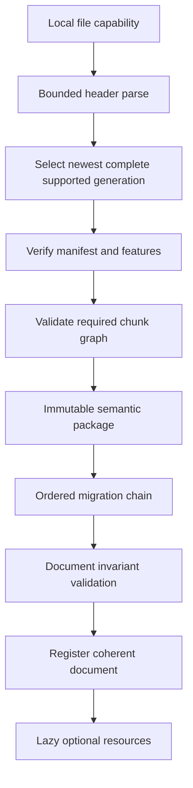

# Document Format Versioning

## Purpose

Versioning, compatibility, migration, and identity rules for PhotoTux native editable documents and related persistence domains. This appendix consolidates contracts from [27 — File Formats](../27-File-Formats.md), [10 — Document Model](../10-Document-Model.md), [22 — Import and Export](../22-Import-Export.md), and [20 — History Undo](../20-History-Undo.md). Normative keywords follow [Requirement Keywords](Requirement-Keywords.md).

**Encoding status:** `.ptx` **format version 2** writers (typed chunks `MANI` / `RASL` / `MASK` + whole-body CRC32) and **v1 read** compatibility are **Accepted** ([DR-026](Decision-Register.md#dr-026--native-ptx-container-v1)). Tile-addressable sparse resources, incremental save, and further integrity strategies remain **Provisional** (Phase 5 evidence). Semantic versioning rules below stay binding for encoding evolution.

## Versioned Surfaces

PhotoTux persists multiple independent versioned surfaces. They MUST NOT be conflated.

| Surface | Owner doc | Identifies | Evolves when |
| --- | --- | --- | --- |
| Container version | 27 | Envelope parse rules | Header layout, locator, integrity algorithm family |
| Container generation | 27 | One committed manifest set in a file | Each successful save generation |
| Manifest schema | 27 | Root manifest fields | Manifest shape changes |
| Chunk schema | 27 | Per-chunk kind semantics | Object/resource encodings |
| Feature set | 27 | Required/optional capabilities | New semantic features |
| Document semantic schema | 10/27 | Object graph meaning | Layer/mask/effect/selection semantics |
| Behavior version | 10/15/16/18 | Observable evaluation rules | Blend, color, filter, text shaping changes |
| History schema | 20/27 | Transaction/checkpoint encoding | Inverse representation changes |
| Workspace schema | 03/24 | Layout/presets | Panel topology, follow/pin |
| Preferences schema | 24 | User settings | Preference keys |
| Session/recovery schema | 02 | Crash recovery | Recovery headers |
| Command schema | 08 | Invocation parameters | Command contracts |
| Extension payload schema | 23 | Opaque contribution data | Plugin contracts |
| Clipboard internal schema | 21 | In-app transfer | Clipboard feature set |
| Interchange export profile | 22 | Delivery formats | Codec capability matrix |

Document modified state compares authoritative document version to persisted editable identity. Export completion MUST NOT clear modified state.

## Identity Triad

Three identifiers travel together on open/save:

1. **Persisted document ID** — stable across saves; not path, not display name.
2. **Document version** — monotonic runtime/authoritative evolution; undo/redo create new versions.
3. **Persisted snapshot identity / fingerprint** — exact semantic snapshot encoded in a container generation.

```text
save(document version N) → container generation G encoding persisted snapshot identity S(N)
if user edits to version N+1 before save settles → document remains modified after G commits for S(N)
```

Container generation ≠ document version. Incremental strategies may retain generation G−1 until G verifies.

## Compatibility Model

Compatibility uses **feature declarations** plus **per-chunk schema versions** ([27](../27-File-Formats.md)):

| Reader vs file | Required unknown feature | Optional unknown chunk | Known older schema |
| --- | --- | --- | --- |
| Older reader | Reject or explicit degraded read-only | Skip/preserve opaque | N/A |
| Newer reader | N/A | Preserve if safe | Migrate in quarantine |
| Newer writer from newer source | Preserve opaque when unchanged/safe | Relocate with validated locators | Write current + compatibility |

Rules:

- Forward compatibility is not “ignore fields.”
- Unknown semantics affecting compositing, color, containment, transforms, history, or required resources make free editing unsafe → reject or read-only/degraded with disclosure.
- Editing an unknown object is disallowed unless a fallback contract permits specific generic operations.
- Save MUST warn/reject if an operation would invalidate preserved unknown data the user still needs.

## Feature IDs

Feature IDs are stable strings in a vendor-neutral namespace, for example:

- `core.layers.raster`
- `core.layers.adjustment`
- `core.masks.raster`
- `core.selection.pixel`
- `core.color.icc`
- `core.text.basic`
- `core.shape.basic`
- `core.history.transactions`
- `ext.<publisher>.<feature>`

A file’s manifest lists `required_features` and `optional_features`. Readers MUST support every required feature or refuse unsafe interpretation.

## Schema Version Numbers

Conceptual policy (exact integer encoding deferred with container):

- Schemas use monotonic integers or `major.minor` pairs where major breaks required interpretation.
- Compatible additions use optional fields with defaults; minor advances.
- Removing/redefining meaning requires major advance or new chunk kind / command ID.
- Rust types are never the persistence schema. Serialization is an explicit mapping.

```rust
struct SchemaVersion {
    major: u16,
    minor: u16,
}

struct CompatibilityDeclaration {
    container_version: ContainerVersion,
    manifest_schema: SchemaVersion,
    required_features: BoundedSet<FeatureId>,
    optional_features: BoundedSet<FeatureId>,
    min_reader_feature_level: FeatureLevel,
}
```

## Migration Pipeline

Migration is semantic, not byte-casting:



Migration interface (conceptual):

- pure/transaction-like over quarantined packages;
- checked budgets, deterministic ordering, cancellation;
- no host/network access;
- original file untouched until user saves migrated document;
- opening migration MUST NOT silently replace source.

Behavior versions advance when observable evaluation changes: blend equations, color/alpha interpretation, coordinates, text shaping assumptions, filter behavior, containment, metadata meaning, history inverses. Pure syntactic re-encoding may retain semantic version.

## Unknown Data Preservation

Unknown optional chunks use an opaque envelope:

- original bytes / chunk identity;
- schema and required/optional class;
- validated references and bounds;
- integrity codes.

Writers may relocate envelopes and update outer locators only. Writers MUST NOT invent inner references into new offsets without understanding the schema.

Unavailable extension objects:

- preserve opaque payload;
- show unavailable node or cached fallback only under explicit policy;
- never silently delete ([23](../23-Plugin-SDK.md)).

## History Persistence Versioning

History is optional in the container but, when present:

- uses its own schema version;
- stores transaction meaning and reversible data, not raw UI events;
- extension-owned reversible records need durable opaque handling or checkpoints before third-party commitment;
- clearing history is a destructive command with disclosure;
- reopen may omit history without losing current document snapshot.

Checkpoints accelerate traversal; they do not replace transaction semantics ([20](../20-History-Undo.md)).

## Non-Document Persistence Domains

These schemas migrate independently:

| Domain | Failure mode |
| --- | --- |
| Preferences | Reset key/group; keep others |
| Workspace presets | Fall back to default layout |
| Session hints | Discard; start clean shell |
| Recovery headers | Offer explicit restore; never silent overwrite |
| Shortcut maps | Disable conflicting bindings; keep actions |
| Theme overrides | Fall back to default tokens |

Unknown fields SHOULD survive round trips where representation permits. Migrations retain originals until replacement validates ([02](../02-Application-Lifecycle.md), [24](../24-Preferences.md)).

## Interchange vs Native

| Concern | Native container | Third-party import/export |
| --- | --- | --- |
| Goal | Faithful editable round trip | Delivery / interchange |
| Loss | Forbidden silently | Disclosed before/at conversion |
| Identity | Persisted document ID | New import usually new document ID |
| Extensions | Opaque preserve | Usually flattened/lost |
| History | Optional preserve | Not expected |
| Versioning | Feature + chunk schemas | Codec capability matrix ([22](../22-Import-Export.md)) |

Importing a documented third-party format is not a proprietary workflow. Support MUST stay behind format adapters and independent fixtures.

## Save Generation Rules

Regardless of rewrite/append/CoW strategy candidate:

1. Destination generation is self-contained under declared external-reference policy.
2. Previous valid file remains until new generation verifies/replaces.
3. Interrupted save yields old valid or new valid state—not an accepted half generation.
4. Compaction is staged and independently verifiable.
5. In-place overwrite of unique authoritative chunks without recoverable generation is prohibited.
6. Read-back verification uses reader path, not writer memory assumptions.

## Version Negotiation for Plugins

Plugins negotiate:

- host protocol version;
- contribution schema versions;
- serialized object/filter/format schema versions.

Mismatch outcomes: refuse contribution, load read-only converter, or mark unavailable. Core history and document open MUST remain possible when optional contributions are missing.

## Compatibility Matrix (Reader Guidance)

| File state | Open result | Edit | Save |
| --- | --- | --- | --- |
| Fully supported | Ready | Full | Normal |
| Unknown optional only | Ready + preserve | Full with preserve warnings | Preserve opaque |
| Unknown required feature | Reject or degraded read-only | No unsafe edits | Save-as migrated only if policy allows |
| Failed integrity | Reject | — | — |
| Migration needed | Migrate in memory | Full after register | Writes current schemas |
| Missing extension | Ready + unavailable nodes | Limited on those nodes | Preserve opaque |

## Determinism and Testing

Format versioning tests MUST cover:

- round trip of each required feature set;
- unknown optional preserve;
- unknown required reject/degrade;
- migration chain fixtures per schema epoch;
- torn write / truncated generation rejection;
- duplicate hostile IDs rejected before visibility;
- save race: persist N while current is N+1 leaves modified true;
- extension removal with opaque payload still opens.

Byte-deterministic saves are promised only where explicitly declared for test profiles; semantic determinism is always required.

## Release Process for Format Changes

1. Draft feature ID and schema deltas in 27 + this appendix.
2. Add migration and fixtures in [31 — Testing](../31-Testing.md).
3. Record decision in [Decision Register](Decision-Register.md) if reversal cost is high.
4. Prototype measure large sparse + recovery before freezing container bytes.
5. Advance versions; never silently reinterpret old bytes under new meaning.

## Out of Scope

- Cloud document sync formats
- Account-bound encryption schemes
- AI model weight packaging
- Proprietary vendor document workflows as native stores

## Cross References

- [10 — Document Model](../10-Document-Model.md)
- [20 — History Undo](../20-History-Undo.md)
- [22 — Import and Export](../22-Import-Export.md)
- [23 — Plugin SDK](../23-Plugin-SDK.md)
- [27 — File Formats](../27-File-Formats.md)
- [02 — Application Lifecycle](../02-Application-Lifecycle.md)
- [Error Taxonomy](Error-Taxonomy.md)
- [Decision Register](Decision-Register.md)
