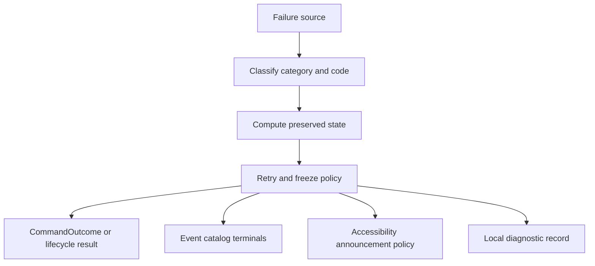

# Error Taxonomy

## Purpose

Unified taxonomy of typed failures across PhotoTux commands, lifecycle, persistence, rendering, codecs, accessibility, and extensions. Errors are data with stable codes, preserved-state summaries, and retry policy—not string matching. Normative keywords follow [Requirement Keywords](Requirement-Keywords.md). Philosophy follows [00 — Introduction](../00-Introduction.md): the document is more valuable than the current operation.

## Error Envelope

Conceptual shared shape (command form in [08](../08-Command-System.md)):

```rust
struct ErrorRecord {
    category: ErrorCategory,
    code: StableErrorCode,
    message: Text,              // actionable, localizable key + args
    preserved_state: PreservedStateSummary,
    retry: RetryPolicy,
    scope: ErrorScope,         // session | document | view | operation | extension
    correlation: CorrelationId,
    field_errors: List<FieldError>,
    cause_class: Optional<CauseClass>, // filesystem | gpu | codec | allocator | host
}
```

Every user-visible failure SHOULD answer:

1. what failed;
2. what remains safe;
3. whether retry is safe;
4. what data may be affected;
5. where local diagnostics can be found (if any).

## Primary Categories

| Category | Meaning | Default preserve | Default retry |
| --- | --- | --- | --- |
| `malformed` | Schema/parameters/header invalid | prior state | fix input |
| `unavailable-target` | ID/kind/ownership mismatch | prior state | retarget |
| `version-conflict` | Expected version policy failed | prior state | refresh + retry |
| `permission` | Capability/grant missing | prior state | grant or cancel |
| `lifecycle` | Session/doc closing/suspended | prior state | wait/reopen |
| `semantic` | Locks, editability, graph preconditions | prior state | change selection/params |
| `resource-pressure` | Memory/disk/GPU/job budget | truth kept; caches shed | reduce scope / free resources |
| `unsupported` | Feature/device/schema unsupported | prior state | alternate path |
| `external` | Filesystem, portal, device, host service | truth kept | retry after host recovery |
| `extension` | Plugin crash/timeout/budget/protocol | core truth kept | disable extension / fallback |
| `invariant` | Impossible graph/history mismatch | freeze mutations; keep recovery | no speculative repair |
| `cancelled` | Cooperative cancel | no partial commit | safe reissue |
| `no-change` | Valid no-op | prior state | none needed |

Partial success is forbidden unless the descriptor explicitly models independent targets and reports each outcome. Destructive multi-target operations default atomic.

## Failure Philosophy Classes

Mapped from the charter:

| Philosophy class | Categories | Operator stance |
| --- | --- | --- |
| User-correctable | malformed, unavailable-target, semantic, permission | explain remedy; unchanged state |
| Resource pressure | resource-pressure | cancel low-priority derived work; offer reduced op |
| External failure | external, unsupported (host) | isolate adapter; preserve document |
| Invariant failure | invariant | stop affected mutations; diagnostics; no speculative repair |
| Process-fatal | severe allocator/runtime | bounded recovery write only if safe |

## Stable Error Code Conventions

Codes MUST be stable strings:

```text
<domain>.<condition>
```

Examples:

- `command.schema.invalid-parameter`
- `document.target.missing`
- `document.version.mismatch`
- `history.inverse.unavailable`
- `format.header.truncated`
- `format.feature.required-unsupported`
- `format.integrity.chunk-mismatch`
- `codec.allocation.limit`
- `render.device.lost`
- `render.surface.lost`
- `gpu.memory.exhausted`
- `extension.capability.denied`
- `extension.worker.crashed`
- `a11y.host.unavailable`
- `lifecycle.shutdown.in-progress`

Display labels localize; codes do not. Codes MUST NOT include file paths or pixel content.

## Domain Matrices

### Command system

| Condition | Category | Commit? | Notes |
| --- | --- | --- | --- |
| Unknown command ID | unsupported | no | |
| Schema fail | malformed | no | field_errors |
| Capability missing | permission | no | |
| Document closing | lifecycle | no | |
| Target gone | unavailable-target | no | |
| Version mismatch | version-conflict | no | |
| Lock/edit blocked | semantic | no | |
| Budget exceeded at validate | resource-pressure | no | |
| Prepare cancel | cancelled | no | |
| Commit validation fail | version-conflict/semantic | no | abandon isolated build |
| History register fail before commit | invariant/external | no | abort |
| Queue saturation | resource-pressure | no | never silent-drop user mutations |

### Document model

| Condition | Category | User impact |
| --- | --- | --- |
| Duplicate hostile IDs on open | malformed/invariant | reject before visibility |
| Graph cycle | semantic/invariant | reject mutation |
| Snapshot stream gap | external (consumer) | renderer resync |
| Device loss during edit | external | document intact |
| Cancelled raster preparation | cancelled | no commit |

### Persistence and formats

| Condition | Category | File state |
| --- | --- | --- |
| Truncated generation | malformed/external | keep previous valid |
| Checksum fail | malformed | reject chunk/generation |
| Unknown required feature | unsupported | reject or degraded RO |
| Migration fail | malformed/semantic | original untouched |
| Disk full mid-stage | resource-pressure/external | previous valid remains |
| Atomic replace fail | external | staged retained for diagnostics policy |
| Symlink surprise | permission/external | host policy deny |

Save clears modified only when persisted identity equals current authoritative version.

### Import / export / clipboard

| Condition | Category | Notes |
| --- | --- | --- |
| Sniff ambiguous | malformed/unsupported | user format choice or reject |
| Hostile dimensions | malformed/resource-pressure | checked limits |
| Codec panic/timeout | external/extension | isolate |
| Lossy export without disclosure | (implementation defect) | MUST disclose first |
| Clipboard MIME invalid | malformed | same validation as files |

### Rendering / GPU

| Condition | Category | Document |
| --- | --- | --- |
| Device lost | external | preserved |
| Surface lost | external | preserved |
| Pipeline compile fail | unsupported/external | CPU fallback or degrade |
| Tile budget exceeded | resource-pressure | shed caches; truth kept |
| Mixed-version frame risk | invariant (renderer) | present older complete frame |

Renderer NEVER writes authoritative document state.

### History

| Condition | Category | Notes |
| --- | --- | --- |
| Inverse unavailable | unsupported/semantic | explain; no partial undo |
| Corrupt spill | invariant/external | stop traversal; keep current |
| Hard budget | resource-pressure | drop old entries per policy with disclosure |
| Undo after capability loss | semantic | traversal under changed capability rules |

### Extensions

| Condition | Category | Core impact |
| --- | --- | --- |
| Manifest invalid | malformed | contribution refused |
| Version negotiation fail | unsupported | unavailable |
| Capability denied | permission | no ambient escape |
| Budget exceeded | resource-pressure | cancel extension work |
| Worker crash | extension | isolate; preserve opaque document data |
| Protocol violation | extension/malformed | disable contribution |

### Accessibility / host

| Condition | Category | Editing |
| --- | --- | --- |
| AT-SPI unavailable | external/unsupported | editing continues |
| Stale AT action generation | version-conflict | reject action |
| Portal denied | permission | typed denial |
| Focus target deleted | lifecycle/semantic | fallback focus path |

## Retry Policy Enumeration

```rust
enum RetryPolicy {
    NotApplicable,
    RetrySame,                 // transient external
    RetryAfterRefresh,         // version conflict
    RetryWithReducedQuality,   // resource pressure
    RetryWithAlternatePath,    // CPU fallback, other codec
    UserActionRequired,        // fix params, grant permission
    FatalForScope,             // freeze mutations / reopen
}
```

Retry MUST be idempotent-safe at command layer when `idempotency_key` present.

## Preserved State Summary

```rust
enum PreservedStateSummary {
    Unchanged,
    UnchangedWithCachesShed,
    CommittedPriorVersionsOnly,
    DocumentFrozenMutations,
    SessionDegraded { features: FeatureSet },
    RecoveryAvailable { candidates: u32 },
}
```

Invariant failures MUST prefer `DocumentFrozenMutations` or session degraded over silent repair.

## Severity and UX Mapping

| Severity | Categories (typical) | UX |
| --- | --- | --- |
| Info | no-change | quiet status |
| Warning | unsupported optional, degraded render | non-blocking banner/status |
| Error | user-correctable, external | dialog or task failure |
| Critical | invariant, process-fatal risk | block mutations; recovery guidance |

Accessibility: assertive for immediate failure/decision; polite for ordinary completion ([29](../29-Accessibility.md)). Color alone MUST NOT convey severity ([25](../25-Themes.md)).

## Cancellation vs Error

Cancellation is a first-class outcome, not an unexpected error:

- before commit → no authoritative partial state;
- after commit → later undo/compensating command;
- GPU cancel bounded by one declared submission unit;
- CPU cooperative cancel SHOULD observe within 100 ms ([30](../30-Performance.md)).

## Logging and Privacy

Local diagnostics MAY record category, code, correlation, versions, budgets, and adapter class. They MUST redact by default:

- absolute paths;
- document pixel content;
- layer/text content;
- private metadata values;
- secrets/capabilities tokens.

User-initiated diagnostic bundles require explicit inclusion of redacted fields.

## Cross-Subsystem Propagation



Snapshot publication failure after successful commit is not rolled back as “uncommit”; consumers receive gap/resync while history remains authoritative ([08](../08-Command-System.md)).

## Testing Requirements

[31 — Testing](../31-Testing.md) MUST include:

- one fixture per category at command boundary;
- fault injection: alloc fail, disk full, device loss, extension crash, checksum fail;
- invariant failure freezes mutations without corrupting recovery;
- cancel at every phase boundary;
- error codes stable across refactors (contract tests).

## Anti-Patterns

- Catch-and-ignore at UI boundary
- String-matching messages for control flow
- Returning success with partial destructive writes
- Speculative graph repair on invariant failure
- Blocking UI thread on external retry loops
- Treating export success as document save
- Mapping all GPU issues to “unknown error”

## Cross References

- [00 — Introduction](../00-Introduction.md)
- [08 — Command System](../08-Command-System.md)
- [10 — Document Model](../10-Document-Model.md)
- [17 — Rendering Engine](../17-Rendering-Engine.md)
- [22 — Import and Export](../22-Import-Export.md)
- [23 — Plugin SDK](../23-Plugin-SDK.md)
- [27 — File Formats](../27-File-Formats.md)
- [29 — Accessibility](../29-Accessibility.md)
- [Event Catalog](Event-Catalog.md)
- [Command Taxonomy](Command-Taxonomy.md)
