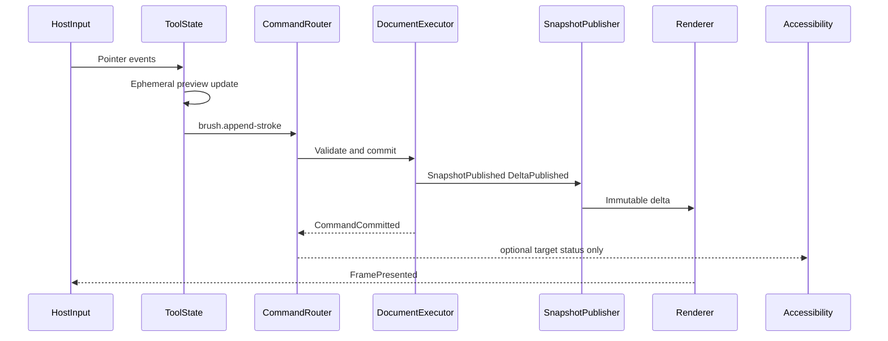
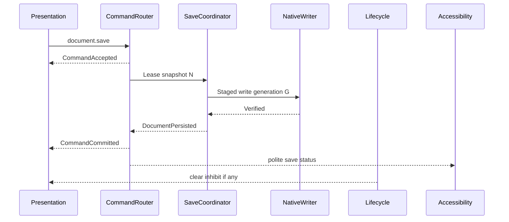

# Event Catalog

## Purpose

Catalog of semantic event families PhotoTux publishes and consumes across lifecycle, commands, documents, rendering, accessibility, host adapters, and extensions. Events are typed notifications with generations and correlation IDs. They are not an alternate mutation channel. Normative keywords follow [Requirement Keywords](Requirement-Keywords.md).

## Event Design Rules

1. Authoritative mutation enters only through commands ([08](../08-Command-System.md)). Events report outcomes and host signals.
2. Every event MUST carry `session_generation` or equivalent scope generation so stale deliveries can be rejected ([02](../02-Application-Lifecycle.md)).
3. High-frequency producers MUST coalesce or rate-limit; brush samples and frame ticks MUST NOT flood accessibility or UI buses ([29](../29-Accessibility.md), [30](../30-Performance.md)).
4. Events MUST be bounded values. No toolkit widgets, raw file paths by default, or unbounded payloads.
5. Consumers MUST tolerate duplicate, reordered, or dropped non-critical events according to class policy; critical integrity events have stronger delivery rules below.
6. Extension-visible events are capability-filtered and exclude private content by default ([23](../23-Plugin-SDK.md)).

## Catalog Overview

| Family | Primary producer | Primary consumers | Delivery |
| --- | --- | --- | --- |
| Lifecycle | Host + lifecycle service | Workspace, recovery, GPU | Ordered per session |
| Document registry | Document core | Shell, save, a11y | Ordered per document |
| Command / job | Command router | UI, history, diagnostics | Per invocation |
| Snapshot / delta | Snapshot publisher | Renderer, export, panels | Versioned stream |
| Render / device | Render coordinator | Views, status, lifecycle | Best-effort + critical loss |
| Accessibility | Semantic projector | AT-SPI adapter | Coalesced revisions |
| Host desktop | Linux adapters | Lifecycle, clipboard, color | Validated ingress |
| Preference / workspace | Preference store | Shell | Schema-versioned |
| Extension | Plugin host | Registry, UX trust | Capability-scoped |
| Diagnostics | Local tracers | Developer tools | User-initiated export |

## Lifecycle Events

Defined conceptually in [02 — Application Lifecycle](../02-Application-Lifecycle.md):

| Event | When | Required fields | Consumer duties |
| --- | --- | --- | --- |
| `OpenRequested` | Host/CLI/file manager | `requests`, `source` | Queue, dedupe by file identity |
| `ReopenRequested` | Host reopen signal | reason | Focus/create window; never auto-close modified docs |
| `WindowCloseRequested` | User/host close | `window` | Run close resolution |
| `SessionEndRequested` | Logout/shutdown | `deadline`, `reason` | Save/inhibit policy |
| `DisplayTopologyChanged` | Monitor layout | `topology`, `generation` | Reconcile workspaces |
| `HostSuspending` | Session sleep | optional deadline | Flush critical recovery |
| `HostResumed` | Resume | — | Revalidate devices/files |
| `MemoryPressure` | OS/advisor | `level` | Shed caches; preserve truth |
| `SurfaceLost` | Wayland/surface | `window`, `surface_generation` | Recreate surface |
| `DeviceLost` | GPU loss | `renderer_generation`, `reason` | Preserve docs; rebuild renderer |

Ingress validation:

- Reject events with wrong session generation.
- Bound list sizes on open requests.
- Treat host paths as capabilities, not strings to re-open freely.

## Document Registry Events

| Event | Meaning |
| --- | --- |
| `DocumentReserved` | Slot reserved before decode |
| `DocumentLoading` | Decode/import in progress |
| `DocumentReady` | Coherent registration committed |
| `DocumentAbandoned` | Load failed/cancelled |
| `DocumentModifiedChanged` | Dirty flag relative to persisted identity |
| `DocumentPersisted` | Save settled for snapshot N |
| `DocumentClosePending` | User intent to close |
| `DocumentClosed` | Leases drained; registry entry gone |
| `ActiveDocumentChanged` | Focused work context changed |
| `DocumentRecoveryOffer` | Recovery candidate discovered |

Document sub-lifecycle states (Reserved → Loading → Validating → Ready → …) emit transitions only on commit of the registry state machine. Panels subscribe to Ready and later; they MUST NOT assume Loading exposes editable graph.

## Command and Job Events

| Event | Phase | Notes |
| --- | --- | --- |
| `CommandSubmitted` | ingress | Enablement already advisory |
| `CommandRejected` | validation | Typed error; no version publish |
| `CommandAccepted` | async start | Carries `operation_id` |
| `CommandProgress` | running | Rate-limited; phase + fraction/indeterminate |
| `CommandCommitted` | success | `transaction_id`, `versions`, effects |
| `CommandNoChange` | success | Explicit no-op reason |
| `CommandCancelled` | cancel | Phase recorded |
| `JobQueued` / `JobStarted` / `JobFinished` / `JobFailed` | job manager | Import/export/filter |

UI feedback timing: activation SHOULD acknowledge within 100 ms; operations exceeding 250 ms SHOULD emit progress ([00](../00-Introduction.md), [30](../30-Performance.md)).

## Snapshot and Delta Events

Produced by the snapshot publisher after atomic commit with history ([10](../10-Document-Model.md), [20](../20-History-Undo.md)):

| Event | Payload essence |
| --- | --- |
| `SnapshotPublished` | document ID, version, snapshot handle |
| `DeltaPublished` | version from→to, object/spatial dirty set |
| `SnapshotGap` | consumer missed versions; must resync |
| `CheckpointMaterialized` | optional traversal aid |

Renderer rules:

- Consume immutable snapshots only.
- On gap, request full snapshot; never invent intermediate versions.
- Presentation MAY show older complete frames; MUST NOT mix incompatible partial versions without progressive contract ([17](../17-Rendering-Engine.md)).

## Render and Device Events

| Event | Criticality | Meaning |
| --- | --- | --- |
| `RenderInvalidated` | normal | Dirty regions scheduled |
| `FramePresented` | normal | Version + view presented |
| `RenderDegraded` | status | Quality/budget shedding disclosed |
| `RenderBudgetExceeded` | status | Typed pressure mode |
| `PipelineCompiling` | status | MUST NOT block input/recovery |
| `SurfaceReconfigured` | normal | Size/scale/color change |
| `DeviceLost` | critical | Same family as lifecycle; document truth intact |
| `DeviceRestored` | critical | New renderer generation |

Export preview MAY share graph planning but uses export consistency rules distinct from interactive presentation ([17](../17-Rendering-Engine.md)).

## Accessibility Events

From [29 — Accessibility](../29-Accessibility.md):

| Class | Examples | Priority |
| --- | --- | --- |
| Focus | focus changed | ordered |
| Structure | node created/removed/reordered | coalesced |
| State | expanded, selected, checked, busy, invalid | coalesced |
| Value | text/value changed | rate-limited |
| Dialog/menu | opened/closed | ordered |
| Task | progress/completion/failure | polite/assertive |
| Status | save, recovery, device, invariant | assertive if decision required |
| Context | active document/view/tool/edit target | polite |

Policy:

- Derive from committed semantic projections, not every widget repaint.
- Never announce every brush sample, frame, or tile.
- Commit announcement means command committed, not pixels finished.
- Assertive reserved for immediate failure/decision.

## Host Desktop Events (Ingress)

| Event | Adapter | Validation |
| --- | --- | --- |
| Pointer/pen/keyboard normalized intents | input | timestamps, device ID, focus window |
| Shortcut match | shortcut system | IME/text yield ([09](../09-Shortcut-System.md)) |
| Clipboard offer changed | clipboard | MIME sniff + size limits ([21](../21-Clipboard.md)) |
| Drag enter/drop | clipboard/DnD | same as files |
| Theme / contrast / reduced-motion | themes | preference overlay ([25](../25-Themes.md)) |
| Color profile display change | color | regenerate transforms ([16](../16-Color-Management.md)) |
| Portal file response | dialogs/lifecycle | capability objects |
| AT action request | a11y host | revalidate node generation → action → command |

Host events become intents or lifecycle events; they never write layers directly.

## Preference and Workspace Events

| Event | Domain |
| --- | --- |
| `PreferenceChanged` | key, schema version, scope |
| `WorkspacePresetApplied` | preset ID |
| `WorkspaceLayoutCommitted` | topology generation |
| `ToolChanged` | tool ID |
| `ShortcutMapChanged` | conflict resolution generation |

These events MUST NOT clear document modified flags.

## Extension Events

| Event | Meaning |
| --- | --- |
| `ExtensionDiscovered` | package scanned |
| `ExtensionResolved` | version negotiation success |
| `ExtensionFailed` | load/crash/timeout |
| `ContributionRegistered` | command/filter/panel/format/tool |
| `ContributionUnavailable` | missing after document open |
| `PermissionPromptRequired` | capability UX |
| `ExtensionBudgetExceeded` | shed/cancel extension work |

Documents with opaque extension payloads emit `ContributionUnavailable` without deleting preserved bytes ([23](../23-Plugin-SDK.md), [27](../27-File-Formats.md)).

## Diagnostics Events

Local only. No telemetry network.

| Event | Use |
| --- | --- |
| `TraceSpan` | performance correlation ([30](../30-Performance.md)) |
| `MetricSample` | budgets |
| `FaultInjected` | tests ([31](../31-Testing.md)) |
| `DiagnosticBundleReady` | user-initiated export |

Redact document content, private metadata, and absolute paths by default.

## Event Envelope (Conceptual)

```rust
struct EventEnvelope<T> {
    family: EventFamily,
    name: EventName,
    sequence: u64,
    scope: EventScope, // session | window | document | view | operation
    scope_generation: Generation,
    correlation: CorrelationId,
    timestamp: MonotonicTimestamp,
    payload: T,
}
```

Consumers store last applied sequence per scope. Gaps on snapshot family trigger resync. Gaps on progress events are acceptable.

## Ordering and Coalescing Matrix

| Family | Order required | Coalesce key | Drop under pressure |
| --- | --- | --- | --- |
| Lifecycle critical | yes | event name + target | no |
| Document registry | yes per doc | doc ID + kind | no for Ready/Closed |
| Command terminal | yes per invocation | invocation ID | no |
| Command progress | no | operation ID | yes |
| Snapshot/delta | yes per doc stream | doc ID | no (gap→resync) |
| Frame presented | no | view ID | yes |
| Accessibility | focus/removal ordered | node+property+revision | progress/value yes |
| Diagnostics | no | span ID | yes |

## Sequence Diagram: Edit Stroke



Continuous pointer motion does not emit accessibility rename floods. Stroke end may announce once if selection/target changed.

## Sequence Diagram: Save



## Failure Event Mapping

| Condition | Events | Follow-up |
| --- | --- | --- |
| Validation reject | `CommandRejected` | no snapshot |
| Cancel before commit | `CommandCancelled` | no snapshot |
| Device loss | `DeviceLost` | keep docs; rebuild |
| Snapshot delivery fail | `SnapshotGap` to consumers | resync |
| Extension crash | `ExtensionFailed` | isolate; preserve opaque data |
| Invariant failure | critical status + freeze mutations | diagnostics + recovery preserve |

See [Error Taxonomy](Error-Taxonomy.md).

## Testing Hooks

Headless tests MUST be able to:

- inject lifecycle ingress events with controlled generations;
- assert command terminal events without GPU;
- assert snapshot monotonicity;
- assert accessibility event policy (no per-sample floods);
- fault-inject device loss and verify document events remain coherent.

## Cross References

- [02 — Application Lifecycle](../02-Application-Lifecycle.md)
- [08 — Command System](../08-Command-System.md)
- [10 — Document Model](../10-Document-Model.md)
- [17 — Rendering Engine](../17-Rendering-Engine.md)
- [29 — Accessibility](../29-Accessibility.md)
- [30 — Performance](../30-Performance.md)
- [Command Taxonomy](Command-Taxonomy.md)
- [Error Taxonomy](Error-Taxonomy.md)
- [Thread Ownership Map](Thread-Ownership-Map.md)
