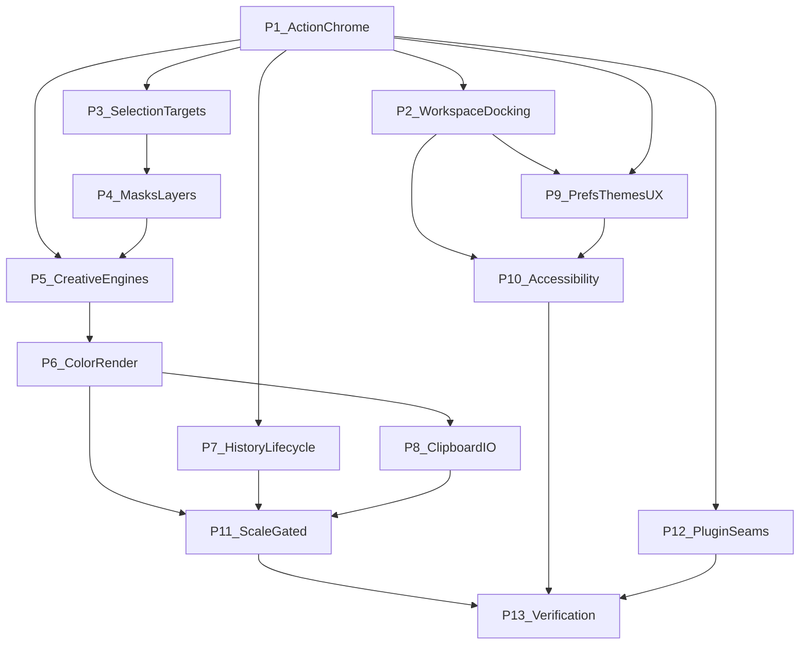

# Handbook Parity Roadmap

| Field | Value |
| --- | --- |
| Status | **Active** (spine pass complete 2026-07-17; depth + verification ongoing) |
| Prerequisite | [Alignment Roadmap](Alignment-Roadmap.md) **Complete** (handbook-ready contracts) |
| Living tracker | [Handbook-Parity-Checklist.md](Handbook-Parity-Checklist.md) |
| Gap inventory | [Codebase-Handbook-Gap-Analysis.md](Codebase-Handbook-Gap-Analysis.md) |
| Decisions | [Decision-Register.md](Decision-Register.md) — esp. [DR-023](Decision-Register.md#dr-023--tech-stack-frozen-to-shipping-codebase), [DR-028](Decision-Register.md#dr-028--engine-depth-deferred-beyond-p5p10-slices), [DR-029](Decision-Register.md#dr-029--p11p12-remain-gated-no-ungated-impl) |
| Stack | Frozen (DR-023) — no toolkit/GPU/shell rewrite |
| Journals | `archive/docs/04-journal/*handbook-parity*` |

This roadmap is the plan to bring the **shipping editor** to **full parity** with the Engineering Handbook (`internal_docs/` chapters 00–32 + appendices). Alignment already made the handbook a trustworthy build guide; this plan is the remaining **product and systems work**.

---

## 0. Progress (2026-07-17)

| Band | Phases | State |
| --- | --- | --- |
| **Chrome / IA spines** | P1–P3 | **Met** — action chrome, docking, selection concepts |
| **Document semantics** | P4 | **Met** — multi-select, fill, effects reorder, clip break, mask apply, style depth |
| **Engines / color / session** | P5–P10 | **P5–P6/P8 Met**; P7/P9/P10 Partial — open depth tracked under DR-028 |
| **Gated scale / plugins** | P11–P12 | **Gates recorded** (DR-029); opaque `extension_data` seam only for P12 |
| **Verification** | P13 | **Partial** — command conformance green; budgets still Provisional (DR-017) |

**Spine parity** means shipped product surfaces resolve through handbook contracts (commands, workspace model, selection concepts, soft-proof, history jump, recovery chooser, OS clipboard, a11y JSON, etc.). It does **not** mean every handbook chapter feature is complete — remaining MUST depth is either `[ ]`/`[~]` on the checklist or Deferred via DR-028/029.

Full `handbook-parity-complete` waits on: DR-028 depth closures (or further Deferred DRs), DR-017 budget promotion where claimed, and gap-analysis silence.

---

## 1. What “full parity” means

Parity is reached when:

1. Every handbook **MUST** for in-scope product surfaces is implemented **or** explicitly downgraded via Decision Register (Accepted vN / Deferred / out-of-product).
2. Every handbook **SHOULD** that the product claims in UX/IA is implemented or tracked as Deferred with owner + gate.
3. Gap analysis has no unmarked **A/F** rows that still claim “handbook requires / code lacks” without a phase checkbox.
4. Quality chapters (30/31) have evidence packs that promote Provisional budgets where the product claims them.
5. Agents can implement from handbook chapters without inventing a parallel architecture.

Parity does **not** mean: 18-crate rename ([DR-025](Decision-Register.md#dr-025--crate-topology-coarse-workspace)), marketplace plugins, cloud/AI, or non-Linux hosts.

### Forever out of product scope

| Topic | Why |
| --- | --- |
| Cloud sync, accounts, collaboration | Charter / DR-001 |
| AI / generative tools | Charter |
| Stable third-party binary plugin ABI / store | [DR-009](Decision-Register.md#dr-009--plugin-abi-deferred-capability-seams-now) until separate product decision |
| Electron / web / CLI / TUI product surfaces | DR-023 / product surface |
| Toolkit or GPU API swap | DR-023 |

---

## 2. Baseline (already shipped)

Do not re-plan these; extend them.

| Area | Shipped |
| --- | --- |
| Stack | Qt 6 + qtbridge, wgpu Vulkan, zero-copy present, coarse crates, `.ptx` |
| Commands | `SessionState::invoke` + `CommandMeta` + taxonomy IDs |
| Snapshots v1 | Generation + metadata leases ([DR-005](Decision-Register.md#dr-005--immutable-render-snapshots)) |
| Shell | Panel/tool/action descriptors; prefs schema 4; workspace presets; tear-off / auto-hide docks |
| Engines | Layers (incl. Shape/Fill), masks/locks/apply, multi-select structure ops, effect reorder, OuterGlow/ColorOverlay, selection↔mask, text bake, paths, filter plan + sharpen, shape boolean bake, brush presets/dynamics, stroke journal |
| Color | Assign/convert sRGB ↔ Display-P3; soft-proof tags |
| History / recovery | Unified timeline + `history.jump`; autosave + restore chooser |
| Clipboard | In-app RGBA + OS image (`arboard`); 64 MiB bound |
| I/O | `.ptx` v2 write / v1 read; raster + PSD subset; limits; `extension_data` |
| A11y | Semantic `accessibilityTreeJson` spine |
| CPU / GPU ref | Composite subset; dab stamp CPU; sharpen CPU + GPU pack |
| Verification | Headless `command_conformance` suite |

---

## 3. Phase order (dependency-aware)

| Phase | Name | Handbook chapters | Gate | Status |
| --- | --- | --- | --- | --- |
| **P1** | Action & command chrome | 06, 07, 08, 09, 26 | None | **Met** |
| **P2** | Workspace & docking | 03, 04, 05 | None | **Met** |
| **P3** | Selection & edit targets | 01, 12, DR-011 | None | **Met** |
| **P4** | Masks & layer semantics | 11, 13 | None | **Met** |
| **P5** | Creative engines depth | 14, 15, 18, 19 | None | **Met** |
| **P6** | Color & rendering contracts | 16, 17, DR-005/006 | Tiling → P11 | **Met** |
| **P7** | History & lifecycle | 02, 20 | Spill → P11 | **Partial** |
| **P8** | Clipboard & interchange I/O | 21, 22, 27 | Sparse → P11 | **Met** |
| **P9** | Preferences, themes, UX polish | 01, 24, 25, 28 | None | **Partial** |
| **P10** | Accessibility projection | 29, DR-016 | None | **Partial** |
| **P11** | Scale & multi-document | 02, 03, 17, 20, 27 | **Gated** §4 | **Gated** (DR-029) |
| **P12** | Extension capability seams | 23, DR-009 | Product need | **Partial** (seam only) |
| **P13** | Verification & budget promotion | 30, 31, 32, DR-017/022 | Continuous | **Partial** |

Phases may overlap when independent. Do not start P11/P12 without gates.

---

## 4. Hard gates (Decision Register)

| Gate | Required before | Evidence / amend | State |
| --- | --- | --- | --- |
| Large-doc / tiling | P11 tiling & pyramid | Benchmark: interactive path fails budgets without residency ([DR-006](Decision-Register.md#dr-006--gpu-first-via-wgpu-not-gpu-only)) | **Open** — recorded DR-029 |
| Multi-document | P11 multi-doc tabs/registry | Explicit amend of [DR-024](Decision-Register.md#dr-024--single-document-session-v1) | **Open** — recorded DR-029 |
| History spill | P11 spill-to-disk | Memory-pressure scenarios ([DR-004](Decision-Register.md)) | **Open** — recorded DR-029 |
| `.ptx` sparse / incremental | P11 format evolution | Large sparse + recovery spikes ([DR-026](Decision-Register.md#dr-026--native-ptx-container-v1)) | **Open** — recorded DR-029 |
| Plugin seams / ABI | P12 beyond opaque data | Real product need; ABI still deferred ([DR-009](Decision-Register.md#dr-009--plugin-abi-deferred-capability-seams-now)) | Seam `[x]`; ABI Deferred |
| Budget promotion | P13 exit claims | Fixtures + ledger rows ([DR-017](Decision-Register.md#dr-017--performance-budgets-provisional)) | **Open** — conformance started |

---

## 5. Phase summaries

### P1 — Action & command chrome — **Met**

**Goal:** Menus, toolbars, shortcuts, and context menus resolve through stable action/command IDs; command search exists.

**Exit:** Every primary menu operation maps to a registered command or documented host-only exemption; customize shortcuts for shipped actions; tool strip driven by descriptors.

**Shipped:** Action registry, MenuBar Instantiator, context menus, keymap prefs, command palette, `CommandMeta`.

**Still todo (polish):** Overflow toolbar; fuzzy palette; path context menu; menu completeness vs IA.

### P2 — Workspace & docking — **Met**

**Goal:** Semantic workspace topology + docking model; Qt presents it.

**Exit:** Tear-off / persist layout without polluting document history; workspace presets; panels consume descriptors.

**Shipped:** `WorkspaceState` / `DockTopology`, tear-off, auto-hide, built-in presets, `panels_json`.

**Still todo (polish):** Split graph; user-named presets; list virtualization; follow-context panels.

### P3 — Selection & edit targets — **Met**

**Goal:** Object / pixel / focus / context / edit target distinct ([DR-011](Decision-Register.md#dr-011--selection-concepts-are-distinct)).

**Exit:** Tools and Properties never overload “whatever was last clicked.”

**Shipped:** Distinct chrome fields; selection↔mask commands; status/announce.

**Still todo (polish):** Multi-object ops; fuller announce flood-control; ants SLO evidence → P13.

### P4 — Masks & layer semantics — **Met**

**Goal:** Mask apply/disable/refine + vector masks; layer locks and nondestructive stack breadth.

**Shipped:** Locks; mask attrs UI + density in composite; `mask.apply`; vector mask metadata; multi-select delete/reorder/group/ungroup; `LayerKind::Fill`; effect reorder/enable UI; clip break-on-delete; OuterGlow + ColorOverlay.

**Still todo (deferred):** Vector mask path edit; refine contrast/edge shift (DR-028).

### P5 — Creative engines depth — **Met**

**Goal:** Brush, filter, text, and shape engines approach handbook feature sets.

**Shipped:** Brush presets + dynamics fields; CPU dab reference; stroke journal; `FilterPlan`; sharpen CPU+GPU; shape boolean coverage bake; rect/ellipse/line + fill/stroke; filter gallery preview/commit + cancel/stale; `tool.path-edit` + path anchor commands; text frame/wrap + bake policy UX.

**Still todo (deferred):** Texture tips; GPU noise / full filter catalog; on-canvas text + font discovery; vector-preserving boolean; live vector present; shape gradients. Track under DR-028 / checklist `[P]`.

### P6 — Color & rendering contracts — **Met**

**Goal:** Soft-proof / ICC foundation; snapshot publisher; device-loss UX.

**Shipped:** Soft-proof command + UI; assign/convert sRGB↔Display-P3; generation leases; `document.set-icc` + `.ptx`/PNG embed; GPU↔CPU blend/filter parity fixtures; device/surface-loss UX + Recover + `renderer_generation`.

**Still todo (deferred):** Display profile discovery (colord); dense pixel snapshot/delta publisher; dirty-region polish → DR-028. Tiling → P11.

### P7 — History & lifecycle — **Partial**

**Goal:** Unified timeline; formal lifecycle/recovery.

**Shipped:** Unified history kinds; panel jump; autosave + restore/discard chooser; stroke journal files.

**Still todo:** Retention budget UI; safe-start; formal lifecycle controller; device-loss orchestration. Spill / multi-doc → P11.

### P8 — Clipboard & interchange I/O — **Met**

**Goal:** Capability-scoped clipboard; hostile-input limits; adapter disclosure.

**Shipped:** In-app + OS image clipboard (`arboard`); selection/layer-mask R8 payloads + paste; 64 MiB bound; adapter dimension/alloc limits; `.ptx` unknown-chunk skip; integrity diagnostics UX; `extension_data`.

**Still todo (deferred):** SVG/layer MIME; fuller progress UX. Sparse `.ptx` → P11.

### P9 — Preferences, themes, UX — **Partial**

**Goal:** Prefs schema coverage; Themes as token source; UX patterns.

**Shipped:** Prefs schema 4; high-contrast + density packs; Theme bindings.

**Still todo:** Mixed-value inspector; safe-start prefs; progressive disclosure; full reduced-motion / 200% audit.

### P10 — Accessibility — **Partial**

**Goal:** Semantic projection to AT-SPI ([DR-016](Decision-Register.md#dr-016--accessibility-is-semantic-not-pixel-inference)).

**Shipped:** `accessibilityTreeJson` from descriptors/canvas/panels.

**Still todo:** AT-SPI host adapter; fuller keyboard parity; a11y evidence pack → P13.

### P11 — Scale & multi-document — **Gated**

**Goal:** Tiles/pyramid; multi-doc; history spill; sparse `.ptx` — **only after gates**.

**State:** Gates recorded in DR-029 / checklist. **No implementation** until evidence + amends.

### P12 — Extension capability seams — **Partial**

**Goal:** Manifests, capabilities, budgets — **no ABI freeze**.

**Shipped:** Opaque `extension_data` round-trip.

**Still todo:** Contribution manifests; budgets/isolation; host mediation — only with product need. ABI stays Deferred.

### P13 — Verification & budget promotion — **Partial**

**Goal:** Conformance suite; hostile I/O fuzz; promote Provisional performance rows.

**Shipped:** Headless command-router conformance module.

**Still todo:** Fixture harness; promote DR-017 ledger rows; device-loss suite; CI budget gates; large-doc suite (feeds P11).

---

## 6. Working rules

1. **Handbook-first:** Read the chapter + Decision Register before coding.
2. **Commands:** New document-authoritative mutations get a `command_id` + taxonomy row.
3. **No stack reopen:** Qt / wgpu / Wayland / zero-copy / coarse crates stay.
4. **Gates are real:** Do not “just start” multi-doc or tiling (DR-029).
5. **Update checklist** when starting/finishing a slice; close gap-analysis rows in the same change set.
6. **Quality:** `./scripts/check-rust.sh` green; no paragraph-long workaround comments.
7. **Journal:** Phase exits → `archive/docs/04-journal/`.
8. **Depth deferral:** Prefer vertical spines; mark unfinished MUST depth `[~]`/`[P]` or amend DR-028 — never silent gaps.

---

## 7. Recommended next slices (ungated)

Start sequence for the alignment era is **done**. Prefer this order next (see checklist “Recommended next slices”):

1. **P9** — Mixed-value inspector; safe-start prefs  
2. **P10** — AT-SPI host adapter (tree JSON already exists)  
3. **P13** — Budget fixture harness + promote Provisional ledger rows  
4. **DR-028 depth** — display ICC / pixel publisher; texture tips; on-canvas text/fonts; live vector (as needed)  

Independent polish (any time): toolbar overflow, fuzzy palette, History/Layers virtualization, path context menu.

---

## 8. Cross references

- [Handbook-Parity-Checklist.md](Handbook-Parity-Checklist.md)
- [Alignment-Roadmap.md](Alignment-Roadmap.md) (complete)
- [Implementation-Checklist.md](Implementation-Checklist.md) (alignment history)
- [Command-Taxonomy.md](Command-Taxonomy.md)
- [Decision-Register.md](Decision-Register.md)
- [Archived-ADR-to-DR-Map.md](Archived-ADR-to-DR-Map.md)
- [32 — Developer Guide](../32-Developer-Guide.md)
