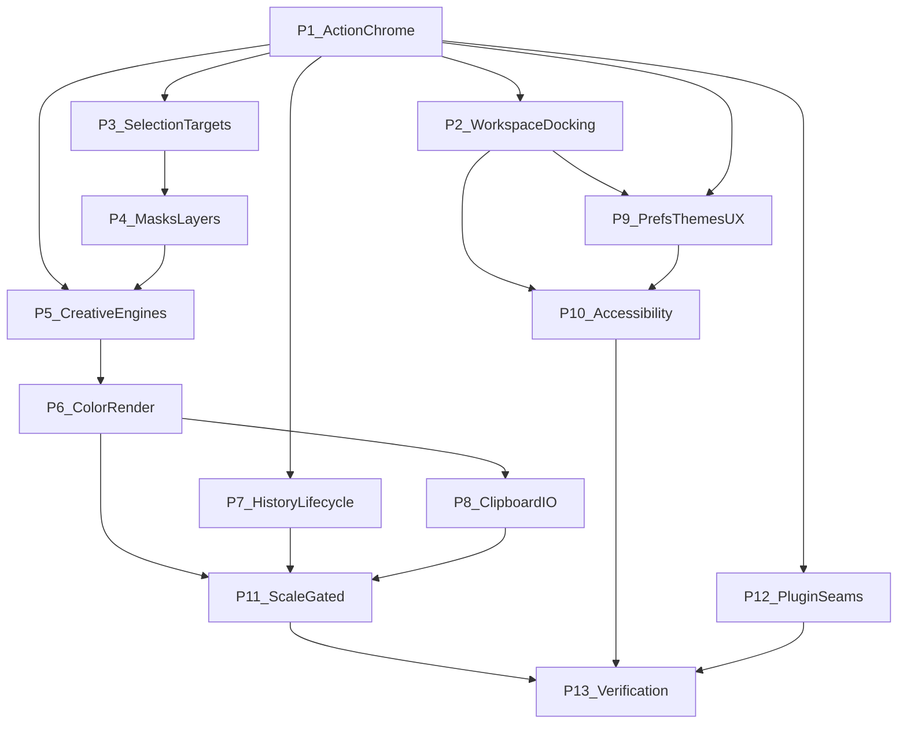

# Handbook Parity Roadmap

| Field | Value |
| --- | --- |
| Status | **Accepted** (post-alignment product plan, 2026-07-16) |
| Prerequisite | [Alignment Roadmap](Alignment-Roadmap.md) **Complete** (handbook-ready contracts) |
| Living tracker | [Handbook-Parity-Checklist.md](Handbook-Parity-Checklist.md) |
| Gap inventory | [Codebase-Handbook-Gap-Analysis.md](Codebase-Handbook-Gap-Analysis.md) |
| Decisions | [Decision-Register.md](Decision-Register.md) |
| Stack | Frozen ([DR-023](Decision-Register.md#dr-023--tech-stack-frozen-to-shipping-codebase)) — no toolkit/GPU/shell rewrite |

This roadmap is the plan to bring the **shipping editor** to **full parity** with the Engineering Handbook (`internal_docs/` chapters 00–32 + appendices). Alignment already made the handbook a trustworthy build guide; this plan is the remaining **product and systems work**.

---

## 1. What “full parity” means

Parity is reached when:

1. Every handbook **MUST** for in-scope product surfaces is implemented **or** explicitly downgraded via Decision Register (Accepted vN / Deferred / out-of-product).
2. Every handbook **SHOULD** that the product claims in UX/IA is implemented or tracked as Deferred with owner + gate.
3. Gap analysis has no unmarked **A/F** rows that still claim “handbook requires / code lacks” without a phase checkbox.
4. Quality chapters (30/31) have evidence packs that promote Provisional budgets where the product claims them.
5. Agents can implement from handbook chapters without inventing a parallel architecture.

Parity does **not** mean: 18-crate rename ([DR-025](Decision-Register.md#dr-025--crate-topology-coarse-workspace)), marketplace plugins, cloud/AI, or non-Linux hosts.

### Forever out of product scope

| Topic | Why |
| --- | --- |
| Cloud sync, accounts, collaboration | Charter / DR-001 |
| AI / generative tools | Charter |
| Stable third-party binary plugin ABI / store | [DR-009](Decision-Register.md#dr-009--plugin-abi-deferred-capability-seams-now) until separate product decision |
| Electron / web / CLI / TUI product surfaces | DR-023 / product surface |
| Toolkit or GPU API swap | DR-023 |

---

## 2. Baseline (already shipped)

Do not re-plan these; extend them.

| Area | Shipped |
| --- | --- |
| Stack | Qt 6 + qtbridge, wgpu Vulkan, zero-copy present, coarse crates, `.ptx` |
| Commands | `SessionState::invoke` document spine + taxonomy IDs |
| Snapshots v1 | Generation + metadata leases ([DR-005](Decision-Register.md#dr-005--immutable-render-snapshots)) |
| Shell v1 | Panel/tool descriptors, prefs, Essentials reset; QML chrome |
| Engines v1 | Layers (incl. Shape), masks/clip, selection modify, text bake, paths, filters/styles subset, guides |
| Color v1 | Assign/convert sRGB ↔ Display-P3 |
| I/O v1 | `.ptx` v2 write / v1 read; raster + PSD subset |
| CPU ref | Composite subset for tests |

---

## 3. Phase order (dependency-aware)

| Phase | Name | Handbook chapters | Gate |
| --- | --- | --- | --- |
| **P1** | Action & command chrome | 06, 07, 08, 09, 26 (search) | None |
| **P2** | Workspace & docking | 03, 04, 05 | None for topology model; tear-off UX after model |
| **P3** | Selection & edit targets | 01, 12, DR-011 | None |
| **P4** | Masks & layer semantics | 11, 13 | None |
| **P5** | Creative engines depth | 14, 15, 18, 19 | None |
| **P6** | Color & rendering contracts | 16, 17, DR-005/006 | Full pixel snapshots incremental; tiling → P11 |
| **P7** | History & lifecycle | 02, 20 | Spill → memory evidence (P11) |
| **P8** | Clipboard & interchange I/O | 21, 22, 27 (non-sparse) | Sparse/incremental → P11 |
| **P9** | Preferences, themes, UX polish | 01, 24, 25, 28 | None |
| **P10** | Accessibility projection | 29, DR-016 | None |
| **P11** | Scale & multi-document | 02, 03, 17, 20, 27 | **Gated** (see §4) |
| **P12** | Extension capability seams | 23, DR-009 | **Product need** + P1 solid |
| **P13** | Verification & budget promotion | 30, 31, 32, DR-017/022 | Continuous; exit pack at end |

Phases may overlap when independent (e.g. P9 themes while P5 engines run). Do not start P11/P12 without gates.

---

## 4. Hard gates (Decision Register)

| Gate | Required before | Evidence / amend |
| --- | --- | --- |
| Large-doc / tiling | P11 tiling & pyramid | Benchmark: interactive path fails budgets without residency ([DR-006](Decision-Register.md#dr-006--gpu-first-via-wgpu-not-gpu-only)) |
| Multi-document | P11 multi-doc tabs/registry | Explicit amend of [DR-024](Decision-Register.md#dr-024--single-document-session-v1) |
| History spill | P11 spill-to-disk | Memory-pressure scenarios ([DR-004](Decision-Register.md)) |
| `.ptx` sparse / incremental | P11 format evolution | Large sparse + recovery spikes ([DR-026](Decision-Register.md#dr-026--native-ptx-container-v1)) |
| Plugin seams | P12 | Real product need after command chrome; ABI still deferred |
| Budget promotion | P13 exit claims | Fixtures + ledger rows ([DR-017](Decision-Register.md#dr-017--performance-budgets-provisional)) |

---

## 5. Phase summaries

### P1 — Action & command chrome

**Goal:** Menus, toolbars, shortcuts, and context menus resolve through stable action/command IDs; command search exists.

**Exit:** Every primary menu operation maps to a registered command or documented host-only exemption; customize shortcuts for shipped actions; tool strip driven by descriptors.

**Avoid:** Rewriting docking or multi-doc.

### P2 — Workspace & docking

**Goal:** Semantic workspace topology + docking model; Qt presents it.

**Exit:** Tear-off / split / persist layout without polluting document history; workspace presets; panels consume descriptors for lifecycle.

### P3 — Selection & edit targets

**Goal:** Object selection, pixel selection, focus, context target, and active edit target are distinct in UI and commands ([DR-011](Decision-Register.md#dr-011--selection-concepts-are-distinct)).

**Exit:** Tools and Properties never overload “whatever was last clicked”; announcements/enablement use correct concept.

### P4 — Masks & layer semantics

**Goal:** Handbook mask apply/disable/refine + vector masks path; layer locks and nondestructive stack breadth.

**Exit:** Vector mask + refine; apply semantics clear; lock flags enforced on paint/transform.

### P5 — Creative engines depth

**Goal:** Brush, filter, text, and shape engines approach handbook feature sets on the frozen stack.

**Exit:** Declarative filter plans; richer brush dynamics; text layout depth; Shape booleans + path edit; CPU/GPU parity where claimed.

### P6 — Color & rendering contracts

**Goal:** Soft-proof / ICC foundation; snapshot publisher beyond metadata leases; device-loss UX.

**Exit:** Assign/convert remain; soft-proof + profile embed on I/O; immutable snapshot/delta path for workers; interactive present stays zero-copy.

### P7 — History & lifecycle

**Goal:** Unified transaction timeline; formal lifecycle/recovery orchestration.

**Exit:** One undo stack model (coalescing preserved); recovery UX meets handbook bound; surface/device loss coordinated.

### P8 — Clipboard & interchange I/O

**Goal:** Capability-scoped clipboard; hostile-input limits; adapter loss disclosure completeness.

**Exit:** Multi-format clipboard bridge; import/export cancel/progress; PSD/raster limits enforced; `.ptx` non-sparse integrity/migration polish.

### P9 — Preferences, themes, UX

**Goal:** Handbook preference schema coverage; Themes as token source; UX patterns for inspectors/progress.

**Exit:** Prefs migrations; high-contrast/density; every command discoverable via menu or search; mixed-value inspector patterns.

### P10 — Accessibility

**Goal:** Semantic descriptor projection to AT-SPI ([DR-016](Decision-Register.md#dr-016--accessibility-is-semantic-not-pixel-inference)).

**Exit:** Canvas summary/explorer; keyboard parity for non-gesture ops; contrast/scale/reduced-motion checks.

### P11 — Scale & multi-document (gated)

**Goal:** Sparse tiles/pyramid; multi-doc session; history spill; `.ptx` sparse/incremental — **only after gates**.

**Exit:** Large docs within budgets; multi-doc after DR-024 amend; spill under pressure; incremental save optional strategy validated.

### P12 — Extension capability seams

**Goal:** Manifests, capabilities, budgets, failure isolation — **no ABI freeze**.

**Exit:** Opaque extension data round-trip in `.ptx`; contribution registration; host mediation stubs.

### P13 — Verification & budget promotion

**Goal:** Command conformance suite; hostile I/O fuzz; promote Provisional performance rows with fixtures.

**Exit:** DR-017 rows Accepted where claimed; DR-022 command suite green; device-loss and a11y evidence packs documented.

---

## 6. Working rules

1. **Handbook-first:** Read the chapter + Decision Register before coding.
2. **Commands:** New document-authoritative mutations get a `command_id` + taxonomy row.
3. **No stack reopen:** Qt / wgpu / Wayland / zero-copy / coarse crates stay.
4. **Gates are real:** Do not “just start” multi-doc or tiling.
5. **Update checklist** when starting/finishing a slice; close gap-analysis rows in the same change set.
6. **Quality:** `./scripts/check-rust.sh` green; no paragraph-long workaround comments.
7. **Journal:** Phase exits → `archive/docs/04-journal/` (or handbook journal if created).

---

## 7. Suggested start sequence (first four slices)

1. **P1.1** — Action registry + bind File/Edit/Select menus to command IDs  
2. **P1.2** — Tool strip consumes `tools_json`; options bar from active tool  
3. **P3.1** — Separate pixel selection vs active layer vs mask-edit target in Properties/status  
4. **P5.1** or **P6.1** — Pick engine or soft-proof based on product priority (either is valid)

---

## 8. Cross references

- [Handbook-Parity-Checklist.md](Handbook-Parity-Checklist.md)
- [Alignment-Roadmap.md](Alignment-Roadmap.md) (complete)
- [Implementation-Checklist.md](Implementation-Checklist.md) (alignment history)
- [Command-Taxonomy.md](Command-Taxonomy.md)
- [Archived-ADR-to-DR-Map.md](Archived-ADR-to-DR-Map.md)
- [32 — Developer Guide](../32-Developer-Guide.md)
