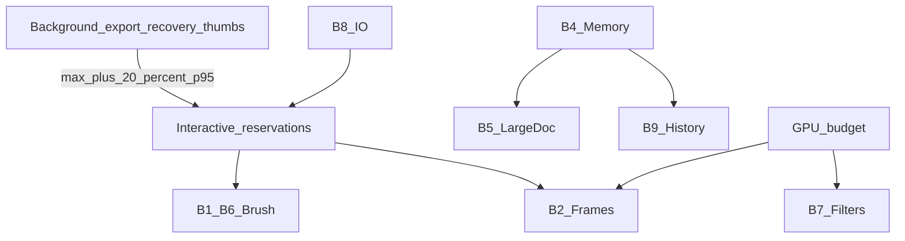

# Performance Budget Ledger

## Purpose

Ledger of provisional performance budgets, owners, fixtures, and regression gates for PhotoTux. Source of truth for thresholds is [30 — Performance](../30-Performance.md); this appendix indexes them for engineering review and CI mapping. Targets are provisional until promoted by [Decision Register](Decision-Register.md) entries with measured evidence. Normative keywords follow [Requirement Keywords](Requirement-Keywords.md).

## Ledger Rules

1. Every interactive budget names: metric, percentile, fixture, hardware tier, owner subsystem, and failure policy.
2. Measurements MUST report p50/p95/p99 where sample size supports them, max, MAD or CI, and exclusions.
3. Average FPS alone is insufficient for frame budgets.
4. Claims MUST distinguish photon/present endpoints from submit-only endpoints when host timing is limited.
5. Background work MUST NOT raise interactive p95 more than 20% without disclosed pressure mode.
6. Correctness, save/recovery capacity, and CPU fallback outrank winning a budget.
7. No cloud, remote render, or AI acceleration assumptions.

## Device Tiers

| Tier | CPU | RAM | GPU budget | Display | Storage |
| --- | --- | --- | --- | --- | --- |
| L constrained | 4 cores | 8 GiB | ~1 GiB usable iGPU | 1080p60 | SSD |
| M reference | 8 cores | 16–32 GiB | ~4 GiB | 1440p 60–120 | NVMe |
| H high | 12+ cores | 64 GiB | 8+ GiB dGPU | 4k120 | fast NVMe |

Default interactive budgets apply on **Tier M** unless noted. Tier L may reduce cache/preview quality but MUST retain correctness and explicit unavailable status.

## Budget Ledger

### B1 — Input to preview

| Field | Value |
| --- | --- |
| Metric | event timestamp → first changed preview pixel |
| Budget | ≤16 ms p95; ≤25 ms p99 @ 60 Hz |
| 120 Hz aspirational | ≤8.3 ms p95 when path supports; no semantic sample loss if missed |
| Sub-budgets | normalize/tool ≤1 ms p95; dab plan ≤2 ms p95 per batch |
| Cancel uncommitted | clear transient preview ≤1 presented frame |
| UI activation ack | ≤100 ms to accepted/committed/busy |
| Fixture | standard brush on 4096² 8-bit RGBA, 20 visible layers, active selection |
| Owners | host input, tool, brush ([14](../14-Brush-Engine.md)), render ([17](../17-Rendering-Engine.md)) |
| Docs | 00, 14, 17, 30 |

### B2 — Frame pacing (cached navigation)

| Field | Value |
| --- | --- |
| Metric | frame interval distribution during 10 s pan/zoom/rotate/overlay-only |
| Budget | sustain display cadence ≤60 Hz mid; 120 Hz high when capable |
| 60 Hz intervals | ≤16.7 ms p95; ≤25 ms p99 |
| Misses | ≤1% intervals >2× target |
| CPU frame plan | ≤3 ms p95 cached; ≤6 ms p95 ordinary dirty tiles |
| Consistency | older complete frame ≻ unlabeled mixed-version |
| Owners | render coordinator, GPU lane, view state |
| Docs | 17, 30 |

### B3 — Startup and restore

| Field | Value |
| --- | --- |
| Warm shell | ≤1.5 s p50; ≤2.5 s p95 (no docs, built-ins) |
| Cold shell | ≤3.5 s p95 mid SSD |
| Recovery discovery | ≤1 s for 100 headers; MUST NOT wait GPU |
| First interactive shell | before optional catalog indexing completes |
| Standard doc first low-res frame | ≤2.5 s warm; ≤5 s cold |
| Cold boot to interactive (ADR-008) | <1,000 ms gate; <250 ms stretch |
| Owners | lifecycle ([02](../02-Application-Lifecycle.md)), host, render |
| Docs | 02, 30 |

Measured cold-boot composition, reference workstation (Arc B580 / Mesa, release build, `QT_QPA_PLATFORM=offscreen`, median of seven fresh processes). The shell self-reports these phases on stderr, so the figures are reproducible without extra tooling.

| Phase | Before | After | Note |
| --- | --- | --- | --- |
| GPU ready | ~40 ms | ~40 ms | wgpu adapter + device |
| Host construction (`AppSession`) | ~91 ms | ~3 ms | fontconfig enumeration deferred to first Character use |
| QML root object graph | ~541 ms | ~450 ms | dialogs, palette, and collapsed inspector groups deferred |
| First interactive frame | ~643 ms | ~558 ms | ADR-008 gate satisfied |

Floor: a trivial root window in the same process costs ~283 ms, of which ~190 ms is Qt/QML engine plus Controls module load. Startup work below that floor requires reducing module surface, not deferring more application content. Deferring dialog construction alone produced no measurable gain — the object graph cost concentrates in always-visible chrome — which is why the ledger records phase composition rather than a single total.

### B4 — Memory and cache

| Field | Value |
| --- | --- |
| Idle shell RSS | ≤300 MiB after settle |
| Open standard 4k layered | ≤2.0× unique authoritative decoded bytes peak add |
| CPU reconstructible caches | default ≤20% physical RAM (floor/cap configurable) |
| GPU caches | ≤50% conservative adapter budget + emergency headroom |
| Temp op memory | hard per-op and process limits |
| Save/recovery reservation | independent of render cache fill |
| Accounting error | within 10% for owned large allocations |
| Leak heuristic | no monotonic RSS growth across 30 open/edit/close cycles after settle |
| Owners | document, render, I/O, history |
| Docs | 10, 17, 20, 27, 30 |

### B5 — Large documents

| Field | Value |
| --- | --- |
| Fixture | sparse 16384² 16-bit RGBA, 50 mixed layers, >GPU budget logical size |
| Structural open | ≤3 s warm; ≤8 s cold |
| First viewport low-res | ≤2 s after registration |
| Visible final settle after jump | ≤1 s p95 cached; ≤3 s p95 cold local |
| Empty sparse pan | within frame pacing budget |
| Peak GPU/process | under configured hard budgets or typed resource error |
| Forbidden | materialize all layers/levels/chunks on open |
| Owners | document, formats, render |
| Docs | 10, 17, 27, 30 |

### B6 — Brush commit path

| Field | Value |
| --- | --- |
| Standard preview | inherits B1 |
| Prep → authoritative commit | ≤50 ms p95 |
| Commit critical section | ≤4 ms p95; MUST be bounded |
| 10 s stroke queues | within configured bounds |
| Stress brush | may lower preview/coalesce under policy; MUST keep confirmed geometry + disclose |
| Cancel CPU | ≤100 ms SHOULD; GPU one submission unit |
| Owners | brush, commands, document, workers |
| Docs | 08, 14, 20, 30 |

### B7 — Filters

| Field | Value |
| --- | --- |
| Param → first preview tile (local-radius) | ≤100 ms p95 |
| Visible preview complete standard 4k | ≤500 ms p95 mid common local filters |
| Full-document final | progress by 250 ms; cancel check ≤100 ms CPU or tile/submit boundary |
| Global-reduction | declare memory and pass count before accept |
| Owners | filter engine, workers, GPU, commands |
| Docs | 15, 08, 30 |

### B8 — Import and export

| Field | Value |
| --- | --- |
| Selection → format ID | ≤100 ms (local, probe cached) |
| 4k lossless import throughput | ≥150 MiB/s decoded when codec/storage permit; allocation bounded |
| Native structural open | coherent doc before optional thumbs/indexes |
| Export accept → progress | ≤100 ms |
| Export first encoded output | ≤500 ms streamable |
| 4k flattened export | ≤2 s p95 mid moderate compression (codec evidence may refine) |
| Large export | stream, keep interaction reservations, cancel at chunk/tile |
| Owners | import/export, formats, I/O, color |
| Docs | 22, 27, 16, 30 |

### B9 — History retention

| Field | Value |
| --- | --- |
| Policy | budget-based retention, not unbounded list |
| Pressure | spill/drop oldest per policy with disclosure |
| Undo interactive | SHOULD feel immediate; heavy inverses become jobs |
| Owners | history ([20](../20-History-Undo.md)) |
| Docs | 20, 30 |

### B10 — Accessibility projection

| Field | Value |
| --- | --- |
| Tree publish | MUST NOT block editing if AT missing |
| Event flood | no per-sample/frame announcements |
| Focus visible | at 200% scale and high contrast |
| Owners | a11y ([29](../29-Accessibility.md)), themes |
| Docs | 29, 25, 30 |

### B11 — Extension budgets

| Field | Value |
| --- | --- |
| CPU/memory/time/queue | per contribution declaration |
| Overflow | reject/cancel extension work; core interactive reserved |
| Crash | isolate; document opaque data preserved |
| Owners | plugin SDK ([23](../23-Plugin-SDK.md)) |
| Docs | 23, 30 |

### B12 — Recovery latency (charter)

| Field | Value |
| --- | --- |
| Potential lost work bound | SHOULD ≤60 s active editing under default recovery policy |
| Owners | lifecycle, formats, I/O |
| Docs | 00, 02, 27 |

## Cross-Budget Interactions



When budgets conflict: document integrity and recovery reservations win; then interactive input; then background quality.

## Ownership Matrix

| Budget | Primary owner | Secondary | CI gate candidate |
| --- | --- | --- | --- |
| B1 | Brush + Render | Host input | yes (native device runs) |
| B2 | Render | View | yes |
| B3 | Lifecycle | Host | yes (warm/cold labeled) |
| B4 | Document + Render | History/I/O | yes (RSS + accounting) |
| B5 | Document + Render | Formats | yes (sparse fixture) |
| B6 | Brush + Commands | Document | yes |
| B7 | Filters | Commands | yes |
| B8 | Import/Export | Formats | yes |
| B9 | History | Document | partial |
| B10 | Accessibility | Themes | policy tests |
| B11 | Plugin host | Commands | harness |
| B12 | Lifecycle | Formats | recovery drills |

## Measurement Methodology (Ledger View)

From [30](../30-Performance.md):

- pin fixture corpus revision and tier label;
- separate warm/cold filesystem;
- record adapter feature level, driver, thermal state;
- use tracing correlation IDs across command → snapshot → frame;
- exclude samples only with documented reason;
- publish baselines with MAD/CI; regressions need owner sign-off.

Synthetic injection cannot replace native-device runs for B1.

## Regression Gate Policy

| Signal | Gate |
| --- | --- |
| p95 exceeds budget by >10% on mid tier reference fixture | fail or require Decision Register waiver |
| monotonic RSS growth in B4 cycle test | fail |
| mixed-version frame detected | fail |
| interactive p95 +20% under background load without pressure mode | fail |
| recovery blocked on GPU init | fail |
| silent sample loss to hit latency | fail |

Waivers MUST include fixture, hardware, alternatives, user impact, owner, review date.

## Reporting Template

```text
budget_id: B1
tier: M
fixture: brush-standard-4k-v3
endpoint: present | submit | acquire
samples: N
p50/p95/p99/max: ...
excluded: ...
commit: <git>
device: <adapter>
notes: ...
```

## Non-Goals

- Vendor GPU brand optimizations as normative requirements
- Network latency budgets
- Generative inference SLAs
- Guaranteeing 120 Hz on Tier L

## Soft CI gates (P13 / DR-017)

Headless fixtures in `phototux_engine::budget_harness` run on every `cargo test` / `./scripts/check-rust.sh`. These are **soft CI gates** (CPU / command-router proxies), not photon/present promotions.

| Budget | Fixture | Soft max | Status |
| --- | --- | --- | --- |
| B2-proxy | `cpu-composite-8x256` | 500 ms | **Accepted (CI soft)** |
| B9 | `history-retention-trim-200-to-64` | 50 ms | **Accepted (CI soft)** |
| B1-proxy | `view-zoom-to-fit` invoke | 25 ms | **Accepted (CI soft)** |
| B2 | `camera-nav-4k-120` (Tier M CPU proxy) | 50 ms | **Accepted (CI soft)** — not photon/present |
| B1 | `command-batch-4k-60` (Tier M CPU proxy) | 100 ms | **Accepted (CI soft)** — not photon/present |
| B2-present | `present-nav-intervals-4k` (Tier M) | 80 ms total; p50/p95 intervals logged | **Accepted (CI soft)** — present-path proxy; skip photon if no display |
| B1-present | `present-dirty-mark-4k` (Tier M) | 40 ms | **Accepted (CI soft)** — dirty/invalidation proxy for input→preview |
| B3-present | `session-warm-construct` (Tier M) | 25 ms | **Accepted (CI soft)** — warm shell construct proxy |

**Tier M evidence (2026-07-17, host CachyOS, commit family `52670f7`+):** soft suite green — `present-nav-intervals-4k` ~0.03 ms total (p95 interval ≪1 ms), `present-dirty-mark-4k` ~0.005 ms, `session-warm-construct` ~0.016 ms. Photon/GPU present endpoints remain **Provisional** when CI has no display (skip matrix). B5 large-doc / GPU composite stay Provisional; large-doc suite feeds P11.

### GPU skip matrix (device-loss / parity)

| Suite | Gate | Skip when |
| --- | --- | --- |
| `phototux_gpu` device-loss unit tests | Vulkan adapter via `GpuContext::new` | No Vulkan device (test panics / CI host without GPU) |
| `phototux_gpu` CPU↔GPU parity | `--features gpu-tests` | Feature off (default CI); or no adapter |
| Host recover UX | Manual / interactive | Headless |

## Cross References

- [30 — Performance](../30-Performance.md)
- [00 — Introduction](../00-Introduction.md)
- [14 — Brush Engine](../14-Brush-Engine.md)
- [17 — Rendering Engine](../17-Rendering-Engine.md)
- [22 — Import and Export](../22-Import-Export.md)
- [Thread Ownership Map](Thread-Ownership-Map.md)
- [Decision Register](Decision-Register.md)
- [31 — Testing](../31-Testing.md)
