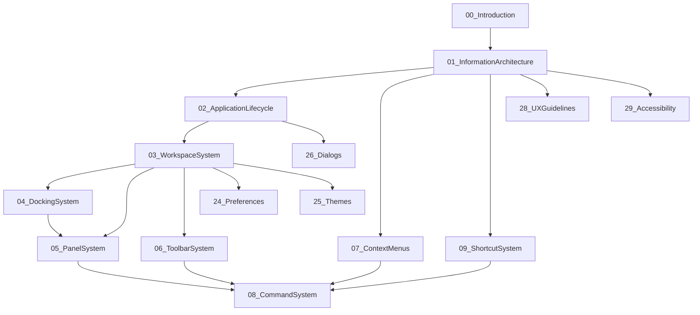
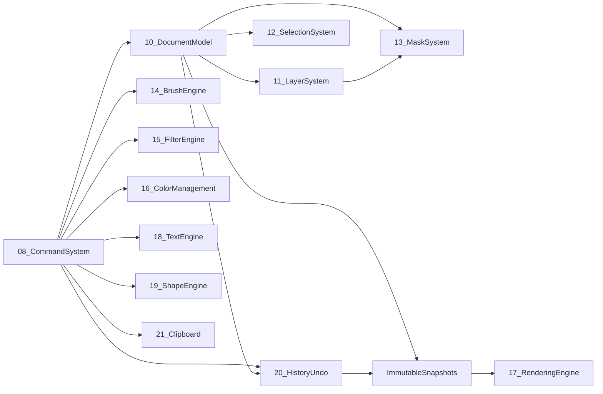
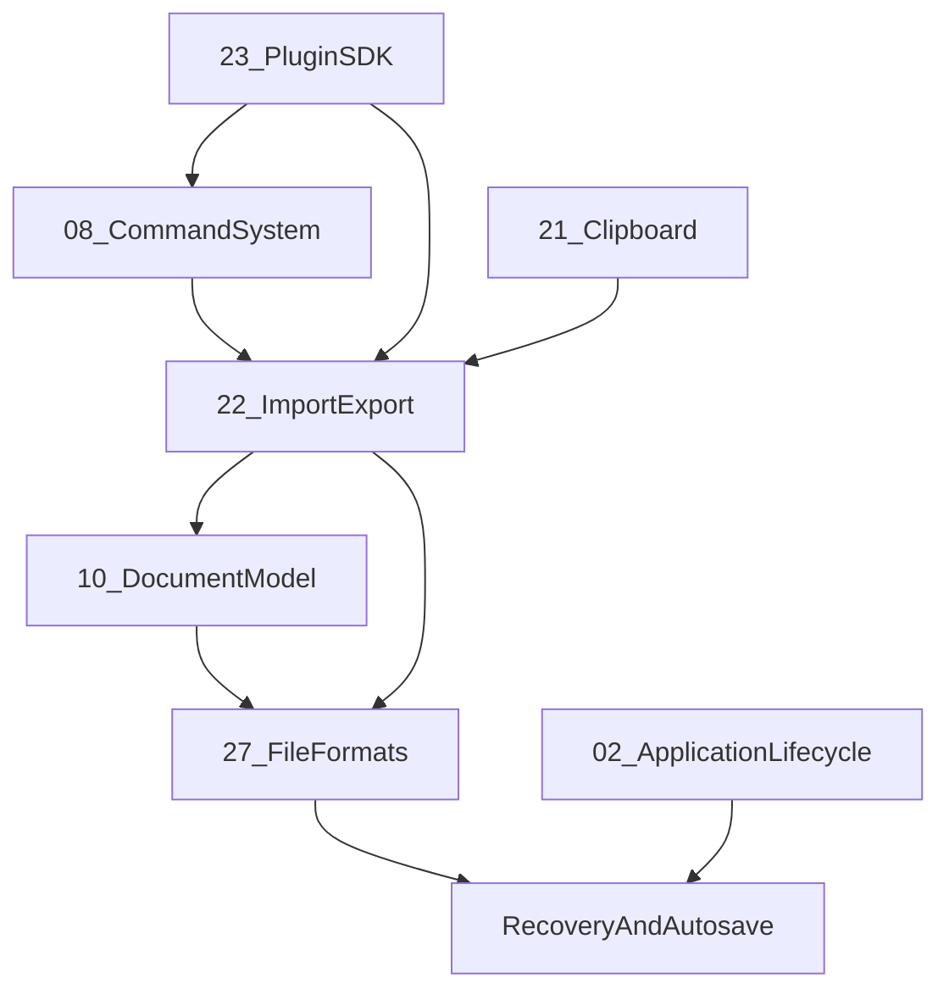

# Subsystem Dependency Matrix

## Purpose

This appendix records allowed dependency direction among PhotoTux handbook subsystems (documents `00`–`32`). It is the normative map for crate boundaries, review scope, and reading order. Normative words follow [Requirement Keywords](Requirement-Keywords.md). Terms follow the [Glossary](Glossary.md).

PhotoTux is a Linux-native, local-first professional raster editor. The portable core owns editing semantics. Host adapters own desktop integration. Commands are the sole mutation spine. The document owns authoritative truth. History stores transactions. Rendering consumes immutable snapshots.

## Dependency Rules

1. Policy and semantics flow inward: presentation and host adapters depend on core contracts; core MUST NOT depend on toolkit, AT-SPI, portals, or wgpu device objects.
2. A subsystem MAY depend on another only when this matrix marks the edge **Required**, **Allowed**, or **Read-only**.
3. **Forbidden** edges MUST NOT appear in production crates, even transitively through “convenience” re-exports.
4. Cycles across layer boundaries are forbidden. Intra-layer cycles require an explicit entry in the [Decision Register](Decision-Register.md).
5. Extension contributions enter through [23 — Plugin SDK](../23-Plugin-SDK.md) and [08 — Command System](../08-Command-System.md); they never receive mutable document references.
6. Derived state (render caches, GPU textures, panel projections, accessibility trees) MAY observe core versions; they MUST NOT become authoritative.

## Layer Groups

| Layer | Documents | Ownership |
| --- | --- | --- |
| Charter | 00, 01 | Product boundary, mental model, information scent |
| Shell | 02–07, 09, 24–26, 28 | Lifecycle, workspace, docking, panels, toolbars, menus, shortcuts, preferences, themes, dialogs, UX |
| Domain | 08, 10–16, 18–21 | Commands, document, layers, selection, masks, brushes, filters, color, text, shapes, history, clipboard |
| Compute | 17, 30 | Rendering, performance budgets, scheduling evidence |
| I/O and trust | 22, 23, 27 | Import/export, plugins, native format |
| Quality | 29, 31, 32 | Accessibility, testing, developer guide |

## Full Document Index

| ID | Document | Primary providers | Primary consumers |
| --- | --- | --- | --- |
| 00 | [Introduction](../00-Introduction.md) | Charter, invariants, ownership | All |
| 01 | [Information Architecture](../01-Information-Architecture.md) | Hierarchy, actions, selection/focus/context | Shell, a11y, UX |
| 02 | [Application Lifecycle](../02-Application-Lifecycle.md) | Session, startup, shutdown, recovery orchestration | Shell, host adapters |
| 03 | [Workspace System](../03-Workspace-System.md) | Windows, views, workspace presets | Panels, docking, UX |
| 04 | [Docking System](../04-Docking-System.md) | Layout geometry, split/stack topology | Workspace, panels |
| 05 | [Panel System](../05-Panel-System.md) | Panel descriptors, follow/pin targets | Workspace, plugins |
| 06 | [Toolbar System](../06-Toolbar-System.md) | Tool presentation, placement | Commands, shortcuts |
| 07 | [Context Menus](../07-Context-Menus.md) | Context targets, completeness | Actions, a11y |
| 08 | [Command System](../08-Command-System.md) | Mutation spine, validation, jobs | Domain, plugins, shell |
| 09 | [Shortcut System](../09-Shortcut-System.md) | Bindings, conflicts, IME yield | Actions, a11y |
| 10 | [Document Model](../10-Document-Model.md) | Authoritative graph, versions, snapshots | History, render, formats |
| 11 | [Layer System](../11-Layer-System.md) | Layer tree, kinds, blending inputs | Selection, masks, render |
| 12 | [Selection System](../12-Selection-System.md) | Object and pixel selection | Commands, masks, brushes |
| 13 | [Mask System](../13-Mask-System.md) | Mask attachment and edit surfaces | Layers, render, brushes |
| 14 | [Brush Engine](../14-Brush-Engine.md) | Stroke planning, dab generation | Commands, tiles, render |
| 15 | [Filter Engine](../15-Filter-Engine.md) | Filter descriptors, CPU/GPU paths | Commands, plugins, render |
| 16 | [Color Management](../16-Color-Management.md) | Profiles, assign/convert, proofing | Render, export, UX |
| 17 | [Rendering Engine](../17-Rendering-Engine.md) | Snapshots→tiles→present | Views, export preview |
| 18 | [Text Engine](../18-Text-Engine.md) | Text objects, shaping, rasterize boundary | Layers, render |
| 19 | [Shape Engine](../19-Shape-Engine.md) | Vector-like shapes, rasterize boundary | Layers, render |
| 20 | [History Undo](../20-History-Undo.md) | Transactions, undo/redo, budgets | Document, commands |
| 21 | [Clipboard](../21-Clipboard.md) | Internal/external transfer validation | Commands, host |
| 22 | [Import Export](../22-Import-Export.md) | Codecs, progress, loss disclosure | Document, formats |
| 23 | [Plugin SDK](../23-Plugin-SDK.md) | Capabilities, contributions, isolation | Commands, I/O, panels |
| 24 | [Preferences](../24-Preferences.md) | Preference schemas, migration | Shell, a11y, performance |
| 25 | [Themes](../25-Themes.md) | Contrast, tokens, motion | Shell, a11y |
| 26 | [Dialogs](../26-Dialogs.md) | Modal/task dialogs, focus return | Shell, lifecycle |
| 27 | [File Formats](../27-File-Formats.md) | Native container, chunks, migration | Save, recovery, import |
| 28 | [UX Guidelines](../28-UX-Guidelines.md) | Interaction quality, disclosure | Shell specs |
| 29 | [Accessibility](../29-Accessibility.md) | Semantic tree, AT-SPI, keyboard | All presentations |
| 30 | [Performance](../30-Performance.md) | Budgets, tiers, gates | Render, brush, I/O |
| 31 | [Testing](../31-Testing.md) | Fixtures, fuzz, gates | All |
| 32 | [Developer Guide](../32-Developer-Guide.md) | Engineering workflow | Contributors |

## Dependency Matrix Legend

| Mark | Meaning |
| --- | --- |
| R | Required: consumer cannot meet its contract without producer |
| A | Allowed: consumer may use producer contracts |
| O | Read-only observe: consumer may subscribe to versions/deltas only |
| — | No direct dependency expected |
| X | Forbidden |

Rows consume; columns provide. Matrix is sparse by design: absence of R/A means “do not couple.”

## Core Semantic Dependencies

| Consumer ↓ / Provider → | 00 | 01 | 08 | 10 | 11 | 12 | 13 | 16 | 17 | 20 | 22 | 23 | 27 | 29 | 30 |
| --- | --- | --- | --- | --- | --- | --- | --- | --- | --- | --- | --- | --- | --- | --- | --- |
| 02 Lifecycle | R | A | A | A | — | — | — | — | A | A | A | A | A | A | A |
| 03 Workspace | R | R | A | O | O | O | O | — | O | — | — | A | — | R | A |
| 04 Docking | R | R | — | — | — | — | — | — | — | — | — | A | — | A | A |
| 05 Panels | R | R | A | O | O | O | O | O | O | O | — | A | — | R | A |
| 06 Toolbars | R | R | R | — | — | — | — | — | — | — | — | A | — | R | A |
| 07 Context menus | R | R | R | O | O | O | O | — | — | — | — | A | — | R | — |
| 08 Commands | R | A | — | R | A | A | A | A | O | R | A | A | A | A | A |
| 09 Shortcuts | R | R | R | — | — | — | — | — | — | — | — | A | — | R | A |
| 10 Document | R | A | R | — | R | R | R | R | O | R | A | A | R | A | A |
| 11 Layers | R | A | R | R | — | A | R | R | O | A | — | A | A | A | A |
| 12 Selection | R | R | R | R | A | — | A | A | O | A | — | A | A | R | A |
| 13 Masks | R | A | R | R | R | A | — | A | O | A | — | A | A | A | A |
| 14 Brush | R | A | R | R | A | A | A | A | O | A | — | A | — | A | R |
| 15 Filters | R | A | R | R | A | A | A | R | O | A | — | A | — | A | R |
| 16 Color | R | A | R | R | A | — | — | — | O | A | A | A | A | A | A |
| 17 Rendering | R | A | O | R | R | O | R | R | — | O | O | O | O | A | R |
| 18 Text | R | A | R | R | R | — | A | R | O | A | — | A | A | A | A |
| 19 Shapes | R | A | R | R | R | A | A | R | O | A | — | A | A | A | A |
| 20 History | R | A | R | R | A | A | A | A | O | — | A | A | A | A | A |
| 21 Clipboard | R | A | R | R | A | A | A | A | — | A | A | A | A | A | A |
| 22 Import/Export | R | A | R | R | A | A | A | R | O | A | — | A | R | A | R |
| 23 Plugin SDK | R | A | R | O | O | O | O | O | O | O | A | — | A | R | R |
| 24 Preferences | R | A | A | — | — | — | — | A | — | — | — | A | — | R | A |
| 25 Themes | R | A | — | — | — | — | — | — | — | — | — | A | — | R | A |
| 26 Dialogs | R | R | A | O | — | — | — | — | — | — | A | A | — | R | A |
| 27 File formats | R | A | A | R | A | A | A | R | O | A | R | A | — | A | A |
| 28 UX | R | R | A | O | O | O | O | A | O | A | A | A | A | R | A |
| 29 Accessibility | R | R | R | O | O | O | O | O | O | O | O | A | O | — | A |
| 30 Performance | R | A | A | A | A | A | A | A | R | A | A | A | A | A | — |
| 31 Testing | R | A | R | R | A | A | A | A | R | R | R | R | R | R | R |
| 32 Developer guide | R | A | A | A | A | A | A | A | A | A | A | A | A | A | A |

## Shell Composition Dependencies

Workspace composition has an internal order that MUST be respected:



Rules for shell crates:

- Docking owns layout topology; panels own semantic content and follow/pin policy.
- Toolbars and menus present actions; they MUST NOT execute domain mutation without commands.
- Shortcuts resolve to actions, then commands; they MUST yield to text input and IME.
- Preferences and themes persist presentation and policy, not document pixels.
- Dialogs may request host portals; they return capabilities or typed denials to lifecycle/commands.

## Domain Mutation Dependencies



Domain rules:

- Layers, selection, and masks are document subsystems, not alternate truth stores.
- Brush, filter, text, and shape engines prepare work; authoritative commits remain commands/transactions.
- Color management defines interpretation and conversion; render and export consume transforms.
- History is bound to document identity; undo/redo publish new monotonic versions.
- Clipboard payloads are untrusted at host boundaries and validated like import.

## Persistence and Trust Dependencies



Trust rules:

- Native format ([27](../27-File-Formats.md)) is the editable persistence authority.
- Third-party codecs ([22](../22-Import-Export.md)) never become native stores by accident.
- Plugins contribute through capabilities; missing extensions preserve opaque payloads or declare unavailable nodes.
- Recovery supplements save; it MUST NOT be presented as confirmed save.
- Diagnostics redact paths and content by default.

## Compute and Quality Dependencies

| Consumer | Must observe | Must not mutate |
| --- | --- | --- |
| 17 Rendering | document snapshots, view state, color transforms, dirty deltas | document graph, history |
| 29 Accessibility | committed semantic projections, action enablement | pixels via AT actions without commands |
| 30 Performance | all latency/memory owners | product boundaries to “win” a budget |
| 31 Testing | contracts from all layers | production defaults silently |
| 32 Developer guide | handbook + appendices | alternate numbering schemes |

## Forbidden Couplings

The following couplings are **Forbidden** and MUST be rejected in review:

| From | To | Why |
| --- | --- | --- |
| 10 Document | 03–07 shell types | Document truth cannot depend on widgets |
| 10 Document | 17 wgpu types | GPU resources are derived |
| 17 Rendering | 08 commit APIs | Renderer never commits |
| 05 Panels | direct tile writes | Panels project; brushes/commands write |
| 23 Plugins | ambient filesystem | Capabilities only |
| 22 Codecs | UI toolkit dialogs | Host/lifecycle own portals |
| 20 History | raw UI events | History stores transactions |
| 29 Accessibility | inventing roles from pixels | Semantics come from descriptors |
| Any core crate | network/account/AI service | Outside product boundary |

## Review Checklist for New Edges

When a change introduces a new dependency:

1. Name producer and consumer documents.
2. Classify edge as R, A, or O.
3. Confirm no layer-boundary cycle.
4. Confirm thread ownership remains valid per [Thread Ownership Map](Thread-Ownership-Map.md).
5. Confirm error categories remain valid per [Error Taxonomy](Error-Taxonomy.md).
6. Update this matrix and [Cross-Reference Index](Cross-Reference-Index.md) in the same change.
7. Add a [Decision Register](Decision-Register.md) entry if the edge is contested or high reversal cost.

## Relationship to Crates

Handbook documents do not equal crates one-to-one. Packaging MAY split or merge implementation units, but dependency direction MUST remain:

```text
host adapters → presentation → interaction/commands → document domain → snapshots
                                                      ↘ history
snapshots → render/compute
document + commands → persistence/codecs
extensions → command/capability mediation only
```

A crate that needs a forbidden edge MUST introduce an explicit interface owned by the producer document, not a shortcut import.

## Cross References

- [00 — Introduction](../00-Introduction.md)
- [01 — Information Architecture](../01-Information-Architecture.md)
- [08 — Command System](../08-Command-System.md)
- [10 — Document Model](../10-Document-Model.md)
- [17 — Rendering Engine](../17-Rendering-Engine.md)
- [23 — Plugin SDK](../23-Plugin-SDK.md)
- [27 — File Formats](../27-File-Formats.md)
- [30 — Performance](../30-Performance.md)
- [Cross-Reference Index](Cross-Reference-Index.md)
- [Decision Register](Decision-Register.md)
- [Thread Ownership Map](Thread-Ownership-Map.md)
