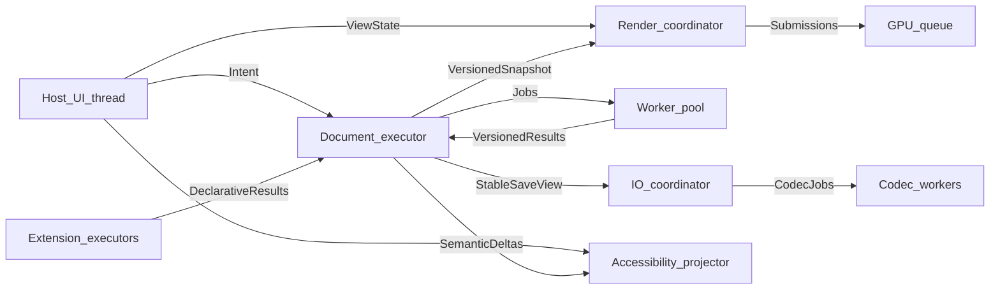
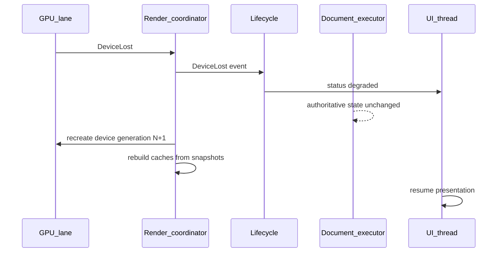

# Thread Ownership Map

## Purpose

Defines role threads (logical executors), what each owns, what it may touch, and synchronization rules for PhotoTux. Names describe roles, not a final runtime or OS thread count. Normative keywords follow [Requirement Keywords](Requirement-Keywords.md). Foundation rules come from [00 — Introduction](../00-Introduction.md); budgets from [30 — Performance](../30-Performance.md).

## Ownership Principles

1. **Single writer for authoritative document state** per document (or equivalent conflict-safe serialization).
2. **Immutable snapshots** cross thread boundaries toward render and export.
3. **UI thread never waits** synchronously on GPU completion or unbounded document/I/O work.
4. **Locks never span** external callbacks, filesystem I/O, shader compilation, or extension code.
5. **Results carry versions**; stale results are discarded or explicitly rebased.
6. **Queues are bounded** or have documented shedding policy.
7. **GPU resource lifetime** is decoupled from document object lifetime.
8. **Extensions run isolated** with budgets; never on UI thread for untrusted work.

## Role Catalog

| Role | Affinity | Owns | May read | Must not |
| --- | --- | --- | --- | --- |
| Host/UI thread | native event loop | windows, focus, ephemeral presentation, a11y bridge posting | projections, enablement | document locks, GPU wait, unbounded decode |
| Intent/tool lane | UI or short worker | gesture state, tool machines | view IDs, tool params | authoritative pixels |
| Command router | controllable | invocation queues, job registry | descriptors | direct graph mutation |
| Document executor | per-document serial | authoritative graph, version clock | prepared results | UI widgets, wgpu device |
| History engine | with document executor | transaction timeline | document builders | render caches as truth |
| Snapshot publisher | with/after commit | snapshot/delta handles | — | mutate after publish |
| Render coordinator | render lane | graph schedule, priorities | immutable snapshots, view state | document mutation |
| GPU queue lane | driver/wgpu | buffers, textures, pipelines, submissions | upload lists | document locks |
| Worker pool | pool | CPU filters, dab prep, thumbs, indexes | versioned inputs | commit without applicability |
| I/O coordinator | I/O lane | staged writes, recovery schedule | snapshot leases | UI dialogs directly |
| Codec workers | pool/I/O | decode/encode streams | capabilities, limits | ambient FS authority |
| Extension executors | isolated | plugin compute | capability APIs | core locks, UI thread |
| Accessibility projector | UI or dedicated | semantic tree revisions | committed projections | pixel mutation |
| Diagnostics | best-effort | local traces/metrics | redacted events | network export by default |

## Topology

## Per-Role Contracts

### Host/UI thread

**Must:**

- timestamp and normalize input via host adapters;
- own native window/surface lifecycle messages;
- publish accessibility tree deltas without blocking on AT clients;
- show busy/progress from operation IDs;
- apply preference/theme signals.

**Must not:**

- hold document mutation locks;
- `wait` on GPU fences for ordinary frames;
- run untrusted extension code;
- decode entire huge files inline;
- treat panel local state as document truth.

### Document executor

**Must:**

- serialize conflicting mutations per document;
- run validation → build → atomic commit + history;
- publish snapshots/deltas after commit;
- reject stale worker results by version policy;
- freeze mutations on invariant failure.

**Must not:**

- call into toolkit;
- perform unbounded filesystem operations while holding graph locks;
- execute extension sandboxes inline without mediation.

Brush/filter preparation SHOULD occur on workers; commit critical section SHOULD stay below 4 ms p95 for standard brush ([30](../30-Performance.md)).

### Render coordinator + GPU lane

**Must:**

- consume immutable snapshots and view state;
- prioritize visible tiles;
- apply backpressure and quality shedding under budget;
- handle device/surface loss without clearing documents;
- prefer older complete frame over mixed-version frame.

**Must not:**

- write layers/history;
- share mutable document references;
- block UI on pipeline compilation.

### Worker pool

**Must:**

- tag outputs with source version and applicability;
- observe cancellation at declared boundaries;
- respect per-operation memory/time limits.

**Must not:**

- commit transactions directly;
- touch wgpu device objects unless explicitly classified as GPU helper role under render ownership.

### I/O coordinator + codecs

**Must:**

- lease immutable snapshots for save/export;
- staged write + verify + atomic replace;
- treat input as untrusted with allocation limits;
- keep reserved capacity independent of render caches.

**Must not:**

- clear modified flag unless persisted == current;
- follow surprising symlink replacement without host policy.

### Extension executors

**Must:**

- run under capability grants and budgets;
- return bounded declarative results for core validation;
- isolate crashes/timeouts.

**Must not:**

- receive mutable document references;
- forge built-in provenance;
- hold core locks;
- require network/accounts/AI services.

## Affinity Table for Major Objects

| Object | Owning role | Shared how |
| --- | --- | --- |
| `Document` graph | document executor | snapshots out |
| `HistoryTimeline` | document executor | read-only projections |
| `Layer` / `Mask` / selection | document executor | IDs in commands |
| Tile CPU cache | workers + document policy | keyed by version |
| Tile GPU textures | GPU lane | cache keys include full semantic inputs |
| `CommandDescriptor` registry | router (synced publish) | immutable snapshots of registry |
| Workspace layout | UI + workspace commands | persisted via preference/workspace schemas |
| Focus | UI / a11y | semantic IDs |
| wgpu `Device`/`Queue` | GPU lane | lost → new generation |
| File capabilities | host → core values | opaque handles |
| Extension worker | extension executor | protocol messages |

## Lock and Wait Rules

| Situation | Allowed wait | Forbidden |
| --- | --- | --- |
| UI handling input | micro-locks on ephemeral UI only | document write lock |
| Commit critical section | short graph lock | I/O, shader compile, extension calls |
| Render frame | GPU submission async | document write |
| Save | snapshot lease without blocking UI | overwrite without stage |
| AT-SPI query | cached tree snapshot | regenerating full doc under lock |
| Plugin call | timeout budget | unbounded sync UI call |

## Channel and Backpressure Policy

| Channel | Bound | Overflow policy |
| --- | --- | --- |
| Input → tool | high, short | coalesce samples under geometric error policy |
| Tool → commands | medium | reject/backpressure; never silent-drop commits |
| Snapshot → render | medium | coalesce dirty; gap → full resync |
| Progress events | high | coalesce by operation |
| Accessibility events | medium | coalesce + rate-limit |
| Extension requests | low | reject when budget exceeded |
| Codec jobs | low/medium | queue with priority under interactive reservation |

Interactive reservations MUST remain available under background export/recovery ([30](../30-Performance.md)).

## Cancellation Ownership

| Work class | Who signals | Who observes | Bound |
| --- | --- | --- | --- |
| Gesture preview | UI/tool | tool lane | one frame to clear |
| Command prepare | router | workers | 100 ms CPU loops SHOULD |
| GPU submission unit | render | GPU lane | one declared unit |
| Export/import | router/UI | codec workers | tile/chunk boundaries |
| Extension | host | executor | timeout + kill isolation |

Cancellation before commit leaves no authoritative partial state. After commit, use undo.

## Device Loss Ownership

Document executor does not “reset” the document on device loss.

## Startup Ordering Constraints

Logical order ([02](../02-Application-Lifecycle.md), [30](../30-Performance.md)):

1. process/bootstrap;
2. configuration + registries;
3. recovery scan (MUST NOT wait for GPU);
4. host probe + window;
5. workspace reconcile;
6. document open as needed;
7. device creation + pipelines;
8. first presentation.

Shader compilation MUST NOT block recovery decisions or native window input.

## Cross-Document Concurrency

- Distinct documents SHOULD mutate concurrently on separate executor slots.
- Global exclusive ops (limited) use `exclusive-op` conflict policy.
- Shared resource catalogs use their own serialization; missing resources do not lock documents indefinitely.
- Imports reserving multiple documents reserve all slots before exposing any (unless format allows partial sets).

## Mapping to Subsystems

| Subsystem doc | Dominant roles |
| --- | --- |
| 02 Lifecycle | UI, lifecycle, I/O |
| 03–07 Shell | UI |
| 08 Commands | router, document, workers |
| 10–13 Domain | document executor |
| 14 Brush | UI/tool, workers, document, render |
| 15 Filters | workers, GPU helpers, document |
| 16 Color | document, workers, render |
| 17 Render | render coordinator, GPU |
| 20 History | document executor |
| 21–22 I/O transfer | I/O, codecs, document |
| 23 Plugins | extension executors, router |
| 27 Formats | I/O, codecs, document |
| 29 Accessibility | UI + projector |
| 30 Performance | all (measurement) |

## Review Checklist

- [ ] New shared state names an owning role.
- [ ] Cross-thread publication uses immutable/versioned handles.
- [ ] No lock scope includes I/O, UI callbacks, or extensions.
- [ ] Worker outputs include version applicability.
- [ ] Queues declare bounds and overflow policy.
- [ ] GPU loss path leaves documents intact.
- [ ] Headless tests can exercise document executor without UI/GPU.

## Anti-Patterns

- “Just mutex the document from the UI thread”
- Passing `Rc<RefCell<Document>>` into render
- Blocking present on map-read of GPU buffers every frame
- Running zip bombs decode on UI thread
- Extension callbacks during commit
- Using panel React/GTK models as undo stacks

## Implementation map (shipping crates, 2026-07)

| Role | Shipping location |
| --- | --- |
| Host/UI thread | `phototux_ui` (`AppSession` qtbridge) + QML |
| Document executor | `phototux_engine::SessionState` (UI-thread serial today; worker before heavy brush) |
| History engine | `phototux_engine::HistoryService` + `UndoStack` |
| GPU queue lane | `phototux_gpu::GpuContext` / composite; canvas interop in `phototux_canvas` |
| I/O coordinator | `phototux_ui::file_worker` + `phototux_io` |
| Accessibility projector | engine `atspi_map` + UI `accessibilityTreeJson` / `atspiProjectionJson` |

Keep this table current when roles move crates or gain dedicated threads.

## Cross References

- [00 — Introduction](../00-Introduction.md)
- [02 — Application Lifecycle](../02-Application-Lifecycle.md)
- [08 — Command System](../08-Command-System.md)
- [10 — Document Model](../10-Document-Model.md)
- [17 — Rendering Engine](../17-Rendering-Engine.md)
- [23 — Plugin SDK](../23-Plugin-SDK.md)
- [30 — Performance](../30-Performance.md)
- [Event Catalog](Event-Catalog.md)
- [Performance Budget Ledger](Performance-Budget-Ledger.md)
